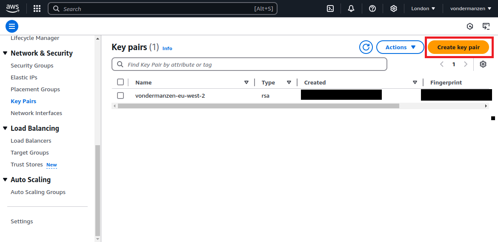

To overcome the limitations of running a local application with cloud services, we will migrate the entire image processing application to AWS, where it will be deployed and managed using Elastic Beanstalk. Migrating the application to AWS allows you to fully leverage cloud scalability, performance, and automation. Elastic Beanstalk takes care of provisioning the required infrastructure and scaling your application as needed.

## Prerequisites

In addition to the prerequisites covered in [Integrating AWS Services with the Local Application](app_remote_storage.md) (e.g., Git, Python, Pip, Docker, AWS CLI), you will also need to install and configure the **AWS Elastic Beanstalk CLI** (`awsebcli`).

> **Note:** Before setting up Elastic Beanstalk, make sure that the **AWS CLI** is installed and configured with valid credentials. This includes your **AWS Access Key ID**, **AWS Secret Access Key**, and **Default region name**. These credentials are essential for interacting with AWS services, including Elastic Beanstalk.


### Install the AWS Elastic Beanstalk CLI

Once the AWS CLI is configured, you can proceed to install the AWS Elastic Beanstalk (EB) Command Line Interface (CLI), which allows you to deploy and manage applications in Elastic Beanstalk using terminal commands.

Follow the instructions in the [official AWS Elastic Beanstalk CLI installation guide](https://docs.aws.amazon.com/elasticbeanstalk/latest/dg/eb-cli3-install.html) to install the EB CLI for your specific operating system.

Once the AWS EB CLI is installed, you can confirm the installation by running the following command in the terminal:

```bash
eb --version
```

This command should display the version of the EB CLI, indicating that the installation was successful.


### Setting Up AWS Resources

Before cloning and running the application, you need to create an S3 bucket and a DynamoDB table on AWS, as the application will use these resources for storage and metadata management.

#### 1. **Creating an S3 Bucket:**

The S3 bucket will be used to store the images uploaded by the users and processed by the application.

1. Open the AWS Management Console and navigate to the [S3 service](https://s3.console.aws.amazon.com/s3/home). Please make sure you are in the correct AWS region. You can select the region by clicking on the region dropdown in the top right corner of the console. Refer to the image below, where the region selection is highlighted with a red box for guidance on changing the region

   

2. Click on **Create bucket**. Refer to the image below if you need guidance, where the "Create bucket" option is highlighted with a red box:

   

3. Provide a unique bucket name (e.g., `ar-image-processing-bucket`). It's recommended to include your initials or another unique identifier in the bucket name to avoid naming conflicts. Refer to the image below, where the field for entering the bucket name is highlighted with a red box:

   

4. Leave the other settings as default unless you have specific requirements. These settings have been covered in detail in [Creating an S3 Bucket](app_remote_storage.md)

5. Click **Create bucket** once you're comfortable with these settings. Refer to the image below for guidance, where the "Create bucket" button is highlighted with a red box:

   

#### 2. **Creating a DynamoDB Table:**

Amazon DynamoDB will be used to store metadata related to the images. DynamoDB is a fully managed NoSQL database that is built for performance and scalability. It stores data in key-value pairs and offers flexible schemas, making it perfect for handling high-throughput tasks. DynamoDB manages millions of requests per second and includes built-in replication across various regions. It provides options for on-demand or provisioned capacity, enabling you to optimize both performance and cost.

Compared to other AWS databases, such as RDS and Aurora, which are relational databases that use SQL and are best for structured data with complex queries, DynamoDB is a NoSQL database optimized for high-speed transactions and scalability.

To use DynamoDB, you need go through the following steps:


1. Open the AWS Management Console and navigate to the [DynamoDB service](https://console.aws.amazon.com/dynamodb/home). Please make sure you are in the correct AWS region. You can select the region by clicking on the region dropdown in the top right corner of the console. Refer to the image below, where the region selection is highlighted with a red box for guidance on changing the region.

   

2. In the left panel, click on **Tables**. This will display the tables panel on the right-hand side, where you'll see a **Create table** button. Click on **Create table** to begin setting up your new table. Refer to the images below for guidance, with each relevant section highlighted in a red box:

   - 
   - 

3. Provide a table name (e.g., `ar-ImageMetadata`) and set the **Partition key** to `id` (String). It's recommended to include your initials or another unique identifier in the table name to avoid naming conflicts. Refer to the image below for guidance, where the table name and partition key fields are highlighted with a red box:

   

4. You can leave the other settings as default unless you need advanced configuration.
5. Click **Create table** to finalize the setup. Refer to the image below for guidance, where the "Create table" button is highlighted with a red box:

   


Once these resources are set up, you can proceed to clone the application and configure it to use the S3 bucket and DynamoDB table.


## Cloning the Application from GitHub

To get started with the image processing application, follow these steps to clone the repository and set it up locally:

1. Clone the repository from GitHub:
```bash
git clone https://github.com/Oxford-Research-Cloud-Competency-Centre/image-processing-cloud-app
```

2. Navigate to the project directory:
```bash
cd image-processing-cloud-app
```


Once cloned, and before running the application, you need to create a `.env` file in the root directory of the project. This file will store environment variables such as the AWS region, S3 bucket name, and DynamoDB table name. These variables will be used by the application to connect to the appropriate AWS resources and manage image storage and metadata effectively. Below are the required entries for the `.env` file:


```plaintext
REGION_NAME = 'YOUR_AWS_REGION'
S3_BUCKET = 'YOUR_AWS_S3_BUCKET_NAME'
IMAGE_METADATA_TABLE = 'YOUR_AWS_DYNAMODB_TABLE_NAME'
```

> **Note:** Please replace the values above with those specific to your AWS resources. Ensure you use the correct region, S3 bucket name, and DynamoDB table name that you created.


## Deploying the Application to AWS Elastic Beanstalk

After cloning the repository and navigating to the project directory, follow these steps to deploy the application using Elastic Beanstalk, leveraging the existing configuration files.

### Step 1: Verify Configuration Files

When deploying a Flask application to AWS Elastic Beanstalk, you need certain configuration files to set up the environment correctly and to define how AWS should handle the application and platform settings. Two essential files are **`flask.conf`** in `.ebextensions/` and **`config.yml`** in `.elasticbeanstalk/`.

1. **`flask.conf` in `.ebextensions/`**

The `.ebextensions` folder contains configuration files that AWS Elastic Beanstalk reads during deployment to customize the environment. The `flask.conf` file specifically configures the environment for running a Flask application on Elastic Beanstalk.

**Contents of `flask.conf`:**
```yaml
option_settings:
  aws:elasticbeanstalk:application:environment:
    PYTHONPATH: "/var/app/current:$PYTHONPATH"
  aws:elasticbeanstalk:container:python:
    WSGIPath: "app.app:app"
```

- **`option_settings`**: Specifies configuration options for Elastic Beanstalk.

- **`aws:elasticbeanstalk:application:environment:`**: Sets environment variables for the application. Here, the `PYTHONPATH` is set to include `/var/app/current`, ensuring that the Python environment includes the application's directory, which is essential for importing modules correctly.

- **`aws:elasticbeanstalk:container:python:`**: Configures the Python container. The `WSGIPath` option defines the entry point for the Flask application. In this case, `"app.app:app"` points to a Python file and a Flask application instance named `app` inside the `app.py` file in the `app` directory. This setting tells the web server where to find the application's entry point, allowing it to serve HTTP requests to the Flask app.

2. `config.yml` in `.elasticbeanstalk/`

The `config.yml` file within `.elasticbeanstalk/` contains settings for Elastic Beanstalk's CLI, including the application name, region, default platform, and EC2 settings. This file is essential for redeployments, ensuring consistent environment and platform settings.

**Contents of `config.yml`:**
```yaml
branch-defaults:
  default:
    environment: null
    group_suffix: null
environment-defaults:
  Image-processing-cloud-app-env:
    branch: null
    repository: null
global:
  application_name: image-processing-cloud-app
  default_ec2_keyname: ar-fsl-keypair
  default_platform: Python 3.11 running on 64bit Amazon Linux 2023
  default_region: eu-west-2
  include_git_submodules: true
  instance_profile: null
  platform_name: null
  platform_version: null
  profile: null
  sc: null
  workspace_type: Application
```

- **`branch-defaults`**: Defines default settings for any branches in version control systems (e.g., Git). Setting these to `null` here means there are no specific branch configurations.

- **`environment-defaults`**: Holds configurations for specific environment names. In this example, `Image-processing-cloud-app-env` is set, which is the name of the environment Elastic Beanstalk will deploy.

- **`global`**: Contains general settings for the application:
  - **`application_name`**: Specifies the name of the Elastic Beanstalk application (e.g., `image-processing-cloud-app`). This helps identify the app in the AWS Console.
  - **`default_ec2_keyname`**: The name of the EC2 key pair used for SSH access to application instances, here set to `ar-fsl-keypair`. You will learn to create this key pair in the next section.
  - **`default_platform`**: Defines the platform and runtime environment (Python 3.11 on Amazon Linux 2023), ensuring compatibility with the Flask app.
  - **`default_region`**: Sets the AWS region (e.g., `eu-west-2` for London), determining the location of resources.
  - **`include_git_submodules`**: When set to `true`, Elastic Beanstalk includes any Git submodules, which is helpful if the application has dependencies managed as submodules.
  - **`workspace_type`**: Indicates the type of workspace, in this case, `Application`, meaning it's an Elastic Beanstalk application workspace.

Each of these configurations ensures the application is deployed and managed predictably on Elastic Beanstalk, allowing for easier troubleshooting and a standardized setup.

### Step 1.2: Create and use your own EC2 key

Create an EC2 key and use it to replace **ar-fsl-keypair** in **config.yml**

```yaml
global:
  application_name: image-processing-cloud-app
  default_ec2_keyname: ar-fsl-keypair
```



Choose key name and settings


The key file will be downloaded when you press "Create key pair"

### Step 2: Initialize the Elastic Beanstalk Application

With your `.elasticbeanstalk/config.yml` file already configured, initializing the application is straightforward. Follow these steps:

1. Open your terminal and navigate to your project directory.
2. Run the following command to initialize the Elastic Beanstalk application:

   ```bash
   eb init
   ```

During this step, Elastic Beanstalk reads the configuration settings from `config.yml` and sets up the necessary application properties. You may be prompted to confirm some details or make minor adjustments, but no additional setup is needed.

To verify the application creation, go to the [AWS Elastic Beanstalk Console](https://console.aws.amazon.com/elasticbeanstalk). Click on **Applications** in the left panel to see the list of applications. This will display the application you have just initialized. Refer to the image below, where **Applications** is highlighted in red for guidance:


> **Note:** This step only initializes the application. It does not yet create the environment or deploy the application.

### Step 3: Create the Environment and Deploy the Application

Run the following command to create a new environment and deploy your application:

```bash
eb create image-processing-cloud-app-env 
```

This command will:

- Set up the necessary AWS resources based on your configuration, including:
  - **S3 bucket** for storing application versions.
  - **Security groups** for managing access to resources.
  - **CloudWatch logs** for monitoring and logging application activity.
  - **EC2 instance** to host the application.
  - **Load balancer** to distribute incoming traffic across multiple instances (if applicable).

> ❗ **Error:** If your account cannot use Launch Configurations, an error message may appear at this stage.  
> You can modify the command like this to force usage of Launch Templates instead:
>
> ```bash
> eb create image-processing-cloud-app-env --enable-spot
> ```
> The AWS Spot Instances feature allows users to take advantage of unused EC2 capacity at significantly reduced costs compared to On-Demand prices. However, Spot Instances can be interrupted by AWS with little notice when the capacity is reclaimed.
>
> Using AWS Spot Instances with Launch Templates solves the issue faced by new AWS accounts, which are restricted from using the older Launch Configurations. AWS has deprecated Launch Configurations in favor of Launch Templates to enable more advanced features and flexibility. New accounts are often provisioned under policies that enforce modern practices, requiring Launch Templates for any EC2 instance configuration. 

This process can take a few minutes, during which Elastic Beanstalk will provision these resources and configure the environment. Once the environment is fully set up and the application is deployed, you will see a confirmation message on the console similar to:

`2024-11-05 10:19:21 INFO Successfully launched environment: YOUR_ENVIRONMENT_NAME`

This message indicates that the environment and application are now live, and your setup is complete. This process is the initial deployment, where Elastic Beanstalk sets up and deploys your application code for the first time.

To verify the environment creation, go to the [AWS Elastic Beanstalk Console](https://console.aws.amazon.com/elasticbeanstalk). Click on **Environments** in the left panel to see the list of environments, as highlighted in red in the image below.


This view shows details such as:
- **Environment name**: The name of your environment.
- **Health status**: Displayed in green with **"OK,"** indicating that the environment is running smoothly.
- **Application name**: Associated with the environment.
- **Platform**: The platform on which the application runs.
- **Platform state**: Displays as **"Supported"** in green, meaning the platform version is actively maintained and will continue to receive updates and security patches from AWS.
- **Domain**: The unique domain endpoint for accessing the environment.
- **Running version**: The current deployed version of your application.
- **Tier name**: Typically set as "Web Server" for web applications.


These details help you monitor and confirm that your environment is correctly configured and live are are shown in the image below for your reference.

For any future updates to your application code, use the following command:

```bash
eb deploy
```

The `eb deploy` command pushes changes to your existing environment without recreating resources, allowing you to update your application efficiently.


### Step 4: Monitor and Manage the Application

Elastic Beanstalk provides several commands to help you monitor and manage your application after deployment. Use the following commands to keep track of its status, troubleshoot issues, and access it directly.

- **To check the application's status:**

 ```bash
 eb status
 ```

This command provides real-time information on the health and status of your Elastic Beanstalk environment, including details about the environment state, health, and any recent events. Use it regularly to ensure your application is running smoothly. If you prefer using the AWS console, you can also check the environment status in the [AWS Elastic Beanstalk Console](https://console.aws.amazon.com/elasticbeanstalk). Go to **Environments**, select your environment, and view the status and health details displayed on the overview page.

- **To view logs and troubleshoot:**

 ```bash
 eb logs
 ```

 This command retrieves log files from the EC2 instances in your environment. Logs can help you troubleshoot errors, review access patterns, and monitor performance metrics. For more detailed information, use `eb logs --all` to pull logs from all instances or `eb logs --zip` to download them in a compressed format for offline analysis.


- **To open the application in a browser:**

There are two ways to access your application:

1. **Directly from the Elastic Beanstalk Console**: Go to your application in the [AWS Elastic Beanstalk Console](https://console.aws.amazon.com/elasticbeanstalk) and click on the **Domain** link, highlighted in red in the image below. This link takes you directly to the URL of your environment.

   

2. **Using the EB CLI**: Run the following command in your console:

 ```bash
 eb open
 ```

This command opens your application in the default web browser, taking you directly to the URL of your environment. It's a quick way to verify that the application is accessible and running as expected.

After accessing your application, you can start using it. The application allows you to upload images, which are stored in the S3 bucket you created for this setup. Additionally, metadata associated with each image (e.g., filename, size, upload date) is saved in your DynamoDB table. This setup ensures that both the images and their metadata are stored securely and efficiently, enabling you to manage and retrieve image data through your application.


### Step 5: Terminate the Environment and Application

Once you have finished managing and monitoring your application, you must terminate the environment and remove the application completely. Follow these steps:

- **To terminate the environment:**

This will remove the running environment, including EC2 instances and other associated resources:

```bash
eb terminate
```

When you run this command, Elastic Beanstalk will prompt you to confirm the termination by typing the environment name. This step ensures the termination is intentional, as it will delete all associated resources for that environment. This process takes a few minutes to complete.

> **Note:** Terminating the environment does not delete the application itself. To fully remove the application, follow these steps in the AWS Console:

1. Go to the [AWS Elastic Beanstalk Console](https://console.aws.amazon.com/elasticbeanstalk).
2. In the left navigation panel, click on **Applications** to see a list of applications.
3. Select the application you wish to delete.
4. Click on **Actions** and choose **Delete Application**.
5. Confirm the deletion by typing the application name when prompted.

This process will permanently remove the application and all associated data in Elastic Beanstalk.

- **To terminate the environment and delete the application:**

This command will terminate all environments and delete the application along with associated versions and configurations:

```bash
eb terminate --all
```

The `--all` flag ensures that all related resources, including environments, saved configurations, and the application itself, are fully removed.

> **Note:** The `--all` flag also removes the `.elasticbeanstalk` directory, which contains your `config.yml` file. Be cautious when using this option, as any local configuration settings in `.elasticbeanstalk/config.yml` will be deleted, requiring reinitialization if you decide to recreate the application later. Therefore, it is highly recommended that you take a backup of this file or store it to git.

### Step 6: Resource Cleanup

Once you have terminated your Elastic Beanstalk environment, it's important to clean up any resources you manually created, such as the S3 bucket and DynamoDB table, as well as resources Elastic Beanstalk created to store application versions. This helps you avoid unnecessary costs. Follow the steps below to safely delete these resources.

1. **Delete the S3 Bucket (Application Storage)**:
   - Go to the [S3 console](https://s3.console.aws.amazon.com/s3/home) and locate the bucket you created specifically for storing images.
   - Select the bucket, then click on **Empty** to delete all objects within it. Refer to the image below, where the **Empty** button is highlighted in red for guidance:

     

   - After clicking **Empty**, a new page will open. To confirm, type "permanently delete" in the text input field, then click on **Empty** again to finalize. Refer to the image below for guidance, where the **confirmation field** and **Empty** button are highlighted in red:

     

   - After emptying the bucket, return to the bucket's main page and click on **Delete** to remove the bucket itself. Refer to the image below, where the **Delete** button is highlighted in red:

     

   - A new window will open. To confirm the bucket deletion, enter the bucket name in the text input field, then click on **Delete Bucket**. Refer to the image below, where the **confirmation field** and **Delete Bucket** button are highlighted in red:

     

   - **Please Note:** It may take a few moments for AWS to fully delete the bucket. Wait for a confirmation message indicating that the bucket has been deleted to ensure the resource is fully removed.

2. **Delete the Elastic Beanstalk S3 Bucket (Application Versions)**:
   Elastic Beanstalk creates an additional S3 bucket (with a name starting with `elasticbeanstalk-<region>-<account-id>`) to store application versions, logs, and other deployment artifacts. The `eb terminate` command does not delete this bucket automatically.

   > **Why is this bucket not deleted automatically?**
   > Elastic Beanstalk keeps this bucket as a safeguard against accidental data loss. This bucket stores valuable information, such as application versions and logs, which can be essential for tasks like troubleshooting, re-deployment, or audit purposes. By retaining this bucket, AWS allows users to access and manage these artifacts independently, deciding if and when to delete them based on their needs.

   To delete this bucket manually:

   1. Open the [Amazon S3 console](https://s3.console.aws.amazon.com/s3/home).
   2. Locate the bucket that begins with `elasticbeanstalk-<region>-<account-id>`.
   3. Follow the same steps as above to **Empty** and **Delete** the bucket, ensuring all deployment versions and logs are permanently removed.

   This step completes the cleanup of all Elastic Beanstalk-related resources.

3. **Delete the DynamoDB Table**:
   - Navigate to the [DynamoDB console](https://console.aws.amazon.com/dynamodb/home).
   - In the **Tables** section, locate the table you created (e.g., `ar-ImageMetadata`).
   - Select the table, then click on **Delete table** to remove it. Refer to the image below, where the **Delete table** button is highlighted in red:

     

   - After clicking **Delete table**, a new window will open asking for confirmation. Type **confirm** in the text input field, then click on the **Delete** button to finalize the deletion. Refer to the image below, where the **confirmation field** and **Delete** button are highlighted in red:

     

   - **Please Note:** It may take a few moments for AWS to fully delete the table. Wait until you see a confirmation message indicating that the table has been deleted to ensure it is completely removed.

> **Important:** Be sure to back up any necessary data from these resources before deleting them, as this action is irreversible.


