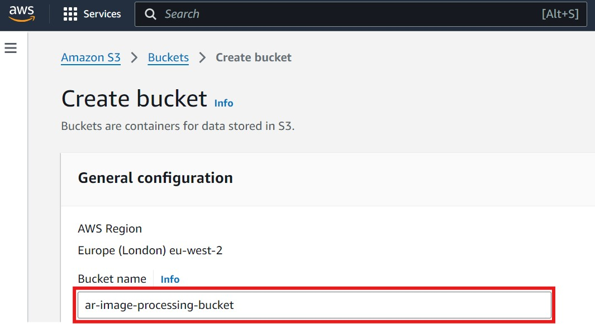
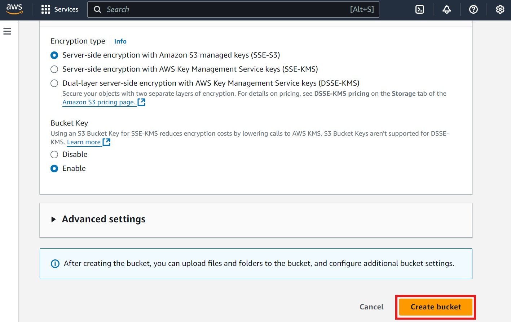
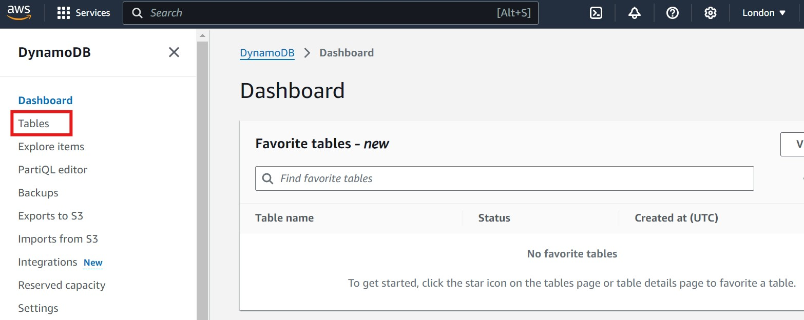
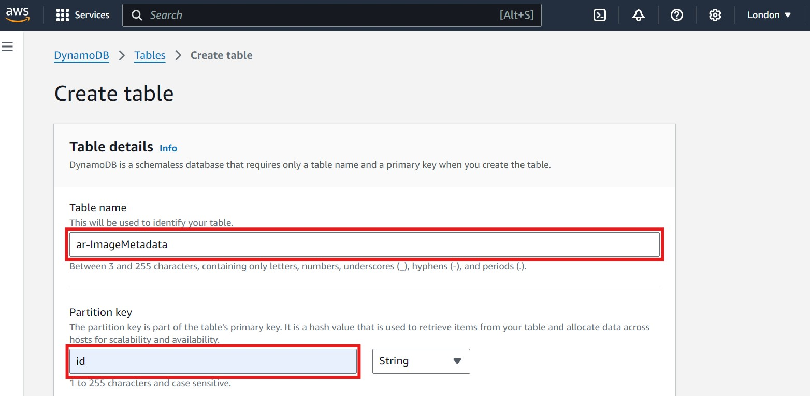
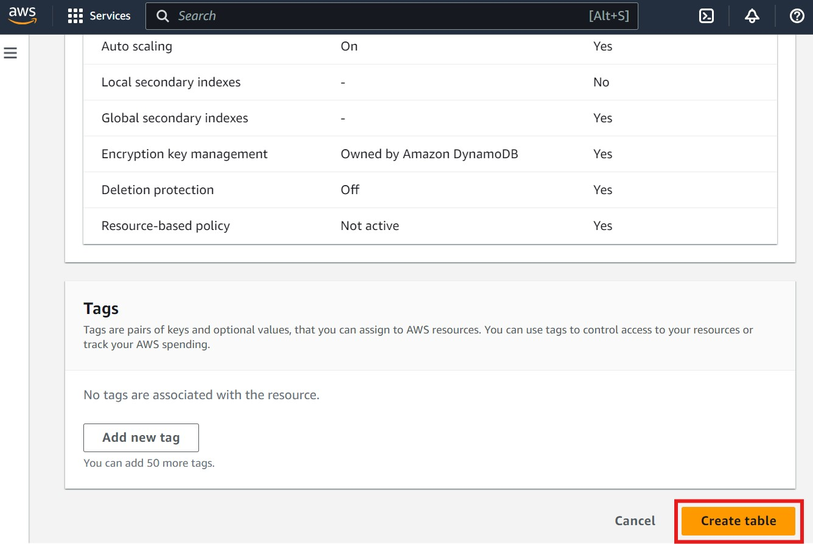
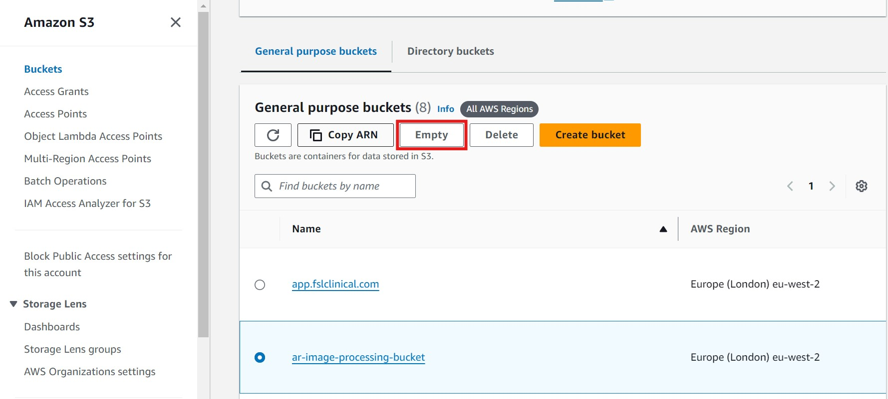
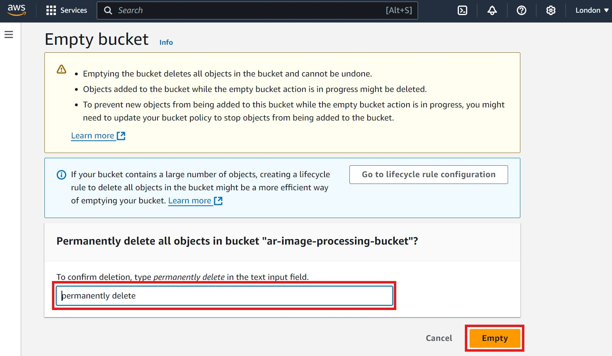
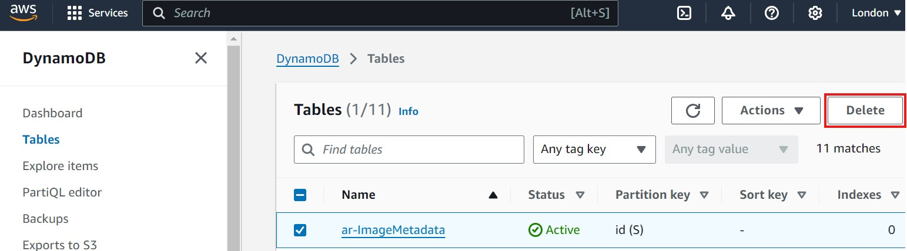

## Image Processing Application Using S3 and DynamoDB

This is a modified version of the image processing application. Instead of relying on local storage and databases, this version utilizes AWS services, specifically **S3** for image storage and **DynamoDB** for metadata management.

### Prerequisites

In addition to the prerequisites covered in [Running the Image Processing Application Locally](app_local_storage) (e.g., Git, Python, Pip, Docker, etc.), we also need to install and configure the **AWS Command Line Interface (CLI)** to enable interaction with AWS services.

#### Step 1: Install the AWS CLI

The AWS Command Line Interface (CLI) allows you to interact with AWS services from your local machine using commands in the terminal. Depending on your operating system (OS), follow the instructions in this [AWS CLI installation guide](https://docs.aws.amazon.com/cli/latest/userguide/getting-started-install.html) to install the AWS CLI. Once the AWS CLI is installed, you can confirm the installation by running the following command in the terminal:

```bash
aws --version
```

#### Step 2: Configure the AWS CLI

After installation, you need to configure the AWS CLI with your credentials so that it can interact with your AWS account. To accomplish that, you need to confure the following steps:

1. Open a terminal or Command Prompt and run the following command:

   ```bash
   aws configure
   ```

1. You will be prompted to enter the following information:

- **AWS Access Key ID:** This is a key that allows you to access AWS services. You can obtain it by logging into the AWS Management Console, navigating to Identity and Access Management (IAM), and creating a new user with programmatic access. Once created, the Access Key ID will be provided to you.

  

- **AWS Secret Access Key:** This is the secret part of the Access Key pair. It's provided along with the Access Key ID when you create the user with programmatic access. Ensure you store this key securely, as you won't be able to view it again.

- **Default region name:** This is the AWS region where you want your AWS services to operate. Examples include:

  - `eu-west-1` (Ireland)
  - `eu-west-2` (London)
  - `eu-west-3` (Paris)

- **Default output format:** Choose how you want the CLI to display the results. Options include json, text, and table.

  Example input:

  ```bash
  AWS Access Key ID [None]: AAKIEXAMPLE
  AWS Secret Access Key [None]: wJalFEMI/K7MDENG/bPxRfiCYEXAMPLEKEY
  Default region name [None]: eu-west-2
  Default output format [None]: json
  ```

#### Step 3: Test the Configuration

To verify that the AWS CLI is correctly configured, try listing your S3 buckets:

```bash
aws s3 ls
```

If the configuration is successful, you will see a list of your S3 buckets. As you have not created any bucket yet, it will show an empty list. If there are any issues, you will likely see an error message indicating the problem.

### Setting Up AWS Resources

Before cloning and running the application, you need to create an S3 bucket and a DynamoDB table on AWS, as the application will use these resources for storage and metadata management.

#### 1. **Creating an S3 Bucket:**

The S3 bucket will be used to store the images uploaded by the users and processed by the application.

1. Open the AWS Management Console and navigate to the [S3 service](https://s3.console.aws.amazon.com/s3/home). Please make sure you are in the correct AWS region. You can select the region by clicking on the region dropdown in the top right corner of the console. Refer to the image below, where the region selection is highlighted with a red box for guidance on changing the region.

   

2. Click on **Create bucket**. Refer to the image below if you need guidance, where the "Create bucket" option is highlighted with a red box:

   

3. Provide a unique bucket name (e.g., `ar-image-processing-bucket`). It's recommended to include your initials or another unique identifier in the bucket name to avoid naming conflicts. Refer to the image below, where the field for entering the bucket name is highlighted with a red box:

   

4. Leave the other settings as default unless you have specific requirements. However, it's important to understand and consider the following options:

   - **Object Ownership** defines the access control behavior for objects uploaded to the bucket. By default, Amazon disables Access Control Lists (ACLs), which is the recommended approach for most use cases as it simplifies permissions management. Disabling ACLs ensures that the bucket owner automatically owns all objects, even if they are uploaded by different AWS accounts.

   - **Block Public Access** settings are critical for securing your bucket. By default, _Block all public access_ is selected, which is highly recommended unless you need to expose objects publicly. This setting prevents any accidental exposure of sensitive data stored in the bucket.

   - **Bucket Versioning** is disabled by default. Enabling versioning allows you to retain multiple versions of an object, which is useful for backup and recovery scenarios. If versioning is important to your use case, you can enable it after creating the bucket.

   - **Server-Side Encryption (SSE)** is automatically applied to new objects stored in the bucket. By default, **SSE-S3** (Server-Side Encryption with Amazon S3 managed keys) is selected. This ensures that your data is encrypted at rest without requiring you to manage encryption keys.

   You also have the option to choose:

   - **SSE-KMS**: Server-side encryption with AWS Key Management Service (KMS) keys, which allows you to have more control over encryption keys.
   - **DSSE-KMS**: Dual-layer encryption using AWS KMS keys for even greater security. This option applies two separate layers of encryption to your data, although it might incur additional costs.

   - **Bucket Key**

     If you select **SSE-KMS**, you will also have the option to enable the **S3 Bucket Key**, which reduces the cost of encryption by minimizing calls to AWS KMS. Enabling S3 Bucket Keys can optimize costs when encrypting large volumes of data. This option is automatically enabled by default but can be disabled if necessary. Note that it is not supported for DSSE-KMS.

5. Click **Create bucket** once you are comfortable with these settings. Refer to the image below for guidance, where the "Create bucket" button is highlighted with a red box:

   

#### 2. **Creating a DynamoDB Table:**

The DynamoDB table will be used to store metadata related to the images.

1. Open the AWS Management Console and navigate to the [DynamoDB service](https://console.aws.amazon.com/dynamodb/home). Please make sure you are in the correct AWS region. You can select the region by clicking on the region dropdown in the top right corner of the console. Refer to the image below, where the region selection is highlighted with a red box for guidance on changing the region.

   

1. In the left panel, click on **Tables**. This will display the tables panel on the right-hand side, where you will see a **Create table** button. Click on **Create table** to begin setting up your new table. Refer to the images below for guidance, with each relevant section highlighted in a red box:

   - 
   - 

1. Provide a table name (e.g., `ar-ImageMetadata`) and set the **Partition key** to `id` (String). It's recommended to include your initials or another unique identifier in the table name to avoid naming conflicts. Refer to the image below for guidance, where the table name and partition key fields are highlighted with a red box:

   

1. You can leave the other settings as default unless you need advanced configuration.
1. Click **Create table** to finalize the setup. Refer to the image below for guidance, where the "Create table" button is highlighted with a red box:

   

Once these resources are set up, you can proceed to clone the application and configure it to use the S3 bucket and DynamoDB table.

### Cloning the Application from GitHub

To get started with the image processing application, follow these steps to clone the repository and set it up locally:

1. Clone the repository from GitHub:

   ```bash
   git clone https://github.com/Oxford-Research-Cloud-Competency-Centre/image-processing-hybrid-app
   ```

1. Navigate to the project directory:

   ```bash
   cd image-processing-hybrid-app
   ```

Once cloned, and before running the application, you need to create a `.env` file in the root directory of the project. This file will store environment variables such as the AWS region, S3 bucket name, and DynamoDB table name. These variables will be used by the application to connect to the appropriate AWS resources and manage image storage and metadata effectively. Below are the required entries for the `.env` file:

```plaintext
REGION_NAME = 'YOUR_AWS_REGION'
S3_BUCKET = 'YOUR_AWS_S3_BUCKET_NAME'
IMAGE_METADATA_TABLE = 'YOUR_AWS_DYNAMODB_TABLE_NAME'
```

> **Note:** Please replace the values above with those specific to your AWS resources. Ensure you use the correct region, S3 bucket name, and DynamoDB table name that you created.

### Running the Application

The application can be run in two different ways, depending on your setup:

#### 1. **Running Locally with Python:**

To run the application locally on your system:

1. Make sure the repository is cloned and you are inside the home directory of the application.
1. Install the necessary Python dependencies:

   ```bash
   pip install -r requirements.txt
   ```

1. Run the Flask application:

   ```bash
   python -m app.app
   ```

The application will be accessible at `http://localhost:5000`

#### 2. **Running with Docker:**

Alternatively, you can run the application inside a Docker container:

1. Build the Docker image:

   ```bash
   docker build -t image-processing-hybrid-app .
   ```

1. Run the Docker container:

   ```bash
   docker run -p 5000:5000 -e AWS_ACCESS_KEY_ID=your_access_key -e AWS_SECRET_ACCESS_KEY=your_secret_key -e AWS_DEFAULT_REGION=your_aws_region image_processing_cloud_app_local
   ```

   You can retrieve your AWS credentials (e.g., AWS_ACCESS_KEY_ID, AWS_SECRET_ACCESS_KEY, and AWS_DEFAULT_REGION) by checking your ~/.aws/credentials file. Your application inside the container can now access these credentials from the environment variables, and AWS SDKs will automatically pick them up.

This will make the application available at `http://localhost:5000`, without the need to install Python or any other dependencies directly on your machine.

### Resource Cleanup

Once you've set up and used the S3 and DynamoDB resources for this application, it's important to clean up these resources to avoid unnecessary costs. Follow the steps below to delete the resources.

1. **Delete S3 Bucket**:

   - Go to the [S3 console](https://s3.console.aws.amazon.com/s3/home) and locate the bucket you created for this application.
   - Select the bucket, then click on **Empty** to delete all objects within the bucket. Refer to the image below, where the **Empty** button is highlighted in red for guidance:

     

   - After clicking **Empty**, a new page will open. To confirm deletion, type "permanently delete" in the text input field, then click on **Empty** again to finalize. Refer to the image below for guidance, where the **confirmation field** and **Empty button** are highlighted in red:

     

   - After emptying the bucket, return to the bucket's main page and click on **Delete** to remove the bucket itself. Refer to the image below, where the **Delete** button is highlighted in red:

     

   - A new window will open. To confirm the bucket deletion, enter the bucket name in the text input field, then click on **Delete Bucket**. Refer to the image below, where the **confirmation field** and **Delete Bucket** button are highlighted in red:

     

   - **Please Note:** It may take a few moments for AWS to fully delete the bucket. Wait until you see a confirmation message indicating that the bucket has been deleted to ensure the resource is fully removed.

2. **Delete DynamoDB Table**:

   - Navigate to the [DynamoDB console](https://console.aws.amazon.com/dynamodb/home).
   - In the **Tables** section, locate the table you created (e.g., `ar-ImageMetadata`).
   - Select the table, then click on **Delete table** to remove it. Refer to the image below, where the **Delete table** button is highlighted in red:

     

   - After clicking **Delete table**, a new window will open asking for confirmation. Type **confirm** in the text input field, then click on the **Delete** button to finalize the deletion. Refer to the image below, where the **confirmation field** and **Delete** button are highlighted in red:

     

   - **Please Note:** It may take a few moments for AWS to fully delete the table. Wait until you see a confirmation message indicating that the table has been deleted to ensure the resource is completely removed.

:::callout{variant="note"}
Ensure you have backed up any necessary data from these resources before deleting them, as this action is irreversible.
:::
