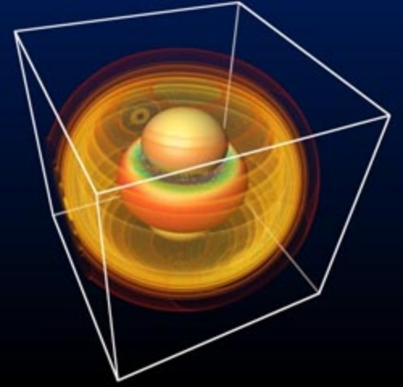
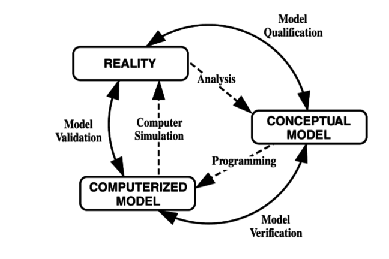
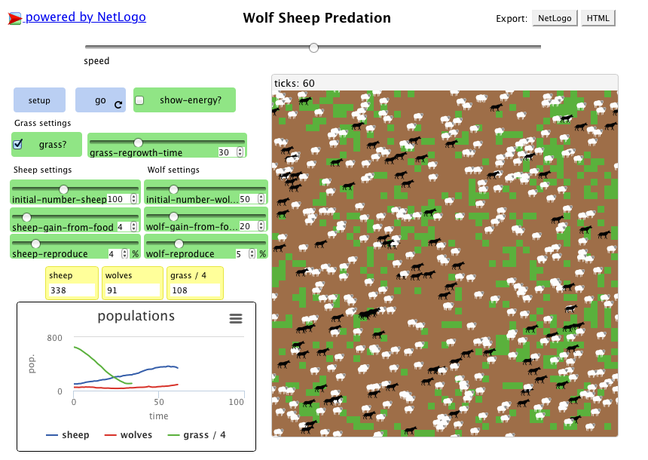
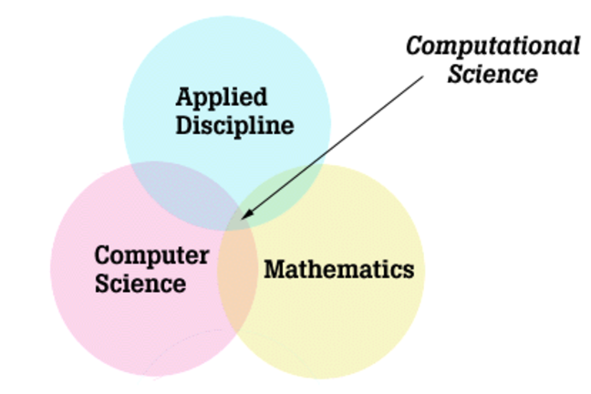

## Computer simulations

How many people haven’t heard about computer simulations? Few, if any. After all, the term has become a part of popular culture. Some people are even suggesting that we are living in a Matrix-style computer simulation. But how many people actually understand what a computer simulation is? Do you?

In the English language, the word simulate originally meant to imitate the appearance or character of and was derived from the Latin simulat, which meant copied or represented. A modern dictionary also states that the word simulation may refer to the representation of the behaviour or characteristics of one system through the use of another system. This is precisely what computer simulations are meant to do.

In a strict sense, a computer simulation is a program run on a computer, which step by step explores the behaviour of a real-world system, which is represented as a mathematical model. In other words, a simulation is an act of running a model representing the system of interest. More broadly speaking, computer simulations are an entire, comprehensive process for studying systems. This process includes choosing a model, implementing it, calculating the output and processing the resultant data, for example by visualising them.

By definition a mathematical model is a simplification of reality. Typically, it is impossible to perfectly capture all the components of a system and their interaction. In fact, more often than not, it would not be a useful thing to do. Think about it - if you could simulate something well enough in about 5 minutes, would you want to spend 5 days to do it perfectly?

For simulations like weather forecasting, or wildfire modelling, the time-to-solution should to be as short as possible. In other cases, you may not care about how long it takes to reach the solution, but what about the required computing power and associated costs? Computer simulations are very much about tradeoffs: time-to-solution, performance and computational cost vs. scientific usefulness.

Moreover, regardless of how complex a model is, the actual physical system will always contain phenomena that are not represented in the model. This is not a problem, as long as the model still provides insight into the behaviour of the system. That’s why a truly useful model should be able to determine all relevant behaviour and properties of the studied system using a relatively small number of variables and relations between them. The predictive power of a model does not directly depend on its completeness or complexity but on its ability to correctly identify the dominant controlling factors and hence, the necessary approximations.

Now, how one goes about creating a model and a simulation? Any ideas?

---

*© 1979 by Simulation Councils, Inc.*

## Errors and approximations

In this section we will discuss the steps involved in creating a computer simulation. Do not worry if you have trouble understanding some of the terms or concepts at the moment, hopefully everything will become clear by the end of the next step.

The diagram that you can see at the top of the page was developed by the Technical Committee on Model Credibility of the Society for Computer Simulation in 1979. The technology has advanced, but our approach to modelling and simulations has not changed that much. After all, the relation between model and simulation and their link to reality is still the same.

It is important to note that each of these steps requires some sort of approximation and is prone to errors and uncertainties. The first step - analysis of the physical system and creation of its model - is purely conceptual so no mathematical equations are involved and emphasis is put on determining all possible factors, and deciding which components and interactions are crucial, and which can be neglected.

### Uncertainties

A special treatment is given to the elements of a system that need to be treated as nondeterministic, which simply means that their behaviour is not precisely predictable. In nondeterministic simulations the same input can produce different outputs. This unpredictability may be a result of inherent variations of the physical system, any potential inaccuracy stemming from the lack of knowledge, or human interaction with the system. All of these are sources of a system uncertainties and should be taken into consideration in the mathematical description of the system.

The transition between the conceptual and mathematical model involves capturing the interactions of the relevant components in a set of equations, and determining the boundary and initial conditions. The next step ensures that discrete mathematics is used - i.e. continuous equations are approximated by small and distinct steps so that computers can deal with them one by one.

Once an appropriate algorithm (a set of rules and methods used to solve the problem) has been decided on, the model is implemented and errors start creeping in. By errors we mean inaccuracies that are not caused by the lack of knowledge. Some of them may be due to a programmer’s mistakes and others are related to the numeric precision.

### Rounding Error

Rounding errors, errors that arise due to this limit of numerical precision, occur because the number of digits that can be used to represent a real number on a computer is limited by the finite number of memory bits that are allocated to store that number.
Therefore, numbers that require more digits to be expressed (sometimes an infinite number!) end up being rounded - they are just approximations of the numbers they are meant to represent. This difference between the real number and its approximation is referred to as the rounding error. The vast majority of numbers need to be approximated.

When operations are performed on approximated numbers, the resulting values are also approximations.
Over time, these rounding errors can accumulate, significantly impacting the accuracy of simulation results.
This issue becomes even more pronounced in parallel computing, where the order in which partial results (computed by individual processes) are combined affects the final outcome.
Due to rounding errors, combining these partial results in a different sequence can lead to slight variations in the result.

The aim of the verification stage is to ensure that the model is implemented correctly, and each part of the simulation does exactly what is expected of it.
Most of the errors should be discovered and fixed at this stage.
The aim of the validation stage is to ensure that, for its intended purpose, the simulation is sufficiently close to reality.
Often it is possible to know the accuracy of an algorithm in advance, or even to control the accuracy of your simulation during execution to meet a chosen standard, this is especially true if using standard algorithms to perform your calculations.

The key point to remember about models, and hence simulations, is that although they simplify and idealise, they are still able to tell us something about the nature of the system they describe.

Think back to our toy traffic model, how many approximations, uncertainties or potential sources of errors can you think of?

:::callout{variant="tip"}
Errors introduced by numerical precision can not be eliminated but they can be mitigated, appropriate choices of step sizes, appropriate normalisation of your variables to avoid overly large or small numbers (both of which cause larger rounding errors), appropriate algorithm choices and etc.

It is important to not only be aware of this source of error but also be aware of their size and use relevant strategies to reduce them if they are too large.
:::

---

*Image courtesy of [Andrea Lightfoot](https://unsplash.com/@andreaelphotography) from [Unsplash](https://unsplash.com)*

## Wolf-sheep predation simulation

In this step we are going to use the wolf-sheep predation model to illustrate how models and simulations work. Hopefully, this will allow you to better understand the concepts introduced in the previous steps.

There are two main variations to this model.

In the first variation, wolves and sheep wander randomly around the landscape, while the wolves look for sheep to prey on. Each step costs the wolves energy, and they must eat sheep in order to replenish their energy - when they run out of energy they die. To allow the population to continue, each wolf or sheep has a fixed probability of reproducing at each time step. This variation produces interesting population dynamics, but is ultimately unstable, i.e. one or other population tends to die out.

The second variation includes grass (green) in addition to wolves and sheep. The behavior of the wolves is identical to the first variation, however this time the sheep must eat grass in order to maintain their energy - when they run out of energy they die. Once grass is eaten it will only regrow after a fixed amount of time. This variation is more complex than the first, but it is generally stable.

To play with the model, or to have a look at the code, go to the Modelling Commons page dedicated to the [wolf-sheep model](http://modelingcommons.org/browse/one_model/1390#model_tabs_browse_nlw) and first click on the SETUP button and then on the GO button. For more information on the model see the INFO tab.

We know that the web version of the model works on Chrome and Safari browsers. If you cannot get it to work on your browser you can try downloading the netlogo software from [here](https://ccl.northwestern.edu/netlogo/s). It comes with a library full of interesting models and the wolf-sheep model can be found under the biology section.

The wolf-sheep model is very simplistic and would not be useful in studying the actual dynamic between both populations, but it is good enough to illustrate some of the concepts we covered in the previous step.

### Uncertainties

When we were talking about nondeterministic characteristics of the systems we mentioned uncertainties and other factors that could impact our conceptual model of the systems. Clearly, the wolf-sheep predation model ignores all of the nondeterministic aspects of the systems, for example:

- What happened to the meteorological seasons? Surely, no one needs convincing that a harsh and longer than usual winter would affect both animal populations negatively, right? The seasons could be considered as one of the inherent variations of the system - they always happen but with a varying duration and intensity;
- What about the health state of both populations? If either of the populations was infected with some disease it would have a great impact on the other but it may not manifest immediately - hence, our lack of knowledge;
- Or what would happen if annoyed shepherds decided to deal with the wolves? There is no easy way of predicting the extent of human intervention.

Does that give you a better idea of what uncertainties are? Can you think of any other sources of uncertainties in this model?

© Modelling Commons - 1997 Uri Wilensky

---

*Image courtesy of [Steven Lelham](https://unsplash.com/@slelham) from [Unsplash](https://unsplash.com)*

## Wolf-sheep predation simulation - Initial and Boundary Conditions

Other concepts that we have not talked about yet, are boundary and initial condition. In order to discuss these concepts we would like you to explore how they affect the wolf-sheep predation model.

In this case the boundary conditions define what happens to wolves and sheep that get to the edge of the area covered by the simulation. Try to stop the simulation when one of the animals is about to go out of the frame. Did you notice that it appears immediately on the opposite side of the frame? This behaviour is due to the periodic boundary conditions.

As you know, initial conditions refer to the parameters you choose before running the simulation e.g. the initial number of wolves and sheep, the grass regrow period and the reproduction rates of both populations.

To understand the importance of choosing the right input parameters, and see the difference even the smallest variation can produce, you are encouraged to play with the values of different parameters.
Try to find values of parameters that:

- Allow both populations to be stable (i.e. neither population is dying out) even after 1000 time steps.
- Allow the sheep population to die out.
- Allow the wolf population to die out.

:::callout{variant="discussion}
:::callout{variant="discussion}
How difficult was it to find the sets of parameters to meet the conditions? Have you noticed anything unexpected?
:::
:::

---

## Terminology Recap

::::challenge{id=comp_sim_intro.1 title="Computer Simulations Q1"}
A ____ ____ is a description of a physical system using mathematical concepts and language, and an act of running such model on a computer is called
____ ____ . It is not possible for a model to capture all physical phenomena, therefore they are ____ as best as possible.

:::solution
A) mathematical model

B) computer simulation

C) approximated
:::
::::

::::challenge{id=comp_sim_intro.2 title="Computer Simulations Q2"}
The inaccuracies that are not caused by the lack of knowledge are known as
____ . The difference between the real number and its approximation is referred to as the
____ ____ .

:::solution
A) errors

B) rounding error
:::
::::

---

## Computational Science

Computational science is a rapidly growing interdisciplinary field. There are many problems in science and technology that cannot be sufficiently studied experimentally or theoretically. It may be too expensive or too dangerous, or simply impossible due to the space and timescales involved.

In fact, computational science is considered by many to be a third methodology in scientific research, along with theory and experiment, and working in tandem with them. Computational science can be used to corroborate theories that cannot be confirmed or denied experimentally, for example theories relating to the creation of the universe. On the other hand, advances in experimental techniques and the resulting data explosion, allow for data-driven modelling and simulation.

You should not confuse computational science, which uses computational methods to deal with scientific problems, and computer science, which focuses on the computer itself. Having said that, computational science draws upon computer science, as well as upon mathematics and applied sciences. Computational science typically consists of three main components:

1. algorithms and models
1. software developed to solve problems and
1. the computer and information infrastructure e.g. hardware, networking and data management components.

Clearly, computational science is an intersection between mathematics, applied disciplines and computer science.

Some of the disciplines traditionally associated with computational science include: atmospheric sciences (e.g. weather forecasting, climate and ocean modelling, seismology etc.), astrophysics, nuclear engineering, chemistry, fluid dynamics, structural analysis and material research. It’s easy to see why these disciplines were quick to take up computational science.

Other disciplines, such as medicine (e.g. medical imaging, blood flow simulations, bone structure simulations), biology (e.g. ecosystem and environmental modelling) and economics are embracing computational science as well.
It has become quite common to come across terms like computational economics or computational biology.

Even more recently, advances in machine learning has led to an entirely new subfield of computational science and its application across a huge range of disciplines.

:::callout{variant="discussion"}
If you want to know what sorts of applications are run on the UK’s national supercomputer ARCHER2, visit the relevant page on the ARCHER2 website. Is there anything that surprises you there?
:::

---

*Image courtesy of [Laurin Steffens](https://unsplash.com/@lausteff) from [Unsplash](https://unsplash.com)*

## Why use supercomputers?

In this exercise we want you to have a look at three examples of computer simulations and answer the following questions:

- In your opinion, what are three main reasons for using supercomputers in science and industry?
- Can you think of any problems that are still too difficult to be solved with our current computing technology?
  
The excerpts below are from three different projects involving computer simulations, and should provide you enough food for thought.

### Protein Folding

(The Folding@Home Project page can be found [here](https://foldingathome.org/dig-deeper/?lng=en-UK)):

“Proteins are necklaces of amino acids — long chain molecules. They come in many different shapes and sizes, and they are the basis of how biology gets things done. As enzymes, they are the driving force behind all of the biochemical reactions which make biology work. As structural elements, they are the main constituent of our bones, muscles, hair, skin and blood vessels. As antibodies, they recognize invading elements and allow the immune system to get rid of the unwanted invaders. They also help move muscles and process the signals from the sensory system. For these reasons, scientists have sequenced the human genome — the blueprint for all of the proteins in biology — but how can we understand what these proteins do and how they work?

However, only knowing this amino acid sequence tells us little about what the protein does and how it does it. In order to carry out their function (e.g. as enzymes or antibodies), they must take on a particular shape, also known as a fold. Thus, proteins are truly amazing machines: before they do their work, they assemble themselves! This self-assembly is called folding. Out of an astronomical number of possible ways to fold, a protein can pick one in microseconds to milliseconds (i.e. in a millionth to a thousandth of a second). How a protein does this is an intriguing mystery.”

The Folding@Home project is actually an example of a distributed computing project. The project makes use of idle processing resources of personal computers owned by people who voluntarily installed the project software on their systems. Nevertheless, supercomputers are used as well to simulate protein folding. If you are interested, you can read about the ANTON supercomputer and what it does in a Nature article.

### Recreating the Big Bang

(The Illustris project page can be found [here](http://www.illustris-project.org/)):

“The Illustris project is a set of large-scale cosmological simulations, including the most ambitious simulation of galaxy formation yet performed. The calculation tracks the expansion of the universe, the gravitational pull of matter onto itself, the motion or “hydrodynamics” of cosmic gas, as well as the formation of stars and black holes. These physical components and processes are all modeled starting from initial conditions resembling the very young universe 300,000 years after the Big Bang until the present day, spanning over 13.8 billion years of cosmic evolution. The simulated volume contains tens of thousands of galaxies captured in high-detail, covering a wide range of masses, rates of star formation, shapes, sizes, and with properties that agree well with the galaxy population observed in the real universe.”

### Weather modelling

(More information about ensemble forecasting done by the UK Met Office can be found [here](https://www.metoffice.gov.uk/research/weather/ensemble-forecasting/what-is-an-ensemble-forecast)):

“A forecast is an estimate of the future state of the atmosphere. It is created by estimating the current state of the atmosphere using observations, and then calculating how this state will evolve in time using a numerical weather prediction computer model. As the atmosphere is a chaotic system, very small errors in its initial state can lead to large errors in the forecast.

This means that we can never create a perfect forecast system because we can never observe every detail of the atmosphere’s initial state. Tiny errors in the initial state will be amplified, so there is always a limit to how far ahead we can predict any detail. To test how these small differences in the initial conditions may affect the outcome of the forecast, an ensemble system can be used to produce many forecasts.”

---

*Image courtesy of [Brett Jordan](https://unsplash.com/@brett_jordan) from [Unsplash](https://unsplash.com)*

## Simulation steps

In the previous steps we discussed briefly what simulations are and how they are created. However, most of the time people using simulations in their work do not actually write them, they simply make use of already existing pieces of software. From the user perspective, the simulation process can be thought of as consisting of three linked steps: pre-processing, running of a simulation and post-processing.

### Pre-processing

The pre-processing stage takes care of the model settings and input data. Different simulations require different inputs - simple models do not require much input (e.g. our traffic and wolf-sheep predator models), but most of the useful simulations deal with a large amount of data. Usually, the input data comes from real-world observations, measurements and experiments. Let us take weather modelling as an example. How do you think numerical weather prediction works?

To make a forecast it is necessary to have a clear picture of the current state of the atmosphere and the Earth’s surface. Moreover, the quality of the forecast strongly depends on how well the numerical model can deal with all this information. Now, where do all these data points come from? They are gathered by various weather stations, satellite instruments, ships, buoys… and so on.

It’s not hard to imagine that all of these may record and store their measurements differently. That is why the pre-processing step is necessary - it prepares the data for further procedures, so that they can be easily and effectively used. This may mean simply making sure all the data is in the same format, and there are no invalid data entries, or performing more complicated operations such as removing noise from data, or normalising the data sets. The pre-processing stage ends when a simulation is ready to be launched.

### Execution

Quite often, especially on a large machines, once the simulation has been started it runs until the end or until a certain, significant point in a calculation (we call these checkpoints) has been reached, and only then the output is produced. We have mentioned the batch submission procedure in earlier weeks, but just to reiterate - once an user submits their executable along with required input files to the submission queue, the job gets scheduled by a job scheduler, and some time later it runs and generates its output. In other words, you do not really see what is happening in the simulation and cannot interact with it.

There are a number of reasons why supercomputing facilities use this approach but the main ones are:

1) a machine is a shared resource but most users want/need an exclusive access to the compute resources;
2) most of the applications are written in a way that require dedicated resources to scale efficiently;
3) the whole system must be utilised as fully as possible (even during weekends and public holidays!) otherwise its resources are being wasted.

The point is that real-time visualisations (in situ visualisations), although slowly making their appearance, are not really used in a large scale simulations run on supercomputers. Downloading data to off-site locations (i.e. off the compute nodes of a supercomputer) allows interactive visualisations to be performed, without issues caused by limiting batch-mode workflows necessary on supercomputers. This means that to see what has happened during the simulation, i.e. to create a step-by-step visualisation of the simulation, it is necessary to save a lot of data at each time step.

### Post-processing

The post-processing stage extracts the results of the simulation and puts them into a usable form. Initially, the typical output of any kind of simulation was simply a string of numbers, presented in a table or a matrix, and showing how different parameters changed during the simulations. However, humans are not very good at interpreting numbers. It is much easier to understand the results presented using graphs and animations, than to scan and interpret tables of numbers.

For example, in weather forecasting it is common to show the movement of rain or clouds over a map showing geographical coordinates and timestamps. Nowadays, it is common for the simulation outputs to graphically display large amounts of data.

What do you think may be required to perform the pre- and post-processing steps? Do you think they have to be done on the same machine the simulation is run on? Do you think these steps have different hardware or software requirements than the execution step?

---

## Questions on Computer Simulations

::::challenge{id=comp_sim_intro.3 title="Computer Simulations Q3"}
What are the main reasons for running computer simulations on supercomputers?

Select all the answers you think are correct.

A) to solve larger or more complex problems

B) to solve problems faster

C) it’s often cheaper than carrying out experiments

D) computer simulations may be the only way of studying some problems

:::solution
All are correct!

Think of time and cost benefits of using computer simulations over other methods and means of doing science.

Correct! - Having more computational power means you can tackle larger or more complex problems in a relatively short amount of time.

Correct! - in most simulations directly linked to our everyday lives (e.g. weather forecasting, medical modelling) the time-to-solution is very important. Being able to solve problems faster is important.

Correct! - if you need to test hundreds of different problem settings it’s often cheaper to run hundreds of simulations than carry out hundreds of experiments.

Correct! - problems dealing with extremely small or large time and space-scales are often difficult, if not impossible to study otherwise.
:::
::::

::::challenge{id=comp_sim_intro.4 title="Computer Simulations Q4"}
Which of the following statements about simulations and models are true?

A) a simulation is an act of running a model

B) a model is an exact representation of reality

C) a model should always capture all interactions between the components of the system it models

D) all of the above are true

:::solution

A)

Think about the relation between a model, simulation and reality.

Correct! - the execution of mathematical model on a computer is called simulation

:::
::::

::::challenge{id=comp_sim_intro.5 title="Computer Simulations Q5"}
Which of the following aspects of a computer simulation are never approximated?

A) interactions between the system’s components

B) initial and boundary conditions

C) numerical values of simulation variables during the simulation run

D) none of the above

:::solution

D)

Think about why approximations are necessary.

Correct! - above approximations are necessary to allow computer simulations to study the behaviour of systems in time and cost effective manner.

:::
::::

::::challenge{id=comp_sim_intro.6 title="Computer Simulations Q6"}
Which of the following statements about computational science are true?

Select all the answers you think are correct.

A) computational science can be considered to be an intersection between mathematics, computer science and applied disciplines

B) computational science is a rigid discipline, which is not evolving in time

C) only classical fields like physics and chemistry are making use of computational science

D) computational science is focused on using computational methods to solve scientific problems

:::solution
A) and D)

Think about what computational science is and how and when it came about.

Correct! - computational science draws upon these three fields to solve scientific problems.

Correct! - solving scientific problems is the main goal of computational science, and computational methods are tools used to achieve that.
:::
::::

::::challenge{id=comp_sim_intro.7 title="Computer Simulations Q7"}
Which of the following statements about computer simulations are true?

A) pre- and post-processing steps of computer simulations are not very important

B) computer simulations are usually run interactively on supercomputers

C) the pre-processing step usually prepares initial parameters and data, and the post-processing step puts the results in a more usable formats

D) all of the above

:::solution
C)

Think about what computer simulations are meant to do and how they do it.

Correct! - pre-processing is necessary to ensure that simulation is run with correct settings; post-processing makes sure that the simulation’s output is readable or ready for further processing.
:::
::::
