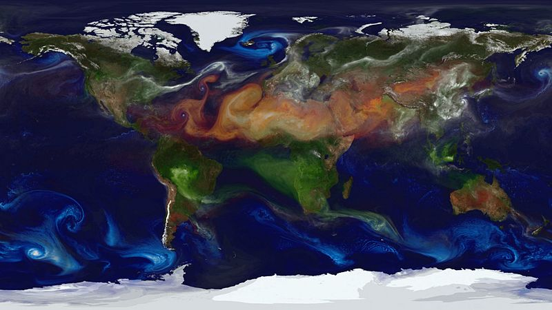
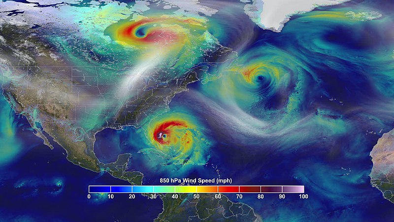
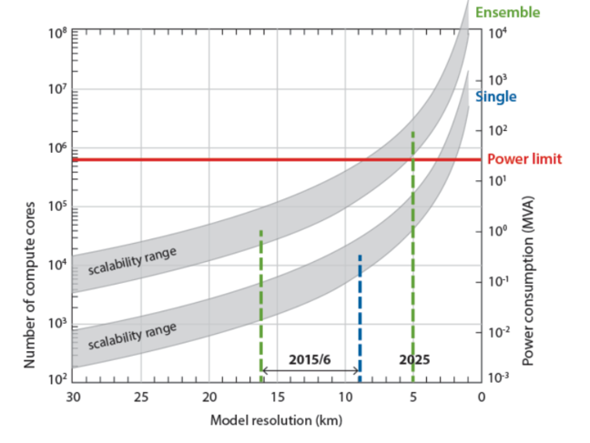

# Weather simulations

## Predicting Weather and Climate

In this short PRACE video, Prof. Pier Luigi Vidale talks about possibilities and challenges of weather and climate simulations.

::::iframe{id="kaltura_player" width="100%" height="400" src="https://cdnapisec.kaltura.com/p/2010292/sp/201029200/embedIframeJs/uiconf_id/32599141/partner_id/2010292?iframeembed=true&playerId=kaltura_player&entry_id=1_ojrnelre&flashvars[streamerType]=auto&amp;flashvars[localizationCode]=en&amp;flashvars[leadWithHTML5]=true&amp;flashvars[sideBarContainer.plugin]=true&amp;flashvars[sideBarContainer.position]=left&amp;flashvars[sideBarContainer.clickToClose]=true&amp;flashvars[chapters.plugin]=true&amp;flashvars[chapters.layout]=vertical&amp;flashvars[chapters.thumbnailRotator]=false&amp;flashvars[streamSelector.plugin]=true&amp;flashvars[EmbedPlayer.SpinnerTarget]=videoHolder&amp;flashvars[dualScreen.plugin]=true&amp;flashvars[Kaltura.addCrossoriginToIframe]=true&amp;&wid=1_riytah2w" allowfullscreen webkitallowfullscreen mozAllowFullScreen allow="autoplay *; fullscreen *; encrypted-media *" sandbox="allow-downloads allow-forms allow-same-origin allow-scripts allow-top-navigation allow-pointer-lock allow-popups allow-modals allow-orientation-lock allow-popups-to-escape-sandbox allow-presentation allow-top-navigation-by-user-activation" frameborder="0" title="Predicting_weather_Climate_hd"}
::::

:::solution{title="Transcript"}
0:12 - Climate science.

0:15 - Have you ever wondered if natural disasters can be anticipated? Predicting how our climate and physical world changes is one of society’s greatest challenges. Professor Pier Luigi Vidale is a scientist addressing this challenge. Weather and climate simulation require very large supercomputers. We want to be able to simulate the weather and climate processes. We want to simulate things like typhoons, hurricanes, wind storms, major rain storms, flooding events. This is like looking at climate with a very high definition camera. We have been able to simulate some historical damage due to very powerful storms, like hurricanes, in ways that have never been observed before. These are types of simulations that were, even a few years ago, impossible.

1:06 - And we can do this for actually hundreds to thousands of years of simulation, which is not available in our observations. So in many ways, we are using the computer simulation as a synthesis of observations we’ve never had. It’s also true that natural catastrophes are among the most costly to society. And this is very important for government, but also for industry. And much of my activity deals with your insurance industry and understanding how we can reduce losses to business, to society, and also loss of life. And we do need to understand how these weather and climate phenomena are changing with time. This is crucial to our society
:::

In the next steps we will use an example of Numerical Weather Modelling to illustrate the key concepts of computer simulations.

Despite many weather forecasts being widely available to the public, not many people understand how they are created and how they should be interpreted.
There is a huge difference between a 3-day and a 14-day forecast; different forecast ranges focus on different aspects of the atmosphere so, depending on the range, different models are used to predict the weather.

For example, processes that do not have a clear impact on day-to-day forecasts, such as deep ocean circulation or carbon cycle, are absolutely essential to long range forecasts and climate modelling. That’s why climate projections use coupled ocean-atmosphere models, while short range weather forecasts do not.

:::callout{variant="discussion"}
How often do you check weather forecasts? Usually, how much in advance are you checking them? From your own experience, how often are short-term forecasts correct? What about longer-term forecasts? Why makes you think this?
:::

© PRACE

---

*Image courtesy of [Erik Witsoe](https://unsplash.com/@ewitsoe) from [Unsplash](https://unsplash.com)*

## Weather simulation - how does it work?

Meteorology was one of the first disciplines to harness the power of computers, but the idea of using equations to predict the weather predates the computer era. It was first proposed in 1922 by the English mathematician Lewis Fry Richardson.

Not having any computing power at his disposal, he estimated that making a useful, timely forecast would require 64,000 people to perform the calculations. Not very feasible at the time, but his theory formed the basis for weather forecasting.

### Numerical Weather Prediction

The forecast starts with a creation of a three-dimensional grid consisting of many data points representing the current atmospheric conditions over a region of interest, extending from the surface to the upper atmosphere.
Each data point contains a set of atmospheric variables, e.g. temperature, pressure, wind speed and direction, humidity and so on, taken from the observational data.
The interaction and evolution of these atmospheric variables is dictated by a set of model equations.

These equations can be divided into two categories - dynamical and physical. The dynamical equations treat the Earth as a rotating sphere and the atmosphere as a fluid, so describing the evolution of the atmospheric flow means solving the equations of motion for a fluid on a rotating sphere. However, this is not enough to capture the complex behaviour of the atmosphere so a number of physical equations are added to represent other atmospheric processes, such as warming, cooling, drying and moistening of the atmosphere, cloud formation, precipitation and so on.

Now, you already know that computers work in discrete steps, so, to predict a new weather state some time into the future, these equations need to be solved a number of times. The number of time steps and their length depends on a forecast timescale and type - short, medium or long term.

### The Butterfly Effect

Moreover, the atmosphere is a chaotic system, which means it is very susceptible to variations in the initial conditions. A tiny difference in the initial state of the atmosphere at the beginning of the simulation may lead to very different weather forecasts several days later. This concept of small causes having large effects is referred to as the butterfly effect.

You may be familiar both with the term and the associated metaphor (a butterfly flapping its wings influencing a distant hurricane several weeks later). After all, it has been used not only in science but also in popular culture. The term was actually coined by Edward Lorenz, one of the pioneers of chaos theory, who encountered the effect while studying weather modelling. In 1961 he showed that running a weather simulation, stopping it and then restarting it, produced a different weather forecast than a simulation run without stopping!

This behaviour was explained by the way computers work - stopping of the simulation meant that the values of all variables had to be output to storage and then to restart, the numbers were re-input back into memory.
The problem was, the level of precision of those stored numbers was less than the precision the computer had used to compute them.
The numbers were being rounded, assuming that such small differences could have no significant effect.
Lorenz rounded the numbers accurate to six decimal places (e.g. 6.174122) to three decimal places (e.g. 6.174) when output.
When the simulation was restarted,the initially small differences were amplified into completely different weather forecasts!

Typically, to lessen the uncertainty in weather predictions, ensemble forecasting is used. In simple terms, a number of simulations are run with slightly different initial conditions and the results are combined into probabilistic forecasts, showing how likely particular weather conditions are. If results of the ensemble runs are similar, then the uncertainty is small, and if they are significantly different then the uncertainty is bigger.

:::callout{variant="discussion}
Does this explain why the public weather forecasts should be taken with a pinch of salt? Does weather forecasting work as you expected? Do you find anything surprising?

Considering the chaotic nature of weather forecasts, how does the range of the forecast effect the differences between forecasts in the ensemble?
:::

---

*Image courtesy of [Shubham Dhage](https://unsplash.com/@theshubhamdhage) from [Unsplash](https://unsplash.com)*

## Pre-processing in Weather Simulations

You have seen how important initial conditions are, this is even more true for modelling chaotic systems such as weather. To produce any useful forecast, it is absolutely essential to start with the right set of parameters. However, do we actually know the current state of the atmosphere? How well do we understand processes governing it?

Well, the short answer is not well enough! We do not possess enough information to be able to tell what is happening at all points on and above our planet’s surface.

### Data Assimilation

The higher levels in the atmosphere, large areas of ocean, and inaccessible regions on land are examples of places on Earth for which we do not posses sufficient observational data. This certainly poses a problem, after all we need to re-create the current weather state as closely as possible. Somehow, we need to fill in these gaps in our knowledge.

Weather science does exactly that using a process called data assimilation, which combines available observational data with a forecast of what we think the current state of the atmosphere is. This is done by comparing a previous forecast with the most recently received observations and then adjusting the model to reflect these observations. This process is repeated until satisfactory results are achieved. This way, the best estimate of the current weather state can be used as an input to the actual simulation.

Depending on the forecast range, the rate of data assimilation is different - shorter and more localised forecasts are fed with observational data more often, and with more data points, than the longer ones.

### Parametrisation

Besides the initial condition derived from the observational data, there are also other parameters that need to be included in weather models. These parameters are introduced to account for the processes that are too small or too complex to be explicitly represented. For example, the descent rate of raindrops, or a cumulus cloud, which is typically smaller than 1km.

Among the processes that are to complex to be directly included in weather models is cloud microphysics - processes that lead to the formation, growth and precipitation of atmospheric clouds. Due to the complexity and difference in scale it’s too computationally expensive to directly include these processes in weather models. Nevertheless, capturing and describing their effect on the weather patterns is important. This is done through the parametrisation derived from observational data and our understanding of these processes.

Do you think we will ever reach a point in the history of weather simulation when the steps of data assimilation and parametrisation will become unnecessary? Why do you think so?

---

*NASA/Goddard Space Flight Center*

## Running Weather Simulations

There are many different models and each of them is run in different configurations - over different forecast ranges, over different land scales and with different resolutions. Do they have anything in common then?

What they have in common is that we want them to provide us with forecasts containing as much detail as possible, but at the same time being produced in a timely fashion. The problem is the increased complexity of simulations demands more computing power to issue forecasts within schedule and at a reasonable cost.

For example, at the European Centre for Medium-Range Weather Forecasts ([ECMWF](http://www.ecmwf.int/en/about)), a single 10-day forecast is run in one hour. However, as we mentioned before, to estimate the effect of uncertainties the ensemble forecasting is commonly used. The ECMWF typically runs the ensemble consisting of 50 single forecasts. Compared to a single forecast at the same resolution, the ensemble run is 50 times more expensive and produces 50 times as much data.

This is only possible thanks to their [supercomputing system](http://www.ecmwf.int/en/computing/our-facilities/supercomputer) consisting of over 100,000 CPU-cores. The problem is that with the rate at which the models are being improved, it is estimated that in the future 20 million cores would be needed to do the same job.

### Resolution

One of the ways to improve the forecasts is to increase the model resolution. Constructing a finer grid means providing more details of the surface characteristics (e.g. mountains, seas) and reducing errors in the descriptions of smaller-scale physical processes. Another way to improve a forecast is to add more complexity to the model, for example by adding aerosols containing particles such as dust, volcanic ash, and pollution, or including more atmosphere-ocean interactions.

*© ECMWF*

These improvements are not easy to implement, and at the same time increase the computational intensity tremendously. If the model was perfectly scalable it would be enough to increase the number of CPU-cores used in the simulation. Then you could increase the resolution by doubling the number of grid points, run the simulation on twice as many cores and expect it to be completed in the same time as the original simulation. Unfortunately, this only works if calculations are independent from each other.

Even if there is no coupling between different variables (i.e. they do not affect each other in any way), which is not always the case, at some point in the calculation (sometimes each timestep), the partial values of variables calculated over all grid points need to be summed into one value. In other words, the data scattered among all the CPU-cores involved in the calculation need to be collected, summed and again redistributed to allow the parallel calculations to continue.

Global communication across a large number of CPU-cores can have a significant impact on computing performance. The improvements to the model may also result in an increased amount of data processed during the simulation, and more data being communicated between the CPU-cores. This may simply kill scalability!

Do you think running a weather simulation on 20 million CPU-cores is possible? Why? Are there any conditions that weather models would have to meet to make it possible?

© The ECMWF

---

*NASA's Goddard Space Flight Center and NASA Center for Climate Simulation*

### Visualisation and post-processing in Weather Simulations

As we said, being able to run more complex simulations also means producing more data. However, data by itself is not very useful, it only becomes valuable when we know how to interpret it. This is especially true for complex simulations such as weather forecasting.

Understanding weather data without some sort of post-processing and visualisation is close to impossible.

### Post-processing

The main aim of post processing is to make the forecasts more useful and usable. This includes tailoring the output to the need of the intended audience. For example, slightly different forecasts will be produced for media, transport, agriculture or defence services.

The post-processing step is also used to improve weather models by relating their outputs to the observational data. This helps to account for local influences, which are not completely resolved in the representation of the model output, and to choose the parameters representing phenomena that are not captured by the model. Different statistical methods are used to correct the systematic biases (differences between the calculated and observed values) and other inadequacies of the numerical models.

Quite often special software is required to allow post-processing and then visualisation of the simulation results.

### Visualisations

At any given moment in time, a weather state is represented by at least tens of thousands of data points. 
The sheer volume of data is so vast that some visual form is needed to make sense of it.

One of the earliest visualisations techniques used in weather science were maps. They usually focus on a few variables only (e.g. temperature and cloud/rain cover) and show how they will behave over the next hours or days. If you are interested in seeing how weather maps used in TV weather forecasts changed over time, visit the BBC article - [Presenting a warm front: 60 years of the British TV weather forecast](https://www.bbc.co.uk/news/magazine-25665340).

More recently, emphasis is put on the use of interactive displays, especially on the web, giving users control over the type and form of the displayed information. Animations are also widely used because they are able to effectively condense vast amounts of data into memorable visual sequences.

If you are interested in new cutting edge visualisation techniques developed for weather and environmental science, we invite you to watch the introduction to the [Informatics Lab](https://www.youtube.com/watch?v=s6ito6QxbH4) run by the Met Office (UK’s official weather service provider). On the [Lab’s website](http://www.informaticslab.co.uk/) you will also find different demos that you can play with. Especially interesting is [Fly Through Model Fields](https://archived.informaticslab.co.uk/projects/three-d-vis.html) project.

Can you imagine any of the Informatics Lab projects being used in real life situations? Would they be useful? Why do you think so?

---

## Terminology Recap

::::challenge{id=weather_sim.1 title="Weather Simulations Q1"}
From the user perspective, the simulation process can be thought of as consisting of three linked steps. The first one, taking care of model settings and input data, is referred to as the ____ stage. Then comes the ____
stage, which on large machines is handled by the batch system. Finally, we have the ____ stage which takes the results of a simulation and puts them into a usable form.

:::solution
A) Preprocessing

B) Execution

C) post-processing
:::
::::

::::challenge{id=weather_sim.2 title="Weather Simulations Q2"}
The process by which observations of the actual system are incorporated into the model state of a numerical model of that system is called ____ ____ . Introducing additional parameters into a model to account for the processes that are too small or too complex to be explicitly represented is called ____ .

:::solution
A) data

B) assimilation

C) parameterisation
:::
::::

---

## Scalability of weather simulations

The need for greater computing power in weather forecasting is driven by advances in modelling the Earth’s physical processes, the use of more observational data and finer model grid resolutions. However, is it enough to simply keep increasing the computational power indefinitely?

In March 2016 ECMWF launched a new model, which reduced the horizontal grid spacing from 16 to 9 km, resulting in 3 times as many prediction points which now total 904 million. It’s estimated that the increased resolution improves the accuracy of forecasts by 2-3% for many parameters. The graph below shows the results of simulations carried out by ECMWF at a range of hypothetical model grid resolutions.

Using the graph and what you have learnt so far, try to answer the following questions:

- Why does scalability range get better with increased resolution?
- What are the benefits of increased resolution?
- Why do ensemble forecasts scale better than single forecasts?
- What do you think about this scaling behaviour? Is it good or bad?
- What do you think the existence of a power limit means?
- What do you think should be changed to realise the goal of 5km horizontal resolution for ensemble forecasting by 2025?

If you would like to learn more about the upgraded model visit the dedicated [ECMWF’s media centre page](http://www.ecmwf.int/en/about/media-centre/news/2016/new-forecast-model-cycle-brings-highest-ever-resolution).

© The ECMWF

---

*Image courtesy of [Andrew Seaman](https://unsplash.com/@amseaman) from [Unsplash](https://unsplash.com)*

## Bottlenecks of Weather Simulations

The limitations of weather simulations can be divided into two categories: theoretical and practical. The theoretical limitation is related to the mathematical description of the model.

Processes governing the atmosphere are very complex and it’s difficult to capture them with equations.
Even if it were possible, they would not have exact solutions because solving them without approximations is not possible.
Over the years, thanks to the increase in the computational power, the effects of these approximations have been increasingly minimised through better parametrisation, increased resolution and more complex models.
Nowadays, a seven-day forecast is as accurate as a three-day forecast was in 1975.

### Increasing Resolution

Improving the accuracy of weather forecasts even further requires incorporating more interactions between inter-scale phenomena (e.g. atmosphere-ocean coupling) and further increasing resolution of the models, which needless to say, would make the simulations significantly more computationally intensive. At the moment, the models are not fine enough to capture smaller scale details.

To give you a better picture, to represent a feature within a model you need at least 4 points attributed to it. In other words, the grid needs to be 1/4 of the size of the modelled feature. Now imagine, you want to simulate a weather phenomenon of the size 4 km x 4 km, a thunderstorm maybe? To do that, you need to use a model with a 1 km grid resolution, but most of the models are coarser than that.

Generally, decreasing the spacing between grid points is not easy, not only because the computational intensity scales to the square of the spacing (for each direction) but also because of the need to maintain the numerical stability of the equations used to simulate the atmospheric variables.

Numerical stability refers to the behaviour of the equations solved with erroneous input - in a numerically unstable algorithm a small error in the input causes a larger error in the results. Therefore, increasing the resolution of the grid may require the equations to be rewritten to maintain their numerical stability.
Generally, the higher the resolution (smaller grid spacing) the shorter the time step that is needed to maintain stability.
This limitation on stability due to step-size is known as the [Courant–Friedrichs–Lewy condition](https://en.wikipedia.org/wiki/Courant%E2%80%93Friedrichs%E2%80%93Lewy_condition).

### Observational Data

Another bottleneck is related to the observational data. The atmosphere is a chaotic system - without substantial amounts of data the chances of creating accurate forecasts decrease significantly, especially for increased forecast range. That is why the weather forecasting relies on the observational data coming from many different sources, both terrestrial and space based. It has to be noted that they describe the atmosphere in a slightly different way and so there is no unique way to represent the data uniformly, this makes calibrating and pre-processing the data to be used as input to the simulations an ongoing challenge.
Despite the difficulty of utilising these disparate data sources, it’s absolutely crucial to have as many different sources as possible, otherwise the forecasts will only be able to capture large scale patterns.

To illustrate the importance of the initial data, consider the following example of Superstorm Sandy, which was one of the costliest hurricanes in US history and deadliest in 2012. The ECMWF successfully approximated its path, predicting its route seven days before it turned left and hit the shores of New Jersey. This almost unprecedented path was attributed to interactions with the large-scale atmospheric flow and highlighted the importance of the data provided by satellite observations.

After the storm, ECMWF run a number of experiments to determine the role of satellite data by running simulations with deliberately withheld satellite data. The results showed that without the data gathered by polar-orbiting satellites the model would have failed to predict the hurricane hitting New Jersey!

You may think that with the technological advances the number of satellites is steadily increasing so there is no danger of not being able to provide enough data to the weather models. However, in fact, a number of the satellites are ageing and funding their replacement is not always easy. It seems that governments are not very keen on spending money on new satellites. This could definitely prove to be a problem and cause degradation in our ability to predict the weather but also impact our understanding of Earth’s climate and life support systems.

:::callout{variant="discussion"}
In your opinion, what is the most limiting factor in our current ability to forecast the weather?
:::
