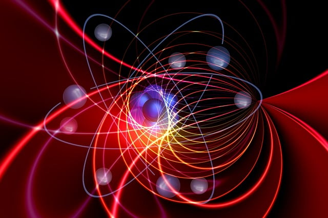

*Snapshot of simulated cardiac electrical activity. © 2016 ARCHER image competition*

## So why are supercomputers needed?

In the previous steps you have familiarised yourself with three different large scale computer simulations so you should have a good understanding of why supercomputers are needed.

In this discussion step we would like you to have a look at [ARCHER2’s case studies](https://www.archer2.ac.uk/research/case-studies/). Pick one of them and try to answer the following questions:

- which discipline does the case study belong to?
- is there any social or economic benefit to it?
- what are the main reasons for using supercomputers to study this problem?
- in your opinion, what is the most surprising or interesting aspect of this case study?
- are there any similarities between the case study you picked and the three case studies we have discussed in this week? Why do you think that is?

---

*Image courtesy of [Verne Ho](https://unsplash.com/@verneho) from [Unsplash](https://unsplash.com)*

## Future of Supercomputing - the Exascale

So what does the future of supercomputing look like? Much of the current research and development in HPC is focused on Exascale computing.

For HPC architectures, this can be taken to mean working towards a system with a floating point performance of at least 1 Exaflop/s (i.e. 1018 or a million million million floating point calculations per second).

In 2016, the US government announced the Exascale Computing Project, which aims to have its first supercomputer operating at 1 Exaflop/s or more in production by 2021. If past trends in the Top500 list had been followed, then a 1 Exaflop/s system would have been expected in 2018 – the fact that this date will be missed by at least 2 or 3 years is a measure of the technical challenges involved, both in the hardware and software.

As of 2022 exascale has only been achieved by one system [https://www.top500.org/system/180047/](Frontier) based at Oak Ridge National Laboratory. Although at some level this is just an arbitrary number, it has become a significant technological (and political) milestone.
2022 saw the first exascale system, [https://www.top500.org/system/180047/](Frontier), based at Oak Ridge National Laboratory, with 2 more exascale systems, Aurora and El Capitan - both also in the US, following in 2024. Although at some level this is just an arbitrary number, it has become a significant technological (and political) milestone and more machines will follow in the near future as computing needs continue to grow.
Some of the main barriers to building a useful and economically viable Exascale machine are:

### Hardware speeds

Since around 2006, there has been little significant increase in the clock frequency of processors. The only way to extract more performance from computers has been through more parallelism, by having more cores per chip, and by making each cores capable of more floating point operations per second. Without a fundamental move away from the current silicon technology, there is no real prospect of significantly higher clock frequencies in the next 5-10 years. There is also not much prospect of reducing network latencies by very much either. On the plus side, new memory designs such as 3D stacked memory, do promise some increases in memory bandwidth.

### Energy consumption

If we were to build a 1 Exaflop/s computer today, using standard Intel Xeon processors, then it would consume around 400 megawatts of power: that’s enough electricity for 700,000 households, or about 1% of the UK’s entire electricity generating capacity! That’s not only hugely expensive, but it would require a big investment in engineering infrastructure, and would be politically challenging from a carbon footprint point of view.

The target energy consumption for an Exascale system is 20-30 megawatts. Some of the required savings can be made by using special purpose manycore processors, such as GPUs, instead of standard Xeons, but we are still around a factor of 5 off this target. Closing this gap is one of the big challenges in the short to medium term – some savings can be made by reducing the clock frequency of processors, but this has to be compensated for by a corresponding increase in the number of cores, in order to meet the total computational capacity target.

### Reliability

As the number of cores, and other components such as memory, network links and disks, increases, so does the risk that components will fail more often. As a rule of thumb, a supercomputer service becomes unacceptable to users if the rate of visible failures (i.e. failures that cause running applications to crash) is more than about one per week. Building bigger and bigger supercomputers, with more and more components, the mean time between failures will tend to decrease to a point where the system becomes effectively unusable. While some types of program can be written so as to be able to deal with hardware failures, it turns out to be very hard to do this for most HPC applications without seriously compromising performance.

### Application Scalability

It’s all very well to build an Exascale computer, but there isn’t much point unless applications can make practical use of them. As the degree of parallelism in the hardware continues to increase, it gets harder and harder to make applications scale without running into unavoidable bottlenecks. Strong scaling (i.e. obeying Amdahl’s Law) is very challenging indeed. Weak scaling (as in Gustafson’s Law) is easier to achieve, but often doesn’t result in solving the problems scientists are actually interested in.

It is likely that for the first generation of Exascale systems, there will be only a small number (maybe only in the low tens) of application codes that can usefully exploit them. Even to achieve this will require heroic efforts by application developers and computer scientists, and also some degree of co-design: the hardware itself may be tailored to suit one or few particular application codes rather than providing full general purpose functionality.

So that’s where HPC is heading in the next 5 years – a strong push towards Exascale systems. Even though these may only be usable by a small number of applications, the technologies developed along the way (both in hardware and software) will undoubtedly have an impact at the more modest (i.e. Tera- and Peta-) scale, and the performance of real application codes will continue to increase, even if at a somewhat reduced rate than in past decades.

In your opinion, which of the above barriers is the hardest to breach? Why do you think so?

---

*Image courtesy of [geralt](https://pixabay.com/users/geralt-9301/) from [Unsplash](https://pixabay.com)*

## Quantum Computing

There has been a lot of excitement in recent years about the possibilities of quantum computers. These are systems that use the quantum mechanical effects of superposition and entanglement to do calculations at a much faster rate than is possible with classical computers based on binary logic.

In this article, we are not going to talk about how it actually works, you can read about that in an online article published on the Plus Maths website - [How does quantum computing work?](https://plus.maths.org/content/how-does-quantum-commuting-work)

There are many research efforts going on right now into the fundamental technology to build such a machine: it is not yet possible to make the quantum states exist for long enough, or in large enough numbers to do any more than the very simplest computations.

Even if the technological problems can be solved, there is a big problem for quantum computing, in that we can’t just take a normal computer program and run it on a quantum computer: completely new quantum algorithms have to be invented to solve scientific problems. Coming up with these algorithms is really hard: there are only a few tens of these known to exist, of which maybe a handful are of more than purely theoretical interest. One of the earliest discovered, and best known, is Shor’s algorithm, a way to find the prime factors of large numbers much faster than can be done with classical computers. This algorithm has an application in breaking some commonly used cryptography methods, but this is of limited practical use, as there are other known cryptography methods that are not liable to this form of attack.

A much more interesting potential use of quantum computers is to simulate quantum systems such as molecules, and materials at the atomic level. Such simulations are currently done on classical supercomputers, but the algorithms used typically do not scale well to more than a few thousand processors, and so are not likely to benefit much from Exascale architectures with tens of millions of cores. In this case, quantum computers offer a very exciting potential alternative way of doing science that is currently impossible.

The one type of quantum computer that does exist today is built by D-Wave Systems, and relies on rather different quantum effects (so-called quantum annealing) to solve a certain type of optimisation problem. So far, however, it has been difficult to demonstrate that the D-Wave machine is really reliant on quantum behaviour, and it has not been possible to show any meaningful performance advantage over conventional methods for solving the same problem on classical computers.

For sure, quantum computers are an exciting new field, but they are not going to replace classical supercomputers any time soon, and even if they do, they will probably only be useable for solving a few, very specialised problems.

---

*Image courtesy of [geralt](https://pixabay.com/users/geralt-9301/) from [Unsplash](https://pixabay.com)*

## Artificial Intelligence

What we’ve covered in the course is the use of supercomputers in computational science, for example to simulate the weather.

The basic approaches to tackling problems like this using computer simulation have been known for some time, and parallelising on a supercomputer enables us to run very detailed simulations to greatly improve the accuracy of our predictions. Although the mathematics can be very complicated, the computer implementation is rather mechanical. We apply a set of rules to a large number of grid-points over and over again to advance the simulation through time: the much simpler traffic model is a very good analogy to the overall process.

### Artificial Intelligence

Although these approaches have been very successful across a wide range of problems, there are other areas where they don’t yield such good results. These tend to be in tasks that a bit fuzzier to define – tasks that humans actually find very simple – such as recognising faces, understanding speech or driving a car. Great strides have been made in recent years through advances in Artificial Intelligence (AI).

### Neural Networks

AI takes a rather different approach: rather than writing a separate program for each problem, you write software that can learn how to solve a much more general problem. This can be done by creating an artificial neural network which takes an input (such as an image of a face) and produces an output (such as “that looks like David”). We first train the network on a set of known results (e.g. a set of passport photos that have already been identified by a human), and then apply the trained network to the unknown input to get useful results (e.g. “this person is David because he looks like David’s passport photo”). This is called “Machine Learning”.

It’s very important to recognise that, although neural networks are inspired by the way the human brain is organised as a set of connected neurons, we are not simulating the brain. The Blue Brain project is building computer models of real brains: this is in order to understand how the human brain works, not to create a synthetic AI human. Neural networks are designed to solve particular tasks that the human brain can do very easily, but using completely synthetic neural networks that look nothing like the real human brain.

### What has this got to do with Supercomputing?

Neural networks have been around for a long time, but recent advances in computer hardware have enabled them to be large enough and fast enough to begin to tackle problems that were previously impossible to address. The combination of modern Machine Learning software and powerful computers has come to be called Deep Learning. It is also a very parallelisable problem: if I have to train my network on 1000 known images, each image can be processed independently on a separate CPU-core. We are starting to see people designing and building supercomputers specifically targeted at Deep Learning. It turns out that GPUs are very well suited to AI problems, and Google has even designed its own “TPU” (Tensor Processing Unit) processor specifically targeted at Deep Learning problems.

### What about the future?

We are still a long way from creating an artificially intelligent computer. Although supercomputer hardware can always help – we can train a network to recognise a face a thousand times faster – we will need to make tremendous advances in software to approach true AI. Although I’m sure that AI programs will make increasing use of supercomputer hardware in the future, there’s no chance that {{ machine_name }} will suddenly become self-aware and refuse to tell us what tomorrow’s weather will be!

---

## Terminology Recap

::::challenge{id=towards_future.1 title="Towards the Future Q1"}
The term ____ programming refers to an approach of combining more than one programming model in the same parallel program. The most common combination is to use the ____
library and ____ together. In this approach, ____ allows communication between different compute nodes over the network. We use ____ to take advantage of the shared memory within each node.

:::solution
A) hybrid

B) mpi

C) openMP

D) MPI

E) openmp
:::
::::

::::challenge{id=towards_future.2 title="Towards the Future Q2"}
The term ____ ____ refers to a situation where the computational work is not distributed equally among the CPU-cores.

:::solution
Load imbalance
:::
::::

::::challenge{id=towards_future.3 title="Towards the Future Q3"}
We have mentioned four main barriers to building a useful and economically viable Exascale machine. There are:

- ____ limitations (e.g. speed) - the clock frequency of processors has stagnated in the recent years.
- ____ consumption - the target for an exascale system is 20-30 megawatts.
- ____ - As the number of cores, and other components such as memory, network links and disks, increases, so does the risk that components will fail more often.
- application ____ - at the moment there is only a small number (maybe only in the low tens) of application codes that could usefully exploit exascale machines.

:::solution
A) hardware

B) power

C) reliability

D) scalability
:::
::::

---

*Image courtesy of [Johannes Plenio](https://unsplash.com/@jplenio) from [Unsplash](https://unsplash.com)*

## What do you think the future holds?

One of the defining features of supercomputing over the past two decades is that it has used commodity technology and benefited from the huge investments in consumer computers.

Perhaps the only truly bespoke technology was the interconnect - only computational scientists needed to connect thousands of computers with microsecond latencies. However, the articles in this final activity have talked about going beyond the limits of today’s silicon technology.

Things to consider:

- Do you think there is consumer demand for ever faster computers?
- What applications could they have?
- Have we reached a point similar to commercial aircraft - it’s too expensive to make them go faster so investment is focused on saving cost, fuel economy, reliability etc.?
- Will the possibilities opened up by exascale supercomputers drive new technologies?
