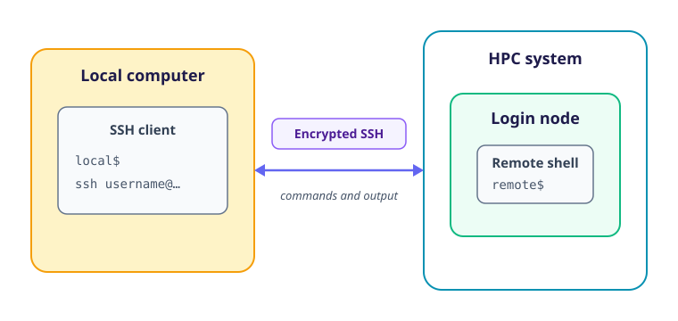

Most HPC clusters provide interactive command-line access through the Secure Shell protocol, usually called *SSH*.
SSH creates an encrypted connection between a client on your local computer and a server on a remote login node.
Commands entered through that connection run on the login node, and their output is returned to your terminal.



The command used to begin a connection is widely portable, but the route to the cluster and the credentials used to authenticate are not.
One service may accept a password, another may require a registered SSH key and multi-factor authentication, and another may issue a short-lived SSH certificate.
Access may also depend on a virtual private network, an institutional network or an intermediate gateway.

## Before You Connect

Obtain the following information from the cluster's current user documentation:

1. Your username on the cluster.
1. The hostname to which users should connect.
1. Any required VPN, gateway or other network route.
1. The authentication procedure, including any required keys, certificates or multi-factor authentication.
1. The published host-key fingerprint, if the service provides one.
1. The service-status page and support contact to use if access fails.

You may already have collected these details in the [cluster-information challenge](high_performance_computing/hpc_intro/01_working_on_a_cluster#cluster-information).

:::callout{variant="warning"}

## Follow the Local Access Procedure

SSH is the common transport, not a universal account-management system.
Do not substitute key-registration instructions from another cluster, manually install a key in `authorized_keys`, or bypass a site-provided authentication tool unless your service's documentation explicitly tells you to do so.

The examples below use `username` and `login.example.ac.uk` as placeholders.
Replace them with the values supplied for the cluster you are using.

:::

## A Typical Connection Workflow

This section allows you to follow the sequence common to most clusters, with local documentation supplying the service-specific requirements:

1. Obtain an account, username and login hostname from the service.
1. Install or locate an SSH client on the local computer.
1. Satisfy any network requirement, such as connecting to a VPN or using a gateway.
1. Prepare the authentication method specified by the service, which may include registering a public key or obtaining a short-lived certificate.
1. Run `ssh` with the supplied username and hostname.
1. Verify the remote system's host-key fingerprint when first connecting.
1. Complete any password, key-passphrase or multi-factor prompts.
1. Work in the resulting remote shell, then run `exit` to return to the local computer.

## Preparing an SSH Client

An SSH client is available from a terminal on most current Linux, macOS and Windows computers.
If the `ssh` command is unavailable, use the client recommended by your institution or the cluster operator.

Check that the command is available before beginning the service's access procedure:

```bash
local$ ssh -V
```

A line of version information confirms that a command-line SSH client is ready to use, although the implementation name and version format may vary.

## Preparing User Authentication

User authentication proves to the remote system that you are entitled to connect.
The service may use one or more of the following mechanisms:

- A password known to the service.
- A challenge from a multi-factor authentication system.
- An SSH key pair whose public key has been registered with your account.
- A signed SSH certificate issued after you authenticate through an institutional service.

These mechanisms can be combined, and some require preparation before the first connection.
Follow the local documentation to complete that preparation.

### SSH Key Pairs

An SSH key pair consists of a *private key* retained on your local computer and a *public key* that may be registered with remote services.
The remote service can test that you possess the private key without receiving the key itself.

If the service directs you to generate a key, use a key type it supports, protect the private key with a strong passphrase and give the pair a distinctive filename if you already have other keys.
The service documentation should also specify how to register the public key, which may involve an account portal or a dedicated access tool.

#### A Concrete Key-Generation Example

Before generating a key in a Unix-like local terminal, create the standard SSH directory if it does not already exist and restrict access to it:

```bash
local$ mkdir -p ~/.ssh
local$ chmod 700 ~/.ssh
```

These two preparation commands create the standard SSH directory if necessary and ensure that other users of a Unix-like local computer cannot access it.
Native Windows clients use the `.ssh` directory in the user's profile but manage its permissions differently, so follow the client documentation if it has not already created that directory.

If the service accepts Ed25519 keys, the following command generates a pair with a filename that identifies its purpose:

```bash
local$ ssh-keygen -t ed25519 -f ~/.ssh/id_ed25519_my_cluster
```

Replace `my_cluster` with a short name for the service you will use.
If that filename already exists, do not overwrite it; choose another name or use the existing key only if the service permits this.

`ssh-keygen` asks for a passphrase and then asks you to confirm it.
Nothing is displayed while a passphrase is entered, but the input is still being received.

The command creates two files:

- `~/.ssh/id_ed25519_my_cluster` is the private key and must remain on your local computer.
- `~/.ssh/id_ed25519_my_cluster.pub` is the public key that the service may ask you to register.

You can display the public key for entry into an account portal without exposing the private key:

```bash
local$ cat ~/.ssh/id_ed25519_my_cluster.pub
```

If the documentation specifies another key type or provides a tool that generates credentials for you, follow that procedure instead of the Ed25519 example.

:::callout{variant="warning"}

## Keep the Private Key Private

Never upload, email or paste your private key into a support request.
Only the public key, normally the file whose name ends in `.pub`, is intended to be shared.
If a private key may have been exposed, stop using it and follow the service's procedure for revoking or replacing it.

:::

An SSH agent can hold an unlocked private key in memory so that its passphrase need not be entered for every connection.
Agent setup differs between operating systems and is not required by every access method, so use the instructions for your SSH client rather than placing shell commands copied from an unrelated system into your startup files.

## Opening an SSH Connection

After completing the required network and authentication setup, combine your remote username and the login hostname in an SSH command:

```bash
local$ ssh username@login.example.ac.uk
```

If your registered private key has a non-default filename and no SSH configuration selects it, pass its path explicitly:

```bash
local$ ssh -i ~/.ssh/id_ed25519_my_cluster username@login.example.ac.uk
```

The `-i` option selects the private identity file; it must not name the corresponding `.pub` file.
The `@` separates the username from the hostname; it does not indicate an email address.
The cluster may direct this stable login hostname to any one of several login nodes, so the individual machine reached by two sessions need not have the same name.

:::callout{variant="note"}

## Local and Remote Prompts

This course prefixes commands with `local$` when they must run on your computer and `remote$` when they must run on the cluster.
The prefix represents the shell prompt and is not part of the command to type.

Real prompts vary and often contain a username, hostname or current directory.
Pay attention to the prompt before running a command, particularly when copying files or ending processes.

:::

## Verifying the Remote System

Encryption is useful only if the computer at the other end of the connection is the one you intended to reach.
SSH identifies a server using a *host key* and may display its fingerprint when you connect for the first time:

```text
The authenticity of host 'login.example.ac.uk' can't be established.
ED25519 key fingerprint is SHA256:<fingerprint>.
```

Compare this fingerprint with one published in the cluster's documentation or supplied through another trusted channel before accepting it.
Once accepted, the host key is recorded on your local computer and checked during later connections.

:::callout{variant="warning"}

## A Changed Host Key Is a Security Warning

A cluster may legitimately replace its host keys, but the same warning can indicate that your connection is being intercepted.
Do not delete the old entry or accept the replacement merely to make the warning disappear.
Check the service documentation or contact its support team through a trusted channel before updating the recorded key.

:::

## Completing User Authentication

Host-key verification authenticates the remote system to you; user authentication then proves your identity to the remote system.
SSH may ask for a private-key passphrase, password or multi-factor response according to the access method prepared earlier.
These prompts may appear in different orders, so follow the local documentation rather than assuming that every prompt expects the same credential.

## Your First Remote Session

After authentication, the service normally displays a login banner followed by a remote shell prompt.
The banner may contain operational notices, maintenance dates, storage warnings or links to current documentation, so it is worth reading rather than treating it as decoration.

Three commands establish where the shell is running and which remote identity it is using:

```bash
remote$ hostname
remote$ whoami
remote$ pwd
```

`hostname` identifies the particular login node, `whoami` reports your remote username, and `pwd` shows the current working directory.
These values describe the remote session and need not match their equivalents on your local computer.

Leave the remote shell with `exit`:

```bash
remote$ exit
```

The connection closes and control returns to the local shell that started `ssh`.
Closing a terminal window also breaks its SSH connection, but explicitly exiting makes the transition between remote and local shells clearer.

::::challenge{id=connect-and-check title="Connect and Check Your Context"}

Use the cluster's documentation and the access details collected in the previous section to establish an SSH session.

1. Run `ssh -V` to confirm that an SSH client is available.
1. Complete the documented account, network and authentication setup, registering only the public half of an SSH key if one is required.
1. Run `hostname` in your local terminal and note the result.
1. Start the connection using the documented login hostname.
1. Verify any new host-key fingerprint before accepting it.
1. Complete the required authentication steps.
1. Run `hostname`, `whoami` and `pwd` in the remote shell.
1. Read the login banner and locate any documentation, support or service-status links it provides.
1. Run `exit`, then use `hostname` to confirm that you are back on your local computer.

:::solution

The two `hostname` results should normally differ because the commands ran on different computers.
The remote hostname may also differ from the public login hostname because many services will distribute connections across several login nodes.

`whoami` should report your username on the cluster, while `pwd` will usually report a remote home directory.
After `exit`, the prompt and the result of `hostname` should again belong to your local computer.

There is no universal banner, hostname or home-directory path against which to compare the output.
The important result is that you can identify which system will execute the next command.

:::
::::

## Making Repeated Connections Convenient

After the full connection command works, you can give it a short local name in `~/.ssh/config`:

```sshconfig
Host my-cluster
    HostName login.example.ac.uk
    User username
    IdentityFile ~/.ssh/id_ed25519_my_cluster
```

You can then connect using the alias:

```bash
local$ ssh my-cluster
```

The `IdentityFile` entry selects the non-default key generated in the earlier example; replace or omit it when the service uses a different authentication method.
Additional settings can describe a gateway or other connection requirements, but only add them when required by the local documentation.
Some site-provided authentication tools create and maintain SSH configuration automatically, in which case their generated entries should be used instead.

:::callout{variant="note"}

## SSH Is Not the Only Interface

Some clusters also provide web portals, notebook services, remote desktops or integrations with development environments.
These can be more suitable for graphical or interactive work, but they do not change the distinction between shared login services and scheduled compute resources introduced in [Working on an HPC Cluster](high_performance_computing/hpc_intro/01_working_on_a_cluster).

This course uses an SSH terminal because it is widely available and exposes the same command-line tools used in job scripts.

:::

## Diagnosing Connection Problems

The exact text produced by SSH varies, but the stage at which it fails helps to narrow the cause.
Some common symptoms and potential causes are:

| Symptom | Checks to make |
| --- | --- |
| The connection times out or is refused | Check the hostname, service status, network connection and any required VPN or gateway. |
| Authentication ends with `Permission denied` | Check the remote username and whether the required key, certificate, password or multi-factor step is current and correctly configured. |
| SSH reports that the remote host identification has changed | Stop and verify the current host-key fingerprint through the service documentation or support team. |
| A previously working session or certificate has expired | Check the service's session limits and repeat its authentication procedure rather than trying to preserve an old session indefinitely. |

Running `ssh` with the `-v` option displays additional information about the connection and authentication stages it reaches:

```bash
local$ ssh -v username@login.example.ac.uk
```

The output can be lengthy, but it often distinguishes a network failure from a rejected credential or an incorrectly selected key.
If you contact your cluster's support for assistance, include the command used, the time of the attempt and the relevant error output, but remove unnecessary personal information and never include passwords, one-time codes or private keys.

SSH also underpins several common file-transfer tools, which are introduced in [Transferring Files](high_performance_computing/hpc_intro/06_transferring_files).
The next section, [Storage on an HPC Cluster](high_performance_computing/hpc_intro/03_cluster), examines the remote filesystems you encounter after logging in.
