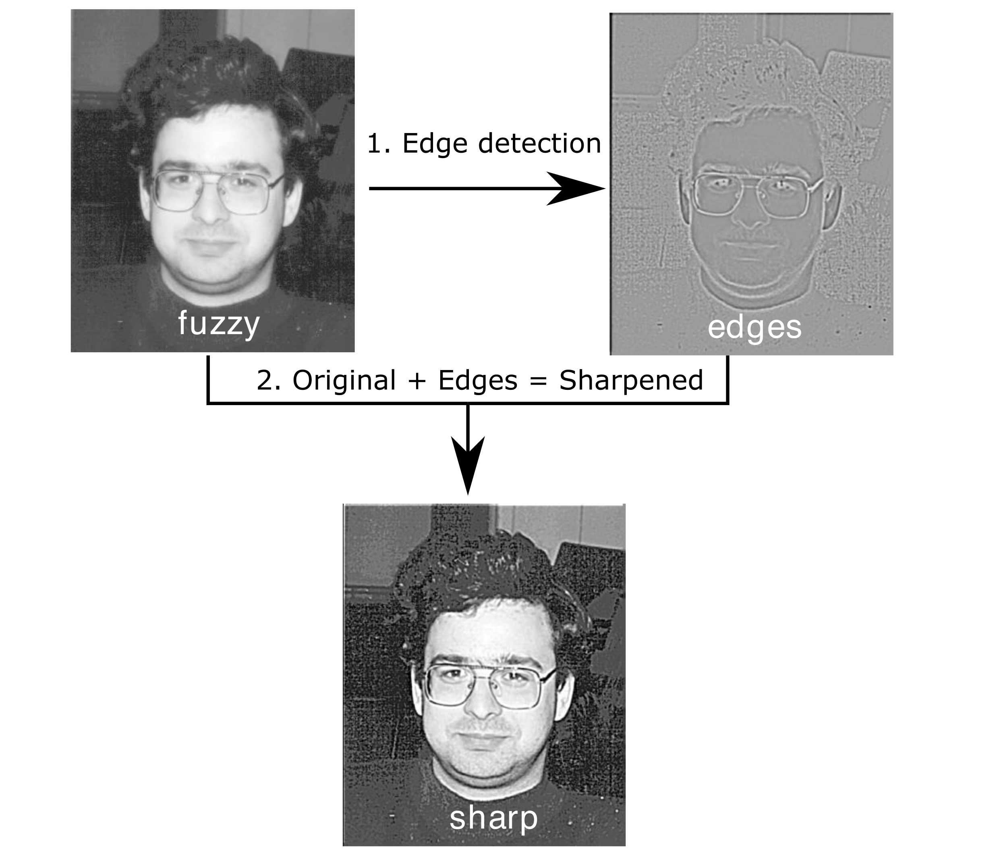
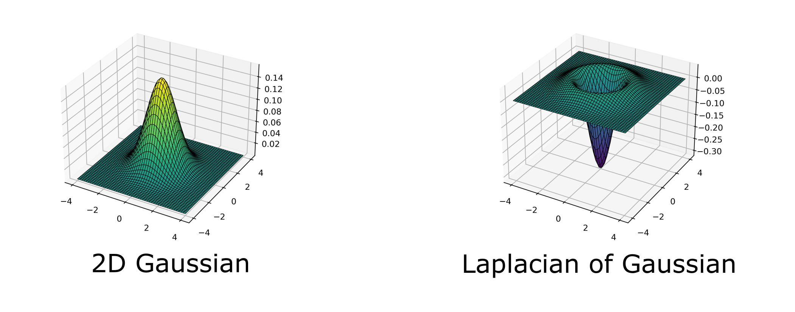
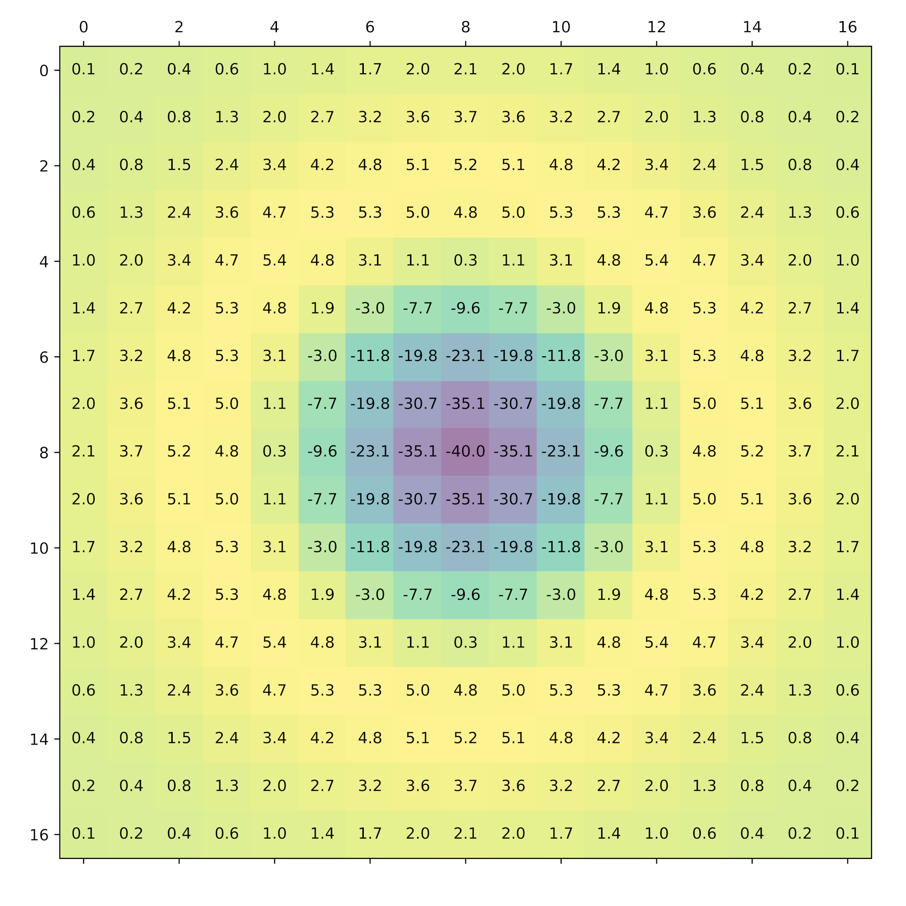

This practical brings together several parts of the workflow introduced so far:
obtaining source code, preparing the software environment, compiling an
application, submitting it to the scheduler and retrieving its output. The
application sharpens an image using a small serial C program.

## Image Sharpening

Image sharpening makes edges more prominent by:

1. detecting the edges in an image
1. combining those edges with the original image

These steps are shown below.


*Image sharpening steps*

### Edge Detection

Edges can be detected using a Laplacian filter. The Laplacian $L(x,y)$ is the
second spatial derivative of the image intensity $I(x,y)$, so it highlights
regions where the intensity changes rapidly.

$$
L(x,y) = \frac{\partial^2 I}{\partial x^2} + \frac{\partial^2 I}{\partial y^2}
$$

The Laplacian also amplifies noise. Applying a Gaussian filter first reduces
this effect by replacing each pixel with a weighted average of nearby pixels:

$$
G(x,y) = \frac{1}{2 \pi \sigma^2} e^{-(x^2+y^2)/(2 \sigma^2)}
$$

The smoothing and edge-detection operations can be combined in a
Laplacian-of-Gaussian filter, $L \circ G(x,y)$:

$$
L \circ G(x,y) = -\frac{1}{\pi \sigma^4}
\left(1 - \frac{x^2+y^2}{2 \sigma^2}\right)
e^{-(x^2+y^2)/(2 \sigma^2)}
$$

The Gaussian and Laplacian-of-Gaussian functions are shown below.


*Gaussian and Laplacian-of-Gaussian filters*

### Applying the Filter

To apply the filter to a digital image, it is sampled onto a discrete mask: a
matrix of size $(2d+1) \times (2d+1)$. This program uses $d=8$, producing the
$17 \times 17$ mask shown below.


*Laplacian-of-Gaussian filter represented as a discrete mask*

For each pixel, the program multiplies the surrounding image values by the
corresponding entries in the mask and sums the results:

$$
\text{edges}(i,j) = \sum_{k=-d}^d \sum_{l=-d}^d
\text{image}(i+k,j+l) \times \text{filter}(k,l).
$$

The detected edges are then scaled and added to the original image to produce
the sharpened result. The source code contains the implementation details.

## Obtain the Source Code

The image-sharpening program is available in the UNIVERSE-HPC foundation
exercises repository. From the system on which you intend to compile it, clone
the repository and enter the directory containing the serial C version:

```bash
remote$ git clone https://github.com/UNIVERSE-HPC/foundation-exercises
remote$ cd foundation-exercises/sharpen/C-SER
remote$ ls
```

```output
cio.c  dosharpen.c  filter.c  fuzzy.pgm  Makefile  sharpen.c  sharpen.h  sharpen.slurm  utilities.c  utilities.h
```

The repository also contains C and Fortran implementations that use MPI and
OpenMP. For now, we will use only the serial implementation in `C-SER`.

:::callout

## Clusters Without Internet Access

Some clusters do not permit outbound connections to services such as GitHub.
If `git clone` fails for this reason, clone the repository on your own computer
and transfer it using one of the methods from the previous section.
:::

## Compile the Program

The supplied Makefile describes how the source files should be compiled and
linked. Run `make` to build the program:

```bash
remote$ make
```

```output
cc -O3 -DC_SERIAL_PRACTICAL -c sharpen.c
cc -O3 -DC_SERIAL_PRACTICAL -c dosharpen.c
cc -O3 -DC_SERIAL_PRACTICAL -c filter.c
cc -O3 -DC_SERIAL_PRACTICAL -c cio.c
cc -O3 -DC_SERIAL_PRACTICAL -c utilities.c
cc -O3 -DC_SERIAL_PRACTICAL -o sharpen sharpen.o dosharpen.o filter.o cio.o utilities.o -lm
```

This produces an executable named `sharpen`.

:::callout

## Selecting a Compiler

On an HPC system, `cc` may refer to the default compiler or to a compiler
wrapper configured for that system. If `make` reports that no compiler is
available, use the module system to load a suitable compiler and consult the
facility documentation. Replacing `cc` with a particular compiler without
checking the local software environment may select the wrong toolchain.
:::

## Run the Program on a Compute Node

The program is small, but it represents computational work and should be run
on a compute node. The scheduler lesson introduced the Slurm directives and
commands needed to do this.

::::challenge{id=hpc-intro-sharpen title="Submit the Image-Sharpening Job"}

Write a Slurm submission script that requests one node, one task, one CPU and
one minute of wall time. Use it to run `./sharpen` on a compute node, then find
and inspect the job's output file.

Your system may require additional directives, such as an account or
partition. It may also require you to load a compiler environment before
running the executable.

:::solution

A minimal submission script is:

```bash
#!/bin/bash
#SBATCH --job-name=sharpen
#SBATCH --nodes=1
#SBATCH --ntasks=1
#SBATCH --cpus-per-task=1
#SBATCH --time=00:01:00

./sharpen
```

Save the script as `sharpen-job.sh`, submit it and monitor its progress:

```bash
remote$ sbatch sharpen-job.sh
remote$ squeue -u yourUsername
```

Once the job has completed, locate and read its output file. A successful run
will produce output similar to this:

```output
Image sharpening code running in serial

Input file is: fuzzy.pgm
Image size is 564 x 770

Using a filter of size 17 x 17

Reading image file: fuzzy.pgm
... done

Starting calculation ...
... finished

Writing output file: sharpened.pgm

... done

Calculation time was 1.378783 seconds
Overall run time was 1.498794 seconds
```

The precise timings will depend on the compute node used.

:::
::::

The program writes the sharpened image to `sharpened.pgm`. Transfer both
`fuzzy.pgm` and `sharpened.pgm` to your own computer using the method introduced
in the previous section, then open them in an image viewer and compare the
original with the result.

If you are interested in how the convolution is implemented, examine
`dosharpen.c`.
