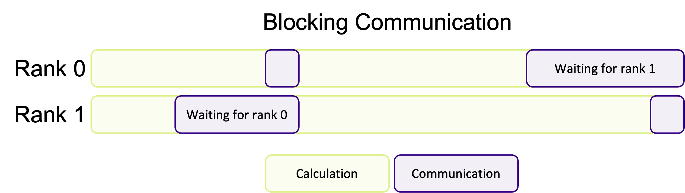
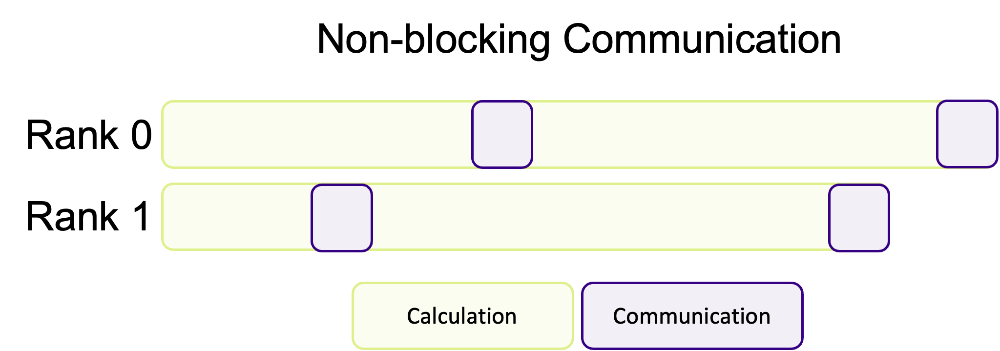

In previous episodes we've seen that when we run an MPI application, multiple *independent* processes are created which do their own work, on their own data, in their own private memory space. At some point in our program, one rank will probably need to know about the data another rank has, such as when combining a problem back together which was split across ranks. Since each rank's data is private to itself, we can't just access another rank's memory and get what we
need from there. We have to instead explicitly *communicate* data between ranks. Sending and receiving data
between ranks form some of the most basic building blocks in any MPI application, and the success of your parallelisation often relies on how you communicate data.

## Communicating data using messages

MPI is a framework for passing data and other messages between independently running processes. If we want to share or
access data from one rank to another, we use the MPI API to transfer data in a "message." A message is a data structure
which contains the data we want to send, and is usually expressed as a collection of data elements of a particular data
type.

Sending and receiving data can happen in two patterns. We either want to send data from one specific rank to
another, known as point-to-point communication, or to/from multiple ranks all at once to a single or multiples targets,
known as collective communication. Whatever we do, we always have to *explicitly* "send" something and to *explicitly*
"receive" something. Data communication can't happen by itself. A rank can't just get data from one rank, and ranks
don't automatically send and receive data. If we don't program in data communication, data isn't exchanged.
Unfortunately, none of this communication happens for free, either. With every message sent, there is an overhead which
impacts the performance of your program. Often we won't notice this overhead, as it is usually quite small. But if we
communicate large data or small amounts too often, those (small) overheads add up into a noticeable performance hit.

To get an idea of how communication typically happens, imagine we have two ranks: rank A and rank B. If rank A wants to
send data to rank B (e.g., point-to-point), it must first call the appropriate MPI send function which typically (but
not always, as we'll find out later) puts that data into an internal *buffer*; known as the **send buffer** or
the **envelope**. Once the data is in the buffer, MPI figures out how to route the message to rank B (usually over a
network) and then sends it to B. To receive the data, rank B must call a data receiving function which will listen for
messages being sent to it. In some cases, rank B will then send an acknowledgement to say that the transfer has
finished, similar to read receipts in e-mails and instant messages.

:::::challenge{id=check-understanding, title="Check Your Understanding"}
Consider a simulation where each rank calculates the physical properties for a subset of cells on a very large grid of points. One step of the calculation needs to know the average temperature across the entire grid of points. How would you approach calculating the average temperature?

::::solution
There are multiple ways to approach this situation, but the most efficient approach would be to use collective operations to send the average temperature to a main rank which performs the final calculation. You can, of course, also use a point-to-point pattern, but it would be less efficient, especially with a large number of ranks.

If the simulation wasn't done in parallel, or was instead using shared-memory parallelism, such as OpenMP, we wouldn't need to do any communication to get the data required to calculate the average.
::::
:::::

## MPI data types

When we send a message, MPI needs to know the size of the data being transferred. The size is not the number of bytes of
data being sent, as you may expect, but is instead the number of elements of a specific data type being sent. When we
send a message, we have to tell MPI how many elements of "something" we are sending and what type of data it is. If we
don't do this correctly, we'll either end up telling MPI to send only *some* of the data or try to send more data than
we want! For example, if we were sending an array, and we specify too few elements, then only a subset of the array will
be sent or received. But if we specify too many elements, then we are likely to end up with either a segmentation fault
or undefined behaviour! And the same can happen if we don't specify the correct data type.

There are two types of data type in MPI: "basic" data types and derived data types. The basic data types are in essence
the same data types we would use in C such as `int`, `float`, `char` and so on. However, MPI doesn't use the same
primitive C types in its API, using instead a set of constants which internally represent the data types. These data
types are in the table below:

| MPI basic data type    | C equivalent           |
|------------------------|------------------------|
| MPI_SHORT              | short int              |
| MPI_INT                | int                    |
| MPI_LONG               | long int               |
| MPI_LONG_LONG          | long long int          |
| MPI_UNSIGNED_CHAR      | unsigned char          |
| MPI_UNSIGNED_SHORT     | unsigned short int     |
| MPI_UNSIGNED           | unsigned int           |
| MPI_UNSIGNED_LONG      | unsigned long int      |
| MPI_UNSIGNED_LONG_LONG | unsigned long long int |
| MPI_FLOAT              | float                  |
| MPI_DOUBLE             | double                 |
| MPI_LONG_DOUBLE        | long double            |
| MPI_BYTE               | char                   |

Remember, these constants aren't the same as the primitive types in C, so we can't use them to create variables, e.g.,

```c
MPI_INT my_data = 1;
```

is not valid code because, under the hood, these constants are actually special data structures used by MPI.
Therefore, we can only them as arguments in MPI functions.

::::callout

## Don't forget to update your types

At some point during development, you might change an `int` to a `long` or a `float` to a `double`, or something to
something else. Once you've gone through your codebase and updated the types for, e.g., variable declarations and
function arguments, you must do the same for MPI functions. If you don't, you'll end up running into communication
errors. It could be helpful to define compile-time constants for the data types and use those instead. If you ever do
need to change the type, you would only have to do it in one place, e.g.:

```c
// define constants for your data types
#define MPI_DATA_TYPE MPI_INT
#define DATA_TYPE int
// use them as you would normally
INT_TYPE my_data = 1;
```

::::

Derived data types, on the other hand, are very similar to C structures which we define by using the basic MPI data types.
They are often useful for grouping similar data in communications or when sending a structure from one rank to another.
This is covered in more detail in the optional [Advanced Communication Techniques](11_advanced_communication.md) episode.

:::::challenge{id=what-type, title="What Type Should You Use?"}
For the following pieces of data, what MPI data types should you use?

1. `a[] = {1, 2, 3, 4, 5};`
2. `a[] = {1.0, -2.5, 3.1456, 4591.223, 1e-10};`
3. `a[] = "Hello, world!";`

::::solution

The fact that `a[]` is an array does not matter, because all the elements in `a[]` will be the same data type. In MPI, as we'll see in the next episode, we can either send a single value or multiple values (in an array).

1. Use `MPI_INT` or `MPI_LONG`, depending on the type of the array.
2. The array contains floating-point values. Use `MPI_DOUBLE` if the array type is `double`, or `MPI_FLOAT` if it's declared as `float`.
3. Use `MPI_BYTE` or `MPI_CHAR` for character arrays. You may want to use [strlen](https://man7.org/linux/man-pages/man3/strlen.3.html) to calculate how many elements of `MPI_CHAR` being sent.

::::
:::::

## Communicators

All communication in MPI is handled by something known as a **communicator**. We can think of a communicator as being a
collection of ranks which are able to exchange data with one another. What this means is that every communication
between two (or more) ranks is linked to a specific communicator. When we run an MPI application, every rank will belong
to the default communicator known as `MPI_COMM_WORLD`. We've seen this in earlier episodes when, for example, we've used
functions like `MPI_Comm_rank()` to get the rank number,

```c
int my_rank;
MPI_Comm_rank(MPI_COMM_WORLD, &my_rank);  // MPI_COMM_WORLD is the communicator the rank belongs to
```

In addition to `MPI_COMM_WORLD`, we can make sub-communicators and distribute ranks into them. Messages can only be sent and received to and from the same communicator, effectively isolating messages to a communicator. For most applications, we usually don't need anything other than `MPI_COMM_WORLD`. But organising ranks into communicators can be helpful in some circumstances, as you can create small "work units" of multiple ranks to dynamically schedule the workload, or to help compartmentalise the problem into smaller chunks by using a
[virtual cartesian topology](https://www.mpi-forum.org/docs/mpi-3.1/mpi31-report/node192.htm#Node192). Throughout this course, we will stick to using `MPI_COMM_WORLD`.

## Communication modes

When sending data between ranks, MPI will use one of four communication modes: synchronous, buffered, ready or standard. When a communication function is called, it takes control of program execution until the send-buffer is safe to be re-used again. What this means is that it's safe to re-use the memory/variable you passed without affecting the data that is still being sent. If MPI didn't have this concept of safety, then you could quite easily overwrite or destroy any data before it is transferred fully! This would lead to some very strange behaviour which would be hard to debug. The difference between the communication mode is when the buffer becomes safe to re-use. MPI won't guess at which mode *should* be used.
That is up to the programmer. Therefore, each mode has an associated communication function:

| Mode        | Blocking function |
|-------------|-------------------|
| Synchronous | `MPI_SSend()`     |
| Buffered    | `MPI_Bsend()`     |
| Ready       | `MPI_Rsend()`     |
| Send        | `MPI_Send()`      |

In contrast to the four modes for sending data, receiving data only has one mode and therefore only a single function.

| Mode    | MPI Function |
|---------|--------------|
| Receive | `MPI_Recv()` |

### Synchronous sends

In synchronous communication, control is returned when the receiving rank has received the data and sent back, or
"posted", confirmation that the data has been received. It's like making a phone call. Data isn't exchanged until
you and the person have both picked up the phone, had your conversation and hung the phone up.

Synchronous communication is typically used when you need to guarantee synchronisation, such as in iterative methods or
time dependent simulations where it is vital to ensure consistency. It's also the easiest communication mode to develop
and debug with because of its predictable behaviour.

### Buffered sends

In a buffered send, the data is written to an internal buffer before it is sent and returns control back as soon as the
data is copied. This means `MPI_Bsend()` returns before the data has been received by the receiving rank, making this an
asynchronous type of communication as the sending rank can move onto its next task whilst the data is transmitted. This
is just like sending a letter or an e-mail to someone. You write your message, put it in an envelope and drop it off in
the postbox. You are blocked from doing other tasks whilst you write and send the letter, but as soon as it's in the
postbox, you carry on with other tasks and don't wait for the letter to be delivered!

Buffered sends are good for large messages and for improving the performance of your communication patterns by taking
advantage of the asynchronous nature of the data transfer.

### Ready sends

Ready sends are different to synchronous and buffered sends in that they need a rank to already be listening to receive
a message, whereas the other two modes can send their data before a rank is ready. It's a specialised type of
communication used **only** when you can guarantee that a rank will be ready to receive data. If this is not the case,
the outcome is undefined and will likely result in errors being introduced into your program. The main advantage of this
mode is that you eliminate the overhead of having to check that the data is ready to be sent, and so is often used in
performance critical situations.

You can imagine a ready send as like talking to someone in the same room, who you think is listening. If they are
listening, then the data is transferred. If it turns out they're absorbed in something else and not listening to you,
then you may have to repeat yourself to make sure your transmit the information you wanted to!

### Standard sends

The standard send mode is the most commonly used type of send, as it provides a balance between ease of use and performance.
Under the hood, the standard send is either a buffered or a synchronous send, depending on the availability of system resources (e.g. the size of the internal buffer) and which mode MPI has determined to be the most efficient.

::::callout

## Which mode should I use?

Each communication mode has its own use cases where it excels. However, it is often easiest, at first, to use
the standard send, `MPI_Send()`, and optimise later. If the standard send doesn't meet your requirements, or if you need more control over communication, then pick which communication mode suits your requirements best. You'll probably need to experiment to find the best!
::::

::::callout{variant="note"}

## Communication mode summary

| Mode        | Description                                                                                                                                                                 | Analogy                                        | MPI Function  |
|-------------|-----------------------------------------------------------------------------------------------------------------------------------------------------------------------------|------------------------------------------------|---------------|
| Synchronous | Returns control to the program when the message has been sent and received successfully.                                                                                    | Making a phone call                            | `MPI_Ssend()` |
| Buffered    | Returns control immediately after copying the message to a buffer, regardless of whether the receive has happened or not.                                                   | Sending a letter or e-mail                     | `MPI_Bsend()` |
| Ready       | Returns control immediately, assuming the matching receive has already been posted. Can lead to errors if the receive is not ready.                                         | Talking to someone you think/hope is listening | `MPI_Rsend()` |
| Standard    | Returns control when it's safe to reuse the send buffer. May or may not wait for the matching receive (synchronous mode), depending on MPI implementation and message size. | Phone call or letter                           | `MPI_Send()`  |

::::

### Blocking vs. non-blocking communication

In addition to the communication modes, communication is done in two ways: either by blocking execution
until the communication is complete (like how a synchronous send blocks until a **receive** acknowledgment is sent back),
or by returning immediately before any part of the communication has finished, with non-blocking communication. Just
like with the different communication modes, MPI doesn't decide if it should use blocking or non-blocking communication
calls. That is, again, up to the programmer to decide. As we'll see in later episodes, there are different functions
for blocking and non-blocking communication.

A blocking synchronous send is one where the message has to be sent from rank A, received by B and an acknowledgment
sent back to A before the communication is complete and the function returns. In the non-blocking version, the function
returns immediately even before rank A has sent the message or rank B has received it. It is still synchronous, so rank
B still has to tell A that it has received the data. But, all of this happens in the background so other work can
continue in the foreground which data is transferred. It is then up to the programmer to check periodically if the
communication is done -- and to not modify/use the data/variable/memory before the communication has been completed.

:::callout

## Is `MPI_Bsend()` non-blocking?

The buffered communication mode is a type of asynchronous communication, because the function returns before the data has been received by another rank. But, it's not a non-blocking call **unless** you use the non-blocking version
`MPI_Ibsend()` (more on this later). Even though the data transfer happens in the background, allocating and copying data to the send buffer happens in the foreground, blocking execution of our program. On the other hand, `MPI_Ibsend()` is "fully" asynchronous because even allocating and copying data to the send buffer happens in the background.
:::

One downside to blocking communication is that if rank B is never listening for messages, rank A will become *deadlocked*. A deadlock
happens when your program hangs indefinitely because the **send** (or **receive**) operation is unable to
complete. Deadlocks can happen for countless number of reasons. For example, we might forget to write the corresponding
**receive** function when sending data. Or a function may return earlier due to an error which isn't handled properly, or a
**while** condition may never be met creating an infinite loop. Ranks can also silently fail, making communication with them
impossible, but this does not stop any attempts to send data to crashed rank.

::::callout

## Avoiding communication deadlocks

A common piece of advice in C is that when allocating memory using `malloc()`, always write the accompanying call to
`free()` to help avoid memory leaks by forgetting to deallocate the memory later.
You can apply the same mantra to communication in MPI. When you send data, always write the code to receive the data as you may forget to later and accidentally cause a deadlock.
::::

Blocking communication works best when the work is balanced across ranks, so that each rank has an equal amount of things to do. A common pattern in scientific computing is to split a calculation across a grid and then to share the results between all ranks before moving onto the next calculation.
If the workload is well-balanced, each rank will finish at roughly the same time and be ready to transfer data at the same time. But, as shown in the diagram below, if the workload is unbalanced, some ranks will finish their calculations earlier and begin to send their data to the other ranks before they are ready to receive data. This means some ranks will be sitting around doing nothing whilst they wait for the other ranks to become ready to receive data, wasting computation time.



If most of the ranks are waiting around, or one rank is very heavily loaded in comparison, this could massively impact the performance of your program. Instead of doing calculations, a rank will be waiting for other ranks to complete their work.

Non-blocking communication hands back control, immediately, before the communication has finished. Instead of your
program being *blocked* by communication, ranks will immediately go back to the heavy work and instead periodically
check if there is data to receive (which is up to the programmer) instead of waiting around. The advantage of this
communication pattern is illustrated in the diagram below, where less time is spent communicating.



This is a common pattern where communication and calculations are interwoven with one another, decreasing the amount of "dead time" where ranks are waiting for other ranks to communicate data.
Unfortunately, non-blocking communication is often more difficult to successfully implement and isn't appropriate for every algorithm. In most cases, blocking communication is usually easier to implement and to conceptually understand, and is somewhat "safer" in the sense that the program cannot continue if data is missing.
However, the potential performance improvements of overlapping communication and calculation is often worth the more difficult implementation and harder to read/more complex code.

::::callout

## Should I use blocking or non-blocking communication?

When you are first implementing communication into your program, it's advisable to first use blocking synchronous sends to start with, as this is arguably the easiest to use pattern. Once you are happy that the correct data is being communicated successfully, but you are unhappy with performance, then it would be time to start experimenting with the different communication modes and blocking vs. non-blocking patterns to balance performance with ease of use and code readability and maintainability.
::::

:::::challenge{id=communication-in-everyday-life, title="MPI Communication in Everyday Life?"}
We communicate with people non-stop in everyday life, whether we want to or not!
Think of some examples/analogies of blocking and non-blocking communication we use to talk to other people.

::::solution
Probably the most common example of blocking communication in everyday life would be having a conversation or a phone call with someone.
The conversation can't happen and data can't be communicated until the other person responds or picks up the phone.
Until the other person responds, we are stuck waiting for the response.

Sending e-mails or letters in the post is a form of non-blocking communication we're all familiar with. When we send an e-mail, or a letter, we don't wait around to hear back for a response. We instead go back to our lives and start doing tasks instead. We can periodically check our e-mail for the response, and either keep doing other tasks or continue our previous task once we've received a response back from our e-mail.
::::
:::::
