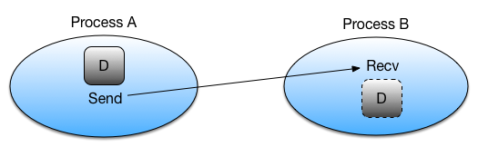

In the previous episode we introduced the various types of communication in MPI.
In this section we will use the MPI library functions `MPI_Send()` and `MPI_Recv()`, which employ point-to-point communication,
to send data from one rank to another.



Let's look at how `MPI_Send()` and `MPI_Recv()`are typically used:

- Rank A decides to send data to rank B. It first packs the data to send into a buffer, from which it will be taken.
- Rank A then calls `MPI_Send()` to create a message for rank B.
  The underlying MPI communication is then given the responsibility of routing the message to the correct destination.
- Rank B must know that it is about to receive a message and acknowledge this by calling `MPI_Recv()`.
  This sets up a buffer for writing the incoming data when it arrives and instructs the communication device to listen for the message.

Note that `MPI_Send` and `MPI_Recv()` are often used in a synchronous manner, meaning they will not return until communication is complete on both sides.
However, as mentioned in the previous episode, `MPI_Send()` may return before the communication is complete, depending on the implementation and message size.

## Sending a Message: MPI_Send()

The `MPI_Send()` function is defined as follows:

```c
int MPI_Send(
  const void *data,
  int count,
  MPI_Datatype datatype,
  int destination,
  int tag,
  MPI_Comm communicator
)
```

|                 |                                                                                                                                             |
|-----------------|---------------------------------------------------------------------------------------------------------------------------------------------|
| `*data`:        | Pointer to the start of the data being sent. We would not expect this to change, hence it's defined as `const`                              |
| `count`:        | Number of elements to send                                                                                                                  |
| `datatype`:     | The type of the element data being sent, e.g. `MPI_INTEGER`, `MPI_CHAR`, `MPI_FLOAT`, `MPI_DOUBLE`, ...                                     |
| `destination`:  | The rank number of the rank the data will be sent to                                                                                        |
| `tag`:          | An message tag (integer), which is used to differentiate types of messages. We can specify `0` if we don't need different types of messages |
| `communicator`: | The communicator, e.g. `MPI_COMM_WORLD` as seen in previous episodes                                                                        |

For example, if we wanted to send a message that contains `"Hello, world!\n"` from rank 0 to rank 1, we could state
(assuming we were rank 0):

```c
char *message = "Hello, world!\n";
MPI_Send(message, 14, MPI_CHAR, 1, 0, MPI_COMM_WORLD);
```

So we are sending 14 elements of `MPI_CHAR()` one time, and specified `0` for our message tag since we don't anticipate
having to send more than one type of message. This call is synchronous, and will block until the corresponding `MPI_Recv()`
operation receives and acknowledges receipt of the message.

::::callout

## MPI_Ssend(): an Alternative to MPI_Send()

`MPI_Send()` represents the "standard mode" of sending messages to other ranks, but some aspects of its behaviour are dependent on both the implementation of MPI being used, and the circumstances of its use. There are three scenarios to consider:

1. The message is directly passed to the receive buffer, in which case the communication has completed
2. The send message is buffered within some internal MPI buffer but hasn't yet been received
3. The function call waits for a corresponding receiving process

In scenarios 1 & 2, the call is able to return immediately, but with 3 it may block until the recipient is ready to receive.
It is dependent on the MPI implementation as to what scenario is selected, based on performance, memory, and other considerations.

A very similar alternative to `MPI_Send()` is to use `MPI_Ssend()` - synchronous send - which ensures the communication is both synchronous and blocking.
This function guarantees that when it returns, the destination has categorically started receiving the message.
::::

## Receiving a Message: MPI_Recv()

Conversely, the `MPI_Recv()` function looks like the following:

```c
int MPI_Recv(
  void *data,
  int count,
  MPI_Datatype datatype,
  int source,
  int tag,
  MPI_Comm communicator,
  MPI_Status *status
)
```

|                 |                                                                                                                                               |
|-----------------|-----------------------------------------------------------------------------------------------------------------------------------------------|
| `*data`:        | Pointer to where the received data should be written                                                                                          |
| `count`:        | Maximum number of elements to receive                                                                                                         |
| `datatype`:     | The type of the data being received                                                                                                           |
| `source`:       | The number of the rank sending the data                                                                                                       |
| `tag`:          | A message tag, which must either match the tag in the sent message, or if `MPI_ANY_TAG` is specified, a message with any tag will be accepted |
| `communicator`: | The communicator (we have used `MPI_COMM_WORLD` in earlier examples)                                                                          |
| `*status`:      | A pointer for writing the exit status of the MPI command, indicating whether the operation succeeded or failed                                |

Continuing our example, to receive our message we could write:

```c
char message[15] = {0}; /* Initialise teh buffer to zeros */
MPI_Status status;
MPI_Recv(message, 14, MPI_CHAR, 0, 0, MPI_COMM_WORLD, &status);
message[14] = '\0';
```

Here, we create a buffer `message` to store the received data and initialise it to zeros (`{0}`) to prevent
any garbage content. We then call `MPI_Recv()` to receive the message, specifying the source rank (`0`), the message tag (`0`),
and the communicator (`MPI_COMM_WORLD`). The status object is passed to capture details about the received message, such as
the actual source rank or tag, though it is not used in this example. To ensure safe string handling,
we explicitly null-terminate the received message by setting `message[14] = '\0'`.

Let's put this together with what we've learned so far.
Here's an example program that uses `MPI_Send()` and `MPI_Recv()` to send the string `"Hello World!"` from rank 0 to rank 1:

```c
#include <stdio.h>
#include <mpi.h>

int main(int argc, char** argv) {
  int rank, n_ranks;

  // First call MPI_Init
  MPI_Init(&argc, &argv);

  // Check that there are two ranks
  MPI_Comm_size(MPI_COMM_WORLD,&n_ranks);
  if( n_ranks != 2 ){
    printf("This example requires exactly two ranks\n");
    MPI_Finalize();
    return 1;
  }

  // Get my rank
  MPI_Comm_rank(MPI_COMM_WORLD,&rank);

  if( rank == 0 ){
     const char *message = "Hello, world!\n";
     MPI_Send(message, 14, MPI_CHAR, 1, 0, MPI_COMM_WORLD);
  }

  if( rank == 1 ){
<<<<<<< HEAD
     char message[15];
=======
     char message[15] = {0};
>>>>>>> main
     MPI_Status  status;
     MPI_Recv(message, 14, MPI_CHAR, 0, 0, MPI_COMM_WORLD, &status);
     message[14] = `\0`;
     printf("%s",message);
  }

  // Call finalise at the end
  return MPI_Finalize();
}
```

:::callout{variant='warning'}
When using `MPI_Recv()` to receive string data, ensure that your buffer is large enough to hold the message and
includes space for a null terminator. Explicitly initialising the buffer and adding the null terminator avoids
undefined behavior or garbage output.
:::

::::callout

## MPI Data Types in C

In the above example we send a string of characters and therefore specify the type `MPI_CHAR`. For a complete list of types,
see [the MPICH documentation](https://www.mpich.org/static/docs/v3.3/www3/Constants.html).
::::

:::::challenge{id=try-it-out, title="Try It Out"}
Compile and run the above code. Does it behave as you expect?

::::solution

```bash
mpicc mpi_hello_world.c -o mpi_hello_world
mpirun -n 2 mpi_hello_world
```

Note above that we specified only 2 ranks, since that's what the program requires (see line 12).
You should see:

```text
Hello, world!
```

::::
:::::

:::::challenge{id=what-happens-if, title="What Happens If..."}
Try modifying, compiling, and re-running the code to see what happens if you...

1. Change the tag integer of the sent message. How could you resolve this where the message is received?
2. Modify the element count of the received message to be smaller than that of the sent message.
  How could you resolve this in how the message is sent?

::::solution

1. The program will hang since it's waiting for a message with a tag that will never be sent (press `Ctrl-C` to kill the hanging process).
  To resolve this, make the tag in `MPI_Recv()` match the tag you specified in `MPI_Send()`.
2. You will likely see a message like the following:

  ```text
  [...:220695] *** An error occurred in MPI_Recv
  [...:220695] *** reported by process [2456485889,1]
  [...:220695] *** on communicator MPI_COMM_WORLD
  [...:220695] *** MPI_ERR_TRUNCATE: message truncated
  [...:220695] *** MPI_ERRORS_ARE_FATAL (processes in this communicator will now abort,
  [...:220695] ***    and potentially your MPI job)
  ```

You could resolve this by sending a message of equal size, truncating the message. A related question is whether this fix makes any sense!
::::
:::::

:::::challenge{id=many-ranks, title="Many Ranks"}
Change the above example so that it works with any number of ranks.
Pair even ranks with odd ranks and have each even rank send a message to the corresponding odd rank.

::::solution

```c
#include <stdio.h>
#include <mpi.h>

int main(int argc, char** argv) {
  int rank, n_ranks, my_pair;

  // First call MPI_Init
  MPI_Init(&argc, &argv);

  // Get the number of ranks
  MPI_Comm_size(MPI_COMM_WORLD,&n_ranks);

  // Get my rank
  MPI_Comm_rank(MPI_COMM_WORLD,&rank);

  // Figure out my pair
  if( rank%2 == 1 ){
    my_pair = rank - 1;
  } else {
    my_pair = rank + 1;
  }

  // Run only if my pair exists
  if( my_pair < n_ranks ){

    if( rank%2 == 0 ){
        const char *message = "Hello, world!\n";
        printf("Rank %d sending to Rank %d\n", rank, my_pair);
        fflush(stdout);
        MPI_Send(message, 14, MPI_CHAR, my_pair, 0, MPI_COMM_WORLD);
    }

    if( rank%2 == 1 ){
        char message[15] = {0};
        MPI_Status status;
        MPI_Recv(message, 14, MPI_CHAR, my_pair, 0, MPI_COMM_WORLD, &status);
        printf("Rank %d received from Rank %d: %s\n", rank, my_pair, message);
        fflush(stdout);
      }
  }

  // Call finalise at the end
  return MPI_Finalize();
}
```

::::
:::::

:::::challenge{id=hello-again, title="Hello Again, World!"}

Modify the Hello World code below so that each rank sends its message to rank 0.
Have rank 0 print each message.

```c
#include <stdio.h>
#include <mpi.h>

int main(int argc, char **argv) {
    int rank;
    char message[30];

    // First call MPI_Init
    MPI_Init(&argc, &argv);

    // Get my rank
    MPI_Comm_rank(MPI_COMM_WORLD, &rank);

    // Print a message using snprintf and then printf
    snprintf(message, 30, "Hello World, I'm rank %d", rank);
    printf("%s\n", message);

    // Call finalise at the end
    return MPI_Finalize();
}
```

Note: In MPI programs, every rank runs the same code. To make ranks behave differently, you must
explicitly program that behavior based on their rank ID. For example:

- Use conditionals like `if (rank == 0)` to define specific actions for rank 0.
- All other ranks can perform different actions in an `else` block.

::::solution

```c
#include <stdio.h>
#include <mpi.h>

int main(int argc, char **argv) {
    int rank, n_ranks, numbers_per_rank;

    // First call MPI_Init
    MPI_Init(&argc, &argv);
    // Get my rank and the number of ranks
    MPI_Comm_rank(MPI_COMM_WORLD, &rank);
    MPI_Comm_size(MPI_COMM_WORLD, &n_ranks);

    if (rank != 0) {
       // All ranks other than 0 should send a message

       char message[30];
       sprintf(message, "Hello World, I'm rank %d\n", rank);
       printf("Rank %d is sending a message to Rank 0.\n", rank);
       fflush(stdout);
       MPI_Send(message, 30, MPI_CHAR, 0, 0, MPI_COMM_WORLD);

    } else {
       // Rank 0 will receive each message and print them

       for( int sender = 1; sender < n_ranks; sender++ ) {
          char message[30];
          MPI_Status status;
          MPI_Recv(message, 30, MPI_CHAR, sender, 0, MPI_COMM_WORLD, &status);
          printf("Rank 0 received a message from Rank %d: %s", sender, message);
       }
    }

    // Call finalise at the end
    return MPI_Finalize();
}
```

Here rank 0 calls `MPI_Recv` to gather messages, while other ranks call `MPI_Send` to send their messages.
Without this differentiation, ranks will attempt the same actions, potentially causing errors or deadlocks.
::::
:::::

:::callout{variant='note'}
If you don't require the additional information provided by `MPI_Status`, such as source or tag,
you can use `MPI_STATUS_IGNORE` in `MPI_Recv` calls. This simplifies your code by removing the need to declare and manage an
`MPI_Status` object. This is particularly useful in straightforward message-passing scenarios.
:::

:::::challenge{id=blocking, title="Blocking"}
Try the code below and see what happens. How would you change the code to fix the problem?

Note: *If you are using the MPICH, this example might automagically work. With OpenMPI it shouldn't!*

```c
#include <mpi.h>

#define ARRAY_SIZE 3

int main(int argc, char **argv) {
    MPI_Init(&argc, &argv);

    int rank;
    MPI_Comm_rank(MPI_COMM_WORLD, &rank);

    const int comm_tag = 1;
    int numbers[ARRAY_SIZE] = {1, 2, 3};
    MPI_Status recv_status;

    if (rank == 0) {
        // synchronous send: returns when the destination has started to
        // receive the message
        MPI_Ssend(&numbers, ARRAY_SIZE, MPI_INT, 1, comm_tag, MPI_COMM_WORLD);
        MPI_Recv(&numbers, ARRAY_SIZE, MPI_INT, 1, comm_tag, MPI_COMM_WORLD, &recv_status);
    } else {
        MPI_Ssend(&numbers, ARRAY_SIZE, MPI_INT, 0, comm_tag, MPI_COMM_WORLD);
        MPI_Recv(&numbers, ARRAY_SIZE, MPI_INT, 0, comm_tag, MPI_COMM_WORLD, &recv_status);
    }
    
    return MPI_Finalize();
}
```

::::solution
`MPI_Send()` will block execution until the receiving process has called `MPI_Recv()`. This prevents the sender from unintentionally modifying the message buffer before the message is actually sent. Above, both ranks call `MPI_Send()` and just wait for the other to respond. The solution is to have one of the ranks receive its message before sending.

Sometimes `MPI_Send()` will actually make a copy of the buffer and return immediately. This generally happens only for short messages. Even when this happens, the actual transfer will not start before the receive is posted.

For this example, let’s have rank 0 send first, and rank 1 receive first. So all we need to do to fix this is to swap the send and receive for rank 1:

```c
if (rank == 0) {
   MPI_Ssend(&numbers, ARRAY_SIZE, MPI_INT, 1, comm_tag, MPI_COMM_WORLD);
   MPI_Recv(&numbers, ARRAY_SIZE, MPI_INT, 1, comm_tag, MPI_COMM_WORLD, &recv_status);
} else {
   // Change the order, receive then send
   MPI_Recv(&numbers, ARRAY_SIZE, MPI_INT, 0, comm_tag, MPI_COMM_WORLD, &recv_status);
   MPI_Ssend(&numbers, ARRAY_SIZE, MPI_INT, 0, comm_tag, MPI_COMM_WORLD);
}
```

::::
:::::

:::::challenge{id=ping-pong, title="Ping Pong"}

Write a simplified simulation of Ping Pong according to the following rules:

- Ranks 0 and 1 participate
- Rank 0 starts with the ball
- The rank with the ball sends it to the other rank
- Both ranks count the number of times they get the ball
- After counting to 1 million, the rank is bored and gives up
- There are no misses or points

::::solution

```c
#include <stdio.h>
#include <mpi.h>

int main(int argc, char** argv) {
  int rank, neighbour;
  int max_count = 1000000;
  int counter;
  int bored;
  int ball = 1; // A dummy message to simulate the ball
  MPI_Status status;

  // First call MPI_Init
  MPI_Init(&argc, &argv);

  // Get my rank
  MPI_Comm_rank(MPI_COMM_WORLD, &rank);

  // Call the other rank the neighbour
  if( rank == 0 ){
    neighbour = 1;
  } else {
    neighbour = 0;
  }

  if( rank == 0 ){
    // Rank 0 starts with the ball. Send it to rank 1
    MPI_Send(&ball, 1, MPI_INT, 1, 0, MPI_COMM_WORLD);
  }

  // Now run a send and receive in a loop until someone gets bored
  // the behaviour is the same for both ranks
  counter = 0;
  bored = 0;

  while( !bored )
  {
    // Receive the ball
    MPI_Recv(&ball, 1, MPI_INT, neighbour, 0, MPI_COMM_WORLD, &status);
 
    
    // Increment the counter and send the ball back
    counter += 1;
    MPI_Send(&ball, 1, MPI_INT, neighbour, 0, MPI_COMM_WORLD);
    
        // Log progress every 100,000 iterations
        if (counter % 100000 == 0) {
            printf("Rank %d exchanged the ball %d times\n", rank, counter);
            fflush(stdout);
        }


    // Check if the rank is bored
    bored = counter >= max_count;
  }
  printf("Rank %d is bored and giving up after %d exchanges\n", rank, counter);
  fflush(stdout);
  // Call finalise at the end
  return MPI_Finalize();
}
```

::::
:::::
