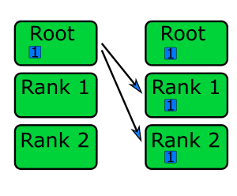
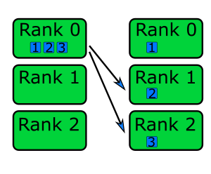
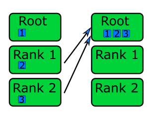
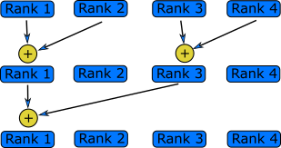
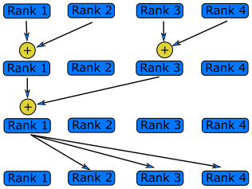

The previous episode showed how to send data from one rank to another using point-to-point communication.
If we wanted to send data from multiple ranks to a single rank to, for example, add up the value of a variable across multiple
ranks, we have to manually loop over each rank to communicate the data. This type of communication, where multiple ranks talk to
one another known as called collective communication. In the code example below, point-to-point communication is used to
calculate the sum of the rank numbers - feel free to try it out!

```c
#include <stdio.h>
#include <mpi.h>

int main(int argc, char **argv) {
    int my_rank, num_ranks;

    // First call MPI_Init
    MPI_Init(&argc, &argv);

    MPI_Comm_rank(MPI_COMM_WORLD, &my_rank);
    MPI_Comm_size(MPI_COMM_WORLD, &num_ranks);

    int sum;
    MPI_Status status;

    // Rank 0 is the "root" rank, where we'll receive data and sum it up
    if (my_rank == 0) {
        sum = my_rank;

        // Start by receiving the rank number from every rank, other than itself
        for (int i = 1; i < num_ranks; ++i) {
            int recv_num;
            MPI_Recv(&recv_num, 1, MPI_INT, i, 0, MPI_COMM_WORLD, &status);
            sum += recv_num;
        }
        // Now sum has been calculated, send it back to every rank other than the root
        for (int i = 1; i < num_ranks; ++i) {
            MPI_Send(&sum, 1, MPI_INT, i, 0, MPI_COMM_WORLD);
        }
    } else {  // All other ranks will send their rank number and receive sum */
        MPI_Send(&my_rank, 1, MPI_INT, 0, 0, MPI_COMM_WORLD);
        MPI_Recv(&sum, 1, MPI_INT, 0, 0, MPI_COMM_WORLD, &status);
    }

    printf("Rank %d has a sum of %d\n", my_rank, sum);

    // Call finalise at the end
    return MPI_Finalize();
}
```

For its use case, the code above works perfectly fine. However, it isn't very efficient when you need to communicate large
amounts of data, have lots of ranks, or when the workload is uneven (due to the blocking communication). It's also a lot of code
to do not much, which makes it easy to introduce mistakes in our code. A common mistake in this example would be to start the
loop over ranks from 0, which would cause a deadlock! It's actually quite a common mistake for new MPI users to write something
like the above.

We don't need to write code like this (unless we want *complete* control over the data communication), because MPI has
access to collective communication functions to abstract all of this code for us. The above code can be replaced by a single
collective communication function. Collection operations are also implemented far more efficiently in the MPI library than we
could ever write using point-to-point communications.

There are several collective operations that are implemented in the MPI standard. The most commonly-used are:

| Type            | Example MPI Function | Description                                                    |
|-----------------|----------------------|----------------------------------------------------------------|
| Synchronization | Barrier              | Wait until all ranks reach the same point in the program.      |
| One-To-All      | Broadcast            | One rank sends the same message to all other ranks.            |
| All-To-One      | Reduce               | All ranks send data to a single rank.                          |
| One-To-Many     | Scatter              | A single rank sends different parts of data to multiple ranks. |
| Many-To-One     | Gather               | Multiple ranks send data to a single rank.                     |
| All-To-All      | Allreduce            | All ranks have data and all ranks receive data.                |

## Synchronisation

### Barrier

The most simple form of collective communication is a barrier. Barriers are used to synchronise ranks by adding a point in a program where ranks *must* wait until all ranks have reached the same point. A barrier is a collective operation because all ranks need to communicate with one another to know when they can leave the barrier. To create a barrier, we use the `MPI_Barrier()` function,

```c
int MPI_Barrier(
    MPI_Comm comm
);
```

|       |                                      |
|-------|--------------------------------------|
| comm: | The communicator to add a barrier to |

When a rank reaches a barrier, it will pause and wait for all the other ranks to catch up and reach the barrier as well. As ranks waiting at a barrier aren't doing anything, barriers should be used sparingly to avoid large synchronisation overheads, which affects the scalability of our program.
We should also avoid using barriers in parts of our program has have complicated branches, as we may introduce a deadlock by having a barrier in only one branch.

In practice, there are not that many practical use cases for a barrier in an MPI application. In a shared-memory environment, synchronisation is important to ensure consistent and controlled access to shared data. But in MPI,
where each rank has its own private memory space and often resources, it's rare that we need to care about ranks becoming out-of-sync. However, one use case is when multiple ranks need to write *sequentially* to the same file. The code example below shows how you may handle this by using a barrier.

```c
for (int i = 0; i < num_ranks; ++i) {
    if (i == my_rank) {           /* One rank writes to the file */
        write_to_file();
    }
    MPI_Barrier(MPI_COMM_WORLD);  /* Wait for data to be written, so it is sequential and ordered */
}
```

## One-To-All

### Broadcast

We'll often find that we need to data from one rank to all the other ranks. One approach, which is not very efficient,
is to use `MPI_Send()` in a loop to send the data from rank to rank one by one. A far more efficient approach is to use the
collective function `MPI_Bcast()` to *broadcast* the data from a root rank to every other rank.
The `MPI_Bcast()` function has the following arguments,

```c
int MPI_Bcast(
    void *data,             
    int count,              
    MPI_Datatype datatype,  
    int root,               
    MPI_Comm comm           
);
```

|             |                                                       |
|-------------|-------------------------------------------------------|
| `*data`:    | The data to be sent to all ranks                      |
| `count`:    | The number of elements of data                        |
| `datatype`: | The datatype of the data                              |
| `root`:     | The rank which data will be sent from                 |
| `comm`:     | The communicator containing the ranks to broadcast to |

`MPI_Bcast()` is similar to the `MPI_Send()` function.
The main functional difference is that `MPI_Bcast()` sends the data to all ranks (other than itself, where the data already is)
instead of a single rank, as shown in the diagram below.



Unlike `MPI_Send()` and `MPI_Recv()`, collective operations like `MPI_Bcast()` do not require explicitly matching sends and
receives in the user code. The internal implementation of collective functions ensures that all ranks correctly send and
receive data as needed, abstracting this complexity from the programmer. This makes collective operations easier to use and less error-prone compared to point-to-point communication.

There are lots of use cases for broadcasting data. One common case is when data is sent back to a "root" rank to process, which then broadcasts the results back out to all the other ranks.
Another example, shown in the code excerpt below, is to read data in on the root rank and to broadcast it out.
This is useful pattern on some systems where there are not enough resources (filesystem bandwidth, limited concurrent I/O operations) for every rank to read the file at once.

```c
int data_from_file[NUM_POINTS]

/* Read in data from file, and put it into data_from_file. We are only reading data
   from the root rank (rank 0), as multiple ranks reading from the same file at the
   same time can sometimes result in problems or be slower */
if (my_rank == 0) {
    get_data_from_file(data_from_file);
}

/* Use MPI_Bcast to send the data to every other rank */
MPI_Bcast(data_from_file, NUM_POINTS, MPI_INT, 0, MPI_COMM_WORLD);
```

:::::challenge{id=sending-greetings, title="Sending Greetings"}

Send a message from rank 0 saying "Hello from rank 0" to all ranks using `MPI_Bcast()`.

::::solution

```c
#include <mpi.h>
#include <stdio.h>
#include <string.h>

#define NUM_CHARS 32

int main(int argc, char **argv) {
    int my_rank, num_ranks;
    MPI_Init(&argc, &argv);
    MPI_Comm_rank(MPI_COMM_WORLD, &my_rank);
    MPI_Comm_size(MPI_COMM_WORLD, &num_ranks);

    char message[NUM_CHARS];

    if (my_rank == 0) {
        strcpy(message, "Hello from rank 0");
    }

    MPI_Bcast(message, NUM_CHARS, MPI_CHAR, 0, MPI_COMM_WORLD);
    printf("I'm rank %d and I got the message '%s'\n", my_rank, message);

    return MPI_Finalize();
}
```

::::
:::::

### Scatter

One way to parallelise processing an amount of data is to have ranks process a subset of the data.
One method for distributing the data to each rank is to have a root rank which prepares the data, and then send the data to every rank.
The communication could be done *manually* using point-to-point communication, but it's easier, and faster, to use a single collective communication.
We can use `MPI_Scatter()` to split the data into *equal* sized chunks and communicate a different chunk to each rank, as shown in the diagram below.



`MPI_Scatter()` has the following arguments:

```c
int MPI_Scatter(
    void *sendbuf,
    int sendcount,
    MPI_Datatype sendtype,
    void *recvbuffer,
    int recvcount,
    MPI_Datatype recvtype,
    int root,
    MPI_Comm comm
);
```

|                |                                                                                        |
|----------------|----------------------------------------------------------------------------------------|
| `*sendbuf`:    | The data to be scattered across ranks (only important for the root rank)               |
| `sendcount`:   | The number of elements of data to send to each rank (only important for the root rank) |
| `sendtype`:    | The data type of the data being sent (only important for the root rank)                |
| `*recvbuffer`: | A buffer to receive data into, including the root rank                                 |
| `recvcount`:   | The number of elements of data to receive. Usually the same as `sendcount`             |
| `recvtype`:    | The data type of the data being received. Usually the same as `sendtype`               |
| `root`:        | The rank data is being scattered from                                                  |
| `comm`:        | The communicator                                                                       |

The data to be *scattered* is split into even chunks of size `sendcount`.
If `sendcount` is 2 and `sendtype` is `MPI_INT`, then each rank will receive two integers.
The values for `recvcount` and `recvtype` are the same as `sendcount` and `sendtype`. However, there are cases where `sendcount`
and `recvcount` might differ, such as when using derived types, which change how data is packed and unpacked during communication.
For more on derived types and their impact on collective operations, see the
[Derived Data Types](07-derived-data-types.md) episode. If the total amount of data is not evenly divisible by the number of processes, `MPI_Scatter()` will
not work. In this case, we need to use [`MPI_Scatterv()`](https://www.open-mpi.org/doc/v4.0/man3/MPI_Scatterv.3.php) instead to specify the amount of data each rank will receive.
The code example below shows `MPI_Scatter()` being used to send data which has been initialised only on the root rank.

```c
#define ROOT_RANK 0

int send_data[NUM_DATA_POINTS]

if (my_rank == ROOT_RANK) {
    initialise_send_data(send_data);  /* The data which we're going to scatter only needs to exist in the root rank */
}

/* Calculate the elements of data each rank will get, and allocate space for
   the receive buffer -- we are assuming NUM_DATA_POINTS is divisible by num_ranks */
int num_per_rank = NUM_DATA_POINTS / num_ranks;
int *scattered_data_for_rank = malloc(num_per_rank * sizeof(int));

/* Using a single function call, the data has been split and communicated evenly between all ranks */
MPI_Scatter(send_data, num_per_rank, MPI_INT, scattered_data_for_rank, num_per_rank, MPI_INT, ROOT_RANK, MPI_COMM_WORLD);
```

## All-To-One

### Gather

The opposite of scattering from one rank to multiple, is to gather data from multiple ranks into a single rank.
We can do this by using the collection function `MPI_Gather()`, which has these arguments:

```c
int MPI_Gather(
    void *sendbuf,
    int sendcount,
    MPI_Datatype sendtype,
    void *recvbuff,
    int recvcount,
    MPI_Datatype recvtype,
    int root,
    MPI_Comm comm
);
```

|              |                                                                          |
|--------------|--------------------------------------------------------------------------|
| `*sendbuf`:  | The data to send to the root rank                                        |
| `sendcount`: | The number of elements of data to send                                   |
| `sendtype`:  | The data type of the data being sent                                     |
| `*recvbuff`: | The buffer to put gathered data into (only important for the root rank)  |
| `recvcount`: | The number of elements being received, usually the same as `sendcount`   |
| `recvtype`:  | The data type of the data being received, usually the same as `sendtype` |
| `root`:      | The root rank, where data will be gathered to                            |
| `comm`:      | The communicator                                                         |

The receive buffer needs to be large enough to hold data from all of the ranks. For example, if there are 4 ranks sending 10 integers, then `recvbuffer` needs to be able to store *at least* 40 integers.
We can think of `MPI_Gather()` as being the inverse of `MPI_Scatter()`.
This is shown in the diagram below, where data from each rank on the left is sent to the root rank (rank 0) on the right.



In the code example below, `MPI_Gather()` is used to gather the contents of `rank_data` from each rank, to rank 0 (the root rank).

```c
int rank_data[NUM_DATA_POINTS];

/* Each rank generates some data, including the root rank */
for (int i = 0; i < NUM_DATA_POINTS; ++i) {
    rank_data[i] = (rank + 1) * (i + 1);
}

/* To gather all of the data, we need a buffer to store it. To make sure we have enough
   space, we need to make sure we allocate enough memory on the root rank */
int recv_count = NUM_DATA_POINTS * num_ranks;
int *gathered_data = malloc(recv_count * sizeof(int));

/* MPI_Gather is used in a similar way to MPI_Scatter. Note how that even though we have
   allocated recv_count elements for *gathered_data, MPI_Gather has recv_count set to
   NUM_DATA_POINTS. This is because we are expecting to receive that many elements from
   each rank */
MPI_Gather(rank_data, NUM_DATA_POINTS, MPI_INT, gathered_data, NUM_DATA_POINTS, MPI_INT, 0, MPI_COMM_WORLD);
```

:::::challenge{id=gathering-greetings, title="Gathering Greetings"}
In the previous episode, we used point-to-point communication to send a greeting message to rank 0 from every other rank.
Instead of using point-to-point communication functions, re-implement your solution using `MPI_Gather()` instead.
You can use [this code](./code/solutions/05-hello-gather-skeleton.c) as your starting point.

::::solution

```c
#include <mpi.h>
#include <stdio.h>
#include <stdlib.h>

#define NUM_CHARS 32

int main(int argc, char **argv) {
    int my_rank, num_ranks;
    MPI_Init(&argc, &argv);
    MPI_Comm_rank(MPI_COMM_WORLD, &my_rank);
    MPI_Comm_size(MPI_COMM_WORLD, &num_ranks);

    char message[NUM_CHARS];
    snprintf(message, NUM_CHARS, "Hello from rank %d", my_rank);

    char *recv_buffer = malloc(NUM_CHARS * num_ranks * sizeof(char));
    MPI_Gather(message, NUM_CHARS, MPI_CHAR, recv_buffer, NUM_CHARS, MPI_CHAR, 0, MPI_COMM_WORLD);

    if (my_rank == 0) {
        for (int i = 0; i < num_ranks; ++i) { /* snprintf null terminates strings */
            printf("%s\n", &recv_buffer[i * NUM_CHARS]);
        }
    }

    free(recv_buffer);

    return MPI_Finalize();
}
```

::::
:::::

### Reduce

A reduction operation is one which takes values across the ranks, and combines them into a single value.
Reductions are probably the most common collective operation you will use.
The example at the beginning of this episode was a reduction operation, summing up a bunch of numbers, implemented using point-to-point communication.
Reduction operations can be done using the collection function `MPI_Reduce()`, which has the following arguments:

```c
int MPI_Reduce(
    void *sendbuf,
    void *recvbuffer,
    int count,
    MPI_Datatype datatype,
    MPI_Op op,
    int root,
    MPI_Comm comm
);
```

|                |                                                 |
|----------------|-------------------------------------------------|
| `*sendbuf`:    | The data to be reduced by the root rank         |
| `*recvbuffer`: | A buffer to contain the reduction output        |
| `count`:       | The number of elements of data to be reduced    |
| `datatype`:    | The data type of the data                       |
| `op`:          | The reduction operation to perform              |
| `root`:        | The root rank, which will perform the reduction |
| `comm`:        | The communicator                                |

The `op` argument controls which reduction operation is carried out, from the following possible operations:

| Operation    | Description                                                                      |
|--------------|----------------------------------------------------------------------------------|
| `MPI_SUM`    | Calculate the sum of numbers sent by each rank.                                  |
| `MPI_MAX`    | Return the maximum value of numbers sent by each rank.                           |
| `MPI_MIN`    | Return the minimum of numbers sent by each rank.                                 |
| `MPI_PROD`   | Calculate the product of numbers sent by each rank.                              |
| `MPI_MAXLOC` | Return the maximum value and the number of the rank that sent the maximum value. |
| `MPI_MINLOC` | Return the minimum value of the number of the rank that sent the minimum value.  |

In a reduction operation, each rank sends a piece of data to the root rank, which are combined, depending on the choice of operation, into a single value on the root rank, as shown in the diagram below. Since the data is sent and operation done on the root rank, it means the reduced value is only available on the root rank.



By using `MPI_Reduce()` and `MPI_Bcast()`, we can refactor the first code example into two collective functions:

```c
MPI_Comm_rank(MPI_COMM_WORLD, &my_rank);

int sum;
MPI_Reduce(&my_rank, &sum, 1, MPI_INT, MPI_SUM, 0, MPI_COMM_WORLD);
MPI_Bcast(&sum, 1, MPI_INT, 0, MPI_COMM_WORLD);  /* Using MPI_Bcast to send the reduced value to every rank */
```

## All-to-All

### Allreduce

In the code example just above, after the reduction operation we used `MPI_Bcast()` to communicate the result to every rank in the communicator. This is a common pattern, so much so that there is a collective operation which does both in a single function call:

```c
int MPI_Allreduce(
    void *sendbuf,          
    void *recvbuffer,       
    int count,              
    MPI_Datatype datatype,  
    MPI_Op op,              
    MPI_Comm comm           
);
```

|                |                                                  |
|----------------|--------------------------------------------------|
| `*sendbuf`:    | The data to be reduced, on all ranks             |
| `*recvbuffer`: | A buffer which will contain the reduction output |
| `count`:       | The number of elements of data to be reduced     |
| `datatype`:    | The data type of the data                        |
| `op`:          | The reduction operation to use                   |
| `comm`:        | The communicator                                 |



`MPI_Allreduce()` performs the same operations as `MPI_Reduce()`, but the result is sent to all ranks rather than only being available on the root rank.
This means we can remove the `MPI_Bcast()` in the previous code example and remove almost all of the code in the reduction example using point-to-point communication at the beginning of the episode. This is shown in the following code example:

```c
int sum;
MPI_Comm_rank(MPI_COMM_WORLD, &my_rank);

/* MPI_Allreduce effectively replaces all of the code in the first example of this
   episode, and is also faster */
MPI_Allreduce(&my_rank, &sum, 1, MPI_INT, MPI_SUM, MPI_COMM_WORLD);
```

::::callout

## In-Place Operations

In MPI, we can use in-place operations to eliminate the need for separate send and receive buffers in some collective operations. We typically do this by using the `MPI_IN_PLACE` constant in place of the send buffer, as in the example below using `MPI_Allreduce()`:

```c
sum = my_rank;
MPI_Allreduce(MPI_IN_PLACE, &sum, 1, MPI_INT, MPI_SUM, 0, MPI_COMM_WORLD);
```

Not all collective operations support in-place operations, and the usage of `MPI_IN_PLACE` can be different for the other collective functions which support it.
::::

:::::challenge{id=reductions, title="Reductions"}
The following program creates an array called `vector` that contains a list of `n_numbers` on each rank.
The first rank contains the numbers from 0 to n_numbers, the second rank from n_numbers to 2*n_numbers and so on.
It then calls the `find_max` and `find_sum` functions that should calculate the sum and maximum of the vector.

These functions are not implemented in parallel and only return the sum and the maximum of the local vectors.
Modify the `find_sum` and `find_max` functions to work correctly in parallel using `MPI_Reduce` or `MPI_Allreduce`.

```c
#include <stdio.h>
#include <mpi.h>

// Calculate the sum of numbers in a vector
double find_sum(double * vector, int N) {
   double sum = 0;
   for (int i = 0; i < N; ++i){
      sum += vector[i];
   }
   return sum;
}

// Find the maximum of numbers in a vector
double find_maximum(double *vector, int N) {
   double max = 0;
   for (int i = 0; i < N; ++i){
      if (vector[i] > max){
         max = vector[i];
      }
   }
   return max;
}

int main(int argc, char **argv) {
   int n_numbers = 1024;
   int rank;
   double vector[n_numbers];
   double sum, max;
   double my_first_number;

   // First call MPI_Init
   MPI_Init(&argc, &argv);

   // Get my rank
   MPI_Comm_rank(MPI_COMM_WORLD, &rank);

   // Each rank will have n_numbers numbers,
   // starting from where the previous left off
   my_first_number = n_numbers*rank;

   // Generate a vector
   for (int  i = 0; i < n_numbers; ++i) {
      vector[i] = my_first_number + i;
   }

   //Find the sum and print
   sum = find_sum( vector, n_numbers );
   printf("The sum of the numbers is %f\n", sum);

   //Find the maximum and print
   max = find_maximum( vector, n_numbers );
   printf("The largest number is %f\n", max);

   // Call finalize at the end
   return MPI_Finalize();
}
```

::::solution

```c
// Calculate the sum of numbers in a vector
double find_sum(double *vector, int N) {
   double sum = 0;
   double global_sum;

   // Calculate the sum on this rank as before
   for (int i = 0; i < N; ++i){
      sum += vector[i];
   }

   // Call MPI_Allreduce to find the full sum
   MPI_Allreduce(&sum, &global_sum, 1, MPI_DOUBLE, MPI_SUM, MPI_COMM_WORLD);

   return global_sum;
}

// Find the maximum of numbers in a vector
double find_maximum(double *vector, int N) {
   double max = 0;
   double global_max;

   // Calculate the sum on this rank as before
   for (int i = 0; i < N; ++i){
      if (vector[i] > max){
         max = vector[i];
      }
   }

   // Call MPI_Allreduce to find the maximum over all the ranks
   MPI_Allreduce(&max, &global_max, 1, MPI_DOUBLE, MPI_MAX, MPI_COMM_WORLD);

   return global_max;
}
```

::::
:::::

::::callout

## More collective operations are available

The collective functions introduced in this episode do not represent an exhaustive list of *all* collective operations in MPI. There are a number which are not covered, as their usage is not as common. You can usually find a list of the collective functions available for the implementation of MPI you choose to use, e.g.
[Microsoft MPI documentation](https://learn.microsoft.com/en-us/message-passing-interface/mpi-collective-functions).
::::
