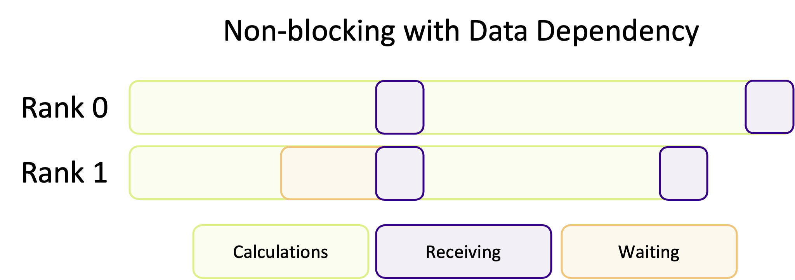
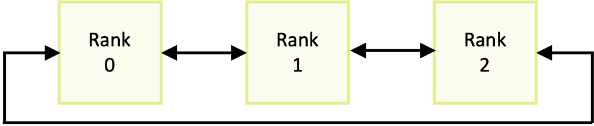

In the previous episodes, we learnt how to send messages between two ranks or collectively to multiple ranks. In both cases, we used blocking communication functions which meant our program wouldn’t progress until the communication had completed. It takes time and computing power to transfer data into buffers, to send that data around (over the network) and to receive the data into another rank. But for the most part, the CPU isn’t actually doing much at all during communication, when it could still be number crunching.

## Why bother with non-blocking communication?

Non-blocking communication is communication which happens in the background. So we don’t have to let any CPU cycles go to waste! If MPI is dealing with the data transfer in the background, we can continue to use the CPU in the foreground and keep doing tasks whilst the communication completes. By *overlapping* computation with communication, we hide the latency/overhead of communication. This is critical for lots of HPC applications, especially when using lots of CPUs, because, as the number of CPUs increases, the overhead of communicating with them all also increases. If you use blocking synchronous sends, the time spent communicating data may become longer than the time spent creating data to send! All non-blocking communications are asynchronous, even when using synchronous sends, because the communication happens in the background, even though the communication cannot complete until the data is received.

::::callout

## So, how do I use non-blocking communication?

Just as with buffered, synchronous, ready and standard sends, MPI has to be programmed to use either blocking or non-blocking communication. For almost every blocking function, there is a non-blocking equivalent. They have the same name as their blocking counterpart, but prefixed with "I". The "I" stands for "immediate", indicating that the function returns immediately and does not block the program. The table below shows some examples of blocking functions and their non-blocking counterparts.

| Blocking        | Non-blocking     |
| --------------- | ---------------- |
| `MPI_Bsend()`   | `MPI_Ibsend()`   |
| `MPI_Barrier()` | `MPI_Ibarrier()` |
| `MPI_Reduce()`  | `MPI_Ireduce()`  |

But, this isn't the complete picture. As we'll see later, we need to do some additional bookkeeping to be able to use
non-blocking communications.
::::

By effectively utilizing non-blocking communication, we can develop applications that scale significantly better during intensive communication. However, this comes with the trade-off of both increased conceptual and code complexity. Since non-blocking communication doesn't keep control until the communication finishes, we don't actually know if a communication has finished unless we check; this is usually referred to as synchronisation, as we have to keep ranks in sync to ensure they have the correct data. So whilst our program continues to do other work, it also has to keep pinging to see if the communication has finished, to ensure ranks are synchronised. If we check too often, or don't have enough tasks to "fill in the gaps", then there is no advantage to using non-blocking communication and we may replace communication overheads with time spent keeping ranks in sync! It is not always clear cut or predictable if non-blocking communication will improve performance. For example, if one ranks depends on the data of another, and there are no tasks for it to do whilst it waits, that rank will wait around until the data is ready, as illustrated in the diagram below. This essentially makes that non-blocking communication a blocking communication. Therefore unless our code is structured to take advantage of being able to overlap communication with computation, non-blocking communication adds complexity to our code for no gain.



::::challenge{id=advantages-and-disadvantages, title="Advantages and Disadvantages"}

What are the main advantages of using non-blocking communication, compared to blocking? What about any disadvantages?

:::solution
Some of the advantages of non-blocking communication over blocking communication include:

- Non-blocking communication gives us the ability to interleave communication with computation.
  By being able to use the CPU whilst the network is transmitting data, we create algorithms with more efficient hardware usage.
- Non-blocking communication also improve the scalability of our program, due to the smaller communication overhead and latencies associated with communicating between a large number of ranks.
- Non-blocking communication is more flexible, which allows for more sophisticated parallel and communication algorithms.

On the other hand, some  disadvantages are:

- It is more difficult to use non-blocking communication.
  Not only does it result in more, and more complex, lines of code, we also have to worry about rank synchronisation and data dependency.
- Whilst typically using non-blocking communication, where appropriate, improves performance, it's not always clear cut or predictable if non-blocking will result in sufficient performance gains to justify the increased complexity.
:::
::::

## Point-to-point communication

For each blocking communication function we've seen, a non-blocking variant exists.
For example, if we take `MPI_Send()`, the non-blocking variant is `MPI_Isend()` which has the arguments:

```c
int MPI_Isend(
    void *buf,
    int count,
    MPI_Datatype datatype,
    int dest,
    int tag,
    MPI_Comm comm,
    MPI_Request *request
);
```

|    |                                          |
|-------------|-----------------------------------------------------|
| `*buf`:     | The data to be sent                                 |
| `count`:    | The number of elements of data                      |
| `datatype`: | The data types of the data                          | 
| `dest`:     | The rank to send data to                            | 
| `tag`:      | The communication tag                               |
| `comm`:     | The communicator                                    |
| `*request`: | The request handle, used to track the communication |

The arguments are identical to `MPI_Send()`, other than the addition of the `*request` argument.
This argument is known as an *handle* (because it "handles" a communication request) which is used to track the progress of a (non-blocking) communication.

When we use non-blocking communication, we have to follow it up with `MPI_Wait()` to synchronise 
the program and make sure `*buf` is ready to be re-used. This is incredibly important to do. 
Suppose we are sending an array of integers,

```c
MPI_Isend(some_ints, 5, MPI_INT, 1, 0, MPI_COMM_WORLD, &request); 
some_ints[1] = 5;  /* !!! don't do this !!! */
```
Modifying `some_ints` before the send has completed is undefined behaviour, and can result in breaking results! For 
example, if `MPI_Isend()` decides to use its buffered mode then modifying `some_ints` before it's finished being copied to the send buffer will means the wrong data is sent. Every non-blocking communication has to have a corresponding `MPI_Wait()`, to wait and synchronise the program to ensure that the data being sent is ready to be modified again. `MPI_Wait()` is a blocking function which will only return when a communication has finished.

```c
int MPI_Wait(
    MPI_Request *request,
    MPI_Status *status
);
```
|            |          |
|-------------|----------------------|
| `*request`: | The request handle for the communication |
| `*status`: | The status handle for the communication |

Once we have used `MPI_Wait()` and the communication has finished, we can safely modify `some_ints` again. To receive
the data send using a non-blocking send, we can use either the blocking `MPI_Recv()` or it's non-blocking variant.

```c
int MPI_Irecv(
    void *buf,              
    int count,              
    MPI_Datatype datatype,  
    int source,             
    int tag,                
    MPI_Comm comm,          
    MPI_Request *request,  
);
```

|            |          |
|-------------|----------------------|
| `*buf`: | A buffer to receive data into |
| `count`: | The number of elements of data to receive |
| `datatype`: | The data type of the data |
| `source`: | The rank to receive data from |
| `tag`: | The communication tag |
| `comm`: | The communicator |
| `*request`: | The request handle for the receive |


:::::challenge{id=true-or-false, title="True or False?"}
Is the following statement true or false? Non-blocking communication guarantees immediate completion of data transfer.

::::solution
**False**. Just because the communication function has returned,  does not mean the communication has finished and the communication buffer is ready to be re-used or read from.
Before we access, or edit, any data which has been used in non-blocking communication, we always have to test/wait for the communication to finish using `MPI_Wait()` before it is safe to use it.
::::
:::::

In the example below, an array of integers (`some_ints`) is sent from rank 0 to rank 1 using non-blocking communication.

```c
MPI_Status status;
MPI_Request request;

int recv_ints[5];
int some_ints[5] = { 1, 2, 3, 4, 5 };

if (my_rank == 0) {
    MPI_Isend(some_ints, 5, MPI_INT, 1, 0, MPI_COMM_WORLD, &request);
    MPI_Wait(&request, &status);
    some_ints[1] = 42;  // After MPI_Wait(), some_ints has been sent and can be modified again
} else {
    MPI_Irecv(recv_ints, 5, MPI_INT, 0, 0, MPI_COMM_WORLD, &request);
    MPI_Wait(&request, &status);
    int data_i_wanted = recv_ints[2];  // recv_ints isn't guaranteed to have the correct data until after MPI_Wait()
}
```

The code above is functionally identical to blocking communication, because of `MPI_Wait()` is blocking. The program will not continue until `MPI_Wait()` returns. Since there is no additional work between the communication call and blocking wait, this is a poor example of how non-blocking communication should be used. It doesn't take advantage of the asynchronous nature of non-blocking communication at all. To really make use of non-blocking communication, we need to interleave computation (or any busy work we need to do) with communication, such as as in the next example.

```c
MPI_Status status;
MPI_Request request;

if (my_rank == 0) {
    /* This send important_data without being blocked and move into the next work */
    MPI_Isend(important_data, 16, MPI_INT, 1, 0, MPI_COMM_WORLD, &request);
} else {
    /* Start listening for the message from the other rank, but isn't blocked */
    MPI_Irecv(important_data, 16, MPI_INT, 0, 0, MPI_COMM_WORLD, &request);
}

/* Whilst the message is still sending or received, we should do some other work
   to keep using the CPU (which isn't required for most of the communication.
   IMPORTANT: the work here cannot modify or rely on important_data */
clear_model_parameters();
initialise_model();

/* Once we've done the work which doesn't require important_data, we need to wait until the
   data is sent/received if it hasn't already */
MPI_Wait(&request, &status);

/* Now the model is ready and important_data has been sent/received, the simulation
   carries on */
simulate_something(important_data);
```

:::::challenge{id=what-about-deadlocks, title="What About Deadlocks?"}
Deadlocks are easily created when using blocking communication.
The code snippet below shows an example of deadlock from one of the previous episodes.

```c
if (my_rank == 0) {
    MPI_Send(&numbers, 8, MPI_INT, 1, 0, MPI_COMM_WORLD);
    MPI_Recv(&numbers, 8, MPI_INT, 1, 0, MPI_COMM_WORLD, &status);
} else {
    MPI_Send(&numbers, 8, MPI_INT, 0, 0, MPI_COMM_WORLD);
    MPI_Recv(&numbers, 8, MPI_INT, 0, 0, MPI_COMM_WORLD, &status);
}
```

If we changed to non-blocking communication, do you think there would still be a deadlock? Try writing your own non-blocking version.

::::solution
The non-blocking version of the code snippet may look something like this:

```c
MPI_Request send_req, recv_req;

if (my_rank == 0) {
    MPI_Isend(numbers, 8, MPI_INT, 1, 0, MPI_COMM_WORLD, &send_req);
    MPI_Irecv(numbers, 8, MPI_INT, 1, 0, MPI_COMM_WORLD, &recv_req);
} else {
    MPI_Isend(numbers, 8, MPI_INT, 0, 0, MPI_COMM_WORLD, &send_req);
    MPI_Irecv(numbers, 8, MPI_INT, 0, 0, MPI_COMM_WORLD, &recv_req);
}

MPI_Status statuses[2];
MPI_Request requests[2] = { send_req, recv_req };
MPI_Waitall(2, requests, statuses);  // Wait for both requests in one function
```

This version of the code will not deadlock, because the non-blocking functions return immediately. So even though rank 
0 and 1 one both send, meaning there is no corresponding receive, the immediate return from send means the 
receive function is still called. Thus a deadlock cannot happen.

However, it is still possible to create a deadlock using `MPI_Wait()`. If `MPI_Wait()` is waiting to for `MPI_Irecv()` to get some data, but there is no matching send operation (so no data has been sent), then `MPI_Wait()` can never return resulting in a deadlock. In the example code below, rank 0 becomes deadlocked.

```c
MPI_Status status;
MPI_Request send_req, recv_req;

if (my_rank == 0) {
    MPI_Isend(numbers, 8, MPI_INT, 1, 0, MPI_COMM_WORLD, &send_req);
    MPI_Irecv(numbers, 8, MPI_INT, 1, 0, MPI_COMM_WORLD, &recv_req);
} else {
    MPI_Irecv(numbers, 8, MPI_INT, 0, 0, MPI_COMM_WORLD, &recv_req);
}

MPI_Wait(&send_req, &status);  
MPI_Wait(&recv_req, &status);  // Wait for both requests in one function
```
::::
:::::

## To wait, or not to wait

In some sense, by using `MPI_Wait()` we aren't fully non-blocking because we still block execution whilst we wait for communications to complete. To be "truly" asynchronous we can use another function called `MPI_Test()` which, at face value, is the non-blocking counterpart of `MPI_Wait()`. When we use `MPI_Test()`, it checks if a communication is finished and sets the value of a flag to true if it is and returns. If a communication hasn't finished, `MPI_Test()` still returns but the value of the flag is false instead. `MPI_Test()` has the following arguments:

```c
int MPI_Test(
    MPI_Request *request,  
    int *flag,             
    MPI_Status *status,    
);
```
|            |          |
|-------------|------------------------------------------|
| `*request`: | The request handle for the communication |
| `*flag`: | A flag to indicate if the communication has completed |
| `*status`: | The status handle for the communication |

`*request` and `*status` are the same you'd use for `MPI_Wait()`. `*flag` is the variable which is modified to indicate if the communication has finished or not. Since it's an integer, if the communication hasn't finished then `flag == 0`.

We use `MPI_Test()` is much the same way as we'd use `MPI_Wait()`. We start a non-blocking communication, and keep doing other, independent, tasks whilst the communication finishes. The key difference is that since `MPI_Test()` returns immediately, we may need to make multiple calls before the communication is finished. In the code example below, `MPI_Test()` is used within a `while` loop which keeps going until either the communication has finished or until there is no other work left to do.

```c
MPI_Status status;
MPI_Request request;
MPI_Irecv(recv_buffer, 16, MPI_INT, 0, 0, MPI_COMM_WORLD, &request);

// We need to define a flag, to track when the communication has completed
int comm_completed = 0;

// One example use case is keep checking if the communication has finished, and continuing
// to do CPU work until it has
while (!comm_completed && work_still_to_do()) {
    do_some_other_work();
    // MPI_Test will return flag == true when the communication has finished
    MPI_Test(&request, &comm_completed, &status);
}

// If there is no more work and the communication hasn't finished yet, then we should wait
// for it to finish
if (!comm_completed) {
    MPI_Wait(&request, &status);
}
```

::::callout

## Dynamic task scheduling

Dynamic task schedulers are a class of algorithms designed to optimise the work load across ranks.
The most efficient, and, really, only practical, implementations use non-blocking communication to periodically check the work balance and *asynchronously* assign and send additional work to a rank, in the background, as it continues to work on its current queue of work.
::::

::::callout

## An interesting aside: communication timeouts

Non-blocking communication gives us a lot of flexibility, letting us write complex communication algorithms to experiment and find the right solution. One example of that flexibility is using `MPI_Test()` to create a communication timeout algorithm.

```c
#define COMM_TIMEOUT 60  // seconds

clock_t start_time = clock();
double elapsed_time = 0.0;
int comm_completed = 0

while (!comm_completed && elapsed_time < COMM_TIMEOUT) {
    // Check if communication completed
    MPI_Test(&request, &comm_completed, &status);
    // Update elapsed time
    elapsed_time = (double)(clock() - start_time) / CLOCKS_PER_SEC;
}

if (elapsed_time >= COMM_TIMEOUT) {
    MPI_Cancel(&request);           // Cancel the request to stop the, e.g. receive operation
    handle_communication_errors();  // Put the program into a predictable state
}
```

Something like this would effectively remove deadlocks in our program, and allows us to take appropriate actions to recover the program back into a predictable state.
In reality, however, it would be hard to find a useful and appropriate use case for this in scientific computing.
In any case, though, it demonstrate the power and flexibility offered by non-blocking communication.
::::

:::::challenge{id=try-it-yourself, title="Try it yourself"}
In the MPI program below, a chain of ranks has been set up so one rank will receive a message from the rank to its left and send a message to the one on its right, as shown in the diagram below:



For following skeleton below, use non-blocking communication to send `send_message` to the right right and receive a message from the left rank. Create two programs, one using `MPI_Wait()` and the other using `MPI_Test()`.

```c
#include <mpi.h>
#include <stdio.h>

#define MESSAGE_SIZE 32

int main(int argc, char **argv)
{
    int my_rank;
    int num_ranks;
    MPI_Init(&argc, &argv);
    MPI_Comm_rank(MPI_COMM_WORLD, &my_rank);
    MPI_Comm_size(MPI_COMM_WORLD, &num_ranks);

    if (num_ranks < 2) {
        printf("This example requires at least two ranks\n");
        MPI_Abort(MPI_COMM_WORLD, 1);
    }

    char send_message[MESSAGE_SIZE];
    char recv_message[MESSAGE_SIZE];

    int right_rank = (my_rank + 1) % num_ranks;
    int left_rank = my_rank < 1 ? num_ranks - 1 : my_rank - 1;

    sprintf(send_message, "Hello from rank %d!", my_rank);

    // Your code goes here

    return MPI_Finalize();
}
```

The output from your program should look something like this:

```text
Rank 0: message received -- Hello from rank 3!
Rank 1: message received -- Hello from rank 0!
Rank 2: message received -- Hello from rank 1!
Rank 3: message received -- Hello from rank 2!
```

::::solution
Note that in the solution below, we started listening for the message before `send_message` even had its message ready!

```c
#include <mpi.h>
#include <stdbool.h>
#include <stdio.h>

#define MESSAGE_SIZE 32

int main(int argc, char **argv)
{
    int my_rank;
    int num_ranks;
    MPI_Init(&argc, &argv);
    MPI_Comm_rank(MPI_COMM_WORLD, &my_rank);
    MPI_Comm_size(MPI_COMM_WORLD, &num_ranks);

    if (num_ranks < 2) {
        printf("This example requires at least two ranks\n");
        return MPI_Finalize();
    }

    char send_message[MESSAGE_SIZE];
    char recv_message[MESSAGE_SIZE];

    int right_rank = (my_rank + 1) % num_ranks;
    int left_rank = my_rank < 1 ? num_ranks - 1 : my_rank - 1;

    MPI_Status send_status, recv_status;
    MPI_Request send_request, recv_request;

    MPI_Irecv(recv_message, MESSAGE_SIZE, MPI_CHAR, left_rank, 0, MPI_COMM_WORLD, &recv_request);

    sprintf(send_message, "Hello from rank %d!", my_rank);
    MPI_Isend(send_message, MESSAGE_SIZE, MPI_CHAR, right_rank, 0, MPI_COMM_WORLD, &send_request);
    MPI_Wait(&send_request, &send_status);

    MPI_Wait(&recv_request, &recv_status);

    /* But maybe you prefer MPI_Test()

    int recv_flag = false;
    while (recv_flag == false) {
        MPI_Test(&recv_request, &recv_flag, &recv_status);
    }

    */

    printf("Rank %d: message received -- %s\n", my_rank, recv_message);

    return MPI_Finalize();
}
```

::::
:::::

## Collective communication

Since the release of MPI 3.0, the collective operations have non-blocking versions.
Using these non-blocking collective operations is as easy as we've seen for point-to-point communication in the last section.
If we want to do a non-blocking reduction, we'd use `MPI_Ireduce()`:

```c
int MPI_Ireduce(
    const void *sendbuf,
    void *recvbuf,
    int count,
    MPI_Datatype datatype,
    MPI_Op op,
    int root,
    MPI_Comm comm,
    MPI_Request *request,
);
```

|            |          |
|-------------|------------------------------------------|
| `*sendbuf`: | The data to be reduced by the root rank |
| `*recvbuf`: | A buffer to contain the reduction output |
| `count`: | The number of elements of data to be reduced |
| `datatype`: | The data type of the data |
| `op`: | The reduction operation to perform |
| `root`: | The root rank, which will perform the reduction |
| `comm`: | The communicator |
| `*request`: | The request handle for the communicator |

As with `MPI_Send()` vs. `MPI_Isend()` the only change in using the non-blocking variant of `MPI_Reduce()` is the addition of the `*request` argument, which returns a request handle.
This is the request handle we'll use with either `MPI_Wait()` or `MPI_Test()` to ensure that the communication has finished, and been successful.
The below code examples shows a non-blocking reduction:

```c
MPI_Status status;
MPI_Request request;

int recv_data;
int send_data = my_rank + 1;

/* MPI_Iallreduce is the non-blocking version of MPI_Allreduce. This reduction operation will sum send_data
   for all ranks and distribute the result back to all ranks into recv_data */
MPI_Iallreduce(&send_data, &recv_data, 1, MPI_INT, MPI_SUM, MPI_COMM_WORLD, &request);
/* Remember, using MPI_Wait() straight after the communication is equivalent to using a blocking communication */
MPI_Wait(&request, &status);
```

:::::challenge{id=whats-ibarrier, title="What's `MPI_Ibarrier()` all about?"}
In the previous episode, we learnt that `MPI_Barrier()` is a collective operation we can use to bring all the ranks back into synchronisation with one another.
How do you think the non-blocking variant, `MPI_Ibarrier()`, is used and how might you use this in your program?
You may want to read the relevant [documentation](https://www.mpi-forum.org/docs/mpi-3.1/mpi31-report/node127.htm) first.

::::solution
When a rank reaches a non-blocking barrier, `MPI_Ibarrier()` will return immediately whether other ranks have reached the barrier or not. The behaviour of the barrier we would expect is enforced at the next `MPI_Wait()` (or `MPI_Test()`) operation. `MPI_Wait()` will return once all the ranks have reached the barrier.

Non-blocking barriers can be used to help hide/reduce synchronisation overhead.
We may want to add a synchronisation point in our program so the ranks start some work all at the same time.
With a blocking barrier, the ranks have to wait for every rank to reach the barrier, and can't do anything other than wait.
But with a non-blocking barrier, we can overlap the barrier operation with other, ndependent, work whilst ranks wait for the other ranks to catch up.
::::
:::::

:::::challenge{id=reduce-and-broadcast, title="Reduce and Broadcast"}
Using non-blocking collective communication, calculate the sum of `my_num = my_rank + 1` from each MPI rank and broadcast the value of the sum to every rank.
To calculate the sum, use either `MPI_Igather()` or `MPI_Ireduce()`.
You should use the code below as your starting point.

```c
#include <mpi.h>
#include <stdio.h>

int main(int argc, char **argv)
{
    int my_rank;
    int num_ranks;
    MPI_Init(&argc, &argv);
    MPI_Comm_rank(MPI_COMM_WORLD, &my_rank);
    MPI_Comm_size(MPI_COMM_WORLD, &num_ranks);

    if (num_ranks < 2) {
        printf("This example needs at least 2 ranks\n");
        MPI_Finalize();
        return 1;
    }

    int sum = 0;
    int my_num = my_rank + 1;

    printf("Start : Rank %d: my_num = %d sum = %d\n", my_rank, my_num, sum);

    // Your code goes here

    printf("End : Rank %d: my_num = %d sum = %d\n", my_rank, my_num, sum);

    return MPI_Finalize();
}
```

For two ranks, the output should be:

```text
Start : Rank 0: my_num = 1 sum = 0
Start : Rank 1: my_num = 2 sum = 0
End : Rank 0: my_num = 1 sum = 3
End : Rank 1: my_num = 2 sum = 3
```

::::solution
The solution below uses `MPI_Irduce()` to calculate the sum and `MPI_Ibcast()` to broadcast it to all ranks.
For an even shorter solution, `MPI_Ireduceall()` would also achieve the same thing in a single line!

```c
int main(int argc, char **argv)
{
    int my_rank;
    int num_ranks;
    MPI_Init(&argc, &argv);
    MPI_Comm_rank(MPI_COMM_WORLD, &my_rank);
    MPI_Comm_size(MPI_COMM_WORLD, &num_ranks);

    if (num_ranks < 2) {
        printf("This example needs at least 2 ranks\n");
        MPI_Finalize();
        return 1;
    }

    int sum = 0;
    int my_num = my_rank + 1;

    printf("Start : Rank %d: my_num = %d sum = %d\n", my_rank, my_num, sum);

    MPI_Status status;
    MPI_Request request;

    MPI_Ireduce(&my_num, &sum, 1, MPI_INT, MPI_SUM, 0, MPI_COMM_WORLD, &request);
    MPI_Wait(&request, &status);

    MPI_Ibcast(&sum, 1, MPI_INT, 0, MPI_COMM_WORLD, &request);
    MPI_Wait(&request, &status);

    printf("End : Rank %d: my_num = %d sum = %d\n", my_rank, my_num, sum);

    return MPI_Finalize();
}
```

::::
:::::
