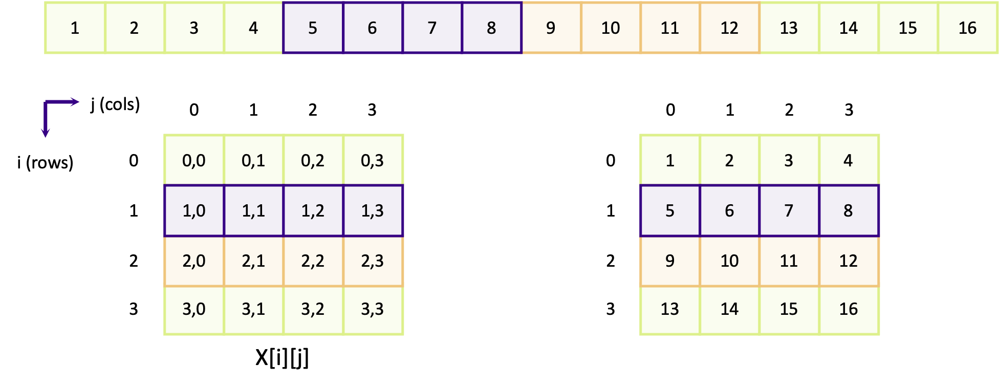
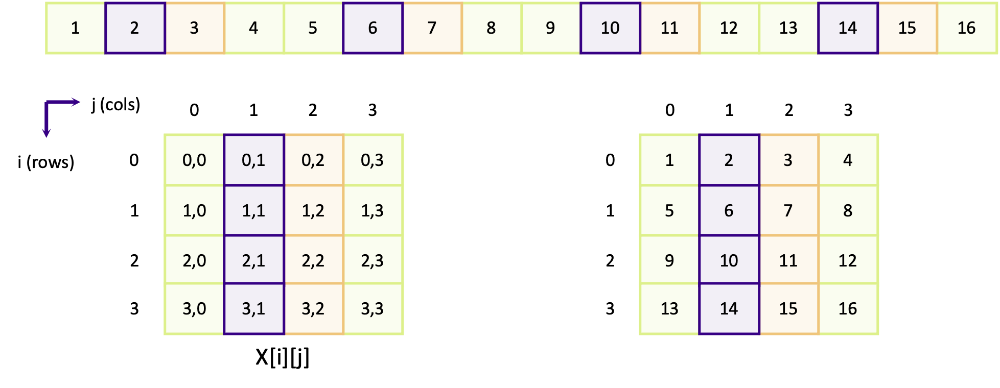
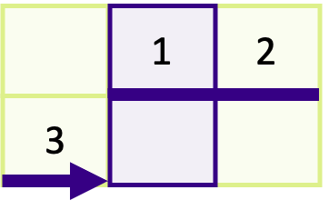
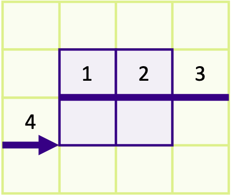

We've so far seen the basic building blocks for splitting work and communicating data between ranks, meaning we're ready enough to write a simple and successful MPI application. We've worked, so far, with simple data structures, such as single variables or small 1D arrays. In reality, any useful software we write will use more complex data structures, such as n-dimensional arrays, structures and other complex types. Working with these in MPI require a bit more work to communicate them correctly and efficiently.

To help with this, MPI provides an interface to create new types known as derived data types. A derived type acts as a way to enable the translation of complex data structures into instructions which MPI uses for efficient data access communication. In this episode, we will learn how to use derived data types to send array vectors and sub-arrays.

::::callout

## Size limitations for messages

All throughout MPI, the argument which says how many elements of data are being communicated is an integer: int count.
In most 64-bit Linux systems, ints are usually 32-bit and so the biggest number you can pass to count is 2^31 - 1 = 2,147,483,647, which is about 2 billion. Arrays which exceed this length can't be communicated easily in versions of MPI older than MPI-4.0, when support for "large count" communication was added to the MPI standard. In older MPI versions, there are two workarounds to this limitation. The first is to communicate large arrays in smaller, more manageable chunks. The other is to use derived types, to re-shape the data.
::::

Almost all scientific and computing problems nowadays require us to think in more than one dimension. Using
multi-dimensional arrays, such for matrices or tensors, or discretising something onto a 2D or 3D grid of points
are fundamental parts of a lot of software. However, the additional dimensions comes with additional complexity,
not just in the code we write, but also in how data is communicated.

To create a 2 x 3 matrix, in C, and initialize it with some values, we use the following syntax,

```c
int matrix[2][3] = { {1, 2, 3}, {4, 5, 6} };  // matrix[rows][cols]
```

This creates an array with two rows and three columns. The first row contains the values {1, 2, 3} and the second row contains {4, 5, 6}. The number of rows and columns can be any value, as long as there is enough memory available.

## The importance of memory contiguity

When a sequence of things is contiguous, it means there are multiple adjacent things without anything in between them.
In the context of MPI, when we talk about something being contiguous we are almost always talking about how arrays, and
other complex data structures, are stored in the computer's memory. The elements in an array are contiguous when the
next and previous elements are stored in adjacent memory locations.

The memory space of a computer is linear. When we create a multi-dimensional array, the compiler and operating system
decide how to map and store the elements onto that linear space. There are two ways to do this:
[row-major or column-major](https://en.wikipedia.org/wiki/Row-_and_column-major_order). The difference
is which elements of the array are contiguous in memory. Arrays are row-major in C and column-major in Fortran.
In a row-major array, the elements in each column of a row are contiguous, so element `x[i][j]` is
preceded by `x[i][j - 1]` and is followed by `x[i][j +1]`. In Fortran, arrays are column-major so `x(i, j)` is
followed by `x(i + 1, j)` and so on.

The diagram below shows how a 4 x 4 matrix is mapped onto a linear memory space, for a row-major array. At the top of
the diagram is the representation of the linear memory space, where each number is ID of the element in memory. Below
that are two representations of the array in 2D: the left shows the coordinate of each element and the right shows the
ID of the element.

The purple elements (5, 6, 7, 8) which map to the coordinates `[1][0]`, `[1][1]`, `[1][2]` and `[1][3]` are contiguous in linear memory. The same applies for the orange boxes for the elements in row 2 (elements 9, 10, 11 and 12). Columns in row-major arrays are contiguous. The next diagram instead shows how elements in adjacent rows are mapped in memory.



Looking first at the purple boxes (containing elements 2, 6, 10 and 14) which make up the row elements for column 1, we can see that the elements are not contiguous. Element `[0][1]` maps to element 2 and element `[1][1]` maps to element 6 and so on. Elements in the same column but in a different row are separated by four other elements, in this example. In other words, elements in other rows are not contiguous.

:::::challenge{id=memory-contiquity, title="Does memory contiguity affect performance?"}

Do you think memory contiguity could impact the performance of our software, in a negative way?

::::solution

Yes, memory contiguity can affect how fast our programs run. When data is stored in a neat and organized way, the computer can find and use it quickly. But if the data is scattered around randomly (fragmented), it takes more time to locate and use it, which decreases performance. Keeping our data and data access patterns organized can make our programs faster. But we probably won't notice the difference for small arrays and data structures.
::::
:::::

::::callout

## What about if I use `malloc()`?

More often than not we will see `malloc()` being used to allocate memory for arrays. Especially if the code is using an older standard, such as C90, which does not support
[variable length arrays](https://en.wikipedia.org/wiki/Variable-length_array). When we use `malloc()`, we get a contiguous array of elements. To create a 2D array using `malloc()`, we have to first create an array of pointers (which are contiguous) and allocate memory for each pointer:

```c
int num_rows = 3, num_cols = 5;

float **matrix = malloc(num_rows * sizeof(float*));  // Each pointer is the start of a row
for (int i = 0; i < num_rows; ++i) {
   matrix[i] = malloc(num_cols * sizeof(float));     // Here we allocate memory to store the column elements for row i
}

for (int i = 0; i < num_rows; ++i) {
   for (int j = 0; i < num_cols; ++j) {
      matrix[i][j] = 3.14159;                        // Indexing is done as matrix[rows][cols]
   }
}
```

There is one problem though. `malloc()` does not guarantee that subsequently allocated memory will be contiguous. When `malloc()` requests memory, the operating system will assign whatever memory is free. This is not always next to the block of memory from the previous allocation. This makes life tricky, since data *has* to be contiguous for MPI communication. But there are workarounds. One is to only use 1D arrays (with the same number of elements as the higher dimension array) and to map the n-dimensional coordinates into a linear coordinate system. For example, the element
`[2][4]` in a 3 x 5 matrix would be accessed as,

```c
int index_for_2_4 = matrix1d[5 * 2 + 4];  // num_cols * row + col
```

Another solution is to move memory around so that it is contiguous, such as in [this example](./code/examples/07-malloc-trick.c) or by using a more sophisticated function such as [`arralloc()` function](./code/arralloc.c) (not part of the standard library) which can allocate arbitrary n-dimensional arrays into a contiguous block.
::::

For a row-major array, we can send the elements of a single row (for a 4 x 4 matrix) easily,

```c
MPI_Send(&matrix[1][0], 4, MPI_INT ...);
```

The send buffer is `&matrix[1][0]`, which is the memory address of the first element in row 1. As the columns are four elements long, we have specified to only send four integers. Even though we're working here with a 2D array, sending a single row of the matrix is the same as sending a 1D array. Instead of using a pointer to the start of the array, an address to the first element of the row (`&matrix[1][0]`) is used instead. It's not possible to do the same for a column of the matrix, because the elements down the column are not contiguous.

## Using vectors to send slices of an array

To send a column of a matrix or array, we have to use a *vector*. A vector is a derived data type that represents multiple (or one) contiguous sequences of elements, which have a regular spacing between them. By using vectors, we can create data types for column vectors, row vectors or sub-arrays, similar to how we can  
[create slices for Numpy arrays in Python](https://numpy.org/doc/stable/user/basics.indexing.html), all of which can be sent in a single, efficient, communication.
To create a vector, we create a new data type using `MPI_Type_vector()`,

```c
int MPI_Type_vector(
   int count,
   int blocklength,
   int stride,
   MPI_Datatype oldtype,
   MPI_Datatype *newtype
);
```

|                |                                                                      |
|----------------|----------------------------------------------------------------------|
| `count`:       | The number of "blocks" which make up the vector                      |
| `blocklength`: | The number of contiguous elements in a block                         |
| `stride`:      | The number of elements between the start of each block               |
| `oldtype`:     | The data type of the elements of the vector, e.g. MPI_INT, MPI_FLOAT |
| `newtype`:     | The newly created data type to represent the vector                  |

To understand what the arguments mean, look at the diagram below showing a vector to send two rows of a 4 x 4 matrix
with a row in between (rows 2 and 4),


A *block* refers to a sequence of contiguous elements. In the diagrams above, each sequence of contiguous purple or
orange elements represents a block. The *block length* is the number of elements within a block; in the above this is
four. The *stride* is the distance between the start of each block, which is eight in the example. The count is the
number of blocks we want. When we create a vector, we're creating a new derived data type which includes one or more
blocks of contiguous elements.

::::callout

## Why is this functionality useful?

The advantage of using derived types to send vectors is to streamline and simplify communication of complex and non-contiguous data. They are most commonly used where there are boundary regions between MPI ranks, such as in simulations using domain decomposition (see the optional Common Communication Patterns episode for more detail), irregular meshes or composite data structures (covered in the optional Advanced Data Communication episode).
::::

Before we can use the vector we create to communicate data, it has to be committed using `MPI_Type_commit()`. This finalises the creation of a derived type. Forgetting to do this step leads to unexpected behaviour, and potentially disastrous consequences!

```c
int MPI_Type_commit(
   MPI_Datatype *datatype  // The data type to commit - note that this is a pointer
);
```

When a data type is committed, resources which store information on how to handle it are internally allocated. This contains data structures such as memory buffers as well as data used for bookkeeping. Failing to free those resources after finishing with the vector leads to memory leaks, just like when we don't free memory created using `malloc()`. To free up the resources, we use `MPI_Type_free()`,

```c
int MPI_Type_free (
   MPI_Datatype *datatype  // The data type to clean up -- note this is a pointer
);
```

The following example code uses a vector to send two rows from a 4 x 4 matrix, as in the example diagram above.

```c
// The vector is a MPI_Datatype
MPI_Datatype rows_type;

// Create the vector type
const int count = 2;
const int blocklength = 4;
const int stride = 8;
MPI_Type_vector(count, blocklength, stride, MPI_INT, &rows_type);

// Don't forget to commit it
MPI_Type_commit(&rows_type);

// Send the middle row of our 2d matrix array. Note that we are sending
// &matrix[1][0] and not matrix. This is because we are using an offset
// to change the starting point of where we begin sending memory
int matrix[4][4] = {
   { 1,  2,  3,  4},
   { 5,  6,  7,  8},
   { 9, 10, 11, 12},
   {13, 14, 15, 16},
};

if (my_rank == 0) {
    MPI_Send(&matrix[1][0], 1, rows_type, 1, 0, MPI_COMM_WORLD);
} else {
    // The receive function doesn't "work" with vector types, so we have to
    // say that we are expecting 8 integers instead
    const int num_elements = count * blocklength;
    int recv_buffer[num_elements];
    MPI_Recv(recv_buffer, num_elements, MPI_INT, 0, 0, MPI_COMM_WORLD, MPI_STATUS_IGNORE);
}

// The final thing to do is to free the new data type when we no longer need it
MPI_Type_free(&rows_type);
```

There are two things above, which look quite innocent, but are important to understand. First of all, the send buffer in `MPI_Send()` is not `matrix` but `&matrix[1][0]`. In `MPI_Send()`, the send buffer is a pointer to the memory location where the start of the data is stored. In the above example, the intention is to only send the second and forth rows, so the start location of the data to send is the address for element `[1][0]`. If we used `matrix`, the first and third rows would be sent instead.

The other thing to notice, which is not immediately clear why it's done this way, is that the receive data type is `MPI_INT` and the count is `num_elements = count * blocklength` instead of a single element of `rows_type`. This is because when a rank receives data, the data is a contiguous array. We don't need to use a vector to describe the layout of contiguous memory. We are just receiving a contiguous array of `num_elements = count * blocklength` integers.

::::challenge{id=sending-columns title="Sending columns from an array"}

Create a vector type to send a column in the following 2 x 3 array:

```c
int matrix[2][3] = {
    {1, 2, 3},
    {4, 5, 6},
 };
```

With that vector type, send the middle column of the matrix (elements `matrix[0][1]` and `matrix[1][1]`) from rank 0 to rank 1 and print the results. You may want to use [this code](./code/solutions/skeleton-example.c) as your starting point.

:::solution

If your solution is correct you should see 2 and 5 printed to the screen. In the solution below, to send a 2 x 1 column of the matrix, we created a vector with `count = 2`, `blocklength = 1` and `stride = 3`. To send the correct column our send buffer was `&matrix[0][1]` which is the address of the first element in column 1. To see why the stride is 3, take a look at the diagram below,



You can see that there are *three* contiguous elements between the start of each block of 1.

```c
#include <mpi.h>
#include <stdio.h>

int main(int argc, char **argv)
{
    int my_rank;
    int num_ranks;
    MPI_Init(&argc, &argv);
    MPI_Comm_rank(MPI_COMM_WORLD, &my_rank);
    MPI_Comm_size(MPI_COMM_WORLD, &num_ranks);

    int matrix[2][3] = {
        {1, 2, 3},
        {4, 5, 6},
    };

    if (num_ranks != 2) {
        if (my_rank == 0) {
            printf("This example only works with 2 ranks\n");
        }
        MPI_Abort(MPI_COMM_WORLD, 1);
    }

    MPI_Datatype col_t;
    MPI_Type_vector(2, 1, 3, MPI_INT, &col_t);
    MPI_Type_commit(&col_t);

    if (my_rank == 0) {
        MPI_Send(&matrix[0][1], 1, col_t, 1, 0, MPI_COMM_WORLD);
    } else {
        int buffer[2];
        MPI_Status status;

        MPI_Recv(buffer, 2, MPI_INT, 0, 0, MPI_COMM_WORLD, &status);

        printf("Rank %d received the following:", my_rank);
        for (int i = 0; i < 2; ++i) {
            printf(" %d", buffer[i]);
        }
        printf("\n");
    }

    MPI_Type_free(&col_t);

    return MPI_Finalize();
}
```

:::
::::

::::challenge{id=sending-subarrays title="Sending sub-arrays of an array"}

By using a vector type, send the middle four elements (6, 7, 10, 11) in the following 4 x 4 matrix from rank 0 to rank
1,

```c
int matrix[4][4] = {
  { 1,  2,  3,  4},
  { 5,  6,  7,  8},
  { 9, 10, 11, 12},
  {13, 14, 15, 16}
};
```

You can re-use most of your code from the previous exercise as your starting point, replacing the 2 x 3 matrix with the 4 x 4 matrix above and modifying the vector type and communication functions as required.

:::solution

The receiving rank(s) should receive the numbers 6, 7, 10 and 11 if your solution is correct. In the solution below, we have created a vector with a count and block length of 2 and with a stride of 4. The first two arguments means two vectors of block length 2 will be sent. The stride of 4 results from that there are 4 elements between the start of each distinct block as shown in the image below,



You must always remember to send the address for the starting point of the *first* block as the send buffer, which
is why `&array[1][1]` is the first argument in `MPI_Send()`.

```c
#include <mpi.h>
#include <stdio.h>

int main(int argc, char **argv)
{
    int matrix[4][4] = {
        { 1,  2,  3,  4},
        { 5,  6,  7,  8},
        { 9, 10, 11, 12},
        {13, 14, 15, 16}
    };

    int my_rank;
    int num_ranks;
    MPI_Init(&argc, &argv);
    MPI_Comm_rank(MPI_COMM_WORLD, &my_rank);
    MPI_Comm_size(MPI_COMM_WORLD, &num_ranks);

    if (num_ranks != 2) {
        if (my_rank == 0) {
            printf("This example only works with 2 ranks\n");
        }
        MPI_Abort(MPI_COMM_WORLD, 1);
    }

    MPI_Datatype sub_array_t;
    MPI_Type_vector(2, 2, 4, MPI_INT, &sub_array_t);
    MPI_Type_commit(&sub_array_t);

    if (my_rank == 0) {
        MPI_Send(&matrix[1][1], 1, sub_array_t, 1, 0, MPI_COMM_WORLD);
    } else {
        int buffer[4];
        MPI_Status status;

        MPI_Recv(buffer, 4, MPI_INT, 0, 0, MPI_COMM_WORLD, &status);

        printf("Rank %d received the following:", my_rank);
        for (int i = 0; i < 4; ++i) {
            printf(" %d", buffer[i]);
        }
        printf("\n");
    }

    MPI_Type_free(&sub_array_t);

    return MPI_Finalize();
}
```

:::
::::
