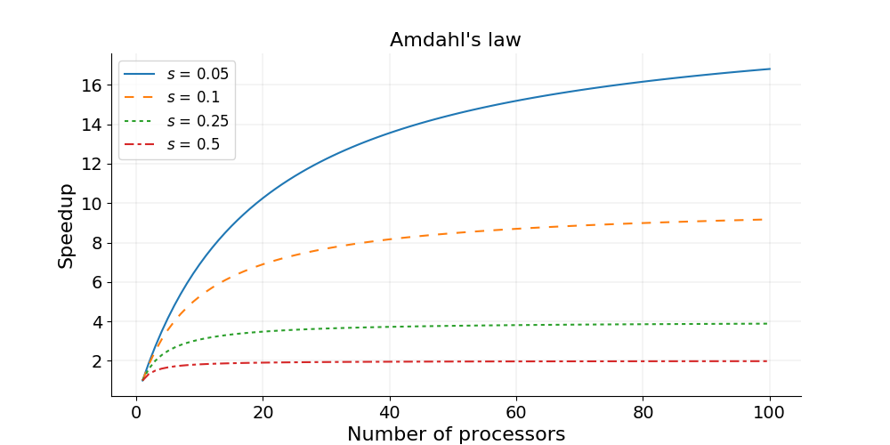
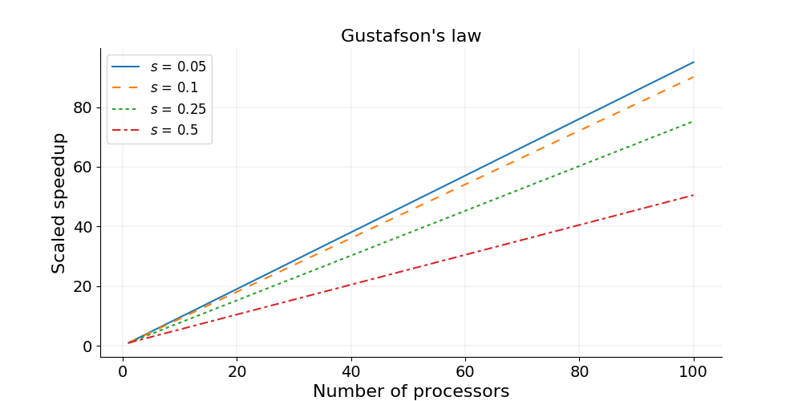
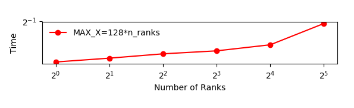
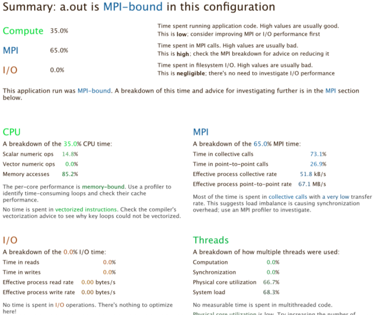

Now we have parallelised our code, we should determine how well it performs.
Given the various ways code can be parallellised, the underlying scientific implementation,and the type and amount of data the code is expected to process,
the performance of different parallelised code can vary hugely under different circumstances,
particularly given different numbers of CPUs assigned to running the code in parallel.
It's a good idea to understand how the code will operate in a parallel sense,
in order to make best (in particular, efficient) use of underlying HPC infrastructure.
Also, we may want to consider how best to optimise the code to make more efficient use of its parallelisation.

Therefore, it's really helpful to understand how well our code *scales* in performance terms as we increase the resources available to it.

::::callout{variant="note"}

## Prerequisite

[Intro to High Performance Computing](../hpc_intro/01_hpc_intro)

Whilst previous lessons can be done on a laptop or desktop, this episode covers how to profile your code using tools that are only available on an HPC cluster.
::::

## Characterising the Scalability of Code

We first need a means to measure the performance increase of a particular program as we assign more processors to it, i.e. the speedup.

The speedup when running a parallel program on multiple processors can be defined as

$$ \mathrm{speedup} = t_1 / t_N $$

Where:

- $$t_1$$ is the computational time for running the software using one processor
- $$t_N$$ is the computational time running the same software with N processors

Ideally, we would like software to have a linear speedup that is equal to the number of processors
(speedup = N), as that would mean that every processor would be contributing 100% of its computational power.
Unfortunately, this is a very challenging goal for real applications to attain,
since there is always an overhead to making parallel use of greater resources.
In addition, in a program there is always some portion of it which must be executed in serial (such as initialisation
routines, I/O operations and inter-communication) which cannot be parallelised.
This limits how much a program can be sped up, as the program will always take at least the length of the serial portion.

### Amdahl's Law and Strong Scaling

There is a theoretical limit in what parallelisation can achieve, and it is encapsulated in "Amdahl's Law":

$$ \mathrm{speedup} = 1 / (s + p / N) $$

Where:

- $$s$$ is the proportion of execution time spent on the serial part
- $$p$$ is the proportion of execution time spent on the part that can be parallelised
- $$N$$ is the number of processors

Amdahl’s law states that, for a fixed problem, the upper limit of speedup is determined by the serial fraction of the code - most real world applications have some serial portion or unintended delays (such as communication overheads) which will limit the code’s scalability.
 This is called **strong scaling** and its consequences can be understood from the figure below.



::::callout

## Amdahl's Law in Practice

Consider a program that takes 20 hours to run using one core.
If a particular part of the program, which takes one hour to execute, cannot be parallelised (s = 1/20 = 0.05), and if the code that takes up the remaining 19 hours of execution time can be parallelised (p = 1 − s = 0.95), then regardless of how many processors are devoted to a parallelised execution of this program, the minimum execution time cannot be less than that critical one hour.
Hence, the theoretical speedup is limited to at most 20 times (when N = ∞, speedup = 1/s = 20).
::::

**Strong scaling** is defined as how the solution time varies with the number of processors for a *fixed total problem size*.
Linear **strong** scaling if the speedup (work units completed per unit time) is equal to the number of processing elements used.
It's harder to achieve good strong-scaling at larger process counts since communication overhead typically increases with the number of processes used.

::::callout

## Testing Code Performance on SLURM

We also need a way to test our code on our HPC infrastructure of choice.
This will likely vary from system to system depending on your infrastructure configuration,but may look something like this (replacing `<account>`, `<queue>`, and `<directory_containing_poisson_executable>` as appropriate):

```bash
#!/usr/bin/env bash
#SBATCH --account=<account>
#SBATCH --partition=<queue>
#SBATCH --job-name=mpi-poisson
#SBATCH --time=00:05:00
#SBATCH --nodes=1
#SBATCH --ntasks=1
#SBATCH --mem=4M
#SBATCH --chdir=<directory_containing_poisson_executable>

module unload gnu_comp
module load gnu_comp/11.1.0
module load openmpi/4.1.4
 
time mpirun -n 1 poisson_mpi
```

So here, after loading the required compiler and OpenMPI modules, we use the `time` command to output how long the process took to run for a given number of processors, and ensure we specify `ntasks` correctly as the required number of cores we wish to use.

We can then submit this using `sbatch`, e.g. `sbatch poisson-mpi.sh`, with the output captured by default in a `slurm-....out` file which will include the time taken to run the program.
::::

:::::challenge{id=strong-scaling, title="Strong Scaling - How Does Our Code Perform?"}
Strong scaling means increasing the number of ranks without changing the problem size.
An algorithm with good strong scaling behaviour allows you to solve a problem more quickly by making use of more cores.

In `poisson_mpi.c`, ensure `MAX_ITERATIONS` is set to `25000` and `GRIDSIZE` is `512`.

Try submitting your program with an increasing number of ranks as we discussed earlier.
What are the limitations on scaling?

::::solution
Exact numbers depend on the machine you're running on, but with a small number of ranks (up to 4) you should see the time decrease with the number of ranks.
At around 5 ranks the result is a bit worse and doubling again to 16 has little effect.

The figure below shows an example of the scaling with `GRIDSIZE=512` and `GRIDSIZE=2048`.


In the example, which runs on a machine with two 20-core Intel Xeon Scalable CPUs, using 32 ranks actually takes more time.
The 32 ranks don't fit on one CPU and communicating between the two CPUs takes more time, even though they are in the same machine.

The communication could be made more efficient.
We could use non-blocking communication and do some of the computation while communication is happening.

::::
:::::

### Gustafson's Law and Weak Scaling

In practice the sizes of problems scale with the amount of available resources, and so we also need a measure for a relative speedup which takes into account increasing problem sizes.

Gustafson’s law is based on the approximations that the parallel part scales linearly with the amount of resources, and that the serial part does not increase with respect to the size of the problem. It provides a formula for scaled speedup:

$$ \mathrm{scaled\ speedup} = s + p × N $$

where $$s$$, $$p$$ and $$N$$ have the same meaning as in Amdahl's law.
With Gustafson's law the scaled speedup increases linearly with respect to the number of processors (with a slope smaller than one), and there is no upper limit for the scaled speedup.
This is called **weak scaling**, where the scaled speedup is calculated based on the amount of work done for a scaled problem size (in contrast to Amdahl’s law which focuses on fixed problem size).



**Weak scaling** is defined as how the solution time varies with the number of processors for a *fixed problem size per processor*.
If the run time stays constant while the workload is increased in direct proportion to the number of processors, then the solution is said to exhibit *linear weak scaling*.

:::::challenge{id=weak-scaling, title="Weak Scaling - How Does Our Code Perform?"}
Weak scaling refers to increasing the size of the problem while increasing the number of ranks.
This is much easier than strong scaling and there are several algorithms with good weak scaling.
In fact our algorithm for integrating the Poisson equation might well have perfect weak scaling.

Good weak scaling allows you to solve much larger problems using HPC systems.

Run the Poisson solver with an increasing number of ranks, setting `GRIDSIZE` to `(n_ranks+1) * 128` each time.
Remember you'll need to recompile the code each time before submitting it.
How does it behave?

::::solution
Depending on the machine you're running on, the runtime should be relatively constant.
Runtime will increase if you need to use nodes that are further away from each other in the network.

The figure below shows an example of the scaling with `GRIDSIZE=128*n_ranks`.



In this case all the ranks are running on the same node with 40 cores.
The increase in runtime is probably due to the memory bandwidth of the node being used by a larger number of cores.
::::
:::::

## Other Factors Affecting Performance

### Communication Speed and Latency

The other significant factors in the speed of a parallel program are communication speed and latency.

Communication speed is determined by the amount of data one needs to  send/receive, and the bandwidth of the underlying
hardware for the communication. Latency consists of the software latency (how long the operating system needs in order to prepare
for a communication), and the hardware latency (how long the hardware takes to send/receive even a small bit of data).

For a fixed-size problem, the time spent in communication is not significant when the number of ranks is small and the execution of parallel regions gets faster with the number of ranks. But if we keep increasing the number of ranks, the time spent in communication grows when multiple cores are involved with communication.

### Surface-to-Volume Ratio

In a parallel algorithm, the data which is handled by a core can be considered in two parts: the part the CPU needs that other cores control, and a part that the core controls itself and can compute.
The whole data which a CPU or a core computes is the sum of the two. The data under the control of the other cores is called "surface" and the whole data is called "volume".

The surface data requires communications.
he more surface there is, the more communications among CPUs/cores is needed, and the longer the program will take to finish.

Due to Amdahl's law, you want to minimise the number of communications for the same surface since each communication takes finite amount of time to prepare (latency).
This suggests that the surface data be exchanged in one communication if possible, not small parts of the surface data exchanged in multiple communications.
Of course, sequential consistency should be obeyed when the surface data is exchanged.

## Profiling our Code

Now we have a better understanding of how our code scales with resources and problem size, we may want to consider how to optimise the code to perform better.
But we should be careful!

> "We should forget about small efficiencies, say about 97% of the time:
> premature optimisation is the root of all evil." -- Donald Knuth

Essentially, before attempting to optimise your own code, you should profile it.
Typically, most of the runtime is spent in a few functions/subroutines, so you should focus your optimisation efforts on those parts of the code.
The good news is that there are helpful tools known as *profilers* that can help us.

Profilers help you find out where a program is spending its time and pinpoint places where optimising it makes sense.
Many different types of profiling tools exist, but for MPI application we need **parallel profilers**.

Some examples of parallel profilers are:

- [Scalasca](http://scalasca.org) - a free and open source parallel profiler developed by three German research centers.
- [TAU](https://www.cs.uoregon.edu/research/tau/home.php)
- [VAMPIR](https://vampir.eu/)
- [Paraver](https://tools.bsc.es/paraver)

In this lesson we will use a simple tool called ARM Performance Reports which gives us an overview of how much time is spent in compute, MPI calls and I/O.
Performance Reports is part of the ARM Forge (formerly Allinea Forge) suite of tools for parallel applications and is developed by the semiconductor and software design company ARM.

The suite also comes with a debugger (ARM DDT) and a profiler (ARM MAP). ARM MAP is a more advanced tool which allows the user to see how much time each individual line of code takes, and why.
ARM DDT supports a wide range of parallel architectures and models, including MPI, UPC, CUDA and OpenMP.

Version 19 and higher of ARM Forge supports Python, in addition to Fortran and C/C++.
To see which versions are available, type:

```bash
module avail allinea
```

For more information on ARM Forge see the [product website](https://www.arm.com/products/development-tools/server-and-hpc/forge).

::::callout{variant="note"}

## Software Availability

The ARM Forge suite of tools is licensed, and so may or may not be available on your HPC cluster (and certainly won't be on your laptop or desktop unless you buy a license and build them yourself!).

If you don't have access to the ARM Forge tools, your local HPC cluster should have an alternative installed with similar functionality.
::::

## Performance Reports

Ordinarily when profiling our code using such a tool, it is advisable to create a short version of your program, limiting the runtime to a few seconds or minutes.
Fortunately that's something we can readily configure with our `poisson_mpi.c` code.
For now, set `MAX_ITERATIONS` to `25000` and `GRIDSIZE` to `512`.

We first load the module for Performance Reports. Remember that how you do this will vary site-to-site.

```bash
module load armforge/23.1.0
module load allinea/ddt/18.1.2
```

Next, we run the executable using Performance Reports to analyse the program execution. Create a new version of our SLURM submission script we used before, which includes the following at the bottom of the script instead:

```bash
module load armforge/23.1.0
module load allinea/ddt/18.1.2

module unload gnu_comp
module load gnu_comp/11.1.0
module load openmpi/4.1.4

perf-report mpirun -n 4 poisson_mpi
```

And then submit it, e.g. `sbatch perf-poisson-mpi.sh`.

This creates two files, one `.txt` file which can be viewed in the
terminal and one `.html` file which can be opened in a browser
(you will need to `scp` the HTML file to your local machine to view it).

```bash
cat poisson_mpi_4p_1n_2024-01-30_15-38.txt
```

```text
Command:        mpirun -n 4 poisson_mpi
Resources:      1 node (28 physical, 56 logical cores per node)
Memory:         503 GiB per node
Tasks:          4 processes
Machine:        <specific_node_displayed_here>
Architecture:   x86_64
CPU Family:     skylake-x
Start time:     Tue Jan 30 15:38:06 2024
Total time:     1 second
Full path:      <run_directory_displayed_here>

Summary: poisson_mpi is MPI-bound in this configuration
Compute:                                      6.6%     (0.0s) ||
MPI:                                         93.4%     (0.2s) |========|
I/O:                                          0.0%     (0.0s) |
This application run was MPI-bound (based on main thread activity). A breakdown of this time and advice for investigating further is in the MPI section below.

...
```

The graphical HTML output looks like this:



The output shows that when run in this way, the application is
MPI bound, i.e. most time is spent in MPI communication. This
typically means that the application does not scale well to the
given number of processes. Either the number of processes should
be decreased, or the problem size increased so that more time is
spent in the actual compute sections of the code.

:::::challenge{id=profile-poisson, title="Profile Your Poisson Code"}
Compile, run and analyse your own MPI version of the poisson code.

How closely does it match the performance above? What are the main differences?
Try reducing the number of processes used, rerun and investigate the profile. Is it still MPI-bound?

Increase the problem size, recompile, rerun and investigate the profile.
What has changed now?
:::::

:::::challenge{id=iterative-improvement, title="Iterative Improvement"}
In the Poisson code, try changing the location of the calls to `MPI_Send()`. How does this affect performance?
:::::

::::callout{variant="tip"}

## A General Optimisation Workflow?

A general workflow for optimising a code, whether parallel or serial, is as follows:

1. Profile
2. Optimise
3. Test correctness
4. Measure efficiency

Then we can repeat this process as needed.
But note that eventually this process will yield diminishing returns, and over-optimisation is a trap to avoid - hence the importance of continuing to measure efficiency as you progress.
::::
