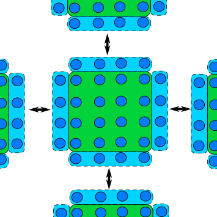
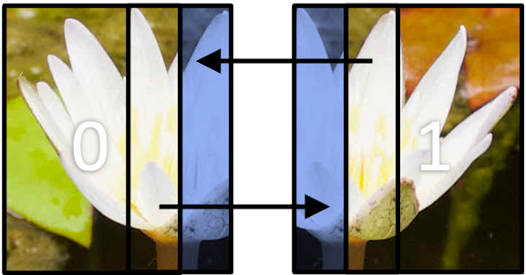

We have now come across the basic building blocks we need to create an MPI application.
The previous episodes have covered how to split tasks between ranks to parallelise the workload, and how to communicate data between ranks; either between two ranks (point-to-point) or multiple at once (collective).
The next step is to build upon these basic blocks, and to think about how we should structure our communication.
The parallelisation and communication strategy we choose will depend on the underlying problem and algorithm.
For example, a grid based simulation (such as in computational fluid dynamics) will need to structure its communication differently to a simulation which does not discretise calculations onto a grid of points.
In this episode, we will look at some of the most common communication patterns.

## Scatter and gather

Using the scatter and gather collective communication functions, to distribute work and bring the results back together, is a common pattern and finds a wide range of applications.
To recap: in **scatter communication**, the root rank splits a piece of data into equal chunks and sends a chunk to each of the other ranks, as shown in the diagram below.


In **gather communication** all ranks send data to the root rank which combines them into a single buffer.


Scatter communication is useful for most algorithms and data access patterns, as is gather communication.
At least for scattering, this communication pattern is generally easy to implement especially for embarrassingly parallel problems where the data sent to each rank is independent.
Gathering data is useful for bringing results to a root rank to process further or to write to disk, and is also helpful for bring data together to generate diagnostic output.

Since scatter and gather communications are collective, the communication time required for this pattern increases as the number of ranks increases.
The amount of messages that needs to be sent increases logarithmically with the number of ranks.
The most efficient implementation of scatter and gather communication are to use the collective functions (`MPI_Scatter()` and `MPI_Gather()`) in the MPI library.

One method for parallelising matrix multiplication is with a scatter and gather  communication.
To multiply two matrices, we follow the following equation,

$$ \left[ \begin{array}{cc} A_{11} & A_{12} \\ A_{21} & A_{22}\end{array} \right] \cdot \left[ \begin{array}{cc}B_{11} & B_{12} \\ B_{21} & B_{22}\end{array} \right]   = \left[ \begin{array}{cc}A_{11} \cdot B_{11} + A_{12} \cdot B_{21} & A_{11} \cdot B_{12} + A_{12} \cdot B_{22} \\ A_{21} \cdot B_{11} + A_{22} \cdot B_{21} & A_{21} \cdot B_{12} + A_{22} \cdot B_{22}\end{array} \right]$$

Each element of the resulting matrix is a dot product between a row in the first matrix (matrix A) and a column in the second matrix (matrix B).
Each row in the resulting matrix depends on a single row in matrix A, and each column in matrix B.
To split the calculation across ranks, one approach would be to *scatter* rows from matrix A and calculate the result for that scattered data and to combine the results from each rank to get the full result.

```c
// Determine how many rows each matrix will compute and allocate space for a receive buffer
// receive scattered subsets from root rank. We'll use 1D arrays to store the matrices, as it
// makes life easier when using scatter and gather
int rows_per_rank = num_rows_a / num_ranks;
double *rank_matrix_a = malloc(rows_per_rank * num_rows_a * sizeof(double));
double *rank_matrix_result = malloc(rows_per_rank * num_cols_b * sizeof(double));

// Scatter matrix_a across ranks into rank_matrix_a. Each rank will compute a subset of
//  the result for the rows in rank_matrix_a
MPI_Scatter(matrix_a, rows_per_rank * num_cols_a, MPI_DOUBLE, rank_matrix_a, rows_per_rank * num_cols_a,
            MPI_DOUBLE, ROOT_RANK, MPI_COMM_WORLD);

// Broadcast matrix_b to all ranks, because matrix_b was only created on the root rank
// and each sub-calculation needs to know all elements in matrix_b
MPI_Bcast(matrix_b, num_rows_b * num_cols_b, MPI_DOUBLE, ROOT_RANK, MPI_COMM_WORLD);

// Function to compute result for the subset of rows of matrix_a
multiply_matrices(rank_matrix_a, matrix_b, rank_matrix_result);

// Use gather communication to get each rank's result for rank_matrix_a * matrix_b into receive
// buffer `matrix_result`. Our life is made easier since rank_matrix and matrix_result are flat (and contiguous)
// arrays, so we don't need to worry about memory layout
MPI_Gather(rank_matrix_result, rows_per_rank * num_cols_b, MPI_DOUBLE, matrix_result, rows_per_rank * num_cols_b,
           MPI_DOUBLE, ROOT_RANK, MPI_COMM_WORLD);
```

## Reduction

A reduction operation is one that *reduces* multiple pieces of data into a single value, such as by summing values or finding the largest value in a collection of values.
The use case for reductions throughout scientific code is wide, which makes it a very common communication pattern.
Since reductions are a collective operation, the communication overheads increases with the number of ranks.
It is again, like with scattering and gathering, best to use the reduction functions within the MPI library, rather than implementing the pattern ourselves.


Given the fact that reductions fit in almost any algorithm or data access pattern, there are countless examples to show a reduction communication pattern.
In the next code example, a Monte Carlo algorithm is implemented which estimates the value of $\pi$.
To do this, a billion random points are generated and checked to see if they fall inside or outside a circle.
The ratio of points inside the circle to the total number of points is proportional to the value of $\pi$.

Since each point generated and its position within the circle is completely independent to the other points, 
the communication pattern is simple (this is also an example of an embarrassingly parallel problem) as we only need one reduction.
To parallelise the problem, each rank generates a sub-set of the total number of points and a reduction is done at the end, to calculate the total number of points within the circle from the entire sample.

```c
// 1 billion points is a lot, so we should parallelise this calculation
int total_num_points = (int)1e9;

// Each rank will check an equal number of points, with their own
// counter to track the number of points falling within the circle
int points_per_rank = total_num_points / num_ranks;
int rank_points_in_circle = 0;

// Seed each rank's RNG with a unique seed, otherwise each rank will have an
// identical result and it would be the same as using `points_per_rank` in total
// rather than `total_num_points`
srand(time(NULL) + my_rank);

// Generate a random x and y coordinate (between 0 - 1) and check to see if that
// point lies within the unit circle
for (int i = 0; i < points_per_rank; ++i) {
    double x = (double)rand() / RAND_MAX;
    double y = (double)rand() / RAND_MAX;
    if ((x * x) + (y * y) <= 1.0) {
        rank_points_in_circle++;  // It's in the circle, so increment the counter
    }
}

// Perform a reduction to sum up `rank_points_in_circle` across all ranks, this
// will be the total number of points in a circle for `total_num_point` iterations
int total_points_in_circle;
MPI_Reduce(&rank_points_in_circle, &total_points_in_circle, 1, MPI_INT, MPI_SUM, ROOT_RANK, MPI_COMM_WORLD);

//The estimate for π is proportional to the ratio of the points in the circle and the number of
// points generated
if (my_rank == ROOT_RANK) {
    double pi = 4.0 * total_points_in_circle / total_num_points;
    printf("Estimated value of π = %f\n", pi);
}
```

:::::challenge{id=more-reduction-examples, title="More Reduction Examples"}
Reduction operations are not only used in embarrassingly parallel Monte Carlo problems.
Can you think of any other examples, or algorithms, where you might use a reduction pattern?

::::solution
Here is a (non-exhaustive) list of examples where reduction operations are useful.

1. Finding the maximum/minimum or average temperature in a simulation grid: by conducting a reduction across all the grid cells (which may have, for example, been scattered across ranks), you can easily find the maximum/minimum temperature in the grid, or sum up the temperatures to calculate the average temperature.
2. Combining results into a global state: in some simulations, such as climate modelling, the simulation is split into discrete time steps.
   At the end of each time step, a reduction can be used to update the global state or combine pieces of data (similar to a gather operation).
3. Large statistical models: in a large statistical model, the large amounts of data can be processed by splitting it across ranks and calculating statistical values for the sub-set of data.
   The final values are then calculated by using a reduction operation and re-normalizing the values appropriately.
4. Numerical integration: each rank will compute the area under the curve for its portion of the curve.
   The value of the integral for the entire curve is then calculated using a reduction operation.

::::
:::::

## Domain decomposition and halo exchange

If a problem depends on a (usually spatially) discretised grid, array of values or grid structure, such as in, for example, image processing, computational fluid dynamics, molecular dynamics or finite element analysis, then we can parallelise the tasks by splitting the problem into smaller *sub-domains* for each rank to work with.
This is shown in the diagram below, where an image has been split into four smaller images which will be sent to a rank.


In most cases, these problems are usually not embarrassingly parallel, since additional communication is often required as the work is not independent and depends on data in other ranks, such as the value of neighbouring grid points or results from a previous iteration.
As an example, in a molecular dynamics simulation, updating the state of a molecule depends on the state and interactions between other molecules which may be in another domain in a different rank.

A common feature of a domain decomposed algorithm is that communications are limited to a small number of other ranks that work on a sub-domain a short distance away.
In such a case, each rank only needs a thin slice of data from its neighbouring rank(s) and send the same slice of its own data to the neighbour(s).
The data received from neighbours forms a "halo" around the ranks own data, and shown in the next diagram, and is known as *halo exchange*.



The matrix example from earlier is actually an example of domain decomposition, albeit a simple case, as the rows of the matrix were split across ranks.
It's a simple example, as additional data didn't need to be communicated between ranks to solve the problem.
There is, unfortunately, no best way or "one size fits all" type of domain decomposition, as it depends on the algorithm and data access required.

### Domain decomposition

If we take image processing as an example, we can split the image like in the matrix example, where each rank gets some number of rows of the image to process.
In this case, the code to scatter the *rows* of image is more or less identical to the matrix case from earlier.
Another approach would be to decompose the image into smaller rectangles like in the image above.
This is sometimes a better approach, as it allows for more efficient and balanced resource allocation and halo communication, but this is usually as the expense of increased memory usage and code complexity.

An example of 2D domain decomposition is shown in the next example, which uses a derived type (from the previous episode) to discretise the image into smaller rectangles and to scatter the smaller sub-domains to the other ranks.

```c
// We have to first calculate the size of each rectangular region. In this example, we have
// assumed that the dimensions are perfectly divisible. We can determine the dimensions for the
// decomposition by using MPI_Dims_create()
int rank_dims[2] = { 0, 0 };
MPI_Dims_create(num_ranks, 2, rank_dims);
int num_rows_per_rank = num_rows / rank_dims[0];
int num_cols_per_rank = num_cols / rank_dims[1];
int num_elements_per_rank = num_rows_per_rank * num_cols_per_rank;

// The rectangular blocks we create are not contiguous in memory, so we have to use a
// derived data type for communication
MPI_Datatype sub_array_t;
int count = num_rows_per_rank;
int blocklength = num_cols_per_rank;
int stride = num_cols;
MPI_Type_vector(count, blocklength, stride, MPI_DOUBLE, &sub_array_t);
MPI_Type_commit(&sub_array_t);

// MPI_Scatter (and similar collective functions) do not work well with this sort of
// topology, so we unfortunately have to scatter the array manually
double *rank_image = malloc(num_elements_per_rank * sizeof(double));
scatter_sub_arrays_to_other_ranks(image, rank_image, sub_array_t, rank_dims, my_rank, num_rows_per_rank,
                                  num_cols_per_rank, num_elements_per_rank, num_cols);
```

::::callout

## Extra: Scattering the image to other ranks

As mentioned in the previous code example, distributing the 2D sub-domains across ranks doesn't play well with collective functions.
Therefore, we have to transfer the data manually using point-to-point communication. An example of how can be done is shown below.

```c
// Function to convert row and col coordinates into an index for a 1d array
int index_into_2d(int row, int col, int num_cols) { return row * num_cols + col; }

// Fairly complex function to send sub-arrays of `image` to the other ranks
void scatter_sub_arrays_to_other_ranks(double *image, double *rank_image, MPI_Datatype sub_array_t, int rank_dims[2],
                                       int my_rank, int num_cols_per_rank, int num_rows_per_rank,
                                       int num_elements_per_rank, int num_cols)
{
   if (my_rank == ROOT_RANK) {
      int dest_rank = 0;
      for (int i = 0; i < rank_dims[0]) {
         for (int j = 0; j < rank_dims[1]) {
            // Send sub array to a non-root rank
            if(dest_rank != ROOT_RANK) {
               MPI_Send(&image[index_into_2d(num_rows_per_rank * i, num_cols_per_rank * j, num_cols)], 1, sub_array_t,
                        dest_rank, 0, MPI_COMM_WORLD);
            // Copy into root rank's rank image buffer
            } else {
              for (int ii = 0; ii < num_rows_per_rank; ++ii) {
                  for (int jj = 0; jj < num_cols_per_rank; ++jj) {
                     rank_image[index_into_2d(ii, jj, num_cols_per_rank)] = image[index_into_2d(ii, jj, num_cols)];
                  }
               }
            }
            dest_rank += 1;
         }
      }
   } else {
      MPI_Recv(rank_image, num_elements_per_rank, MPI_DOUBLE, ROOT_RANK, MPI_COMM_WORLD, MPI_STATUS_IGNORE);
   }
}
```
::::

The function [`MPI_Dims_create()`](https://www.open-mpi.org/doc/v4.1/man3/MPI_Dims_create.3.php) is a useful utility function in MPI which is used to determine the dimensions of a Cartesian grid of ranks.
In the above example, it's used to determine the number of rows and columns in each sub-array, given the number of ranks in the row and column directions of the grid of ranks from `MPI_Dims_create()`.
In addition to the code above, you may also want to create a 
[*virtual Cartesian communicator topology*](https://www.mpi-forum.org/docs/mpi-3.1/mpi31-report/node187.htm#Node187) to reflect the decomposed geometry in the communicator as well, as this give access to a number of other utility functions which makes communicating data easier.

### Halo exchange

In domain decomposition methods, a "halo" refers to a region around the boundary of a sub-domain which contains a copy of the data from neighbouring sub-domains, which needed to perform computations that involve data from adjacent sub-domains. The halo region allows neighbouring sub-domains to share the required data efficiently, without the need for more than necessary communication.

In a grid-based domain decomposition, as in the image processing example, a halo is often one, or more, rows of pixels (or grid cells more generally) that surround a sub-domain's "internal" cells. This is shown in the diagram below. In the diagram, the image has decomposed across two ranks in one direction (1D decomposition).
Each blue region represents the halo for that rank, which has come from the region the respective arrow is point from.



Halos, naturally, increase the memory overhead of the parallelisation as you need to allocate additional space in the array or data structures to account for the halo pixels/cells.
For example, in the above diagram, if the image was discretised into more sub-domains so there are halos on both the left and right side of the sub-domain. In image processing, a single strip of pixels is usually enough.
If `num_rows` and `num_cols` are the number of rows of pixels containing that many columns of pixels, then each sub-domain has dimensions `num_rows` and `num_cols + 2`.
If the decomposition was in two dimensions, then it would be `num_rows + 2` and `num_cols + 2`.
In other data structures like graphs or unstructured grids, the halo will be an elements or nodes surrounding the sub-domain.

The example code below shows one method of communicating halo data between neighbouring ranks in a decomposition like in the diagram above.
The image has been decomposed into *strips*, which each rank working on a sub-image with dimensions `num_rows / num_ranks` rows and `num_cols` columns.
In the example, [`MPI_Sendrecv()`](https://www.open-mpi.org/doc/v4.1/man3/MPI_Sendrecv_replace.3.php) is used to send and receiving data between neighbouring ranks.

::::callout

## Chain communication with `MPI_Sendrecv()`

`MPI_Sendrecv()` combines both sending and receiving data in a single call.
It allows a rank to send data to another rank, whilst receiving data from another.
With this function we can usually set up a "chain" communication pattern, where each rank sends data to one neighbour and receives data from its other date, as shown in the diagram below.


In 1D domain decomposition, this is a helpful function to use as each rank will only want data from its neighbours.

```c
int MPI_Sendrecv(
   void *sendbuf,
   int sendcount,
   MPI_Datatype sendtype,
   int dest,
   int sendtag,
   void *recvbuf,
   int recvcount,
   MPI_Datatype recvtype,
   int source,
   int recvtag,
   MPI_Comm comm,
   MPI_Status *status
);
```

|              |                                                     |
|--------------|-----------------------------------------------------|
| `*sendbuf`:  | The data to be sent to `dest`                       |
| `sendcount`: | The number of elements of data to be sent to `dest` |
| `sendtype`:  | The data type of the data to be sent to `dest`      |
| `dest`:      | The rank where data is being sent to                |
| `sendtag`:   | The communication tag for the send                  |
| `*recvbuf`:  | A buffer for data being received                    |
| `recvcount`: | The number of elements of data to receive           |
| `recvtype`:  | The data type of the data being received            |
| `source`:    | The rank where data is coming from                  |
| `recvtag`:   | The communication tag for the receive               |
| `comm`:      | The communicator                                    |
| `*status`:   | The status handle for the receive                   |
::::

```c
// Function to convert row and col coordinates into an index for a 1d array
int index_into_2d(int row, int col, int num_cols) { return row * num_cols + col; }

// `rank_image` is actually a little bigger, as we need two extra rows for a halo region for the top
//  and bottom of the row sub-domain
double *rank_image = malloc((num_rows + 2) * num_cols * sizeof(double));

// MPI_Sendrecv is designed for "chain" communications, so we need to figure out the next
// and previous rank. We use `MPI_PROC_NULL` (a special constant) to tell MPI that we don't
// have a partner to communicate to/receive from
int prev_rank = my_rank - 1 < 0 ? MPI_PROC_NULL : my_rank - 1;
int next_rank = my_rank + 1 > num_ranks - 1 ? MPI_PROC_NULL : my_rank + 1;

// Send the top row of the image to the bottom row of the previous rank, and receive
// the top row from the next rank
MPI_Sendrecv(&rank_image[index_into_2d(0, 1, num_cols)], num_rows, MPI_DOUBLE, prev_rank, 0,
             &rank_image[index_into_2d(num_rows - 1, 1, num_cols)], num_rows, MPI_DOUBLE, next_rank, 0,
             MPI_COMM_WORLD, MPI_STATUS_IGNORE);

// Send the bottom row into top row of the next rank, and the reverse from the previous rank
MPI_Sendrecv(&rank_image[index_into_2d(num_rows - 2, 1, num_cols)], num_rows, MPI_DOUBLE, next_rank, 0,
             &rank_image[index_into_2d(0, 1, num_cols)], num_rows, MPI_DOUBLE, prev_rank, 0, MPI_COMM_WORLD,
             MPI_STATUS_IGNORE);
```

:::::challenge{id=halo-exchange-2d, title="Halo Exchange in Two Dimensions"}
The previous code example shows one implementation of halo exchange in one dimension.
Following from the code example showing domain decomposition in two dimensions, write down the steps (or some pseudocode) for the implementation of domain decomposition and halo exchange in two dimensions.

::::solution
Communicating halos in a 2D domain decomposition is similar to the code example above, but we have two additional communications as we have to communicate four rows/columns of data: the top and bottom rows, and the left-most and right-most column of pixels.
This is all easier said than done, though.
The image below, that we've already seen, shows a depiction of halo exchange in 2D, where each sub-domain has a neighbour above and below and to the left and right of it.


To communicate the halos, we need to:

1. Create a derived type to send a column of data for the correct number of rows of pixels.
   The top and bottom rows can be communicated without using a derived type, because the elements in a row are contiguous.
2. For each sub-domain, we need to determine the neighbouring ranks, so we know which rank to send data to and which ranks to receive data from.
3. Using the derived types and neighbouring ranks, communicate the top row of the sub-domain to the bottom halo row of the neighbouring top domain.
   We also need to repeat the same process for the bottom row to the neighbouring sub-domain below and so on for the left and right columns of halo data.

To re-build the sub-domains into one domain, we can do the reverse of the hidden code exert of the function `scatter_sub_arrays_to_other ranks`.
Instead of the root rank sending data, it instead receives data from the other ranks using the same `sub_array_t` derived type.
::::
:::::