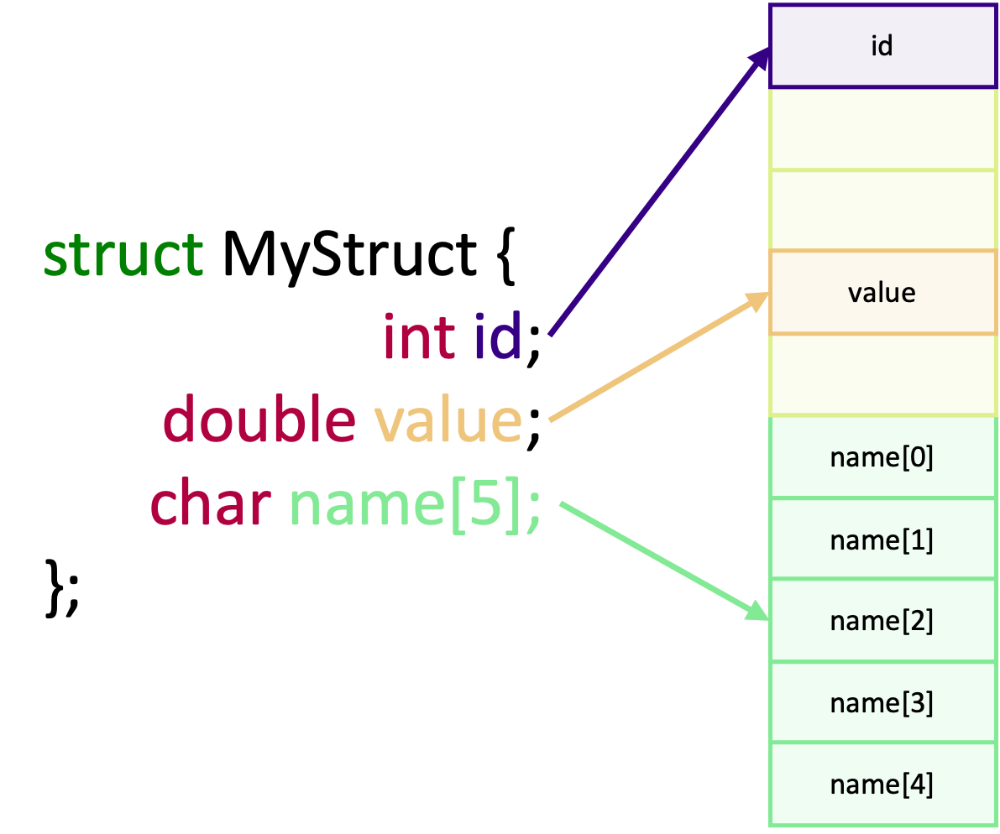
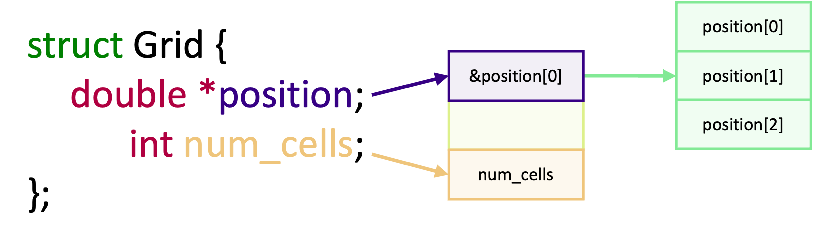

In an earlier episode, we introduced the concept of derived data types to send vectors or a sub-array of a larger array,
which may or may not be contiguous in memory. Other than vectors, there are multiple other types of derived data types that allow us to
handle other complex data structures efficiently. In this episode, we will see how to create structure derived types. Additionally, we will
also learn how to use `MPI_Pack()` and `MPI_Unpack()` to manually pack complex data structures and heterogeneous data into a single contiguous
buffer, when other methods of communication are too complicated or inefficient.

## Structures in MPI

Structures, commonly known as structs, are custom datatypes which contain multiple variables of (usually) different
types. Some common use cases of structs, in scientific code, include grouping together constants or global variables, or
they are used to represent a physical thing, such as a particle, or something more abstract like a cell on a simulation
grid. When we use structs, we can write clearer, more concise and better structured code.

To communicate a struct, we need to define a derived datatype which tells MPI about the layout of the struct in memory.
Instead of `MPI_Type_create_vector()`, for a struct, we use,
`MPI_Type_create_struct()`,

```c
int MPI_Type_create_struct(
   int count,
   int *array_of_blocklengths,
   MPI_Aint *array_of_displacements,
   MPI_Datatype *array_of_types,
   MPI_Datatype *newtype,
);
```

|                            |                                                                                  |
|----------------------------|----------------------------------------------------------------------------------|
| `count`:                   | The number of fields in the struct                                               |
| `*array_of_blocklengths`:  | The length of each field, as you would use to send that field using `MPI_Send()` |
| `*array_of_displacements`: | The relative positions of each field in bytes                                    |
| `*array_of_types`:         | The MPI type of each field                                                       |
| `*newtype`:                | The newly created data type for the struct                                       |

The main difference between vector and struct derived types is that the arguments for structs expect arrays, since structs are made up of multiple variables. Most of these arguments are straightforward, given what we've just seen for defining vectors. But `array_of_displacements` is new and unique.

When a struct is created, it occupies a single contiguous block of memory. But there is a catch. For performance reasons, compilers insert arbitrary "padding" between each member for performance reasons. This padding, known as
[data structure alignment](https://en.wikipedia.org/wiki/Data_structure_alignment), optimises both the layout of the memory and the access of it. As a result, the memory layout of a struct may look like this instead:



Although the memory used for padding and the struct's data exists in a contiguous block,
the actual data we care about is no longer contiguous. This is why we need the `array_of_displacements` argument, which specifies the distance, in bytes, between each struct member relative to the start of the struct. In practice, it serves a similar purpose of the stride in vectors.

To calculate the byte displacement for each member, we need to know where in memory each member of a struct exists. To do this, we can use the function `MPI_Get_address()`,

```c
int MPI_Get_address{
   const void *location,
   MPI_Aint *address,
};
```

|              |                                                               |
|--------------|---------------------------------------------------------------|
| `*location`: | A pointer to the variable we want the address of              |
| `*address`:  | The address of the variable, as an MPI_Aint (address integer) |

In the following example, we use `MPI_Type_create_struct()` and `MPI_Get_address()` to create a derived type for a struct with two members,

```c
// Define and initialize a struct, named foo, with an int and a double
struct MyStruct {
   int id;
   double value;
} foo = {.id = 0, .value = 3.1459};

// Create arrays to describe the length of each member and their type
int count = 2;
int block_lengths[2] = {1, 1};
MPI_Datatype block_types[2] = {MPI_INT, MPI_DOUBLE};

// Now we calculate the displacement of each member, which are stored in an
// MPI_Aint designed for storing memory addresses
MPI_Aint base_address;
MPI_Aint block_offsets[2];

MPI_Get_address(&foo, &base_address);            // First of all, we find the address of the start of the struct
MPI_Get_address(&foo.id, &block_offsets[0]);     // Now the address of the first member "id"
MPI_Get_address(&foo.value, &block_offsets[1]);  // And the second member "value"

// Calculate the offsets, by subtracting the address of each field from the
// base address of the struct
for (int i = 0; i < 2; ++i) {
   // MPI_Aint_diff is a macro to calculate the difference between two
   // MPI_Aints and is a replacement for:
   //       (MPI_Aint) ((char *) block_offsets[i] - (char *) base_address)
   block_offsets[i] = MPI_Aint_diff(block_offsets[i], base_address);
}

// We finally can create out struct data type
MPI_Datatype struct_type;
MPI_Type_create_struct(count, block_lengths, block_offsets, block_types, &struct_type);
MPI_Type_commit(&struct_type);

// Another difference between vector and struct derived types is that in
// MPI_Recv, we use the struct type. We have to do this because we aren't
// receiving a contiguous block of a single type of date. By using the type, we
// tell MPI_Recv how to understand the mix of data types and padding and how to
// assign those back to recv_struct
if (my_rank == 0) {
   MPI_Send(&foo, 1, struct_type, 1, 0, MPI_COMM_WORLD);
} else {
   struct MyStruct recv_struct;
   MPI_Recv(&recv_struct, 1, struct_type, 0, 0, MPI_COMM_WORLD, MPI_STATUS_IGNORE);
}

// Remember to free the derived type
MPI_Type_free(&struct_type);
```

:::::challenge{id=sending-a-struct, title="Sending a Struct"}
By using a derived data type, write a program to send the following struct `struct Node node` from one rank to another:

```c
struct Node {
  int id;
  char name[16];
  double temperature;
};

struct Node node = { .id = 0, .name = "Dale Cooper", .temperature = 42};
```

You may wish to use [this skeleton code](code/solutions/skeleton-example.c) as your stating point.

::::solution
Your solution should look something like the code block below. When sending a *static* array (`name[16]`), we have to use a count of 16 in the `block_lengths` array for that member.

```c
#include <mpi.h>
#include <stdio.h>

struct Node {
    int id;
    char name[16];
    double temperature;
};

int main(int argc, char **argv)
{
    int my_rank;
    int num_ranks;
    MPI_Init(&argc, &argv);
    MPI_Comm_rank(MPI_COMM_WORLD, &my_rank);
    MPI_Comm_size(MPI_COMM_WORLD, &num_ranks);

    if (num_ranks != 2) {
        if (my_rank == 0) {
            printf("This example only works with 2 ranks\n");
        }
        MPI_Abort(MPI_COMM_WORLD, 1);
    }

    struct Node node = {.id = 0, .name = "Dale Cooper", .temperature = 42};

    int block_lengths[3] = {1, 16, 1};
    MPI_Datatype block_types[3] = {MPI_INT, MPI_CHAR, MPI_DOUBLE};

    MPI_Aint base_address;
    MPI_Aint block_offsets[3];
    MPI_Get_address(&node, &base_address);
    MPI_Get_address(&node.id, &block_offsets[0]);
    MPI_Get_address(&node.name, &block_offsets[1]);
    MPI_Get_address(&node.temperature, &block_offsets[2]);
    for (int i = 0; i < 3; ++i) {
        block_offsets[i] = MPI_Aint_diff(block_offsets[i], base_address);
    }

    MPI_Datatype node_struct;
    MPI_Type_create_struct(3, block_lengths, block_offsets, block_types, &node_struct);
    MPI_Type_commit(&node_struct);

    if (my_rank == 0) {
        MPI_Send(&node, 1, node_struct, 1, 0, MPI_COMM_WORLD);
    } else {
        struct Node recv_node;
        MPI_Recv(&recv_node, 1, node_struct, 0, 0, MPI_COMM_WORLD, MPI_STATUS_IGNORE);
        printf("Received node: id = %d name = %s temperature %f\n", recv_node.id, recv_node.name,
               recv_node.temperature);
    }

    MPI_Type_free(&node_struct);

    return MPI_Finalize();
}
```

::::
:::::

:::::challenge{id=what-if-pointers, title="What If I Have a Pointer in My Struct?"}
Suppose we have the following struct with a pointer named `position` and some other fields:

```c
struct Grid {
  double *position;
  int num_cells;
};
grid.position = malloc(3 * sizeof(double));
```

If we use `malloc()` to allocate memory for `position`, how would we send data in the struct and the memory we allocated one rank to another? If you are unsure, try writing a short program to create a derived type for the struct.

::::solution
The short answer is that we can't do it using a derived type, and will have to *manually* communicate the data separately. The reason why can't use a derived type is because the address of `*position` is the address of the pointer. The offset between `num_cells` and `*position` is the size of the pointer and whatever padding the compiler adds. It is not the data which `position` points to. The memory we allocated for `*position` is somewhere else in memory, as shown in the diagram below, and is non-contiguous with respect to the fields in the struct.


::::
:::::

## A different way to calculate displacements

There are other ways to calculate the displacement, other than using what MPI provides for us.
Another common way is to use the `offsetof()` macro part of `<stddef.h>`. `offsetof()` accepts two arguments, the first being the struct type and the second being the member to calculate the offset for.

```c
#include <stddef.h>
MPI_Aint displacements[2];
displacements[0] = (MPI_Aint) offsetof(struct MyStruct, id);     // The cast to MPI_Aint is for extra safety
displacements[1] = (MPI_Aint) offsetof(struct MyStruct, value);
```

This method and the other shown in the previous examples both returns the same displacement values.
It's mostly a personal choice which you choose to use.
Some people prefer the "safety" of using `MPI_Get_address()` whilst others prefer to write more concise code with `offsetof()`. Of course, if you're a Fortran programmer then you can't use the macro!

## Complex non-contiguous and heterogeneous data

The previous two sections covered how to communicate complex but structured data between ranks using derived datatypes.
However, there are *always* some edge cases which don't fit into a derived types. For example, just in the last exercise
we've seen that pointers and derived types don't mix well. Furthermore, we can sometimes also reach performance
bottlenecks when working with heterogeneous data which doesn't fit, or doesn't make sense to be, in a derived type, as
each data type needs to be communicated in separate communication calls. This can be especially bad if blocking
communication is used! For edge cases situations like this, we can use the `MPI_Pack()` and `MPI_Unpack()` functions to
do things ourselves.

Both `MPI_Pack()` and `MPI_Unpack()` are methods for manually arranging, packing and unpacking data into a contiguous
buffer, for cases where regular communication methods and derived types don't work well or efficiently. They can also be
used to create self-documenting message, where the packed data contains additional elements which describe the size,
structure and contents of the data. But we have to be careful, as using packed buffers comes with additional overhead,
in the form of increased memory usage and potentially more communication overhead as packing and unpacking data is not
free.

When we use `MPI_Pack()`, we take non-contiguous data (sometimes of different datatypes) and "pack" it into a
contiguous memory buffer. The diagram below shows how two (non-contiguous) chunks of data may be packed into a contiguous
array using `MPI_Pack()`.


The coloured boxes in both memory representations (memory and packed) are the same chunks of data. The green boxes
containing only a single number are used to document the number of elements in the block of elements they are adjacent
to, in the contiguous buffer. This is optional to do, but is generally good practice to include to create a
self-documenting message. From the diagram we can see that we have "packed" non-contiguous blocks of memory into a
single contiguous block. We can do this using `MPI_Pack()`. To reverse this action, and "unpack" the buffer, we use
`MPI_Unpack()`. As you might expect, `MPI_Unpack()` takes a buffer, created by `MPI_Pack()` and unpacks the data back
into various memory address.

To pack data into a contiguous buffer, we have to pack each block of data, one by one, into the contiguous buffer using
the `MPI_Pack()` function,

```c
int MPI_Pack(
   const void *inbuf,
   int incount,
   MPI_Datatype datatype,
   void *outbuf,
   int outsize,
   int *position,
   MPI_Comm comm
);
```

|              |                                                                                            |
|--------------|--------------------------------------------------------------------------------------------|
| `*inbuf`:    | The data to pack into the buffer                                                           |
| `incount`:   | The number of elements to pack                                                             |
| `datatype`:  | The data type of the data to pack                                                          |
| `*outbuf`:   | The out buffer of contiguous data                                                          |
| `outsize`:   | The size of the out buffer, in bytes                                                       |
| `*position`: | A counter for how far into the contiguous buffer to write (records the position, in bytes) |
| `comm`:      | The communicator                                                                           |

In the above, `inbuf` is the data we want to pack into a contiguous buffer and `incount` and `datatype` define the
number of elements in and the datatype of `inbuf`. The parameter `outbuf` is the contiguous buffer the data is packed
into, with `outsize` being the total size of the buffer in *bytes*. The `position` argument is used to keep track of the
current position, in bytes, where data is being packed into `outbuf`.

Uniquely, `MPI_Pack()`, and `MPI_Unpack()` as well, measure the size of the contiguous buffer, `outbuf`, in bytes rather than
in number of elements. Given that `MPI_Pack()` is all about manually arranging data, we have to also manage the
allocation of memory for `outbuf`. But how do we allocate memory for it, and how much should we allocate? Allocation is
done by using `malloc()`. Since `MPI_Pack()` works with `outbuf` in terms of bytes, the convention is to declare
`outbuf` as a `char *`. The amount of memory to allocate is simply the amount of space, in bytes, required to store all
the data we want to pack into it. Just like how we would normally use `malloc()` to create an array. If we had
an integer array and a floating point array which we wanted to pack into the buffer, then the size required is easy to
calculate,

```c
// The total buffer size is the sum of the bytes required for the int and float array
int size_int_array = num_int_elements * sizeof(int);
int size_float_array = num_float_elements * sizeof(float);
int buffer_size = size_int_array + size_float_array;
// The buffer is a char *, but could also be cast as void * if you prefer
char *buffer = malloc(buffer_size * sizeof(char));  // a char is 1 byte, so sizeof(char) is optional
```

If we are also working with derived types, such as vectors or structs, then we need to find the size of those types. By
far the easiest way to handle these is to use `MPI_Pack_size()`, which supports derived datatypes through the
`MPI_Datatype`,

```c
int MPI_Pack_size(
   int incount,
   MPI_Datatype datatype,
   MPI_Comm comm,
   int *size
);

```

|             |                                                          |
|-------------|----------------------------------------------------------|
| `incount`:  | The number of data elements                              |
| `datatype`: | The data type of the data                                |
| `comm`:     | The communicator                                         |
| `*size`:    | The calculated upper size limit for the buffer, in bytes |

`MPI_Pack_size()` is a helper function to calculate the *upper bound* of memory required. It is, in general, preferable
to calculate the buffer size using this function, as it takes into account any implementation specific MPI detail and
thus is more portable between implementations and systems. If we wanted to calculate the memory required for three
elements of some derived struct type and a `double` array, we would do the following,

```c
int struct_array_size, float_array_size;
MPI_Pack_size(3, STRUCT_DERIVED_TYPE, MPI_COMM_WORLD, &struct_array_size);
MPI_Pack_size(50, MPI_DOUBLE. MPI_COMM_WORLD, &float_array_size);
int buffer_size = struct_array_size + float_array_size;
```

When a rank has received a contiguous buffer, it has to be unpacked into its constituent parts, one by one, using
`MPI_Unpack()`,

```c
int MPI_Unpack(
   void *inbuf,
   int insize,
   int *position,
   void *outbuf,
   int outcount,
   MPI_Datatype datatype,
   MPI_Comm comm,
);
```

|              |                                                                  |
|--------------|------------------------------------------------------------------|
| `*inbuf`:    | The contiguous buffer to unpack                                  |
| `insize`:    | The total size of the buffer, in bytes                           |
| `*position`: | The position, in bytes, from where to start unpacking from       |
| `*outbuf`:   | An array, or variable, to unpack data into -- this is the output |
| `outcount`:  | The number of elements of data to unpack                         |
| `datatype`:  | The data type of elements to unpack                              |
| `comm`:      | The communicator                                                 |

The arguments for this function are essentially the reverse of `MPI_Pack()`. Instead of being the buffer to pack into,
`inbuf` is now the packed buffer, and `position` specified the byte position in the buffer to start unpacking from.
`outbuf` is then the variable we want to unpack into, and `outcount` is the number of elements of `datatype` to unpack.

In the example below, `MPI_Pack()`, `MPI_Pack_size()` and `MPI_Unpack()` are used to communicate a (non-contiguous)
3 x 3 matrix.

```c
// Allocate and initialise a (non-contiguous) 2D matrix that we will pack into
// a buffer
int num_rows = 3, num_cols = 3;
int **matrix = malloc(num_rows * sizeof(int *));
for (int i = 0; i < num_rows; ++i) {
   matrix[i] = malloc(num_cols * sizeof(int));
   for (int j = 0; i < num_cols; ++j) {
      matrix[i][j] = num_cols * i + j;
   }
}

// Determine the upper limit for the amount of memory the buffer requires. Since
// this is a simple situation, we could probably have done this manually using
// `num_rows * num_cols * sizeof(int)`. The size `pack_buffer_size` is returned in
// bytes
int pack_buffer_size;
MPI_Pack_size(num_rows * num_cols, MPI_INT, MPI_COMM_WORLD, &pack_buffer_size);

if (my_rank == 0) {
    // Create the pack buffer and pack each row of data into it buffer
    // one by one
    int position = 0;
    char *packed_data = malloc(pack_buffer_size);
    for (int i = 0; i < num_rows; ++i) {
        MPI_Pack(matrix[i], num_cols, MPI_INT, packed_data, pack_buffer_size, &position, MPI_COMM_WORLD);
    }

    // Send the packed data to rank 1
    MPI_Send(packed_data, pack_buffer_size, MPI_PACKED, 1, 0, MPI_COMM_WORLD);
} else {
    // Create a receive buffer and get the packed buffer from rank 0
    char *received_data = malloc(pack_buffer_size);
    MPI_Recv(received_data, pack_buffer_size + 1, MPI_PACKED, 0, 0, MPI_COMM_WORLD, MPI_STATUS_IGNORE);

    // Allocate a matrix to put the receive buffer into -- this is for demonstration purposes
    int **my_matrix = malloc(num_rows * sizeof(int *));
    for (int i = 0; i < num_cols; ++i) {
        my_matrix[i] = malloc(num_cols * sizeof(int));
    }

    // Unpack the received data row by row into my_matrix
    int position = 0;
    for (int i = 0; i < num_rows; ++i) {
        MPI_Unpack(received_data, pack_buffer_size, &position, my_matrix[i], num_cols, MPI_INT, MPI_COMM_WORLD);
    }
}
```

::::callout

## Blocking or non-blocking?

The processes of packing data into a contiguous buffer does not happen asynchronously.
The same goes for unpacking data. But this doesn't restrict the packed data from being only sent synchronously.
The packed data can be communicated using any communication function, just like the previous derived types.
It works just as well to communicate the buffer using non-blocking methods, as it does using blocking methods.
::::

::::callout

## What if the other rank doesn't know the size of the buffer?

In some cases, the receiving rank may not know the size of the buffer used in `MPI_Pack()`.
This could happen if a message is sent and received in different functions, if some ranks have different branches through the program or if communication happens in a dynamic or non-sequential way.

In these situations, we can use `MPI_Probe()` and `MPI_Get_count` to find the message being sent and to get the number of elements in the message.

```c
// First probe for a message, to get the status of it
MPI_Status status;
MPI_Probe(0, 0, MPI_COMM_WORLD, &status);
// Using MPI_Get_count we can get the number of elements of a particular data type
int message_size;
MPI_Get_count(&status, MPI_PACKED, &buffer_size);
// MPI_PACKED represents an element of a "byte stream." So, buffer_size is the size of the buffer to allocate
char *buffer = malloc(buffer_size);
```

::::

:::::challenge{id=heterogeneous-data, title="Sending Heterogeneous Data in a Single Communication"}
Suppose we have two arrays below, where one contains integer data and the other floating point data.
Normally we would use multiple communication calls to send each type of data individually, for a known number of elements.
For this exercise, communicate both arrays using a packed memory buffer.

```c
int int_data_count = 5;
int float_data_count = 10;

int   *int_data = malloc(int_data_count * sizeof(int));
float *float_data = malloc(float_data_count * sizeof(float));

// Initialize the arrays with some values
for (int i = 0; i < int_data_count; ++i) {
  int_data[i] = i + 1;
}
for (int i = 0; i < float_data_count; ++i) {
  float_data[i] = 3.14159 * (i + 1);
}
```

Since the arrays are dynamically allocated, in rank 0, you should also pack the number of elements in each array.
Rank 1 may also not know the size of the buffer. How would you deal with that?

You can use this [skeleton code](code/solutions/08-pack-skeleton.c) to begin with.

::::solution
The additional restrictions for rank 1 not knowing the size of the arrays or packed buffer add some complexity to receiving the packed buffer from rank 0.

```c
#include <mpi.h>
#include <stdio.h>
#include <stdlib.h>

int main(int argc, char **argv)
{
    int my_rank;
    int num_ranks;
    MPI_Init(&argc, &argv);
    MPI_Comm_rank(MPI_COMM_WORLD, &my_rank);
    MPI_Comm_size(MPI_COMM_WORLD, &num_ranks);

    if (num_ranks != 2) {
        if (my_rank == 0) {
            printf("This example only works with 2 ranks\n");
        }
        MPI_Abort(MPI_COMM_WORLD, 1);
    }

    if (my_rank == 0) {
        int int_data_count = 5, float_data_count = 10;
        int *int_data = malloc(int_data_count * sizeof(int));
        float *float_data = malloc(float_data_count * sizeof(float));
        for (int i = 0; i < int_data_count; ++i) {
            int_data[i] = i + 1;
        }
        for (int i = 0; i < float_data_count; ++i) {
            float_data[i] = 3.14159 * (i + 1);
        }

        // use MPI_Pack_size to determine how big the packed buffer needs to be
        int buffer_size_count, buffer_size_int, buffer_size_float;
        MPI_Pack_size(2, MPI_INT, MPI_COMM_WORLD, &buffer_size_count); // 2 * INT because we will have 2 counts
        MPI_Pack_size(int_data_count, MPI_INT, MPI_COMM_WORLD, &buffer_size_int);
        MPI_Pack_size(float_data_count, MPI_FLOAT, MPI_COMM_WORLD, &buffer_size_float);
        int total_buffer_size = buffer_size_int + buffer_size_float + buffer_size_count;

        int position = 0;
        char *buffer = malloc(total_buffer_size);

        // Pack the data size, followed by the actually data
        MPI_Pack(&int_data_count, 1, MPI_INT, buffer, total_buffer_size, &position, MPI_COMM_WORLD);
        MPI_Pack(int_data, int_data_count, MPI_INT, buffer, total_buffer_size, &position, MPI_COMM_WORLD);
        MPI_Pack(&float_data_count, 1, MPI_INT, buffer, total_buffer_size, &position, MPI_COMM_WORLD);
        MPI_Pack(float_data, float_data_count, MPI_FLOAT, buffer, total_buffer_size, &position, MPI_COMM_WORLD);

        // buffer is sent in one communication using MPI_PACKED
        MPI_Send(buffer, total_buffer_size, MPI_PACKED, 1, 0, MPI_COMM_WORLD);

        free(buffer);
        free(int_data);
        free(float_data);
    } else {
        int buffer_size;
        MPI_Status status;
        MPI_Probe(0, 0, MPI_COMM_WORLD, &status);
        MPI_Get_count(&status, MPI_PACKED, &buffer_size);

        char *buffer = malloc(buffer_size);
        MPI_Recv(buffer, buffer_size, MPI_PACKED, 0, 0, MPI_COMM_WORLD, &status);

        int position = 0;
        int int_data_count, float_data_count;

        // Unpack an integer why defines the size of the integer array,
        // then allocate space for an unpack the actual array
        MPI_Unpack(buffer, buffer_size, &position, &int_data_count, 1, MPI_INT, MPI_COMM_WORLD);
        int *int_data = malloc(int_data_count * sizeof(int));
        MPI_Unpack(buffer, buffer_size, &position, int_data, int_data_count, MPI_INT, MPI_COMM_WORLD);

        MPI_Unpack(buffer, buffer_size, &position, &float_data_count, 1, MPI_INT, MPI_COMM_WORLD);
        float *float_data = malloc(float_data_count * sizeof(float));
        MPI_Unpack(buffer, buffer_size, &position, float_data, float_data_count, MPI_FLOAT, MPI_COMM_WORLD);

        printf("int data: [");
        for (int i = 0; i < int_data_count; ++i) {
            printf(" %d", int_data[i]);
        }
        printf(" ]\n");

        printf("float data: [");
        for (int i = 0; i < float_data_count; ++i) {
            printf(" %f", float_data[i]);
        }
        printf(" ]\n");

        free(int_data);
        free(float_data);
        free(buffer);
    }

    return MPI_Finalize();
}

```

::::
:::::
