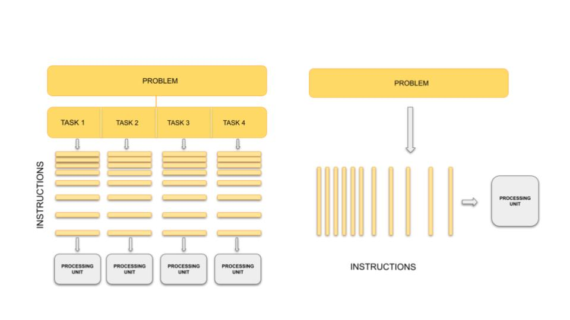
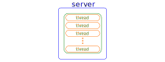
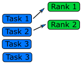

Parallelisation is a technique that allows us to divide a complex computational task into smaller subtasks, enabling simultaneous execution and improving performance while reducing execution times. In this course, you will learn how to design parallel algorithms and write parallel programs using **OpenMP**. OpenMP, an abbreviation for "**Open Multi-Processing**," is an application programming interface (API) that supports parallel programming in C, C++, and Fortran. It simplifies the development of multithreaded programs by incorporating compiler directives, library routines, and environment variables in a simple and portable manner. However, before we dive into programming with OpenMP, let's establish a strong foundation by exploring key concepts that are essential to parallel programming. These concepts will provide us with the necessary knowledge and understanding as we progress through the upcoming episodes.

## Parallelisation in A Nutshell

At some point in your career, you’ve probably asked the question “How can I make my code run faster?”. Of course, the answer to this question will depend sensitively on your specific situation, but here are a few approaches you might try doing:

- Optimize the code.
- Move computationally demanding parts of the code from an interpreted language (Python, Ruby, etc.) to a compiled language (C/C++, Fortran, Julia, Rust, etc.).
- Use better theoretical methods that require less computation for the same accuracy

Each of the above approaches is intended to reduce the total amount of work required by the computer to run your code. A different strategy for speeding up codes is **parallelisation**, in which you split the computational work among multiple processing units that labor simultaneously. The “processing units” might include central processing units (**CPU**s), graphics processing units (**GPU**s), vector processing units (**VPU**s), or something similar.

In general, typical programming assumes that computers execute one operation at a time in the sequence specified by your program code. At any time step, the computer’s CPU core will be working on one particular operation from the sequence. In other words, a problem is broken into discrete series of instructions that are executed one for another. Therefore only one instruction can execute at any moment in time. We will call this traditional style of sequential computing.

In contrast, with parallel computing we will now be dealing with multiple CPU cores that each are independently and simultaneously working on a series of instructions. This can allow us to do much more at once, and therefore get results more quickly than if only running an equivalent sequential program. The act of changing sequential code to parallel code is called **parallelisation**.

::::callout
## Analogy
The basic concept of parallel computing is simple to understand: we divide our job in tasks that can be executed at the same
time so that we finish the job in a fraction of the time that it would have taken if the tasks are executed one by one.

Suppose that we want to paint the four walls in a room. This is our problem. We can divide our problem in 4 different tasks:
paint each of the walls. In principle, our 4 tasks are independent from each other in the sense that we don't need to finish one
to start another. However, this does not mean that the tasks can be executed simultaneously or in parallel. It all depends on
on the amount of resources that we have for the tasks.

If there is only one painter, they could work for a while in one wall, then start painting another one, then work a little bit
on the third one, and so on. The tasks are being executed concurrently **but not in parallel** and only one task is being
performed at a time. If we have 2 or more painters for the job, then the tasks can be performed in **parallel**.

In our analogy, the painters represent CPU cores in the computers. The number of CPU cores available determines the maximum
 number of tasks that can be performed in parallel. The number of concurrent tasks that can be started at the same time, however
is unlimited.
::::

Splitting the problem into computational tasks across different processors and running them all at once may conceptually seem like a straightforward solution to achieve the desired
speed-up in problem-solving. However, in practice, parallel programming involves more than just task division and introduces various complexities and considerations.

Let's consider a scenario where you have a single CPU core, associated RAM (primary memory for faster data access), hard disk (secondary memory for slower data access),
input devices (keyboard, mouse), and output devices (screen).

Now, imagine having two or more CPU cores. Suddenly, you have several new factors to take into account:

  1. If there are two cores, there are two possibilities: either these cores share the same RAM (shared memory) or each core has its own dedicated RAM (private memory).
  2. In the case of shared memory, what happens when two cores try to write to the same location simultaneously? This can lead to a race condition, which requires careful handling by the programmer to avoid conflicts.
  3. How do we divide and distribute the computational tasks among these cores? Ensuring a balanced workload distribution is essential for optimal performance.
  4. Communication between cores becomes a crucial consideration. How will the cores exchange data and synchronize their operations? Effective communication mechanisms must be established.
  5. After completing the tasks, where should the final results be stored? Should they reside in the storage of Core 1, Core 2, or a central storage accessible to both? Additionally, which core is responsible for displaying output on the screen?

These considerations highlight the interplay between parallel programming and memory. To efficiently utilize multiple CPU cores, we need to understand the  different memory models—shared memory and distributed memory- as well 
as the concepts of processes and threads that form the foundation of parallel computing that play a crucial role in achieving optimal parallel execution.

To address the challenges that arise when parallelising programs across multiple cores and achieve efficient use of available resources, parallel programming frameworks like OpenMP and MPI (Message Passing Interface) come into play. 
These frameworks provide tools, libraries, and methodologies to handle memory management, workload distribution, communication, and synchronization in parallel environments.

Now, let's take a brief look at these fundamental concepts and explore the differences between OpenMP and MPI, setting the stage for a deeper understanding of OpenMP for the next episode.

## Shared vs Distributed Memory
Shared memory refers to a memory model where multiple processors can directly access and modify
the same memory space. Changes made by one processor are immediately visible to all other
processors. Shared memory programming models, like OpenMP, simplify parallel programming by
providing mechanisms for sharing and synchronizing data.

Distributed memory, on the other hand, involves memory resources that are physically separated 
across different computers or nodes in a network. Each processor has its own private memory, and 
explicit communication is required to exchange data between processors. Distributed memory 
programming models, such as MPI, facilitate communication and synchronization in this memory model.

The choice between shared memory and distributed memory models depends on the nature of the 
problem and the available computing resources. Shared memory parallelism is well-suited for 
problems that can be efficiently divided into smaller tasks and where the coordination and 
communication overhead are relatively low. Distributed memory parallelism shines in scenarios 
where the problem size exceeds the capabilities of a single machine, and computation needs to 
be distributed across multiple nodes.

Below are some differences, advantages, and disadvantages of shared and distributed memory:

- **Accessibility:** Shared memory allows direct access to the same memory space by all processors,
while distributed memory requires explicit communication for data exchange between processors.
**Memory Scope:** Shared memory provides a global memory space, enabling easy data sharing and 
synchronization. In distributed memory, each processor has its own private memory space, requiring 
explicit communication for data sharing.
- **Memory Consistency:** Shared memory ensures immediate visibility of changes made by on 
processor to all other processors. Distributed memory requires explicit communication and
synchronization to maintain data consistency across processors.
- **Scalability:** Shared memory systems are typically limited to a single computer or node,
whereas distributed memory systems can scale to larger configurations with multiple computers and 
nodes.
- **Programming Complexity:** Shared memory programming models offer simpler constructs and require
less explicit communication compared to distributed memory models. Distributed memory programming
involves explicit data communication and synchronization, adding complexity to the programming
process.

:::callout
## Analogy
Imagine that all workers have to obtain their paint from a central dispenser located at the middle of the room. If each worker
is using a different colour, then they can work asynchronously. However, if they use the same colour, and two of them run out of 
paint at the same time, then they have to synchronise to use the dispenser — one should wait while the other is being serviced.

Now let's assume that we have 4 paint dispensers, one for each worker. In this scenario, each worker can complete their task
totally on their own. They don’t even have to be in the same room, they could be painting walls of different rooms in the house, in
different houses in the city, and different cities in the country. We need, however, a communication system in place. Suppose
that worker A, for some reason, needs a colour that is only available in the dispenser of worker B, they must then synchronise:
worker A must request the paint of worker B and worker B must respond by sending the required colour.
 
In our analogy, the paint dispenser represents access to the memory in your computer. Depending on how a program is written,
access to data in memory can be synchronous or asynchronous. For the different dispensers case for your workers, however,
think of the memory distributed on each node/computer of a cluster.
:::

## Processes
A process refers to an individual running instance of a software program. Each process operates independently and possesses its own set of
resources, such as memory space and open files. As a result, data within one process remains isolated and cannot be directly accessed by other processes.

In parallel programming, the objective is to achieve parallel execution by simultaneously running coordinated processes. This naturally introduces the 
need for communication and data sharing among them. To facilitate this, parallel programming models like MPI come into effect. MPI provides a comprehensive set of libraries, 
tools, and methodologiesthat enable processes to exchange messages, coordinate actions, and share data,  enabling parallel execution across a cluster or network of machines.

## Threads

A thread is an execution unit within a process. Unlike processes, threads operate within the context of a single process and share the same memory and resources. 
Threads can be thought of as separate points of execution within a program, capable of performing tasks concurrently.

In a **single-threaded** program, there is only one thread of execution within a process and it follows a sequential flow, where each instruction is executed one after another. 
In a **multi-threaded** program, however, multiple threads of execution exist within a single process. These threads can access and share the same data and resources, 
enabling more efficient and faster parallel programming. 

One advantage of using threads is that they can be easier to work with compared to processes when it comes to parallel programming. When incorporating threads,
especially with frameworks like OpenMP, modifying a program becomes simpler. This ease of use stems from the fact that threads operate within the same process and can
directly access shared data, eliminating the need for complex inter-process communication mechanisms required by MPI. However, it's important to note that threads within
a process are limited to a single computer. While they provide an effective means of utilizing multiple CPU cores on a single machine, they cannot extend beyond the boundaries of that computer.

:::callout
## Analogy
Let's go back to our painting 4 walls examples with a team of workers. Each painter represents a ***“process”*** 
(an individual instance of a program), and they share the same painting tools and materials. 
Now, let's focus on the painters' arms. Each arm can be seen as a ***“thread”***, capable of 
performing independent actions and working on different sections of the wall simultaneously. 
Just as the painters coordinate their movements to avoid conflicts and overlap, threads in a 
program coordinate their execution to ensure synchronization and efficient use of shared 
resources.

In our painting analogy, a **single-threaded** program can be compared to a single painter 
working alone to paint the walls of a room. The painter performs each stroke of the brush in 
a sequential manner, completing the painting task step by step.

Now, let's introduce the concept of **multiple threads** within a process. In our painting analogy, imagine the team of painters expanding their operations. 
Each painter still represents a process, but now they have multiple threads of execution represented by their arms. Each arm can work independently, 
allowing different sections of the wall to be painted simultaneously.
:::

## Parallel Paradigms

Thinking back to shared vs distributed memory models, how to achieve a parallel computation
is divided roughly into **two paradigms**. Let's set both of these in context:

1. In a shared memory model, a ***data parallelism*** paradigm is typically used, as employed by OpenMP: the same operations are
  performed simultaneously on data that is _shared_ across each parallel operation.
  Parallelism is achieved by how much of the data a single operation can act on.
2. In a distributed memory model, a ***message passing*** paradigm is used, as employed by MPI: each CPU (or core) runs an
  independent program. Parallelism is achieved by _receiving data_ which it doesn't have,
  conducting some operations on this data, and _sending data_ which it has.

This division is mainly due to historical
development of parallel architectures: the first one follows from shared memory
architecture like SMP (Shared Memory Processors) and the second from
distributed computer architecture. A familiar example of the shared
memory architecture is GPU (or multi-core CPU) architecture, and an
example of the distributed computing architecture is a
cluster of distributed computers. Which architecture is more useful depends on what
kind of problems you have. Sometimes, one has to use both!

Consider a simple loop which can be sped up if we have many cores for illustration:

~~~c
for(i=0; i<N; i++) {
  a[i] = b[i] + c[i];
}
~~~

If we have `N` or more cores, each element of the loop can be computed in
just one step (for a factor of $$N$$ speed-up). Let's look into both paradigms in a little more detail, and focus on key characteristics.

### 1. Data Parallelism Paradigm

To understand what data parallelism means, let's consider the following bit of OpenMP code which
parallelizes the above loop:

~~~c
#pragma omp parallel for
for(i=0; i<N; i++) {
  a[i] = b[i] + c[i];
}
~~~

Parallelization achieved by just one additional line, `#pragma omp parallel for`, handled by the
preprocessor in the compile stage, where the
compiler "calculates" the data address off-set for each core and lets each one compute on a part
of the whole data. This approach provides a convenient abstraction, and hides the underlying parallelisation
mechanisms.

Here, the catch word is ***shared memory*** which allows all cores to access
all the address space. We'll be looking into OpenMP later in this course.In Python, process-based parallelism is supported 
by the [multiprocessing](https://docs.python.org/dev/library/multiprocessing.html#module-multiprocessing) module.

### 2. Message Passing Paradigm

In the message passing paradigm, each processor runs its own program and works on its own data.
To work on the same problem in parallel, they communicate by sending messages to each other. 
Again using the above example, each core runs the same program over a portion of the
data. For example, using this paradigm to parallelise the above loop instead: 

~~~c
for(i=0; i<m; i++) {
  a[i] = b[i] + c[i];
}
~~~

- Other than changing the number of loops from `N` to `m`, the code is exactly the same.
- `m` is the reduced number of loops each core needs to do (if there are `N` cores, `m` is 1 (= `N`/`N`)).

But the parallelization by message passing is not complete yet. In the message passing paradigm,
each core operates independently from the other cores. So each core needs to be sent the correct
data to compute, which then returns the output from that computation.
However, we also need a core to coordinate the splitting up of that data, send portions of that
data to other cores, and to receive the resulting computations from those cores.

### Summary
In the end, both data parallelism and message passing logically achieve the following:

Therefore, each rank essentially operates on its own set of data, regardless of paradigm.
In some cases, there are advantages to combining data parallelism and message passing methods
together, e.g. when there are problems larger than one GPU can handle. In this case, _data
parallelism_ is used for the portion of the problem contained within one GPU, and then _message
passing_ is used to employ several GPUs (each GPU handles a part of the problem) unless special
hardware/software supports multiple GPU usage.

## Algorithm Design

Designing a parallel algorithm that determines which of the two
paradigms above one should follow rests on the actual understanding of
how the problem can be solved in parallel. This requires some thought
and practice.

To get used to "thinking in parallel", we discuss "Embarrassingly
Parallel" (EP) problems first and then we consider problems which are
not EP problems.

### Embarrassingly Parallel Problems

Problems which can be parallelized most easily are EP problems, which
occur in many Monte Carlo simulation problems and in many big database
search problems. In Monte Carlo simulations, random initial conditions
are used in order to sample a real situation. So, a random number is
given and the computation follows using this random number. Depending
on the random number, some computation may finish quicker and some
computation may take longer to finish. And we need to sample a lot
(like a billion times) to get a rough picture of the real
situation. The problem becomes running the same code with a different
random number over and over again! In big database searches, one needs
to dig through all the data to find wanted data.  There may be just
one datum or many data which fit the search criterion. Sometimes, we
don't need all the data which satisfies the condition. Sometimes, we
do need all of them. To speed up the search, the big database is
divided into smaller databases, and each smaller databases are
searched independently by many workers!

#### Queue Method

Each worker will get tasks from a predefined queue (a random number in
a Monte Carlo problem and smaller databases in a big database search
problem).  The tasks can be very different and take different amounts
of time, but when a worker has completed its tasks, it will pick the
next one from the queue.

In an MPI code, the queue approach requires the ranks to communicate
what they are doing to all the other ranks, resulting in some
communication overhead (but negligible compared to overall task time).

#### Manager / Worker Method

The manager / worker approach is a more flexible version of the queue
method.  We hire a manager to distribute tasks to the workers.  The
manager can run some complicated logic to decide which tasks to give
to a worker.  The manager can also perform any serial parts of the
program like generating random numbers or dividing up the big
database. The manager can become one of the workers after finishing managerial work.

{width=40%}

In an MPI implementation, the main function will usually contain an
`if` statement that determines whether the rank is the manager or a
worker.  The manager can execute a completely different code from the
workers, or the manager can execute the same partial code as the
workers once the managerial part of the code is done. It depends on
whether the managerial load takes a lot of time to finish or
not. Idling is a waste in parallel computing!

Because every worker rank needs to communicate with the manager, the
bandwidth of the manager rank can become a bottleneck if
administrative work needs a lot of information (as we can observe in
real life).  This can happen if the manager needs to send smaller
databases (divided from one big database) to the worker ranks.  This
is a waste of resources and is not a suitable solution for an EP
problem.  Instead, it's better to have a parallel file system so that
each worker rank can access the necessary part of the big database independently.

### General Parallel Problems (Non-EP Problems)

In general not all the parts of a
serial code can be parallelized.  So, one needs to identify which part
of a serial code is parallelizable. In science and technology, many
numerical computations can be defined on a regular structured data
(e.g., partial differential equations in a 3D space using a finite
difference method). In this case, one needs to consider how to
decompose the domain so that many cores can work in parallel.

#### Domain Decomposition

When the data is structured in a regular way, such as when
simulating atoms in a crystal, it makes sense to divide the space
into domains. Each rank will handle the simulation within its
own domain.

Many algorithms involve multiplying very large matrices.  These
include finite element methods for computational field theories as
well as training and applying neural networks.  The most common
parallel algorithm for matrix multiplication divides the input
matrices into smaller submatrices and composes the result from
multiplications of the submatrices.  If there are four ranks, the
matrix is divided into four submatrices.

$$ A = \left[ \begin{array}{cc}A_{11} & A_{12} \\ A_{21} & A_{22}\end{array} \right] $$

$$ B = \left[ \begin{array}{cc}B_{11} & B_{12} \\ B_{21} & B_{22}\end{array} \right] $$

$$ A \cdot B = \left[ \begin{array}{cc}A_{11} \cdot B_{11} + A_{12} \cdot B_{21} & A_{11} \cdot B_{12} + A_{12} \cdot B_{22} \\ A_{21} \cdot B_{11} + A_{22} \cdot B_{21} & A_{21} \cdot B_{12}+ A_{22} \cdot B_{22}\end{array} \right]$$

If the number of ranks is higher, each rank needs data from one row and one column to complete
its operation.

#### Load Balancing

Even if the data is structured in a regular way and the domain is
decomposed such that each core can take charge of roughly equal
amounts of the sub-domain, the work that each core has to do may not
be equal. For example, in weather forecasting, the 3D spatial domain
can be decomposed in an equal portion. But when the sun moves across
the domain, the amount of work is different in that domain since more
complicated chemistry/physics is happening in that domain. Balancing
this type of loads is a difficult problem and requires a careful
thought before designing a parallel algorithm.

:::challenge{id=serial_prallel_prog title="Serial and Parallel Regions"}
Identify the serial and parallel regions in the following algorithm:
~~~
vector_1[0] = 1;
vector_1[1] = 1;
for i in 2 ... 1000
  vector_1[i] = vector_1[i-1] + vector_1[i-2];

for i in 0 ... 1000
  vector_2[i] = i;

for i in 0 ... 1000
  vector_3[i] = vector_2[i] + vector_1[i];
  print("The sum of the vectors is.", vector_3[i]);
~~~
:::solution

~~~
serial   | vector_0[0] = 1;
         | vector_1[1] = 1;
         | for i in 2 ... 1000
         |   vector_1[i] = vector_1[i-1] + vector_1[i-2];

parallel | for i in 0 ... 1000
         |   vector_2[i] = i;

parallel | for i in 0 ... 1000
         |   vector_3[i] = vector_2[i] + vector_1[i];
         |   print("The sum of the vectors is.", vector_3[i]);

The first and the second loop could also run at the same time.
~~~
:::
::::

