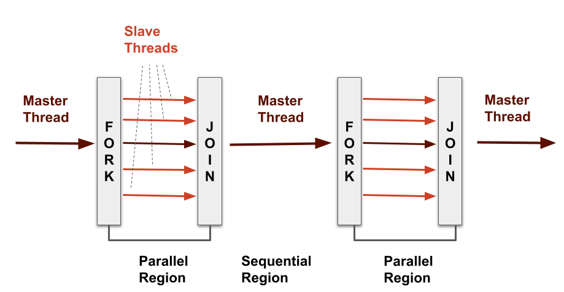

## What is OpenMP?

OpenMP is an industry-standard API specifically designed for parallel programming in shared memory environments. It supports programming in languages such as C, C++, and Fortran. OpenMP is an open source, industry-wide initiative that benefits from collaboration among hardware and software vendors, governed by the OpenMP Architecture Review Board ([OpenMP ARB](https://www.openmp.org/)).

::::challenge{id=timeline, title="An OpenMP Timeline"}

If you're interested, there's a [timeline of how OpenMP developed](https://www.openmp.org/uncategorized/openmp-timeline/).
It provides an overview of OpenMP's evolution until 2014, with significant advancements
occurring thereafter. Notably, OpenMP 5.0 marked a significant step in 2018, followed by the latest
iteration, OpenMP 5.2, which was released in November 2021.
::::

## How does it work?

OpenMP allows programmers to identify and parallelize sections of code, enabling multiple threads to execute them concurrently. This concurrency is achieved using a shared-memory model, where all threads can access a common memory space and communicate through shared variables.

To understand how OpenMP orchestrates this parallel execution, let's explore the **fork-join model** it employs. Think of your program as a team with a leader (the master thread) and workers (the slave threads). When your program starts, the leader thread takes the lead. It identifies parts of the code that can be done at the same time and marks them. These marked parts are like tasks to be completed by the workers. The leader then gathers a group of helper threads, and each helper tackles one of these marked tasks. Each worker thread works independently, taking care of its task. Once all the workers are done, they come back to the leader, and the leader continues with the rest of the program.

In simpler terms, when your program finds a special "parallel" section, it's like the leader telling the workers to split up and work on different tasks together (that's the "fork" part). After finishing their tasks, these workers come back to the leader, allowing the leader to move forward (that's the "join" part). This teamwork approach helps OpenMP speed up tasks and get things done faster.

OpenMP consists of three key components that enable parallel programming using threads:

- **Compiler Directives:** OpenMP makes use of special code markers known as *compiler directives* to indicate to the compiler when and how to parallelise various sections of code. These directives are prefixed with `#pragma omp`, and mark sections of code to be executed concurrently by multiple threads.
- **Runtime Library Routines:** These are predefined functions provided by the OpenMP runtime library. They allow you to control the behavior of threads, manage synchronisation, and handle parallel execution. For example, we can use the function `omp_get_thread_num()` to obtain the unique identifier of the calling thread.
- **Environment Variables:** These are settings that can be adjusted to influence the behavior of the OpenMP runtime. They provide a way to fine-tune the parallel execution of your program. Setting OpenMP environment variables is typically done similarly to other environment variables for your system. For instance, you can adjust the number of threads to use for a program you are about to execute by specifying the value in the `OMP_NUM_THREADS` environment variable.

Since parallelisation using OpenMP is accomplished by adding compiler directives to existing code structures, it's relatively easy to get started using it.
This also means it's straightforward to use on existing code, so it can prove a good approach to migrating serial code to parallel.
Since OpenMP support is built into existing compilers, it's also a defacto standard for C parallel programming.
However, it's worth noting that other options exist in different languages (e.g. there are c++many options in C++, the [multiprocessing library](https://docs.python.org/3/library/multiprocessing.html) for Python, [Rayon](https://docs.rs/rayon/latest/rayon/) for Rust).

## Running a Code with OpenMP

Before we get into into specifics of writing code that uses OpenMP, let's first look at how we compile and run an example "Hello World!" OpenMP program that prints this to the console.

Wherever you may eventually run your OpenMP code - locally, on another machine, or on an HPC infrastructure - it's a good practice to develop OpenMP programs on your local machine first.
This has the advantage of allowing you to more easily configure your development environment to suit your needs, particularly for making use of tools like Integrated Development Environments (IDEs), such as Microsoft VSCode.
In order to make use of OpenMP itself, it's usually a case of ensuring you have the [right compiler installed on your system](https://www.openmp.org/resources/openmp-compilers-tools/), such as gcc.

Save the following code in `hello_world_omp.c`:

~~~c
#include <stdio.h>
#include <omp.h>

int main() {
    #pragma omp parallel
    {
        printf("Hello World!\n");
    }
}
~~~

You'll likely want to compile it using a standard compiler such as `gcc`, although this may depend on your system. To enable the creation of multi-threaded code based on OpenMP directives, pass the `-fopenmp` flag to the compiler. This flag indicates that you're compiling an OpenMP program:

~~~bash
gcc hello_world_omp.c -o hello_world_omp -fopenmp
~~~

Before we run the code we also need to indicate how many threads we wish the program to use.
One way to do this is to specify this using the `OMP_NUM_THREADS` environment variable, e.g.

~~~bash
export OMP_NUM_THREADS=4
~~~

Now you can run it just like any other program using the following command:

~~~bash
./hello_world_omp
~~~

When you execute the OpenMP program,
it will display 'Hello World!' multiple times according to the value we entered in `OMP_NUM_THREADS`,
with each thread in the parallel region executing the `printf` statement concurrently:

~~~text
Hello World!
Hello World!
Hello World!
Hello World!
~~~

::::callout

## How to Use in Microsoft VSCode?

If you're looking to develop OpenMP programs in VSCode, here are three configuration hints which can help:

- **Language Extensions:** Installing the Microsoft [C/C++ language extension](https://marketplace.visualstudio.com/items?itemName=ms-vscode.cpptools) in VSCode will provide IntelliSense and debugging features for C/C++. There is also an [extension for OpenMP](https://marketplace.visualstudio.com/items?itemName=idma88.omp-pragma) pragma directive support.
- **Compiler Support:** OpenMP C programs need to be compiled with a `-fopenmp` flag, so creating/modifying a custom `tasks.json` file for VSCode can do this. Here's an [example tasks.json](code/vscode/tasks.json) which makes use of `-fopenmp` which you can copy into the project's `.vscode` folder (or merge into an existing one). The key thing is to ensure this flag is added into `args` within the task.
- **Runtime/Debugging Support:** Configuring the number of threads for an OpenMP program to use when it's run can be accomplished using a custom `launch.json` file. Here's an [example launch.json](code/vscode/launch.json) which sets the `OMP_NUM_THREADS` environment variable before running the program (by default, it's set to 4). Copy this to the project's `.vscode` folder (or merge it with an existing one).

You may need to adapt the `tasks.json` and `launch.json` depending on your platform (in particular, the `program` field in `launch.json` may need to reference a `hello_world_omp.exe` file if running on Windows, and the location of gcc in the `command` field may be different in `tasks.json`).

Once you've compiled `hello_world_omp.c` the first time, then, by selecting VSCode's `Run and Debug` tab on the left, the `C++ OpenMP: current file` configuration should appear in the top left which will set `OMP_NUM_THREADS` before running it.
::::
