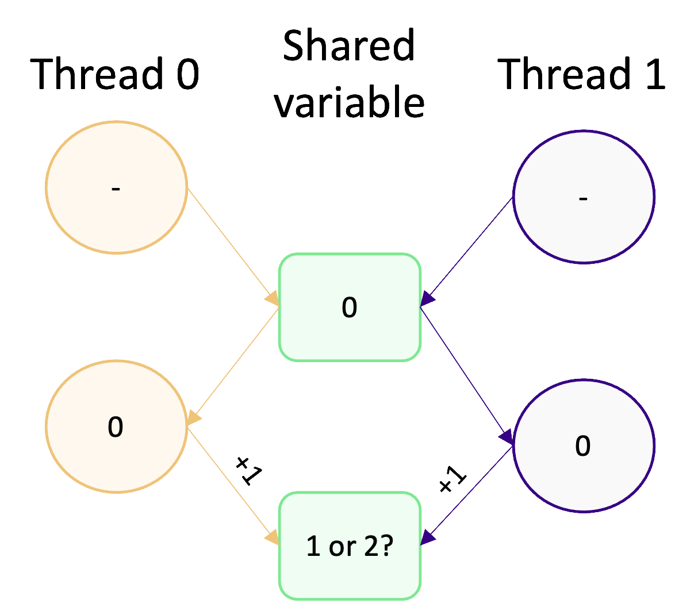

In the previous episode, we saw how to use parallel regions, and the shortcut parallel for, to split work across
multiple threads. In this episode, we will learn how to synchronise threads and how to avoid data inconsistencies caused
by unsynchronised threads.

We've seen just how easy it is to write parallel code using OpenMP, but, now we need to make sure that the code we're
writing is both *efficient* and *correct*. To do that, we need some additional knowledge about thread synchronisation
and race conditions. In the context of parallel computing, thread  or rank (in the case of MPI) synchronisation plays a
crucial role in guaranteeing the *correctness* of our program, particularly in regard to data consistency and integrity.

::::callout

## What is code correctness?

Code correctness in parallel programming is the guarantee that a program operates as expected in multi-threaded
and multi-process environments, providing both consistent and valid results. This is usually about how a parallel
algorithm deals with data accesses and modification, minimizing the occurrence of data inconsistencies creeping in.
::::

So what is thread synchronisation? Thread synchronisation is the coordination of threads, which is usually done to avoid
conflicts caused by multiple threads accessing the same piece of shared data. It's important to synchronise threads
properly so they are able to work together, and not interfere with data another thread is accessing or modifying.
Synchronisation is also important for data dependency, to make sure that a thread has access to the data it requires.
This is particularly important for algorithms which are iterative.

The synchronisation mechanisms in OpenMP are incredibly important tools, as they are used to avoid race conditions. Race
conditions have to be avoided, otherwise they *can* result in data inconsistencies if we have any in our program. A
race  condition happens when two, or more, threads access and modify the same piece of data at the same time. To
illustrate this, consider the diagram below:



Two threads access the same shared variable (with the value 0) and increment it by 1. Intuitively, we might except the
final value of the shared variable to be 2. However, due to the potential for concurrent access and modification, we
can't actually guarantee what it will be. If both threads access and modify the variable concurrently, then the
final value will be 1. That's because both variables read the initial value of 0, increment it by 1, and write to the
shared variable.

In this case, it doesn't matter if the variable update does or does not happen concurrently. The inconsistency stems from
the value initially read by each thread. If, on the other hand, one thread manages to access and modify the variable
before the other thread can read its value, then we'll get the value we expect (2). For example, if thread 0 increments
the variable before thread 1 reads it, then thread 1 will read a value of 1 and increment that by 1 giving us the
correct value of 2. This illustrates why it's called a race condition, because threads race each other to access and
modify variables before another thread can!

:::callout

## Analogy: Editing a document

Imagine two people trying to update the same document at the same time. If they don't communicate what they're doing,
they might edit the same part of the document and overwrite each others changes, ending up with a messy and
inconsistent document (e.g. when they come to merge changes later). This is just like what happens with a race
condition in OpenMP. Different threads accessing and modifying the same part of memory, which results in messy and
inconsistent memory operations and probably an incorrect result.
:::

::::challenge{id=identifyraceconditions, title="Identifying race conditions"}
Take a look at the following code example. What's the output when you compile
and run this program? Where do you think the race condition is?

```c
#include <omp.h>
#include <stdio.h>
#include <stdlib.h>

#define NUM_TIMES 10000

int main(void) {
    int value = 0;

    #pragma omp parallel for
    for (int i = 0; i < NUM_TIMES; ++i) {
        value += 1;
    }

    printf("The final value is: %d\n", value);

    return EXIT_SUCCESS;
}
```

:::solution
What you will notice is that when you run the program, the final value changes each time. The correct final value is
10,000, but you will often get a value that is lower than this. This is caused by a race condition, as explained in
the previous diagram where threads are incrementing the value of `value` before another thread has finished with it.

So the race condition is in the parallel loop and happens because of threads reading the value of `value` before it
has been updated by other threads.
:::
::::

## Synchronisation mechanisms

Synchronisation in OpenMP is all about coordinating the execution of threads, especially when there is data dependency
in your program or when uncoordinated data access will result in a race condition. The synchronisation mechanisms in
OpenMP allow us to control the order of access to shared data, coordinate data dependencies (e.g. waiting for
calculations to be complete) and tasks (if one task needs to be done before other tasks can continue), and to
potentially limit access to tasks or data to certain threads.

### Barriers

Barriers are the most basic synchronisation mechanism. They are used to create a waiting point in our program. When a
thread reaches a barrier, it waits until all other threads have reached the same barrier before continuing. To add a
barrier, we use the `#pragma omp barrier` directive. In the example below, we have used a barrier to synchronise threads
such that they don't start the main calculation of the program until a look-up table has been initialised (in parallel),
as the calculation depends on this data ([See the full code here](code/examples/04-barriers.c)).

```c
#pragma omp parallel
{
    int thread_id = omp_get_num_thread();

    /* The initialisation of the look up table is done in parallel */
    initialise_lookup_table(thread_id);

    #pragma omp barrier  /* As all threads depend on the table, we have to wait until all threads
                            are done and have reached the barrier */
    
    /* Each thread then proceeds to its main calculation */
    do_main_calculation(thread_id);
}
```

Similarly, in iterative tasks like matrix calculations, barriers help coordinate threads so that all updates
are completed before moving to the next step. For example, in the following snippet, each thread updates its assigned
row of a matrix using data from its current row and the row above (except for the first row, which has no dependency;
[see the full code here](code/examples/04-matrix-update.c)). A barrier ensures that all threads finish updating their rows in `next_matrix` before the values are
copied back into `current_matrix`.  Without this barrier, threads might read outdated or partially updated data, causing inconsistencies.

Here, the number of rows (`nx`) is dynamically determined at runtime using `omp_get_max_threads()`. This function provides
the maximum number of threads OpenMP can use in a parallel region, based on the system's resources and runtime configuration.
Using this value, we define the number of rows in the matrix, with each row corresponding to a potential thread. This setup
ensures that both the `current_matrix` and `next_matrix` provide rows for the maximum number of threads allocated during parallel execution.

```c
......
int main() {
    int nx = omp_get_max_threads();
    double current_matrix[nx][NY];
    double next_matrix[nx][NY];

    /* Initialise the current matrix */
    initialise_matrix(current_matrix, nx);

    for (int iter = 0; iter < NUM_ITERATIONS; ++iter) {
        #pragma omp parallel
        {
            int thread_id = omp_get_thread_num();

            /* Update next_matrix based on current_matrix */
            iterate_matrix_solution(current_matrix, next_matrix, thread_id, nx);

            #pragma omp barrier /* Synchronise all threads before copying */
        }
        /* Copy the next_matrix into current_matrix for the next iteration */
        copy_matrix(next_matrix, current_matrix, nx);
    }

    /* Print the final matrix */
    print_matrix("Final Matrix", current_matrix, nx);
}
```

:::callout{variant='note'}

OpenMP does not allow barriers to be placed directly inside `#pragma omp parallel for` loops due to restrictions on
closely [nested regions](https://www.openmp.org/spec-html/5.2/openmpse101.html#x258-27100017.1). To coordinate threads effectively in iterative tasks like this, we use a `#pragma omp parallel` construct,
which gives explicit control over the loop and allows proper barrier placement.
:::

Barriers introduce additional overhead into our parallel algorithms, as some threads will be idle whilst waiting for
other threads to catch up. There is no way around this synchronisation overhead, so we need to be careful not to overuse
barriers or have an uneven amount of work between threads. This overhead increases with the number of threads in use,
and becomes even worse when the workload is uneven killing the parallel scalability.

::::callout

### Blocking thread execution and `nowait`

Most parallel constructs in OpenMP will synchronise threads before they exit the parallel region. For example,
consider a parallel for loop. If one thread finishes its work before the others, it doesn't leave the parallel region
and start on its next bit of code. It's forced to wait around for the other threads to finish, because OpenMP forces
threads to be synchronised.

This isn't ideal if the next bit of work is independent of the previous work just finished. To avoid any wasted CPU
time due to waiting around due to synchronisation, we can use the `nowait` clause which overrides the synchronisation
that occurs and allow a "finished" thread to continue to its next chunk of work. In the example below,
a `nowait` clause is used with a parallel for.

```c
#pragma omp parallel
{
    #pragma omp for nowait  /* with nowait the loop executes as normal, but... */
    for (int i = 0; i < NUM_ITERATIONS; ++i) {
        parallel_function();
    }

    /* ...if a thread finishes its work in the loop, then it can move on immediately
       to this function without waiting for the other threads to finish */
    next_function();
 }
```

::::

### Synchronisation regions

A common challenge in shared memory programming is coordinating threads to prevent multiple threads from concurrently
modifying the same piece of data. One mechanism in OpenMP to coordinate thread access are *synchronisation regions*,
which are used to prevent multiple threads from executing the same piece of code at the same time. When a thread reaches
one of these regions, they queue up and wait their turn to access the data and execute the code within the region. The
table below shows the types of synchronisation region in OpenMP.

| Region       | Description                                                                                                                                                                                                                                                                                    | Directive              |
|--------------|------------------------------------------------------------------------------------------------------------------------------------------------------------------------------------------------------------------------------------------------------------------------------------------------|------------------------|
| **critical** | Only one thread is allowed in the critical region. Threads have to queue up to take their turn. When one thread is finished in the critical region, it proceeds to execute the next chunk of code (not in the critical region) immediately without having to wait for other threads to finish. | `#pragma omp critical` |
| **single**   | Single regions are used for code which needs to be executed only by a single thread, such as for I/O operations. The first thread to reach the region will execute the code, whilst the other threads will behave as if they've reached a barrier until the executing thread is finished.      | `#pragma omp single`   |
| **master**   | A master region is identical to the single region other than that execution is done by the designated master thread (usually thread 0).                                                                                                                                                        | `#pragma omp master`   |

The next example builds on the previous example which included a lookup table. In the modified code, the lookup
table is written to disk after it has been initialised. This happens in a single region, as only one thread needs to
write the result to disk ([See the full code here](code/examples/04-single-region.c)).

```c
#pragma omp parallel
{
    int thread_id = omp_get_num_thread();
    initialise_lookup_table(thread_id);
    
    #pragma omp barrier  /* Add a barrier to ensure the lookup table is ready to be written to disk */
    #pragma omp single   /* We don't want multiple threads trying to write to file -- this could also be master */
    {
        write_table_to_disk();
    }
    do_main_calculation(thread_id);
}
```

:::callout{variant='note'}

OpenMP has a restriction: you cannot use `#pragma omp single` or `#pragma omp master` directly inside a `#pragma omp parallel for` loop.
If you attempt this, you'll encounter an error because OpenMP does not allow these regions to be **"closely nested"** within a parallel loop.
However, there’s a useful workaround: move the `single` or `master` region into a separate function and call that function from within the
loop. This approach works because OpenMP allows these regions when they are not explicitly part of the loop structure

:::

If we wanted to sum up something in parallel (e.g., a reduction operation like summing an array), we would need to use a critical region to
prevent a race condition when threads update the reduction variable-the shared variable that stores the final result. In the 'Identifying Race Conditions' challenge
earlier, we saw that multiple threads updating the same variable (**value**) at the same time caused inconsistencies—a classic race condition.
This problem can be fixed by using a critical region, which allows threads to update **value** one at a time. For example:

```c

int value = 0;
#pragma omp parallel for
for (int i = 0; i < NUM_TIMES; ++i) {
    #pragma omp critical  /* Now only one thread can read and modify `value` */
    {
        value += 1;
    }
}
```

However, while this approach eliminates the race condition, it introduces synchronisation overhead. For lightweight operations like
summing values, this overhead can outweigh the benefits of parallelisation.

:::callout

### Reduction Clauses

A more efficient way to handle tasks like summing values is to use OpenMP's `reduction` clause.
Unlike the critical region approach, the `reduction` clause avoids explicit synchronisation by
allowing each thread to work on its own private copy of the variable. Once the loop finishes,
OpenMP combines these private copies into a single result. This not only simplifies the code but also avoids delays
caused by threads waiting to access the shared variable.

For example, instead of using a critical region to sum values, we can rewrite the code with a `reduction` clause
as shown below:

```c
#include <omp.h>
#include <stdio.h>

#define NUM_TIMES 10000

int main() {
    int value = 0;

    #pragma omp parallel for reduction(+:value)
    for (int i = 0; i < NUM_TIMES; ++i) {
        value += 1;
    }

    printf("Final value: %d\n", value);

    return 0;
}
```

Here, the `reduction(+:value)` directive does the work for us. During the loop, each thread maintains its
own copy of value, avoiding any chance of a race condition. When the loop ends, OpenMP automatically sums
up the private copies into the shared variable value. This means the output will always be correct—in this case, **10000**.
:::

::::challenge{id=reportingprogress title="Reporting progress"}

The code below attempts to track the progress of a parallel loop using a shared counter, `progress`.
However, it has a problem: the final value of progress is often incorrect, and the progress updates might be
inconsistent.

1. Can you identify the issue with the current implementation?

2. How would you fix it to ensure the progress counter works correctly and updates are synchronised?

3. After fixing the issue, experiment with different loop schedulers (`static`, `dynamic`, `guided` and `auto`)
to observe how they affect progress reporting.
    - What changes do you notice in the timing and sequence of updates when using these schedulers?
    - Which scheduler produces the most predictable progress updates?

```c
#include <math.h>
#include <omp.h>
#include <stdio.h>

#define NUM_ELEMENTS 10000

int main(int argc, char **argv) {
    int array[NUM_ELEMENTS] = {0};
    int progress = 0;

    #pragma omp parallel for schedule(static)
    for (int i = 0; i < NUM_ELEMENTS; ++i) {
        array[i] = log(i) * cos(3.142 * i);
        
        if (i % (NUM_ELEMENTS / 10) == 0) {
            printf("Progress: %d%%\n", (i * 100) / NUM_ELEMENTS);
        }

        progress++;
    }

    printf("Final progress: %d (Expected: %d)\n", progress, NUM_ELEMENTS);
    return 0;
}
```

NB: To compile this you’ll need to add `-lm` to inform the linker to link to the math C library, e.g.

```bash
gcc counter.c -o counter -fopenmp -lm
```

:::solution

**1.** The above program tracks progress using a shared counter (`progress++`) inside the loop,
but it does so without synchronisation, leading to a race condition. Since multiple threads can access and modify progress at the same time, the final value of progress will likely be incorrect.
This happens because the updates to progress are not synchronised across threads. As a result, the final value of
`progress` is often incorrect and varies across runs. You might see output like this:

```text
Final progress: 9983 (Expected: 10000)
```

**2.** To fix this issue, we use a critical region to synchronise updates to progress.
We also introduce a second variable, `output_frequency`, to control how often progress updates are reported
(e.g., every 10% of the total iterations).

The corrected version:

```c
#include <math.h>
#include <omp.h>
#include <stdio.h>

#define NUM_ELEMENTS 10000

int main(int argc, char **argv) {
    int array[NUM_ELEMENTS] = {0};
    int progress = 0;
    int output_frequency = NUM_ELEMENTS / 10; /* Output progress every 10% */

    #pragma omp parallel for schedule(static)
    for (int i = 0; i < NUM_ELEMENTS; ++i) {
        array[i] = log(i) * cos(3.142 * i);

        /* Update progress counter (with synchronisation) */
        #pragma omp critical
        {
            progress++;
            if (progress % output_frequency == 0) {
                printf("Progress: %d%%\n", (progress * 100) / NUM_ELEMENTS);
            }
        }
    }

    printf("Final progress: %d (Expected: %d)\n", progress, NUM_ELEMENTS);
    return 0;
}
```

This implementation resolves the race condition by ensuring that only one thread can modify progress at a time.
However, this solution comes at a cost: **synchronisation overhead**. Every iteration requires threads to enter the
critical region, and if the loop body is lightweight (e.g., simple calculations), this overhead may outweigh the
computational benefits of parallelisation. For example, if each iteration takes only a few nanoseconds to compute,
the time spent waiting for access to the critical region might dominate the runtime.

**3.** The static scheduler, used in the corrected version, divides iterations evenly among threads. This ensures predictable
and consistent progress updates. For instance, progress increments occur at regular intervals (e.g., 10%, 20%, etc.),
producing output like:

```text
Progress: 10%
Progress: 20%
Progress: 30%
...
Final progress: 10000 (Expected: 10000)
```

When experimenting with other schedulers, such as `dynamic` or `guided`,
the timing and sequence of updates change due to differences in how iterations are assigned to threads.

With the `dynamic` scheduler, threads are assigned smaller chunks of iterations as they finish their current work.
This can lead to progress updates appearing irregular, as threads complete their chunks at varying speeds based on
workload. For example:

```text
Progress: 15%
Progress: 30%
Progress: 55%
...
Final progress: 10000 (Expected: 10000)
```

Using the `guided` scheduler results in yet another pattern. Threads start with larger chunks of iterations,
and the chunk size decreases as the loop progresses. This often leads to progress updates being sparse at the start but
becoming more frequent toward the end of the loop:

```text
Progress: 25%
Progress: 70%
Progress: 100%
Final progress: 10000 (Expected: 10000)
```

The `auto` scheduler, on the other hand, leaves the decision about iteration assignment to the OpenMP runtime system.
This provides flexibility, as the runtime adapts the scheduling to optimise for the specific platform and workload.
However, because `auto` is implementation-dependent, the timing and predictability of progress updates can vary and
are harder to generalise.
:::
::::

## Preventing race conditions

A large amount of the time spent writing a parallel OpenMP application is usually spent preventing race conditions,
rather than on the parallelisation itself. Earlier in the episode, we looked at critical regions as a way to synchronise
threads and explored how they can be used to prevent race conditions in the previous exercise. In the rest of this section, we
will look at the other mechanisms which can prevent race conditions, such as setting locks or using atomic
operations.

### Locks

Critical regions provide a convenient and straightforward way to synchronise threads and guard data access to prevent
race conditions. But in some cases, critical regions may not be flexible or granular enough and lead to an excessive
amount of serialisation. If this is the case, we can use *locks* instead to achieve the same effect as a critical
region. Locks are a mechanism in OpenMP which, just like a critical regions, create regions in our code which only one
thread can be in at one time. The main advantage of locks, compared to critical regions, is that they provide more
granular control over thread synchronisation by protecting different-sized or fragmented regions of code, therefore
allowing greater flexibility. Locks are also far more flexible when it comes to making our code more modular, as it is possible to
nest locks, or for accessing and modifying global variables.

In comparison to critical regions, however, locks are more complicated and difficult to use. Instead of using a single
`#pragma`, we have to initialise and free resources used for the locks, as well as set and unset where locks are in
effect. If we make a mistake and forget to unset a lock, then we lose all the parallelism and could potentially
create a deadlock!

To create a lock and delete a lock, we use `omp_init_lock()` and `omp_destroy_lock()` respectively.

```c
omp_lock_t lock;          /* Locks are tracked via a lock variable, sometimes you'll create
                             a lock for large regions of code or sometimes locks for individual
                             variable updates */

omp_init_lock(&lock);     /* Allocate resources for a lock using omp_init_lock */

/* The rest of our parallel algorithm goes here */

omp_destroy_lock(&lock);  /* Deallocate resources for a lock */
```

To set and unset a lock, we use the `omp_set_lock()` and `omp_unset_lock()` functions.

```c
omp_set_lock(&lock);    /* When a thread reaches this function, it will only return from it when it can progress
                           into the lock region */

shared_variable += 1;

omp_unset_lock(&lock);  /* By unsetting a lock, we signal that the next thread can start */
```

All together, using a lock should look something like in the example below.

```c
#include <omp.h>

omp_lock_t lock;            /* In practise, you should use a better name for your lock */
omp_init_lock(&lock);       /* Allocate resources for the lock, before the parallel region */

int shared_variable = 0;

#pragma omp parallel
{
    omp_set_lock(&lock);    /* Set the lock, so only one thread can update shared_variable at once */
    shared_variable += 1;
    omp_unset_lock(&lock);  /* Remember to unset the lock, to signal the next thread can enter the lock region */
}

omp_destroy_lock(&lock);    /* Deallocate lock resources */
```

To recap, the main advantage of locks are increased flexibility and granularity for preventing race conditions. But the
main disadvantage is the additional code complexity and the potential for deadlocks and poor parallel performance if we
forget to or unset a lock in the wrong place.

### Atomic operations

Another mechanism is atomic operations. In computing, an atomic operation is an operation which is performed without
interruption, meaning that once initiated, it is guaranteed to execute without interference from other operations.
In OpenMP, this refers to operations that execute without interference from other threads. If we make an operation modifying a value in
an array atomic, the compiler guarantees that no other thread can read or modify that array until the atomic operation is
finished. You can think of it as a thread having temporary exclusive access to something in our program, similar to a
'one at a time' rule for accessing and modifying parts of the program.

To do an atomic operation, we use the `omp atomic` pragma before the operation we want to make atomic.

```c
#include <stdio.h>
#include <omp.h>

int main() {

  int shared_variable = 0;
  int shared_array[4] = {0, 0, 0, 0};

  /* Put the pragma before the shared variable */
  #pragma omp parallel
  {
    #pragma omp atomic
    shared_variable += 1;
    printf("Shared variable updated: %d\n", shared_variable);
  }

  /* Can also use in a parallel for */
  #pragma omp parallel for
  for (int i = 0; i < 4; ++i) {
    #pragma omp atomic
    shared_array[i] += 1;
    printf("Shared array element %d updated: %d\n", i, shared_array[i]);
  }
}
```

Atomic operations are for single line operations or piece of code. As in the example above, we can do an atomic
operation when we are updating variable, but we can also do other things such as atomic assignment. Atomic operations are
often less expensive than critical regions or locks, so they should be preferred when they can be used. However, it's
still important to not be over-zealous with using atomic operations as they can still introduce synchronisation
overheads which can damage the parallel performance.

:::callout

### When should I prefer to use a critical region? Or an atomic operation, or a lock?

There are three mechanisms we can use to prevent race conditions: critical regions, locks and atomic operations. The
question then is, when should I use which mechanism? The choice between what to use depends mainly on the specific
requirements of your algorithm, and also a bit through trial and error.

Critical regions and locks are more appropriate when:

- You have some complex code which needs thread synchronisation, possible with a high level of granularity.
- When there is high contention, such as when multiple threads will frequently be accessing the same shared data.
- There is some degree of error handling or more advanced synchronisation patterns.

Atomic operations are good when:

- The operation which needs synchronisation is simple, such as needing to protect a single variable update in the parallel
algorithm.
- There is low contention for shared data.
- When you need to be as performant as possible, as atomic operations generally have the lowest performance cost.

When comparing critical regions and locks, it is often better to use a critical region instead of a lock due to the
simplicity of using a critical region.
:::

::::challenge{id=removeracecondition, title="Remove the race condition"}

In the following program, an array of values is created and then summed together using a parallel for loop.

```c
#include <math.h>
#include <omp.h>
#include <stdio.h>

#define ARRAY_SIZE 524288

int main(int argc, char **argv) {
    float sum = 0;
    float array[ARRAY_SIZE];

    omp_set_num_threads(4);

    #pragma omp parallel for schedule(static)
    for (int i = 0; i < ARRAY_SIZE; ++i) {
        array[i] = cos(M_PI * i);
    }

    #pragma omp parallel for schedule(static)
    for (int i = 0; i < ARRAY_SIZE; i++) {
        sum += array[i];
    }

    printf("Sum: %f\n", sum);

    return 0;
}
```

When we run the program multiple times, we expect the output `sum` to have the value of `0.000000`. However, due to an
existing race condition, the program can sometimes produce wrong output in different runs, as shown below:

```text
1. Sum: 1.000000
2. Sum: -1.000000
3. Sum: 2.000000
4. Sum: 0.000000
5. Sum: 2.000000
```

Find and fix the race condition in the program using both an atomic operation and locks.

:::solution

We only need to modify the second loop, as each iteration in the first loop is working on an independent piece of
memory, meaning there will be no race condition. In the code below, we have used an atomic operation to increment
`sum`.

```c
#include <math.h>
#include <omp.h>
#include <stdio.h>

#define ARRAY_SIZE 524288

int main(int argc, char **argv) {
    float sum = 0;
    float array[ARRAY_SIZE];

    omp_set_num_threads(4);

    #pragma omp parallel for schedule(static)
    for (int i = 0; i < ARRAY_SIZE; ++i) {
        array[i] = cos(M_PI * i);
    }

    #pragma omp parallel for schedule(static)
    for (int i = 0; i < ARRAY_SIZE; i++) {
        #pragma omp atomic
        sum += array[i];
    }

    printf("Sum: %f\n", sum);

    return 0;
}
```

Using a critical region or a lock would also work here. If the loop was more complicated than a single increment operation, then we would have to use a critical region or a lock.
You can see [the solution using a lock in our example](code/solutions/04-race-condition-lock.c).
If you have to spare time, you can play around with "forgetting" to unset a lock to see what happens.

Of course in reality, we wouldn't bother doing this to the second loop. We'd just use a parallel reduction instead
to handle thread synchronisation for us!

```c
#pragma omp parallel for schedule(static) reduction(+:sum)
for (int i = 0; i < ARRAY_SIZE; ++i) {
    sum += array[i];
}
```

:::
::::
