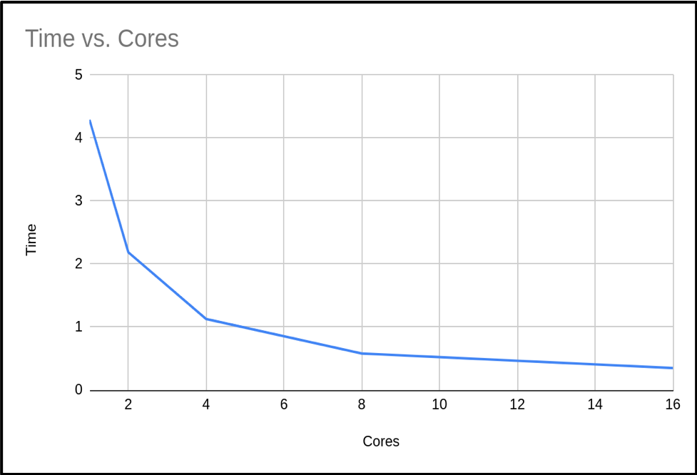
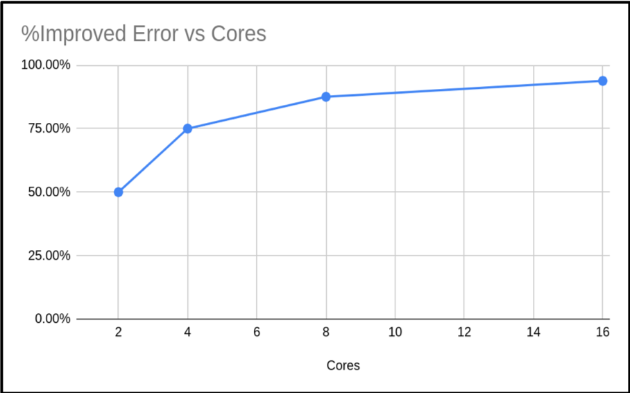
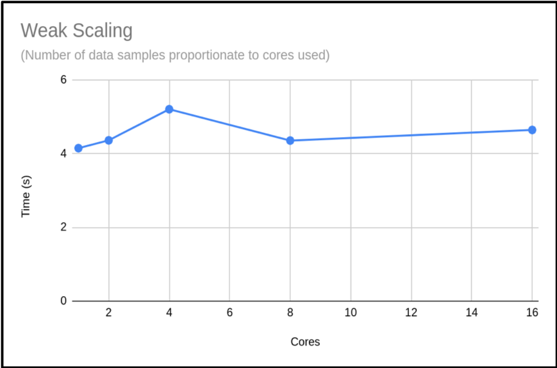
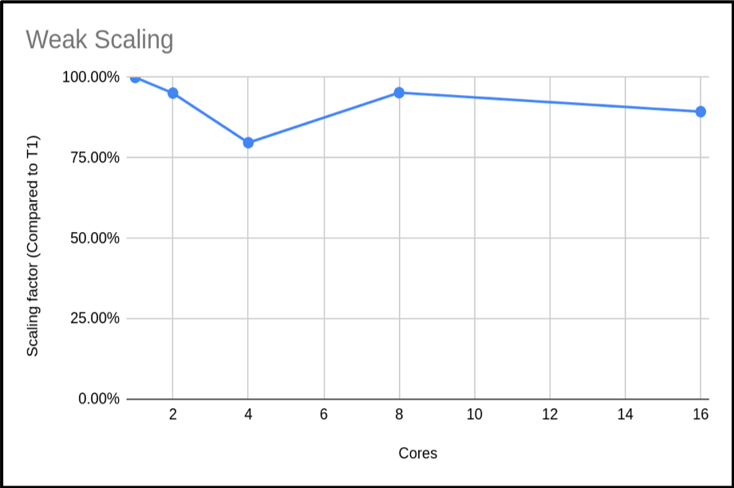

Let's now look at how we can determine the scalability characteristics for our example π code.

## Characterising our π Code's Performance

In [Common Communication Patterns](high_performance_computing/hpc_mpi/10_communication_patterns), we used MPI's reduction operation to estimate π.
Running that code over an increasing number of cores gives timing results like these:

| Cores (n) | Run Time (s) | Result        | Error         | Speedup |
| --------- | ------------ | ------------- | ------------- | ------- |
| 1         | 3.99667      | 3.14159265459 | 0.00000003182 | -       |
| 2         | 2.064242     | 3.14159265459 | 0.00000003182 | 1.94    |
| 4         | 1.075068     | 3.14159265459 | 0.00000003182 | 3.72    |
| 8         | 0.687097     | 3.14159265459 | 0.00000003182 | 5.82    |
| 16        | 0.349366     | 3.14159265459 | 0.00000003182 | 11.44   |

Using more cores reduced the run time without affecting the accuracy of the result.
The new column `speedup` shown in the table above was calculated using, e.g. with 1 core:

> *Speedup = T~1~ / T~n~*

Where *T~1~* denotes the time taken to run the code with only 1 core, and *T~n~* denotes the time taken to run the code with `n` cores.

The speedup efficiency, which measures how efficiently the additional resources are being used, is,

> *Efficiency~n~ = Speedup~n~ / n*,

Which could be as high as 1, but probably will never reach that in practice.

:::::challenge(id=calculate-speedup-1, title="Calculate using your Own Results I"}
Submit the π job from [Common Communication Patterns](high_performance_computing/hpc_mpi/10_communication_patterns) again, using a job script called `mpi-pi.sh`:

```bash
remote$ sbatch mpi-pi.sh
```

Make a copy of the SLURM output file (i.e. using the `cp` command) and add a `Speedup` column of your own, using the above Speedup formula, for each `np` result.
We'll use these figures later!

::::solution
You'll notice that your own result timings are different from the ones above, runtimes are affected by the system specs as well as the load on the system at the time of your run.
The speedup should be similar, as this is a relative measure.
::::
:::::

:::::challenge{id=scaling-type, title="What Type of Scaling?"}
Looking at your own results, is this an example of strong or weak scaling?

::::solution
This is an example of strong scaling, as we are keeping the data sample the same but increasing the number of cores used.
::::
:::::

When we plot the run time against the number of cores with the results from the above table, we see the following graph:



So, we can see that as the number of cores increases, the run time of our program decreases.
This makes sense, we are splitting the calculation into smaller pieces which are executed at the same time.

## Amdahl's Law

If we use *n* processors, we might expect *n* times speedup.
But as we've mentioned, this is rarely, if ever, the case!
In a program, there is always some portion of it which *must* be executed in serial (such as initialisation routines, I/O operations and inter-communication) which cannot be parallelised.
This limits how much a program can be speeded up, as the program will always take *at least* the length of the serial portion.
This is actually known as *Amdahl's Law*, which states that a program's serial parts limit the potential speedup from parallelising the code.

We can think of a program as being operations which *can* and *cannot* be parallelised, i.e. the part of the code we can and can't be speeded up.
The time taken for a program to finish executing is the sum of the fractions of time spent in the serial and parallel portion of the code,

> *Time to Complete (T) = Fraction of time taken in Serial Portion (F~S~) + Fraction of time taken in Parallel Portion (F~P~)*
>
> *T = F~S~ + F~P~*

When a program executes in parallel, the parallel portion of the code is split between the available cores.
But since the serial portion is not split in this way, the time to complete is therefore,

> *T~n~ = F~S~ + F~P~ / n*

We can see that as the number of cores in use increases, then the time to complete decreases until it approaches that of the serial portion.
The speedup from using more cores is,

> *Speedup = T~1~ / T~n~ = ( F~S~ + F~P~ ) / ( F~S~ + F~P~ / n )*

To simplify the above, we will define the single core execution time as a single unit of time, such that *F~S~ + F~P~ = 1*.

> *Speedup = 1 / ( F~S~ + F~P~ / n )*

Again this shows us that as the number of cores increases, the serial portion of the code will dominate the run time as when *n = ∞*,

> *Max speedup = 1 / F~S~*

## What's the Maximum Speedup?

From the previous section, we know the the maximum speedup achievable is limited to how long a program takes to execute in serial.
If we know the portion of time spent in the serial and parallel code, we will theoretically know by how much we can accelerate our program.
However, it's not always simple to know the exact value of these fractions.
But from Amdahl's law, if we can measure the speedup as a function of number of cores, we can estimate that maximum speed up.

We can rearrange Amdahl's law to estimate the parallel portion *F~P~*,

> *F~P~ = n / ( n - 1 ) ( ( T~1~ - T~n~ ) / T~1~ )*

Using the above formula on our example code we get the following results:

| Cores (n)   | T~n~            | F~p~            | F~s~ = 1 - F~p~                     |
| ----------- | --------------- | --------------- | ----------------------------------- |
| 1           | 3.99667         | -               | -                                   |
| 2           | 2.064242        | 0.967019        | 0.0329809                           |
| 4           | 1.075068        | 0.974678        | 0.0253212                           |
| 8           | 0.687097        | 0.946380        | 0.0536198                           |
| 16          | 0.349366        | 0.973424        | 0.0265752                           |
| ----------- | --------------- | --------------- | ----------------------------------- |
|             | **Average**     | 0.965375        | 0.0346242                           |
| ----------- | --------------- | --------------- | ----------------------------------- |

We now have an estimated percentage for our serial and parallel portion of our code.
As you can see, as the number of cores we use increases, the time spent in the serial portion of the code increases.

:::::challenge{id=calculate-speedup-2, title="Calculate using your Own Results II"}
Looking back at your own results from the previous *Calculate using your Own Results I* exercise, create new columns for F~p~ and F~s~ and calculate the results for each, using the formula above.
Finally, calculate the average for each of these as in the table above.
:::::

::::callout{variant="note"}

## Differences in Serial Timings

In this instance we see that serial run times vary depending on the run.
There are several factors that are causing this variation.
As we've discussed, these are being run on a working system with other users, the runtime is affected by the load of the system.
On facilities that provide exclusive access this will be less of an issue.
Code that accesses bulk storage may still be impacted, since these are shared resources.
As we are using the MPI library in our code, it is expected that the serial portion will increase slightly with the number of cores due to additional MPI overheads.
This will have a noticeable impact if you try scaling your code into the thousands of cores.
::::

If we have several values, we can take the average to estimate an upper bound on how much benefit we will get from adding more processors.
In our case then, the maximum speedup we can expect is,

> *Max speedup = 1 / F~S~ = 1 / ( 1 - F~P~ ) = 1 / ( 1 - 0.965375 ) = 29*

Using this formula we can calculate a table of the expected maximum speedup for a given F~P~:

| F~P~            | Max Speedup   |
| --------------- | ------------- |
| 0.0             | 1.00          |
| 0.1             | 1.11          |
| 0.2             | 1.25          |
| 0.3             | 1.43          |
| 0.4             | 1.67          |
| 0.5             | 2.00          |
| 0.6             | 2.50          |
| 0.7             | 3.33          |
| 0.8             | 5.00          |
| 0.9             | 10.00         |
| 0.95            | 20.00         |
| 0.99            | 100.00        |
| --------------- | ------------- |

:::::challenge{id=cores-vs-speedup, title="Number of Cores vs Expected Speedup"}
Using what we've learned about Amdahl's Law and the average percentages of serial and parallel proportions of our example code we calculated earlier in the *Calculate using your Own Results II* exercise, fill in or create a table estimating the expected total speedup and change in speedup when doubling the number of cores, in a table like the following (with the number of cores doubling each time until a total of 4096).
Substitute the initial T~1~ `???????` value with the initial T~n~ value from your own run.

Hints: use the following formula:

> *T~n~ = F~s~ + ( F~p~ / n )*
> *Speedup = T~1~ / T~n~*

| Cores (n) | T~n~    | Speedup | Change in Speedup |
| --------- | ------- | ------- | ----------------- |
| 1         | ??????? |         |                   |
| 2         |         |         |                   |
| 4         |         |         |                   |
| ...       |         |         |                   |
| 4096      |         |         |                   |

When does the change in speedup drop below 1%?

::::solution
How closely do these estimations correlate with your actual results to 16 cores?
They should hopefully be similar, since we're working off averages for our serial and parallel proportions.

Hopefully from your results you will find that we can get close to the maximum speedup calculated earlier, but it requires ever more resources.
From our own trial runs, we expect the speedup to drop below 1% at 4096 cores, but it is expected that we would never run this code at these core counts as it would be a waste of resources.

Using the `3.9967` T~1~ starting value, we get the following estimations:

| Cores (n) | T~n~     | Speedup   | Change in Speedup |
| --------- | -------- | --------- | ----------------- |
| 1         | 3.99667  | 1         | 0                 |
| 2         | 2.067504 | 1.933089  | 0.933089          |
| 4         | 1.102943 | 3.623642  | 1.690553          |
| 8         | 0.620662 | 6.439365  | 2.815723          |
| 16        | 0.379522 | 10.530804 | 4.091439          |
| 32        | 0.258952 | 15.434038 | 4.903234          |
| 64        | 0.198667 | 20.117475 | 4.683437          |
| 128       | 0.168524 | 23.715726 | 3.598251          |
| 256       | 0.153453 | 26.044951 | 2.329225          |
| 512       | 0.145917 | 27.389997 | 1.345046          |
| 1024      | 0.142149 | 28.115998 | 0.726001          |
| 2048      | 0.140265 | 28.493625 | 0.377627          |
| 4096      | 0.139323 | 28.686268 | 0.192643          |

::::
:::::

:::::challenge{id=how-many-cores, title="How Many Cores Should we Use?"}
From the data you have just calculated, what do you think the maximum number of cores we should use with our code to balance reduced execution time versus efficient usage of compute resources.?

::::solution

> > Many facilities don't impose a hard limit here - it's a decision left to you.
> > Every project has its own allocation, and it's up to you to decide what counts as efficient use of it.
> > As a rule of thumb, I wouldn't waste allocation on any runs over 128 cores for this example.
::::
:::::

## Calculating a Weak Scaling Profile

Not all codes are suited to strong scaling.
As seen in the previous example, even codes with as much as 96% parallelizable code will hit limits.
Can we do something to enable moderately parallelizable codes to access the power of HPC systems?
The answer is yes, and is demonstrated through *weak scaling*.

The problem with strong scaling is as we increase the number of cores, then the relative size of the parallel portion of our task reduces until it is negligible, and then we can not go any further.
The solution is to increase the problem size as you increase the core count - this is [Gustafson's law](https://en.wikipedia.org/wiki/Gustafson%27s_law).
This method tries to keep the proportion of serial time and parallel time the same.
We will not get the benefit of reduced time for our calculation, but we will have the benefit of processing more data.
Below is a re-run of our π code.
But this time, as we increase the cores we also increase the samples used to calculate π.

| Cores (n) | Run Time | Result        | Error         | % Improved Error |
| --------- | -------- | ------------- | ------------- | ---------------- |
| 1         | 4.149807 | 3.14159265459 | 0.00000003182 |                  |
| 2         | 4.362416 | 3.14159265409 | 0.00000001591 | 50.00%           |
| 4         | 5.205988 | 3.14159265384 | 0.00000000795 | 75.02%           |
| 8         | 4.356564 | 3.14159265371 | 0.00000000397 | 87.52%           |
| 16        | 4.643724 | 3.14159265365 | 0.00000000198 | 93.78%           |

{: width="650px"}

As you can see, the run times are similar.
Just slightly increasing.
However, the accuracy of the calculated value of π has increased.
In fact our percentage improvement is nearly in step with the number of cores.

When presenting your weak scaling it is common to show how well it scales, this is shown below:

{: width="650px"}

We can also plot the scaling factor.
This is the percentage increase in run time compared to base run time for a normal run.
In this case we are just using **T**~1~:

{: width="650px"}

The above plot shows that the code is highly scalable.
We do have an anomaly with our 4 core run, however.
It would be good to rerun this to get a more representative sample, but this result is a common occurrence when using shared systems.
In this example we only did a single run for each core count.
When compiling your data for presentation or submitting applications, it would be better to do many runs and exclude outlying data samples or provide an uncertainty estimate.

:::::challenge{id=calculate-speeup-3, title="Calculate using your Own Results III"}
You can reproduce this weak scaling profile with the Pi code by submitting a job which executes the following instead, in `mpi-pi.sh`:

```bash
...
./run.sh Weak
```

By passing this argument, our program is able to provide timings for a weak profile, scaling up the required accuracy for Pi accordingly.
Make this amendment, and see how your results compare.
:::::

:::::challenge{id=maximum-cores, title="Maximum Cores to Use?"}
It would be hard to estimate the max cores we could use from this plot.
Can you suggest an approach to get a clearer picture of this code's weak scaling profile?

::::solution
The obvious answer is to do more runs with higher core counts, and also try to resolve the *n = 4* sample.
This should give you a clearer picture of the weak scaling profile.
::::
:::::
