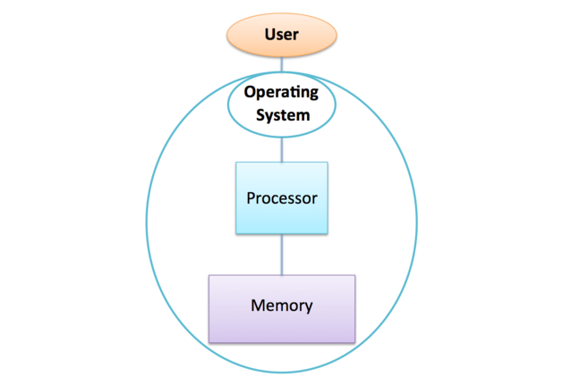

*Image courtesy of [Alexandre Debieve](https://unsplash.com/@alexkixa) from [Unsplash](https://unsplash.com)*

## Computer Basics

Before we look at how supercomputers are built, it’s worth recapping what we learned previously about how a standard home computer or laptop works.

Things have become slightly more complicated in the past decade, so for a short while let’s pretend we are back in 2005 (notable events from 2005, at least from a UK point of view, include Microsoft founder Bill Gates receiving an honorary knighthood and the BBC relaunching Dr Who after a gap of more than a quarter of a century).

In 2005, a personal computer typically had three main components:

1. A single processor for performing calculations.
1. Random Access Memory (RAM) for temporary data storage.
1. A hard disk for long-term storage of programs and files.


For our purposes, the configuration of memory is the most critical aspect, so we’ll set aside the hard disk for now.

### The Rise of Multicore Processors

For three decades leading up to 2005, Moore’s Law ensured that processors became exponentially faster, primarily due to increasing CPU clock speeds. However, around 2005, clock speed growth plateaued at around 2 GHz.

The reason was simple: the amount of electrical power required to run processors at these speeds had become so large that they were becoming too hot for the domestic market (could not be cooled by a simple fan) and too expensive to run for the commercial market (large electricity bills and expensive cooling infrastructure). So, around 2005, the application of Moore’s law changed: rather than using twice as many transistors to build a new, more complicated CPU with twice the frequency, manufacturers started to put two of the old CPUs on the same silicon chip - this is called a dual-core CPU.

The trend continued with four CPUs on a chip, then more … Generically, they are called multicore CPUs, although for very large numbers the term manycore CPU is now commonplace.

:::callout{variant="info"}
With multicore processors, terminology can be confusing. When we refer to a "processor" or "CPU," it’s not always clear whether we mean the physical chip (which houses multiple processors) or the individual processing units within.

To avoid confusion in this course:
- CPU-core refers to each individual processing unit within a chip.
- CPU or processor refers to the entire multicore chip.

So, a quad-core CPU (or quad-core processor) has four CPU-cores.
:::

We now have two complementary ways of building a parallel computer:

- Shared-memory architecture: Build a single multicore computer using a processor with dozens of CPU-cores.
- Distributed-memory architecture: Connect multiple individual computers, each with its own processor and memory, via a high-speed network.

We will now explore these approaches in detail.

:::callout{variant="discussion"}
What do you think the main differences between these two approaches are? Can you think of any advantages and/or disadvantages for both of them?
:::

---


*Image courtesy of [Kaleidico](https://unsplash.com/@kaleidico) from [Unsplash](https://unsplash.com)*

## Shared Memory Architecture

The fundamental feature of a shared-memory computer is that all the CPU-cores are connected to the same piece of memory.


This is achieved by having a memory bus that takes requests for data from multiple sources (here, each of the four separate CPU-cores) and fetches the data from a single piece of memory. The term bus apparently comes from the Latin omnibus meaning for all, indicating that it is a single resource shared by many CPU-cores.

This is the basic architecture of a modern mobile phone, laptop or desktop PC. If you buy a system with a quad core processor and 4 GBytes of RAM, each of the 4 CPU-cores will be connected to the same 4 Gbytes of RAM, and they’ll therefore have to play nicely and share the memory fairly between each other.

A good analogy here is to think of four office-mates or workers (the CPU-cores) sharing a single office (the computer) with a single whiteboard (the memory). Each worker has their own set of whiteboard pens and an eraser, but they are not allowed to talk to each other: they can only communicate by writing to and reading from the whiteboard.

Later in this module, we’ll explore strategies for leveraging this shared whiteboard to enable efficient cooperation among the workers. However, this analogy already illustrates two key limitations of this approach:

1. **memory capacity**: There is a limit to the size of the whiteboard that you can fit into an office, i.e. there is a limit to the amount of memory you can put into a single shared-memory computer;
1. **memory access speed**: imagine that there were ten people in the same office - although they can in principle all read and write to the whiteboard, there’s simply not enough room for more than around four of them to do so at the same time as they start to get in each other’s way. Although you can fill the office full of more and more workers, their productivity will stall after about 4 workers, as contention for the shared memory bus increases a bottleneck is created.

### Limitations

It turns out that memory access speed is a real issue in shared-memory machines. 
If you look at the processor diagram above, you’ll see that all the CPU-cores share the same bus: the connection between the bus and the memory becomes a bottleneck, limiting the number of CPU-cores that can efficiently utilize the shared memory.
Coupled with the fact that the variety of programs we run on supercomputers tend to read and write large quantities of data, memory access speed often becomes the primary factor limiting calculation speed, outweighing the importance of the CPU-cores' floating-point performance.

Several strategies have been developed to mitigate these challenges, but the overcrowded office analogy highlights the inherent difficulties when scaling to hundreds of thousands of CPU-cores.

:::callout{variant="discussion"}
Despite its limitations, shared memory architectures are universal in modern processors. What do you think the advantages are?

Think of owning one quad-core laptop compared to two dual-core laptops - which is more useful to you and why?
:::

---


*Image courtesy of [Oleksii Piekhov](https://unsplash.com/@opiekhov) from [Unsplash](https://unsplash.com)*

## Simple Parallel Calculation

We can investigate a very simple example of how we might use multiple CPU-cores by returning to the calculation we encountered in the first module: computing the average income of the entire world’s population.

If we’re a bit less ambitious and think about several hundred people rather than several billion, we can imagine that all the individual salaries are already written on the shared whiteboard. Let’s imagine that the whiteboard is just large enough to fit 80 individual salaries. Think about the following:

- how could four workers cooperate to add up the salaries faster than a single worker?
- using the estimates of how fast a human is from the previous module, how long would a single worker take to add up all the salaries?
- how long would 4 workers take for the same number of salaries?
- how long would 8 workers take (you can ignore the issue of overcrowding)?
- would you expect to get exactly the same answer as before?

We’ll revisit this problem in much more detail later but you know enough already to start thinking about the fundamental issues.

---


*Image courtesy of [Laura Ockel](https://unsplash.com/@viazavier) from [Unsplash](https://unsplash.com)*

## Who needs a multicore laptop?

We’ve motivated the need for many CPU-cores in terms of the need to build more powerful computers in an era when the CPU-cores themselves aren’t getting any faster. Although this argument makes sense for the world’s largest supercomputers, we now have multicore laptops and mobile phones - why do we need them?

You might think the answer is obvious: surely two CPU-cores will run my computer program twice as fast as a single CPU-core? Well, it may not be apparent until we cover how to parallelise a calculation later, but it turns out that this is not the case. It usually requires manual intervention to enable a computer program to take advantage of multiple CPU-cores. Although this is possible to do, it certainly wouldn’t have been the case back in 2005 when multicore CPUs first became commonplace.

What advantages do multicore processors offer to users running programs that don’t utilize parallel computing? Such programs, operating on a single CPU-core, are called serial programs.

### Operating Systems

As a user, you don’t directly assign programs to specific CPU-cores.
The Operating System (OS) acts as an intermediary between you and the hardware, managing access to CPU-cores, memory, and other components.
There are several common OS’s around today - e.g. Windows, macOS, Linux and Android - but they all perform the same basic function: you ask the OS to execute a program, and a component of the OS called the scheduler manages when and on which CPU-core the program is executed.



This enables even a single CPU-core machine to appear to be doing more than one thing at once - it will seem to be running dozens of programs at the same time.
What is actually happening is that the OS runs one program, say, for a hundredth of a second, then stops that program and runs another one for a hundredth of a second, etc.
Just like an animation made up of many individual frames, this gives the illusion of continuous motion.

### How the OS exploits many CPU-cores

On a shared-memory computer, the important point is that all the CPU-cores are under the control of a single OS (meaning you don’t need to buy 4 Windows licences for your quadcore laptop!). This means that your computer can genuinely run more than one program at the same time. It’s a bit more complicated for the OS - it has to decide not just which programs to run but also where to run them - but a good OS performs a juggling act to keep all the CPU-cores busy.


This means that you can run a web browser, listen to music, edit a document and run a spreadsheet all at the same time without these different programs slowing each other down. 
With shared memory, the OS can pause a program on CPU-core 1 and resume it later on CPU-core 3, as all CPU-cores can access the same shared memory. 
This allows seamless task switching.

A shared-memory computer looks like a more powerful single-core computer: it operates like a single computer because it has a single OS, which fundamentally relies on all the CPU-cores being able to access the same memory. It is this flexibility that makes multicore shared-memory systems so useful.

So, for home use, the Operating System does everything for us, running many separate programs at the same time. 
In supercomputing, the goal is to accelerate a single program rather than running multiple tasks simultaneously. 
Achieving this requires effort beyond what the OS can provide.

:::callout{variant="discussion"}
In your opinion what are the downsides of this more advanced ‘single-core computer’ approach?
:::

---

## How does your laptop use multiple CPU-cores?

::::iframe{id="kaltura_player" width="100%" height="400" src="https://cdnapisec.kaltura.com/p/2010292/sp/201029200/embedIframeJs/uiconf_id/32599141/partner_id/2010292?iframeembed=true&playerId=kaltura_player&entry_id=1_3g4n1c0n&flashvars[streamerType]=auto&amp;flashvars[localizationCode]=en&amp;flashvars[leadWithHTML5]=true&amp;flashvars[sideBarContainer.plugin]=true&amp;flashvars[sideBarContainer.position]=left&amp;flashvars[sideBarContainer.clickToClose]=true&amp;flashvars[chapters.plugin]=true&amp;flashvars[chapters.layout]=vertical&amp;flashvars[chapters.thumbnailRotator]=false&amp;flashvars[streamSelector.plugin]=true&amp;flashvars[EmbedPlayer.SpinnerTarget]=videoHolder&amp;flashvars[dualScreen.plugin]=true&amp;flashvars[Kaltura.addCrossoriginToIframe]=true&amp;&wid=1_vf0ln82e" allowfullscreen webkitallowfullscreen mozAllowFullScreen allow="autoplay *; fullscreen *; encrypted-media *" sandbox="allow-downloads allow-forms allow-same-origin allow-scripts allow-top-navigation allow-pointer-lock allow-popups allow-modals allow-orientation-lock allow-popups-to-escape-sandbox allow-presentation allow-top-navigation-by-user-activation" frameborder="0" title="Laptop_Multiple_CPU-cores_hd"}
::::

:::solution{title="Transcript"}
0:15 - This short video is just a screencast to capture a session I’m running. And it’s really just to illustrate this diagram, here. We’ve seen here that the way that a shared memory machine works is that you have a single block of memory, and multiple CPU cores connected to that memory. But I’m really interested, here in the role that the operating system plays. And we’ve seen here that the user sits outside this bubble, here, and really just asks the operating system to run programs, run applications, and it’s the operating system that schedules these programs onto the different CPU cores.

0:47 - So, I thought it would be quite nice just to take a real example, run it on my machine, and we can just see how it works in practice. So, what I’m going to have to do, is I’m going to have to close down a lot of my applications, just to make sure that I have the minimum of activity going on in the background. So, I’ll close my web browser. I’ll even turn off the networking, so we have the minimum of interference. Now, I’m running here on a Linux laptop, running Ubuntu, but you get very similar effects on any system. So, the first thing I’m going to show is, I have a performance monitor here.

1:22 - And, what we can see here, is that this monitor has different schematics for what’s going on. But we have four CPUs here– CPU one, CPU two, CPU three, and CPU four– and they’re coloured different colours. Now, although there’s nothing going on, you might wonder, why is there so much activity. This is running at about 20%. Well, that’s because the screen recording software, the screen grabbing software I’m running is actually taking up significant amounts of CPU. So, we do have some background rate there.

1:54 - So, what I’ve done, is, I’ve written a program which adds up various salaries to work out a total income. Now, what I’m doing here is, I’m actually adding up 1,000 salaries. Now, from the back of the envelope calculation we did last week, where we thought each cycle would take about a nanosecond, that means that 1,000 cycles adding up 1,000 salaries, is going to take about a millionth of a second. Now that’s clearly too short a time to measure. So, I’m actually repeating this calculation 10 million times. And if we work that out– 10 million times a millionth of a second– we expect this calculation should take about 10 seconds. That will be our back of the envelope estimate.

2:30 - And, just a quick clarification– although this says CPU one, CPU two, CPU three, CPU four, in our terminology it would be CPU-cores. I would call this a single CPU with four cores here. So, let’s just run the program, which as I said, does this calculation of adding up 1,000 salaries, repeating it 10 million times, and see what our load monitor shows us. So, I’ve run it. Very quickly we should see– yes. The blue CPU, here, is taking up the slack. Oh, but it’s quickly being replaced by the orange CPU. The orange CPU here is running 100%, and, now it’s switched to another CPU and it’s gone down to zero. So, that’s a very, very interesting graph which illustrates two things.

3:12 - First of all, that this program can only run on one CPU at a time, but– one CPU core at a time– but the operating system has decided to move it. So it started out running this program on the blue CPU, CPU four, and then it moved it to the orange CPU. But, you can see that, overall, the time was about 10 seconds, as we expected. So, that does show that the operating system does actually move these programs around. A single process, which is what this program is, can only run on one CPU core at once, but the operating system can decide to move it around.

3:47 - Now, let’s see what happens if we run three of these programs at once. So, I’ve got multiple copies of my program, income 1K. I’ll run income 1K number one, number two, and number three, I’ll run them all at once. I can run them all at once. And let’s see what the load monitor does. I’m running them. And, almost immediately, we see that the CPUs become very, very heavily loaded. Now, in fact, almost all the CPUs become heavily loaded, because although I’m only running three copies of the program, my income program, we are also running the screen grabbing software, so it’s kind of shuffled off to the final CPU.

4:19 - But, we can see there, that what happened was– there were two interesting things to note. One was, that all these CPUs were active at the same time, but also that the calculation still took about 10 seconds. So, what the operating system was able to do, was it was able to run three copies of the same program, at the same time, by putting them on different CPUs.

4:43 - So, now you might ask, what happens if I run more applications, more programs, or more processes, than there are physical CPU-cores. So, here you can see I’ve actually got six copies of the program, and I’m going to run them all at once. And let’s see what happens.

4:59 - So, you’ll see almost immediately the CPU load jumps up, and all the four CPU-cores are very, very heavily loaded. So, this looks similar to what we had before. But there’s a subtle difference– that these CPU-cores are running more than one process. Not only is the operating system scheduling processes to different CPU-cores, it’s swapping them in and out, on the same CPU-core. And, the effect of that is, the calculation no longer takes 10 seconds, it takes more than 10 seconds. Because, each of these applications, each of these processes, is having to time share on the CPU-core. And, as we see here, it takes almost twice as long. It takes about 20 seconds, which is what you might have expected.

5:35 - So, that is quite interesting, that although the CPU, the processor, can do more than one thing at once, if there are four cores, and there are more than four programs to run, it can’t run them all at the same time. It has to time slice them in and out. And the main thing, here, is that we see that processes interact with each other, they affect each other, and it slows the runtime down. So, we’re able to run three of these programs in 10 seconds, which is the same time that one of them took, but six took about 20 seconds.

6:02 - And, the reason I’m talking about three and six and not four and eight, when I have four CPU-cores, is because I’m trying to leave one of the CPU-cores free to run the screen grabbing software, which seems to be taking up about the whole of one CPU-core equivalent.
:::

This video shows a simple demo to illustrate how modern operating systems take advantage of many CPU-cores.

Watch what happens when David runs multiple copies of a simple income calculation program on his quad-core laptop. Do you find this behaviour surprising?


Note that running multiple instances of our toy program simultaneously does not save time.
Each instance runs independently, producing identical results in approximately the same duration. 
This demo illustrates how an operating system handles execution on multiple CPU-cores, but otherwise is a waste of resources.

Can you think of a situation in which this kind of execution may be useful?

We haven’t really explained what the concept of minimum interference is about - think of David closing down his browser before running his code - but can you think of a reason why it may be important to isolate your program as much as possible, especially when running on a supercomputer? What are the implications of not doing this?

If you are interested, here is the function that David actually timed. 
The function is written in C and is provided purely for reference.
It is not intended to be compiled or executed as it is.

```c
// Add up a given number of salaries to compute total income.
// Use floating-point numbers to better represent real calculations.

double salarysum(double salarylist[], int npeople)
{
  double total;
  int i;

  total = 0.0;

  for (i=0; i < npeople; i++)
    {
      total = total + salarylist[i];
    }

  return total;
}
```

David: I re-ran the same studies covered in the video but with almost all other tasks disabled , for example I did not run the graphical performance monitor, which allowed me to have access to all four CPU-cores. Here are the results.

| dataset | #copies | runtime (seconds) |
| ------- | ------- | ----------------- |
| small   | 1       | 9.7               |
| small   | 4       | 11.1              |
| small   | 8       | 22.2              |

---


*Image courtesy of [Jeswin Thomas](https://unsplash.com/@jeswinthomas) from [Unsplash](https://unsplash.com)*

## Memory Caches

We mentioned before that memory access speeds are a real issue in supercomputing, and adding more and more CPU-cores to the same memory bus just makes the contention even worse.

The standard solution is to have a memory cache. This is basically a small amount of scratch memory on every CPU-core, which is very fast. However, it is also quite small - well under a megabyte when the total memory will be more than a thousand times larger - so how can it help us?
The standard solution is to have a memory cache; a small, high-speed storage area located on each CPU-core. It allows the core to access frequently used data much faster than from main memory.
However, it is also quite small, well under a megabyte, representing less than a thousandth of the total memory.
Think of the analogy with many workers sharing an office: The obvious solution to avoid always queueing up to access the shared whiteboard is to take a temporary copy of what you are working on.
When you need to read data from the whiteboard, you copy the necessary data into your notebook and work independently, reducing contention for the shared resource.

This works very well for a single worker: you can work entirely from your personal notebook for long periods, and then transfer any updated results to the whiteboard before moving on to the next piece of work. 
It can also work very well for multiple workers as long as they only ever read data.

### Writing data

Unfortunately, real programs also write data, meaning workers need to update the shared whiteboard. If two people are working on the same data at the same time, we have a problem: if one worker changes some numbers in their notebook then the other worker needs to know about it. Whenever you alter a number, you must inform the other workers, for example: 

"I’ve just changed the entry for the 231st salary - if you have a copy of it then you’ll need to get the new value from me!"

Although this could work for a small number of workers, it clearly has problems of scalability.
Imagine 100 workers: whenever you change a number you have to let 99 other people know about it, which wastes time.
Even worse, you have to be continually listening for updates from 99 other workers instead of concentrating on doing your own calculation.

This is the fundamental dilemma: memory access is so slow that we need small, fast caches so we can access data as fast as we can process it. However, whenever we write data there is an overhead which grows with the number of CPU-cores and will eventually make everything slow down again.

This process of ensuring consistent and up-to-date data across all CPU-cores is called cache coherency, a critical challenge in multicore processor design.
It ensures we always have up-to-date values in our notebook (or, at the very least, that we know when our notebook is out of date and we must return to the whiteboard).


Keeping all the caches coherent when we write data is the major challenge.

:::callout{variant="discussion"}
What do you think is the current state-of-the-art? How many CPU-cores do high-end processors have?
:::

---

## Resource Contention

::::iframe{id="kaltura_player" width="100%" height="400" src="https://cdnapisec.kaltura.com/p/2010292/sp/201029200/embedIframeJs/uiconf_id/32599141/partner_id/2010292?iframeembed=true&playerId=kaltura_player&entry_id=1_s0oh0v7t&flashvars[streamerType]=auto&amp;flashvars[localizationCode]=en&amp;flashvars[leadWithHTML5]=true&amp;flashvars[sideBarContainer.plugin]=true&amp;flashvars[sideBarContainer.position]=left&amp;flashvars[sideBarContainer.clickToClose]=true&amp;flashvars[chapters.plugin]=true&amp;flashvars[chapters.layout]=vertical&amp;flashvars[chapters.thumbnailRotator]=false&amp;flashvars[streamSelector.plugin]=true&amp;flashvars[EmbedPlayer.SpinnerTarget]=videoHolder&amp;flashvars[dualScreen.plugin]=true&amp;flashvars[Kaltura.addCrossoriginToIframe]=true&amp;&wid=1_fhat1vsf" allowfullscreen webkitallowfullscreen mozAllowFullScreen allow="autoplay *; fullscreen *; encrypted-media *" sandbox="allow-downloads allow-forms allow-same-origin allow-scripts allow-top-navigation allow-pointer-lock allow-popups allow-modals allow-orientation-lock allow-popups-to-escape-sandbox allow-presentation allow-top-navigation-by-user-activation" frameborder="0" title="Resource_Contention_hd"}
::::

:::solution{title=Transcript}
0:12 - Although it’s a very simple program, it can show some very interesting affects. Now, our key observation, was that we could run three copies of this program in the same time as if we ran one copy. In 10 seconds, we could run three copies on three CPU-cores in the same time as we ran one copy on one CPU core. However, this week we’ve been talking about the shared-memory architecture, how one of the critical features of it is that all the CPU-cores share access to the shared memory. There’s a single memory bus that they have to go through. And so, they can affect each other, they can slow each other down. Why didn’t that happen here?

0:48 - Well, it didn’t happen here, because we were summing up a very, very small number of numbers. We were summing up 1,000 incomes. And they were able to all fit into the cache. And, if you remember, each CPU-core has its own cache. And, so, for most of the time, when they were running, these CPU-cores could run completely independently of each other. However, we can look at a different situation, where the CPU cores do have to access main memory, and they will interact with each other. Programs running on different CPU-cores will slow each other down. So, what I’ve done is, I’ve written a version of this program, which doesn’t add up 1,000 numbers, it adds up a million numbers.

1:27 - So income 1M, I’m adding up a million numbers, here. Now, what I’m doing is I’m repeating this fewer times to get a runtime of around 10 seconds. But, what we’ll do is we’ll run this calculation once, and see what happens, see what our baseline time is. So, I run one copy of this program. Remember, it’s now adding up a million numbers, a million salaries each iteration, rather than 1,000. So, there we go. And we see the same effect that suddenly one of the CPU cores is very heavily loaded, in this case, the green CPU, CPU three. And, how long is it going to run for? Well, it’s actually switched onto CPU two, and switched onto another CPU again.

2:07 - But, overall, it’s running for about– just over 10 seconds. A bit more than 10 seconds, there, it was more like, maybe about 15 seconds. I’ll maybe run it again, to try and get a cleaner run, where it doesn’t switch around so much on different CPU-cores. Crank up again it’s on the– no, it is, it’s switching them all around. We’ll try and get another estimate of how long it takes. This is a bit nicer, it’s mainly on the orange CPU-core, there.

2:35 - So, that looks like it’s taking about 15 seconds. But I said that the big difference between this calculation is because it’s reading and writing large amounts of memory– then processes running on different CPU cores will affect each other, because they will be accessing the same memory bus. So if I now run three copies of this program, I would expect that, although we’ll see the same effect but all three CPU-cores will be 100% loaded, we would expect the total runtime to increase beyond the 15 seconds. So let’s run that, and see what happens.

3:09 - And, now bang, we’re up to 100% CPU. But, unlike the case where we’re accessing small amounts of memory, which sits in cache, we expect these to contend with each other. And, you can see yes, it is taking significantly longer than 15 seconds. Although you might think, in principle, these calculations are completely independent, they’re interacting by accessing the shared memory. And it looks like, in fact, they’re completely blocking each other out.

3:43 - And there, it took about 35 seconds. So, over twice the time to do the same calculation. So, you can see it’s absolutely clear from this simple experimental result, that, even on my laptop, this shared memory bus– which mediates the memory transactions from the CPU-core to the physical memory– is not capable of sustaining all the traffic from three very, very simple programs running at once.
:::

This video shows a simple demo to illustrate what happens when multiple cores try to use the same resources at the same time.

As mentioned earlier, resource contention occurs when multiple CPU-cores attempt to access the same resources, such as memory, disk storage, or network buses.
Here we look at memory access.

Watch what happens when three copies of a larger income calculation program are running on three CPU-cores at the same time. Is this what you expected?

Keep in mind that CPU-cores are affecting each other not by exchanging data, but because they compete for the same data in memory.
In other words, the CPU-cores do not collaborate with each other i.e. they do not share the total work amongst themselves.

Please note that the larger calculation processes 100 million salaries, not 1 million as mistakenly mentioned in the video. — David

For Step 2.6, the calculations are reran with the graphical monitor turned off, allowing access to all 4 CPU-cores.
Here are the timings for this large dataset with the small dataset results included for comparison.

| dataset | #copies | runtime (seconds) |
| ------  | ------- | ----------------- |
| small   | 1       | 9.7               |
| small   | 4       | 11.1              |
| small   | 8       | 22.2              |
| large   | 1       | 10.7              |
| large   | 4       | 28.5              |
| large   | 8       | 57.0              |

---

## Terminology Quiz

::::challenge{id=pc_basics.1 title="Parallel Computers Q1"}
A system built from a single multicore processor (perhaps with a few tens of CPU-cores) is an example of the ____ ____
architecture, whereas a system composed of many separate processors connected via a high-speed network is referred to as the
____ ____ architecture.

:::solution

1) shared memory

2) distributed memory

:::
::::

::::challenge{id=pc_basics.2 title="Parallel Computers Q2"}
The two main limitations of the shared-memory architecture are: memory ____
and memory ____ ____. The hierarchical memory structure is used to improve the memory access speeds.
The smallest but also the fastest memory is called ____ memory.
And keeping the data consistent and up-to-date on all the CPU-cores is called ____ ____.

:::solution

1) capacity

2) access speed

3) cache

4) cache coherency

:::
::::

::::challenge{id=pc_basics.3 title="Parallel Computers Q3"}
The situation when multiple CPU-cores try to use the same resources, e.g. memory, disk storage or network buses, is called ____ ____.

:::solution

1) resource contention

:::
::::
