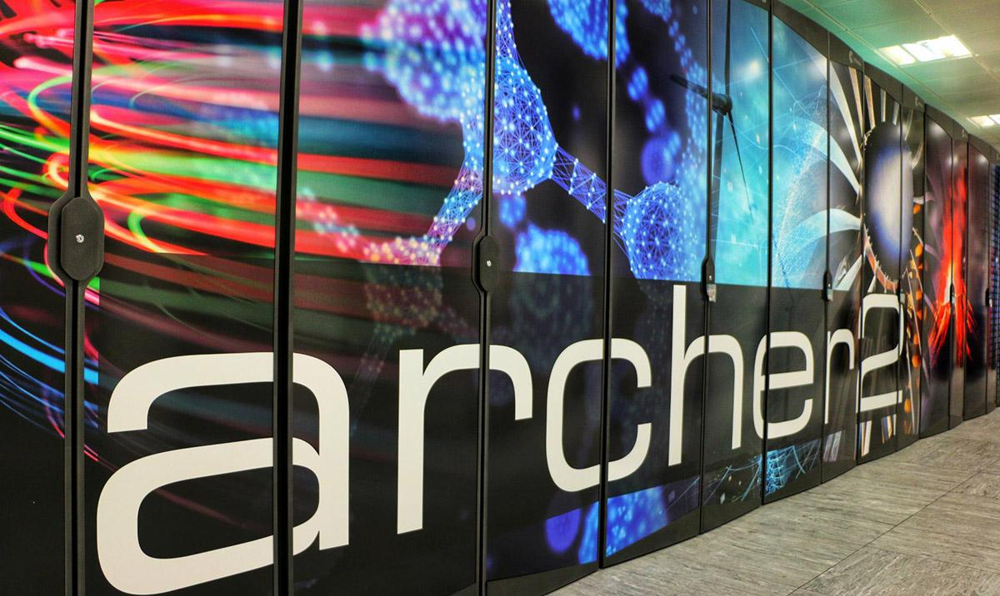
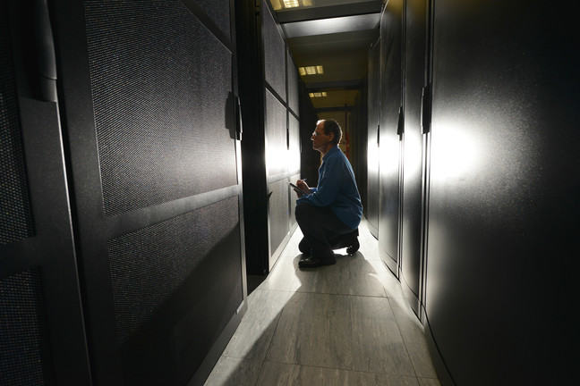
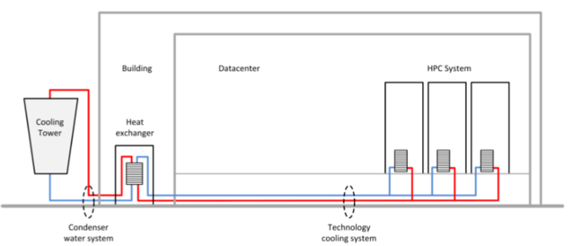
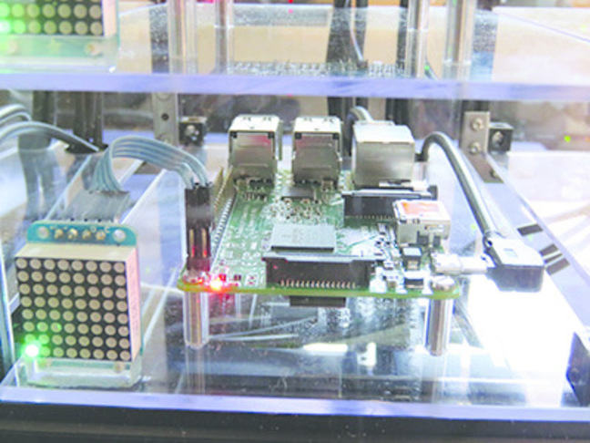
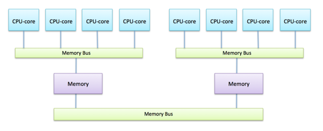

_Image courtesy of Helena Lopes from [Unsplash](https://unsplash.com)_

## Distributed Memory Architecture

Because of the difficulty of having very large numbers of CPU-cores in a single shared-memory computer, all of today’s supercomputers use the same basic approach to build a very large system: take lots of separate computers and connect them together with a fast network.

The most important points are:

- every separate computer is usually called a node
- each node has its own memory, totally separate from all the other nodes
- each node runs a separate copy of the operating system
- the only way that two nodes can interact with each other is by communication over the network.

For the moment, let’s ignore the complication that each computer is itself a shared-memory computer, and consider one processor per node.

The office analogy can be further extended: a distributed-memory parallel computer has workers all in separate offices, each with their own personal whiteboard, who can only communicate by phoning each other.

| Advantages                                                                          |
| ----------------------------------------------------------------------------------- |
| The number of whiteboards (i.e. the total memory) grows as we add more offices.     |
| There is no overcrowding so every worker has easy access to a whiteboard.           |
| We can, in principle, add as many workers as we want provided the network can cope. |

| Disadvantages                                                                                                                   |
| ------------------------------------------------------------------------------------------------------------------------------- |
| If we have large amounts of data, we have to decide how to split it up across all the different offices.                        |
| We need to have lots of separate copies of the operating system.                                                                |
| It is more difficult to communicate with each other as you cannot see each others whiteboards so you have to make a phone call. |

The second disadvantage on this list doesn’t have any direct cost implications as almost all supercomputers use some version of the Linux OS which is free but, it does mean thousands of copies of the OS, or other installed software, need to be upgraded when updates are required.

Building networks to connect many computers is significantly easier than designing shared-memory computers with a large number of CPU-cores.
This means it is relatively straightforward to build very large supercomputers - it remains an engineering challenge, one that computer engineers excel at solving.

So, if building a large distributed-memory supercomputer is relatively straightforward then we’ve cracked the problem?

Well, unfortunately not. The compromises we make (many separate computers each with their own private memory) mean that the difficulties are now transferred to the software side.
Having built a supercomputer, we now have to write a program that can take advantage of all those thousands of CPU-cores.
This can be quite challenging in the distributed-memory model.

:::callout{variant="discussion"}
Why do you think the distributed memory architecture is common in supercomputing but is not used in your laptop?
:::

---

_Image courtesy of [iSawRed](https://unsplash.com/@isawred) from [Unsplash](https://unsplash.com)_

## Simple Parallel Calculation

Let’s return to the income calculation example. This time we’ll be a bit more ambitious and try and add up 800 salaries rather than 80.
The salaries are spread across 8 whiteboards (100 on each), all in separate offices

Here we are exploiting the fact that distributed-memory architectures allow us to have a large amount of memory.

If we have one worker per office, think about how you could get them all to cooperate to add up all the salaries. Consider two cases:

- only one boss worker needs to know the final result;
- all the workers need to know the final result.

To minimise the communication-related costs, try to make as few phone calls as possible.

---

_© ARCHER2_

## Case study of a real machine

To reinforce the concepts we have introduced in this course, we’ll now look at a specific supercomputer, the UK National Supercomputer, ARCHER2, as a concrete example.
This machine has a relatively straightforward construction and is therefore a good illustration of supercomputer hardware in general.

### General

Archer2 is a HPE Cray EX machine, built by American supercomputer company Cray, a Hewlett Packard Enterprises company. It contains 750,080 CPU-cores and has a theoretical performance of 28 Pflop/s. It is operated by EPCC at the University of Edinburgh on behalf of EPSRC and NERC, and is the major HPC resource for UK research in engineering and in physical and environmental science.

### Node design

The basic processor used in ARCHER2 is the AMD Zen2 (Rome) EPYC 7742 CPU, which has a clock speed of 2.25 Ghz . The nodes on ARCHER2 have 128 cores across two of the AMD processors. All the cores are under the control of a single operating system. The OS is the HPE Cray Linux Environment, which is a specialised version of SUSE Linux.

### Network

The complete ARCHER2 system contains 5,860 nodes, i.e. ARCHER2 is effectively 6,000 seperate computers each running their own copy of Linux. They are connected by the HPE Slingshot interconnect, which has a complicated hierarchical structure specifically designed for supercomputing applications. Each node has two 100 Gb/s network connections, this means each node has a network bandwidth 2048 times faster than what is possible over a 100 Mb/s fast broadband connection!

### System performance

ARCHER2 has a total of 750,080 CPU-cores: 5,860 nodes each with 128 CPU-cores. With a Clock frequency of 2.25 Ghz, the CPU-cores can execute 2.25 billion instructions per second. However, on a modern processor, a single instruction can perform more than one floating-point operation.

For example, on ARCHER2 one instruction can perform up to four separate additions. In fact, the cores have separate units for doing additions and for doing multiplications that run in parallel. With the wind in the right direction and everything going to plan, a core can therefore perform 16 floating-point operations per cycle: eight additions and eight multiplications.

This gives a peak performance of 750,080 \* 2.25 \* 16 Gflop/s = 27,002,880 Glop/s, agreeing with the 25.8 Pflop/s figure in the top500 list.

ARCHER2 comprises 23 separate cabinets, each about the height and width of a standard door, with around 32,768 CPU-cores (256 nodes) or about 60,000 virtual cores (using multi-threading) in each cabinet.

_© EPCC_

### Storage

Most of the ARCHER2 nodes have 256 GByte of memory (some have 512 GByte), giving a total memory in excess of 1.5 PByte of RAM.

Disk storage systems are quite complicated, but they follow the same basic approach as supercomputers themselves: connect many standard units together to create a much more powerful parallel system. ARCHER2 has over a 15 PByte of Disk storage.

### Power and Cooling

If all the CPU-cores are fully loaded, ARCHER2 requires in excess of 4 Megawatts of power, roughly equivalent to the average consumption of around 4000 houses.
This is a significant amount of power to mitigate the associated environmental impact, ARCHER2 is supplied by a 100% renewable energy contract.

The ARCHER2 cabinets are cooled by water flowing through pipes, with water entering at 18°C and exiting at 29°C.
The heated water is then cooled and re-circulated.
When necessary the water is cooled by electrical chillers but, most of the time, ARCHER2 can take advantage of the mild Scottish climate and cool the water for free simply by pumping it through external cooling towers, so saving significant amounts of energy.

_© Mike Brown_

_ARCHER’s cooling towers © Mike Brown_

---

## Wee ARCHIE case study

::::iframe{id="kaltura*player" width="100%" height="400" src="https://cdnapisec.kaltura.com/p/2010292/sp/201029200/embedIframeJs/uiconf_id/32599141/partner_id/2010292?iframeembed=true&playerId=kaltura_player&entry_id=1_guapr85q&flashvars[streamerType]=auto&amp;flashvars[localizationCode]=en&amp;flashvars[leadWithHTML5]=true&amp;flashvars[sideBarContainer.plugin]=true&amp;flashvars[sideBarContainer.position]=left&amp;flashvars[sideBarContainer.clickToClose]=true&amp;flashvars[chapters.plugin]=true&amp;flashvars[chapters.layout]=vertical&amp;flashvars[chapters.thumbnailRotator]=false&amp;flashvars[streamSelector.plugin]=true&amp;flashvars[EmbedPlayer.SpinnerTarget]=videoHolder&amp;flashvars[dualScreen.plugin]=true&amp;flashvars[Kaltura.addCrossoriginToIframe]=true&amp;&wid=1_0dan4ubd" allowfullscreen webkitallowfullscreen mozAllowFullScreen allow="autoplay *; fullscreen \_; encrypted-media \*" sandbox="allow-downloads allow-forms allow-same-origin allow-scripts allow-top-navigation allow-pointer-lock allow-popups allow-modals allow-orientation-lock allow-popups-to-escape-sandbox allow-presentation allow-top-navigation-by-user-activation" frameborder="0" title="Wee_Archie_case_study_hd"}
::::

:::solution{title="Transcript"}
0:11 - So in this video we’re going to talk about Wee ARCHIE. So you’ve already seen a promotional video about Wee ARCHIE, but here we’re going to go into a bit more technical detail. Now Wee ARCHIE is a machine that we’ve built at EPCC specifically for outreach events to illustrate how parallel computing, supercomputing works. And what we do is we take it to conferences and workshops and schools to try and explain the basic concepts. But here I’m going to use it as a way of explaining the kinds of things we’ve been learning this week, which is things like distributed memory computing, shared memory computing, and how they’re put together into a real computer.

0:43 - Wee ARCHIE has been built to mirror the way a real supercomputer like ARCHER, our national supercomputer, is built, but it’s a smaller version and it’s also been designed with a perspex case and designed in a way that we can look inside and show you what’s going on. So it’s very useful to illustrate the kinds of concepts that we’ve been talking about this week. So the ways in which Wee ARCHIE mirrors a real supercomputer like ARCHER are that is a distributed memory computer. It comprises a whole bunch of nodes that are connected by a network and we’ll look at them in a bit more detail later on.

1:16 - Each of the nodes is a small shared-memory computer, each of which is running its own copy of the operating system and in this, just like in ARCHER, we’re running lots of copies of Linux. On Wee ARCHIE, we don’t use very high spec processes. That’s for reasons of economy and power consumption. So on Wee ARCHIE, each of the nodes is actually one of these Raspberry Pis. Now, a Raspberry Pi is a very low power and quite cheap processor, and these ones are actually small shared-memory machines. So each Raspberry Pi has actually got four cores on it. It’s a small quad-core, multi-processor machine, a small-shared memory system, running a single copy of Linux.

1:57 - Now we can look in more detail at how Wee ARCHIE is constructed. So if we look down here, are the computational nodes which is a four by four grid here. We have 16 Raspberry Pi boards, each of which, as I said, is running its own copy of Linux, and each of which is a small shared-memory processor with four CPU-cores. See here they are, 1, 2, 3, 4, 5, 6, 7, 8, 9, 10, 11, 12, 13, 14, 15, 16. Again, just like on a real supercomputer, users don’t log onto these computational nodes, they log onto some front-end login system. And up here we have a couple of spare nodes.

2:31 - Hardware-wise, they’re just the same as the main computational nodes, but they’re reserved for the user to log on and do various other activities, compiling code, launching programs, and doing I/O and such like. So again this is a nice analogue of how a real parallel supercomputer works. Just to look in a bit more detail at the nodes of Wee ARCHIE. You will see there are some lights here. And what we’ve done for demonstration purposes is each node of Wee ARCHIE is connected to its own little LED array. You won’t see particularly much going on at the moment, because we aren’t actually running programs on these nodes.

3:01 - Just for information, what they display are things like the network activity on the node, the temperature of the node, and also the activity, how busy each of the four CPU-cores is. The way the networking works on Wee ARCHIE is that each node has a cable coming out of it, a network cable, and here we just use quite standard cheap networking. It’s called ethernet cabling. It’s the kind of thing you might have at home or in an office. And the cables come out and they connect to these switches here.

3:30 - So the way that two nodes on Wee ARCHIE communicate with each other is, if they want to send a message, it goes down the cables into one of the switches and then back up the other cable into the other node. Now we’ve turned Wee ARCHIE around to look at the back to illustrate a bit more how the networking works and a bit more about how it’s all connected together. So if you can see, there are actually two cables coming out of the computational nodes. One of those is actually power, so we’re not particularly concerned about that. The other connection is a network cable.

3:59 - So the way it works, is that the cables for each node come down into one of these switches. And then the switches themselves, are cabled together. And this illustrates, in quite a simple way, how these networks are hierarchical. So for example, two cores on the same node, two CPU-cores in the same shared-memory processor can communicate with each other without going over the network at all. If two nodes are connected to the same switch, they can communicate with each other by sending the signal down and then back out of the same switch.

4:31 - If two nodes are connected to different switches, the message has to go down into one of the switches along to the other switch and then back to the node again. So I mentioned in the articles that the network on ARCHER, the Cray Aries network, is very complicated, has lots of different levels. But even on a very simple machine like Wee ARCHIE, you can see the network has a hierarchical structure. And so that the way that two CPU-cores communicate with each other is different depending on where they are in the machine. Although it’s been primary built as an educational tool, in fact, Wee Archie has a lot of similarities, as I said, with a real supercomputer.

5:06 - And just to reiterate, they’re things like having a distributed-memory architecture of different nodes, each running their own operating system. The nodes are connected by networking. And each node is actualy a small shared-memory computer. The main way in which Wee ARCHIE differs from a real supercomputer, like ARCHER, is really in some of the performance characteristics. So for example, the processors aren’t as fast as you’d find on a real supercomputer, the networking isn’t as fast. The ethernet we have here is a lot slower than the dedicated Aries network we have on ARCHER. And also, of course, the sheer scale.

5:41 - Here we only have 16 nodes, each of which has four CPU-cores, as opposed to thousands of nodes with tens of CPU-cores in them. And so Wee ARCHIE mirrors a real supercomputer such as ARCHER in almost every way, except for just the speed and the scale.
:::

Finally, Wee ARCHIE makes its appearance again! This video uses Wee ARCHIE to explain the parallel computer architecture concepts we've introduced.

:::callout(variant="discussion")
It is worth emphasising that the physical distance between the nodes does impact their communication time i.e. the further apart they are the longer it takes to send a message between them. Can you think of any reason why this behaviour may be problematic on large machines and any possible workarounds?

As usual, share your thought with your fellow learners!
:::

For anyone interested in how Wee ARCHIE has been put together (and possibly wanting to build their own cluster), we invite you to follow the links from this blog article - Setting up your own Raspberry Pi cluster.

---

_Image courtesy of [Timo Volz](https://unsplash.com/@magict1911) from [Unsplash](https://unsplash.com)_

## ARCHER2 - it's more complicated

In the last few steps we have glossed over a few details of the processors and the network.

If you look up the specifications of the AMD Zen2 (Rome) EPYC 7742 processor you will see that it has 64 CPU-cores, whereas the ARCHER2 nodes have 128 CPU-cores.
Each node contains two physical processors, configured to share the same memory. This design makes the system appear as a single 128-core processor to the user.
This setup, known as Non-Uniform Memory Access (NUMA) architecture, is illustrated below.

Every CPU-core can access all the memory regardless of which processor it is located on but, reading data from another CPU’s memory can involve going through an additional memory bus, making the process slower than reading from its own memory.
Although this hardware arrangement introduces technical complexities, the key point is that the 128 CPU-cores function as a single shared-memory system, managed by one operating system.

The details of the network are even more complicated with four separate levels ranging from direct connections between the nodes packaged together on the same blade, up to fibre-optic connections between separate cabinets. If you are interested in the details see the ARCHER2 website.

---

## ARCHER2: building a real supercomputer

::::iframe{width="100%" height="400" src="https://www.youtube.com/embed/UXHE7ljmhaQ" title="YouTube video player" frameborder="0" allow="accelerometer; autoplay; clipboard-write; encrypted-media; gyroscope; picture-in-picture" allowfullscreen}
::::

Wee ARCHIE is very small and was built on someone’s desk. Real supercomputers are very large and require a lot of infrastructure to support them and manpower to build them.

This time lapse video documents the installation of the ARCHER2 system at EPCC in Edinburgh, UK. We use it to pick out various aspects of supercomputer hardware that are not so well illustrated by Wee ARCHIE.

:::callout{variant="discussion"}
Is there anything that surprised you? We are curious to know so feel free share your impressions by leaving a comment.
:::

---

## Quiz - Processors, ARCHER2 and Wee ARCHIE

::::challenge{id=pc_connecting.1 title="Connecting Parallel Computers Q1"}
Which of these are true about a typical processor in a modern supercomputer?

Select all the answers you think are correct.

A) it contains a single CPU-core

B) it contains many separate CPU-cores

C) it is a special processor, custom-designed for supercomputing

D) it is basically the same processor you would find in a high-end PC or compute server

:::solution
A) and C)

That’s right - today almost all processors have multiple CPU-cores.

Correct - the leading-edge CPU designs of today are those produced for general-purpose computing because the massive market for home and business computing means that billions of dollars can be invested in R&D.
:::
::::

::::challenge{id=pc_connecting.2 title="Connecting Parallel Computers Q2"}
How are the CPU-cores attached to the memory in a modern multicore processor?

Select all the answers you think are correct.

A) the memory is physically sliced up between them

B) the memory is shared between all the CPU-cores

C) cores share access to the memory so they can sometimes slow each other down

D) each core can access the memory completely unaffected by the other cores

:::solution
B) and C)

The distinction between shared and distributed memory is one of the most fundamental concepts in parallel computer architecture

Yes - a modern multicore processor is a small shared-memory parallel computer

Yes - you’ve correctly identified one of the challenges of shared memory: contention for a single shared memory bus
:::
::::

::::challenge{id=pc_connecting.3 title="Connecting Parallel Computers Q3"}
Like almost all supercomputers, ARCHER2 is constructed as a series of separate cabinets (23 in the case of ARCHER2), each standing about as high and wide as a standard door. Why do you think this size of cabinet is chosen?

A) it is the minimum size that can be cooled effectively

B) it is the maximum size that can be run from a single power supply

C) any larger and the cabinets would not fit through the doors of the computer room

D) freight companies will not ship anything larger than this

:::solution
C)

Even high-tech supercomputing is influenced by everyday issues!

Spot on! It’s the age-old problem of trying to get a grand piano into a high-rise apartment - if it’s too big or heavy to fit through the door then things get really complicated
:::
::::

::::challenge{id=pc_connecting.4 title="Connecting Parallel Computers Q4"}
How are ARCHER2’s 750,080 cores arranged?

A) as one large shared-memory system

B) as 750,080 separate nodes

C) as 5,860 nodes each with 128 cores

D) as 11,720 nodes each with 64 cores

:::solution
C)

It is essential to understand the way of shared and distributed memory computing are combined in a single supercomputer - this is now universal across every system.

That’s correct - although the numbers will vary from system to system, a modern supercomputer comprises thousands of nodes each with many CPU-cores.
:::
::::

::::challenge{id=pc_connecting.5 title="Connecting Parallel Computers Q5"}
Which of these features make the UK national Supercomputer ARCHER2 different from the toy system Wee ARCHIE?

Select all the answers you think are correct.

A) it has multicore CPUs

B) it has multiple nodes connected by a network

C) it runs the Linux operating system

D) it has a much faster network

E) it has many more CPU-cores

:::solution
D) and E)

Wee ARCHIE is dwarfed in practice by a real supercomputer such as ARCHER, but how different are they in principle? Is a formula-1 racing car fundamentally different from a Volkswagen Beetle?

Correct - we spend money on very fast supercomputer networks to ensure the minimum of delay when different nodes to communicate with each other

That’s right - ARCHER2 has almost 13000 times as many CPU-cores as Wee ARCHIE so it is built on a much larger scale
:::
::::
