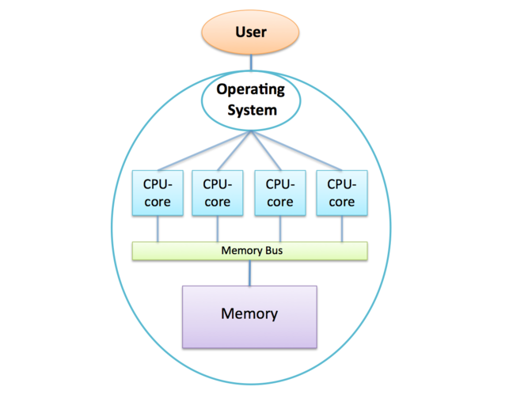
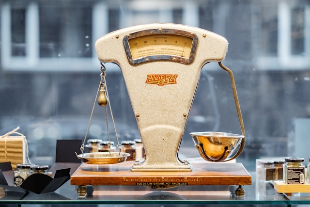

# Comparing the two approaches

## Looking inside your laptop

::::iframe{id="kaltura_player" width="100%" height="400" src="https://cdnapisec.kaltura.com/p/2010292/sp/201029200/embedIframeJs/uiconf_id/32599141/partner_id/2010292?iframeembed=true&playerId=kaltura_player&entry_id=1_n0hr4o3o&flashvars[streamerType]=auto&amp;flashvars[localizationCode]=en&amp;flashvars[leadWithHTML5]=true&amp;flashvars[sideBarContainer.plugin]=true&amp;flashvars[sideBarContainer.position]=left&amp;flashvars[sideBarContainer.clickToClose]=true&amp;flashvars[chapters.plugin]=true&amp;flashvars[chapters.layout]=vertical&amp;flashvars[chapters.thumbnailRotator]=false&amp;flashvars[streamSelector.plugin]=true&amp;flashvars[EmbedPlayer.SpinnerTarget]=videoHolder&amp;flashvars[dualScreen.plugin]=true&amp;flashvars[Kaltura.addCrossoriginToIframe]=true&amp;&wid=1_jmzabt32" allowfullscreen webkitallowfullscreen mozAllowFullScreen allow="autoplay *; fullscreen *; encrypted-media *" sandbox="allow-downloads allow-forms allow-same-origin allow-scripts allow-top-navigation allow-pointer-lock allow-popups allow-modals allow-orientation-lock allow-popups-to-escape-sandbox allow-presentation allow-top-navigation-by-user-activation" frameborder="0" title="Inside_your_laptop_hd"}
::::

:::solution{title="Transcript"}
0:11 - One of the things we’ve tried to emphasise when discussing supercomputer hardware is the way that supercomputers are very much built from commodity standard components– fairly standard– reasonably high end– but fairly standard processors and memory, but very large numbers of them. And so a supercomputer gets its power from having very large numbers of CPU-cores. However, it’s clear that the way that a supercomputer is packaged and put together must be very different from the way a commodity item, like a laptop, is put together.

0:39 - So what I’m going to do in this video is to deconstruct a laptop and also show you the inside of a board from a real supercomputer, and try to compare them so you can see what the similarities and differences between them are. So what I have here is a fairly standard laptop from the mid to late 2000s. And I’m going to take it apart, deconstruct it, to show you how it’s put together and kind of contrast the pieces that make up a standard laptop with a board from a supercomputer. So I would advise you, don’t do this at home, because it will destroy your laptop. But I’ve done this with a fairly old machines, so hopefully it’s OK!

1:12 - So the first thing is we don’t need the screen, OK? We’re not going to need the screen, so we can discard the screen. Secondly, we would not need the keyboard, OK? We don’t log into each node on a supercomputer and then type away, so we don’t need the keyboard. There’s some other packaging here. And we’re not going to need the battery.

1:33 - So we’re just left with the bare board here which has to all the components on it. Now we can see the components we’re going to need to retain for a supercomputer, which basically– the processor in the middle here, this is a Dual-Core Intel Processor. And actually there’s memory here as well. And the memory is actually on the other side if we turn this over– a little card here, which contains the memory. Well we can even see on the back here, there are components we really are not going to need when we have a supercomputer. There’s a wireless card interface here. There’s a disk here.

1:59 - Now the nodes on a supercomputer tend to be diskless, and there’s connectors here for other peripherals. We’re not need them when we put this into a supercomputer. So going back to the front again, I’ve pointed out the CPU and the memory, but there’s a whole array of other components here, which are all to do with what you need to do on a laptop. You need to drive the disk. You need to drive the screen. You need to drive the keyboard. There’s a touch pad here, and there will be things like Bluetooth and all the other peripherals, which you need to connect to a laptop. None of that circuitry is going to be required when we put this into a supercomputer.

2:32 - So hopefully, you can see– that although, we have the things we are going to need, the CPU and memory– there’s clearly a whole lot of other stuff going on here, which we’re not going to need when packing this up into a supercomputer.
:::

We’ve explained that the hardware building blocks of supercomputers, memory and processors, are the same as for general-purpose computers.

But ARCHER looks very different from your laptop!
In this video David deconstructs a laptop so that we can compare its packaging to the specialist design of a supercomputer.

---

## How similar is your laptop to a node of a supercomputer?

::::iframe{id="kaltura_player" width="100%" height="400" src="https://cdnapisec.kaltura.com/p/2010292/sp/201029200/embedIframeJs/uiconf_id/32599141/partner_id/2010292?iframeembed=true&playerId=kaltura_player&entry_id=1_6cbiby53&flashvars[streamerType]=auto&amp;flashvars[localizationCode]=en&amp;flashvars[leadWithHTML5]=true&amp;flashvars[sideBarContainer.plugin]=true&amp;flashvars[sideBarContainer.position]=left&amp;flashvars[sideBarContainer.clickToClose]=true&amp;flashvars[chapters.plugin]=true&amp;flashvars[chapters.layout]=vertical&amp;flashvars[chapters.thumbnailRotator]=false&amp;flashvars[streamSelector.plugin]=true&amp;flashvars[EmbedPlayer.SpinnerTarget]=videoHolder&amp;flashvars[dualScreen.plugin]=true&amp;flashvars[Kaltura.addCrossoriginToIframe]=true&amp;&wid=1_izkgvgep" allowfullscreen webkitallowfullscreen mozAllowFullScreen allow="autoplay *; fullscreen *; encrypted-media *" sandbox="allow-downloads allow-forms allow-same-origin allow-scripts allow-top-navigation allow-pointer-lock allow-popups allow-modals allow-orientation-lock allow-popups-to-escape-sandbox allow-presentation allow-top-navigation-by-user-activation" frameborder="0" title="Laptop_V_node_hd"}
::::

:::solution{title="Transcript"}
0:11 - Having looked at the hardware that makes up a standard laptop, we’re now going to look at the equivalent hardware for a supercomputer. So this board comes from HECToR, which was actually the predecessor to ARCHER. HECToR was the UK National Supercomputer Service prior to the ARCHER Service starting. And this actually comes from a machine called a Cray XT4. So again, it’s a very similar architecture to the current ARCHER system. Just to explain some terminology, this is called a blade. which is quite heavy, quite difficult to lift up and down. And this is the unit to be inserted into the rack, into the cabinet. So you’ve seen in a typical supercomputer like ARCHER.

0:45 - We have these large cabinets about the size of a door and they have racks in them. And this is the unit which we insert into the rack which contains the processors. So I’m going to take the top off and we’re going to look at what it contains inside.

1:00 - So immediately, when we take the lid off, we can see it’s much more stripped down than inside your laptop. Only the essential components have been retained. So what we have here on this single blade is we actually have four nodes, one, two, three, four. And each of these, as we’ve described, will be running its own copy of the operating system. So a single blade effectively contains four separate computers. Of course, they’re linked through a network, but they’re all running their own copy of the operating system. Here you can see the processor. It’s a very standard AMD processor from the late 2000s, and it’s actually a quad-core processor. This actually has four CPU-cores on it.

1:39 - But the reason this node looks different from these other nodes is, we’ve taken off these heat sinks. The nodes are covered with these copper heat sinks to try and dissipate all the heat away. And the way that works is very different from on your laptop. Your laptop will have a small internal fan which will blow air through it. There’s no fan on this board. What happens is, externally there are large fans to blow air through the board to cool it. And these are very densely stacked, so you have to blow a lot of air through to keep them cool. You want the air to flow through very nicely.

2:09 - So you’ll see, for example here, this is a small baffle on the left to try and direct the air towards the core components. And it’s these nodes, these CPUs, which get very hot. And you maybe can’t see, but there are lots and lots of thin blades of copper here, which will get hot. And then the heat would be taken away by the air flowing through. So this blade, this board, is very, very stripped down compared to a laptop. The only additional things on this board, other than the CPUs are the memory. So you see with each node there’s a little memory card that’s attached here. Local - The memory here is local to each of the nodes.

2:43 - So as we described, the four cores on this quad-core node share all the memory, but the memory on distinct nodes is separate. You also need a network to connect all the nodes together. And that’s actually what these components here are. We haven’t removed the heat sinks, so you can’t really see them. But this is the networking technology here. The only other component of any interest on this board is this little controller here. And this is the master controller, which controls the operation of these other components. We’ve talked about the network. And you might ask, how are these physically connected together? Well, all the connections for the entire blade come in to all these pins down the side here.

3:22 - So all the traffic, all the data going in and out of the board will come in through cables connected to these ports here. So in conclusion, although the core components of this supercomputing blade, which are the processor and the memory, are just the same as we saw on the laptop, there are two main differences. First of all, this is much simpler. It’s been very much stripped back. And all the extra pieces we had in the laptop to do with driving the disk and the mouse and the Bluetooth and the screen have been taken away. So it’s much more simple. Because of that, we can actually pack things together much more densely.

3:58 - And here we have four complete computers all on the one board. And we’re able to do that because we can blow air through, with the external fans, to keep the whole thing cool. We can pack things much more densely than we could in the laptop. And so this entire setup has been designed specifically for the kind of things which supercomputers do, for doing numerical computations.
:::

Next, in this video, David takes apart a compute blade from the [HECToR](http://www.hector.ac.uk/) supercomputer.

Do you remember this diagram?

Having watched the above video, how would you modify it to make it more accurate?

*© Cray Inc*

*HECToR's compute blades*

---

*Image courtesy of [Piret Llver](https://unsplash.com/@saltsup) from [Unsplash](https://unsplash.com)*

## Shared memory vs Distributed memory

We’ve seen how individual CPU-cores can be put together to form large parallel machines in two fundamentally different ways: the shared and distributed memory architectures.

In the shared-memory architecture all the CPU-cores can access the same memory and are all controlled by a single operating system. Modern processors are all multicore processors, with many CPU-cores manufactured together on the same physical silicon chip.

There are limitations to the shared-memory approach due to all the CPU-cores competing for access to memory over a shared bus.
This can be alleviated to some extent by introducing memory caches or putting several processors together in a NUMA architecture, but there is no way to reach the hundreds of thousands of CPU-cores with this approach.

In the distributed-memory architecture, we take many multicore computers and connect them together in a network.
With a sufficiently fast network we can in principle extend this approach to millions of CPU-cores and beyond.

Shared-memory systems are difficult to build but easy to use, and are ideal for laptops and desktops.

Distributed-memory systems are easier to build but harder to use, comprising many shared-memory computers each with their own operating system and their own separate memory.
However, this is the only feasible architecture for constructing a modern supercomputer.

:::callout(variant="discussion")
These are the two architectures used today. Do you think there is any alternative? Will we keep using them for evermore?
:::

---

*Image courtesy of [Julian Hochgesang](https://unsplash.com/@julianhochgesang) from [Unsplash](https://unsplash.com)*

## What limits the speed of a supercomputer?

When we talked about how fast modern processors are, we concentrated on the clock frequency (nowadays measured in GHz, i.e. in billions of operations per second) which grew exponentially with Moore’s law until around 2005.

However, with modern distributed-memory supercomputers, two additional factors become critical:

- CPU-cores are packaged together into shared-memory multicore nodes, so the performance of memory is important to us;
- separate nodes communicate over a network, so network performance is also important.

### Latency and bandwidth

Understanding memory and network performance is useful in order to grasp the practical limitations of supercomputing.
We’ll use the ARCHER system to give us some typical values of the two basic measures.
Latency and bandwidth:

- **latency** is the minimum time required to initiate a data transfer, such as transferring a single byte. This overhead is incurred regardless of the amount of data being handled.
- **bandwidth** is the rate at which large amounts of data can be transferred.

A helpful analogy is to compare this to an escalator.
The time it takes a single person to travel from the bottom to the top is its latency — around 10 seconds for one trip.
However this does not mean the escalator can only transport one person every ten seconds, the escalator can accommodate multiple people simultaneously, allowing several people to reach the top each second.
This is its bandwidth.

### Numbers from ARCHER2

For access to memory (not cache! - access to cache is faster), the latency (delay between asking for a byte of data and reading it) is around 80 nanoseconds (80 x 10-9 or 80 billionths of a second). On ARCHER2, each node has a bandwidth of around 200 GBytes/second.

These figures might sound impressive, but remember that at a clock speed of around 2.7 GHz, each CPU-core is issuing instructions roughly every 0.4 nanoseconds, so waiting for data from memory takes the equivalent of around 200 instructions!

Remember also that, on ARCHER2, 128 CPU-cores are sharing access to memory so this latency can only increase due to congestion on the memory bus.
Bandwidth is also shared, giving each CPU-core just over 3 GBytes/second on average.
At a 2.7 GHz clock frequency, this implies that, in the worst-case scenario where all CPU-cores access memory simultaneously, each core can read or write just one byte per cycle.

A simple operation such as a = b + c processes 24 bytes of memory (read a and b, write c, each floating-point number occupying 8 bytes) so we are a long way off being able to supply the CPU-core with data at the rate it requires.

In practice, cache memory significantly mitigates these issues by providing much lower latency and higher bandwidth but back-of-the-envelope calculations, such as we have done above, do illustrate an important point about supercomputer design:

The performance of the processors in a modern supercomputer is limited by the memory bandwidth and not the clock frequency.

### Interconnect Archer2

ARCHER2 has a very high-performance network with the following characteristics:

- a latency of around 2 microseconds (2 x 10-6 or 2 millionths of a second);
- a bandwidth between 2 nodes of around 25 GBytes/second.

With a latency of 2 microseconds corresponding to approximately 5000 instruction cycles, even ARCHER2's high-speed network introduces a significant overhead for communication.
While the bandwidth is shared among all CPU-cores on a node, ARCHER2's thousands of separate network links collectively enable the transfer of many TBytes/second.

We will see in the next module that if we are careful about how we split our calculation up amongst all the CPU-cores we can accommodate these overheads to a certain extent, enabling real programs to run effectively on tens of thousands of cores. Despite this, it is still true that:

**The maximum useful size of a modern supercomputer is limited by the performance of the network.**

:::callout{variant="discussion"}
Large internet companies like Amazon and Google also use distributed memory architectures for their computational needs. They also offer access to their machines via something known as cloud computing. Do you think Amazon and Google services have the same requirements as we do in supercomputing? What limits the performance of their computers? Are they interested in Pflops?
:::

---

*Image courtesy of [Florian Olivo](https://unsplash.com/@florianolv) from [Unsplash](https://unsplash.com)*

## Graphics Processors

When looking at the top500 list, you may have noticed that many of the world’s largest supercomputers use some kind of accelerator in addition to standard CPUs.
A popular accelerator is a General Purpose Graphics Processing Unit, or GPGPU.
Since we have sen how a modern multicore CPU works, we can also begin to understand the design of a GPGPU.

Supercomputers have traditionally relied on general-purpose components, primarily multicore CPUs, driven by commercial demand for desktop and business computing.
However, computer gaming also significant market where processor performance is critical.

The massive demand for computer games hardware has driven the development of specialized processors - Graphics Processing Units (GPUs) — designed to produce high-quality 3D graphics.
Although complex in design, a GPU can be thought of as a specialized multicore processor with a vast number of simplified cores.
The cores can be simplified because they have been designed for a single purpose: 3D graphics.
To render high-quality graphics at dozens of frames per second, GPUs require the ability to process massive amounts of data.
To achieve this, they utilize specialised memory with significantly higher bandwidth than the memory typically used by CPUs.

The simplified nature of each core, the much higher number of cores, and the high memory bandwidth means that the performance, in terms of pure number crunching, of a single GPU can easily outstrip that of a CPU at the expense of it being less adaptable.

### Accelerated supercomputers

Despite being developed for a different purpose, GPUs are highly suited for supercomputing: The calculations required for 3D graphics are very similar to those required for scientific simulations - large numbers of simple operations on huge quantities of floating-point numbers.

- designed for very fast floating-point calculation;
- power-efficient due to the simple core design;
- high memory bandwidth to keep the computational cores supplied with data.

The inherently parallel architecture of GPUs, with thousands of computational cores, aligns well with the decades-long focus on parallel processing in supercomputing.

Using GPUs for applications other than graphics is called General Purpose or GPGPU computing. With a relatively small amount of additional development effort, GPU manufacturers produce versions of their processors for the general purpose market.
The supercomputing community directly benefits from the multi-billion pound research and development investments in the games market.

Programming a GPGPU isn’t quite as straightforward as a CPU, and not all applications are suitable for its specialised architecture, but one of the main areas of research in supercomputing at the moment is making GPGPUs easier to program for supercomputing applications.

:::callout{variant="discussion"}
Earlier we asked you to look at Piz Daint, which is accelerated compared to ARCHER2 by the addition of Nvidia’s GPGPUs. Use the sublist generator on the top500 page to check how many top500 systems use Nvidia accelerators. Do you see what you expected to see?
:::

---

## terminology Recap

::::challenge{id=pc_comparison.1 title="Comparing the Two Approaches Q1"}
One of the differences between the shared and distributed memory architectures is that shared-memory systems are managed by only one
____ ____, whereas distributed memory systems have many of them (typically one per node).

:::solution
operating system
:::
::::

::::challenge{id=pc_comparison.2 title="Comparing the Two Approaches Q2"}
The two basic measures characterising the memory and network performance are: ____
and ____ .
____ is the rate at which you transfer large amounts of data.
____ is the minimum time taken to do anything at all, i.e. the time taken to transfer a single byte.

:::solution
A) bandwidth
B) latency
C) bandwidth
D) latency
:::
::::

::::challenge{id=pc_comparison.3 title="Comparing the Two Approaches Q3"}
In the distributed memory architecture, the only way that two nodes can interact with each other is by communicating over the
____. In the shared memory architecture, different CPU-cores can communicate with each other by updating the same ____ location.

:::solution
A) network
B) memory
:::
::::

---

*Image courtesy of [Kelly Sikkema](https://unsplash.com/@kellysikkema) from [Unsplash](https://unsplash.com)*

## Game: Build your own supercomputer

In this game you are in charge of a supercomputer centre and you have to run lots of users’ jobs on your machine. Use your budget wisely to buy the best hardware for the job!

The main idea behind the game is to create a design of a supercomputer, balancing its components against budget and power efficiency.

Creating an efficient design may be difficult, however worry not! It’s a game after all. You are welcome to play it again at any time during the course. It may be interesting to see how your understanding of supercomputers improved.

Your design must handle jobs, and the completion of these provides money which can be further invested. As you progress through the levels the jobs become more complex (and lucrative) and additional components are available to be included within the machine. Besides passing through the levels, you can also obtain badges that are awarded for specific achievements such as a green supercomputer, profitable machine and the overall number of jobs run.

Follow the link to the [game](http://supercomputing.epcc.ed.ac.uk/outreach/archer_challenge/) and start playing. We recommend doing a quick walk through first - click the ? icon on the landing page. You can summon the help menu at any point in the game by clicking on the Info icon, located in the upper right corner of the screen.

We hope you will enjoy your experiences as a supercomputing facility manager, good luck!
