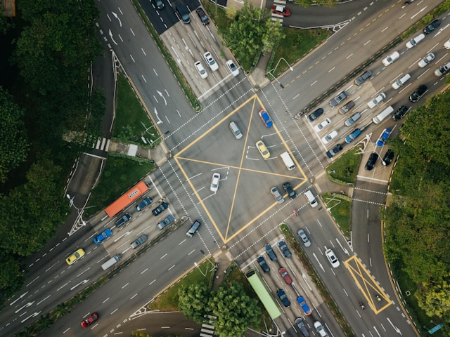
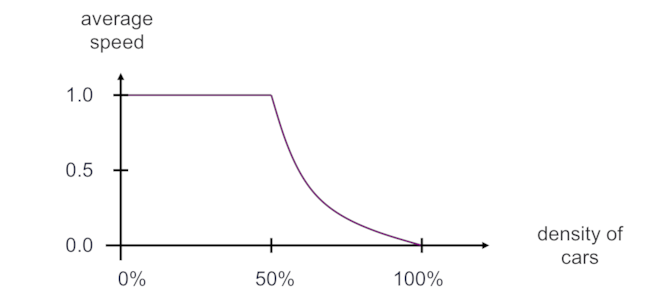
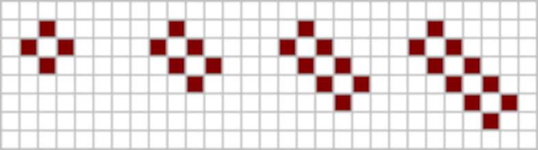

*Image courtesy of [Andrea Zanenga](https://unsplash.com/@andreazanenga) from [Unsplash](https://unsplash.com)*

## Parallel Computing

We have seen over the first two parts of the course that almost all modern computers are parallel computers, consisting of many individual CPU-cores that are connected together working simultaneously on one or more computer programs.

A single CPU-core acts as a serial computer, running only a single computer program at any one time.
The Oxford English Dictionary defines serial computing as ‘the performance of operations … in a set order one at a time’.
To take advantage of a parallel computer, we need to perform many operations at the same time so that we can make use of many CPU-cores.
Parallel computing is defined as ‘Involving the concurrent or simultaneous performance of certain operations’.

It is quite clear that a supercomputer has the potential for doing calculations very quickly.
However, it may not immediately be obvious how to take advantage of this potential power for any particular problem.
We next look at techniques we can use in our programs in order to take advantage of parallel computers.
This requires a problem, calculation or serial computer program to be parallelised.

The process of parallelising a calculation has a number of important steps:

- splitting the calculation into a number of smaller tasks that can be done independently (and therefore performed simultaneously by different CPU-cores), which is also called decomposing the calculation;
- identifying when and where tasks need to be coordinated (meaning that the CPU-cores must talk to each other);
- implementing these two operations using standard approaches;
- executing the parallel program on a parallel computer.

The first two steps typically depend only on the problem you are trying to solve, and not on the architecture of the particular parallel computer it is to be run on.
However, we will see that the last two steps are quite different depending on whether you are targeting a shared or distributed-memory computer.
In these cases, we use two distinct programming models: the shared-variables model and the message-passing model, each executed in fundamentally different ways.

There are many existing software packages and tools to help you actually write the implementation but, the first two steps (the design of the program) are still done by hand.
This requires someone to sit down and think things through using pencil-and-paper, maybe experimenting with a number of ideas to find the best approach.

Parallel computing has been around for several decades so there is a wealth of experience to draw upon, and the best parallelisation strategies have been identified for a wide range of standard problems.
Despite this, it is not currently possible to completely automate these design steps for anything but the simplest problems – perhaps a disappointing state of affairs given the fact that almost every phone, tablet or laptop is now a parallel computer, but good news if you are employed as a parallel programmer!

---

*Image courtesy of [CHUTTERSNAP](https://unsplash.com/@chuttersnap) from [Unsplash](https://unsplash.com)*

## Traffic Simulation

Now we are going to consider how to parallelise a more interesting example than just adding up a list of numbers. First, we will describe how the example works and get familiar with it.

We are going to look at a very simple way of trying to simulate the way that traffic flows. This better illustrates how parallel computing is used in practice compared to the previous salaries example:

- We process the same data over and over again rather than just reading it once;
- The way the model works (where the behaviour of each car depends on the road conditions immediately in front and behind) is a surprisingly good analogy for much more complicated computations, such as weather modelling, which we will encounter later on.

### The traffic model

In this example we only talk about a straight, one-way road without any intersections.
We think of the road as being divided into a number of sections or cells, each cell either contains a car (is occupied) or is empty (unoccupied).
The car behaviour is very simple: if the cell in front is occupied then it cannot move and remains where it is; if the cell in front is unoccupied then it moves forward.
A complete sweep of the road, where we consider every car once, is called an iteration; each iteration, a car can only move once.
Having updated the entire road, we proceed to the next iteration and check again which cars can move and which cars stand still.

If you want, you can think of each cell representing about 5 metres of road and each iteration representing around half a second of elapsed time.

Despite being such a simple simulation, it represents some of the basic features of real traffic flow quite well. We will talk you through some examples in the next few videos.

The simplest way to characterise different simulations is the density and average velocity of the cars: The density is the number of cars divided by the number of cells. If all cells are occupied then the density is 1.0 (i.e. 100%), and if half of them are occupied then the density is 0.5 (50%).
If we define the top speed of a car as 1.0 (i.e. it moves one cell in an iteration) then the average speed of the cars at each iteration is the number of cars that move divided by the total number of cars. 
For example, if we have 10 cars and, in a given iteration, all of them move then the average speed is 1.0.
If only four of them move then the average speed is 0.4 and, if none of them move, then the average speed is zero (total gridlock).

:::callout{variant="discussion"}
Why do you think this problem is a good analogy for other, more complex simulations? If the traffic flow problem was to be parallelised, how do you think it could be decomposed into parallel tasks?
:::

---

## How the traffic model works

::::iframe{id="kaltura_player" width="100%" height="400" src="https://cdnapisec.kaltura.com/p/2010292/sp/201029200/embedIframeJs/uiconf_id/32599141/partner_id/2010292?iframeembed=true&playerId=kaltura_player&entry_id=1_bw098xol&flashvars[streamerType]=auto&amp;flashvars[localizationCode]=en&amp;flashvars[leadWithHTML5]=true&amp;flashvars[sideBarContainer.plugin]=true&amp;flashvars[sideBarContainer.position]=left&amp;flashvars[sideBarContainer.clickToClose]=true&amp;flashvars[chapters.plugin]=true&amp;flashvars[chapters.layout]=vertical&amp;flashvars[chapters.thumbnailRotator]=false&amp;flashvars[streamSelector.plugin]=true&amp;flashvars[EmbedPlayer.SpinnerTarget]=videoHolder&amp;flashvars[dualScreen.plugin]=true&amp;flashvars[Kaltura.addCrossoriginToIframe]=true&amp;&wid=1_8e9q3inw" allowfullscreen webkitallowfullscreen mozAllowFullScreen allow="autoplay *; fullscreen *; encrypted-media *" sandbox="allow-downloads allow-forms allow-same-origin allow-scripts allow-top-navigation allow-pointer-lock allow-popups allow-modals allow-orientation-lock allow-popups-to-escape-sandbox allow-presentation allow-top-navigation-by-user-activation" frameborder="0" title="Traffic_Model_works_hd"}
::::

:::solution{title="Transcipt"}
0:11 - So now we’re going to spend some time looking at the traffic model. Here I’m illustrating it being run as pawns on a chessboard. And the way it works is that the squares on the chessboard represent the road and the pawns represent the cars. And obviously, a car here, this piece of road is occupied. There’s a pawn there. This piece of road is not occupied. And just to remind you, the way the model works. The rules are very simple. At each iteration a car moves forward if it can, if there’s a gap in front. It doesn’t move forward if there is a car in front of it. Now the right way to run this simulation is to look

0:42 - at the cars and say: that one can move, that one can’t, and that one can and then to move them. That’s slightly awkward. It turns out that we actually get the right answer if we update them in order from left to right as you look at it. So let’s just go ahead and run the model. So first of all, we have these three cars. This car can move. This car can’t move. And this car can move. So that iteration, two cars moved. There were three cars. So we’re interested in the average speed. The average speed is 2/3 or 0.67. Here I’m saying the maximum speed of the car is one.

1:14 - If you thought of the maximum speed of the car as being 60 miles an hour, you could say the average speed here is 40. But for simplicity, I’m just calling the maximum speed one. On the next iteration, again this car can’t move, this one can and this one can. So again the average speed of the cars there was 2/3 or 0.67. But you’ll see that actually now the cars arranged themselves with gaps in between them. So from now on, we’re in free flowing traffic. So from now on every iteration, all the cars move. And the average speed is one. And this would just carry on happily, all the cars moving. And we have completely free flowing traffic.

1:50 - Now it turns out that in any situation where we have fewer than 50% or fewer cars then they will eventually arrange themselves into this is car gap, car gap arrangement and move off with average speed of one. However, what’s interesting is actually what happens when there are more than 50% density of cars and we get congestion.
:::

In this short video David uses a chessboard to explain how the traffic model works.

We will be using the chessboard to illustrate a few examples of the traffic conditions in the next steps.

:::callout{variant="discussion"}
Do you think this simplified model is actually useful? Why?
:::

---

## Example 1: Traffic lights

::::iframe{id="kaltura_player" width="100%" height="400" src="https://cdnapisec.kaltura.com/p/2010292/sp/201029200/embedIframeJs/uiconf_id/32599141/partner_id/2010292?iframeembed=true&playerId=kaltura_player&entry_id=1_hurz7ea5&flashvars[streamerType]=auto&amp;flashvars[localizationCode]=en&amp;flashvars[leadWithHTML5]=true&amp;flashvars[sideBarContainer.plugin]=true&amp;flashvars[sideBarContainer.position]=left&amp;flashvars[sideBarContainer.clickToClose]=true&amp;flashvars[chapters.plugin]=true&amp;flashvars[chapters.layout]=vertical&amp;flashvars[chapters.thumbnailRotator]=false&amp;flashvars[streamSelector.plugin]=true&amp;flashvars[EmbedPlayer.SpinnerTarget]=videoHolder&amp;flashvars[dualScreen.plugin]=true&amp;flashvars[Kaltura.addCrossoriginToIframe]=true&amp;&wid=1_pbpr0tln" allowfullscreen webkitallowfullscreen mozAllowFullScreen allow="autoplay *; fullscreen *; encrypted-media *" sandbox="allow-downloads allow-forms allow-same-origin allow-scripts allow-top-navigation allow-pointer-lock allow-popups allow-modals allow-orientation-lock allow-popups-to-escape-sandbox allow-presentation allow-top-navigation-by-user-activation" frameborder="0" title="Traffic_lights_hd"}
::::

:::solution{title="Transcript"}
0:12 - An interesting situation to look at is when we have traffic stopped at a set of traffic lights. So here I have this piece here representing some traffic lights and here I have four cars queued up at the traffic lights. Let’s imagine what happens when the traffic lights go green. So what would be really nice, would make driving much easier, and make congestion a lot less, is if all the cars moved off at once. So the traffic lights go green and all the cars move off in a single block like that. But we know that’s not what happens. We know you have to wait a long time when traffic lights change. So let’s see how this works in this model.

0:45 - So we’ve got the cars lined up here. The traffic lights go green. On the first iteration, only one car can move. Then on the next iteration, two cars can move. But this car and this car are still static. The third iteration, three cars can move. And only on the fourth iteration, after four time steps, is this car able to move and they all move off freely.

1:10 - And after that, we have free-flowing traffic. These cars will carry on moving at speed one and move away freely. So even with this very simple model, this very simple cellular automaton model of how traffic flows, we see that in a situation of cars lined up at traffic lights, it predicts the correct behaviour. The cars don’t move off in a block, they move off and end up spread apart. And they move off one by one. Meaning the cars further back in the line have to wait a certain amount of time to get through and perhaps even miss the traffic lights if they go red again.
:::

In this first example David uses the traffic model on a chessboard to simulate a situation created by traffic lights.

:::callout{variant="discussion"}
In your opinion, is our toy model capable of capturing the effect of traffic lights? Can you outline the most essential assumptions?
:::

---

## Example 2: Traffic congestion

::::iframe{id="kaltura_player" width="100%" height="400" src="https://cdnapisec.kaltura.com/p/2010292/sp/201029200/embedIframeJs/uiconf_id/32599141/partner_id/2010292?iframeembed=true&playerId=kaltura_player&entry_id=1_8tn3hmn6&flashvars[streamerType]=auto&amp;flashvars[localizationCode]=en&amp;flashvars[leadWithHTML5]=true&amp;flashvars[sideBarContainer.plugin]=true&amp;flashvars[sideBarContainer.position]=left&amp;flashvars[sideBarContainer.clickToClose]=true&amp;flashvars[chapters.plugin]=true&amp;flashvars[chapters.layout]=vertical&amp;flashvars[chapters.thumbnailRotator]=false&amp;flashvars[streamSelector.plugin]=true&amp;flashvars[EmbedPlayer.SpinnerTarget]=videoHolder&amp;flashvars[dualScreen.plugin]=true&amp;flashvars[Kaltura.addCrossoriginToIframe]=true&amp;&wid=1_t5dr00g1" allowfullscreen webkitallowfullscreen mozAllowFullScreen allow="autoplay *; fullscreen *; encrypted-media *" sandbox="allow-downloads allow-forms allow-same-origin allow-scripts allow-top-navigation allow-pointer-lock allow-popups allow-modals allow-orientation-lock allow-popups-to-escape-sandbox allow-presentation allow-top-navigation-by-user-activation" frameborder="0" title="Traffic_congestion_hd"}
::::

:::solution{title="Transcript"}
0:11 - So one of the interesting things about the simulation is to look at congestion when traffic jams arise. So if that we start with a situation where the road is completely full, we have cars everywhere, obviously none of the cars can move. It means complete gridlock. What we’re going to do is consider a situation where there is a small amount of space, so there’s a gap there. So what happens? Well each iteration, you’ll see that only one car can move. The first iteration, this car can move. The second iteration, this car can move. The third iteration, this car can move. And so on. And obviously there, the average speed is very low.

0:43 - Only one car is moving per iteration out of all these cars, so the average speed is not very high. But another way to look at this is quite interesting. If you watch this, you’ll see that what’s actually happening is one car is moving to the right every iteration. You could also think of it as the gap moving to the left. So you could think of this situation as the gap moving to the left with speed one. That’s to be contrasted with a single car on its own on an otherwise empty road where the car moves to the right with speed one. Every iteration the car moves one space to the right.

1:18 - And that’s just quite interesting observation, but it might help you, in fact, to try to think about how the model works.
:::

In this second example, we again use the chessboard to look at the traffic congestion.

Do you understand why only one car can move at each iteration?

This is actually quite important not only in our toy traffic model but also in any kind of computer simulations. The process of transferring continuous functions, equations and models into small distinct bits to be executed in a sequence of steps is called discretisation. This process is one of the initial steps in creating computer simulations.

---

## Example 3: Rubbernecking

::::iframe{id="kaltura_player" width="100%" height="400" src="https://cdnapisec.kaltura.com/p/2010292/sp/201029200/embedIframeJs/uiconf_id/32599141/partner_id/2010292?iframeembed=true&playerId=kaltura_player&entry_id=1_8a540tg5&flashvars[streamerType]=auto&amp;flashvars[localizationCode]=en&amp;flashvars[leadWithHTML5]=true&amp;flashvars[sideBarContainer.plugin]=true&amp;flashvars[sideBarContainer.position]=left&amp;flashvars[sideBarContainer.clickToClose]=true&amp;flashvars[chapters.plugin]=true&amp;flashvars[chapters.layout]=vertical&amp;flashvars[chapters.thumbnailRotator]=false&amp;flashvars[streamSelector.plugin]=true&amp;flashvars[EmbedPlayer.SpinnerTarget]=videoHolder&amp;flashvars[dualScreen.plugin]=true&amp;flashvars[Kaltura.addCrossoriginToIframe]=true&amp;&wid=1_uwprlc3q" allowfullscreen webkitallowfullscreen mozAllowFullScreen allow="autoplay *; fullscreen *; encrypted-media *" sandbox="allow-downloads allow-forms allow-same-origin allow-scripts allow-top-navigation allow-pointer-lock allow-popups allow-modals allow-orientation-lock allow-popups-to-escape-sandbox allow-presentation allow-top-navigation-by-user-activation" frameborder="0" title="Traffic_Rubbernecking_hd"}
::::

:::solution{title="Transcript"}
0:11 - So I’m sure you’ll have been in the situation where you’re driving along the motorway, and suddenly you have to brake because the car in front has slowed down. But there’s no apparent reason for it. And then maybe a minute or so later you see there’s been an accident or an incident by the side of the road. And people are slowing down to see what’s been going on. Well, surprisingly this very, very simple simulation predicts that kind of behaviour. So I’m going to have a larger road here. So here, I’ve put two chess boards together so I can now have a larger road. And we’ve set up with free-flowing traffic. So at the moment, everything’s fine.

0:41 - Everyone is moving forward at speed one.

0:47 - Now we’re going to imagine that perhaps someone coming from a side street has a slight accident. And there’s a small incident here, and this car is broken down. And having seen it, this car decides to slow down just to see what’s going on. So on the next iteration this car isn’t going to move. That’s the only difference. Everyone moves except for this car. Now you might have wondered beforehand what happens at the edges of the road? These are the boundary conditions, what happens off the edges of your simulation are called boundaries. And the boundary conditions say what happens there. So what we’re going to imagine here is that this is embedded in a run of free flowing traffic.

1:25 - So cars on the right here just move off into free space. But on the left here, the gaps are replaced with cars coming in. So there is another car coming in here. So now we just carry on running the model.

1:42 - And again.

1:47 - And again, we add another car here. This would keep going.

1:56 - You’ll see that although the original incident was here, the cars are starting to brake further down the line. It becomes more obvious when you run it once more.

2:08 - But on this iteration, you can see that it’s this car here way down line that can’t move.

2:16 - Despite the fact that the accident is far upstream. So what we see is the braking behaviour where a car has to slow down because the car in front has slowed down moves backwards to the left in a wave well away from where the original incident happened. Now to come back to boundary conditions, what we’re going to look at in the future is we’re going to look at a situation where we’re not imagining a straight road, we’re actually imagining a roundabout where the road is closed in on itself. And the way to do that is to make sure that when cars move off one side of the road, they reappear on the other.

2:46 - What we’ve done is we’ve taken the roundabout, we’ve kind of unwrapped it into a straight line, so we have to make sure that it’s joined in to a roundabout, cars that leave here come back here. So if we are doing a roundabout we’d make sure that if I ever a car moved off the end here, it would reappear back here on the side.

3:05 - Cars disappearing off the end here, appear back here on the edge. And we’ll come back to that. That would be the situation, that would be the boundary conditions we’ll want to use to simulate in the parallel simulation.
:::

In this video David talks about another example of traffic conditions - rubbernecking.

The term rubbernecking refers to the activity of motorists slowing down in order to see something on the other side of a road or highway, which creates backwards waves in traffic.

:::callout{variant="discussion"}
Having watched the video, is it clear to you what boundary conditions are? Do you understand why they are needed?
:::

---

*Image courtesy of [Chrid Ried](https://unsplash.com/@cdr6934) from [Unsplash](https://unsplash.com)*

## Traffic model: predictions, implementation and cellular automata

Using the measurements mentioned in the previous steps, we can see that the simulation predicts the onset of congestion (traffic jams) whenever the density of cars exceeds 50%.

If we run many simulations many times at different densities using a very long road then we get the following graph:

Note that we only take measurements of the average speed after we have run for many iterations to let it settle down to a steady state.

This is quite easy to understand in general terms. When the car density is less than 50%, the cars will eventually arrange themselves so that there is a gap between every car and they can all move once each iteration. This is not possible when more than half the cells are occupied: some of the cars cannot move and the average speed drops below 1.0. At 100% density, where every cell is occupied, none of the cars can move and the speed is 0.

What perhaps isn’t obvious (at least it wasn’t obvious to me) is how rapidly congestion happens in the model - an effect well known to every driver, where only a few extra cars can turn a previously clear road into a traffic jam. This is an example of emergent behaviour where repeated application of very simple rules can lead to surprisingly complex behaviour when applied to a large enough system (the complexity increases with size).

### Boundary Conditions

You might be concerned about what happens at the extreme ends of the road. If I have a road containing 100 cells, what happens if the car in cell 100 wants to move forward? Which cell is to the right of cell 100? Which cell is to the left of cell 1? In computer simulations, these are called the boundary conditions: we have to decide what to do at the boundaries (i.e. the extreme ends) of the simulation.

For simplicity, we will choose to simulate traffic driving on a very large roundabout rather than a straight piece of road.
If you imagine wrapping the road into a circle, this means that when a car moves away from cell 100 it reappears back on cell 1.
So, the cell forward from cell 100 is cell 1; the cell backward from cell 1 is cell 100.
These are called periodic boundary conditions.
There are plenty of other strategies used to handle boundaries in computational science, different problems require different solutions.

For the traffic model, this has the nice side-effect that the total number of cars stays the same on every iteration as there is no way for cars to enter or leave the roundabout.
If the number of cars changes from iteration to iteration then we must have made a mistake!

### Cellular Automata

A simulation such as this, where we have a number of cells and update them depending on the values of their neighbours, is generally called a Cellular Automaton. One of the most famous cellular automata is the Game of Life which models the growth and death of biological cells. The Game of Life takes place on a two-dimensional grid rather than a line which makes it a bit too complicated for our purposes, but the principles are very similar.

For the one-dimensional case like the Traffic Model, it turns out that there are 256 different possible models:

- each cell depends on the values of three cells (itself and its two immediate neighbours);
- this means there are 8 rules (i.e. 111, 110, 101, 100, 011, 010, 001 and 000), each with two possible outcomes (occupied = 1, unoccupied = 0). First number corresponds to the preceding, second to the current and third the next cell, giving the following outcomes for the new state of the central cells: 1, 0, 1, 1, 1, 0, 0 and 0, respectively.
- that makes a total of 256 = 28 possible models (to include every possible combination of 2 outcomes for 8 rules - 2 \* 2 \* 2 \* 2 \* 2 \* 2 \* 2 \* 2 = 128).

Most of these models will be very boring, but with our particular choice of rules the model can be seen as a simulation of traffic moving from left to right. The traffic model is sometimes called “Rule 184” - there is a (surprisingly detailed) discussion of it on [Wikipedia](https://en.wikipedia.org/wiki/Rule_184).

We have chosen a 1D model for simplicity. What do you think you would need to consider to simulate a 2D model? How much more work would it be?

:::callout{variant="discussion"}
We’ve made a lot of simplifications to simulate traffic using this Rule 184 cellular automaton. Can you list what they are? What important aspects of real traffic flow are we missing?

Do you think it is possible to perform realistic traffic simulations using a more complicated cellular automaton, or would you recommend a completely different approach. Why?  
:::

---

*Image courtesy of [Luca Bravo](https://unsplash.com/@lucabravo) from [Unsplash](https://unsplash.com)*

## Programming Model

It turns out that, despite its simplicity, the traffic model is representative of a surprisingly wide range of real calculations that are carried out on parallel supercomputers. We will use it to illustrate some key ideas throughout the rest of the course.

There are two fundamentally different approaches to parallelising a calculation which correspond to the two parallel architectures. We call these approaches programming models.

| Parallel Architecture | Programming Model |
| --------------------- | ----------------- |
| Shared Memory         | Shared Variables  |
| Distributed Memory    | Message Passing   |

What we mean by a programming model is that we take a high-level view of the way we are going to use the parallel computer, only concerned with the fundamental features of the computer and not bothering about the details (here, the fundamental feature is how the memory is arranged).

To illustrate what we mean by a model in this context, let’s take another example from traffic. Imagine that you want to travel between two cities. In the private transport model you have your own vehicle and are responsible for planning the route, driving safely and ensuring the vehicle has enough fuel; you can choose who you share the journey with. In the public transport model, you pay someone else (e.g. a bus company) to supply the vehicle and a trained driver, and the vehicle follows a fixed route to a given timetable; you will share the vehicle with fellow travellers.

Although both models achieve the same aim of transporting you between the two cities, they do so in fundamentally different ways with their own pros and cons. At this level, we are not concerned about the details of how each model is implemented: whether you drive an electric or petrol car, or travel by bus or by train, the fundamental distinction between the private and public models remains the same despite differing in the details.

In terms of the two programming models, we are not concerned about the details of how the computer is built, whether it has a fast communications network or a slow one, whether each processor has a few cores or dozens of them. All we care about is whether or not different CPU cores are all directly attached to the same memory: are the workers sharing the same office or in different offices?
