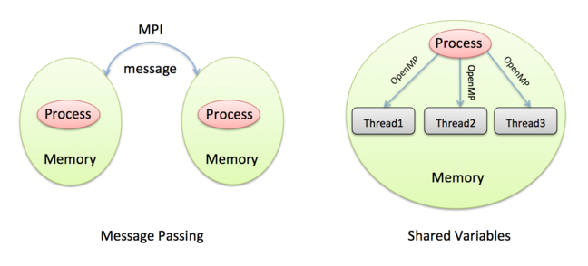

_Image courtesy of [Sigmund](https://unsplash.com/@sigmund) from [Unsplash](https://unsplash.com)_

## Shared-Variables Model

On a computer, a variable corresponds to some piece of information that we need to store in memory. In the traffic model, for example, we need to store all the cells in the old (containing the state from the previous step) and new roads (containing the current state of the road), and other quantities that we calculate such as the number of cars that move or the density of the cars. All of these are variables — they take different values throughout the calculation.

Remember that the the shared memory architecture (many CPU-cores connected to the same piece of memory) is like several office mates sharing a whiteboard. In this model, we have two choices as to where we store any variables:

- shared variables: accessible by everyone in the office
- private variables: can only be accessed by the person who owns them

A shared variable corresponds to writing the value on the whiteboard so that everyone in the office can read or modify it. You can think of private variables being stored on a personal notepad that can only be seen by the owner.

Although writing everything on the whiteboard for all to see might seem like a good idea, it is important to ensure that the officemates do not interfere with each other’s calculations. If you are working on the cells for a section of road, you do not want someone else changing the values without you knowing about it. It is crucial to divide up the work so that the individual tasks are independent of each other (if possible) and to make sure that workers coordinate whenever there is a chance that they might interfere with each other.

In the shared-variables model, the workers are often referred to as threads.

### Things to consider

When parallelising a calculation in the shared-variables model, the most important questions are:

- which variables are shared (stored on the whiteboard) and which are private (written in your own notepad);
- how to divide up the calculation between workers;
- how to ensure that, when workers need to coordinate with each other, they do so correctly;
- how to minimise the number of times workers must coordinate with each other.

The most basic methods of coordination are:

- master region: certain calculations are only carried out by one of the workers - a nominated boss worker;
- barrier: everybody waits until all workers have reached a certain point in the calculation; when everyone has reached that point, workers can then proceed;
- locking: if you are working with a variable and don’t want anyone else to touch it, you can lock it. This means that only one worker can access the variable at a time - if the variable is locked by someone else, you have to wait until they unlock it. On a shared whiteboard you could imagine circling a variable to show to everyone else that you have it locked, then erasing the circle when you are finished.

Clearly, all of these have the potential to slow things down as they can lead to workers waiting around for others to finish, so you should try and do as little coordination as possible (while still ensuring that you get the correct result!).

### Adding to a Variable

One of our basic operations is to increment a variable, for example to add up the total number of cars that move each iteration. It may not be obvious but, on a computer, adding one to a variable does not comprise a single operation. Using the whiteboard analogy, it has the following stages:

- take a copy of the value on the whiteboard and write it in your notepad (load a value from memory into register);
- add one to the value on your notepad (issue an increment instruction on the register);
- copy the new value back to the whiteboard (store the new value from register to memory).

In the shared-variables model, the problem occurs if two or more workers try and do this at the same time: if one worker takes a copy of the variable while another worker is modifying it on their notepad, then you will not get the correct answer. Sometimes you might be lucky and no-one else modifies the variable while you are working on your notepad, but there is no guarantee.

This situation, where the outcome of a calculation depends on the order workers complete their tasks, is called a race condition and is a disaster for parallel programming: sometimes you get the right answer, but sometimes the wrong answer.
To fix this you need to coordinate the actions of the workers, for example using locking.

---


_Image courtesy of [Sigmund](https://unsplash.com/@towfiqu999999) from [Unsplash](https://unsplash.com)_

## Parallelising the traffic simulation

Consider how to parallelise the salaries example using the shared-variables model, i.e. how could 4 office mates add up the numbers correctly on a shared whiteboard?

Remember that you are not allowed to talk directly to your office mates - all communications must take place via the whiteboard. Things to consider include:

- how do you decompose the calculation evenly between workers?
- how do you minimise communication between workers?
- how do you ensure that you do not have any race conditions?

Can you think of any other aspects that should be taken into account?

---

## Solution to Income calculation in Shared-Variables

::::iframe{id="kaltura*player" width="100%" height="400" src="https://cdnapisec.kaltura.com/p/2010292/sp/201029200/embedIframeJs/uiconf_id/32599141/partner_id/2010292?iframeembed=true&playerId=kaltura_player&entry_id=1_zqowj328&flashvars[streamerType]=auto&amp;flashvars[localizationCode]=en&amp;flashvars[leadWithHTML5]=true&amp;flashvars[sideBarContainer.plugin]=true&amp;flashvars[sideBarContainer.position]=left&amp;flashvars[sideBarContainer.clickToClose]=true&amp;flashvars[chapters.plugin]=true&amp;flashvars[chapters.layout]=vertical&amp;flashvars[chapters.thumbnailRotator]=false&amp;flashvars[streamSelector.plugin]=true&amp;flashvars[EmbedPlayer.SpinnerTarget]=videoHolder&amp;flashvars[dualScreen.plugin]=true&amp;flashvars[Kaltura.addCrossoriginToIframe]=true&amp;&wid=1_jaksyv3n" allowfullscreen webkitallowfullscreen mozAllowFullScreen allow="autoplay *; fullscreen \_; encrypted-media \*" sandbox="allow-downloads allow-forms allow-same-origin allow-scripts allow-top-navigation allow-pointer-lock allow-popups allow-modals allow-orientation-lock allow-popups-to-escape-sandbox allow-presentation allow-top-navigation-by-user-activation" frameborder="0" title="Solution_income_shared_variables_hd"}
::::

:::solution{title="Transcript"}
0:11 - Here we’re going to revisit the very simple calculation which I introduced in the first week, where we were adding up lots and lots of numbers there to compute the total income of the world by adding up everyone’s salaries. And we’re going to now revisit that, not with a serial program, but look at how we do it in parallel in the shared variables model on a shared memory computer. And what I’ll do is I’ll illustrate how we’re going to split the calculation up between the different CPU-cores. But more important, the subtleties of synchronisation which are introduced. Just to re-iterate the analogy, this white board represents the shared memory which is in an office.

0:46 - And there is more than one person in the office. Let’s imagine that there is myself and three other people– four workers sharing this office. And the analogy with shared memory is that all of us can freely read and write anywhere we want to on this white board. So what we’re going to do is we can add up these salaries– and here I just have 12. In reality we would be interested in a much larger number, but I could only fit 12 here on the board. We saw before that we could just add these up, obviously, in order, one by one. And a single CPU-core with a simple program could add these up and get the answer.

1:16 - But what we want to do is we want to take advantage of the fact there are four of us in this office to do this calculation faster. The nice thing about addition is that we can do the calculation in any order. And that allows us to easily split it up between the workers, between the different CPU-cores in this office. So because there are four of us, we’re each going to take three numbers. And I’m going to do something very simple. I’m going to say that the first worker is going to take the first three numbers. The second the next three, then the next three, then the next three. And let’s imagine I’m the second worker.

1:43 - So I’m taking numbers four, five, and six from the list. Now this isn’t the only way you could split the calculation up, because any worker can read or write to any part of the shared memory, we could split it up so for example, I could do the first, the fourth, the seventh and the tenth numbers, for example. But we’ll just do something simple and split it up into regular blocks. So I need to add up the first three numbers here. And that immediately introduces the concept that I need a private memory. I need somewhere where I can do my calculation on my own without interfering with someone else before we all get back together and add our subtotals together.

2:15 - And I’m going to use this notebook to represent private memory. So it’s fairly straightforward. I just read the numbers off the board, the fourth, the fifth, and the sixth numbers and add them together in my private memory to come up with the answer. And my answer turns out to be 108,750. And at the same time, my colleagues, my coworkers are also doing the same in their own private memory with their different parts of the list. But the subtlety comes at the point when we try and combine all the subtotals together. We want to end up with the correct result being available to everybody. So we want the result to be in shared memory.

2:47 - So I’ve written the total here in the space for the total on the shared memory. But all of the subtotals are all in our private memory. So we need to add them back together. So I come along to add my subtotal back into the running total and I immediately see a problem. Somebody has already started working on the total. This turns out to be the result from the third worker. And my worry is, can I alter this number or is somebody else working on it?

3:10 - So what I’m going to have to do, what I want to do, is to read this number, take it away, add it to my subtotal, and then write the new updated total back in the same place. But the worry is, somebody else is currently doing the same. Somebody else might be working on their own in their other corner of the office adding their subtotal to this running total. So how do I make sure that two people aren’t working on this piece of shared memory at the same time? The way we solve this problem is by having a lock. We only allow somebody to alter this shared memory if they have the red pen.

3:42 - So this allows me to make sure that only one worker updates this memory at once. So I come along with my subtotal wanting to add it to the running total and I see the pen is there. That means, I’m safe. There is nobody else working on this memory. So I can grab the pen, I can acquire the lock, and then carry on and do my calculation. So I add this 65,500 to my 108,750 and I can update the number. And the new subtotal turns out to be 174,250. And now I return the pen and release the lock, which means that my coworkers can now come in and safely update this number.

4:24 - So this now represents the sum of the second and the third portions of the list. Eventually in the future, my other co-workers will come together and they’ll finish. And then we will have the total here. Now you might ask, how do I know that everyone is finished? How do I know that this is the final total? Well, to make sure that we know that, we would all execute a barrier. We would put a barrier at the end of the calculation so everybody waits when they have finished. And then when we move on we know that everyone has completed and we know that this total is updated.

4:51 - This also illustrates the key role that private memory plays in the shared variables model for efficiency. We could get the right answer by every time that I wanted to add a number to the total not having private memory, just adding this number to the total, then this one, then this one. But each time I did that, I’d have to acquire the lock. And so I’d block everyone else many, many times. We’d be locking this number 12 times. Or in reality, thousands and thousands of times for a list of lots of numbers.

5:19 - However, if we all create our own subtotals in our private memory, and only update the shared memory when we’re completed, we only need to use four locks– one lock for each worker– as opposed to thousands of locks, one lock for each number. There are, of course, other solutions to this problem. Rather than having a single total, we could all reserve a space in shared memory for our subtotals. So we could have four slots, where when each worker finishes, they would put their subtotal in the correct slot. So when I finished with my calculation, rather than adding it directly into the running total, I just put it in the correct slot.

5:58 - Everyone does that and when everyone is finished, we have all the subtotals here in shared memory. But to get the right answer, we need to add them together. And then we need a master region. We nominate one thread to be the master, who would then add these numbers up together and update the total. And because we only have one thread updating this total at once through the master region rather than through a lock, we don’t have any problems with multiple people updating shared memory at the same time.
:::

In this video David outlines how to parallelise the income calculation on a shared whiteboard.

Making sure that the workers cooperate correctly is the main issue - ensuring correct synchronisation can be surprisingly subtle.

:::callout{variant="discussion"}
Compare your answers from the last step with this solution. How did you do? Have you learned anything surprising? We are curious to know!
:::

---


_Image courtesy of [Joanna Kosinska](https://unsplash.com/@joannakosinska) from [Unsplash](https://unsplash.com)_

## Message-Passing Model

The Message-Passing Model is closely associated with the distributed-memory architecture of parallel computers.

Remember that a distributed-memory computer is effectively a collection of separate computers, each called a node, connected by some network cables. It is not possible for one node to directly read or write to the memory of another node, so there is no concept of shared memory. Using the office analogy, each worker is in a separate office with their own personal whiteboard that no-one else can see. In this sense, all variables in the Message-Passing Model are private - there are no shared variables.

In this model, the only way to communicate information with another worker is to send data over the network. We say that workers are passing messages between each other, where the message contains the data that is to be transferred (e.g. the values of some variables). A very good analogy is making a phone call.

The fundamental points of message passing are:

- the sender decides what data to communicate and sends it to a specific destination (i.e. you make a phone call to another office);
- the data is only fully communicated after the destination worker decides to receive the data (i.e. the worker in the other office picks up the phone);
- there are no time-outs: if a worker decides they need to receive data, they wait by the phone for it to ring; if it never rings, they wait forever!

The message-passing model requires participation at both ends: for it to be successful, the sender has to actively send the message and the receiver has to actively receive it. It is very easy to get this wrong and write a program where the sends and receives do not match up properly, resulting in someone waiting for a phone call that never arrives. This situation is called deadlock and typically results in your program grinding to a halt.

In this model, each worker is called a process rather than a thread as it is in shared-variables, and each worker is given a number to uniquely identify it.

### Things to consider

When parallelising a calculation in the message-passing model, the most important questions are:

- How are the variables (e.g. the old and new roads) divided up among workers?
- When do workers need to send messages to each other?
- How do we minimise the number of messages that are sent?

Because there are no shared variables (i.e. no shared whiteboard), you do not usually have to consider how the work is divided up. Since workers can only see the data on their own whiteboards, the distribution of the work is normally determined automatically from the distribution of the data: you work on the variables you have in front of you on your whiteboard.

:::callout{variant="discussion"}
To communicate a lot of data we can send one big message or lots of small ones, what is more efficient? Why?
:::

---


_Image courtesy of [CHUTTERSNAP](https://unsplash.com/@chuttersnap) from [Unsplash](https://unsplash.com)_

## How to parallelise the traffic simulation?

Consider how you could parallelise the traffic model among 4 workers, each with their own whiteboards in separate offices, communicating by making phone calls to each other.

Remember that the cars are on a roundabout (we are using periodic boundary conditions) so cars leaving the end of the road reappear at the start.

To get you started:

- Think carefully about how the traffic model works; what are its basic rules?
- Think about the characteristics of the message-passing model;
- How can you combine them?
- Which workers need to phone each other, when and how often?

You do not need to provide a clear-cut answer. Instead, list the things that you think need to be considered and why.

### Extra Exercises

Sending a message can be implemented in two different ways:

- Synchronously; like making a phone call.
- Asynchronously; like sending an email.

The difference between these is whether the sender waits until the receiver is actively taking part in the transfer (synchronous) or carries on with their own work regardless (asynchronous).

:::callout{variant="discussion"}
Do you think that solving the traffic model in parallel is simpler using synchronous or asynchronous messages?
Which do you think might be faster?
Do you think the boundary conditions are important here?

Imagine that you want all workers to know the average speed of the cars at every iteration.
How could you achieve this using as few phone calls as possible?
:::

---

## Solution to Traffic simulation in Message-Passing

::::iframe{id="kaltura*player" width="100%" height="400" src="https://cdnapisec.kaltura.com/p/2010292/sp/201029200/embedIframeJs/uiconf_id/32599141/partner_id/2010292?iframeembed=true&playerId=kaltura_player&entry_id=1_cy6y9hac&flashvars[streamerType]=auto&amp;flashvars[localizationCode]=en&amp;flashvars[leadWithHTML5]=true&amp;flashvars[sideBarContainer.plugin]=true&amp;flashvars[sideBarContainer.position]=left&amp;flashvars[sideBarContainer.clickToClose]=true&amp;flashvars[chapters.plugin]=true&amp;flashvars[chapters.layout]=vertical&amp;flashvars[chapters.thumbnailRotator]=false&amp;flashvars[streamSelector.plugin]=true&amp;flashvars[EmbedPlayer.SpinnerTarget]=videoHolder&amp;flashvars[dualScreen.plugin]=true&amp;flashvars[Kaltura.addCrossoriginToIframe]=true&amp;&wid=1_db2dyi95" allowfullscreen webkitallowfullscreen mozAllowFullScreen allow="autoplay *; fullscreen \_; encrypted-media \*" sandbox="allow-downloads allow-forms allow-same-origin allow-scripts allow-top-navigation allow-pointer-lock allow-popups allow-modals allow-orientation-lock allow-popups-to-escape-sandbox allow-presentation allow-top-navigation-by-user-activation" frameborder="0" title="Solution_Traffic_Message_passing_hd"}
::::

:::solution{title="Transcript"}
0:11 - Now we’re going to look at the traffic simulation but imagine how we could operate it in parallel. So I’ve got an even bigger board here, a bigger road. I’ve got three Chess boards stuck together. And so I have a road of length 24. And I have cars all over the road. So if we were operating on a shared memory computer in the shared-variables model, it wouldn’t really be a problem in running this simulation in parallel. This would be our very large, shared whiteboard, and there would be lots of workers together in the same office– all able to read and write to the whiteboard.

0:41 - So for example, we could just decide if there were two workers that one worker updated all of these pawns, and the other worker updated all of these pawns, there might have to be some interaction, some collaboration between us to make sure that we are always on the same iteration. That we didn’t run ahead of each other. But in principle, there’s no real problem here. However, what’s much more interesting for this simulation is to look at how you parallelise it in distributed memory using the message-passing model. So what happens there, is we’re going to imagine this is split up over three people, three workers, but they’re in three separate offices.

1:13 - So these are three separate whiteboards, each in a different office, and I’m operating on this small whiteboard here. All I can see is my own whiteboard. I can’t see what’s going on in these other two offices.

1:33 - Now in the message-passing parallelisation I only have access to my own small whiteboard. And so now we can see there’s immediately a problem. For example, I can update this pawn. I know he can’t move. That one can’t move. That one can move. And that one can. But I have a problem at the edges. I have two problems. One is, I don’t know if this pawn can move, because I don’t know what’s happening over here. This is the piece of board which is owned by the person upstream from me.

2:00 - And also, I don’t know if I should place a new pawn in this cell here, because that depends on the state of the board owned by the person who’s downstream from me. So the only way to solve this is to introduce communication. And in the message-passing model, communication is done through passing messages. And one analogy is making phone calls. So what I need to do, I need to pick up the phone and I need to phone my neighbours both to the left and to the right. I need to phone them up and say, OK, what’s going on here? What pawns do you have in your cell here? And I’ll tell my neighbour what’s going on here.

2:37 - And then I need to make another phone call upstream to ask the person, what’s going on in your cells there? And to tell them what’s going on in my edge cells. Having communicated with my fellow workers, I’m now in a situation where I can update the simulation on my piece of board, because I know what’s going on on the edges. So for example, I know if there’s a pawn who needs to move into this square here. Or I know if there’s a gap here and this pawn can move off. So I can then update all my pawns on my board. And then on the next iteration, I have to again communicate with my fellow workers.

3:08 - I need to communicate with my neighbours to the left and to the right to find out what the new stage of the pawns on the edges of their boards are. So the whole simulation continues in this process of communication and then calculation. Communication to find out what’s going on with your fellow workers. And then calculation, when you locally update your own chess board. There’s one extra thing we need to do this simulation, which is work out the average speed of the cars. So let’s take a situation, for example, where this pawn can move and there is no pawn coming in here. So we’ll say, OK, this pawn can’t move. This pawn moves, that’s one move. That makes two moves.

3:44 - And this one, that’s three moves. So I know that three pawns have moved. But to calculate the average speed of the cars, I need to know how many pawns have moved on the entire road when in fact, I can only see a small section of the road. So not only do we need to communication with our fellow workers to do a single update to perform a single iteration, to find out what’s going on the edges of our board, we also need to communicate with them to work out what the average speed is, to work out how many pawns have moved on their board.

4:10 - So whenever I want to work out what the average speed is, I have to pick up the phone and phone all of my fellow workers– that’s the simple way of doing it. Asking them how many of their pawns have moved. And then I get the totals and I can add them all together. So you can see that not only does updating the simulation require communication, even simple calculations like how many pawns have moved requires communication. Because I only know how many pawns have moved on my piece of road, but not what’s happening on the other pieces of road which are on other people’s whiteboards in other offices.
:::

In this video David describes the basics of how you can parallelise the traffic model using message passing, i.e. on a distributed-memory machine.

Try to list the most important points of this parallelisation. Was there anything that you failed to consider when coming up with your answer? For example, how does each worker know whether it’s supposed to call or wait for a call? Can you think of any other rules that need to be established for this to work?

Hopefully, you now have a better understanding of how both programming models work and how they differ from each other. In the next two steps we will talk about the actual implementations of both models.

---


_Image courtesy of [T K](https://unsplash.com/@realaxer) from [Unsplash](https://unsplash.com)_

## MPI and processes

So far we have discussed things at a conceptual level, but it’s worth going into some of the details, particularly so you are familiar with certain terminology such as process, thread, MPI and OpenMP.

### Message Passing

The way that message-passing typically works is that you write one computer program, but run many copies of it at the same time. Any supercomputer will have ways to let you spread these programs across the nodes, and we normally ensure we run exactly one copy of the program for every CPU-core so that they can all run at full speed without being swapped out by the operating system. From the OS’s point of view, each program is a separate process and by default they all run completely independently from each other.

For example, if you run a Word Processor and a Spreadsheet Application at the same time, each of these becomes a separate process that can only run on a single CPU-core at a time. In the message-passing model, we exploit the parallel nature of our distributed-memory computer by running many processes. The only real differences from the word processor and spreadsheet example is that every process is a copy of the same program, and that we want our parallel processes to work together and not independently.

Each process only has access to its own memory, totally separate from the others (this is strictly enforced by the OS to ensure that, for example, your Word Processor cannot accidentally overwrite the memory belonging to your Spreadsheet Application!). This way of implementing message-passing is called the Single Program Multiple Data or SPMD approach.

When they want to send messages to each other, the processes call special functions to exchange data. For example, there will be a function to send data and a function to receive data. These functions are not directly part of the program but stored in a separate library which will be pre-installed on the supercomputer (if you are familiar with the way that applications are created from source code, this means that the compiler is not directly involved in the parallelisation).

Almost all modern programs use the Message-Passing Interface library - MPI. Essentially, MPI is a collection of communication functions, that can be called from any user process.

So, to summarise:

- the message-passing model is implemented by running many processes at the same time;
- each process can only run on a single CPU-core and is allocated its own private memory;
- inter-process communication is enabled by using the MPI library and so does not require a special compiler;
- this is also called the SPMD approach.



Can you see any problems with the Message-Passing approach if one of the nodes has a hardware failure and crashes? As supercomputers are getting larger does this become a more or less of an issue?

---

## Practical 5: Parallel Execution via MPI

So we have an MPI version of the image sharpening code, so let's compile it and submit it to Slurm.

```bash
cd foundation-exercises/sharpen/C-MPI
make
```

```output
mpicc -cc=cc -O3 -DC_MPI_PRACTICAL -c sharpen.c
mpicc -cc=cc -O3 -DC_MPI_PRACTICAL -c dosharpen.c
mpicc -cc=cc -O3 -DC_MPI_PRACTICAL -c filter.c
mpicc -cc=cc -O3 -DC_MPI_PRACTICAL -c cio.c
mpicc -cc=cc -O3 -DC_MPI_PRACTICAL -c utilities.c
mpicc -cc=cc -O3 -DC_MPI_PRACTICAL -o sharpen sharpen.o dosharpen.o filter.o cio.o utilities.o -lm
```

::::challenge{id=parallel_prog_pr.1 title="Submitting a Sharpen MPI job"}
Write a job submission script that runs this sharpen MPI code.

Remember that can't just run the MPI code using `./sharpen`. How should we run it in our submission script?

:::solution

```bash
#!/bin/bash

#SBATCH --job-name=Sharpen-MPI
#SBATCH --nodes=4
#SBATCH --tasks-per-node=1
#SBATCH --time=00:01:00

# Replace [project code] below with your project code (e.g. t01)
#SBATCH --account=[project code]
#SBATCH --partition=standard
#SBATCH --qos=standard

srun ./sharpen
```

:::
::::

---


_Image courtesy of [Stephane Gagnon](https://unsplash.com/@metriics) from [Unsplash](https://unsplash.com)_

## OpenMP and threads

### Shared Variables

Shared variables are implemented in quite a different way from message passing. For shared variables, our CPU-cores need to be able to share the same memory (i.e. read and write to the same whiteboard). However, we said above that different processes cannot access each other’s memory, so what can we do?

The shared-variables approach is implemented using threads. Threads are just like normal programs except they are created by processes while they are running, not explicitly launched by the user. So, every thread belongs to a parent process; unlike processes, threads can share memory.

The sequence is:

1. We run a single program which starts out running as a single process on a single CPU-core with its own block of memory;
1. While it is running, the process creates many threads which act like separate programs except they can all share the memory belonging to their parent process;
1. The operating system will notice that there are lots of threads running at the same time and ensure that, if possible, they are assigned to different CPU-cores.

So, in the shared-variables model, we exploit the parallel nature of our shared-memory computer by running many threads, all created from a single program (the parent process). We rely on the operating system to do a good job of spreading the threads across the CPU-cores.

In supercomputing, we normally use something called OpenMP to create and manage all our threads. Unlike the MPI library, OpenMP is something that needs to be built in to the compiler. There are actually many ways of creating parallel threads, but OpenMP was designed to be suited to large-scale numerical computations which is why it is so popular in the field.

To summarise:

- the shared-variables model is implemented by running many threads at the same time;
- each thread can only run on a single CPU-core, but they can all share memory belonging to their parent process;
- in supercomputing, we usually create threads using a special compiler that understands OpenMP.


When we create threads we rely on the OS to assign them to different CPU-cores. How do think the OS makes that decision? What does it need to take into account, when there may be many more threads than CPU-cores?

::::callout

## Would you like to know more?

If you're interested in a more detailed introduction to OpenMP that covers the technical concepts and its history,
you can watch [this video](https://media.ed.ac.uk/media/1_xyz5en6s).
::::

---

## Practical 6: Parallel Execution via OpenMP

Let's take a look at a version of the sharpening code now that uses OpenMP.

```bash
cd foundation-exercises/sharpen/C-OMP
make
```

```output
cc -O3 -fopenmp -DC_OPENMP_PRACTICAL -c sharpen.c
cc -O3 -fopenmp -DC_OPENMP_PRACTICAL -c dosharpen.c
cc -O3 -fopenmp -DC_OPENMP_PRACTICAL -c filter.c
cc -O3 -fopenmp -DC_OPENMP_PRACTICAL -c cio.c
cc -O3 -fopenmp -DC_OPENMP_PRACTICAL -c utilities.c
cc -O3 -fopenmp -DC_OPENMP_PRACTICAL -o sharpen sharpen.o dosharpen.o filter.o cio.o utilities.o -lm
```

::::challenge{id=parallel_prog_pr.2 title="Submitting a Sharpen OpenMP job"}
Write a job submission script that runs this sharpen OpenMP code.

:::solution

```bash
#!/bin/bash

#SBATCH --job-name=Sharpen-OMP
#SBATCH --nodes=1
#SBATCH --cpus-per-task=4
#SBATCH --time=00:01:00

# Replace [project code] below with your project code (e.g. t01)
#SBATCH --account=[project code]
#SBATCH --partition=standard
#SBATCH --qos=standard

# Set the number of threads to the CPUs per task
export OMP_NUM_THREADS=4

./sharpen
```

:::
::::

---


_Image courtesy of [Anastasiya Romanova](https://unsplash.com/@nanichkar) from [Unsplash](https://unsplash.com)_

## Comparing the Message-passing and Shared-Variables models

In your opinion, what are the pros and cons of the two models of parallel programming?

Things to consider include:

- how difficult it is to parallelise a calculation in the two models
- how do they use memory? Can they share it? Why? How?
- how many CPU-cores can you use in each model?
- what happens if you do it incorrectly - will the program ever complete? will it get the right answer?
- how does the speed of the two models compare - what are the overheads of each?

---

## Terminology Quiz

::::challenge{id=pcing_performance.1 title="Parallel Computing Performance Q1"}
What does the term programming model describe?

A) a particular kind of computer simulation

B) a specific computer programming language

C) a high-level view of how to solve a problem using a computer

D) the low-level details of how a particular computer is constructed

:::solution
C) - it is concerned with the high-level methods we use to solve a problem, not the low-level details.
:::
::::

::::challenge{id=pcing_performance.2 title="Parallel Computing Performance Q2"}
What is a race condition in the shared-variables model?

A) when a CPU-core is expecting to receive a message but it never arrives

B) when two CPU-cores have different values for some private variable

C) when lack of synchronisation leads to one CPU-core running ahead of the others

D) when two CPU-cores try to modify the same shared variable at the same time

:::solution
D) - this can cause erratic results and we need some form of synchronisation to fix it.
:::
::::

::::challenge{id=pcing_performance.3 title="Parallel Computing Performance Q3"}
Which of these could cause deadlock in the message-passing model?

A) a CPU-core asks to receive a message but no message is ever sent to it

B) a CPU-core asks to receive a message from another a few seconds before it is sent

C) a CPU-core sends a message to another a few seconds before it is ready to receive it

D) two CPU-cores try to modify the same shared variable at the same time

:::solution
A) - this is like waiting forever for someone to phone you.
:::
::::

::::challenge{id=pcing_performance.4 title="Parallel Computing Performance Q4"}
Which of the following best describes the process of decomposing a calculation?

A) deciding which variables should be private and which should be shared

B) deciding which parts of a calculation can be done independently by different CPU-cores

C) choosing between the shared-variables and message-passing models

D) running a parallel program on a parallel computer

:::solution
B) - Decomposing a problem means deciding how to do it in parallel on multiple CPU-cores
:::
::::

::::challenge{id=pcing_performance.5 title="Parallel Computing Performance Q5"}
What is a cellular automaton?

A) a type of computer specifically built to run simple computer simulations

B) a modular system for building parallel computers from simple cellular components

C) a computer simulation technique based on repeated application of simple rules to a grid of cells

D) a parallel programming model

:::solution
C) - the traffic model is a good example of a simple cellular automaton
:::
::::
