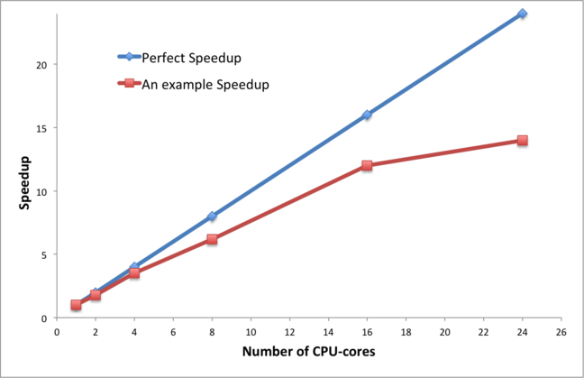
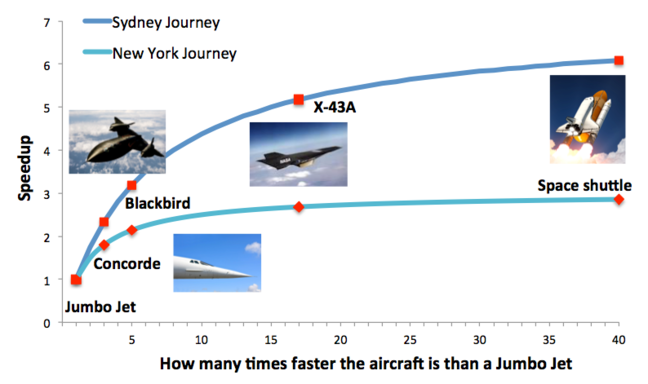

*Image courtesy of [Veri Ivanova](https://unsplash.com/@veri_ivanova) from [Unsplash](https://unsplash.com)*

## Parallel Performance

We have seen that parallel supercomputers have enormous potential computing power - the largest machine in the Top500 list has peak performances in excess of 1000 Petaflops. This is achieved by having hundreds of thousands of CPU-cores and GPGPU's in the same distributed-memory computer, connected with a fast network.

When considering how to parallelise even the simplest calculations (such as the traffic model) using the message-passing model, we have seen that this introduces overheads: making a phone call to someone in a another office takes time, and this is time when you are not doing any useful calculations.

We therefore need some way of measuring how well our parallel computation is performing: is it making the best use of all the CPU-cores? The input to all these metrics is the time taken for the program to run on $P$ CPU-cores which we will call $T_P$ .

The standard measure of parallel performance is called the parallel speedup. We measure the time taken to do the calculation on a single CPU-core, and the time taken on $P$ CPU-cores, and compute the parallel speedup $S_P$:

$$
S_p = \frac{T_1}{T_P}
$$

For example, if the program took 200 seconds on 1 CPU-core (i.e. running in serial) and 25 seconds on 10 CPU-cores then the parallel speed-up is

$$
S_{10} = \frac{T_1}{T_{10}} = \frac{100}{25} = 8
$$
 
Ideally we would like our parallel program to run 10 times faster on 10 CPU-cores, but this is not normally possible due to the inevitable overheads. In general, $S_P$ will be less than $P$.

Another way of quantifying this is to compute the parallel efficiency:   

$$
E_P = \frac{S_P}{P} 
$$

This gives us an idea of how efficiently we are using the CPU-cores. For the example given above, the parallel efficiency is

$$
E_{10} = \frac{S_{10}}{10} = \frac{8}{10} = 0.80 = 80 \% 
$$

Ideally we would like our parallel program to be 100% efficient, but in general $E_P$ will be less than 1.0 (i.e. less than 100%).

When considering the way a parallel program behaves, the standard approach is to measure the performance for increasing values of P and to plot a graph of either parallel speedup or parallel efficiency against the number of CPU-cores.

We call this a scaling curve - we are trying to understand how well the performance scales with increasing numbers of CPU-cores. We talk about whether or not a program scales well or scales poorly (or has good or bad scalability).
For some problems a parallel efficiency of 80% will be considered to be very good and for others not so good. Can you think of a reason why that is?

---

*Image courtesy of [Patrick Tomasso](https://unsplash.com/@impatrickt) from [Unsplash](https://unsplash.com)*

## Scaling and Parallel Overheads

It is always useful to have some simple examples to help us understand why a parallel program scales the way it does. If we double the number of CPU-cores, does the performance double? If not, why not?

Consider the following example of flying from a hotel in central London to a holiday destination. In this example:

- the top speed of the aeroplane represents the computing power available: doubling the speed of the plane is equivalent to doubling the number of CPU-cores in our parallel computer;
- the distance we travel is equivalent to the size of the problem we are tackling; travelling twice as far is equivalent to doubling the number of cells in our traffic model.

We will consider two journeys: from Central London to the Empire State Building in New York (5,600 km), and Central London to Sydney Opera House (16,800 km: 3 times as far).

We will consider two possible aeroplanes: a Jumbo Jet (top speed 700 kph) and Concorde (2100 kph: 3 times as fast).

The important observation is that the total journey time is the flight time plus the additional overheads of travelling between the city centre and the airport, waiting at check-in, clearing security or passport control, collecting your luggage etc. For simplicity, let’s assume that travel to the airport takes an hour by bus each way, and that you spend an hour in the airport at each end.

| Plane	| Destination |	Flight Time | Over-head | Total Journey | Speed-up S3 | Efficiency E3 |
| --- | --- | --- | --- | --- | --- | --- |
| Jumbo Jet |	New York | 8:00 | 4:00 | 12:00 |	 	 
| Concorde	| New York | 2:40 |	4:00 | 6:40 | 1.8 | 60% |
| Jumbo Jet | Sydney | 24:00 | 4:00 | 28:00 |
| Concorde | Sydney | 8:00 | 4:00 |	12:00 |	2.3	| 78% |

Try to answer the following questions:

- does the journey overhead depend on the distance flown?
- what is the speedup for the first journey for a plane 10 or 100 times faster than Concorde?
- what does it tell you about the limits of parallel computing?
- what is the speedup for the second journey for a plane 10 or 100 times faster than Concorde?
- why do you think it’s different from the first journey’s speedup?
- what does it tell you about the possibilities of parallel computing?

---

*Image courtesy of [Wesley Tingey](https://unsplash.com/@wesleyphotography) from [Unsplash](https://unsplash.com)*

## Parallel Performance Laws

The two most common ways to understand parallel scaling are called Amdahl’s Law and Gustafson’s Law. However, like many laws they boil down to simple common sense and are easily understandable using everyday examples.

Let’s have another look at the example from the previous step.

The key point here is that the overhead does not depend on the distance flown by the aircraft. In all cases you spend two hours travelling to and from the airports, and two hours waiting around in the airports: a total of four hours.

The journey to New York illustrates Amdahl’s Law - the speedup is less than 3.0 because of the overheads. In a parallel program, these overheads can be characterised as serial parts of the calculation, i.e. parts of the calculation that do not go any faster when you use more CPU-cores. Typical examples can include reading and writing data from and to disk (which is often done via single CPU-core), or the time spent in communications.

In fact, Gene Amdahl used this simple example to argue, way back in 1967, that parallel computing was not very useful in practice - no matter how fast your parallel computer is, you cannot eliminate the serial overheads. Even if we had a starship travelling at almost the speed of light, the journey time to New York would never be less than 4 hours so the speedup would never exceed 3.0. The fact that we can only make the calculation three times faster even if we use thousands of CPU-cores is a little dispiriting…

However, the journey to Sydney illustrates Gustafson’s Law - things get better if you tackle larger problems because the serial overheads stay the same but the parallel part gets larger. For the large problem, our maximum speedup would be 7.0.

Scaling plot for New York and Sydney Journeys (image)

Amdahl’s law can be expressed in equations as:

$$
S_P = \frac{P}{(\alpha P + (1-\alpha))}
$$

where alpha is the fraction of the calculation that is entirely serial. For example, for the New York journey then

$$
 \alpha = \frac{4\, \rm hours}{12\, \rm hours} = 0.33 
$$

Amdahl’s law predicts that, although the speedup always increases with P, it never exceeds 1/$\alpha$. For the New York trip, this means the speedup is limited to 3.0 which is what we already observed.

If you are interested in more details (and more maths!) then you can visit Wikipedia ([Amdahl’s Law](https://en.wikipedia.org/wiki/Amdahl%27s_law) and [Gustafson’s Law](https://en.wikipedia.org/wiki/Gustafson%27s_law)), but all the equations can sometimes obscure what is really a common-sense result.

---

*Image courtesy of [Jake Givens](https://unsplash.com/@jakegivens) from [Unsplash](https://unsplash.com)*

## Scaling Behaviour of the Traffic Simulation

Let’s consider the traffic model parallelised using message-passing – you and three colleagues are working together on the traffic model in different offices. You each have your own chess set with pawns representing the cars, but you need to phone each other if you want to exchange information.

For the sake of argument, let’s also assume that you can update your chess board at the rate of two cells per second, i.e. if you had 8 cells then each timestep would take you 4 seconds.

For a road of 20 cells, work out how long it takes to do a single iteration in serial (one person) and in parallel (all four people). You will need to count how many phone calls you need to make, and make a guess as to how long each phone call will take.

For simplicity, we will not bother to compute the average speed of the cars and you can ignore any startup costs associated with telling everyone the initial distribution of cars.

What is the speedup using four people, S4, for this calculation?

Is parallel computing worthwhile here?

Compute the speedup S4 for roads of length 200, 2000 and 20000 cells - what do you observe? You could also compute S2 and S3 to see how each problem size scales with increasing P.

To what extent do these figures agree or disagree with Amdahl’s law and Gustafson’s Law?

These calculations, require you to make a number of assumptions so when comparing answers with your fellow learners you should not focus on the numerical results so much. Looking at the reasoning behind each of the assumptions and comparing your overall conclusions should be more interesting.

---
## Terminology Recap

::::challenge{id=pcing_programming.1 title="Parallel Computing Programming Q1"}
The standard measure of parallel performance is called the parallel ____ .
For P CPU-cores it is calculated as the time taken to run a program on ____
CPU-core divided by the time taken to run it on ____ CPU-cores.

:::solution
A) speed up

B) one

C) P
:::
::::

::::challenge{id=pcing_programming.2 title="Parallel Computing Programming Q2"}
In parallel computing, the parallel ____ is used to measure how efficiently the CPU-cores are utilised. Although, we would like this to be as high as possible, it is typically less than ____.

:::solution
A) efficency 

B) 1.0
:::
::::

::::challenge{id=pcing_programming.3 title="Parallel Computing Programming Q3"}
The plot showing the performance of a parallel program with increasing number of CPU-cores is referred to as a ____ ____ . The fact that parallel programs do not scale perfectly (i.e. the speedup is not equal to the number of CPU-cores) is explained by an equation called ____ ____ .

:::solution
A) scaling curve

B) Amdahl's Law
:::
::::
