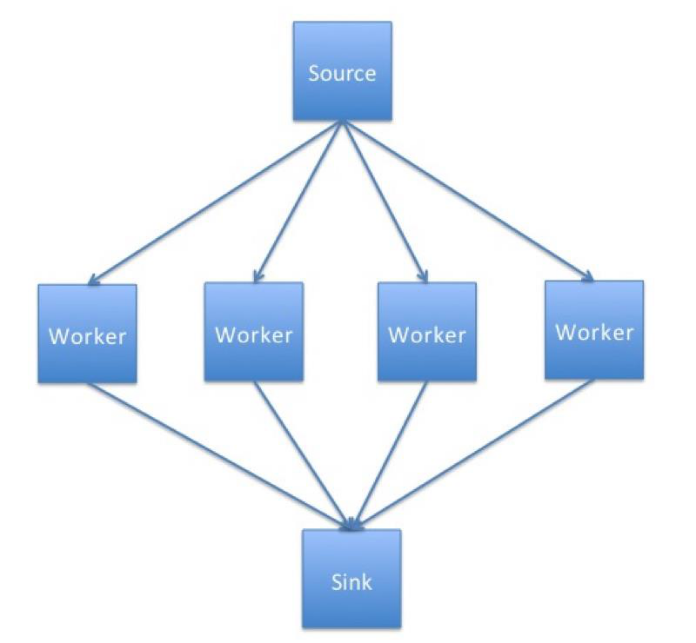
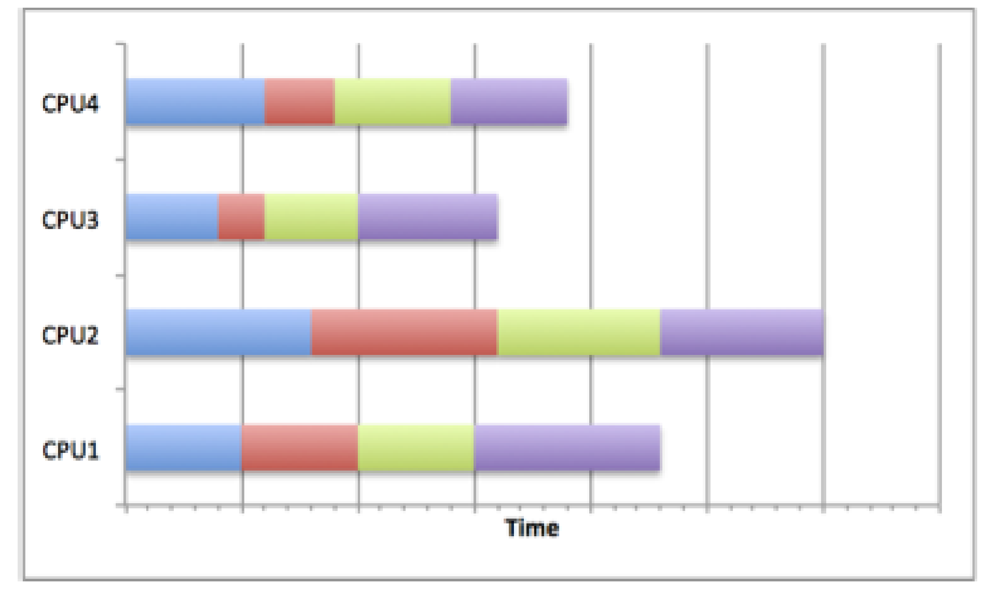
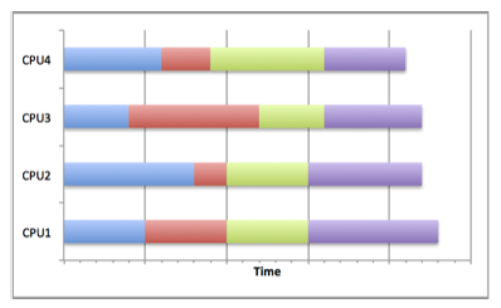

## Part 1: Introduction & Theory

### Mandelbrot Set

The Mandelbrot set is a famous example of a fractal in mathematics. It is a set of complex numbers $c$ for which the function

$f_c(z) = z^2 + c$

does not diverge to infinity when iterated from $z=0$, i.e the values of $c$ for which the sequence

$[ c,\ c^2+c,\ (c^2+c)^2+c,\ ((c^2+c)^2+c)^2+c,\ ...]$

remains bounded.

The complex numbers can be thought of as 2d coordinates, that is a complex number $z$ with real part $a$ and imaginary part $b$ ($z = a + ib$) can be written as $(a, b)$. The coordinates can be plotted as an image, where the color corresponds to the number of iterations required before the escape condition is reached. The escape condition is when we have confirmed that the sequence is not bounded, this is when the magnitude of $z$, the current value in the iteration, is greater than 2.

The pseudo code for this is:

```python
for each x,y coordinate 
    x0, y0 = x, y
    x = 0
    y = 0
    iteration = 0
    while (iteration < max_iterations and x^2 + y^2 <= 4 )
        x_next = x^2+y^2 + x0
        y_next = 2*x*y + y0

        iteration = iteration + 1

        x = x_next
        y = y_next

    return color_map(iteration)
```

Note that for points within the Mandelbrot set
the condition will never be met, hence the need to set the upper bound ``max_iterations``.

The Julia set is another example of a complex number set.

From the parallel programming point of view the useful feature of the Mandelbrot and Julia sets is that the calculation for each point is independent i.e. whether one point lies within the set or not is not affected by other points.

### Parallel Programming Concepts

#### Task farm

Task farming is one of the common approaches used to parallelise applications. Its main idea is to automatically create pools of calculations (called tasks), dispatch them to the processes and the to collect the results.

The process responsible for creating this pool of jobs is known as a **source**, sometimes it is also called a *master* or *controller process*.

The process collecting the results is called a **sink**. Quite often one process plays both roles – it creates, distributes tasks and collects results. It is also possible to have a team of source and sink process. A ‘farm’ of one or more workers claims jobs from the source, executes them and returns results to the sink. The workers continually claim jobs (usually complete one task then ask for another) until the pool is exhausted.

Figure 1 shows the basic concept of how a task farm is structured.


*Schematic representation of a simple task farm*

In summary processes can assume the following roles:

- **Source** - creates and distributes tasks
- **Worker processes** - complete tasks received from the source process and then send results to the sink process
- **Sink** - gathers results from worker processes.

Having learned what a task farm is, consider the following questions:

- What types of problems could be parallelised using the task farm approach? What types of problems would not benefit from it? Why?
- What kind of computer architecture could fully utilise the task farm benefits?

#### Using a task farm

As you may have guessed a task farm is commonly used in large
computations composed of many independent calculations. Only when
calculations are independent is it possible to assign tasks in the most effective
way, and thus speed up the overall calculation with the most efficiency. After
all, if the tasks are independent from each other, the processors can request
them as they become available, i.e. usually after they complete their current
task, without worrying about the order in which tasks are completed.

This dynamic allocation of tasks is an effective method for getting more use
out of the compute resources. It is inevitable that some calculations will take
longer to complete than others, so using methods such as a lock-step
calculation (waiting on the whole set of processors to finish a current job) or
pre-distributing all tasks at the beginning would lead to wasted compute
cycles.
Of course, not all problems can be parallelised using a task farm approach.

#### Not always a task farm

While many problems can be broken down into individual parts, there are a
sizeable number of problems where this approach will not work. Problems
which involve lots of inter-process communication are often not suitable for
task farms as they require the master to track which worker has which
element, and to tell workers which other workers have which elements to
allow them to communicate. Additionally, the sink progress may need to
track this as well in cases of output order dependency.
It is possible to use task farms to parallelise problems that require a lot of
communications, however, in such cases drawbacks and overheads
impacting the performance would be incurred.
As mentioned before, to determine the points lying within the Mandelbrot set
there is no need for the communications between the worker tasks, which
makes it an embarrassingly parallel problem that is suitable for task-farming.
Although the calculation can employ the task farm approach, we still need to
consider how to use it in the most optimal way.

Consider the following scenarios:

- How do you think the performance would be affected if you were to use
more, equal and fewer tasks than workers?
- In your opinion what would be the optimal combination of the number
of workers and task? What would it depend on the most? Task size?
Problem size? Computer architecture?

### Load Balancing

The factor deciding the effectiveness of a task farm is a task distribution. A
way in which a master process determines how the tasks are distributed
across the workers it called a load balancing.

A successful load balancing will avoid overloading a single worker,
maximising the throughput of the system and making best use of resources
available. Poor load balancing will cause some workers of the system to be
idle and consequently other elements to be ‘overworked’, leading to increased
computation time and significantly reduced performance.

#### Poor load balancing

The figure below shows how careless task distribution can affect the completion time.
Clearly, CPU2 needs more time to complete its tasks, particularly compared
to CPU3. The total runtime is equivalent to the longest runtime on any of the
CPUs so the calculation time will be longer than it would be if the resource
were used optimally. This can occur when load balancing is not considered,
random scheduling is used (although this is not always bad) or poor decisions
are made about the job sizes.


*Poor load balance*

#### Good Load Balancing

The next figure below shows how by scheduling jobs carefully, the best use of the
resources can be made. By choosing a distribution strategy to optimise the
use of resources, the CPUs in the diagram all complete their tasks at roughly
the same time. This means that no one task has been overloaded with work
and dominated the running time of the overall calculation. This can be
achieved by many different means.

For example, if the task sizes and running times are known in advance, the
jobs can be scheduled to allow best resource usage. The most common
distribution is to distribute large jobs first and then distribute progressively
smaller jobs to equal out the workload.

If the job sizes can change or the running times are unknown, then an
adaptive system could be used which tries to infer future task lengths based
upon observed runtimes.


*Good load balance*

The fractal program you will be using employs a queue strategy – tasks are queued waiting for workers, which completed their previous task, to claim them from the top of the queue. This ensures that workers that happen to get shorter tasks will complete more tasks, so that they finish roughly at the same time as workers with longer tasks.

#### Quantifying the load imbalance

We can try to quantify how well balanced a task farm is by computing the load imbalance factor, which we define as:

$\text{load imbalance factor} = \frac{\text{Workload of most loaded worker}}{\text{average workload of workers}}$

For a perfect load-balanced calculation this will be equal to 1.0, which is equivalent to all workers having exactly the same amount of work. In general, it will be greater than 1.0.
It is a useful measure because it allows you to predict what the runtime would be for a perfectly balanced load on the same number of workers, assuming that no additional overheads are introduced due to load balancing. For example, if the load imbalance factor is 2.0 then this implies that, in principle, we could halve the runtime (reduce it by a factor of 2) if the load were perfectly balanced.

---

## Part 2: Compile and Run

Let's compile and run the example fractal code which makes use of MPI.

### Compiling the source code

```bash
cd foundation-exercises/fractal/C-MPI
ls
```

Similarly to the previous examples, we can compile the serial source code by doing:

```bash
make
```

Again, if running this on your own machine locally, you may need to edit the `Makefile` to change the compiler used. You can then run the code directly with `mpiexec`, e.g. `mpiexec -n 4 ./fractal` to run it with 4 processes.

If you're running this on ARCHER2 you'll note that the created executable `fractal` cannot be run directly, since if you try you get:

```output
ERROR: need at least two processes for the task farm!
```

::::challenge{id=parallel_prog_pr.1 title="Submitting a Fractal MPI job"}
**To be able to run the job submission examples in this segment, you'll need to either have access to ARCHER2, or an HPC infrastructure running the Slurm job scheduler and knowledge of how to configure job scripts for submission.**

So on an HPC infrastructure, we'll need (and should!) submit this as a job via Slurm.
Write a script that executes the fractal MPI code that uses 16 worker processes on a single node.

:::solution
So in order to have this generated using two worker processes, we need to set `tasks-per-node` to 17,
to accomodate the sink process. e.g. on ARCHER2:

```bash
#!/bin/bash

#SBATCH --job-name=Fractal-MPI
#SBATCH --nodes=1
#SBATCH --tasks-per-node=17
#SBATCH --cpus-per-task=1
#SBATCH --time=00:01:00

# Replace [project code] below with your project code (e.g. t01)
#SBATCH --account=[project code]
#SBATCH --partition=standard
#SBATCH --qos=standard

srun ./fractal
```

:::
::::

Once complete, you should find the log file contains something like the following:

```output
--------- CONFIGURATION OF THE TASKFARM RUN ---------

Number of processes:         17
Image size:                  768 x 768
Task size:                   192 x 192 (pixels)
Number of iterations:        5000
Coordinates in X dimension:  -2.000000 to 1.000000
Coordinates in Y dimension:  -1.500000 to 1.500000

-----Workload Summary (number of iterations)---------

Total Number of Workers: 16
Total Number of Tasks:   16

Total   Worker Load: 498023053
Average Worker Load: 31126440
Maximum Worker Load: 156694685
Minimum Worker Load: 62822

Time taken by 16 workers was 0.772049 (secs)
Load Imbalance Factor: 5.034134
```

The ``fractal`` executable will take a number of parameters and produce a fractal image in a file called ``output.ppm``. By default the image will be
overlaid with blocks in different shades, which correspond to the work done by different processors. This way we can see how the tasks were allocated. An example of this is presented in figure 1 – the image is divided into 16 tasks (squares) and a different shade of red corresponds to each of the workers. For example, running this on ARCHER2 with 16 workers will therefore yield 16 shades of red, and running this on your own machine with 4 workers will yield 4 shades instead.


*Example output image created using 16 workers and 16 tasks.*

So in our example script, the program created a task farm with one master process and 2 workers. The master divides the image up into tasks, where each task is a square of the size of 192 by 192 pixels (the default size of each square). The default image size is thus 768 x 768 pixels, which means there is exactly 1 task per worker.

The load of a worker is estimated as the total number of iterations of the Mandelbrot calculation summed over all the pixels considered by that worker. The assumption is that the time taken is proportional to this. The only time that is actually measured is the total time taken to complete the calculation.

If on ARCHER2, use `scp` to copy the `output.ppm` image file back to your local machine to view it, otherwise if on your own machine open the file directly. In any event, your "pattern" of workers for each segment will likely differ than what's depicted here, depending on which workers were assigned which task and how many workers you used.

::::challenge{id=parallel_prog_pr.2 title="Removing Diagnostic Output"}
Try adding `-n` to `fractal`'s arguments in the submission script. What happens?

:::solution
You'll notice that the program no longer shades the output image depending on the worker that created it.
This is a good example of how to set up a parallel program that shows how it's making use of parallel resources in its output, which is useful for debugging across multiple processes.
However, it also allows you to generate a "proper" image without this information.
It can be really helpful, particularly in more complex parallel programs, to have such optional diagnostic output!
:::
::::

## Fractal Program Parameters

The following options are recognised by the fractal program:

- ``-S``  number of pixels in the x-axis of image
- ``-I``  maximum number of iterations
- ``-x`` the x-minimum coordinate
- ``-y`` the y-minimum coordinate
- ``-f <fractal function>`` set to J for Julia set
- ``-c`` the real part of the parameter c+iC for the Julia set
- ``-C`` the imaginary part of the parameter c+iC for the julia set
- ``-t`` task size (pixels x pixels)
- ``-n`` do not shade output image based on task allocation to workers

---

## Part 3: Investigation

**For this segment, if you're running this locally on your own machine assume 4 workers and 4 tasks, instead of 16 workers and 16 tasks - since it's quite possible your own machine will not be able to handle 16 parallel MPI processes.**

To explore the effect of load balancing run the code with different parameters and try to answer the following questions.

::::challenge{id=parallel_prog_pr.3 title="Predict Runtime"}
From the default run with 16 workers and 16 tasks, what is your predicted best runtime based on the load imbalance factor?

:::solution
The load balance factor for this run is 5.034134 (although this may vary slightly between runs).
Therefore, we would expect a speedup of approximately 5x if perfect load balance is achieved.
The runtime for this run was 0.772049s, so we should get an optimal runtime of something like 0.154s using 16 workers
:::
::::

::::challenge{id=parallel_prog_pr.4 title="Load Distribution"}
Look at the output for 16 tasks – can you understand how the load was distributed across workers by looking at the colours of the bands and the structure of the Mandelbrot set?

:::solution
The size of each task is set to a grid consisting of $192^2$ pixels, which means that for the default $768^2$ grid each worker gets allocated exactly one task to work on.
:::
::::

::::challenge{id=parallel_prog_pr.5 title="Exploring Load Imbalance"}
For 16 workers, run the program with ever smaller task sizes (i.e. more tasks) and create a table with each row containing grid size, runtime, and load imbalance factor. You should ensure you measure all the way up to the maximum number of tasks, i.e. a task size of a single pixel.
You can use `-t` as an argument to the `fractal` program to set the task/grid size.

:::solution

Running this on ARCHER2 with 16 workers, you may find your answers look something like:

| Grid size | Runtime(s) | Load imbalance factor
|-----------|------------|----------------------
| 192       | 0.772049   | 5.034134
| 96        | 0.237510   | 1.545613
| 48        | 0.170243   | 1.107278
| 24        | 0.160345   | 1.041810
| 12        | 0.155502   | 1.006157
| 6         | 0.159350   | 1.003959
| 3         | 0.176114   | 1.005451
| 2         | 0.211402   | 1.004163
| 1         | 0.417041   | 1.003397

Running this on a local machine with 3 workers, you may find your answers look more like:

| Grid size | Runtime(s) | Load imbalance factor
|-----------|------------|----------------------
| 192       | 1.298491   | 1.337907
| 96        | 1.003863   | 1.015820
| 48        | 0.955120   | 1.006782
| 24        | 0.970588   | 1.007317
| 12        | 0.983153   | 1.013827
| 6         | 0.981687   | 0.990886
| 3         | 1.024623   | 1.032792
| 2         | 1.019592   | 1.003972
| 1         | 1.132916   | 1.015426

Of course, your figures may differ somewhat!
:::
::::

::::challenge{id=parallel_prog_pr.6 title="Analysis"}
Can you explain the form of the table/graph?
Does the minimum runtime approach what you predicted from the load imbalance factor?

:::solution
Based on the distribution of the tasks in our generated image, the workers responsible for the bottom and top rows of the grid, as well as the left column had very little work to do, whereas the middle 4 cells had the most work, based on their overlap with the Mandelbrot set (the black areas require the most cycles to compute).

Clearly the load imbalance is quite high because once a worker has finished processing its task there is no additional work it can do. In order to remedy this we can reduce the size of the tasks that are assigned to the workers. Looking in our table, we see that the time to solution and load imbalance factors drop rapidly.

If on ARCHER2, for example, the fastest runtime is achieved for tasks with a gridsize of 12, by which point the load imbalance factor is only 1.0062. The load imbalance factor continues to decrease somewhat, but the runtimes increase for smaller grid sizes due to the cost of having to do more communication with the controller process to be assigned a new task. Effectively the master process has become a bottleneck because it cannot assign work to the workers fast enough. This point may be reached at different task sizes depending on how many workers there are. Depending on the problem size and complexity,a large number of workers will require a relatively larger task size to prevent the controller process becoming the bottleneck.

If running this on your own machine with a lower number of workers, you may see a similar "shape" to the numbers or graph, with an initially high imbalance factor that decreases to around 1.0 even faster. Correspondingly, the runtime also initially decreases and then increases again as the master process becomes a bottleneck, although with fewer workers this variance is less pronounced.
:::
::::
