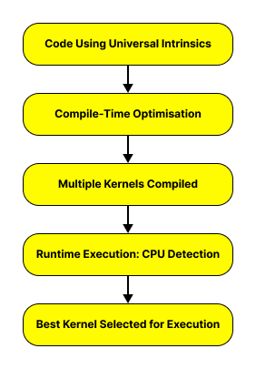

---
name:Parallelisation in NumPy
dependsOn: []
tags: []
---


## What is Numpy?

NumPy (Numerical Python) is an open source project that enables numerical computing with Python. It provides powerful tools for working with large, multi-dimensional arrays and matrices, along with mathematical functions to operate on these structures efficiently. 

NumPy is optimised for fast computation - giving better speed than is available using the regular built-in `Math` library.

## SIMD in NumPy

CPUs support vectorisation through SIMD operations. NumPy currently supports X86, IBM/Power, ARM7 and ARM8 architectures.

The optimisation process in NumPy is carried out in three layers:

- Universal Intrinsics: NumPy uses a set of platform-independent intrinsics mapped to specific CPU instruction sets (e.g., AVX, SSE) to generate multiple optimized kernels for the same function.
- Compile-Time Optimization: During compilation, CPU build options define the minimum (baseline) and additional (dispatched) instruction sets, enabling multiple kernel versions.
- Runtime Dispatching: At import, NumPy detects the CPU’s supported features and selects the most optimized kernel for execution.
 


## Multithreading in NumPy

NumPy uses multithreading to speed up computations by running operations in parallel on multiple CPU cores.

:::callout{variant="note"}
NumPy itself doesn't manage threads explicitly, but relies on underlying libraries (like OpenMP and pthreads).
:::

NumPy does not parallelise all operations. It mainly using multithreading for:
- Large matrix operations (e.g., `np.dot()`, `np.matmul()`, `np.linalg.inv()`)
- Reduction operations (e.g. `np.sum()`, `np.mean()`, `np.std()`)
- Certain element-wise operations (dependent on build settings)


## BLAS (Basic Linear Algebra Subprograms)
BLAS is a highly optimised library for performing fundamental vector and matrix operations efficiently. NumPy uses BLAS internally to speed up numeric computations.

| BLAS Library    | Developer | Optimised For |
| -------- | ------- | ----- |
| OpenBLAS  | Open Source    | General-purpose CPUs |
| Intel MKL | Intel    | Intel CPUs |
| Apple Accelerate    | Apple    | Apple Silicon (ARM) |


You can verify the BLAS backend linked to your NumPy installation using:
```python
import numpy as np
np.show_config()
```

BLAS accelerates several NumPy operations, especially linear algebra functions from `np.linalg`.
## Example

In this example, we'll show using NumPy to calculate the Mandelbrot set escape time.

:::callout
For a complex number $c$, the Mandelbrot function is defined as:
$$ Z_{n+1} = Z_{n}^2 + c $$

Where $Z_0 = 0$. If $|Z_n|$ grows beyond $2$, the number escapes the Mandelbrot set. The escape time is how many iterations this takes before exceeding the threshold.
:::


### Naive NumPy Implementation (Single Threaded)

```python
import numpy as np

def mandelbrot_escape_time(xmin, xmax, ymin, ymax, width, height, max_iter):
    """Computes Mandelbrot escape times for a grid of complex numbers."""
    
    # Make the grid of complex numbers
    X = np.linspace(xmin, xmax, width)
    Y = np.linspace(ymin, ymax, height) 
    C = X[:, np.newaxis] + 1j * Y[np.newaxis, :]
    Z = np.zeros_like(C, dtype=np.complex128)
    escape_time = np.zeros(C.shape, dtype=np.int32)

    # Calculate the escape times
    for i in range(max_iter):
        mask = np.abs(Z) <= 2 # Create a boolean mask where |Z| <= 2
        Z[mask] = Z[mask] ** 2 + C[mask]
        escape_time[mask] += 1

    return escape_time
```

The Mandelbrot escape time calculation is iterative. This means that each step depends on the previous one ($Z[n+1] = Z[n]² + C$), so it's not vectorized efficiently.

NumPy's multithreading applies to whole-array operations. In this example we are updating values selectively (only where $|Z| <= 2$), which disrupts efficient parallel execution.

Instead of relying on NumPy’s OpenMP (which won’t parallelize this custom loop), we split the workload into separate processes using `multiprocessing`.

This works because each process runs independently and does not share Python objects, avoiding the GIL (Global Interpreter Lock) altogether.


```python
import numpy as np
import multiprocessing

def mandelbrot_worker(y_start, y_end, xmin, xmax, ymin, ymax, width, height, max_iter):
    """Worker function for parallel Mandelbrot computation."""
    return mandelbrot_escape_time(xmin, xmax, ymin + (y_start / height) * (ymax - ymin), 
                                  ymin + (y_end / height) * (ymax - ymin), 
                                  width, y_end - y_start, max_iter)

def mandelbrot_parallel(xmin, xmax, ymin, ymax, width, height, max_iter, num_workers):
    """Computes Mandelbrot set using multiprocessing."""
    chunk_size = height // num_workers
    pool = multiprocessing.Pool(processes=num_workers)
    
    jobs = [pool.apply_async(mandelbrot_worker, (i, i + chunk_size, xmin, xmax, ymin, ymax, width, height, max_iter)) 
            for i in range(0, height, chunk_size)]
    
    results = [job.get() for job in jobs]
    pool.close()
    pool.join()
    
    return np.vstack(results)  # Stack results back together

# Run with 4 CPU cores
result = mandelbrot_parallel(-2, 1, -1.5, 1.5, 1000, 1000, 100, num_workers=4)

```