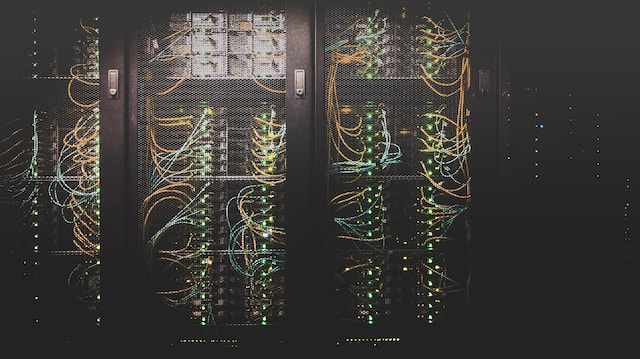
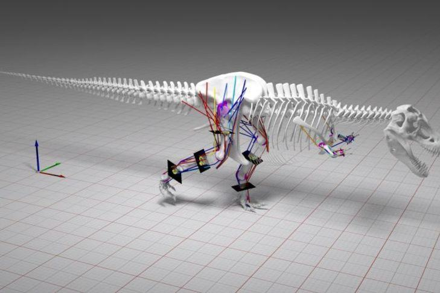
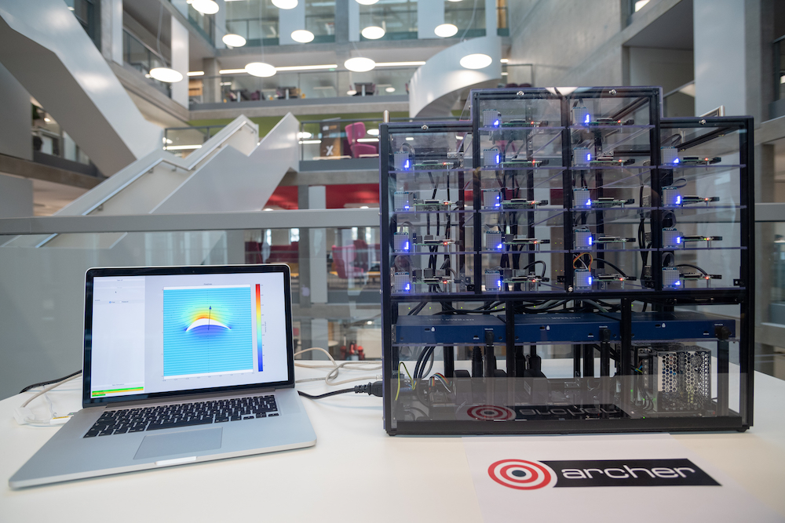

*Image courtesy of [Taylor Vick](https://unsplash.com/@tvick) from [Unsplash](https://unsplash.com)*

## Supercomputers - what are they?

A supercomputer is a computer with very high-level computational capacities compared to a general-purpose computer such as a personal desktop or laptop.

Clearly this is a moving target - today’s laptop would have been a supercomputer only a couple of decades ago - but no matter how fast today’s general-purpose computers are, there will always be a need for much more powerful machines.

Supercomputers were first introduced in the 1960s by Seymour Roger Cray at Control Data Corporation (CDC), and have been used intensively in science and engineering ever since. To keep track of the state-of-the-art, the supercomputing community looks to the Top500 list, which ranks the fastest 500 supercomputers in the world every six months. We will look at this list in more detail in the next activity.

### Number crunching
So why do we need supercomputers? Who uses them and what are they used for? We will see that their main application is in large-scale numerical computations, also called number-crunching. Of course, for simple calculations such as:

~~~
123 + 765 = 888
~~~

or

~~~
1542.38 x 2643.56 = 4077374.07
~~~

You don’t need a supercomputer. In fact you don’t even need a personal computer, as pencil-and-paper or a simple calculator can do the job. If you want to calculate something more complex, such as the total of the salaries of every employee in a big company, you probably just need a general-purpose computer.

The types of large-scale computations that are done by supercomputers, such as weather-forecasting or simulating new materials at the atomic scale, are fundamentally based on simple numerical calculations that could each be done on a calculator. However, the sheer size of these computations and the levels of accuracy required means that almost unimaginably large numbers of individual calculations are needed to do the job. To produce an accurate weather forecast, the total number of calculations required is measured in the quintillions, where a quintillion is one with 18 zeroes after it: 1 000 000 000 000 000 000 !

So what if a computation takes several days or weeks to finish, and you want to run the same calculations many times with different input parameters. Do you want to wait while you can’t do anything else because the computation uses up all the resources of your computer? Are you prepared to wait for years before being able to collect all the results? Probably not, especially if the result you’re after is tomorrow’s weather. This is where supercomputers come into their own, finishing a job within a few hours or days when it would take many years on a general-purpose computer, or tackling problems that are just too large or complex for an everyday machine to store in its memory.

### Parallelism: the key to performance
Supercomputers achieve this using parallel computing. Performing computations in parallel means carrying out many calculations simultaneously. It is like having thousands of general-purpose computers all working for you on the same problem at the same time. This is in fact an excellent analogy for how modern supercomputers work - you will learn more about the details of how it is done later in the course.

Also keep in mind that although supercomputers provide enormous computational capacities, they are also very expensive to develop, purchase and operate. For example, the typical power consumption of a supercomputer is in the order of several megawatts (Mega = 1 000 000), where a megawatt (MW) is enough to power a small town of around 1000 people. That is why it’s important to use them as efficiently as possible.

Can you think of other examples of parallelism in everyday life, where many hands make light work?

© SURFsara

---

## Supercomputers - why do we need them?

This UKRI video gives you an overview of why high performance computing is important aspect of modern scientific research.

::::iframe{width="100%" height="400" src="https://www.youtube.com/embed/NEgbVNIo560" title="YouTube video player" frameborder="0" allow="accelerometer; autoplay; clipboard-write; encrypted-media; gyroscope; picture-in-picture" allowfullscreen}
::::

In the video Prof. Mark Parsons uses the term of High Performance Computing (HPC). When reading about supercomputing, you will encounter this term quite often. HPC is a general term that includes all the activities and components associated with supercomputers, including aspects such as software and data storage as well as the bare supercomputer hardware.

Are there any applications of supercomputers you know of, that made you interested in this course?
We'll be covering other examples of how supercomputers are used in science later in this course.

*Computer simulation covering multiple physical phenomena and machine learning algorithms can predict how dinosaurs might have moved. The laws of physics apply for extinct animals exactly as they do for living ones. © 2016 ARCHER image competition*

## Supercomputers - how are they used?

To do science in the real world we have to build complicated instruments for each experiment: vast telescopes for astronomers to look deep into space, powerful particle accelerators so physicists can smash atoms together at almost the speed of light, or enormous wind tunnels where engineers can study how an aeroplane wing will operate in flight.

### Computer simulation

However, some problems are actually too large, too distant or too dangerous to study directly: we cannot experiment on the earth’s weather to study climate change, we cannot travel thousands of light years into space to watch two galaxies collide, and we cannot dive into the centre of the sun to measure the nuclear reactions that generate its enormous heat. However, one supercomputer can run different computer programs that reproduce all of these experiments inside its own memory.

This gives the modern scientist a powerful new tool to study the real world in a virtual environment. The process of running a virtual experiment is called computer simulation, and we will spend much of week 4 looking at this process in more detail. Compared to disciplines such as chemistry, biology and physics it is a relatively new area of research which has been around for a matter of decades rather than centuries. This new area, which many view as a third pillar of science which extends the two traditional approaches of theory and experiment, is called computational science and its practitioners are computational scientists.

### Computational Science

It’s important to be clear about the difference between computational science and computer science. Computer science is the scientific study of computers: it is through the work of computer scientists that we have the hardware and software required to build and operate today’s supercomputers. In computational science, however, we use these supercomputers to run computer simulations and make predictions about the real world. To make things even more confusing, if a computer scientist talks about a computer simulation then they would probably mean simulating a computer, i.e. running a simulation of a computer (not of the real world), which is something you might do to check that your design for a new microprocessor works correctly before going into production.

It is important to understand that large-scale computer simulation has applications in industry, applied engineering and commerce as well as academia. Modern cars and aeroplanes are designed and tested almost entirely by computer before they are ever constructed. A new car must pass crash safety tests before going to market: destructive testing of a new car is an expensive process in itself, but not nearly as expensive as having to redesign it should it fail the test. Computer simulation enables us to design new products that are much more likely to work correctly the very first time they are built.

### Breaking the world land speed record

This point was very well described by Andy Green, the driver of the Bloodhound SSC supersonic car which is aiming to break the world land speed record. In an interview on BBC’s 5 live Drive, broadcast on 4th January 2017, Adrian Goldberg asked Andy about the risks involved compared to the records set by the famous British driver Malcolm Campbell over 80 years ago:

Adrian: “But if you’re travelling at supersonic speeds and you’re breaking records, so by definition doing something that hasn’t been done before, there must be a risk?

Andy: “You’re missing the point between something that hasn’t been done before and something that is not fully understood. Back in the 1930’s, if you were doing something that hadn’t been done before, there was no other way of doing it apart from to go out and find out, to see what happens.

Nowadays you can actually produce a computer model in a supercomputer and spend literally years researching a programme down to an extraordinarily fine level of detail so that when you actually go out to push back the boundary of human endeavour, to achieve something absolutely remarkable that will make everybody look round and go ‘wow, that was impressive!’, you can actually do it in a safe, step-by-step controlled way. You can actually understand the problem in advance and that’s all the difference.”

© SURFsara, BBC

---

## Introducing Wee Archie

::::iframe{id="kaltura_player" width="100%" height="400" src="https://cdnapisec.kaltura.com/p/2010292/sp/201029200/embedIframeJs/uiconf_id/32599141/partner_id/2010292?iframeembed=true&playerId=kaltura_player&entry_id=1_vrq8zch9&flashvars[streamerType]=auto&amp;flashvars[localizationCode]=en&amp;flashvars[leadWithHTML5]=true&amp;flashvars[sideBarContainer.plugin]=true&amp;flashvars[sideBarContainer.position]=left&amp;flashvars[sideBarContainer.clickToClose]=true&amp;flashvars[chapters.plugin]=true&amp;flashvars[chapters.layout]=vertical&amp;flashvars[chapters.thumbnailRotator]=false&amp;flashvars[streamSelector.plugin]=true&amp;flashvars[EmbedPlayer.SpinnerTarget]=videoHolder&amp;flashvars[dualScreen.plugin]=true&amp;flashvars[Kaltura.addCrossoriginToIframe]=true&amp;&wid=1_jh4xeojf" allowfullscreen webkitallowfullscreen mozAllowFullScreen allow="autoplay *; fullscreen *; encrypted-media *" sandbox="allow-downloads allow-forms allow-same-origin allow-scripts allow-top-navigation allow-pointer-lock allow-popups allow-modals allow-orientation-lock allow-popups-to-escape-sandbox allow-presentation allow-top-navigation-by-user-activation" frameborder="0" title="Introducing_Wee_Archie_hd"}
::::

:::solution{title="Transcript"}
0:31 - So ARCHER is the UK National Supercomputing Service that we house here in Edinburgh as part of the University. And it’s funded by the UK Research Councils. And it can do many, many calculations per second. Actually, if you took all the people on the planet, then it would be the equivalent of all these people doing many, many, many calculations per second.

1:17 - It’s absolutely crucially important for simulation, things like simulation of weather, simulation of the cosmology, things like cancer analysis, cancer research, all sorts of different applications that maybe you wouldn’t have foreseen.

1:47 - There’s a real keen push to encourage the next generation of scientists to get into science, and to get into computing in general.
:::

In your mind, you probably already have an image of a supercomputer as a massive black box. Well, they usually are just that - dull looking cabinets connected by a multitude of cables. To make things more interesting, we introduce Wee ARCHIE!

Wee ARCHIE is a suitcase-sized supercomputer designed and built to explain what a supercomputer is.

We will return to Wee ARCHIE, and its big brother ARCHER, later in the course to explain the hardware details of supercomputers.

You can find instructions on how to configure your very own Raspberry Pi cluster [here](https://epcced.github.io/wee_archlet/).

---

## Terminology Recap

::::challenge{id=sc_intro.1 title="Supercomputing intro Q1"}
Performing computations in _____
means carrying out many calculations simultaneously.

:::solution
Parallel
:::
::::

::::challenge{id=sc_intro.2 title="Supercomputing intro Q2"}
The term HPC stands for ?

:::solution
High Performance Computing
:::
::::

::::challenge{id=sc_intro.3 title="Supercomputing intro Q3"}
The process of running a virtual experiment is called?

:::solution
Computer simulation
:::
::::

::::challenge{id=sc_intro.4 title="Supercomputing intro Q4"}
The term number-crunching refers to large-scale ____ ____.

:::solution
Numerical simulations
:::
::::

::::challenge{id=sc_intro.5 title="Supercomputing intro Q5"}
The typical power consumption of a supercomputer is in the order of several
____.

:::solution
Megawatts
:::
::::
