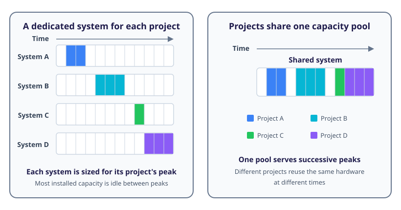
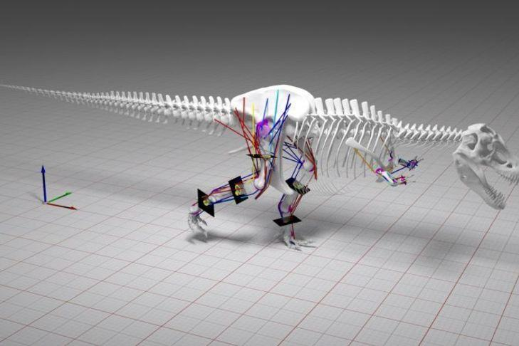

## What Is a Supercomputer?

A supercomputer is a computing system designed to solve problems that would be impractical on an ordinary desktop or laptop.
It can perform far more calculations, hold much larger datasets in memory and move data between its components at much higher rates.

There is no permanent threshold at which a computer becomes a supercomputer.
As computing technology advances, capabilities that were once found only in supercomputers become available in everyday machines.
The term therefore describes the most capable systems of their time rather than a fixed specification.

Modern supercomputers are not simply faster versions of desktop computers.
Instead, they combine many processors with large amounts of memory and storage, spread across compute nodes connected by high-speed networks.
These components work together as one system to give performance that could not be achieved by a single system.

*High-performance computing* (HPC) is the broader practice of using powerful computing systems to solve demanding problems.
It includes the hardware, software, algorithms and operational expertise required to make effective use of a supercomputer.

## Why Do We Need Supercomputers?

Large computations consist of familiar arithmetic and logical operations repeated many times.
The challenge comes from the sheer number of these operations, the quantity of data and the time available to produce a result.

Supercomputers are used to address three common requirements:

1. **Time to solution:** A result may be useful only if it is produced before a deadline, as with operational weather forecasting.
1. **Problem size:** A calculation may require more memory or storage than one computer can provide.
1. **Throughput:** Researchers may need to complete many related calculations, such as testing thousands of candidate materials or model configurations.

Real world workloads often combine all three requirements.
A climate study, for example, might use a large model, run it for many scenarios and need the complete set of results within a practical timescale.

Supercomputers meet these requirements primarily through *parallel computing*: dividing work such that many processing units can contribute at the same time.
Parallelism can reduce the runtime of one calculation, allow parts of a large problem to be stored across several computers, and enable many independent calculations to run concurrently.

### Why Are Supercomputers Shared?

The computing demand of an individual project is often uneven.
A research group might need 100 compute nodes for two days each month but very little computing power for the rest of the time.
Hardware dedicated to that group would have to provide for its *peak demand* of 100 nodes, even though its average use would be fewer than seven nodes.
Most of the system would therefore spend most of the month idle.

A central facility can pool the demands of many projects whose peaks occur at different times.
This allows each project to use substantial computing capacity when it needs it while keeping the system as a whole more highly utilised.

*This simplified example assumes that the projects' peaks do not overlap. When they do overlap, demand may exceed the shared capacity and some work must wait.*

It also spreads costs of electrical power, cooling, physical space, high-performance storage and specialist support across many users.
For workloads with intermittent demand, a shared system can therefore be more cost-effective than separately provisioning enough local hardware for every project's peak.
It is for these reasons that an increasing fraction of computationally intensive research work is being performed on these shared, centralised systems rather than on local hardware.

Pooling demand does not remove capacity limits.
If many users need the system at the same time, some work must wait, so access to a shared system must be managed.
The balance between efficient overall utilisation and immediate availability is a fundamental trade-off of centralised computing facilities.

::::challenge{id=sc_intro.requirements title="Why Does This Workload Need HPC?"}
Consider these three workloads:

1. A flood-forecasting model must finish within 20 minutes so that its result can inform an emergency response.
2. A turbulence simulation requires several terabytes of memory to hold its computational mesh.
3. A materials team must evaluate 50,000 candidate structures by the end of the week.

For each workload:

1. Identify whether its clearest requirement is time to solution, problem size or throughput.
1. Explain how access to more computing resources could help.
1. Identify one question you would ask before deciding that the workload could use those resources effectively.

:::solution
The flood forecast is primarily constrained by **time to solution**.
Running different parts of the forecast calculation concurrently could produce the result sooner, but only if the program contains work that can be divided and coordinated efficiently.
A useful first question is how much of the calculation can execute in parallel.

The turbulence simulation is primarily constrained by **problem size**.
The mesh could be divided between several computers so that their combined memory holds the complete dataset.
A useful first question is how often those computers would need to exchange data, because communication can become a performance bottleneck.

The materials study is primarily constrained by **throughput**.
Independent candidates could be evaluated concurrently on different processing units or computers.
A useful first question is whether the candidates really are independent, or whether any results must be shared between them.

These classifications are not absolute.
The forecast may also need a large amount of memory, while the turbulence simulation may also have a deadline.
Identifying the main constraint is a starting point for choosing appropriate computing resources, not proof that adding more resources will solve the problem.
:::
::::

## How Are Supercomputers Used?

Computer simulation is one of the most important uses of supercomputers.
A simulation represents some aspect of the world as a mathematical model and uses computation to explore how that model behaves.
It allows researchers to investigate systems that would be too large, distant, dangerous, slow or expensive to study through direct experiments alone.

*This simulation combines several physical models to investigate how dinosaurs might have moved. © 2016 ARCHER image competition*

Large-scale simulations are used to study weather and climate, galaxies, materials, molecular interactions and the behaviour of engineered structures.
Engineers can also test designs virtually before building physical prototypes, reducing the cost of exploring alternatives and helping to identify problems earlier.

Simulation is not the only use of a supercomputer.
Supercomputers also analyse data from experiments and observations, train machine-learning models and process large collections of independent calculations.
Applications span scientific research, medicine, engineering and industry.

This course examines the architecture of modern supercomputers and how their performance is measured.
We will start with the multi-core processors found in everyday computers, then build towards shared-memory nodes, distributed systems and accelerators such as GPUs.
