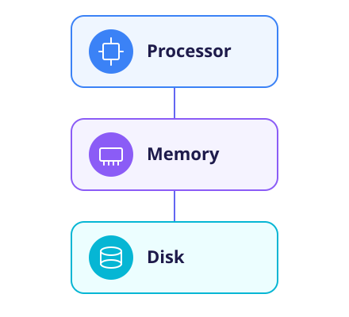
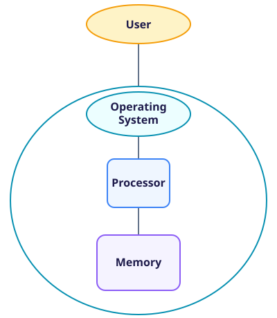
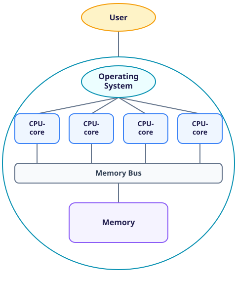
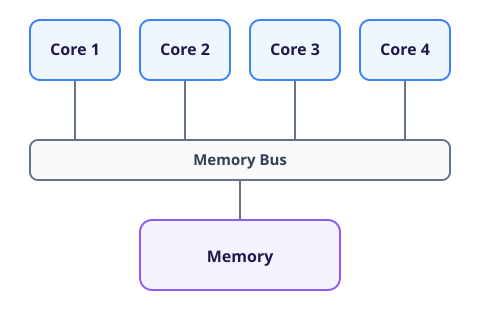
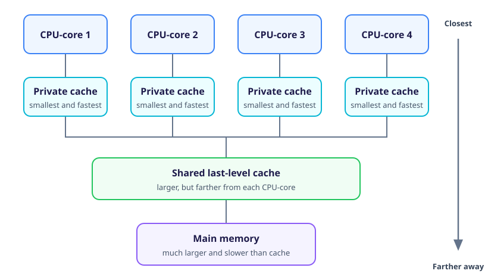
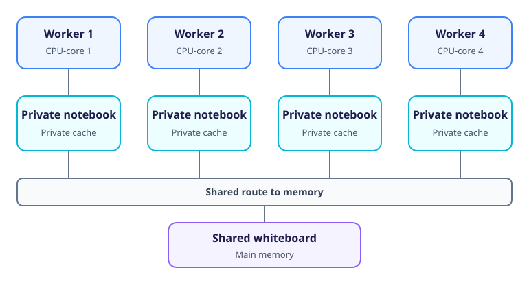

## Computer Basics

Before looking at how supercomputers are built, it is useful to examine an ordinary desktop or laptop computer.

For decades, personal computers were built around a single processing core.
A simplified model of such a computer contains three main components:

1. A central processing unit (CPU) that performs calculations.
1. Random access memory (RAM) that temporarily stores programs and data in use.
1. A hard disk drive (HDD) or solid-state drive (SSD) that stores programs and files for the long term.



Real computers contain many more components, but the relationship between the processor and memory is what matters here.
We can therefore set storage aside for the rest of this section.

### The Rise of Multi-core Processors

For several decades, advances in semiconductor manufacturing allowed designers to place increasing numbers of transistors on a processor.
This trend is described by Moore's Law.
Processor performance also improved through a combination of higher clock frequencies and architectural changes that allowed more work to be completed during each clock cycle.

By the early 2000s, raising clock frequencies had become increasingly difficult.
Higher frequencies and greater transistor density increased power consumption and produced more heat than could be removed economically.

Manufacturers therefore began using more of their transistor budget to place several complete processing cores on one chip.
Dual-core processors were followed by processors with four, eight and eventually dozens of CPU-cores.
Processors containing especially large numbers of cores are sometimes described as *many-core* processors.

:::callout{variant="info"}
With multi-core processors, the words *CPU* and *processor* can be ambiguous.

In this course:

- **CPU-core** means one physical processing core.
- **CPU** or **processor** means the complete chip containing one or more CPU-cores.

Some CPU-cores support simultaneous multithreading and appear to the operating system as more than one logical processing unit.
The number of logical processing units reported by an operating system can therefore be greater than the number of physical CPU-cores.
:::

## Who Needs a Multi-core Laptop?

Multi-core processors allow computers to become more capable even though the performance of an individual CPU-core is no longer increasing as rapidly as it once did.
That explains why multi-core processors are valuable in supercomputers, but why are they also useful in laptops and mobile phones?

A program does not automatically run twice as fast when a second CPU-core becomes available.
To use several cores for one calculation, the program must usually be adapted through a process called parallelisation.
Such a program divides its work into parts that can execute concurrently.

Most programs were serial when multi-core CPUs first became common, and much software remains serial today.
A serial program executes on only one processing unit at a time.

:::callout{variant="discussion"}
Does a multi-core processor still benefit someone who mostly runs serial programs?
:::

### Operating Systems

People do not normally choose which CPU-core runs each program.
The operating system (OS) manages access to the processor, memory and other hardware.
Windows, macOS, Linux and Android are different operating systems, but all include a scheduler that decides when and where each program will run.



Even a single-core computer can appear to run many programs at once.
The scheduler gives one program a short period on the CPU-core, pauses it and then gives another program a turn.
This process is called *time-sharing*.
By switching between programs quickly, the operating system keeps them all responsive.

### How the OS Uses Multiple CPU-cores

In a multi-core computer, one operating system controls all the CPU-cores.
The scheduler can run different programs on different cores at the same time and continually reassign work as programs start, wait and finish.



This is why a computer can browse the web, play music, edit a document and perform a calculation at the same time.
Because every CPU-core can access the same main memory, the operating system can also pause a program on one core and resume it on another.

For everyday computing, the operating system can exploit multiple cores by running separate programs concurrently.
This increases **throughput**, which is the amount of work completed in a given time.

Supercomputing often has a different objective: reducing the time required for one large calculation.
Achieving that objective requires a parallel program that can divide and coordinate its work across multiple CPU-cores.
We will examine how such programs are written in the parallel-programming course.

:::callout{variant="discussion"}
What costs or complications might arise when several CPU-cores share the same memory and other hardware resources?
:::

---

## Scheduling Serial Programs

The [benchmark program](code/multicore-benchmark.c) supplied with this section performs a fixed amount of serial work.
The commands below start several independent copies and report how long the complete group takes to finish.

Download `multicore-benchmark.c`, then compile it:

```bash
cc -O3 -ffast-math -std=c11 multicore-benchmark.c -o multicore-benchmark
```

:::callout{variant="warning"}
Run this benchmark on your own computer or within an interactive compute allocation.
Do not run CPU-intensive experiments on a shared login node.

The commands below assume a Linux Bash environment.
The `nproc` utility reports the number of logical processing units available on your computer or within your allocation.
If `nproc` is unavailable, set `cores` manually to the number of processing units available to you.
:::

::::challenge{id=pc_basics.scheduling title="Observing Scheduler Behaviour"}
Let \(N\) be the number of processing units available to the benchmark.
The important comparison is between 1, \(N\) and \(2N\) copies, rather than any particular number of copies.

Define a Bash function that launches several copies and records their combined runtime:

```bash
cores=$(nproc)
TIMEFORMAT='runtime_seconds=%R'

run_copies() {
  local dataset=$1
  local copies=$2
  local copy

  for ((copy = 0; copy < copies; copy++)); do
    ./multicore-benchmark "$dataset" &
  done
  wait
}
```

Before running the benchmark, predict how the runtime will change for each number of copies.
Run the cache-resident version of the calculation:

```bash
time run_copies small 1
time run_copies small "$cores"
time run_copies small "$((2 * cores))"
```

Record the `runtime_seconds` reported by each command.

Consider the following questions:

1. How does the \(N\)-copy runtime compare with the one-copy runtime?
1. Why does the \(2N\)-copy runtime differ?
1. Does starting \(N\) copies make any one calculation finish sooner?
1. What kind of workload could benefit from running independent copies concurrently?

:::solution
Exact timings depend on the computer and its other activity.
On one validation machine, `nproc` reported eight available processing units and produced:

| Run | Copies | Runtime (seconds) |
| --- | ------ | ----------------- |
| 1   | 1      | 1.056             |
| N   | 8      | 1.676             |
| 2N  | 16     | 3.412             |

\(N\) copies take far less than \(N\) times the one-copy runtime because the operating system can distribute them across the available processing units.
The runtime may still increase because active CPU-cores share hardware resources and a processor may run at a lower frequency when more of its cores are busy.

Here, eight calculations completed in approximately 1.59 times the one-copy runtime.
The computer therefore completed substantially more work per second, although starting more copies did not divide or accelerate any individual calculation.

\(2N\) copies should take approximately twice as long as \(N\) copies because only \(N\) processing units are available.
The operating system must share those processing units between the programs.

Running \(N\) copies increases throughput, but it may increase the runtime of each individual calculation.
This approach is useful when a workload contains independent tasks, such as processing unrelated images or running a simulation with several different input parameters.
:::
::::

Your results should show the same broad pattern without matching these values exactly.
Scheduling introduces overhead, and background activity can compete for CPU time, memory and other resources.
Reliable performance comparisons therefore require a controlled environment with as little unrelated activity as possible.

The experiment shows how a multi-core computer can complete several independent tasks concurrently without changing the programs themselves.
To understand the limits of this approach, we now need to look at how the CPU-cores access memory.

---

## Designing a Parallel Computer

There are two broad ways to build a parallel computer:

- **Shared-memory architecture:** Multiple CPU-cores within one computer access a common memory address space.
- **Distributed-memory architecture:** Multiple computers, each with its own memory, communicate through a network.

This section concentrates on shared memory.
The next section, [Distributed-Memory Computers](high_performance_computing/supercomputing/03_distributed_memory), examines distributed memory.

:::callout{variant="discussion"}
Compare one quad-core laptop with two dual-core laptops.
Which arrangement makes it easier for four CPU-cores to work with the same data, and what limitation does that convenience introduce?
:::

---

## Shared-Memory Architecture

The defining feature of a shared-memory computer is that all its CPU-cores can access a common memory address space.



The diagram represents memory requests from several CPU-cores travelling through a shared connection to main memory.
Modern processors use more complex memory controllers and interconnects, but the simplified model captures the important point: the CPU-cores ultimately share a finite memory system.

This is the basic architecture used by modern mobile phones, laptops and desktop computers.
In a computer with a quad-core processor and 4 GB of RAM, all four CPU-cores can access the same 4 GB of memory.

Imagine four workers representing the CPU-cores, one office representing the computer and one whiteboard representing main memory.
The workers cannot speak to one another directly, so they communicate by reading from and writing to the shared whiteboard.

The analogy reveals two important limitations:

1. **Memory capacity:** There is a practical limit to the amount of memory that can be installed in one shared-memory computer.
1. **Memory access speed:** Adding workers does not make the whiteboard easier to reach, so they increasingly obstruct one another as more of them try to use it.

### Memory as a Bottleneck

The shared route to memory has a finite bandwidth, meaning it can transfer only a limited amount of data each second.
Memory access also has latency, meaning that a CPU-core must wait between requesting data and receiving it.

Many programs run on supercomputers must read and write large quantities of data.
For such programs, moving data can take more time than performing calculations.

Computer designers use several techniques to reduce this bottleneck, but a single shared-memory system cannot grow efficiently to hundreds of thousands of CPU-cores.
Large supercomputers therefore combine many shared-memory computers as nodes in a distributed-memory system.

---

## Memory Caches

Main memory is much slower than a CPU-core.
Processors reduce the delay by using caches, which are small, fast stores located close to the CPU-cores.

Modern processors usually have several levels of cache.
The caches nearest each CPU-core are the smallest and fastest, while later levels are larger but slower and may be shared between several cores.
All these caches are much smaller than main memory.


*This is one common arrangement. The number of cache levels and which CPU-cores share them vary between processors.*

Return to the office analogy.
Instead of repeatedly queueing at the whiteboard, a worker can copy frequently used information into a notebook.
The worker can then consult the nearby notebook much more quickly than the shared whiteboard.


*The notebook analogy represents private caches. Real processors may also have cache levels shared by several CPU-cores.*

Caches work especially well when a CPU-core repeatedly uses the same data.
Several cores can also hold their own copies of read-only data without coordinating updates.

### Cache Coherence

The situation becomes more complicated when a CPU-core changes cached data.
If another core holds a copy of the same data, that copy may now be out of date.

In the office analogy, the worker making the change would need to announce:

> I have changed the 231st salary.
> If you copied it, your notebook is now out of date.

Processor hardware coordinates these updates so that cores do not continue calculating with stale values.
This process is called *cache coherence* or *cache coherency*.
The coordination creates additional communication between CPU-cores and can limit performance when many cores frequently update shared data.

:::callout{variant="info"}
The benchmark in the next challenge gives each process its own private array, so it does **not** measure cache-coherence traffic.
Instead, it demonstrates another consequence of sharing a memory system: competition for memory bandwidth.
:::

---

## Investigating Resource Contention

The benchmark provides a small working set of 32 KiB per copy and a large working set of 64 MiB per copy.
The small working set should be served largely from cache on most systems.
When \(N\) copies use the large working set, their combined working set is \(64N\) MiB and is intended to exceed the available shared cache.
Each copy repeatedly scans its array until it has processed a total of 16 GiB.

::::challenge{id=pc_basics.contention title="Analysing Memory Contention"}
Use the same values of \(N\) and \(2N\) to run the large version:

```bash
time run_copies large 1
time run_copies large "$cores"
time run_copies large "$((2 * cores))"
```

Record the results alongside the small-working-set results from the previous challenge.

1. Calculate the slowdown factor from one copy to \(N\) copies for each working set by dividing the \(N\)-copy runtime by the one-copy runtime.
1. Which working set experiences the greater slowdown?
1. What shared hardware resource causes the difference?
1. Why does increasing from \(N\) to \(2N\) copies approximately double the runtime for both working sets?
1. What do these results reveal about programs that run independently on different CPU-cores?

:::solution
The validation machine, where \(N=8\), produced:

| Working set | Run | Copies | Runtime (seconds) |
| ----------- | --- | ------ | ----------------- |
| Small       | 1   | 1      | 1.056             |
| Small       | N   | 8      | 1.676             |
| Small       | 2N  | 16     | 3.412             |
| Large       | 1   | 1      | 2.010             |
| Large       | N   | 8      | 9.775             |
| Large       | 2N  | 16     | 18.790            |

For the small working set, the \(N\)-copy slowdown factor is $1.676 / 1.056 \approx 1.59$.
For the large working set, the \(N\)-copy slowdown factor is $9.775 / 2.010 \approx 4.86$.

The small working set can be read largely from cache, so each CPU-core makes relatively little use of the shared memory system.
On this validation machine, the eight large working sets occupy 512 MiB in total and must repeatedly fetch data from main memory.
The CPU-cores therefore compete for limited memory bandwidth.

\(2N\) copies cannot all execute simultaneously on only \(N\) available processing units.
The operating system must share CPU time between them while they continue to compete for cache and memory resources.

Independent programs can therefore slow one another down even when they never exchange data.
They still compete for shared hardware such as memory, storage and network connections.
:::
::::

When several CPU-cores compete for a limited shared resource, they experience **resource contention**.
Resource contention is an important limit on shared-memory systems.
Adding more CPU-cores improves performance only while the rest of the computer can supply those cores with data and other resources quickly enough.

:::callout{variant="discussion"}
Use your benchmark results to explain why adding more CPU-cores cannot improve the performance of a shared-memory computer indefinitely.
Distinguish between throughput and the runtime of an individual calculation, and identify at least one shared resource in your answer.
:::

A shared-memory computer forms the basic building block of a modern supercomputer.
To scale beyond the limits of one such computer, we must connect many of them and coordinate their work.
The next section examines this [distributed-memory approach](high_performance_computing/supercomputing/03_distributed_memory).
