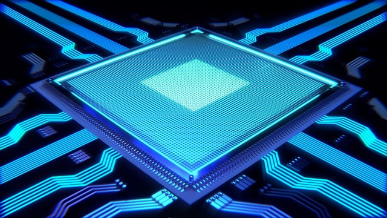
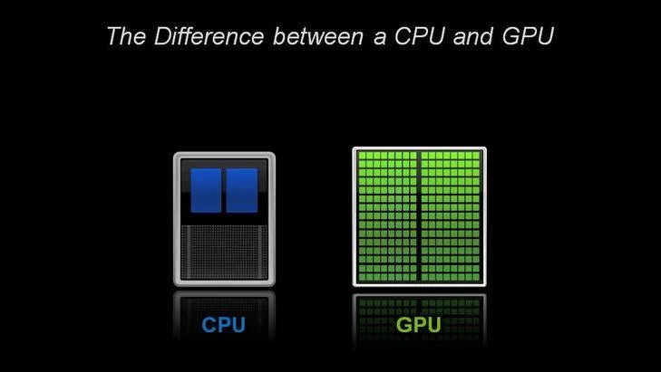
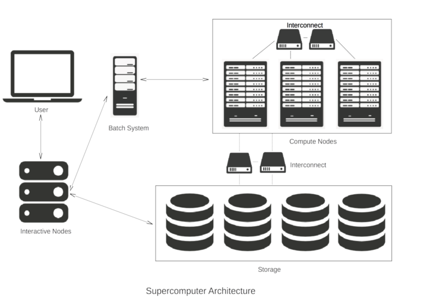

*Image courtesy of [ColiN00B](https://pixabay.com/users/colin00b-346653/) from [Pixabay](https://pixabay.com)*

## Understanding Supercomputing - Processors

In this section we will cover the basics of how supercomputers are designed, enough for you to be able to understand the characteristics of the supercomputers in the [Top500](https://www.top500.org/lists/top500/2023/11/) list (the linked list is from November 2023).

When we talk about a processor, we mean the central processing unit (CPU) in a computer which is sometimes considered to be the computer’s brain. The CPU carries out the instructions of computer programs, the terms CPU and processor are generally used interchangeably.
A modern CPU is composed of a collection of several separate processing units, we call each independent processing unit a CPU-core - some people just use the term core.

A modern domestic device (e.g. a laptop, mobile phone or iPad) will usually have a few CPU-cores (perhaps two or four), while a supercomputer has tens or hundreds of thousands of CPU-cores.
As mentioned before, a supercomputer gets its power from all these CPU-cores working together at the same time - working in parallel.
Conversely, the mode of operation you are familiar with from everyday computing, in which a single CPU-core is doing a single computation, is called serial computing.

It may surprise you to learn that supercomputers are built using the same basic elements that you normally find in your desktop, such as processors, memory and disk. The difference is largely a matter of scale. The reason is quite simple: the cost of developing new hardware is measured in billions of euros, and the market for consumer products is vastly larger than that for supercomputing, so the most advanced technology you can find is actually what you find in general-purpose computers.

The same approach is used for computer graphics - the graphics processor (or GPU) in a home desktop or games console will have hundreds or thousands of cores, though each core will not be as capable as those of the CPUs.
Special-purpose processors like GPUs are now being used to increase the power of supercomputers - in this context they are called accelerators.


*A typical CPU has a small number of powerful, general-purpose cores; a GPU has many more specialised cores. © NVIDIA*

To use all of these CPU-cores together means they must be able to talk to each other. In a supercomputer, connecting very large numbers of CPU-cores together requires a communications network, which is called the interconnect in the jargon of the field. A large parallel supercomputer may also be called a Massively Parallel Processor or MPP.

Does it surprise you to learn that games console components and other general-purpose hardware are also used in supercomputers?

---


*Image courtesy of [Agence Olloweb](https://unsplash.com/@olloweb) from [Unsplash](https://unsplash.com/)*

## HPC System Design

Now you understand the basic hardware of supercomputers, you might be wondering what a complete system looks like. Let’s have a look at the high-level architecture of supercomputer, with emphasis on how it differs from a desktop machine.

The figure below shows the building blocks of a complete supercomputer system and how they are connected together. Most systems in the world will look like this at an abstract level, so understanding this will give you a good model for how all supercomputers are put together.



Let’s go through the figure step by step.

### Interactive Nodes

As a user of a supercomputer, you will get some login credentials, for example a username and password. Using these you can access one of the interactive nodes (sometimes called login nodes). You don’t have to travel to the supercomputer centre where these interactive nodes are located - you just connect from your desktop machine over the internet.

Since a supercomputer system typically has many hundreds of users, there are normally several interactive nodes which share the workloads, i.e. to make sure that all the users are not trying to access one single machine at the same time. This is where you do all your everyday tasks such as developing computer programs or visualising results.

### Batch System

Once logged into an interactive node, you can now run large computations on the supercomputer. It is very important to understand that you do not directly access the CPU-cores that do the hard work. Supercomputers operate in batch mode - you submit a job (including everything needed to run your simulation) to a queue and it is run some time in the future. This is done to ensure that the whole system is utilised as fully as possible.

The user creates a small file, referred to as a job script, which specifies all the parameters of the computation such as which program is to be run, the number of CPU-cores required, the expected duration of the job etc. This is then submitted to the batch system. Resources will be allocated when available and a user will be guaranteed exclusive access to all the CPU-cores they are assigned. This prevents other processes from interfering with a job and allows it to achieve the best performance.

Individual users will not have access to the full resources of the supercomputer. Instead, they will be allocated resources according to the specifications in their job script and the limits defined by their project's funding or allocation agreements.

It is the job of the batch scheduler to look at all the jobs in the queue and decide which jobs to run based on, for example, their expected execution time and how many CPU-cores they require. At any one time, a single supercomputer could be running several parallel jobs with hundreds waiting in the queue. Each job will be allocated a separate portion of the whole supercomputer. A good batch system will keep the supercomputer full with jobs all the time, but not leave individual jobs in the queue for too long.

### Compute nodes

The compute nodes are at the core of the system and the part that we’ve concentrated on for most of this module. They contain the resources to execute user jobs - the thousands of CPU-cores operating in parallel that give a supercomputer its power. They are connected by fast interconnect, so that the communication time between CPU-cores impacts program run times as little as possible.

### Storage

Although the compute nodes may have disks attached to them, they are only used for temporary storage while a job is running. There will be some large external storage, comprising thousands of disks, to store the input and output files for each computation. This is connected to the compute nodes using fast interconnect so that computations which have large amounts of data as input or output don’t spend too much time accessing their files. The main storage area will also be accessible from the interactive nodes, e.g. so you can visualise your results.

---

## Practical 1: Setting up Prerequisites

To undertake the practical sessions in this course you'll need one of the following:

- A machine with OpenMP and MPI installed (see links to instructions below), although you won't be able to run the Slurm job scheduler examples unless you have access to ARCHER2 which these examples assume.
- The Slurm job submission examples presented assume access to [ARCHER2](https://www.archer2.ac.uk/) which has OpenMP and MPI preinstalled. These examples can be made to work on other HPC infrastructures, such as [DiRAC](https://dirac.ac.uk/) or Oxford's ARC, but due to differences in how these systems are configured, prior knowledge of job scripts and the correct parameters to use for those systems will be required.

### Local machine installation

#### Installing OpenMP on your machine

In order to make use of OpenMP, it's usually a case of ensuring you have the [right compiler installed on your system](https://www.openmp.org/resources/openmp-compilers-tools/), such as gcc.

#### Installing MPI on your machine

To install a popular version of MPI called [OpenMPI](https://www.open-mpi.org/) on a desktop or laptop:

- **Linux:** Most distributions have OpenMPI available in their package manager, e.g.

  ```bash
  sudo apt install openmpi-bin openmpi-dev
  ```

- **Mac:** The MacPorts and Homebrew package managers both have OpenMPI available:

  ```bash
  brew install openmpi
  # or
  port install openmpi
  ```

- **Windows:** Whilst you *can* build OpenMPI yourself on Windows, it's generally easier to use the [**Windows Subsystem for Linux**](https://learn.microsoft.com/en-us/windows/wsl/install).

This can be useful for when you're writing code or testing it on a smaller scale, but you will need to check that you're installing a version of OpenMPI that's also available on whichever HPC cluster you're likely to scale up to.

### Using ARCHER2

The other option, if you already have an account on it, is to use ARCHER2 which has all the software pre-installed.

### Installing an SSH client

To connect to ARCHER2 from our local laptop or PC you'll need an SSH client, which allows us to connect to and use a command line interface on a remote computer as if we were our own.
Please follow the directions below to install an SSH client for your system if you do not already have one.

#### Windows

Modern versions of Windows have SSH available in Powershell. First run Powershell, and you can test if it is available by typing ssh --help in Powershell. If it is installed, you should see some useful output. If it is not installed, you will get an error. If SSH is not available in Powershell, then you should install MobaXterm from [http://mobaxterm.mobatek.net](http://mobaxterm.mobatek.net). You will want to get the Home edition (Installer edition). However, if Powershell works, you do not need this.

#### MacOS

macOS comes with SSH pre-installed, so you should not need to install anything. Use your “Terminal” app.

#### Linux

Linux users do not need to install anything, you should be set! Use your terminal application.

### Using SSH to connect to ARCHER2

You should now be able to log into ARCHER2 by following the login instructions in the [ARCHER2 documentation](https://docs.archer2.ac.uk/user-guide/connecting/#ssh-clients), e.g.

```bash
ssh username@login.archer2.ac.uk
```

You will also need to use a means of secondary authentication in order to gain access, e.g. using the authenticator app you used during ARCHER2 registration.
Then you should see a welcome message followed by a Bash prompt, e.g.:

```bash
username@ln01:~> 
```

::::callout
When using ARCHER2, be sure to `cd` to the `/work` filesystem, i.e.:

```bash
cd /work/[project code]/[group code]/[username]
```

You should have been given `[project code]` and `[group code]` at the start of this course.

The `/work` filesystem is a high performance parallel file system that can be accessed by both the frontend login nodes and the compute nodes. All jobs on ARCHER2 should be run from the `/work` file system, since ARCHER2 compute nodes cannot access the `/home` file system at all and will fail with an error.

For more information the ARCHER2 documentation: [https://docs.archer2.ac.uk/user-guide/io/#using-the-archer2-file-systems](https://docs.archer2.ac.uk/user-guide/io/#using-the-archer2-file-systems).
::::

## Practical 2: Compiling and running our first program

This example aims to get you used to the command line environment of a high performance computer, by compiling example code and submitting jobs to the batch system while learning about the hardware of a HPC system.

### Compiling an Example Code

First, we'll need to create an example code to compile.

::::callout

## Recap: Using an Editor from within the Shell

When working on an HPC system we will frequently need to create or edit text files.

Some of the more common ones are:

- `vi`: a very basic text editor developed during the 1970's/80's. It differs from most editors - and is commonly found to be confusing because of it - in that it has two modes of operation: command and insert. In command mode, you are able to pass instructions to the editor, such as dealing with files (save, load, or insert a file), and editing (cut, copy, and paste text). However, you can't insert new characters. For that the editor needs to be in insert mode, which allows you to type into a text document. You can enter insert mode by typing `i`. To return to the command mode, you can use `Escape`.
- `vim`: built on `vi`, `vim` goes much further, adding features like undo/redo, autocompletion, search and replace, and syntax highlighting (which uses different coloured text to distinguish different programming language text). It mainly uses the same command/insert modes as `vi` which can take some getting used to, but is developed as a power-users editing tool that is highly configurable.
- `emacs`: also highly configurable and extensible, `emacs` has a less steep learning curve than `vim` but offers features common to many modern code editors. It readily integrates with debuggers, which is great if you need to find problems in your code as it runs.
- `nano`: a lightweight editor that also uses the more common way of allowing the editing of text by default, but allows you to access extra editor functionality such as search/replace or saving files by using `Ctrl` with other keys.

These are all text-based editors, in that they do not use a graphical user interface like Windows. They simply appear in the terminal, which has a key advantage, particularly for HPC systems like ARCHER2, DiRAC, or Oxford's ARC: they can be used everywhere there is a terminal, such as via an SSH connection.

One of the common pitfalls of using Linux is that the `vi` editor is commonly set as the default editor. If you find yourself in `vi`, you can exit using `Escape` to get into command mode, and then `:` to enter a new command followed by `q` + `!`, which means quit `vi` without saving the file.

We'll use `nano`, a lightweight editor that's accessible from practically any installation of Linux.

If following this on your own machine (e.g. not via ARCHER2), feel free to use any editor you like.

::::

Whilst in your account directory within the `/work` filesystem, create a new file called `helloWorldSerial.c` using an editor, e.g.

```bash
nano helloWorldSerial.c
```

And enter the following contents:

```c
#include <stdio.h>
#include <stdlib.h>
#include <unistd.h>
#include <limits.h>
#include <string.h>

int main(int argc, char* argv[])
{

    // Check input argument
    if(argc != 2)
    {
        printf("Required one argument `name`.\n");
        return 1;
    }

    // Receive argument
    char* iname = (char *)malloc(strlen(argv[1]));
    strcpy(iname, argv[1]);

    // Get the name of the node we are running on
    char hostname[HOST_NAME_MAX];
    gethostname(hostname, HOST_NAME_MAX);

    // Hello World message
    printf("Hello World!\n");

    // Message from the node to the user
    printf("Hello %s, this is %s.\n", iname, hostname);

    // Release memory holding command line argument
    free(iname);
}
```

This C code will accept a single argument (for example, your name), and report which node it is running from.
To try this example yourself you will first need to compile the example code.

If the file that contains the above code is called `helloWorldSerial.c`, then to compile and run this directly on the ARCHER2 login node use:

```bash
cc helloWorldSerial.c -o hello-SER
./hello-SER yourname
```

If you're running this on your own machine you may need to replace `cc` with `gcc` to get it to use the right compiler on your machine.

And you should see:

```output
Hello World!
Hello yourname, this is ln01.
```

::::callout{variant="tip"}

## Be Kind to the login nodes

It’s worth remembering that if you're using an HPC infrastructure the login node is often very busy managing lots of users logged in, creating and editing files and compiling software, and submitting jobs. As such, although running quick jobs directly on a login node is ok, for example to compile and quickly test some code, it’s not intended for running computationally intensive jobs and these should always be submitted for execution on a compute node, which we'll look at shortly.

The login node is shared with all other users and your actions could cause issues for other people, so think carefully about the potential implications of issuing commands that may use large amounts of resource.
::::

### Submitting our First Job

::::callout{variant="note"}

## Prerequisites

To be able to run the job submission examples in this segment, you'll need to either have access to ARCHER2, or an HPC infrastructure running the Slurm job scheduler and knowledge of how to configure job scripts for submission.
::::

[Introduction to High Performance Computing](high_performance_computing/hpc_intro/04_scheduler) covers what a job scheduler is, how Slurm submission scripts work, and what each `#SBATCH` directive means, in full.
Here we'll just submit the program we compiled above on ARCHER2.

Place this bash code into a file called `Hello_Serial_Slurm.sh` and replace `YOUR_NAME_HERE` with your own input and `[project code]` with your supplied project code.

```bash
#!/bin/bash

#SBATCH --job-name=Hello-SER
#SBATCH --nodes=1
#SBATCH --tasks-per-node=1
#SBATCH --cpus-per-task=1
#SBATCH --time=00:01:00

# Replace [project code] below with your project code (e.g. t01)
#SBATCH --account=[project code]
#SBATCH --partition=standard
#SBATCH --qos=standard

./hello-SER YOUR_NAME_HERE
```

ARCHER2 specifically requires the `--account`, `--partition`, and `--qos` directives above - these vary between Slurm systems, so check your own facility's documentation for the values it expects.

To submit this job run,

```bash
sbatch Hello_Serial_Slurm.sh
```

A unique job identifier is returned:

```output
Submitted batch job 5843243
```

Using this identifier, we can check the status of the job, e.g.:

```bash
squeue --job 5843243
```

```output
             JOBID PARTITION     NAME     USER ST       TIME  NODES NODELIST(REASON)
           5843243  standard Hello-SE username PD       0:00      1 (Priority)
```

Eventually, we should see the job's state (`ST`) change to `R` to indicate it's running, along with the node it's running on indicated under `NODELIST`, and the time it's been running so far:

```output
             JOBID PARTITION     NAME     USER ST       TIME  NODES NODELIST(REASON)
           5843243  standard Hello-SE username  R       0:01      1 nid003218
```

And we may even see it enter the completing (`CG`) state as the job finishes. Once complete, the job will disappear from this list.

We should now see one file returned as output, named `slurm-[job id].out`, containing the name of the node it ran on.

::::challenge{id=understanding_sc_pr.1 title="Time's Up"}
Resource requests are typically binding, and if you exceed them, your job will be killed.
Let’s see this in action and use wall time as an example.

Add a `sleep 240` at the end of the submission script which will cause the script (and hence the job) to wait for 4 minutes, exceeding the requested 1 minute. Resubmit the job, and continue to monitor the job using `squeue`. What happens?

:::solution

You should see the following in the job's Slurm output log file, indicating it was terminated:

```output
Hello world!
slurmstepd: error: *** JOB 5851929 ON nid001099 CANCELLED AT 2024-03-07T09:15:27 DUE TO TIME LIMIT ***
```

You may notice that the job is cancelled perhaps around 30 seconds *after* its requested time of 1 minute, so there is some leeway, but not much!
:::

::::

---

## What Supercomputing is not

One of the main aims of this course is to de-mystify the whole area of supercomputing.

Although supercomputers have computational power far outstripping your desktop PC, they are built from the same basic hardware. Although we use special software techniques to enable the many CPU-cores in a supercomputer to work together in parallel, each individual processor is basically operating in exactly the same way as the processor in your laptop.

However, you may have heard of ongoing developments that take more unconventional approaches:

- Quantum Computers are built from hardware that is radically different from the mainstream.
- Artificial Intelligence tackles problems in a completely different way from the computer software we run in traditional computational science.

We will touch on these alternative approaches in some of the final foundational module. In the meantime, feel free to raise any questions you have about how they relate to supercomputing by commenting in any of the discussion steps.
