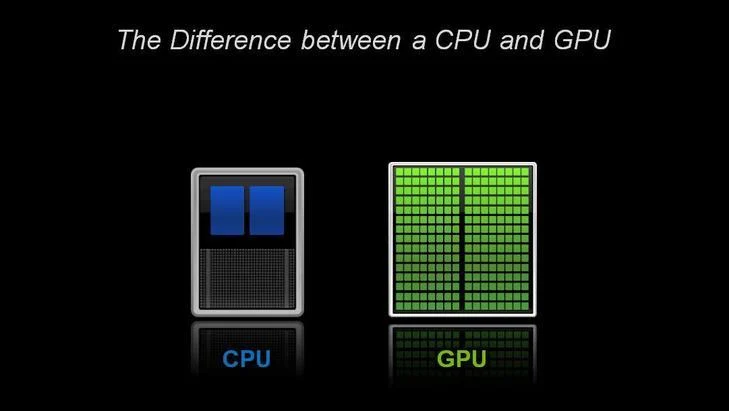
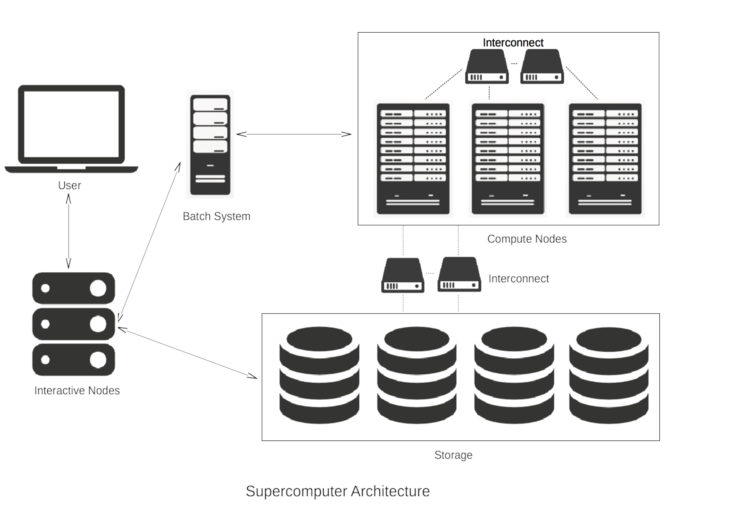

*Image courtesy of [ColiN00B](https://pixabay.com/users/colin00b-346653/) from [Pixabay](https://pixabay.com)*

## Understanding Supercomputing - Processors

So what are supercomputers made of? Are the building components really so different from personal computers? And what determines how fast a supercomputer is?

In this step, we start to outline the answers to these questions. We will go into a lot more detail next week, but for now we will cover enough of the basics for you to be able to understand the characteristics of the supercomputers in the [Top500](https://www.top500.org/lists/top500/2023/11/) list (the linked list is from November 2023).

It may surprise you to learn that supercomputers are built using the same basic elements that you normally find in your desktop, such as processors, memory and disk. The difference is largely a matter of scale. The reason is quite simple: the cost of developing new hardware is measured in billions of euros, and the market for consumer products is vastly larger than that for supercomputing, so the most advanced technology you can find is actually what you find in general-purpose computers.

When we talk about a processor, we mean the central processing unit (CPU) in a computer which can also be considered as the computer’s brain. The CPU carries out the instructions of a computer program. The terms CPU and processor are generally used interchangeably. The slightly confusing thing is that a modern CPU actually contains several independent brains; it is actually a collection of several separate processing units, so we really need another term to avoid confusion. We will call each independent processing unit a CPU-core - some people just use the term core.

A modern domestic device (e.g. a laptop, mobile phone or iPad) will usually have a few CPU-cores (perhaps two or four), while a supercomputer has tens or hundreds of thousands of CPU-cores. As mentioned before, a supercomputer gets its power from all these CPU-cores working together at the same time - working in parallel. Conversely, the mode of operation you are familiar with from everyday computing, in which a single CPU-core is doing a single computation, is called serial computing.

Interestingly, the same approach is used for computer graphics - the graphics processor (or GPU) in a home games console will have hundreds of cores. Special-purpose processors like GPUs are now being used to increase the power of supercomputers - in this context they are called accelerators. We will talk more about GPUs in Week 2.


*A typical CPU has a small number of powerful, general-purpose cores; a GPU has many more specialised cores. © NVIDIA*

To use all of these CPU-cores together means they must be able to talk to each other. In a supercomputer, connecting very large numbers of CPU-cores together requires a communications network, which is called the interconnect in the jargon of the field. A large parallel supercomputer may also be called a Massively Parallel Processor or MPP.

Does it surprise you to learn that games console components and other general-purpose hardware are also used in supercomputers?

© SURFsara

---


*Image courtesy of [Willian Warby](https://unsplash.com/@wwarby) from [Unsplash](https://unsplash.com)*

## Understanding Supercomputing - Performance

The Top500 list ranks supercomputers by their floating-point performance - let’s take a look at what that means.

In supercomputing, we are normally interested in numerical computations: what is the answer to 0.234 + 3.456, or 1.4567 x 2.6734? Computers store numbers like these in floating-point format, so they are called floating-point numbers. A single instruction like addition or multiplication is called an operation, so we measure the speed of supercomputers in terms of floating-point operations per second or Flop/s, which is sometimes written and said more simply as Flops.

So how many Flops can a modern CPU-core perform? Let’s take a high-end processor like the AMD EPYC Zen2 (Rome) 7F32 CPU (which happens to be the processor used in the Snellius system at SURFsara). The way a processor is normally marketed is to quote its clock frequency, which here is 3.7 GHz. This is the rate at which each CPU-core operates. Clock speed is expressed in cycles per second (Hertz), and the prefix Giga means a billion (a thousand million), so this CPU-core is working at the almost mind-blowing rate of 3.7 billion cycles per second. Under favourable circumstances, an AMD EPYC CPU-core can perform 16 floating-point operations per cycle, which means each CPU-core can perform 16 x 3.7 billion = 59.2 billion floating-point operations per second.

So, the peak performance of one of our CPU-cores is 59.2 GFlops.

We say peak performance because this is the absolute maximum, never-to-be-exceeded figure which it is very hard to achieve in practice. However, it’s a very useful figure to know for reference.

Clearly, with many thousands of CPU-cores we’re going to encounter some big numbers so here is a table summarising the standard abbreviations you’ll come across:

|Ops per second  |	Scientific Notation | Prefix	| Unit |
|---|---|---|---|
| 1 000	| 10^3  |	Kilo	| Kflops |
| 1 000 000 |	10^6|	Mega |	Mflops |
| 1 000 000 000	| 10^9 |	Giga |	Gflops |
| 1 000 000 000 000 |	10^12 |	Tera |	Tflops |
| 1 000 000 000 000 000 |	10^15 |	Peta |	Pflops |
| 1 000 000 000 000 000 000 |	10^18 |	Exa | Eflops |

:::callout
A quick word of warning here: when talking about performance measures such as Gflops, we are talking about powers of ten. For other aspects such as memory, it is more natural to work in powers of 2 - computers are binary machines after all.
:::

It is something of a coincidence that 2^10 = 1024 is very close to 10^3 = 1000, so we are often sloppy in the terminology. However, we should really be clear if a kiloByte (Kbyte) is 1000 Bytes or 1024 Bytes. By KByte, people usually mean 1024 Bytes but, strictly speaking, a Kbyte is actually 1000 Bytes. The technically correct terminology for 1024 Bytes is KibiByte written as KiByte.

This might seem like an academic point since, for a KByte, the difference is only about 2%. However, the difference between a PByte and a PiByte is more than 12%. If your supercomputer salesman quotes you a price for a PetaByte of disk, make sure you know exactly how much storage you’re getting!

© SURFsara

---


*Image courtesy of [Veri Ivanova](https://unsplash.com/@veri_ivanova) from [Unsplash](https://unsplash.com)*

## Understanding Supercomputing - Benchmarking

If we are going to compare performance we need some standard measure. When buying a car, we don’t just take the manufacturer’s word for how good the car is - we take it for a test drive car and see how well it performs in practice. For cars we might be interested in top speed or fuel economy, and it turns out that we are interested in the equivalent quantities for supercomputers: maximum floating-point performance and power consumption.

To measure supercomputer performance the test drive is how fast it can run a standard program, and this process is called benchmarking.

In the supercomputer world, two terminologies are often used to measure the performance of a system, Rpeak and Rmax. Rpeak is the theoretical peak performance, which is just the peak performance of a CPU-core multiplied by the number of CPU-cores. Rmax is the maximum performance achieved while running the LINPACK benchmark.

LINPACK involves running a standard mathematical computation called an LU factorisation on a very large square matrix of size Nmax by Nmax. The matrix is just a table of floating-point numbers, and the rules of the benchmark allow you to choose how big Nmax is.

As of June 2018, the world’s fastest supercomputer (the Summit system at the Oak Ridge National Laboratory in the USA) used Nmax of over 16 million - imagine working with a spreadsheet with over 16 million rows and 16 millions columns!

Supercomputers are not only expensive to purchase, but they are also expensive to run because the power consumption can be huge. A typical supercomputer consumes multiple megawatts, and this power is turned into heat which we have to get rid of.

For example, the fourth on the top500 list, Tianhe-2 system has a peak power consumption of 18.5 megawatts and, including external cooling, the system drew an aggregate of 24 megawatts when running the LINPACK benchmark. If a kilowatt of power costs 10 cents per hour, Tianhe-2’s peak power consumption will be 2400 euros per hour, which is in excess of 21 million euros per year.

Rpeak and Rmax are what Top500 uses to rank supercomputers. Also quoted is the electrical power consumption, which leads to the creation of another list - the [Green 500](https://www.top500.org/lists/green500/2022/06/) (June 2022)- which ranks supercomputers on their fuel economy in terms of Flops perWatt. Despite its massive power bill, Frontier is quite power-efficient. The top ranked system (Frontier) holds 2nd position on the Green 500.

Take a look at the [Top500](https://www.top500.org/lists/top500/2022/06/) list  - does the fact the top supercomputer for performance is also the to for power efficeny surprise you? What could be the reason for this?

© SURFsara

---


*Image courtesy of [Agence Olloweb](https://unsplash.com/@olloweb) from [Unsplash](https://unsplash.com/)*

## Supercomputing Word Search

To help you familiarise with the supercomputing terminology we have prepared a word search for you to print out!


The word search contains 19 words that have been mentioned in the previous steps. Can you find all of them? Do you know how to explain all of them?

---


*Image courtesy of [Pierre Bamin](https://unsplash.com/@bamin) from [Unsplash](https://unsplash.com)*

## HPC System Design

Now you understand the basic hardware of supercomputers, you might be wondering what a complete system looks like. Let’s have a look at the high-level architecture of supercomputer, mainly pointing out how it differs from a desktop machine.

The figure below shows the building blocks of a complete supercomputer system and how they are connected together. Most systems in the world will look like this at an abstract level, so understanding this simple figure will give you a good model for how all supercomputers are put together.



Let’s go through the figure step by step.

### Interactive Nodes

As a user of a supercomputer, you will get some login credentials, for example a username and password. Using these you can access one of the interactive nodes (sometimes called login nodes). You don’t have to travel to the supercomputer centre where these interactive nodes are located - you just connect from your desktop machine over the internet.

Since a supercomputer system typically has many hundreds of users, there are normally several interactive nodes which share the workloads, i.e. to make sure that all the users are not trying to access one single machine at the same time. This is where you do all your everyday tasks such as developing computer programs or visualising results.

### Batch System

Once logged into an interactive node, you can now run large computations on the supercomputer. It is very important to understand that you do not directly access the CPU-cores that do the hard work. Supercomputers operate in batch mode - you submit a job (including everything needed to run your simulation) to a queue and it is run some time in the future. This is done to ensure that the whole system is utilised as fully as possible.

The user creates a small file, referred to as a job script, which specifies all the parameters of the computation such as which program is to be run, the number of CPU-cores required, the expected duration of the job etc. This is then submitted to the batch system. Resources will be allocated when available and a user will be guaranteed exclusive access to all the CPU-cores they are assigned. This prevents other processes from interfering with a job and allows it to achieve the best performance.

It is the job of the batch scheduler to look at all the jobs in the queue and decide which jobs to run based on, for example, their expected execution time and how many CPU-cores they require. At any one time, a single supercomputer could be running several parallel jobs with hundreds waiting in the queue. Each job will be allocated a separate portion of the whole supercomputer. A good batch system will keep the supercomputer full with jobs all the time, but not leave individual jobs in the queue for too long.

### Compute nodes

The compute nodes are at the core of the system and the part that we’ve concentrated on for most of this week. They contain the resources to execute user jobs - the thousands of CPU-cores operating in parallel that give a supercomputer its power. They are connected by fast interconnect, so that the communication time between CPU-cores impacts program run times as little as possible.

### Storage

Although the compute nodes may have disks attached to them, they are only used for temporary storage while a job is running. There will be some large external storage, comprising thousands of disks, to store the input and output files for each computation. This is connected to the compute nodes using fast interconnect so that computations which have large amounts of data as input or output don’t spend too much time accessing their files. The main storage area will also be accessible from the interactive nodes, e.g. so you can visualise your results.

© SURFsara

---

## Practical 1: Logging in to ARCHER2

### Installing an SSH client

We'll first need to connect to ARCHER2 from our local laptop or PC using an SSH client, which allows us to connect to and use a command line interface on a remote computer as if we were our own.
Please follow the directions below to install an SSH client for your system if you do not already have one.

#### Windows

Modern versions of Windows have SSH available in Powershell. First run Powershell, and you can test if it is available by typing ssh --help in Powershell. If it is installed, you should see some useful output. If it is not installed, you will get an error. If SSH is not available in Powershell, then you should install MobaXterm from [http://mobaxterm.mobatek.net](http://mobaxterm.mobatek.net). You will want to get the Home edition (Installer edition). However, if Powershell works, you do not need this.

#### MacOS

macOS comes with SSH pre-installed, so you should not need to install anything. Use your “Terminal” app.

#### Linux

Linux users do not need to install anything, you should be set! Use your terminal application.

### Using SSH to connect to ARCHER2

You should now be able to log into ARCHER2 by following the login instructions in the [ARCHER2 documentation](https://docs.archer2.ac.uk/user-guide/connecting/#ssh-clients), e.g.

```bash
ssh username@login.archer2.ac.uk
```

You will also need to use a means of secondary authentication in order to gain access, e.g. using the authenticator app you used during ARCHER2 registration.
Then you should see a welcome message followed by a Bash prompt, e.g.:

```bash
username@ln01:~> 
```

::::callout
When using ARCHER2, be sure to `cd` to the `/work` filesystem, i.e.:

```bash
cd /work/[project code]/[group code]/[username]
```

You should have been given `[project code]` and `[group code]` at the start of this course.

The `/work` filesystem is a high performance parallel file system that can be accessed by both the frontend login nodes and the compute nodes. All jobs on ARCHER2 should be run from the `/work` file system, since ARCHER2 compute nodes cannot access the `/home` file system at all and will fail with an error.

For more information the ARCHER2 documentation: [https://docs.archer2.ac.uk/user-guide/io/#using-the-archer2-file-systems](https://docs.archer2.ac.uk/user-guide/io/#using-the-archer2-file-systems).
::::

## Practical 2: Compiling and running our first program

This example aims to get you used to the command line environment of a high performance computer, by compiling example code and submitting jobs to the batch system while learning about the hardware of a HPC system.

### Compiling an Example Code

First, we'll need to create an example code to compile.

::::callout
## Recap: Using an Editor from within the Shell

When working on an HPC system, we will frequently need to create or edit text
files.

Some of the more common
ones are:

- `vi`: a very basic text editor developed during the 1970's/80's. It differs from most editors - and is commonly found to be confusing because of it - in that it has two modes of operation: command and insert. In command mode, you are able to pass instructions to the editor, such as dealing with files (save, load, or insert a file), and editing (cut, copy, and paste text). However, you can't insert new characters. For that the editor needs to be in insert mode, which allows you to type into a text document. You can enter insert mode by typing `i`. To return to the command mode, you can use `Escape`.
- `vim`: built on `vi`, `vim` goes much further, adding features like undo/redo, autocompletion, search and replace, and syntax highlighting (which uses different coloured text to distinguish different programming language text). It mainly uses the same command/insert modes as `vi` which can take some getting used to, but is developed as a power-users editing tool that is highly configurable.
- `emacs`: also highly configurable and extensible, `emacs` has a less steep learning curve than `vim` but offers features common to many modern code editors. It readily integrates with debuggers, which is great if you need to find problems in your code as it runs.
- `nano`: a lightweight editor that also uses the more common way of allowing the editing of text by default, but allows you to access extra editor functionality such as search/replace or saving files by using `Ctrl` with other keys.

These are all text-based editors, in that they do not use a graphical user interface like Windows. They simply appear in the terminal, which has a key advantage, particularly for HPC systems like DiRAC: they can be used everywhere there is a terminal, such as via an SSH connection.

One of the common pitfalls of using Linux is that the `vi` editor is commonly set as the default editor. If you find yourself in `vi`, you can exit using `Escape` to get into command mode, and then `:` to enter a new command followed by `q` + `!`, which means quit `vi` without saving the file.

We'll use `nano`, a lightweight editor that's accessible from practically any installation of Linux.

::::

Whilst in your account directory within the `/work` filesystem, create a new file called `helloWorldSerial.c` using an editor, e.g.

```bash
nano helloWorldSerial.c
```

And enter the following contents:

```c
#include <stdio.h>
#include <stdlib.h>
#include <unistd.h>
#include <limits.h>
#include <string.h>

int main(int argc, char* argv[])
{

    // Check input argument
    if(argc != 2)
    {
        printf("Required one argument `name`.\n");
        return 1;
    }

    // Receive argument
    char* iname = (char *)malloc(strlen(argv[1]));
    strcpy(iname, argv[1]);

    // Get the name of the node we are running on
    char hostname[HOST_NAME_MAX];
    gethostname(hostname, HOST_NAME_MAX);

    // Hello World message
    printf("Hello World!\n");

    // Message from the node to the user
    printf("Hello %s, this is %s.\n", iname, hostname);

    // Release memory holding command line argument
    free(iname);
}
```

This C code will accept a single argument (for example, your name), and report which node it is running from.
To try this example yourself you will first need to compile the example code.

If the file that contains the above code is called `helloWorldSerial.c`, then to compile and run this directly on the ARCHER2 login node use:

```bash
cc helloWorldSerial.c -o hello-SER
./hello-SER yourname
```

And you should see:

```
Hello World!
Hello yourname, this is ln01.
```

::::callout
## Be Kind to the login nodes

It’s worth remembering that the login node is often very busy managing lots of users logged in, creating and editing files and compiling software, and submitting jobs. As such, although running quick jobs directly on a login node is ok, for example to compile and quickly test some code, it’s not intended for running computationally intensive jobs and these should always be submitted for execution on a compute node, which we'll look at shortly.

The login node is shared with all other users and your actions could cause issues for other people, so think carefully about the potential implications of issuing commands that may use large amounts of resource.
::::

### Submitting our First Job

To take advantage of the compute nodes, we need the batch scheduler to queue our code to run on a compute node. The scheduler used in this lesson is Slurm. Although Slurm is not used everywhere, it's very popular and the process of specifying and running jobs is quite similar regardless of what scheduling software is being used.

Schedulers such as Slurm tend to make use of submission scripts, typically written in Bash, which define what to run but also, critically, define *what* the job is and *how* to run it.

Place this bash code into a file called `Hello_Serial_Slurm.sh` and replace `YOUR_NAME_HERE` with your own input and `[project code]` with your supplied project code.

```bash
#!/bin/bash

#SBATCH --job-name=Hello-SER
#SBATCH --nodes=1
#SBATCH --tasks-per-node=1
#SBATCH --cpus-per-task=1
#SBATCH --time=00:01:00

# Replace [project code] below with your project code (e.g. t01)
#SBATCH --account=[project code]
#SBATCH --partition=standard
#SBATCH --qos=standard

./hello-SER YOUR_NAME_HERE
```

If you run this script (e.g. using `bash Hello_Serial_Slurm.sh` you should see the output as before. 
But we have also defined some scheduler directives as comments (prefixed by `#SBATCH`) in our script which are interpreted by the job scheduler, which indicate:
 
- `--job-name` - a name for the job, which acn be anything
- `--nodes`, `--tasks-per-node`, `--cpus-per-node` - the number of compute nodes we wish to request for the job, the number of tasks (or processes) we wish to run, and the number of cpus we wish to use (in this case, a single process on 1 CPU on 1 node)
- `--time` - the expected overall run time (or *wall time*) for the job, in `minutes:hours:seconds`. If our job goes over this, the scheduler may terminate the job!
- `--account`, `--partition` - the account we wish to charge for this job, and the partition, or queue, we wish to submit the job to. These vary from Slurm system-to-system, depending on how they are configured
- `--qos` - the requested Quality of Service, or priority, for this job. Again, this may vary between different Slurm HPC systems

To submit this job run,

```bash
sbatch Hello_Serial_Slurm.sh
```

A unique job identifier is returned:

```
Submitted batch job 5843243
```

Using this identifier, we can check the status of the job, e.g.:

```bash
squeue --job 5843243
```

```
             JOBID PARTITION     NAME     USER ST       TIME  NODES NODELIST(REASON)
           5843243  standard Hello-SE username PD       0:00      1 (Priority)
```

Eventually, we should see the job's state (`ST`) change to `R` to indicate it's running, along with the node it's running on indicated under `NODELIST`, and the time it's been running so far: 

```
             JOBID PARTITION     NAME     USER ST       TIME  NODES NODELIST(REASON)
           5843243  standard Hello-SE username  R       0:01      1 nid003218
```

And we may even see it enter the completing (`CG`) state as the job finishes. Once complete, the job will disappear from this 

We should now see one file returned as output, named `slurm-[job id].out`, containing the name of the node it ran on.

::::challenge{id=understanding_sc_pr.1 title="Time's Up"}
Resource requests are typically binding, and if you exceed them, your job will be killed.
Let’s see this in action and use wall time as an example.

Add a `sleep 240` at the end of the submission script which will cause the script (and hence the job) to wait for 4 minutes, exceeding the requested 1 minute. Resubmit the job, and continue to monitor the job using `squeue`. What happens?

:::solution

You should see the following in the job's Slurm output log file, indicating it was terminated:

```
Hello world!
slurmstepd: error: *** JOB 5851929 ON nid001099 CANCELLED AT 2024-03-07T09:15:27 DUE TO TIME LIMIT ***
```

You may notice that the job is cancelled perhaps around 30 seconds *after* its requested time of 1 minute, so there is some leeway, but not much!
:::

::::

---

## What Supercomputing is not ...

One of the main aims of this course is to de-mystify the whole area of supercomputing.

Although supercomputers have computational power far outstripping your desktop PC, they are built from the same basic hardware. Although we use special software techniques to enable the many CPU-cores in a supercomputer to work together in parallel, each individual processor is basically operating in exactly the same way as the processor in your laptop.

However, you may have heard of ongoing developments that take more unconventional approaches:

- Quantum Computers are built from hardware that is radically different from the mainstream.
- Artificial Intelligence tackles problems in a completely different way from the computer software we run in traditional computational science.
We will touch on these alternative approaches in some of the final week’s articles. In the meantime, feel free to raise any questions you have about how they relate to supercomputing by commenting in any of the discussion steps.

---

## Supercomputing Terminology

::::challenge{id=understanding_sc.1 title="Understanding Supercomputing Q1"}
If someone quotes the performance of a computer in terms of “Flops”, what do they mean?

A) the total number of floating-point operations needed for a computation

B) the number of float-point operations performed per second

C) the clock frequency of the CPU-cores

D) the total memory


:::solution
B) - it’s our basic measure of supercomputer speed.
:::
::::

::::challenge{id=understanding_sc.2 title="Understanding Supercomputing Q2"}
What is a benchmark in computing?

A) a hardware component of a computer system

B) a computer program that produces scientific results

C) a computer program specifically designed to assess performance

D) the peak performance of a computer

:::solution
C) - it’s the equivalent of a standard consumer test for a product, like “how many litres per second can my electric shower deliver water at 40 degrees centigrade?”
:::
::::

::::challenge{id=understanding_sc.3 title="Understanding Supercomputing Q3"}
Which one below represents the right order of number of Flops (from small to large)?

A) Kflops Gflops Mflops Tflops Eflops Pflops

B) Mflops Gflops Kflops Pflops Tflops

C) Kflops Mflops Gflops Tflops Pflops Eflops

D) Gflops Kflops Tflops Mflops Pflops Eflops

:::solution
C) - computers started in the Kiloflops range and we are now approaching Exaflops.
:::
::::

::::challenge{id=understanding_sc.4 title="Understanding Supercomputing Q4"}
What does clock speed typically refer to?

A) the speed at which a CPU-core executes instructions

B) memory access speed

C) the I/O speed of hard disks

D) the performance achieved using the LINPACK benchmark

:::solution
A) - it’s basically the heartbeat of the processor.
:::
::::

::::challenge{id=understanding_sc.5 title="Understanding Supercomputing Q5"}
What processor technologies are used to build supercomputers (compared to, for example, a desktop PC)?

A) a special CPU operating at a superfast clock speed

B) a large number of special CPUs operating at very fast speeds

C) a large number of standard CPUs with specially boosted clock speeds

D) a very large number of standard CPUs at standard clock speeds
:::

:::solution
D) - we take standard desktop technology but use vast numbers of CPUs to increase the computational power.
:::
::::

::::challenge{id=understanding_sc.6 title="Understanding Supercomputing Q6"}
A parallel computer has more than one CPU-core. Which of the following are examples of parallel computers?

A) a modern laptop

B) a modern mobile phone

C) a supercomputer

D) a home games console

E) all of the above

:::solution
E) - That’s right - parallelism is ubiquitous across almost all modern computer devices and is not restricted to just a few high-end supercomputers.
:::
::::

---

