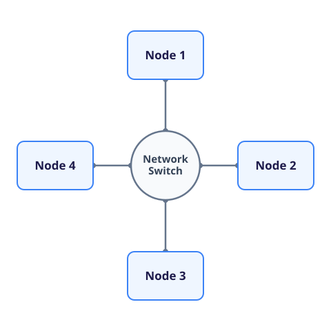
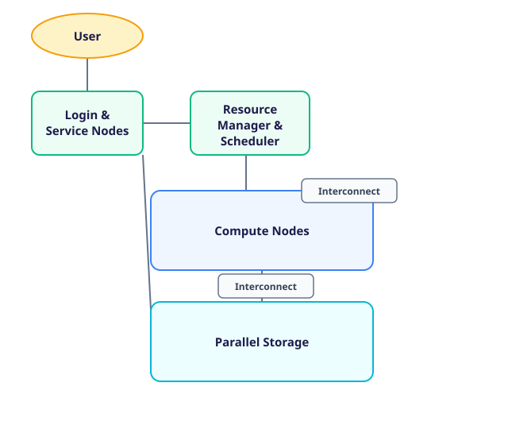

## From Shared Memory to Distributed Memory

The previous section examined a shared-memory computer, in which multiple CPU-cores access a common memory address space.
Even if you were to ignore the physical limitations of building a node with an arbitrary number of CPU-cores, adding more CPU-cores to this design eventually encounters limits in memory capacity, memory bandwidth and the complexity of maintaining a coherent view of memory.

Supercomputers extend their performance far beyond that of a single shared-memory computer by connecting many of them through a high-performance network.
Each of these computers is called a **compute node**.
Together, the nodes form a **distributed-memory system**.



In this architecture:

- Each node contains its own processors, memory and network interfaces.
- The CPU-cores within a node share an address space.
- Each node normally runs its own operating-system instance.
- Memory belonging to one node is not part of a cache-coherent address space shared by every other node.
- Software must arrange for data to be transferred between nodes over the network.

The network used for communication between compute nodes is usually called the **interconnect**.
A process cannot normally use an ordinary load or store instruction to access an arbitrary address in another node's memory.
It must instead cooperate with software on the other node, commonly by sending and receiving messages through a communication library.

Adding nodes therefore increases the aggregate number of CPU-cores and the aggregate amount of memory, but it results in a system that works fundamentally different to one with shared memory.
To use these additional resources for a single calculation, its data and work must be divided between nodes.

| Property | Within a compute node | Between compute nodes |
| --- | --- | --- |
| Memory | One shared address space | Separate address spaces |
| Communication | Reads and writes to shared memory | Data transferred over the interconnect |
| Coordination | Threads or processes synchronise access | Processes exchange messages |
| Principal constraint | Memory hierarchy and contention | Network latency, bandwidth and contention |

This distinction is fundamental to both supercomputer architecture and parallel software.
A modern supercomputer combines the two models: shared memory within each node and distributed memory across the complete machine.

## Distributing Data and Work

Consider a simulation that represents a physical domain as a two-dimensional grid.
On one node, the complete grid might be held in shared memory and updated by several CPU-cores.
If the grid is too large for one node, it can instead be divided into subdomains, with each node storing and updating one part.

Partitioning the grid solves the memory-capacity problem only if the calculation can also be reorganised around those partitions.
Each node should perform as much work as possible using its local data.
When an update depends on values held by another node, the relevant data must be transferred over the interconnect.

For a calculation using a regular grid, neighbouring subdomains often exchange their boundary values.
These boundary regions are commonly called **halo** or **ghost** regions and can help avoid unnecessary communication.
Exchanging a narrow boundary is much less expensive than moving the complete subdomain, but it still introduces communication and coordination that were unnecessary when all the data was contained in one shared address space.

::::challenge{id=sc_distributed.partitioning title="Partitioning a Grid Across Nodes"}
A program stores one \(131\,072 \times 131\,072\) grid of double-precision values.
Each value occupies eight bytes.
The available compute nodes each have 32 GiB of memory.

The program will use eight nodes and divide the grid into equal horizontal strips.

1. Calculate the total size of the grid in GiB and confirm that it cannot fit in one node.
1. Calculate the number of rows and the amount of grid data held by each node.
1. One grid row contains the boundary values needed by an adjacent strip.
   Calculate the size of one boundary row.
1. How much boundary data must an interior node send during one update if it exchanges one row with each of its two neighbours?
1. Why is exchanging boundary rows preferable to giving every node a complete copy of the grid?

:::solution
The grid contains:

```math
131\,072^2 = 2^{34}
```

values.
At eight bytes per value, it occupies \(2^{37}\) bytes, or 128 GiB.
It therefore cannot fit in a node with 32 GiB of memory.

Dividing \(131\,072\) rows equally between eight nodes gives \(16\,384\) rows per node.
Each node stores one eighth of the grid:

```math
\frac{128\ \text{GiB}}{8} = 16\ \text{GiB}.
```

One row contains \(131\,072\) values and therefore occupies:

```math
131\,072 \times 8 = 1\,048\,576\ \text{bytes} = 1\ \text{MiB}.
```

An interior node has two neighbours, so sending one boundary row to each transfers 2 MiB per update.
The first and last nodes have only one neighbouring strip and send 1 MiB.

Replicating the complete grid would require 128 GiB on every node, which exceeds the available memory and discards the capacity gained by distributing it.
Boundary exchange keeps the bulk of the data local while transferring only the values required to coordinate adjacent subdomains.
:::
::::

In many cases, every grid point requires the same calculations, so dividing the grid into equal strips also divides the work equally.
This is not true of every application.
Particles may cluster in one region, an adaptive mesh may contain more detail in some subdomains, or the calculation performed at each point may vary.
An equal division of data can then leave some nodes with considerably more work than others.
A useful decomposition must therefore balance memory use, computation and communication rather than considering data size alone.
Producing such a decomposition is often a non-trivial part of parallel software development.

## Latency and Bandwidth

Communication performance is usually described using two complementary quantities:

- **Latency** is the largely fixed delay associated with initiating and completing a communication operation.
- **Bandwidth** is the rate at which data can be transferred once a transfer is under way.

An idealised time for transferring one message is:

```math
t_{\mathrm{message}}
\approx
t_{\mathrm{latency}}
+
\frac{\text{message size}}{\text{bandwidth}}.
```

Latency dominates when a program sends many small messages because the fixed cost is paid for every message.
Bandwidth dominates when messages are large enough that transferring their contents takes much longer than initiating them.

This model is a useful first approximation rather than a complete description.
Real communication time also depends on protocol overheads, network topology, competing traffic and whether communication can proceed concurrently with computation.

:::callout{variant="info"}
Well-designed parallel programs can sometimes hide part of the communication cost by **overlapping communication with computation**.
In the grid example, a node could begin exchanging halo values, update interior points that do not depend on the incoming data, and then update its boundary points once the exchange is complete.
This does not eliminate the communication time, but it reduces the time spent waiting if sufficient independent work is available.
:::

::::challenge{id=sc_distributed.communication title="Comparing Communication Strategies"}
Consider a fictional interconnect with a latency of \(2\ \mu\text{s}\) and a bandwidth of \(25\ \text{GB/s}\).
Assume that messages are sent sequentially over one link and that the idealised transfer model applies.

1. Estimate the time required to send one 1 KiB message.
1. Estimate the total time required to send 1024 separate 1 KiB messages.
1. The same 1 MiB of data could instead be sent as one message.
   Estimate the time required for this transfer.
1. What do the results imply for a program that can combine several small messages?
1. Identify one reason why a measurement on a real system might differ from these estimates.

:::solution
For a 1 KiB message:

```math
t
\approx
2 \times 10^{-6}
+
\frac{1024}{25 \times 10^9}
=
2.041 \times 10^{-6}\ \text{s}.
```

The transfer therefore takes approximately \(2.04\ \mu\text{s}\).

Sending 1024 such messages sequentially takes:

```math
1024 \times 2.041\ \mu\text{s}
\approx
2.09\ \text{ms}.
```

One 1 MiB message takes:

```math
t
\approx
2 \times 10^{-6}
+
\frac{1\,048\,576}{25 \times 10^9}
=
4.394 \times 10^{-5}\ \text{s},
```

or approximately \(43.9\ \mu\text{s}\).

The total amount of data is the same, but combining the transfers pays the latency cost once rather than 1024 times.
Under this model, the combined message is about 48 times faster.
This is obviously less useful if the 48 messages need to go to 48 different nodes, but it illustrates the importance of reducing the number of messages when possible.

A real measurement might be affected by protocol overheads, other traffic using the same links, the route through the network, buffering or overlap between communication and computation.
:::
::::

## A Hierarchy of Communication

The division between shared and distributed memory is clear at the level of a programming model, but the hardware contains several additional layers.
A compute node may contain multiple processor sockets, each with several memory controllers and groups of CPU-cores.
All the cores can access one address space, but access to physically closer memory is faster than access through another part of the node.
This arrangement is called **non-uniform memory access**, or NUMA.

A useful simplified hierarchy is therefore:

1. A CPU-core accesses registers and private caches.
1. Groups of CPU-cores share later cache levels and memory controllers.
1. NUMA regions form one shared address space within a compute node.
1. Compute nodes exchange data through network interfaces and switches.

Communication generally becomes more expensive as it moves through this hierarchy.
A cache access is cheaper than an access to main memory, and transferring data to another node is substantially more expensive than either.
Parallel software performs best when it retains data close to the processing units that use it and avoids unnecessary movement between levels.

The interconnect itself also has a hierarchy.
Connecting thousands of nodes to one switch is neither physically practical nor sufficiently fault tolerant, so large systems use many switches arranged in a **network topology**.
Messages may travel through several switches, and simultaneous transfers may compete for some of the same links.

A supercomputer interconnect is therefore designed for more than a high bandwidth on one connection.
It must provide low latency, substantial aggregate bandwidth and enough alternative routes to support communication between many nodes at once.
The topology and placement of an allocation can affect performance even when every node has the same processors and memory.

## The Complete System

Compute nodes and their interconnect perform most numerical work, but they are not a complete supercomputing service.
Users must be able to prepare programs and data, work must be allocated to compute nodes, and results must be stored after a calculation finishes.



| Component | Role |
| --- | --- |
| Compute nodes | Execute computational workloads using CPU-cores, memory and sometimes accelerators |
| Interconnect | Carries data and coordination between compute nodes |
| Login and service nodes | Provide user access, software-development and system-management services |
| Parallel storage | Supplies shared, persistent storage with enough aggregate bandwidth for many nodes |
| Resource manager and scheduler | Allocate parts of the shared machine to different workloads |
| Power and cooling infrastructure | Supply densely packed hardware and remove the heat it produces |

Storage must scale in much the same way as computation.
A single disk or storage server cannot supply thousands of compute nodes efficiently, so high-performance file systems distribute data and requests across multiple storage devices and servers.
Application performance can be limited by storage traffic just as it can be limited by memory or network traffic.

The resource manager and scheduler are necessary because the machine is shared, but they are operational tools rather than a feature of the distributed-memory programming model.
The Intro to HPC course examines how users connect to a system, submit work and use its storage.

Dense packaging reduces the length and quantity of network cabling, but it concentrates electrical demand and heat.
Power distribution and cooling are therefore part of the system design rather than external details.
The later section on measuring supercomputers examines power and energy as performance considerations.

## ARCHER2 as an Example

[ARCHER2](https://docs.archer2.ac.uk/user-guide/hardware/) illustrates how these components form a hierarchy.
The exact specifications are particular to one system; their value here is showing how the general architecture appears in a real machine.

| Level or component | ARCHER2 example |
| --- | --- |
| Compute node | Two 64-core AMD EPYC processors, giving 128 CPU-cores |
| Memory hierarchy | Eight NUMA regions and either 256 GB or 512 GB of memory per node |
| Complete compute system | 5,860 compute nodes and 750,080 CPU-cores |
| Interconnect | HPE Slingshot with two 100 Gb/s injection ports per node in a dragonfly topology |
| Service nodes | Separate login and data-analysis nodes |
| Persistent work storage | Four 3.6 PB parallel storage systems |
| Fast temporary storage | A 1.1 PB NVMe burst buffer |


*© EPCC*

The system has hundreds of terabytes of memory in aggregate, but that memory is not one shared address space.
An application using several nodes must still partition its data and communicate between those nodes.
Similarly, the interconnect's aggregate capacity does not eliminate the latency of individual transfers or contention between simultaneous ones.

A distributed-memory architecture makes an extremely large machine physically achievable.
It also exposes communication, data placement and coordination as software concerns.
The parallel-programming courses examine how programs address those concerns.

The next section considers accelerators such as GPUs, which add another kind of processing and memory hierarchy within compute nodes.
The final section then examines how the performance and energy efficiency of complete systems are measured.
