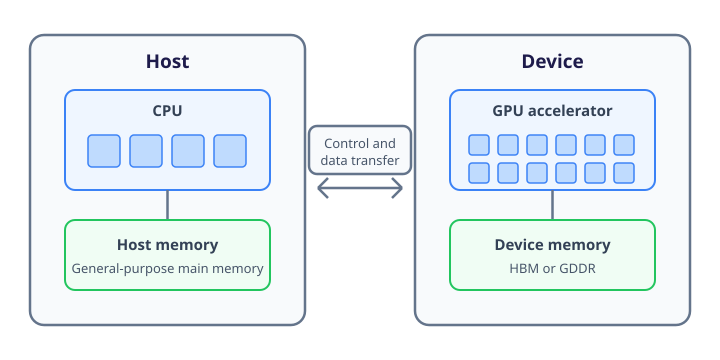

## Accelerators in a Compute Node

The shared-memory and distributed-memory architectures introduced in the previous sections are built around general-purpose CPUs.
A CPU must run operating systems, respond to external events and execute programs containing varied instructions and complex control flow.
Its hardware is designed to perform this wide range of work with low latency.

An **accelerator** is a processor designed to perform a narrower class of operations with greater throughput or energy efficiency.
It supplements the CPU rather than replacing it.
The CPU continues to run the operating system and the general parts of an application, while suitable computational work is **offloaded** to the accelerator.
A node containing different kinds of processor is described as a **heterogeneous** computing system.

Graphics processing units, or GPUs, are the most widely used accelerators in contemporary supercomputing.
They were originally developed to perform the highly parallel calculations required to render computer graphics.
The same ability to apply similar operations to large collections of data is useful in numerical simulation, data analysis and machine learning.
Using a GPU for work other than rendering graphics is usually called **general-purpose GPU computing**.

:::callout{variant="info"}
An accelerator is not *necessarily* a GPU.
Other examples include field-programmable gate arrays, processors specialised for matrix or tensor operations, and application-specific integrated circuits.
This section concentrates on GPUs because many leading supercomputers derive a large fraction of their theoretical peak performance from them.
:::

## How a GPU Produces Throughput

A modern CPU contains a relatively small number of highly sophisticated cores.
Features such as large caches, branch prediction and out-of-order execution help each core make progress through irregular instruction streams and reduce the time required to complete one thread of work.

A GPU makes a different trade-off.
More of its hardware is devoted to arithmetic units and to managing a very large number of lightweight threads.
The GPU groups threads together and executes a common instruction across several data elements.
This style of execution is commonly called **single-instruction, multiple-thread**, or SIMT.

For example, an operation that updates every element of a large array can assign one element, or a small group of elements, to each thread.
Thousands of threads may be ready to run.
When one group is waiting for data, the GPU can execute another, allowing useful arithmetic to continue while memory operations are in progress.

::::challenge{id=sc_accelerators.concurrency title="Keeping the GPU Occupied"}
Consider a fictional GPU with 80 compute units, each of which schedules and executes groups of threads.
Threads are scheduled in execution groups of 64.
Assume that each compute unit needs eight ready groups to hide memory latency effectively.
A kernel assigns one thread to each data element.

1. Calculate the number of execution groups created for an array containing 8192 elements.
1. Calculate the total number of execution groups and threads required to provide eight groups to every compute unit.
1. Does the 8192-element calculation expose enough parallelism to reach this target?
1. Repeat the first calculation for an array containing 1,048,576 elements and compare the available parallelism with the target.
1. Eight independent 8192-element arrays must be processed.
   What opportunity would processing them together create?
1. Do these calculations establish that either workload will run faster on the GPU than on a CPU?

:::solution
The smaller array creates:

```math
\frac{8192}{64} = 128
```

execution groups.

Providing eight groups to each of 80 compute units requires:

```math
80 \times 8 = 640
```

groups, containing:

```math
640 \times 64 = 40\,960
```

threads.
The 128 groups from the smaller calculation can provide an average of only 1.6 groups per compute unit, so this simplified model does not expose enough parallelism to hide latency effectively.

The larger array creates:

```math
\frac{1\,048\,576}{64} = 16\,384
```

groups.
This is much greater than the 640-group target, allowing the GPU to maintain the target number of ready groups as earlier groups complete.

Processing eight smaller arrays together would expose:

```math
8 \times 8192 = 65\,536
```

threads, or 1024 groups.
Combining independent work in this way is often called **batching** and can make better use of an accelerator.

These calculations describe only the amount of available parallelism.
They do not account for the work performed by each thread, memory-access patterns, branch divergence, data movement, kernel-launch overheads or CPU performance.
Insufficient concurrency can limit GPU utilisation, but sufficient concurrency does not by itself guarantee that GPU execution will be faster.
:::
::::

| Characteristic | CPU | GPU |
| --- | --- | --- |
| Primary design objective | Low latency and general-purpose execution | High throughput on parallel work |
| Concurrent work | A modest number of heavyweight threads | Very many lightweight threads |
| Control flow | Handles varied and irregular paths well | Most efficient when grouped threads follow similar paths |
| Memory system | Large caches and general-purpose main memory | High-bandwidth device memory and many active memory operations |
| Typical role | Control, serial work and varied computation | Repeated computation over large datasets |

Threads in a group execute the same instruction together, but each operates on its own registers and data, so the values they calculate can differ.
However, when threads in one execution group take different branches, the hardware may have to execute each path separately while disabling threads that do not follow it.
This **branch divergence** reduces the proportion of the GPU's arithmetic hardware doing useful work.

Memory-access patterns matter for the same reason.
The hardware can combine nearby requests from a group of threads into a smaller number of memory transactions.
Scattered or unpredictable access prevents this **coalescing** and makes it harder to use the available memory bandwidth.

:::callout{variant="info"}
CPU and GPU “core” counts are not directly comparable.
Manufacturers use the word *core* for execution resources with very different capabilities, and sometimes count different levels of the GPU hierarchy.
Architecture, supported operations, memory bandwidth and measured workload performance are more informative than the raw number of cores.
:::

Accelerators may also contain specialised units for operations such as matrix multiplication and may provide very different peak rates for different numerical precisions.
A GPU may, for example, perform many more 32-bit or 16-bit floating-point operations per second than 64-bit operations.
This does not mean that GPU calculations are necessarily less precise: the program chooses a numerical precision supported by the hardware.
It does mean that applications requiring 64-bit arithmetic may achieve a much smaller fraction of the performance advertised for lower-precision workloads.
A quoted GPU performance is incomplete unless it identifies the operation and precision being measured.
The next section develops this point when comparing theoretical and measured performance.

## Host and Device Memory

In a common accelerator design, the CPU and its main memory are called the **host**, while the GPU and memory attached to it are called the **device**.
The application begins on the host, arranges for data to be available in device memory and launches a **kernel** containing the code that will run across many GPU threads.



Many data-centre GPUs use **High Bandwidth Memory (HBM)**, a stacked-memory technology designed to provide very high aggregate bandwidth.
Other GPUs use memory technologies such as GDDR.
Both provide high aggregate bandwidth, but their capacity is finite and their bandwidth is shared among many active GPU threads.

For a discrete GPU, host and device memory are physically separate.
The CPU and GPU can each access their own local memory through a dedicated memory interface.
Moving data between host and device memory must also cross a host-device interconnect, commonly PCI Express (PCIe), and is typically much slower than either processor accessing its own memory.
The total runtime of an offloaded calculation therefore includes:

- Preparing and transferring its input data.
- Launching work on the accelerator.
- Executing the GPU kernel.
- Transferring results needed by the host.

Acceleration is worthwhile only if faster kernel execution saves enough time to offset the additional preparation, launch and transfer costs.

Repeated transfers can often be avoided by keeping data in device memory while several kernels operate on it.
Transfers and kernel execution may also be overlapped when they do not depend on one another.
These techniques do not make movement free, but they can prevent it from becoming the dominant part of the runtime.

:::callout{variant="info"}
Some systems provide a unified address space or integrate CPU and GPU hardware into one package.
This can remove the need for explicit copies in the source code, but it does not guarantee that every processor accesses every location at the same speed.
Pages or cache lines may still move between physical memory regions, so data placement and movement remain performance considerations.
:::

## When To Use an Accelerator

An accelerator is useful only when the relevant part of an application matches its architecture.
GPU acceleration is most promising when a workload has:

- Enough independent work to occupy many GPU threads.
- Similar operations applied across a large dataset.
- Predictable control flow with limited branch divergence.
- Regular memory access that can use device bandwidth efficiently.
- Sufficient computation to justify data-transfer and kernel-launch overheads.

The relationship between computation and data movement can be described using **arithmetic intensity**:

```math
\text{arithmetic intensity}
=
\frac{\text{arithmetic operations performed}}{\text{bytes of data moved}}.
```

The relevant data movement depends on the part of the system being analysed.
For an offloaded calculation it may mean transfer between host and device memory; for a GPU kernel it may mean transfer from device memory to the GPU's execution units.

A calculation performing many operations on each item after it reaches device memory has high arithmetic intensity.
It has a better opportunity to benefit from the GPU's arithmetic throughput than a calculation that transfers a large dataset, performs one inexpensive operation and immediately transfers the result back.

Small calculations, heavily sequential algorithms, unpredictable branches and irregular memory access may make poor use of a GPU.
An application can also contain a mixture of suitable and unsuitable phases.
Accelerating one phase does not reduce the time spent in the rest of the application, so the effect must be assessed using the runtime of the complete workload.

::::challenge{id=sc_accelerators.movement title="Accounting for Data Movement"}
One transformation reads an 8 GB array and produces an 8 GB result.
It takes \(0.90\ \text{s}\) on a CPU.

An implementation of the same transformation has a GPU kernel time of \(0.15\ \text{s}\) and a kernel-launch overhead of \(0.002\ \text{s}\).
Data can be transferred between host and device memory at \(32\ \text{GB/s}\) in either direction.
Assume transfers and computation do not overlap.

1. Calculate the time required to copy the input to the GPU and the result back to the CPU.
1. Calculate the total GPU-based runtime for one transformation and its speedup relative to the CPU.
1. The program now performs ten consecutive transformations, with each result becoming the input to the next.
   Calculate the CPU runtime.
1. Calculate the GPU-based runtime if the array is copied to the device once, remains there for all ten kernels and is copied back only after the final transformation.
1. What do the two speedups reveal about the importance of data residency?

:::solution
Transferring 8 GB at \(32\ \text{GB/s}\) takes:

```math
\frac{8\ \text{GB}}{32\ \text{GB/s}} = 0.25\ \text{s}.
```

One input and one output transfer therefore take \(0.50\ \text{s}\).
The complete GPU-based time for one transformation is:

```math
0.25 + 0.002 + 0.15 + 0.25 = 0.652\ \text{s}.
```

The speedup relative to the CPU is:

```math
\frac{0.90}{0.652} \approx 1.38.
```

Ten transformations take \(10 \times 0.90 = 9.0\ \text{s}\) on the CPU.

Keeping the array in device memory requires one input transfer, ten kernel launches and executions, and one final output transfer:

```math
0.25
+
10 \times (0.002 + 0.15)
+
0.25
=
2.02\ \text{s}.
```

The resulting speedup is:

```math
\frac{9.0}{2.02} \approx 4.46.
```

For one transformation, most of the potential benefit is consumed by moving data.
Keeping the array resident allows ten kernels to reuse it while paying the host-device transfer cost only once in each direction.
The example therefore gives the same GPU a much larger benefit without changing its kernel performance.

Real performance would also depend on whether the array fits in device memory, whether the transfer rate is sustained, and whether the GPU kernel actually reaches the assumed runtime.
:::
::::

## Accelerators in a Distributed System

An accelerated compute node may contain one or more CPUs, several GPUs, separate pools of host and device memory, and high-speed links between those components.
The network interface then connects the complete node to the rest of the distributed-memory system.

Using several accelerated nodes introduces at least two levels of decomposition:

1. Data and work are divided between nodes.
1. Work assigned to each node is divided between its CPU and accelerators.

Communication may travel through several distinct paths: between CPU and GPU memory, between GPUs in one node, or through the interconnect to another node.
The slowest or most heavily used path can limit the complete application even when the accelerator itself executes kernels quickly.

[Frontier](https://docs.olcf.ornl.gov/systems/frontier_user_guide.html) provides a concrete example of this hierarchy.
Each compute node combines one 64-core AMD CPU with four AMD MI250X accelerator packages.
Those packages expose eight GPU devices with 512 GB of high-bandwidth memory in total, alongside 512 GB of CPU memory.
Dedicated links connect the CPU, GPUs and four external network interfaces.

The design gives each node substantial accelerator throughput, but it also makes locality important.
Performance can depend on which CPU threads prepare the work, which GPU holds the data and which network interface carries communication to another node.
The hardware's peak rates do not by themselves show whether an application uses those paths effectively.

:::callout{variant="info"}
Accelerators can be programmed using interfaces and models such as CUDA, HIP, SYCL and OpenMP offloading.
These approaches expose similar architectural requirements in different ways.
The parallel-programming courses address programming models; the concern here is the hardware behaviour they expose.
:::

Accelerators add substantial computational capability to a node, but also introduce new execution and memory hierarchies.
Their value depends on parallel work, suitable data access and careful control of data movement.

The next section examines how processor and accelerator capabilities contribute to theoretical peak performance, how benchmarks measure complete systems and why neither quantity predicts every application's runtime.
