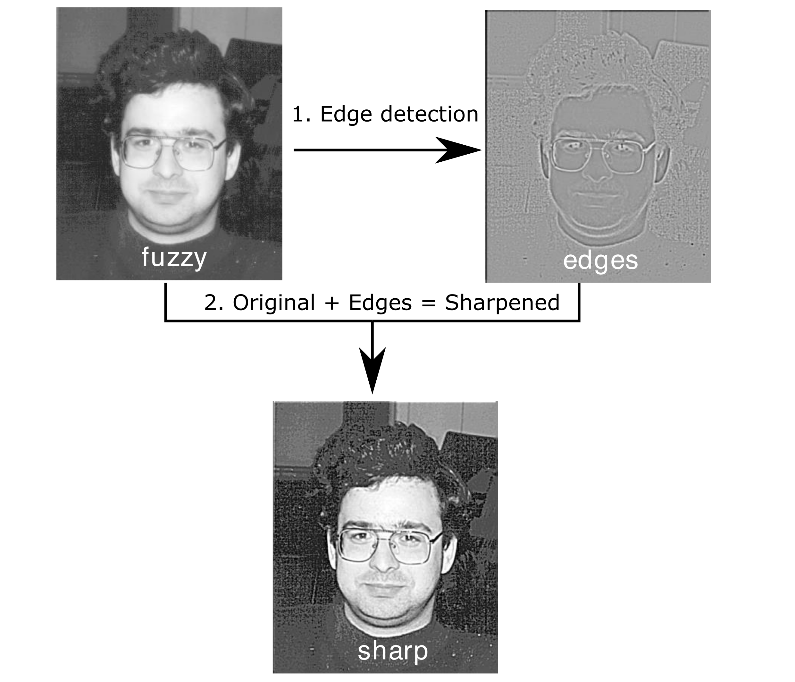
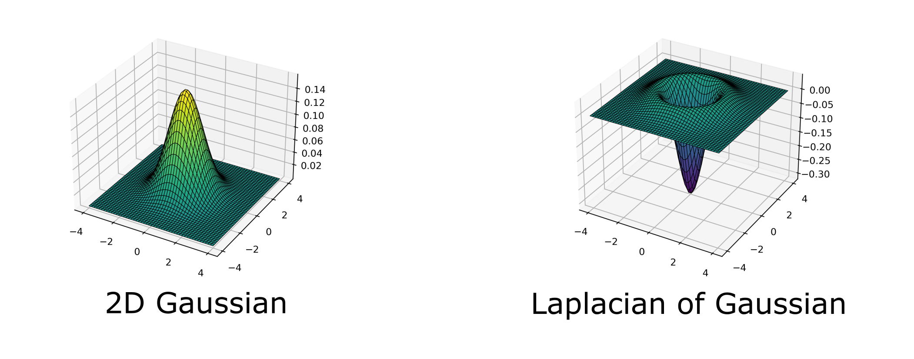
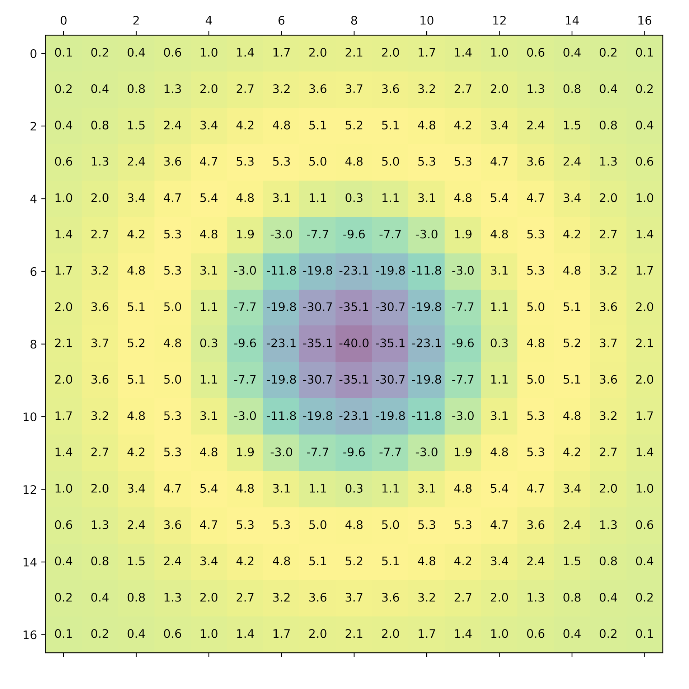

## Part 1: Introduction & Theory

Images can be fuzzy from random noise and blurrings.

An image can be sharpened by:  

  1. detecting the edges  
  2. combining the edges with the original image  

These steps are shown in the figure below.


*Image sharpening steps*

---

### Edge detection

Edges can be detected using a Laplacian filter. The Laplacian $L(x,y)$ is the second spatial derivative of the image intensity $I(x,y)$. This means it highlights regions of rapid intensity change, i.e the edges.

$$
L(x,y) = \frac{\partial^2 I }{\partial x^2} +  \frac{\partial^2 I }{\partial y^2}
$$

In practice, the Laplacian also highlights the noise in the image and, therefore, it is sensible to apply smoothing to the image as a first step. Here we will apply a Guassian filter. The Guassian filter $G(x,y)$ approximates each pixel as a weighted average of its neighbors.

$$
G(x,y) = \frac{1}{2 \pi \sigma^2} e^{- (x^2+y^2)/(2 \sigma^2)}
$$

The two operations can be combined to give the Laplacian of Gaussian filter $L \circ G(x,y)$.

$$
L \circ G(x,y) = -\frac{1}{\pi \sigma^4} \left( 1 -  \frac{x^2+y^2}{2 \sigma^2}\right)  e^{- (x^2+y^2)/(2 \sigma^2)}
$$

These two functions $G(x,y)$ and $L \circ G(x,y)$ are graphed below.


*"Gaussian" and "Laplacian of Gaussian" filters*

---

### Implementation

To apply the $L \circ G$ filter to an image the $L \circ G$ filter must be turned into a discrete mask, that is a matrix of size 2d+1 x 2d+1 where d is an integer. We use d=8, therefore the $L \circ G$ filter is a 17x17 square, it looks like this:


*$L \circ G$ filter as a discrete mask*

To perform the convolution of this filter with the original image, the following operation is performed on each pixel,

$$
\text{edges}(i,j) = \sum_{k=-d}^d \sum_{l=-d}^d  \text{image}(i + k, j + l) \times \text{filter}(k,l),
$$

the sharpened image is then created by adding the edges to the original image, with a scaling factor (See the source code for the full details).

---

## Part 2: Download, Compile, Run

### Downloading the source code

In this exercise we will be using an image sharpening program which is available in a Github repository.
To download the code you will need to clone the repository, e.g.:

```bash
git clone https://github.com/UNIVERSE-HPC/foundation-exercises
```

Alternatively you might have already cloned the repository as part of another exercise in which case skip this step.

If you clone the repository the output will look similar to this

```output
Cloning into 'foundation-exercises'...
remote: Enumerating objects: 131, done.
remote: Counting objects: 100% (131/131), done.
remote: Compressing objects: 100% (69/69), done.
remote: Total 131 (delta 56), reused 127 (delta 55), pack-reused 0
Receiving objects: 100% (131/131), 366.62 KiB | 3.05 MiB/s, done.
Resolving deltas: 100% (56/56), done.
```

You will now have a folder called `foundation-exercises. Change directory into where the sharpening code is located and list the contents:

```bash
cd foundation-exercises/sharpen
ls
```

Output:

```output
C-MPI  C-OMP  C-SER  F-MPI  F-OMP  F-SER
```

There are several version of the code, a serial version and a number of parallel versions both for the C language and for Fortran. Initially we will be looking at the serial version located in the `C-SER` folder.

### Compiling the source code

We will compile the serial version of the source code using a Makefile.

Move into the ``C-SER`` directory and list the contents.

```bash
cd C-SER
ls
```

Output:

```output
cio.c  dosharpen.c  filter.c  fuzzy.pgm  Makefile  sharpen.c  sharpen.h  sharpen.slurm  utilities.c  utilities.h
```

You will see that there are various code files. The Makefile contains the commands to compile them together to produce the executable program. To use the Makefile type ``make`` command.

```bash
make
```

Output:

```output
cc -O3 -DC_SERIAL_PRACTICAL -c sharpen.c
cc -O3 -DC_SERIAL_PRACTICAL -c dosharpen.c
cc -O3 -DC_SERIAL_PRACTICAL -c filter.c
cc -O3 -DC_SERIAL_PRACTICAL -c cio.c
cc -O3 -DC_SERIAL_PRACTICAL -c utilities.c
cc -O3 -DC_SERIAL_PRACTICAL -o sharpen sharpen.o dosharpen.o filter.o cio.o utilities.o -lm
```

This should produce an executable file called `sharpen``.

### Running the serial program

We can run the serial program directly on the login nodes

```bash
./sharpen
```

You should see something like:

```output
Image sharpening code running in serial

Input file is: fuzzy.pgm
Image size is 564 x 770

Using a filter of size 17 x 17

Reading image file: fuzzy.pgm
... done

Starting calculation ...
... finished

Writing output file: sharpened.pgm

... done

Calculation time was 1.378783 seconds
Overall run time was 1.498794 seconds
```

You should find an output file `sharpened.pgm` which contains the sharpened image.

::::callout

## Would you like to know more?

If you're interested in the implementation itself, take a look at the code - particularly `dosharpen.c`.
::::

### Viewing the images

To view the sharpened image, you'll need to copy the file from ARCHER2 to your local machine.
Fortunately, we can use the `scp` (secure copy) command to do this over SSH.
From a terminal on your local machine or laptop.
Use the `pwd` command to output your current directory location, and use it with `scp` to copy the original and sharpened files over, e.g.:

```bash
scp username@login.archer2.ac.uk:/work/[project code]/[group code]/[username]/foundation-exercises/sharpen/C-SER/fuzzy.pgm .
scp username@login.archer2.ac.uk:/work/[project code]/[group code]/[username]/foundation-exercises/sharpen/C-SER/sharpened.pgm .
```

Then you should be able to open and view the image file on your local machine.

::::callout

## What about viewing the file *without* copying?

Another way to view this file more directly without having to copy it is to install X window client installed on your local machine and then log into the remote machine with X forwarding enabled.
Covering this in detail is beyond the scope of this course, although the ARCHER2 [documentation on connecting](https://docs.archer2.ac.uk/user-guide/connecting/#logging-in) has some information.
::::

::::challenge{id=sc_practical_pr.1 title="Submit sharpen to a compute node"}

## Submitting to a compute node

Write a Slurm script to run sharpen on a compute node, and submit it.

:::solution

```bash
#!/bin/bash

#SBATCH --job-name=Sharpen
#SBATCH --nodes=1
#SBATCH --tasks-per-node=1
#SBATCH --cpus-per-task=1
#SBATCH --time=00:01:00

# Replace [project code] below with your project code (e.g. t01)
#SBATCH --account=[project code]
#SBATCH --partition=standard
#SBATCH --qos=standard

./sharpen
```

When you submit this using `sbatch`, after it's finished you should see the output in the `slurm-` output log file look very similar to when you ran it directly.

:::

::::
