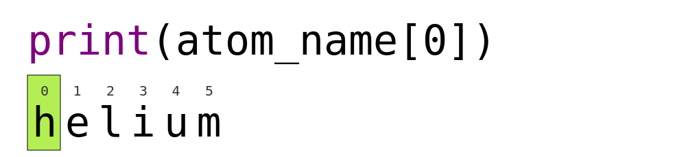

## Using variables to store values

**Variables** are names which refer to stored values.
In Python, the `=` symbol assigns the value on the right to the name on the left. The variable is created when a value is assigned to it.
Here, Python assigns an age to a variable `age` and a name in quotes to a variable `first_name`.

```python
age = 42
first_name = 'Ahmed'
```

- Variable names in Python
  - can **only** contain letters, digits, and underscore `_` (typically used to separate words in long variable names)
  - cannot start with a digit
  - are **case sensitive** (`age`, `Age` and `AGE` are three different variables)
- Variable names starting with underscores like `__alistairs_real_age` have special meaning so we won't do that until we understand the convention.

## Use `print` to display values

Python has a built-in function called `print` that produces a printout as text to the terminal.
Like any function, we can call print (i.e., tell Python to run it) by using its name while providing values to the function (i.e., the things to print) in parentheses.
To add a string to the printout, wrap the string in single or double quotes
The values passed to the function are called **arguments** (or args for short).

```python
print(first_name, 'is', age, 'years old')
```

```text
Ahmed is 42 years old
```

`print` automatically puts a single space between items to separate them
and wraps around to a new line at the end.

## Variables must be created before they are used

If a variable doesn't exist yet, or if the name has been mis-spelled, Python reports an error (unlike some languages, which "guess" a default value)

```python nolint
print(last_name)
```

```error
Traceback (most recent call last):
  File "<stdin>", line 1, in <module>
NameError: name 'last_name' is not defined
```

- The last line of an error message is usually the most informative
- We will look at error messages in detail [later](12_errors_and_exceptions)

## Variables can be used in calculations

- We can use variables in calculations just as if they were values.
  - Remember, we assigned the value `42` to `age` a few lines ago.

```python
print('Age in three years:', age + 3)
```

```text
Age in three years: 45
```

## Variables can be replaced

- We can replace the value associated with a variable by assigning it a new one.
- Replacing a variable permanently deletes the old value.

```python
age = age + 3
print('Age in three years:', age)
```

```text
Age in three years: 45
```

## Use an index to get a single character from a string

- An item in a list is called an element.
  Whenever we treat a string as if it were a list, the string's elements are the individual characters.
- The characters (individual letters, numbers, and so on) in a string are ordered.
  For example, the string `'AB'` is not the same as `'BA'`.
  Because of this ordering, we can treat the string as a list of characters.
  - We will look at [lists in python more generally later](08_lists)
- Each position in the string (first, second, etc.) is given a number.
  This number is called an **index** or sometimes a subscript.
- Indices are numbered from 0.
- Use the position's index in square brackets to get the character at that position.



```python
atom_name = 'helium'
print(atom_name[0])
```

```text
h
```

## Use a slice to get a substring

A slice is subpart of a string (or, more generally, any list-like thing).
When a slice is taken of a string, this is called a **substring**.
These substrings can be as short as a single character.

We can take a slice with `[start:stop]`, where `start` is the index of the first element we want to select and `stop` is the index of the element after the last element.
Mathematically, you might say that a slice selects `[start:stop)` or that the bounds are inclusive on the left and exclusive on the right.
The difference between `stop` and `start` is the slice's length.
Taking a slice does not change the contents of the original string,
instead, the slice is a copy of part of the original string.

```python
atom_name = 'sodium'
print(atom_name[0:3])
```

```text
sod
```

## Use the built-in function `len` to find the length of a string

```python
print(len('helium'))
```

```text
6
```

Here we have nested two function calls, `len` and `print`,
nested functions are evaluated from the inside out, like in mathematics.

## Python is case-sensitive

Python treats upper- and lower-case characters as distinct:

- `Name` and `name` are different variables.

There are conventions for when to use upper-case letters at the start of variable names; we will stick to strictly lower-case characters for now.

## Use meaningful variable names

Python doesn't care what you call variables as long as they obey the rules (alphanumeric characters and the underscore).

```python
flabadab = 42
ewr_422_yY = 'Ahmed'
print(ewr_422_yY, 'is', flabadab, 'years old')
```

However, code is supposed to be read by other humans:

- Use meaningful variable names to help other people understand what the program does.
- The most important "other person" is your future self.

::::challenge{id="swapping*values" title="Swapping Values"}
Fill the table showing the values of the variables in this program \_after* each statement is executed.

```text
# Command  # Value of x   # Value of y   # Value of swap #
x = 1.0    #              #              #               #
y = 3.0    #              #              #               #
swap = x   #              #              #               #
x = y      #              #              #               #
y = swap   #              #              #               #
```

:::solution

```text
# Command  # Value of x   # Value of y   # Value of swap #
x = 1.0    # 1.0          # not defined  # not defined   #
y = 3.0    # 1.0          # 3.0          # not defined   #
swap = x   # 1.0          # 3.0          # 1.0           #
x = y      # 3.0          # 3.0          # 1.0           #
y = swap   # 3.0          # 1.0          # 1.0           #
```

These three lines exchange the values in `x` and `y` using the `swap` variable for temporary storage. This is a fairly common programming idiom.
:::
::::

::::challenge{id="slicing_practice" title="Slicing practice"}
What does the following program print?

```python
atom_name = 'carbon'
print('atom_name[1:3] is:', atom_name[1:3])
```

:::solution

```text
atom_name[1:3] is: ar
```

:::
::::

::::challenge{id="slicing_concepts" title="Slicing concepts"}

1. What does `thing[low:high]` do?
2. What does `thing[low:]` (without a value after the colon) do?
3. What does `thing[:high]` (without a value before the colon) do?
4. What does `thing[:]` (just a colon) do?
5. What does `thing[number:some-negative-number]` do?
6. What happens when you choose a `high` value which is out of range? (i.e., try `atom_name[0:15]`)

:::solution

1. `thing[low:high]` returns a slice from `low` to the value before `high`
2. `thing[low:]` returns a slice from `low` all the way to the end of `thing`
3. `thing[:high]` returns a slice from the beginning of `thing` to the value before `high`
4. `thing[:]` returns all of `thing`
5. `thing[number:some-negative-number]` returns a slice from `number` to `some-negative-number` values from the end of `thing`
6. If a part of the slice is out of range, the operation does not fail. `atom_name[0:15]` gives the same result as `atom_name[0:]`.

:::
::::

## Every value has a type

In programming a "type" is a method of categorising like data which share characteristics, representations, common operations, etc.
Every value in a program has a specific type:

- Integer (`int`): represents positive or negative whole numbers like 3 or -512.
- Floating point number (`float`): represents real numbers like 3.14159 or -2.5.
- Character string (usually called "string", `str`): text.
  - Written in either single quotes or double quotes (as long as they match).
  - The quote marks aren't printed when the string is displayed.

## Use the built-in function `type` to find the type of a value

We can use the built-in function `type` to find out what type a value has, this works on variables as well.

- Remember: it is the _value_ which has a type --- the _variable_ name is just a label.

```python
print(type(52))
```

```text
<class 'int'>
```

```python
fitness = 'average'
print(type(fitness))
```

```text
<class 'str'>
```

## Types control what operations (or methods) can be performed on a given value

A value's type determines what the program can do to it.

```python
print(5 - 3)
```

```python
2
```

```python
print('hello' - 'h')
```

```text
---------------------------------------------------------------------------
TypeError                                 Traceback (most recent call last)
<ipython-input-2-67f5626a1e07> in <module>()
----> 1 print('hello' - 'h')

TypeError: unsupported operand type(s) for -: 'str' and 'str'
```

## You can use the "+" and "\*" operators on strings

"Adding" character strings concatenates them.

```python
full_name = 'Ahmed' + ' ' + 'Walsh'
print(full_name)
```

```text
Ahmed Walsh
```

Multiplying a character string by an integer _N_ creates a new string that consists of that character string repeated _N_ times. Since multiplication is repeated addition.

```python
separator = '=' * 10
print(separator)
```

```text
==========
```

## Strings have a length (but numbers don't)

The built-in function `len` counts the number of characters in a string.

```python
print(len(full_name))
```

```python
11
```

But numbers don't have a length (not even zero).

```python
print(len(52))
```

```text
---------------------------------------------------------------------------
TypeError                                 Traceback (most recent call last)
<ipython-input-3-f769e8e8097d> in <module>()
----> 1 print(len(52))

TypeError: object of type 'int' has no len()
```

## Must convert numbers to strings or vice versa when operating on them

Cannot add numbers and strings.

```python
print(1 + '2')
```

```text
---------------------------------------------------------------------------
TypeError                                 Traceback (most recent call last)
<ipython-input-4-fe4f54a023c6> in <module>()
----> 1 print(1 + '2')

TypeError: unsupported operand type(s) for +: 'int' and 'str'
```

Is not allowed in python because it is ambiguous: should `1 + '2'` be `3` or `'12'`? Some types can be converted to other types by using the type name as a function.

```python
print(1 + int('2'))
print(str(1) + '2')
```

```text
3
12
```

## Can mix integers and floats freely in operations

Integers and floating-point numbers can be mixed in arithmetic. Python 3 automatically converts integers to floats as needed.

```python
print('half is', 1 / 2.0)
print('three squared is', 3.0 ** 2)
```

```text
half is 0.5
three squared is 9.0
```

## Variables only update on assignment

If we make one cell in a spreadsheet depend on another, and update the latter, the former updates automatically. This does **not** happen in programming languages.

```python
first = 1
second = 5 * first
first = 2
print('first is', first, 'and second is', second)
```

```text
first is 2 and second is 5
```

The computer reads the value of `first` when doing the multiplication, creates a new value, and assigns it to `second`.
After that, `second` does not remember where it came from.

::::challenge{id="automatic_type_conversion" title="Automatic Type Conversion"}
What type of value is 3.25 + 4?
:::solution
It is a float: integers are automatically converted to floats as necessary.

```python
result = 3.25 + 4
print(result, 'is', type(result))
```

```text
7.25 is <class 'float'>
```

:::
::::

::::challenge{id="choose_a_type" title="Choose a Type"}
What type of value (integer, floating point number, or character string) would you use to represent each of the following? Try to come up with more than one good answer for each problem. For example, in # 1, when would counting days with a floating point variable make more sense than using an integer?

1. Number of days since the start of the year.
2. Time elapsed from the start of the year until now in days.
3. Serial number of a piece of lab equipment.
4. A lab specimen's age.
5. Current population of a city.
6. Average population of a city over time.

:::solution
The answers to the questions are:

1. Integer, since the number of days would lie between 1 and 365.
2. Floating point, since fractional days are required.
3. Character string if serial number contains letters and numbers, otherwise integer if the serial number consists only of numerals.
4. This will vary! How do you define a specimen's age? whole days since collection (integer)? date and time (string)?
5. Choose floating point to represent population as large aggregates (eg millions), or integer to represent population in units of individuals.
6. Floating point number, since an average is likely to have a fractional part.

:::
::::

::::challenge{id="division_types" title="Division Types"}

In Python 3, the `//` operator performs integer (whole-number) floor division, the `/` operator performs floating-point
division, and the `%` (or _modulo_) operator calculates and returns the remainder from integer division:

```python
print('5 // 3:', 5 // 3)
print('5 / 3:', 5 / 3)
print('5 % 3:', 5 % 3)
```

```text
5 // 3: 1
5 / 3: 1.6666666666666667
5 % 3: 2
```

If `num_subjects` is the number of subjects taking part in a study, and `num_per_survey` is the number that can take part in a single survey, write an expression that calculates the number of surveys needed to reach everyone once.

:::solution
We want the minimum number of surveys that reaches everyone once, which is the rounded up value of `num_subjects/ num_per_survey`.
This is equivalent to performing a floor division with `//` and adding 1.
Before the division we need to subtract 1 from the number of subjects to deal with the case where `num_subjects` is evenly divisible by `num_per_survey`.

```python
num_subjects = 600
num_per_survey = 42
num_surveys = (num_subjects - 1) // num_per_survey + 1

print(num_subjects, 'subjects,', num_per_survey, 'per survey:', num_surveys)
```

```text
600 subjects, 42 per survey: 15
```

:::
::::
