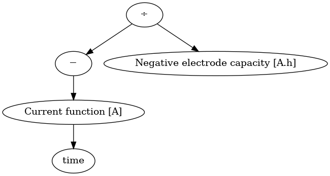

# A simple ODE battery model

In this section, we will learn how to develop a simple battery model using PyBaMM. We'll be using the reservoir model, which is a simple ODE model that represents the battery as two reservoirs of charge, one for the positive electrode and one for the negative electrode. The model is described by the following equations:

$$
\begin{align*}
\frac{dx_n}{dt} &= -\frac{I(t)}{Q_n}, \\
\frac{dx_p}{dt} &= \frac{I(t)}{Q_p}, \\
V(t) &= U_p(x_p) - U_n(x_n) - I(t)R, \\
x_n(0) &= x_{n0}, \\
x_p(0) &= x_{p0}, \\
\end{align*}
$$

where $x_n$ and $x_p$ are the dimensionless stochiometries of the negative and positive electrodes, $I(t)$ is the current, $Q_n$ and $Q_p$ are the capacities of the negative and positive electrodes, $U_p(x_p)$ and $U_n(x_n)$ are the open circuit potentials of the positive and negative electrodes, and $R$ is the resistance of the battery.

## PyBaMM parameters

The reservoir model has a number of parameters that need to be defined. In PyBaMM a parameter can be defined using the [`pybamm.Parameter`](https://docs.pybamm.org/en/stable/source/api/expression_tree/parameter.html#parameter) class. For example, if you wanted to define a parameter with name "a", you would write
    
```python
a = pybamm.Parameter("a")
```

The name of the parameter is used to identify it in the model, the name of the Python variable you assign it to is arbitrary.

You can also define a parameter that is defined as a function using the [`pybamm.FunctionParameter`](ihttps://docs.pybamm.org/en/stable/source/api/expression_tree/parameter.html#pybamm.FunctionParameter) class, which is useful for time varying parameters such as the current, or functions like the OCV function parameters $U_p(x_p)$ and $U_n(x_n)$, which are both functions of the stochiometries $x_p$ and $x_n$. For example, to define a parameter that is a function of time, you would write

```python
I = pybamm.FunctionParameter("I", {"Time [s]": pybamm.t})
```

where `pybamm.t` is a special variable that represents time.

::::challenge{id="ode-parameters" title="Define the parameters for the reservoir model"}

Define the parameters for the reservoir model, including the current $I(t)$, the OCV functions $U_p(x_p)$ and $U_n(x_n)$, the capacities $Q_n$ and $Q_p$, and the resistance $R$.

:::solution
```python
i = pybamm.FunctionParameter("Current function [A]", {"Time [s]": pybamm.t})
x_n_0 = pybamm.Parameter("Initial negative electrode stochiometry")
x_p_0 = pybamm.Parameter("Initial positive electrode stochiometry")
U_p = pybamm.FunctionParameter("Positive electrode OCV", {"x_p": x_p})
U_n = pybamm.FunctionParameter("Negative electrode OCV", {"x_n": x_n})
Q_n = pybamm.Parameter("Negative electrode capacity [A.h]")
Q_p = pybamm.Parameter("Positive electrode capacity [A.h]")
R = pybamm.Parameter("Electrode resistance [Ohm]")
```
:::
::::

## PyBaMM variables

The reservoir model has a number of output variables, which are either the state
variables $x_n$ and $x_p$ that are explicitly solved for, or derived variables
such as the voltage $V(t)$. 

In PyBaMM a state variable can be defined using the
[`pybamm.Variable`](https://docs.pybamm.org/en/stable/source/api/expression_tree/variable.html#variable)
class. For example, if you wanted to define a state variable with name "x", you
would write

```python
x = pybamm.Variable("x")
```

::::challenge{id="ode-variables" title="Define the state variables for the reservoir model"}

Define the state variables for the reservoir model, including the stochiometries
$x_n$ and $x_p$.

:::solution
```python
x_n = pybamm.Variable("Negative electrode stochiometry")
x_p = pybamm.Variable("Positive electrode stochiometry")
```
:::
::::

We will leave the derived variables like $V(t)$ for now, and come back to them
later once we have defined the expressions for the ODEs.


## A PyBaMM Model

Now that we have defined the parameters and variables for the reservoir model,
we can define the model itself. In PyBaMM a model can be defined using the
[`pybamm.BaseModel`](https://docs.pybamm.org/en/stable/source/api/models/base_models/base_model.html)
class. For example, if you wanted to define a model with name "my model", you
would write

```python
model = pybamm.BaseModel("my model")
```

This class has four useful attributes for defining a model, which are:
1. `rhs` - a python dictionary of the right-hand-side equations
2. `algebraic` - a python dictionary of the algebraic equations (we won't need this for our ODE model)
3. `initial_conditions` - a python dictionary of the initial conditions
4. `variables` - a python dictionary of the output variables

As an example, lets define a simple model for exponential decay with a single state variable $x$ and a single parameter $a$:

```python
x = pybamm.Variable("x")
a = pybamm.Parameter("a")

model = pybamm.BaseModel("exponential decay")
model.rhs = {x: -a * x}
model.initial_conditions = {x: 1}
model.variables = {"x": x}
```

::::challenge{id="ode-model" title="Define the reservoir model"}

Now we have all the pieces we need to define the reservoir model. Define the
model using the parameters and variables you defined earlier.

:::solution
```python
model = pybamm.BaseModel("reservoir model")
model.rhs[x_n] = -i / Q_n
model.initial_conditions[x_n] = x_n_0
model.rhs[x_p] = i / Q_p
model.initial_conditions[x_p] = x_p_0

model.variables["Voltage [V]"] = U_p - U_n -  i * R
model.variables["Negative electrode stochiometry"] = x_n
model.variables["Positive electrode stochiometry"] = x_p
```

Note that we have defined the dictionaries in a slightly different way to the
example above, this is just to show that there are multiple ways to define these
dictionaries using Python.
:::
::::


## PyBaMM expressions

It is worth pausing here and discussing the concept of an "expression" in
PyBaMM. Notice that in the model definition we have used expressions like `-i /
Q_n` and `U_p - U_n -  i * R`. These expressions do not evaluate to a single
value like similar expressions involving Python variables would. Instead, they
are symbolic expressions that represent the mathematical equation.

The fundamental building blocks of a PyBaMM model are the expressions, either
those for the RHS rate equations, the algebraic equations of the expression for
the output variables such as $V(t)$. PyBaMM encodes each of these expressions
using an "expression tree", which is a tree of operations (e.g. addition,
multiplication, etc.), variables (e.g. $x_n$, $x_p$, $I(t)$, etc.), and
functions (e.g. $\exp$, $\sin$, etc.), which can be evaluated at any point in
time.

As an example, lets consider the expression for $\frac{dx_n}{dt}$, given by `-i
/ Q_n`. We can visualise the expression tree for this expression using the
`visualise` method:

```python
model.rhs[x_n].visualise("x_n_rhs.png")
```

This will create a file called `x_n_rhs.png` in the current directory, which you
can open to see the expression tree, which will look like this:



You can also print the expression as a string using the `print` method:

```python
print(model.rhs[x_n])
```

```
-Current function [A] / Negative electrode capacity [A.h]
```

So you can see that the expression tree is a symbolic representation of the
mathematical equation, which can then be later on used by the PyBaMM solvers to
solve the model equations over time.


## PyBaMM events

An event is a condition that can be used to stop the solver, for example when
the voltage reaches a certain value. In PyBaMM an event can be defined using the
[`pybamm.Event`](https://docs.pybamm.org/en/stable/source/api/events/event.html)
class. For example, if you wanted to define an event that stops the solver when
the time reaches 3, you would write

```python
stop_at_t_equal_3 = pybamm.Event("Stop at t = 3", pybamm.t - 3)
```

The expression `pybamm.t - 3` is the condition that the event is looking for,
and the solver will stop when this expression reaches zero. Note that the
expression must evaluate to a non-negative number for the duration of the
simulation, and then become zero when the event is triggered.

You can add a list of events to the model using the `events` attribute, the
simulation will stop when any of the events are triggered.

```python
model.events = [stop_at_t_equal_3]
```

::::challenge{id="ode-events" title="Define the stochiometry cut-off events"}

Define four events that ensure that the stochiometries $x_n$ and $x_p$ are
between 0 and 1. The simulation should stop when either reach 0 or 1.

:::solution
```python
model.events = [
    pybamm.Event("Minimum negative stochiometry", x_n - 0),
    pybamm.Event("Maximum negative stochiometry", 1 - x_n),
    pybamm.Event("Minimum positive stochiometry", x_p - 0),
    pybamm.Event("Maximum positive stochiometry", 1 - x_p),
]
```
:::
::::

## PyBaMM parameter values

The final thing we need to do before we can solve the model is to define the
values for all the parameters. You should already be familar with the PyBaMM
[`pybamm.ParameterValues`](https://docs.pybamm.org/en/stable/source/api/parameters/parameter_values.html)
class, which is used to define the values of the parameters in the model. For
example, if you wanted to define a parameter value for the parameter "a" that we
defined earlier, you would write

```python
parameter_values = pybamm.ParameterValues({"a": 1})
```

For function paramters, we can define the function using a standard Python
function or lambda function that takes the same number of arguments as the
function parameter. For example, if you wanted to define a function parameter
for the current that is a function of time, you would write

```python
def current(t):
    return 2 * t
parameter_values = pybamm.ParameterValues({"Current function [A]": current})
```

or using a lambda function

```python
parameter_values = pybamm.ParameterValues({"Current function [A]": lambda t: 2 * t})
```

::::challenge{id="ode-parameter-values" title="Define the parameter values for the reservoir model"}

Define the parameter values for the reservoir model. You can choose any values
you like for the parameters, but in the solution below we will define the
following values:

- The current is a function of time, $I(t) = 1 + 0.5 \sin(100t)$
- The initial negative electrode stochiometry is 0.9
- The initial positive electrode stochiometry is 0.1
- The negative electrode capacity is 1 A.h
- The positive electrode capacity is 1 A.h
- The electrode resistance is 0.1 Ohm
- The OCV functions are the graphite LGM50 OCP from the Chen2020 model, which is given by the function:

```python
def graphite_LGM50_ocp_Chen2020(sto):
  u_eq = (
      1.9793 * np.exp(-39.3631 * sto)
      + 0.2482
      - 0.0909 * np.tanh(29.8538 * (sto - 0.1234))
      - 0.04478 * np.tanh(14.9159 * (sto - 0.2769))
      - 0.0205 * np.tanh(30.4444 * (sto - 0.6103))
  )

  return u_eq
```


:::solution
```python
param = pybamm.ParameterValues({
    "Current function [A]": lambda t: 1 + 0.5 * pybamm.sin(100*t),
    "Initial negative electrode stochiometry": 0.9,
    "Initial positive electrode stochiometry": 0.1,
    "Negative electrode capacity [A.h]": 1,
    "Positive electrode capacity [A.h]": 1,
    "Electrode resistance [Ohm]": 0.1,
    "Positive electrode OCV": graphite_LGM50_ocp_Chen2020,
    "Negative electrode OCV": graphite_LGM50_ocp_Chen2020,
})
```
:::
::::

## Solving the model


Now that we have defined the reservoir model, we can solve it using the PyBaMM simulation class and plot the results like so:

```python
sim = pybamm.Simulation(model, parameter_values=param)
sol = sim.solve([0, 1])
sol.plot(["Voltage [V]", "Negative electrode stochiometry", "Positive electrode stochiometry"])
```

::::challenge{id="ode-solve" title="Solve the reservoir model"}

Solve the reservoir model using the parameter values you defined earlier, and
plot the results. Vary the paramters and see how the solution changes to assure
yourself that the model is working as expected.

::::

