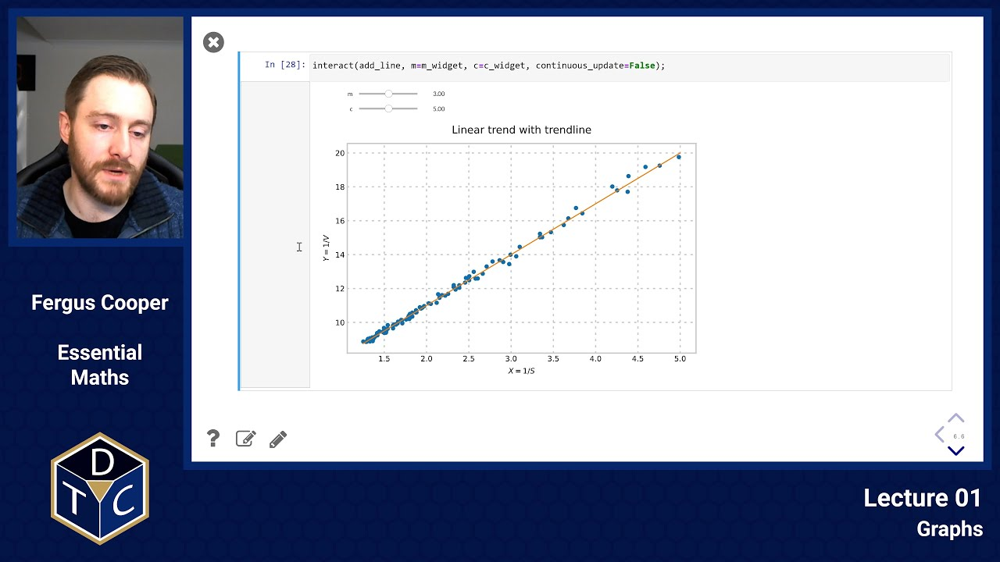
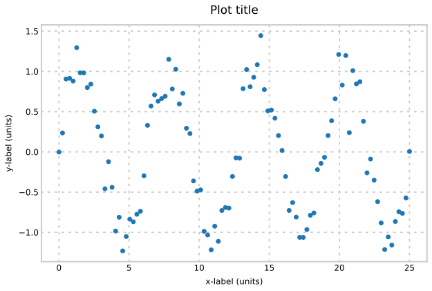
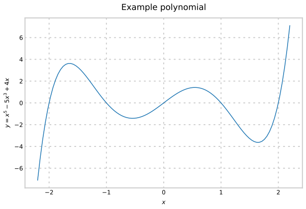
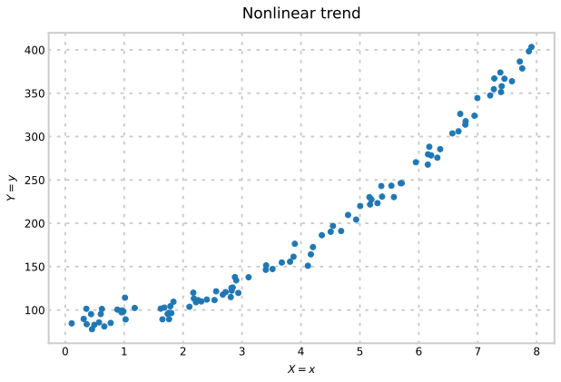
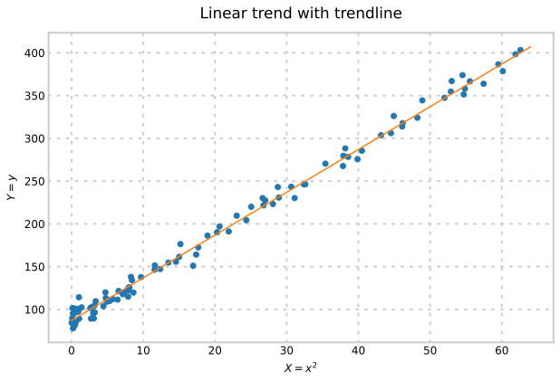
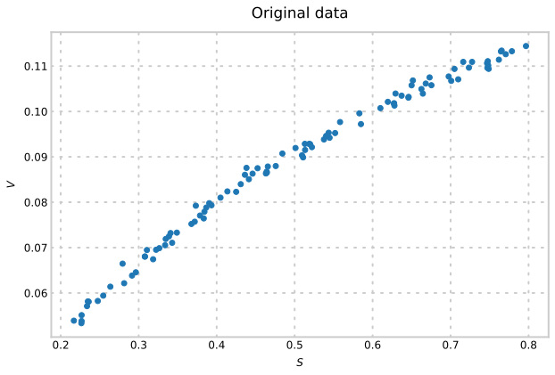
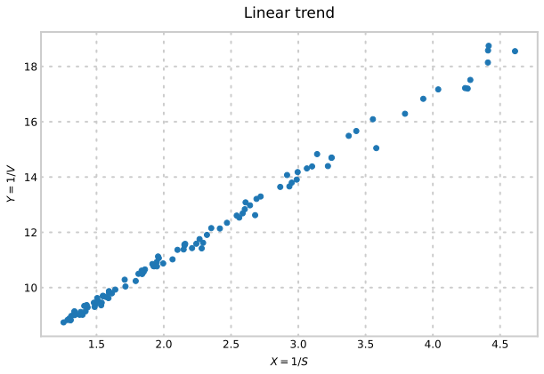
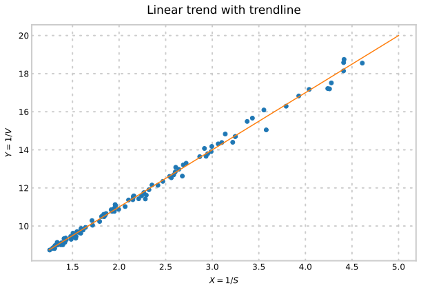

--- 

## YouTube lecture recording from October 2020

The following YouTube video was recorded for the 2020 iteration of the course.
The material is still very similar:

[](https://youtu.be/HIRpQ1caeKk)

---

## Basics

Terminology:

- $Y$ or $y$ is the *dependent* variable, sometimes called the *ordinate*
  marked on the vertical axis
- $X$ or $x$ is the *independent* variable, sometimes called the *abscissa*
  marked on the horizontal axis
- The dependent variable is said to be graphed *against* the independent
  variable

Essential Features:

- Title
- Axis labels (and units if appropriate)



## Equation of a straight line

Defined by a gradient, $m$, and a $y$-axis intercept, $c$:

$$y = m x + c$$

Interpretation:

- The intercept of this line on the $y$ axis is given by $y=c$, since at $x=0$,
  $y = c$


- The gradient of this line (also called its "slope") is given by
  $$m = {y_2-y_1\over x_2 - x_1}$$
  ("change in $y$ divided by change in $x$")


- The intercept of this line on the $x$ axis is given by $x = -{c \over m}$,
  since at $y=0$ we must have $mx=-c$

## Graphs of Polynomials

An expression involving higher powers of $x$ is called a *polynomial* in $x$.

### Example

$y=x^5-5x^3+4x$



### In general

$$y = a_n x^n + a_{n-1} x^{n-1} + a_{n-2} x^{n-2}+\ldots+a_1 x^1 + a_0x^0$$

The graph of a polynomial of degree $n$ has at most $n-1$ bends in it.

## Transforming from non-linear to linear

If we wish to test visually whether some data fit a particular relationship, we can transform the data to plot something which should be linear if the relationship holds.

### e.g. Test for *parabolic* shape for data in $(x,y)$: i.e. $y = x^2$

- We can plot $Y$ against $X$ where we let $Y=y$ and $X=x^2$.

#### First plot the original data
There's a definite curve, and we may suspect the trend is quadratic



#### Now plot the data nonlinearly

If the parabolic relationship holds, plotting $Y=y$ against $X=x^2$ should result in a straight line.


#### Calculate the gradient and the intercept

We next add a trendline through these points which we can use to determine the gradient and intercept.



- We find $(X,Y)$ lie along a straight line with slope 5 and Y-intercept 87.


- This means that $Y=5X+87$


- So, $y$ and $x$ can be modelled by the polynomial equation $y=5x^2+87$.

## Example from biosciences

The rate at which a given enzyme can catalyse a reaction can be dependent upon the substrate concentration:
$${1\over V} = {m\over S} + c$$


where $V$ is the rate of the reaction, $S$ is the substrate concentration and
$m$ and $c$ are constants.


- We can derive a straight line graph from the above formula by plotting
  $Y=1/V$ against $X=1/S$


- It will have gradient $m$ and ordinate intercept $c$


First, plot the original data which is observations of $V$ given varying $S$:



#### Now plot the data nonlinearly

If the hypothesised relationship holds, plotting $Y=1/V$ against $X=1/S$ should result in a straight line.



#### Calculate the gradient and the intercept

We next add a trendline through these points which we can use to determine the gradient and intercept.



- We find $(X,Y)$ lie along a straight line with slope 3 and Y-intercept 5.

- This means that $Y=3X+5$

- So, $V$ and $S$ can be modelled by the equation $1/V=3/S+5$.


### Introductory problems

::::challenge{id="01_intro_01" title="Introductory problems 1"}
Sketch the following graphs.
First, use pen & paper, then use Python to check your answers.
The notation after each equation indicates the range of values that $x$ can take.

1. $\displaystyle y = 3x+5 \qquad\qquad x\in[0,10]$
1. $\displaystyle y = \frac{x^2}{2} - 4 \qquad\qquad x\in[-4,4]$
1. $\displaystyle y = \sqrt{x} \qquad\qquad x\in[0,25]$
1. $\displaystyle y = \sin(t) \qquad\qquad t\in[0,2\pi]$
1. $\displaystyle y = \sin(2t) \qquad\qquad t\in[0,2\pi]$
1. $\displaystyle y = \frac{1}{x} \qquad\qquad x\in[0.1,5]$
1. $\displaystyle y = \frac{-1}{x^2} \qquad\qquad x\in[0.1,5]$

```python
# hint
import numpy as np
from matplotlib import pyplot as plt

x = np.linspace(0, 10, 100)
y = 3 * x + 5

plt.plot(x, y)
```
::::

::::challenge{id="01_intro_02" title="Introductory problems 2"}
For which values of $x$ are the following functions positive? Negative? Zero?

1. $\displaystyle x^2 - 9$
1. $\displaystyle\sin(x)$
1. $\displaystyle\sin(3x)$
1. $\displaystyle\frac{2}{x} - \frac{1}{x^2}$
::::


### Main problems

Text relevant to these problems: Croft and Davison, 5$^{\rm th}$ Edition, Chapters 17 & 18.

::::challenge{id="01_main_01" title="Main problems 1"}
The Lennard-Jones potential energy between two non-polar atoms may be given by the equation:
$$V(R)={A\over R^{12}} - {B \over R^6} $$
where $A$ and $B$ are positive constants, $V(R)$ is the potential energy, measured in Joules, and $R$ is the internuclear distance measured in \AA.

1. For which values of $R$ is $V(R)$ positive? Negative? Zero?
1. Plot a graph showing the potential energy between the two atoms as a function of $R$ given that $A=0.06$ and $B = 0.03$.
1. What is the potential energy between the two atoms at infinite separation?
1. What would happen to the two atoms if they were brought very close together?
1. What is the physical interpretation of the sign of $V(R)$, and of its slope?
1. What are the dimensions ([Length], [Mass], [Time]) and units of the constants $A$ and $B$?
1. Use Python to plot the graph of $V$ versus $R$ for $A=0.06$ and $B = 0.03$. Remember to add relevant axis labels. Plot on the same graph the line of $V = 0$, so you can verify your answers in 1. and b).
::::

::::challenge{id="01_main_02" title="Main problems 2"}
How should these equations be rearranged to allow the plotting of a suitable **linear** graph, assuming that the constant parameters $a$ and $b$ are unknown, and we wish to use the graph to find them?
Write down expressions for the gradient, $X$-intercept and $Y$-intercept of each rearranged equation:

1. $\displaystyle y = \frac{a}{x}$
1. $\displaystyle y = b - a \sqrt{x}$
1. $\displaystyle y = \frac{b}{1+ax}$
::::

::::challenge{id="01_main_03" title="Main problems 3"}
The *osmotic pressure* of a solution of a protein is related to the concentration of that protein by the equation:
$$Z = R\;T\;b$$
where $Z$ is the osmotic pressure in kPa, $T$ is the temperature in Kelvin, $R$ is the gas constant ($R=8.314\;{\rm kPa}\cdot{\rm dm}^3\cdot{\rm mol}^{-1}\cdot{\rm K}^{-1}$) and $b$ is the molarity of the protein (mol. solute per dm$^3$ solution).
Plot a suitable graph to determine, as accurately as possible, the molecular mass (take care with units!) of the protein given the following data taken at room temperature (usually taken as 21$^{\circ}$C):

|                                        |       |       |       |       |       |
| ---------------------------------------|:-----:|:-----:|:-----:|:-----:|:-----:|
| Protein Concentration (in g dm$^{-3})$ |   7.3 |  18.4 |  27.6 |  42.1 |  57.4 |
| Osmotic Pressure (in kPa)              | 0.211 | 0.533 | 0.804 | 1.236 | 1.701 |

Hint: compare the function with the equation of a straight line, $y=mx+c$, and think about the relationship between concentration, molar concentration and molecular weight).

Use Python to plot the graph and confirm your pen & paper solution.
::::


### Extension problems

::::challenge{id="01_ext_01" title="Extension problems 1"}
The rate at which a given enzyme catalyses a reaction is dependent upon the substrate concentration:
$$V = \frac{S}{m+cS}$$
where $V$ is the rate of the reaction, $S$ is the substrate concentration and $m$ and $c$ are *unknown* constants.
How can we transform $V$ and $S$ to derive a straight line graph relating them?
What will be the gradient and the ordinate intercepts?
::::
