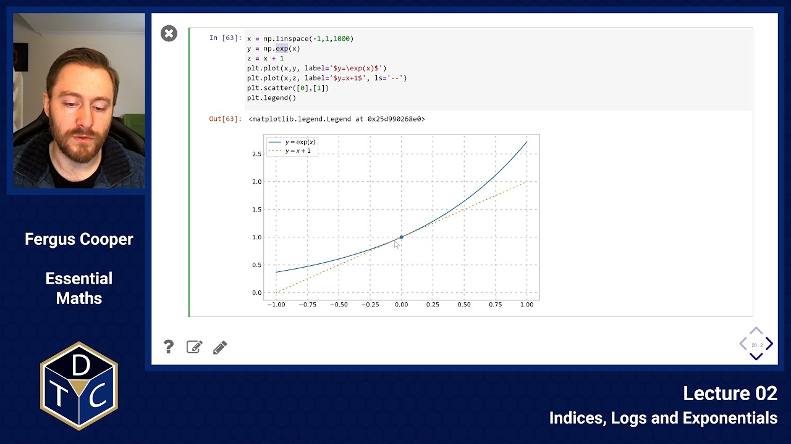
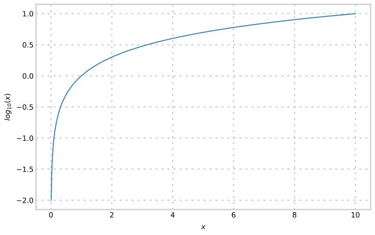
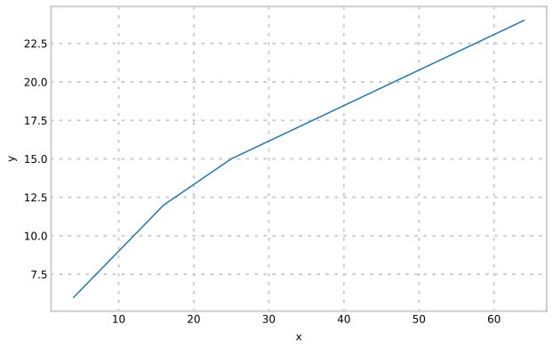
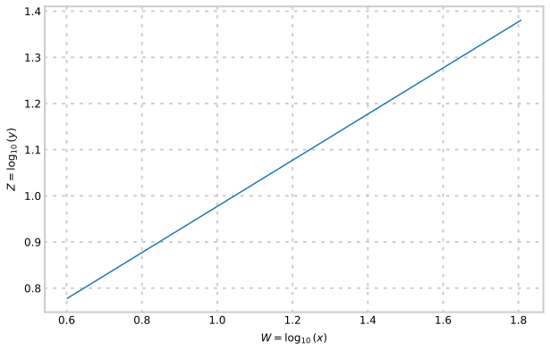

--- 

## YouTube lecture recording from October 2020

The following YouTube video was recorded for the 2020 iteration of the course.
The material is still very similar:

[](https://youtu.be/gbZtu0mAq2I)

---

## Indices

In mathematics, an index refers to the power to which a number (the base) is raised.
The index is usually written as a small number above and to the right of the base.
For example, in the expression $2^3$, $2$ is the base, and $3$ is the index or power.
This expression is read as "2 to the power of 3" or simply "2 cubed", and it equals $2 \times 2 \times 2 = 8$.

### (1) Multiplication of expressions with powers

Let's recap by example:

> $$5^2 = 5 \times 5 = 25$$,

and

> $$5^3 = 5 \times 5 \times 5 = 125$$.

Now,

> $$5^5 = 5 \times 5 \times 5 \times 5 \times 5 = 3125$$

and

> $$25 \times 125 = 3125$$.

So,

> $$5^5 = 5^2 \times 5^3$$.

And, by extension:

> $$a^m\times~a^n=a^{m+n}$$.

When we multiply two expressions with powers, we **add** the powers.

### (2) Division of expressions with powers

Again, let's look at an example:

> $$ \frac{5^3}{5^2} = \frac{5 \times 5 \times 5}{5 \times 5}$$

We can cancel both fives on the bottom with two from the top, leaving just $5$, or, $5^1$ left.

Generalising, by extension:

> $${a^n\over a^m}=a^{n-m}$$

When we divide two expressions with powers, we **subtract** the powers.

### (3) Powers of expressions with powers

Back to our example:

> $$\left(5^3\right)^4 = 5^3 \times 5^3 \times 5^3 \times 5^3 = 244140625$$

Using the addition rule from above, the resulting power should be $3 + 3 + 3 + 3 = 12$.
And, sure enough:

> $$5^{12} = 244140625$$.

So, generalising again:

> $$(a^n)^m=a^{nm}$$

When we raise an expression containing a power to another power, we **multiply** the powers.

### (4) Negative powers

What happens when we divide indices, but there are more numbers on the bottom of the fraction?

> $$\frac{a^3}{a^5} = \frac{a \times a \times a}{a \times a \times a \times a \times a} = \frac{1}{a \times a} = \frac{1}{a^2}$$

Using the division rule above, the power should be $3 - 5 = -2$.
And, so:

> $$a^{-2}={1\over a^2}$$

and, in general,

> $$a^{-n} ={1\over a^n}$$

where $n$ is a positive integer.

### (5) Zero index

Similarly,
> $$\frac{a^3}{a^3} = \frac{a \times a \times a}{a \times a \times a} = 1$$,

and by using the division rule, the power should be $3-3=0$.

Thus, anything to the power of zero equals one, except $0^0$
which is undefined:

> $$a^0=1 $$

### (6) Fractional (rational) indices

> $$a^1 = a^{1/2} \times a^{1/2} {\rm ~~~~so~~~~}a^{1/2} = \sqrt{a} $$

> $$a^{1\over n} = \sqrt[n]{a} $$

> $$a^{n\over m} = \left(\sqrt[m]{a}\right)^n ~~~~~{\rm or}~~~\sqrt[m]{a^n}$$

> $$a^{-{n\over m}} = {1\over {\left(\sqrt[m]{a}\right)^n}}~~~{\rm or}~~~~{1\over {\sqrt[m]{a^n}}}$$

### (7) Different bases, same index

> $$(a\cdot b)^x = a^x\cdot b^x\qquad {\rm and}\qquad\Bigl( {a\over b}\Bigr)^x={{\,a^x}\over{\,b^x}}$$

### (8) Two Cautionary remarks:

1.  Powers of sums are **not** pretty:  $(a+b)^x \ne a^x + b^x$
2.  Powers of differences are **not** pretty: $(a-b)^x \ne a^x - b^x$

A useful formula for products of sums:
$(p+q)\cdot(s+t) = ps + pt+qs + qt$

Three important consequences:

1. $(a+b)^2=(a+b)(a+b)=a^2+2ba+b^2$
1. $(a-b)^2=(a-b)(a-b)=a^2-2ba+b^2$
1. $(a+b)(a-b)=a^2-b^2$

## Logarithms

1. If $y=a^x$, $\;x\;$ is the **power** to which the **base** $\;a\;$ must be raised to give
   $y$, OR
2. $\;x\;$ is the **logarithm** which, with **base** $\;a,\;$ gives $\;y\;$.

In general we write $\quad x = \log_a y \quad \Leftrightarrow \quad y=a^x$.

The base of a logarithm may be any number. Commonly, logarithms either have **base** 10 or **base** $e$.
It is almost always a good idea to explicitly state the base, e.g. $\;\log_3 9=2\;$ implies $\;3^2=9\;$.

## Getting a feel for logarithms.

Here's a graph of $y=\log_{10}x$:



Some physical phenomena use log metrics due to their huge dynamic range:

- volume of sound (decibels)
- pitch (1 octave is doubling of frequency, 2 octaves is quadrupling of
  frequency)
- earthquakes (Richter scale)
- pH ($[H^+]$ ion concentration)
- Used a lot in computer programming to improve the speed and/or accuracy of calculations.

## The laws of logarithms

### (1) Using the same base $a$ for both operations:

- *Taking the logarithm* undoes *raising to a power*:

> $$\log_a\,a^r=r$$

- *Raising to a power* undoes *taking the logarithm*:

> $$a^{\log_a\,b}=b$$

## The laws of logarithms

### (2) Multiplication.

> $$\log_a (bc) = \log_a b + \log_a c ~~~~~(Add) $$

### (3) Division. In a similar way to multiplication,

> $$\log_a \left({b \over c}\right) = \log_a b - \log_a c ~~~~~(Subtract)$$

### (4) Powers.

> $$\log_a b^n = n \log_a b  ~~~~~~ (Multiply)$$

### (5) Changing the base of  a logarithm:

> $$\log_a c = {\log_b c\over \log_b a}$$

### (6) Special case: if $b$ and $c$ are the same, (5) reduces to


> $$ \log_a b ={\log_b b\over \log_b a}={1\over \log_b a}$$

### (7) The log of any number to the base itself is 1:

> $$\log_a a =1 $$

### (8) The log of 1 is 0 (unless a=0, in which case it is undefined):

> $$\log_a 1 = 0 \quad{\rm since~~~}\quad a^0=1$$


### (9) Inverse operation:

> $$\log_a a^x = x$$

### (10) Or,

> $$a^{\log_a x}=x$$

### (11) Negative logs.
> $$\log_a {1\over x} = \log_a1-\log_ax= 0 - \log_a x =-\log_ax$$

### (12)  Two cautionary remarks:
1. $\;\log_a (x + y)\;$ and $\;\log_a (x-y)\;$ cannot be simplified any further, and should be left as they are.

2. Neither can $\;\log_a\,x \cdot \log_a\,y\;$ or $\;\displaystyle{{\log_a\,x}\over {\log_a\,y}}.\;$ Leave them as they are.

## Example 1: graphs

Can the data below be fitted to the form: $y=Ax^n$?

| x   | y   |
|-----|-----|
| 4.0 | 6.0 |
| 16.0| 12.0|
| 25.0| 15.0|
| 64.0| 24.0|



Take logs of both sides: This is the equation of a straight line (cf. $y=mx+c$)

> $$\log y =\log Ax^n = \log A + \log x^n= \log A + n \log x$$



Gradient = 0.5 = $n$

Intercept = $0.48 = \log_{10}A$ so $A=3.0$

Data fit curve of the form:

> $$y=3.0\times  x^{1/2}$$ 

## Example 2: pH

1. What is the pH of a 0.011M solution of HCl?

> $$pH = -\log_{10}[H^+]$$

```python
pH = -np.log10(0.011)
print('pH =',pH)
```

```
pH = 1.958607314841775
```

2. What is the H$^+$ concentration of a solution of HCl with a pH of 3?

$$pH = -\log [H^+] = 3~~~~{\rm~so~~~}$$

```
[H+] = 0.001 M
```

## Example 3: Simplifying logs

Write an expression for $x$ without using logarithms:

> $$\log(x) = \log(p) + 2 \log(q) - \log(k) -3$$

> $$\log(x) =~~~~~~~~~~~~~~~~~~~~~~~~~~~~~~~~~~~~~~~~~~~~~~~~$$

> $$x=~~~~~~~~~~~~~~~~~~~~~~~~~~~~~~~~~~~~~~~~$$

1. Use the laws of logarithms (above) to put all terms on the right hand side
   **within** the logarithm. This means we have to rewrite $\;3\;$ as $\;3\log(10)\;$.
1. Raise both sides to the (same) power which will **undo** the logarithm function. (i.e. raise both sides to the power of 10)

## The exponential function and the real number e

### Definition of the Real Number $e$:

The real number $e$, also known as Euler's number, is that base for which the graph $y=e^x$
passes through the point $\;(0, 1)\;$ with gradient exactly equal to $\;1$.


So for the function (called the **exponential function**):

> $$y=e^x ~~~{\rm the~gradient~at~(0,1)~is~~}1 = e^0.$$

This turns out to be true at **any** point on the curve.
The function $y=e^x$ is the **only** function that is unchanged when differentiated (more tomorrow).

$e$ has been found to arise in many branches of mathematics. It is also used as a **base** for logarithms. e.g.:

> $$y=\log_e10=\ln 10 {\rm~~and~~~} y=\log_ex=\ln x$$

Logs to base $e$ are called **natural logarithms**.

## Definition of the natural logarithm:

The **natural logarithm** of a number is the logarithm of that number taken using the base $\;e\;$.
We usually write $\;\ln(x)\;$ for $\log_e(x)$.  Here are some examples:

- $\ln(e)=\log_e(e)=1$
- $\ln(10)=\log_e(10)$ = "The power I need to raise $e$ to in order to get 10"
- $\ln(10)\approx 2.303$. Which means that $e^{2.303}\approx 10$
- $\ln(\exp(b)) = \ln e^b  =\log_e e^b = b$
- $\exp(\ln(b))=e^{\ln(b)}=e^{\log_e b}=b$

Note that examples (d) and (e) confirm the property that
the functions  "$\exp$"  and "$\ln$"  are *functional
inverses* of one another.


### Introductory problems

::::challenge{id="02_intro_01" title="Introductory problems 1"}
Simplify:

1. $\displaystyle \frac{a^{10}}{a^{-3}}$
1. $\displaystyle \frac{\left(\sqrt {x}\right)^8}{x^4}$
1. $\displaystyle \frac{y^{1\over 4}}{y^{-{2 \over 4}}}$
1. $\displaystyle \frac{10^{-2/3} \times 10^7 \times 10^{-16} \times x^{1/2} \times y^4 \times z^{-1/3}}{10^{-19}\times 10^{43} \times 10^{2/3} \times z^{-1/3} \times y^{1/4} \times x^{5/2}}$
::::

::::challenge{id="02_intro_02" title="Introductory problems 2"}
Evaluate the following expressions without using a calculator:

1. $\displaystyle 2^{-4}$
1. $\displaystyle 36^{1\over 2}+64^{2\over 3}$
1. $\displaystyle \left( {1 \over 3}\right)^{-2}$
1. $\displaystyle \left({81 \over 9}\right)^{3 \over 2}$
::::

::::challenge{id="02_intro_03" title="Introductory problems 3"}
Express the following in logarithmic form:

1. $\displaystyle 5^3 = 125$
1. $\displaystyle 8^{-{1\over 3}} = {1 \over 2}$
1. $\displaystyle x^y = 4$
::::

::::challenge{id="02_intro_04" title="Introductory problems 4"}
Evaluate the following expressions without using a calculator:

1. $\displaystyle \log_4\,(64)$
1. $\displaystyle \log_{\pi}\,(1)$
1. $\displaystyle \log_{b}\, (b^a)$
1. $\displaystyle 6^{\log_6\,({\pi})}$
::::

::::challenge{id="02_intro_05" title="Introductory problems 5"}
Solve the following equations for $x$:

1. $\displaystyle e^x=4$
1. $\displaystyle e^{-x}=2$

One of your solutions should be exactly $-2$ times the value of your other solution. Why?
::::

::::challenge{id="02_intro_06" title="Introductory problems 6"}
Simplify:

1. $\displaystyle \ln \left(e^3\right)$
1. $\displaystyle \ln \left(1\over{2e}\right)$
1. $\displaystyle e^{\ln x^4}$
1. $\displaystyle e^{3+\ln x}$
::::

### Main problems

::::challenge{id="02_main_01" title="Main problems 1"}
In an experiment, the mass, $m$ grams, of a reaction product is measured at various times, $t$ minutes. It is believed that $m$ and $t$ are related by a law of the form:
$$m=At^n$$
The results are shown in the table below:

| time (min) |  1  |   2  |   3  |  4  |   5  |  6  |   7  |   8  |  12 |
|-----------:|:---:|:----:|:----:|:---:|:----:|:---:|:----:|:----:|:---:|
|   mass (g) | 0.5 | 0.63 | 0.72 | 0.8 | 0.85 | 0.9 | 0.95 | 0.99 | 1.0 |

1. Confirm this postulate graphically. There is one result that does not conform to this law. Which?
1. Find appropriate values of $A$ and $n$, and in this context, explain the meaning of $n$. What are the units of $A$?
1. Explain, with reasons, whether you would use these results to predict the mass when $t=15$.
::::

::::challenge{id="02_main_02" title="Main problems 2"}
These problems deal with pH:

1. What is the pH of 130ml of a solution containing 4.7mg HCl, assuming that HCl is completely ionised in solution, and its molecular mass is 36.46?
1. What would be the pH if the concentration of HCl were tripled?
::::

::::challenge{id="02_main_03" title="Main problems 3"}
Express in terms of $\log (a)$, $\log (b)$, $\log (c)$ and $\log (d)$:

1. $\displaystyle \log\left({{b}\over ac}\right)$
1. $\displaystyle \log (a^2 b c^3 d^4)$
1. $\displaystyle \log \left(\sqrt {cd \over ab} \right)$
::::

::::challenge{id="02_main_04" title="Main problems 4"}
Simplify:

1. $\displaystyle \log(8) + \log(3) - \log(6)$
1. $\displaystyle \log\left(x^2-1\right) - \log\left(x^2+1\right)$
1. $\displaystyle 3\log_a(4) + \log_a(5) - 2\log_a(9)$
1. $\displaystyle \log\left(x^9\right) - \log\left(x^6\right)$
::::

::::challenge{id="02_main_05" title="Main problems 5"}
This problem gives you a chance to use the identity $\displaystyle\quad\log_a (b) ={\frac{1}{\log_b (a)}}$.

Consider the equation $\displaystyle\,\log_3(x) + 4\log_x(3) = 5$:

1. Verify that $x=3$ satisfies this equation
1. There is one other value of $x$ that also satisfies this equation. Find it.
::::

::::challenge{id="02_main_06" title="Main problems 6"}
Solve the following equations for $x$:

1. $\displaystyle 2\left(2^{2x}\right)- 5\left(2^x\right) + 2 = 0$
1. $\displaystyle 3^{2x+1} - 28\left(3^x\right) + 9 = 0$
1. $\displaystyle 16 = \log_2 (x)$
1. $\displaystyle \left(2 \sqrt 3 \log(x)\right)^2 - 7 \log(x^2) + 2 = 0$
::::

::::challenge{id="02_main_07" title="Main problems 7"}
Write an expression for $x$ or $y$ without using logarithms:

1. $\displaystyle \log(x) = \log(3r) - 5 \log(s) + 3\log(t) - 3$
1. $\displaystyle \log(2y) = 5 + 5\log\left(4^3\right) -15\log\left({\frac{2}{x}}\right) - 6\log(y)$
::::

::::challenge{id="02_main_08" title="Main problems 8"}
Write $x$ in terms of $y$ for each of the following:

1. $\displaystyle y=2e^{4x}$
1. $\displaystyle \ln y = 3 + 2\ln x$
::::

::::challenge{id="02_main_09" title="Main problems 9"}
Express as a sum or difference of logarithms:

1. $\displaystyle \ln\sqrt{\left({x-1\over x+1}\right)}$
::::

::::challenge{id="02_main_10" title="Main problems 10"}
Express as a single logarithm:

1. $\displaystyle 1 - \ln 4x$
1. $\displaystyle 3\ln x - {1\over 2} \ln\left(5-x^2\right)$
::::

