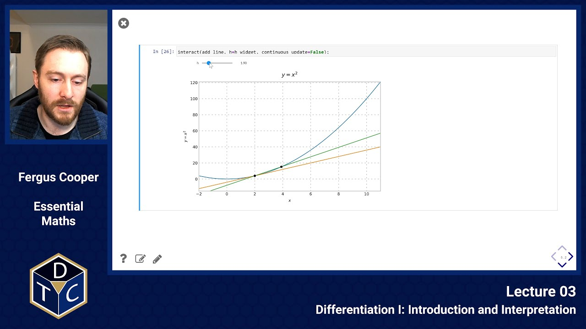
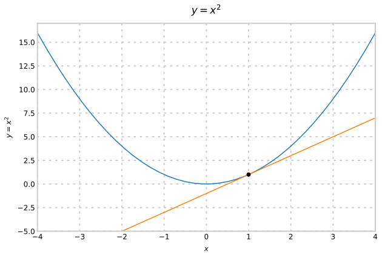
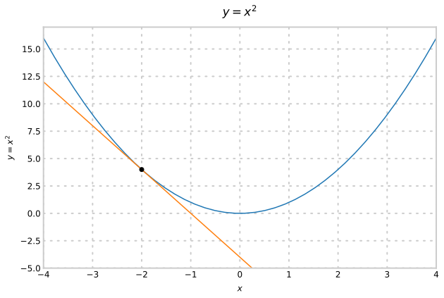
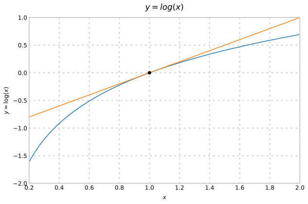
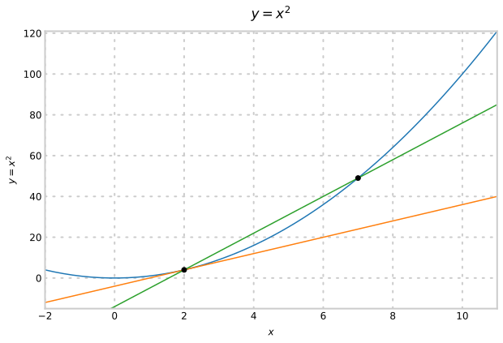
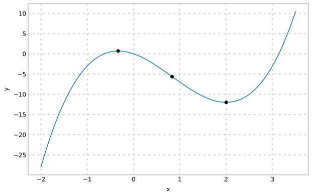
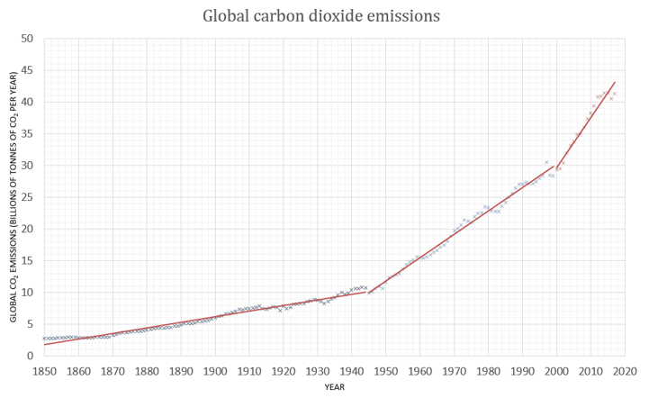

--- 

## YouTube lecture recording from October 2020

The following YouTube video was recorded for the 2020 iteration of the course.
The material is still very similar:

[](https://youtu.be/WRIo01tVEbA)

---

## Gradients

We often want to know about the *rate* at which one quantity changes over time.
Examples:
1. The rate of disappearance of substrate with time in an enzyme reaction.
1. The rate of decay of a radioactive substance (how long will it have activity above a certain level?)
1. The rate of bacterial cell growth over time.
1. How quickly an epidemic is growing.

### Defining the gradient

* The **gradient of a curve** at a point $P$ is the slope of the tangent of the curve at that point.
* The **tangent** is the line that "just touches" (but doesn't cross) the curve.
* The gradient is also known as the **rate of change** or **derivative**, and the process of finding the gradient is called **differentiation**.
* The gradient of the curve $\;y = f(x)\;$ is denoted in a few different ways, the three most common are:

$$ y', \quad f'(x), \quad \frac{dy}{dx}. $$

## Example, $y = x^2$

At $x=1$ the gradient is shallow and sloping up to the right:



At $x=-2$ the gradient is steeper, and sloping down to the right:



## Example, $y = \log(x)$

For this function, the gradient is always sloping up to the right, but gets shallower as $x$ increases:



### Algebraic example


If we want to find $y'(x)$ for $y = x^3 + 2$:


$$ \text{Gradient} = \frac{y_2 - y_1}{x_2-x_1} = \frac{\Delta y}{\Delta x}$$


Try with

$x_1 = 1.5,\;1.9,\;1.99,\;\ldots$

$x_2 = 2.5,\;2.1,\;2.01,\;\ldots$

We can use Python as a calculator to evaluate these differences:

```python
x_1 = 1.5; x_2 = 2.5
y_1 = x_1**3 + 2; y_2 = x_2**3 + 2
print((y_2-y_1)/(x_2-x_1))

x_1 = 1.9; x_2 = 2.1
y_1 = x_1**3 + 2; y_2 = x_2**3 + 2
print((y_2-y_1)/(x_2-x_1))

x_1 = 1.99; x_2 = 2.01
y_1 = x_1**3 + 2; y_2 = x_2**3 + 2
print((y_2-y_1)/(x_2-x_1))
```

```
12.25
12.010000000000003
12.00009999999997
```

As the difference between $x_1$ and $x_2$ gets smaller, the gradient stabilises.
The value it converges to is the gradient at the midway point of $x_1$ and $x_2$.

## Calculating gradients exactly

$\text{Gradient} \approx \frac{\Delta y}{\Delta x} = \frac{f(x+h) - f(x)}{h}$

This is called a finite difference approximation to the gradient. The approximation becomes more accurate the smaller h is.

When using the approximation, we denote the changes as $\frac{\Delta y}{\Delta x}$, in the limit as h goes to 0, this becomes $\frac{dy}{dx}$.

In this way, $\frac{d}{dx}$ is an operator, acting on $y$.

Note, the $d$s cannot be cancelled out, as they aren't variables, they denote an infinitely small change. 

Notice how, as the finite difference gets smaller and smaller, the approximation to the gradient (the green line) gets closer and closer to the true gradient (the orange line):




### Example

Find the gradient of $y = f(x) = x^3 + 2$.

> $\frac{dy}{dx} = \frac{f(x+h) - f(x)}{h}$

> $\frac{dy}{dx} = \frac{(x+h)^3 + 2 - (x^3 + 2)}{h}$

> $\frac{dy}{dx} = \frac{x^3 + 3x^2 h + 3xh^2 + h^3 + 2 - x^3 - 2}{h}$

> $\frac{dy}{dx} = \frac{3x^2h + 3xh^2 + h^3}{h}$

> $\frac{dy}{dx} = 3x^2 + 3xh + h^3$

Now this is only exactly right when $h \rightarrow 0$. So letting that happen, we have
$\frac{dy}{dx} = 3x^2$

## Derivative of polynomial functions
Using techniques like the one above (which is called differentiation from first principles), one can generalise the connection between powers of $x$ and their derivatives:

If $y = a x^n$, then its **derivative** is
$\frac{dy}{dx} = y'(x) = a n x^{n-1}$

### Examples to try
1. $y = x^4$
2. $y = 7x^5$
3. $y = x^{-2} = \frac{1}{x^2}$
4. $y = \sqrt{1/x} = (1/x)^{1/2} = x^{-1/2}$

## Summing and multiplying derivatives
### Summing

> $(f(x) \pm g(x))' = f'(x) \pm g'(x)$

e.g.

> $y = x^2 + x^3, \quad y' = 2x + 3x^2$

### Multiplying (by a scalar)
> $ (a f(x))' = a f'(x)$

e.g.

> $y = 6x^3, \quad y' = 6 \cdot 3x^2 = 18 x^2$

**This only works for scalars**.

In most circumstances $(f(x) g(x))' \neq f(x)' g(x)'$

e.g.

> $y = x\cdot x = x^2, \quad y' \neq 1$

## Higher-order derivatives
You can take a derivative of a function multiple times in a row. This is usually denoted either $y''(x),\;\;f''(x)\;$ or $\;\frac{d^2 y}{dx^2}\;$ for second-order derivatives (differentiating twice), and similar for higher orders.

e.g.

> $y = x^3$

> $y' = 3x^2$

> $y'' = \frac{d^2 y}{dx^2} = 6 x$

## Interpreting derivatives:

The sign of the first derivative $\;f'(x)\;$ tells us how $\;f(x)\;$ is growing

- Positive gradient: If $\;y' > 0\;$ then $\;y\;$ is **increasing** at $\;x\;$
- Negative gradient: If $\;y' < 0\;$ then $\;y\;$ is **decreasing** at $\;x\;$
- Zero gradient: If $\;y' = 0\;$ then $\;y\;$ is not changing (flat) at $\;x\;$

### Extreme values (turning points and points of inflection)

1. Local maximum: $\;\frac{dy}{dx} = 0,\;$ and $\;\frac{d^2y}{dx^2} < 0\;$

1. Local minimum: $\;\frac{dy}{dx} = 0,\;$ and $\;\frac{d^2y}{dx^2} > 0\;$

1. Inflection: $\;\frac{d^2y}{dx^2} = 0\;$

### Example: Find the stationary points of $\;y = 2x^3 - 5x^2 - 4x\;$

To do this, we need to know both $\;y'(x)\;$ and $\;y''(x)\;$.

> $y'(x) = 6x^2 - 10x - 4$

> $y''(x) = 12x - 10$

Stationary points occur when $\;y'(x) = 0\;$

> $6x^2 - 10x - 4 = 0$

> $(3x + 1)(2x - 4) = 0$

> $x = -1/3,\;2$

At $x = -1/3$:

> $y''(-1/3) = 12 \times -1/3 - 10 = -14 < 0$

So this point is a **maximum**.

At $x = 2$

> $y''(2) = 12 \times 2 - 10 = 14 > 0$

So this point is a **mimimum**.

Inflection points occur whenever $y''(x) = 0$

> $y''(x) = 12x - 10 = 0$

> $x = \frac{10}{12} = \frac{5}{6}$

This is an **inflection point**.



**Note**: Points of inflection do not require that $\;y'(x) = 0\;$, only that $\;y''(x) = 0\;$.

Points of inflection are important in biology as they define conditions where a response (e.g. reaction rate) is most or least sensitive to a change in conditions (e.g. the concentration of a metabolite).

## Reminder on curve sketching


- Aim to evaluate and identify key values of the function (i.e. turning points, points of inflection)


- Look at the limit behaviour as $\;x \to \pm \infty\;$ and as $\;x\;$ approaches any points where the function is undefined (e.g. $\;x \to 0\;$ for $\;y = 1/x\;$).


- Determine the first and second order derivatives to find turning points and points of inflection. 

## Real life example
The number $n$ (in thousands) of bacteria on an agar plate at time $t$ (in days) is given by the expression:

$n = 15.42 + 6t - t^2$

1. Find the time at which the greatest number of bacteria are present on the plate.
1. Find the number of bacteria on the plate at this time.

### Solution

To do this we must find the turning points of the function.

1. Find the time at which the greatest number of bacteria are present on the plate

   - $n(t) = 15.42 + 6t - t^2$
   - $n'(t) = 6 - 2t$
   - $n'(t) = 0 \quad\implies\quad6-2t=0\quad\implies t=3$

    To show this is a maximum, we need to check $n''(t)$

    $n''(t) = -2$

    Therefore, $n''(t)<0$, for $t = 3$. This means that a maximum occurs at $t = 3$ days.

1. Find the number of bacteria on the plate at this time

    $n(3) = 15.42 + 6 \times 3 - 3^2 = 24.42$

    The greatest number of bacteria on the plate is **24,420**.

## Real life example 2
The growth rate $R$ of a cell colony with $N$ cells at time $t$ can be represented by the equation

$R = \frac{d N}{d t} = kN - bN^2$

For this example take the constants $k$ and $b$ as $k = 3.8$/hr, and $b = 0.01$/hr. This is called a **logistic** model.

1. What is the equilibrium size of the population?

1. What population size leads to the largest growth rate?

### Solution

1. The equilibrium will occur when the population stops changing, i.e. when $R = 0$. Meaning:

    $R = 3.8 N - 0.01 N^2 = 0$
    
    $N (3.8 - 0.01 N) = 0$

    We can disregard the $N = 0$ solution, as it represents population extinction. This means that
    
    $N = \frac{3.8}{0.01} = 380$. 

1. To find the largest growth rate, we want the maximal value of $R(N)$. This means we need to find $R'(N) = 0$.

    $R(N) = 3.8 N - 0.01 N^2$
    
    $R'(N) = 3.8 - 0.02 N$
    
    If $R'(N) = 0$
    
    $3.8 - 0.02N = 0$
    
    $N = 190$
    
    Since $R''(N) = -0.02 < 0$, we can be sure that this is a maximum. 


### Introductory problems

::::challenge{id="03_intro_01" title="Introductory problems 1"}
Use the formula $\displaystyle \frac{{\rm d}y}{{\rm d}x}=\lim_{h\rightarrow 0}\left({f(x+h)-f(x)\over h}\right)$ to calculate the derivatives of the functions below.
Check your answers by using the standard rules for differentiation:

1. $\displaystyle y = 3x + 3$
1. $\displaystyle y = 4x^2 - 3x + 2$
1. $\displaystyle y = 2x^3-5$
1. $\displaystyle y=\frac{1}{x^2}\qquad$ (harder)
::::

::::challenge{id="03_intro_02" title="Introductory problems 2"}
Find the gradient at the given points of the following curves:

1. $\displaystyle y = x^3 - 4 \qquad\rm{where}\qquad x = 1$
1. $\displaystyle y = 3x^3 + 4x - 3 \qquad\rm{where}\qquad x = -2$
::::

::::challenge{id="03_intro_03" title="Introductory problems 3"}
Find the $x$ and $y$ coordinates of the points on the given curves at which the gradient is zero and find out whether they are maxima, minima or points of inflexion:

1. $\displaystyle y = (x - 3)(x - 4)$
1. $\displaystyle y = x^3 - 4x^2 + 2x - 2$
1. $\displaystyle y = \frac{4x+1}{x}$
1. $\displaystyle y = 16 - 2x^3$
::::

### Main problems


::::challenge{id="03_main_01" title="Main problems 1"}
One hour after taking $x\,\rm{mg}$ of a drug, the body temperature, $T$, in $^\circ$C of a patient is given by:
$$T=T_0-0.00625~x^2(18-x),$$
where $T_0$ is the initial body temperature.

1. Determine the value of $x$ that produces the greatest drop in body temperature, and the magnitude of that temperature change.
1. Sketch $T$ as a function of the concentration.
::::

::::challenge{id="03_main_02" title="Main problems 2"}
The formula for the Lennard Jones potential between two non polar atoms is given in terms of the positive constants $A$ and $B$ and the internuclear distance, $R$, as:
$$V(R)={A\over R^{12}} - {B \over R^6}$$

1. Use this formula to calculate $\displaystyle \frac{{\rm d}V}{{\rm d}R}$ as a function of $R$.
1. Show that the potential where the gradient is zero is  $\displaystyle V(R)=\frac{-B^2}{4A}$.
1. Find mathematically whether this point is a maximum, minimum or point of inflexion.
::::

::::challenge{id="03_main_03" title="Main problems 3"}
The number $n$ (in thousands) of bacteria on an agar plate at time $t$ days is given by the expression:
$$n = 21.35 + 1.34t - t^2$$

1. Draw a graph of the function $n(t)$ between $t=0$ and $t=7$ days. Give one reason why this function might be a reasonable model for the number of bacteria on the plate at time $t$. Are there any values of $t$ for which this is probably _not_ a good model?
1. Calculate the time at which the greatest number of bacteria are present on the plate and show that this must be a maximum number.
1. By finding the roots of the equation for $n$, find the two times at which the value of $n$ is zero and say why only one of these times is physically reasonable. Mark and label the maximum point on your graph together with the point at which the number of bacteria is zero.
1. Find the rates at which the bacteria are growing when $t=0.8$ and $t=3.5$ days.
::::

::::challenge{id="03_main_04" title="Main problems 4"}
Being able to change direction rapidly helps fish to avoid predators. We can describe the distance $x$ (in cm) travelled by time $t$ seconds after a stimulus by
$$x = kt^b,$$
where for rainbow trout $k=300\,{\rm cm}\,{\rm s}^{-1.6}$, $b=1.60$, and for green sunfish $k=210\,{\rm cm}\,{\rm s}^{-1.71}$, $b=1.71$.

1. Compare the distance travelled, and the instantaneous velocity and acceleration for these species at $t=0.1\,$s.
1. Compare the velocities in fish lengths per second, given that the lengths of trout and sunfish are $14.4\,$cm and $8.0\,$cm respectively, commenting on your answer.
::::

::::challenge{id="03_main_05" title="Main problems 5"}
A researcher measured the concentration $c$ of a protein _in vitro_ and obtained the readings below:

| time (min) |  0    |   1  |   2  |  3   |   4  |  5   |   6  |
|-----------:|:-----:|:----:|:----:|:----:|:----:|:----:|:----:|
|   c (mM)   | 11.91 | 7.06 | 4.40 | 2.57 | 1.81 | 1.03 | 0.72 |

She surmised that the protein was being degraded according to the reaction scheme

$$A\xrightarrow{k}$$

under mass action kinetics.

1. Use a suitable transformation to draw a straight-line graph of the data, in order to test her hypothesis.
1. Find the maximum rate of decay and the time at which this occurs.
1. Find the concentration of protein remaining after 10 minutes.
::::

### Extension problems

::::challenge{id="03_ext_01" title="Extension problems 1"}
Find the values of $x$ for which the following functions have stationary values and using your results, sketch a graph of each function:

1. $\displaystyle y = 2e^x - x$
1. $\displaystyle y = e^x - 2x - 1$

Use Python to check your results.
::::

::::challenge{id="03_ext_02" title="Extension problems 2"}
The graph shows the rate of CO$_{2}$ emissions per year since 1800, with three fitted lines in red.



A climate scientist thinks that a quadratic curve could be a better fit to the data, with the x-axis as years since 1850, and the y-axis as the rate of CO$_{2}$ emissions per year. The curve would have the equation

$\displaystyle y = Ax^{2} + Bx + C$

1. By using the points $(10,3), (106,14), (166,42)$ taken from the best fit lines, evaulate the coefficients $A$, $B$, and $C$ in this model.
1. Find the minima of this quadratic curve. Use this to assess the suitability of the quadratic model as a fit for the data.
::::

::::challenge{id="03_ext_03" title="Extension problems 3"}
A protein degrades according to the formula

$$p(t) = \frac{1}{2kt + \frac{1}{P_0}}$$

where $p$ is the protein concentration, $P_0$ is the initial concentration, $k$ is a constant, and $t$ is time.

Find the rate for this reaction and deduce a plausible reaction schema. Hint: you may find it useful to express the derivative in terms of $p(t)$.
::::


::::challenge{id="03_ext_04" title="Extension problems 4"}

From first principles (as in the first question on this sheet) prove the formulas for differentiation of sums, differences and scalar multiples.
::::
