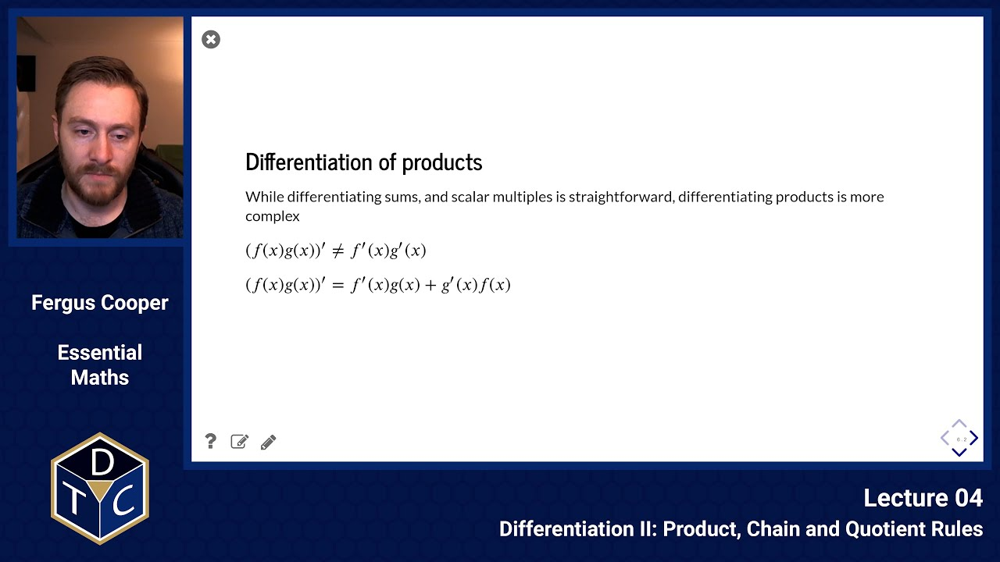
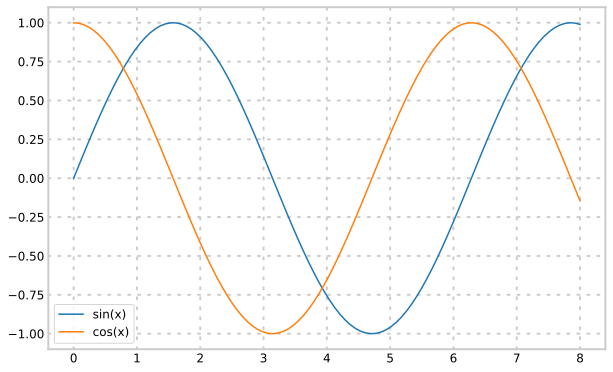

---

## YouTube lecture recording from October 2020

The following YouTube video was recorded for the 2020 iteration of the course.
The material is still very similar:

[](https://youtu.be/s3A-20YCAwE)

---

## Product, Chain and Quotient Rules

## Linear approximation and the derivative

By definition, the derivative of a function $f(x)$ is

> $f'(x) = \lim_{h \rightarrow 0} \frac{f(x+h) - f(x)}{h}$

This means that for small $h$, this expression approximates the derivative. By rearranging this, we have

> $f(x + h) \approx f(x) + h f'(x)$

In other words, $f(x+h)$ can be approximated by starting at $f(x)$ and moving a distance $h$ along the tangent $f'(x)$.

### Example

Estimate $\sqrt{5218}$

To do this, we first need an $f(x)$ that is easy to calculate, and close to 5218. For this we can take that $70^2 = 4900$.

To calculate the approximation, we need $\;f'(x)\;$, where $\;f(x) = \sqrt{x}\;$.

> $$f'(x) = \frac{1}{2 \sqrt{x}}$$ > $$f'(x) = \frac{1}{2 \sqrt{x}}$$

Since 5218 = 4900 + 318, we can set $x = 4900$ and $h = 318$.

Using the approximation, we have:

> $f(5218) \approx f(4900) + 318 \times f'(4900)$ > $f(5218) \approx 70 + 318 \times \frac{1}{140} \approx 72.27$ > $\sqrt{5218} = 72.2357252$ - not a bad appriximation!

## Standard derivatives

It's useful to know the derivatives of all the standard functions, and some basic rules.

> $\frac{d}{dx} (x^n) = n x^{n-1}$ > $\frac{d}{dx} (\sin x) = \cos x$ > $\frac{d}{dx} (\cos x) = -\sin x$ > $\frac{d}{dx} (e^x) = e^x$

To understand the derivative of sin and cos, consider their graphs, and when they are changing positively (increasing), negatively (decreasing) or not at all (no rate of change).



## Other Differentiation Rules

## Differentiation of sums, and scalar multiples

> $(f(x) \pm g(x))' = f'(x) \pm g'(x)$
> $(a f(x))' = a f'(x) $

## Differentiation of products

While differentiating sums, and scalar multiples is straightforward, differentiating products is more complex

> $(f(x) g(x) )' \neq f'(x) g'(x)$ > $(f(x) g(x) )' = f'(x) g(x) + g'(x) f(x)$

### Example

To illustrate that this works, consider $y = (2x^3 - 1)(3x^3 + 2x)$

If we expand this out, we have that $y = 6x^6 + 4x^4 - 3x^3 - 2x$

From this, clearly, $y' = 36 x^5 + 16x^3 - 9 x^2 - 2$

To use the product rule, instead we say $y = f \times g$, where $f = 2x^3 - 1$, and $g = 3x^3 + 2x$. Therefore

> $f'(x) = 6x^2$ > $g'(x) = 9x^2 + 2$ > $y' = f'g + g'f = 6x^2 (3x^3 + 2x) + (9x^2 + 2)(2x^3 - 1)$ > $y' = 18x^5 + 12x^3 + 18x^5 + 4x^3 - 9x^2 - 2 = 36x^5 + 16x^3 - 9x^2 - 2$

So both rules produce the same result. While for simple examples the product rule requires more work, as functions get more complex it saves a lot of time.

## Differentiating a function of a function - The Chain Rule

One of the most useful rules is differentiating a function that has another function inside it $y = f(g(x))$. For this we use the chain rule:

> $y = f(g(x))$ > $y'(x) = f'(g(x))\; g'(x) = \frac{df}{dg} \frac{dg}{dx}$

### Example 1: $y = (5x^2 + 2)^4$

We can write this as $y = g^4$, where $g = 5x^2 + 2$. Given this, we have that

> $\frac{dy}{dg} = 4g^3 = 4(5x^2 + 2)^3$ > $\frac{dg}{dx} = 10x$

This means that

> $\frac{dy}{dx} = \frac{dy}{dg} \frac{dg}{dx} = 4 (5x^2 + 2)^3 10 x = 40 x (5x^2 + 2)^3$

This extends infinitely to nested functions, meaning
$\frac{d}{dx}(a(b(c)) = \frac{d a}{d b} \frac{d}{dx} (b(c)) = \frac{d a}{db} \frac{d b}{dc}\frac{dc}{dx}$

## Differentiating the ratio of two functions - The Quotient Rule

If $y(x) = \frac{f(x)}{g(x)}$, then by using the product rule, and setting $h(x) = (g(x))^{-1}$, we can show that

> $y'(x) = \frac{f'g - g'f}{g^2}$

### Example

$y = \frac{3x-1}{4x + 2}$

> $f = 3x - 1, \rightarrow f' = 3$ > $g = 4x + 2, \rightarrow g' = 4$ > $y' = \frac{f'g - g'f}{g^2} = \frac{3(4x+2) - 4(3x-1)}{(4x+2)^2}$ > $y' = \frac{12x + 6 - 12 x + 4}{(4x+2)^2} = \frac{10}{(4x+2)^2}$

## Differentiating inverses - implicit differentiation

For any function $y = f(x)$, with a well defined inverse $f^{-1}(x)$ (not to be confused with $(f(x))^{-1})$), we have by definition that

> $x = f^{-1}(f(x)) = f^{-1}(y)$.

This means that we can apply the chain rule

> $\frac{d}{dx}(x) = \frac{d}{dx}(f^{-1}(y)) = \frac{d}{dy}(f^{-1}(y)) \frac{dy}{dx}$

But since $\frac{d}{dx}(x) = 1$

> $\frac{d}{dy}(f^{-1}(y)) = \frac{1}{\frac{dy}{dx}}$

### Example: $y = ln(x)$

If $y = ln(x)$, this means that $f^{-1}(y) = e^y = x$

By definition ($f^{-1}(y))' = e^y$, as $e^y$ doesn't change under differentiation. This means that

> $\frac{d}{dx}(ln(x)) = \frac{1}{\frac{d}{dy}(f^{-1}(y))} = \frac{1}{e^y}$

But since $y = ln(x)$:

> $\frac{d}{dx}(ln(x)) = \frac{1}{e^{ln(x)}} = \frac{1}{x}$

### Example - Differentiating using sympy

In Python, there is a special package for calculating derivatives symbolically, called sympy.

This can quickly and easily calculate derivatives (as well as do all sorts of other analytic calculations).

```python
import sympy as sp

x = sp.symbols('x') # This creates a variable x, which is symbolically represented as the string x.

# Calculate the derivative of x^2
sp.diff(x**2, x)
```

$\displaystyle 2 x$

```python
sp.diff(sp.cos(x), x)
```

$\displaystyle - \sin{\left(x \right)}$

```python
f = (x+1)**3 * sp.cos(x**2 - 5)
sp.diff(f,x)
```

$\displaystyle - 2 x \left(x + 1\right)^{3} \sin{\left(x^{2} - 5 \right)} + 3 \left(x + 1\right)^{2} \cos{\left(x^{2} - 5 \right)}$

```python
f = (x+1)**3 * (x-2)**2 * (x**2 + 4*x + 1)**4
sp.diff(f, x)
```

$\displaystyle \left(x - 2\right)^{2} \left(x + 1\right)^{3} \cdot \left(8 x + 16\right) \left(x^{2} + 4 x + 1\right)^{3} + 3 \left(x - 2\right)^{2} \left(x + 1\right)^{2} \left(x^{2} + 4 x + 1\right)^{4} + \left(x + 1\right)^{3} \cdot \left(2 x - 4\right) \left(x^{2} + 4 x + 1\right)^{4}$

```python
sp.expand(sp.diff(f, x)) # expand out in polynomial form
```

$\displaystyle 13 x^{12} + 180 x^{11} + 869 x^{10} + 1250 x^{9} - 2934 x^{8} - 11504 x^{7} - 9142 x^{6} + 10092 x^{5} + 23185 x^{4} + 17068 x^{3} + 6081 x^{2} + 1058 x + 72$

### Sympy documentation

You can look at the documentation for Sympy to see many other possibilities (e.g. we will use Sympy to do symbolic integration later on in this course)

- <https://docs.sympy.org/latest/index.html>

Try out Sympy to verify your pen & paper answers to the problem sheets.

### Introductory problems

::::challenge{id="04_intro_01" title="Introductory problems 1"}
Differentiate the following functions, using the stated rules where indicated:

1. Product rule: $\displaystyle y=(3x+4x^2)(8+3x^2)$
1. Product rule: $\displaystyle y=(5x^2-12)(4x^{-1} +2)$
1. Product rule: $\displaystyle y=x\,\cos x$
1. Product rule: $\displaystyle y=(3\sqrt{x} + 4x^3)\sin x$
1. Chain rule: $\displaystyle y=(6x+2)^4$
1. Chain rule: $\displaystyle y=({5x^3+10})^{1/2}$
1. Any rules: $\displaystyle y=\sqrt{{1\over{1-3x}}}$
1. Any rules: $\displaystyle y=(3x+1)\sqrt{5x^2-x}$

::::

::::challenge{id="04_intro_02" title="Introductory problems 2"}
Differentiate the following trigonometric functions with respect to $x$:

1. $\displaystyle 3\sin(x) + 5\cos(x)$
1. $\displaystyle \cos(3-2x)$
1. $\displaystyle \sqrt{\sin(x)}$
1. $\displaystyle \frac{\cos(x)}{4x}$

::::

### Main problems

::::challenge{id="04_main_01" title="Main problems 1"}
Let $y=x^2$.

1. Find the **exact** value of $y$ when $x=2.1$.
1. Now **estimate** the value of $y$ when $x=2.1$ by using the linear approximation formula
   $$f(x_1+h)=f(x_1)+hf'(x_1)$$
   and letting $x_1=2.0$ and $h=0.1$.
1. Compare your estimate to the true value. Which is bigger? What is there about the shape of the graph of $y=x^2$ that accounts for this?
1. Repeat parts 1. and b) for $x=2.01$.
1. Calculate the absolute error in each estimate. How does this error change with the value of $h$?

::::

::::challenge{id="04_main_02" title="Main problems 2"}
The energy, $E$, carried by a photon of wavelength $\lambda$ is given by

> $$E={hc\over \lambda}$$

where $h$ is Planck's constant ($h=6.63\times 10^{-34}\,\rm{Js}$) and $c$ is the speed of light ($c=3 \times 10^8\,\rm{ms}^{-1}$).

1. Calculate the energy carried by a photon of wavelength 500\thinspace nm.
1. Sketch a graph to show how E varies with $\lambda$.
1. Derive an expression for $\displaystyle \frac{{\rm d}E}{{\rm d}\lambda}$, and calculate the slope of your graph when $\lambda=500\,\rm{nm}$.
1. Hence, or otherwise, estimate the difference in energy between a photon of wavelength $500\,\rm{nm}$ and one of wavelength $505\,\rm{nm}$.

::::

::::challenge{id="04_main_03" title="Main problems 3"}
On February 10, 1990, the water level in Boston harbour was given by:

> $$y=5 + 4.9 \cos\left({\pi\over 6} t\right)$$

where $t$ is the number of hours since midnight and $y$ is measured in feet.

1. Sketch y.
1. Find $\displaystyle \frac{{\rm d}y}{{\rm d}t}$. What does it represent, in terms of water level?
1. For $0\le t \le 24$, when is $\displaystyle \frac{{\rm d}y}{{\rm d}t}$ zero? Explain what it means for $\displaystyle \frac{{\rm d}y}{{\rm d}t}$ to be zero.

::::

::::challenge{id="04_main_04" title="Main problems 4"}
In laminar flow of blood through a cylindrical artery, the resistance $R$ is inversely proportional to the fourth power of the radius $r$.

Use a linear approximation to show that if $r$ is decreased by 2\%, $R$ will increase by approximately 8\%.
::::

::::challenge{id="04_main_05" title="Main problems 5"}
Imagine an ocean basin with an inlet on one side.
We can model the salinity of the water as a function of the distance from the ocean inlet.

Let $s$ be the water salinity, and $x$ is the distance from the inlet. Then

> $$\displaystyle s = {s_{0}\alpha X\over(\alpha X - x)}$$

where $s_{0}$ is the initial salinity at the inlet, $X$ is the width of the basin, and $\alpha$ is a constant.

Prove that the rate of increase of salinity with distance from the inlet is given by

> $$\displaystyle \frac{{\rm d}s}{{\rm d}x} = {s\over\alpha X - x}$$

::::

::::challenge{id="04_main_06" title="Main problems 6"}

The sine and cosine functions can be written in the form of the following infinite series:

> $$\sin x = x - {x^3\over3!} + {x^5\over5!} - {x^7\over7!} + \ldots$$ > $$\cos x = 1 - {x^2\over2!} + {x^4\over4!} - {x^6\over6!} + \ldots$$

Differentiate these series term by term to verify the standard expressions for $\displaystyle\frac{{\rm d}}{{\rm d}x}(\sin x)$ and $\displaystyle\frac{{\rm d}}{{\rm d}x}(\cos x)$.
::::

### Extension problems

::::challenge{id="04_ext_01" title="Extension problems 1"}
The focal length of the lens of the eye, $f(t)$, can be controlled so that an object at distance $u(t)$ in front of the eye can be brought to perfect focus on the retina at a constant $v = 1.8\,\rm{cm}$ behind the lens.

A fly is moving towards the eye at a speed of $0.7\,\rm{ms}^{-1}$.

Assuming that the optics of the eye lens obeys the thin lens formula

> $${1\over f(t)}={1\over u(t)}+{1\over v},$$

find the rate of change of focal length required to keep the fly in perfect focus at a distance of $3\,\rm{m}$.

Note: consider carefully what you are differentiating with respect to, and the physical interpretation of the mathematics.
::::

::::challenge{id="04_ext_02" title="Extension problems 2"}
A contaminated lake is treated with a bactericide.

The rate of change of harmful bacteria $t$ days after treatment is given by

> $$\frac{{\rm d}N}{{\rm d}t} = -{2000t\over 1+t^2}$$

where $N(t)$ is the number of bacteria in $1\,\rm{ml}$ of water.

1. State with a reason whether the count of bacteria increases or decreases during the period $0\leq t \leq 10$.
1. Find the minimum value of $\displaystyle \frac{{\rm d}N}{{\rm d}t}$ during this period.

::::

::::challenge{id="04_ext_03" title="Extension problems 3"}
Consider a population of lions $L(t)$ and zebra $Z(t)$ interacting over time $t$.
One type of model for this situation is

> $$\frac{{\rm d}Z}{{\rm d}t} = aZ - bZL \qquad \rm{and} \qquad \frac{{\rm d}L}{{\rm d}t} = -cL + dZL,$$

where $a$, $b$, $c$ and $d$ are positive constants.

1. What values of $\displaystyle \frac{{\rm d}Z}{{\rm d}t}$ and $\displaystyle \frac{{\rm d}L}{{\rm d}t}$ correspond to stable populations?
1. How would the statement 'zebra go extinct' be represented mathematically?
1. For parameters $a=0.05$, $b=0.001$, $c=0.05$, and $d=0.00001$, find all population pairs $(Z,L)$ that yield stable populations. Is extinction inevitable?

::::
