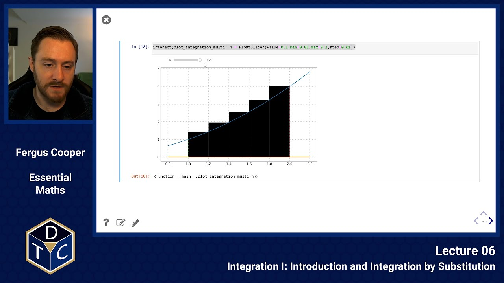
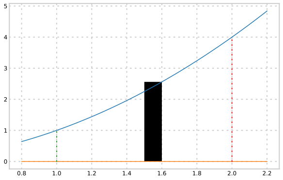
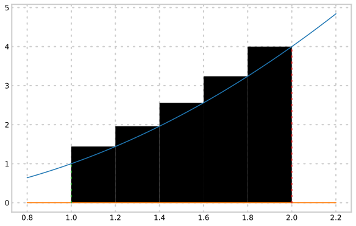

---

## YouTube lecture recording from October 2020

The following YouTube video was recorded for the 2020 iteration of the course.
The material is still very similar:

[](https://youtu.be/nEWqxSs6eLs)

---

## Introduction and Integration by Substitution

## Integration

**Calculating the area under a curve**:

If we want to find the area under a curve, we can divide the area into strips, calculate the area of each strip, and sum these areas together.

e.g. find the area of

> $$\displaystyle y = f(x) = x^2\qquad{\rm between}\qquad x=1\text{ and }x=2$$



The area of the strip is $\displaystyle \delta A_i \approx y(x_i)~\delta x$

We can sum up all the strips between $x=1$ and $x=2$ to give an estimate for the total area:

> $$\displaystyle A \approx \sum \delta A_i = \sum y(x_i)~\delta x.$$

This becomes more accurate as $\delta x$ becomes smaller.
We can use the same trick as when differentiating: let $\delta x$ tend to $0$:

> $$\displaystyle A = \lim_{\delta x \to 0}\sum y(x_i)~\delta x= \int\limits^{2}_{1} y~{\rm d}x$$

If we use a coarse approximation, then we are over-counting the area under the curve by quite a lot:



But, as the size of each rectangle reduces, we converge the true area under the curve:


$\displaystyle \int$ is the old English `S` and stands for the phrase "Sum Over".

This process is called **integration**.

## Calculating the integral

Let us 'invent' a function $F(x)$ that gives the area from $0$ to $x$.
Then $\displaystyle A = F(2) - F(1)$.

With this (imagined) function, we can find the area of one of our tiny steps **exactly**, as

> $$\displaystyle F(x + \delta x) - F(x)$$

Remember we approximated this as $\displaystyle y\,\delta x = f(x)\,\delta x$, so:

> $$\displaystyle  F(x + \delta x) - F(x) \approx f(x)\delta x$$ > $$\displaystyle  f(x) \approx {F(x+\delta x)-F(x)\over\delta x}$$

The error in this approximation tends to $0$ as $\displaystyle \delta x\to 0$, so

> $$\displaystyle f(x) = \lim_{\delta x\to 0} {F(x+\delta x)-F(x)\over\delta x} = F'(x)$$

(recalling the definition of the derivative).

In other words, for our example,

> $$\displaystyle A(x) = \int\limits^{x}_{1} y(t)~{\rm d}t\qquad{\rm then}\qquad y(x) = A'(x)$$

**Integration reverses the process of differentiation**.

## Calculating integrals

We know that:

> $$\displaystyle {{\rm d} \left(x^2\right)\over {\rm d}x}=~2 x~~~~~\Rightarrow~~~~~\biggr[x^2\biggl]_{x_1}^{x_2} = \int_{x_1}^{x_2} 2 x~{\rm d}x $$

Likewise:

> $$\displaystyle {{\rm d}\left(\frac{x^3}{3}\right)\over {\rm d}x}=~x^2~~~~~~~\Rightarrow~~~~~~\int_{x=1}^{x=2} x^2~{\rm d}x = \biggr[{1\over3}x^3\biggl]_{x=1}^{x=2}={8\over 3}-{1\over 3}= {7\over 3}$$

**In general:**

> $$\displaystyle {{\rm d}\left(a\thinspace x^{n+1}\right)\over {\rm d}x}=(n+1)a\thinspace~x^n~~~~~\Rightarrow ~~~~\int_{x_1}^{x_2} a\thinspace x^n~{\rm d}x = \biggr[{a\over(n+1)} \thinspace x^{(n+1)}\biggl]_{x_1}^{x_2}$$

## SymPy examples

$$\displaystyle \int_{x_1}^{x_2} x^6~{\rm d}x =$$

```python
import sympy as sp
x, x1, x2 = sp.symbols('x x_1 x_2')
sp.integrate(x**6,(x,x1,x2))
```

> $\displaystyle - \frac{x_{1}^{7}}{7} + \frac{x_{2}^{7}}{7}$

---

$$\displaystyle \int_{x_1}^{x_2} x^{3\over 2}~{\rm d}x =$$

```python
sp.integrate(x**(sp.sympify(3)/2),(x,x1,x2))
```

> $\displaystyle - \frac{2 x_{1}^{\frac{5}{2}}}{5} + \frac{2 x_{2}^{\frac{5}{2}}}{5}$

---

$$\displaystyle \int_{x_1}^{x_2} x^{-{1\over 2}}~{\rm d}x = $$

```python
sp.integrate(x**(-sp.sympify(1)/2),(x,x1,x2))
```

> $\displaystyle - 2 \sqrt{x_{1}} + 2 \sqrt{x_{2}}$

## Indefinite integrals

Consider now the functions:

> $$\displaystyle y=x^2+7 ~~~~~~~~~~{\rm (3)}$$ > $$\displaystyle y=x^2-100 ~~~~~~~~~{\rm (4)}$$

Differentiating (3):

> $$\displaystyle {{\rm d}y\over {\rm d}x}=2x$$

Differentiating (4):

> $$\displaystyle {{\rm d}y\over {\rm d}x}=2x$$

This implies that the integral:

> $$\displaystyle y=\int 2x~dx=x^2 + \kappa~~~~~{\rm where~~}\kappa~~{\rm is~an~unknown~constant}$$

An integral without limits is called an **indefinite integral**.

## Indefinite integrals in SymPy

```python
x = sp.symbols('x')
sp.integrate(2*x,x)
```

> $\displaystyle x^{2}$

## Other integrals

Recall that:

> $$\displaystyle {{\rm d}\over {\rm d}x}\ln x={1\over x}$$

And, that:

> $$\displaystyle {{\rm d}\over {\rm d}x}\ln x={1\over x}~~~~~~~~\Rightarrow~~\int{1\over x}~{\rm d}x=\ln x + \kappa$$

This constant $\kappa$ can be written as:

> $$\displaystyle \kappa=\ln B$$

where $B$ is another constant. Thus:

> $$\displaystyle \int {1\over x}~dx = \ln x + \kappa=\ln x +\ln B =\ln (B ~x)$$

## Integrating trigonometric functions

Recall that:

> $$\displaystyle {{\rm d}\over {\rm d}x}\biggr(\sin x\biggl)= \cos x~~~~~~~~~~~~~{\rm and}~~~~~~~~~~~ {{\rm d}\over {\rm d}x}\biggr(\cos x\biggl)= -\sin x$$

Example (i):

> $$\displaystyle \int_{0}^{\pi/2} \cos x \thinspace {\rm d}x = \biggr[\sin x \biggl]_0^{\pi/2}=1-0=1$$

Example (ii):

> $$\displaystyle \int_{0}^{\pi/2} \sin x \thinspace {\rm d}x =\biggr[-\cos x \biggl]_0^{\pi/2}=0-(-1)=1$$

## Summary of integration formulae

$\displaystyle \int a\,{\rm d}x=ax+C$

---

$\displaystyle \int ax\,{\rm d}x={1\over2}ax^2+C$

---

$\displaystyle \int ax^n\,{\rm d}x={1\over{n+1}}ax^{n+1}+C\qquad{\rm for~all}n{\rm ~except~}n=-1$

---

$\displaystyle \int x^{-1}\,{\rm d}x=\int {1\over x}\,dx = \ln \vert x\vert +C$

## Application

Recall that $f'(t)$ gives the rate at which $f(t)$ changes at time $t$.

Integrating the derivative $f'(t)$, we see:

> $$\displaystyle \int_a^b f'(t) \thinspace {\rm d}t = \biggr[f(t)\biggl]_a^b = f(b)-f(1. $$

Therefore, the definite integral from $a$ to $b$ of $f'(t)$ with respect to $t$ will always give the **net** change that $f(t)$ has undergone as the parameter $t$ moves from $a$ to $b$.

## Example

A chemical process produces NaCl at the rate of $3\sqrt{t}$ grams per minute.
We ask three questions:

1. What is the rate of production one minute into the process?
2. What is the quantity of NaCl produced over the next three minutes?
3. What is the mean rate of NaCl production over this interval?

## Solution

Let $f(t)$ denote the grams of NaCl produced after $t$ minutes. Then $f'(t)= 3\sqrt{t}$.

1. The rate of production one minute into the process is $f'(1) = 3\sqrt{1} = 3$ grams per minute.

2. The quantity of NaCl produced over the next three minutes is:

   > $$\displaystyle f(4)-f(1) = \int_1^4\,f'(t)\,{\rm d}t = \int_1^4\,3\sqrt{t}\,{\rm d}t = \left[2t^{3/2}\right]_1^4 = 2\times(8-1) = 14$$

```python
t = sp.Symbol('t')
sp.integrate(3*sp.sqrt(t),(t,1,4))
```

> $\displaystyle 14$

3. The mean rate is the constant rate which would give the same overall effect:

   > $$\displaystyle {1\over b-a}\int_a^b\,f'(t)\,{\rm d}t = {1\over 4-1}\int_1^4\,3\sqrt{t}\,{\rm d}t = {14\over 3}$$

```python
sp.integrate(3*sp.sqrt(t),(t,1,4))/(4-1)
```

$\displaystyle \frac{14}{3}$

## Substitution Method

Suppose we wish to integrate:

> $$\displaystyle I=\int f(g(x))~{\rm d}x~~~~~~~~~~~{\rm~e.g.}~~\int_{a}^{b} (3-4x)^{-5}~{\rm d}x$$

In general, for $g(x)=u$, we can write:

> $$\displaystyle \int_{x_1}^{x_2}\thinspace f(g(x))~{\rm d}x = \int_{u_1}^{u_2}\thinspace f(u) {{\rm d}x\over {\rm d}u} {\rm d}u $$

This can be thought of as being like the integral version of the chain rule.

### Examples

Consider:

> $$\displaystyle \int_{a}^{b} (2x + 3)^4~{\rm d}x~~~~~~~~~~~~~{\rm Equation ~(7)}$$

Multiplying this out and then integrating it would be very tedious.
Try a substitution instead:

> $$\displaystyle u=2x+3~~~\Longleftrightarrow x={1\over 2}(u-3)={u\over 2}-{3\over 2}~~~~ \Longleftrightarrow {{\rm d}x\over {\rm d}u}={1\over 2}$$

Substitute into Equation (7) above:

> $$\displaystyle \int_{u(1.}^{u(b)} u^4 \times {1\over 2}~{\rm d}u ={1\over 2}\int_{u(1.}^{u(b)} u^4~du = {1\over 2}\biggr[{1\over 5}u^5\biggl]_{u(1.}^{u(b)}= {1\over 2}\biggr[{1\over 5}(2x+3)^5\biggl]_a^b$$

```python
a, b = sp.symbols('a b')
sp.integrate((2*x + 3)**4,(x,a,b))
```

$\displaystyle - \frac{16 a^{5}}{5} - 24 a^{4} - 72 a^{3} - 108 a^{2} - 81 a + \frac{16 b^{5}}{5} + 24 b^{4} + 72 b^{3} + 108 b^{2} + 81 b$

---

Let's look at another example:

> $$\displaystyle \int_{a}^{b} (3-4x)^{-5}~{\rm d}x~~~~~~~~~~~~~{\rm Equation~(8)}$$

Let:

> $$\displaystyle u=3-4x~~~\Longleftrightarrow x={1\over 4}(3-u)={3\over 4}-{u\over 4}~~~~\Longleftrightarrow {{\rm d}x\over {\rm d}u}=-{1\over 4}$$

Substitute into Equation (8) above:

> $$\displaystyle \int_{u(1.}^{u(b)} u^{-5} \times {-1\over 4}~{\rm d}u = -{1\over 4}\int_{u(1.}^{u(b)} u^{-5}~{\rm d}u = -{1\over 4}\biggr[{1\over-4}u^{-4}\biggl]_{u(1.}^{u(b)}$$ > $$\displaystyle \qquad \qquad \qquad \qquad \qquad \qquad \qquad \qquad ~~~ = {1\over 16}\biggr[(3-4x)^{-4}\biggl]_a^b$$

```python
sp.integrate((3 - 4*x)**(-5),(x,a,b))
```

> $\displaystyle \frac{1}{4096 b^{4} - 12288 b^{3} + 13824 b^{2} - 6912 b + 1296} - \frac{1}{4096 a^{4} - 12288 a^{3} + 13824 a^{2} - 6912 a + 1296}$

### Introductory problems

::::challenge{id="06_intro_01" title="Introductory problems 1"}
Integrate the following functions with respect to $x$. Remember that you can check your own answers by differentiating your results:

1. $\displaystyle x^3-{1\over{x^4}}+x^2$
1. $\displaystyle \sqrt[3]{x}+\frac{1}{3\sqrt[4]{x}}$
1. $\displaystyle \frac{1}{x^2} + \frac{1}{\sqrt[3]{x}} - 7$

::::

::::challenge{id="06_intro_02" title="Introductory problems 2"}
Evaluate the following definite integrals:

1. $\displaystyle \int_1^2 x^{1/2}~{\rm d}x$
1. $\displaystyle \int_2^3 x^{-2/3}~{\rm d}x$
1. $\displaystyle \int_0^{\ln(2)}e^{3x}~{\rm d}x$
1. $\displaystyle \int_0^2(x+1)^{1/5}~{\rm d}x$

::::

::::challenge{id="06_intro_03" title="Introductory problems 3"}
Find the integrals below by making the substitution suggested:

1. $\displaystyle \int x^2(2x^3-5)^3~{\rm d}x \qquad\rm{using}\qquad u = 2x^3-5$
1. $\displaystyle \int x\sqrt{7-2x^2}~{\rm d}x \qquad\rm{using}\qquad u = 7-2x^2$
1. $\displaystyle \int_0^1 e^x(3e^x-10)^4~{\rm d}x \qquad\rm{using}\qquad u = 3e^x-10$
1. $\displaystyle \int x^3\sqrt{15-3x^4}~{\rm d}x \qquad\rm{using}\qquad u = 15-3x^4$
1. $\displaystyle \int_0^4 \sqrt{x^3}\,\sqrt{4+x^{5/2}}~{\rm d}x \qquad\rm{using}\qquad u = 4+x^{5/2}$
1. $\displaystyle \int_0^1 x^{n-1}(1-x^{n})^2~{\rm d}x \qquad\rm{using}\qquad u = 1-x^{n}$

::::

::::challenge{id="06_intro_04" title="Introductory problems 4"}
By making suitable substitutions, find the indefinite integrals of:

1. $\displaystyle 2(6x-5)^3$
1. $\displaystyle \frac{7x}{x^2-2}$
1. $\displaystyle \frac{3}{\sqrt{5-x}}$
1. $\displaystyle \frac{1}{x-a}$

::::

### Main problems

::::challenge{id="06_main_01" title="Main problems 1"}
Electrostatic work: the force acting between two electric charges $q_1$ and $q_2$ separated by distance $x$ in a vacuum is given by Coulomb's inverse square law:

> $$\displaystyle F(x) = {q_1 q_2\over 4\pi \epsilon_0 x^2}$$

where $\epsilon_0$ is the permittivity of a vacuum.

Like charges (charges with the same sign, such as 2 nuclei or 2 electrons) repel so that the force acting on $q_2$ due to the presence of $q_1$ acts in a positive $x$ direction, away from $q_1$.
Unlike charges (of opposite signs such as the proton and electron in the hydrogen atom) attract, and the force on $q_2$ is directed towards $q_1$ (i.e.\ F is negative).

Consider 2 like charges, initially infinitely far apart.
Because the charges repel, work must be done on the system to bring $q_2$ from infinity to the distance $x$ from $q_1$.
The force $F$ must be applied to overcome the repulsion.

1. Explain why the total work done is given by

   > $\displaystyle W=-\int_\infty^x F(x')~{\rm d}{x'} = -{q_1 q_2\over 4\pi \epsilon_0} \int_\infty^x {{\rm d}{x'}\over {x'}^2}$.

1. Calculate the work, $W$, in Joules when
   - $x =5.3 \times 10^{-11}\,\rm{m}$,
   - $q_1=q_2=1.6 \times 10^{-19}\,\rm{C}$,
   - $\epsilon_0=8.85 \times 10^{-12}\,\rm{Fm}^{-1}$.

::::

::::challenge{id="06_main_02" title="Main problems 2"}
The rate at which the world's oil is being consumed is continuously increasing.
Suppose the rate (in billions of barrels per year) is given by the function $r=f(t)$, where $t$ is measured in years and $t=0$ is the start of 1990.

1. Write down a definite integral which represents the total quantity of oil used between the start of 1990 and the end of 2020.
1. Calculate this integral using the function $\displaystyle r(t)=32 e^{0.05t}$.

::::

::::challenge{id="06_main_03" title="Main problems 3"}
Since 1850, global carbon emissions have been rising exponentially.
Let $C(t)$ represent the rate that carbon is emitted into the atmosphere, measured in Gigatonnes per year, where $t$ measures the number of years since the start of 1850.
A model for the rate of emission over time is given by
$$C(t) = ke^{pt},$$
where $k$ and $p$ are positive constants.

1. What are the units of $k$ and $p$?
1. Given that, at the start of 1850, the global emission rate was 0.2 Gigatonnes per year, and that at the start of 2010 the global emission rate was 32 Gigatonnes per year, calculate $k$ and $p$.
1. Calculate the total quantity of carbon emitted since the start of 1850.

::::

::::challenge{id="06_main_04" title="Main problems 4"}
The velocity $v$ of blood in a cylindrical vessel of radius $R$ and length $l$ is given by

> $$v(r) = {P(R^2 - r^2)\over 4\eta l}$$

where $\eta$ and $P$ are constants, and $r$ is the radial distance from the cylinder's axis.

Find the average velocity of blood along the radius of the cylinder (i.e. for $0\leq r\leq R$), and compare this with the maximum velocity.
::::

::::challenge{id="06_main_05" title="Main problems 5"}
Consider the function $\displaystyle y = 4x^3 +2x^2-8x + 2$.

1. Draw an accurate graph of this function for values of $x$ between $-4$ and $4$.
1. Calculate the turning points of the curve and mark these on the graph.
1. On your graph, shade in the region under the curve between $x=-2$ and $x=2$ and _estimate_ its area.
1. Integrate the function between $x=-2$ and $x=2$. Is this an accurate calculation of the area of the shaded region in part 3?
1. Identify and explain any differences you find between your estimate in part 3 and your calculation in part 4.

::::

### Extension problems

::::challenge{id="06_ext_01" title="Extension problems 1"}
Evaluate the following definite integrals:

1. $\displaystyle \int_{-\pi/2}^{\pi/2} 3\cos (x)\,{\rm d}x$
1. $\displaystyle \int_{\pi\over 2}^{\pi}\cos (x)\,\sin(x)\,{\rm d}x$
1. $\displaystyle \int_0^\pi(\cos^2(x)+\sin^2(x))\,{\rm d}x$

::::

::::challenge{id="06_ext_02" title="Extension problems 2"}
Let $u$ and $v$ be functions of $x$.

1. Given that $\displaystyle \def\dd#1#2{{\frac{{\rm d}#1}{{\rm d}#2}}} \quad\dd{}{x}(uv) = u\dd{v}{x} + v\dd{u}{x},\quad$ show that $\displaystyle \def\dd#1#2{{\frac{{\rm d}#1}{{\rm d}#2}}} \quad\int v~\dd{u}{x}~{\rm d}x = uv-\int u~\dd{v}{x}~{\rm d}x.$
1. By using this 'integration by parts' formula, and substituting $z=x^2$ or otherwise, show that
   $$\int_0^{\infty} x^n~e^{-x^2}~{\rm d}x={1\over 2}(n-1)\int_0^{\infty} x^{n-2}e ^{-x^2}~dx\qquad \rm{for}\;n>1.$$
1. Hence evaluate $\displaystyle \int_0^{\infty} x^5~e^{-x^2}~{\rm d}x.$
   :::

::::challenge{id="06*ext_03" title="Extension problems 3"}
A country wishes to achieve net-zero CO$*{2}$ emissions in 50 years. At the start of the program, their emissions ($E$) are 800MtCO$_{2}$year$^{-1}$. They decide that they will be able to reduce their emissions at a stable rate, so that each year they emit 12MtCO$_{2}$year$^{-1}$ less than the previous year.

- Write down the rate of change of the countries emissions ($E$), each year ($t$), $\def\dd#1#2{{\frac{{\rm d}#1}{{\rm d}#2}}} \dd{E}{t}$. Use this to calculate the total emissions that the country had produced over the 50 years.

After 10 years of these emissions, the country starts a CO$_{2}$ removal program, whereby a certain amount of CO$_{2}$ is captured from the atmosphere and sequestered underground each year. This CO$_{2}$ follows the curve
$$R = 0.1t^{2} - t$$
where $R$ is the amount of CO$_{2}$ removal in MtCO$_{2}$year$^{-1}$.

- Determine whether the country achieves their 50 year net-zero emissions goal by finding the year in which the emissions produced are equal to the emissions removed.

After the 50 year program, the countries emission rate stabilises, and they emit the same amount of CO$_{2}$ each year after that. The CO$_{2}$ absorption rate per year follows the same trend as before. The country wishes to have not contributed to global warming at all since the start of the program. This means their net total CO$_{2}$ emissions over the entire program would have to be zero.

- Show that is takes approximately 109 years for the country to have a net-zero effect on global warming since the start of the program.

::::
