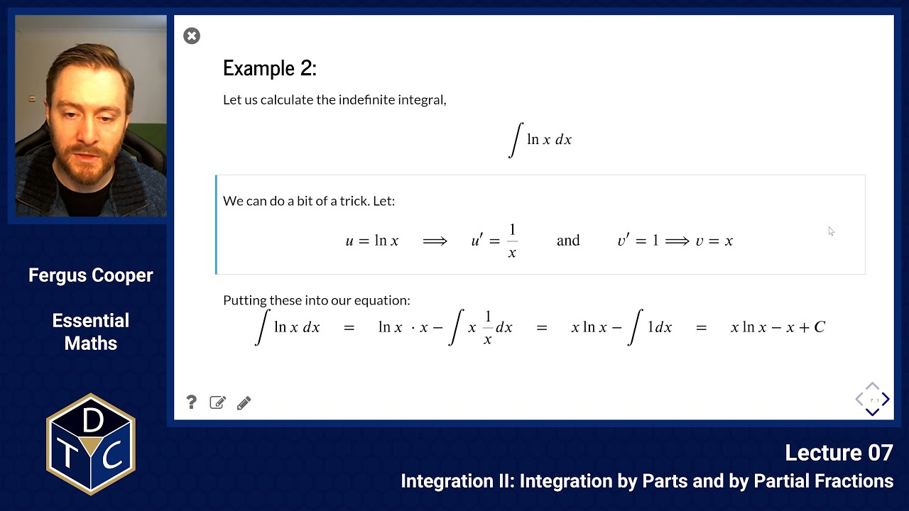

--- 

## YouTube lecture recording from October 2020

The following YouTube video was recorded for the 2020 iteration of the course.
The material is still very similar:

[](https://youtu.be/-9uaN3ZSwi0)

---

## Integration by Parts and by Partial Fractions

## Integration reverses the process of differentiation

### In general:

> $$\displaystyle {d(a\thinspace x^{n+1})\over dx}=(n+1)a\thinspace~x^n~~~~~\Rightarrow ~~~~\int_{x_1}^{x_2} a\thinspace x^n~dx = \biggr[{a\over(n+1)} \thinspace x^{(n+1)}\biggl]_{x_1}^{x_2}$$

### Reminder: method 1: integration by substitution

This method can be thought of as an integral version of the chain rule.
Suppose we wish to integrate:

> $$\displaystyle I=\int f(g(x))~dx= \int f(u)~dx$$

> $$\displaystyle I =\int f(u){dx\over du}~du$$

## Integration Method 2: Integration by Parts

Recall that:

> $$\displaystyle {d\over dx}f(x)~g(x)=f(x)~g'(x)+ g(x)~f'(x)$$

Integrate and rearrange to get:

> $$\displaystyle  \int\limits_a^b f(x)~g'(x)~dx=\biggr[\;f(x)~g(x)\;\biggl]_a^b-\int\limits_a^b g(x)~f'(x)~dx $$

This is known as the formula for **'integrating by parts'** and can also be written:

> $$\displaystyle \int\limits_a^b u~{dv\over dx}~dx ~~= ~~ \biggr[uv\biggl]^b_a-\int\limits_a^b v~{du\over dx}~dx$$

or

> $$\displaystyle \int\limits_a^b u~v'~dx~~ =~~ \biggr[uv\biggl]^b_a-\int\limits_a^b v~u'~dx$$

with $f(x) \equiv u$ and $g(x) \equiv v$.

### Integration by parts: Example 1

> $$\displaystyle \int\limits_a^b x~\sqrt{(x+1)}~dx=\int\limits_a^b x~(x+1)^{1/2}~dx$$


Choose

> $$\displaystyle u=x\qquad{\rm and}\qquad v'=\sqrt{(x+1)}$$

so that:

> $$\displaystyle u'=1\qquad{\rm and}\qquad v={2 \over 3}(x+1)^{3/2}$$.


Choose

> $$\displaystyle u=x\qquad{\rm and}\qquad v'=\sqrt{(x+1)}$$

so that:

> $$\displaystyle u'=1\qquad{\rm and}\qquad v={2 \over 3}(x+1)^{3/2}$$


Then:

> $$\displaystyle \int\limits_a^b x~\sqrt{(x+1)}~dx =\biggr[x~{2\over 3}(x+1)^{3/2}\biggl]_a^b - \int\limits_a^b 1 \times {2\over 3}(x+1)^{3/2}~dx$$

> $$\displaystyle =\biggr[{2\over 3}~x~(x+1)^{3/2}\biggl]_a^b- \biggr[{2\over 3}\cdot {2\over 5}(x+1)^{5/2}\biggl]_a^b$$


If we had chosen the other option for $u$ and $v'$ we would have got:

> $$\displaystyle \biggr[(x+1)^{1/2}~{x^2\over 2}\biggl]_a^b - \int\limits_a^b {1\over 2}~{1\over \sqrt{(x+1)}}~{x^2\over  2}~dx$$

The second term is **worse** than the integral we started with!
It's important to choose $u$ and $v$ carefully.
This comes with practice.

### Integration by parts: Example 2

Let us calculate the indefinite integral,

> $$\displaystyle \int \ln x~dx$$

We can do a bit of a trick.  Let:

> $$\displaystyle u=\ln x \quad\Longrightarrow\quad u'={1\over x}\qquad{\rm and}\qquad v'=1\Longrightarrow v=x$$

Putting these into our equation:

> $$\displaystyle \int \ln x~dx\quad=\quad\ln x~\cdot x - \int x~\frac{1}{x}dx$$

> $$\displaystyle = \quad x \ln x - \int 1 dx\quad=\quad x \ln x - x + C$$

We can also check this calculation using SymPy:

```python
x = sp.symbols('x')
sp.integrate(sp.log(x),x)
```
> $\displaystyle x \log{\left(x \right)} - x$


### Integration by parts: Example 3

> $\displaystyle \int\limits^{\infty}_0 x^3~e^{-x}~dx$

Using the formula:

> $$\displaystyle \biggl(\int u\thinspace v'\thinspace dx = [u\thinspace v]-\int v\thinspace u'\thinspace dx\biggr)$$

Choose

> $$\displaystyle u=x^3\qquad{\rm and}\qquad v'=e^{-x}$$

so that:

> $$\displaystyle u'=3x^2\qquad{\rm and}\qquad v=-e^{-x}$$

Then:

> $$\displaystyle \int\limits^{\infty}_0 x^3~e^{-x}~dx=-\biggr[x^3~e^{-x}\biggl]^{\infty}_0 +\int\limits^{\infty}_0 3x^2~e^{-x}~dx$$


Now apply integration by parts to the right-hand side:

Choose

> $$\displaystyle u=3x^2\qquad{\rm and}\qquad v'=e^{-x}$$

so that:

> $$\displaystyle u'=6x\qquad{\rm and}\qquad v=-e^{-x}$$

Then:

> $$\displaystyle \int\limits^{\infty}_0 3x^2~e^{-x}~dx=-\biggr[3x^2~e^{-x}\biggl]^{\infty}_0 +\int\limits^{\infty}_0 6x~e^{-x}~dx$$ 


And, once more:

Choose

> $$\displaystyle u=6x\qquad{\rm and}\qquad v'=e^{-x}$$

so that:

> $$\displaystyle u'=6\qquad{\rm and}\qquad v=-e^{-x}$$

Then:

> $$\displaystyle \int\limits^{\infty}_0 6x~e^{-x}~dx =-\biggr[6x~e^{-x}\biggl]^{\infty}_0 +\int\limits^{\infty}_0 6~e^{-x}~dx$$

> $$\displaystyle \Longrightarrow \int\limits^{\infty}_0 6~e^{-x}~dx=-\biggr[6~e^{-x}\biggl]^{\infty}_0=-6e^{-\infty}+6e^0=6$$

(Since $e^{-\infty}=0$ and $e^0=1$)

The other terms all go to zero:

> $$\displaystyle -\bigr[x^3~e^{-x}\bigl]^{\infty}_0 =-{\infty}^3~e^{-\infty} + 0 =0$$

> $$\displaystyle -\bigr[3x^2~e^{-x}\bigl]^{\infty}_0 =-3{\infty}^2~e^{-\infty} + 0 =0$$

So, to answer our original question:

> $$\displaystyle \int\limits^{\infty}_0 x^3~e^{-x}~dx=6$$

Let's also check it with SymPy:

```python
sp.integrate(x**3 * sp.exp(-x),(x,0,sp.oo))
```
> $\displaystyle 6$

This result actually generalises:

> $$\displaystyle \int\limits^{\infty}_0 x^n~e^{-x}~dx=n!$$

### Integration by parts: Example 4, trigonometry

Recall that:

> $$\displaystyle {d\over dx}(\sin x)=\cos x$$

> $$\displaystyle {d\over dx}(\cos x)=-\sin x$$

Let's try and calculate the following integral:

> $$\displaystyle \int\limits^b_a~\cos x\;e^{-x}~dx = I$$

Choose

> $$\displaystyle u=\cos x\qquad{\rm and}\qquad v'=e^{-x}$$

so that:

> $$\displaystyle u'=-\sin x\qquad{\rm and}\qquad v=-e^{-x}$$

Then:

> $$\displaystyle I =\biggr[-\cos x~\; e^{-x}\biggl]^b_a -\int\limits^b_a ~(-)\sin x~(-)e^{-x}~dx$$

> $$\displaystyle I =\biggr[-\cos x~\; e^{-x}\biggl]^b_a~~-~~\int\limits^b_a ~(-)\sin x~(-)e^{-x}~dx$$

Next, choose

> $$\displaystyle u=\sin x\qquad{\rm and}\qquad v'=e^{-x}$$

so that:

> $$\displaystyle u'=\cos x\qquad{\rm and}\qquad v=-e^{-x}$$

Then:

> $$\displaystyle I =\biggr[-\cos x~\;~e^{-x}\biggl]^b_a~~-~~\biggr[\sin x~(-)e^{-x}\biggl]^b_a ~~+~~\int\limits^b_a ~\cos x~(-)e^{-x}~dx$$

The last term is the integral we started with:

> $$\displaystyle \Longrightarrow~~~2~\int\limits^b_a ~\cos x~e^{-x}~dx~ =~\biggr[\sin x~\; e^{-x}\biggl]^b_a~~ -~~\biggr[\cos x~\; e^{-x}\biggl]^b_a$$


## Integration Method 3: Partial Fractions

If we want to calculate the integral below, none of the previous rules allow us to make much progress.

> $$\displaystyle \int {dx \over (2x+1)(x-5)}$$

But, in this case, we can try splitting the denominator up into two fractions that we can deal with:

> $$\displaystyle {\rm Let~~~~~} {1 \over (2x+1)(x-5)}={A\over (2x+1)} + {B\over (x-5)}$$

If we multiply both sides by $(2x+1)(x-5)$, we get:

> $\displaystyle A(x-5)+B(2x+1)=1$ so $Ax-5A+B2x+B=1$

We can then equate coefficients of $x$:

> $$\displaystyle A+2B=0~~~~{\rm thus~~} A=-2B~~~~~~~~~~\rm (A)$$

Equate units (coefficients of $x^0$):

> $$\displaystyle -5A+B=1 ~~{\rm~~so~from~(A):~~} 10B+B=1,~~B={1\over 11}~,~~A=-{2\over 11}$$

Thus:

> $$\displaystyle \int {dx \over (2x+1)(x-5)}=-\int {2 dx\over 11(2x+1)} + \int {dx\over 11(x-5)}$$

Now use method of substitution on the first fraction:

> $\displaystyle u=2x+1$

so $\displaystyle \frac{du}{dx}=2$ and $\displaystyle \frac{dx}{du}=1/2$

And on the second fraction:

> $\displaystyle w=x-5$

so $\displaystyle \frac{dw}{dx}=1$ and $\displaystyle \frac{dx}{dw}=1$

> $$\displaystyle \int {2 du \over 2 \times 11 \times u} + \int {dw\over 11w}= -{\ln u\over 11} + {\ln w \over 11}$$

> $$\displaystyle =-{\ln |2x+1|\over 11} + {\ln |x-5| \over 11}$$

SymPy can also solve integrals requiring partial fractions:

```python
sp.integrate(1/((2*x + 1)*(x - 5)),x)
```
> $\displaystyle \frac{\log{\left(x - 5 \right)}}{11} - \frac{\log{\left(x + \frac{1}{2} \right)}}{11}$

This answer seems different because of the arbitrary constant of integration.


### Introductory problems

::::challenge{id="07_intro_01" title="Introductory problems 1"}
By using suitable substitutions, evaluate the following integrals:

1.  $\displaystyle \def\d#1{{\rm d}#1} \int x^2(x^3+4)^2~~\d{x}$
1.  $\displaystyle \def\d#1{{\rm d}#1} \int e^{-x}(5-4e^{-x})~\d{x}$
1.  $\displaystyle \def\d#1{{\rm d}#1} \int (1+x)\sqrt{(4x^2+8x+3)}~\d{x}$
1.  $\displaystyle \def\d#1{{\rm d}#1} \int 3x e^{(x^2+1)}~\d{x}$
::::

::::challenge{id="07_intro_02" title="Introductory problems 2"}
Find the indefinite integrals, with respect to $x$, of the following functions:

1.  $\displaystyle x\,e^{3bx}$
1.  $\displaystyle x^3\,e^{-3x}$
1.  $\displaystyle x \cos (x)$
1.  $\displaystyle e^{bx} \sin(x)$
::::

::::challenge{id="07_intro_03" title="Introductory problems 3"}
Sketch the curve $y=(x-2)(x-5)$ and calculate by integration the area under the curve bounded by $x=2$ and $x=5$.
::::

### Main problems

::::challenge{id="07_main_01" title="Main problems 1"}
Evaluate the following indefinite and definite integrals:

1.  $\displaystyle \def\d#1{{\rm d}#1} \int \frac{6}{(7-x)^3}~\d{x}$
1.  $\displaystyle \def\d#1{{\rm d}#1} \int 13x^3(9-x^4)^5~\d{x}$
1.  $\displaystyle \def\d#1{{\rm d}#1} \int_2^5 5\log(x)~\d{x}$
1.  $\displaystyle \def\d#1{{\rm d}#1} \int x^x\,(1 + \log(x))~\d{x}$
::::

::::challenge{id="07_main_02" title="Main problems 2"}
Suppose the area $A(t)$ (in cm$^2$) of a healing wound changes at a rate

> $$\displaystyle \def\dd#1#2{{\frac{{\rm d}#1}{{\rm d}#2}}} \dd{A}{t} = -4t^{-3},$$

where $t$, measured in days, lies between 1 and 10, and the area is $2\,$cm$^2$ after 1 day.
What will the area of the wound be after 10 days?
::::

::::challenge{id="07_main_02" title="Main problems 2"}
A rocket burns fuel, so its mass decreases over time.

If it burns fuel at a constant rate $\rho\,{\rm kg/s}$, and if the exhaust velocity relative to the rocket is a constant $v_e\,{\rm m/s}$, then there will be a constant force of magnitude $\rho v_e$ propelling it.

The rocket starts burning fuel at $t=0\,{\rm s}$ with total mass of $m_0\,{\rm kg}$, and runs out of fuel at a later time $t=t_f\,{\rm s}$, with a final mass of $m_f\,{\rm kg}$.

1.  Newton's second law tells us that the instantaneous acceleration $a$ of the rocket at time $t$ is equal to the force propelling it at that time, divided by its mass at that time.
Write down an expression for $a$ as a function of $t$.
1.  By integrating this expression, show that the rocket's total change in velocity is given by $\displaystyle v_e \ln\left({m_0\over m_f}\right).$
::::


::::challenge{id="07_main_03" title="Main problems 3"}
The flow of water pumped upwards through the xylem of a tree, $F$, is given by:

> $$\displaystyle F = M_0(p+qt)^{3/4},$$

where $t$ is the tree's age in days, $p$ and $q$ are positive constants, and $M_0p^{3/4}$ is the mass of the tree when planted (i.e.\ at $t=0$).

Determine the total volume of water pumped up the tree in its tenth year (ignoring leap years) if:
 - $p=10$,
 - $q=0.01\,$day$^{-1}$, and
 - $M_0=0.92\,$l$\,$day$^{-1}$.
::::


### Extension problems


::::challenge{id="07_ext_01" title="Extension problems 1"}
Express $\displaystyle \frac{1}{x(x^2-16)}\quad{\rm in~the~form}\quad\frac{A}{x} + \frac{B}{(x+4)} + \frac{C}{(x-4)}$.


Hence calculate $\displaystyle \def\d#1{{\rm d}#1} \int\frac{1}{x(x^2-16)}\,\d{x}.$
::::


::::challenge{id="07_ext_02" title="Extension problems 2"}
The probability that a molecule of mass $m$ in a gas at temperature $T$ has speed $v$ is given by the Maxwell-Boltzmann distribution:

> $$\displaystyle f(v) = 4 \pi \left({m\over 2\pi k T} \right)^{3/2} v^2 e^{-mv^2/2kT}$$

where $k$ is Boltzmann's constant. Find the average speed:

> $$\displaystyle \def\d#1{{\rm d}#1} \overline {v} =\int_0^{\infty}v\,f(v)\,\d{v}.$$

::::


::::challenge{id="07_ext_03" title="Extension problems 3"}
Baranov developed expressions for commercial yields of fish in terms of lengths, $L$, of the fish.
His formula gave the total number of fish of length $L$ as $\displaystyle k\,e^{-cL}$, where $c$ and $k$ are constants ($k$ is positive).

1.  Give a sketch of the graph $\displaystyle f(L)=k\,e^{-cL}$.
(Something decreasing, concave upward and asymptotic to horizontal axis will do.)
On your sketch, introduce marks on the horizontal axis that represent lengths $L=1, L=2, L=3, L=4 {\rm  and } L=5$.
Now draw a rectangle on your sketch that represents the number of fish whose lengths are between $L=3$ and $L=4$.
1.  Explain how we can represent the total number of fish $N$ as an area.
Show that this number equals $k/c$.
1.  Only fish longer than $L_0$ count as commercial. Hence, assuming that the fish are all similar in shape (i.e. their width and breadth scales with their length) and of equal density $\rho$, show that the weight, $W$, of the commercial fish population is

    > $$\displaystyle \def\d#1{{\rm d}#1} W= \int_{L_0}^{+\infty} a\, k \rho\,L^3 e^{-cL}\,\d{L},$$

    and hence that
    
    > $$\displaystyle W={N\, a\, \rho\, e^{-cL_0}\over c^3} \left((cL_0)^3 +3(cL_0)^2+ 6cL_0 +6\right),$$
    
    where $a$ is a constant.
::::

