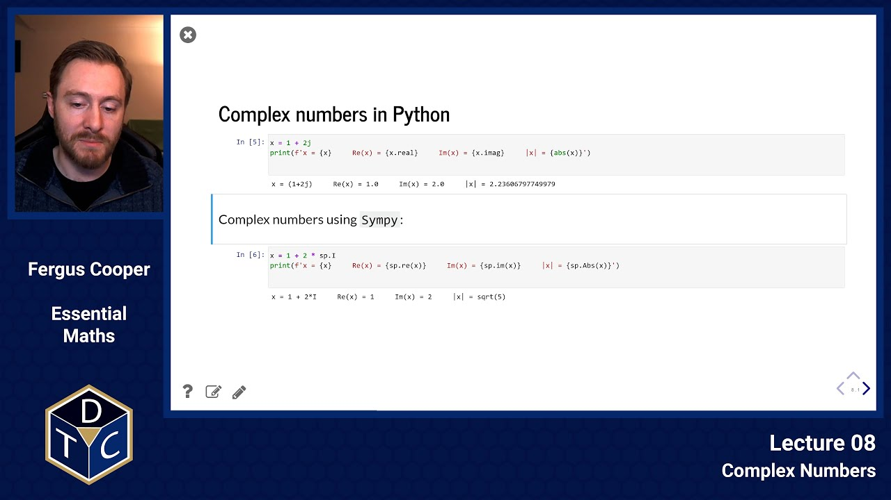
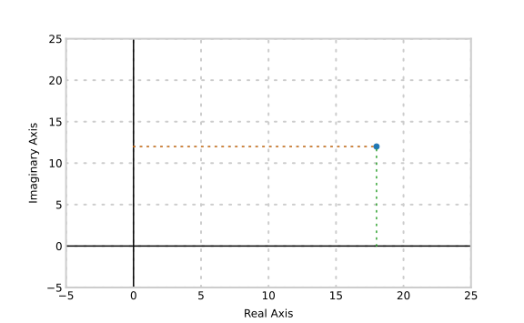
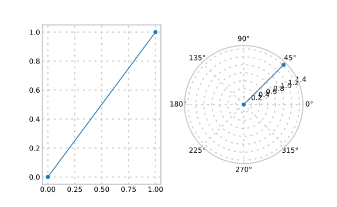

--- 

## YouTube lecture recording from October 2020

The following YouTube video was recorded for the 2020 iteration of the course.
The material is still very similar:

[](https://youtu.be/h8zbbLUnsMM)

---

## Complex Numbers

## Imaginary numbers

**The Imaginary Number $i$:**

- The polynomial $~~x^2-1=0~~$ has two real roots:  $~~1~~$ and $~~-1~~$
- The polynomial $~~x^2+1=0~~$ has **no** real roots.

Consider solving:
$$x^2 = 1\qquad{\rm and}\qquad x^2 = -1$$

We introduce an "imaginary" number $~~i~~$ so that there are two solutions to $~~x^2 = -1~~$: $~~i~~$ and $~~-i~~$.
That is, $~~i~~$ is a number with the property that $~~i^2=-1$.


## Complex numbers

The complex numbers are  the set of all expressions of the form $a + bi$ where $i^2=-1$ and $a$ and $b$ are real numbers:

> $$\mathbb{C}=\left\{a + bi~~\vert~~a,~b~\in\mathbb{R}\right\}$$

For $z=a+bi\in\mathbb{C}$ we define the *real* and *imaginary*
parts of $z$ to be ${\Re}(z) = a$ and $\Im(z)=b$.

The imaginary number $i$ has no home on the real number line.
Instead, we locate it on the **complex plane** at the point $(0,1)$.

- we can represent any complex number $z=a+bi$  as the point $(a,b)$ in the complex plane.
- The coordinates $(a,b)$ are usually called the *cartesian* coordinates for $z$.
  (Named after the mathematician and philosopher Rene Descartes).
- In this plane, the real numbers lie on the horizontal axis.
  We usually refer to the horizontal axis of $\mathbb{C}$ as the **real axis**.

The following plot shows a complex number with a real component of 18 and an imaginary component of 12:




## Complex conjugates

- The complex plane $\mathbb{C}$ contains **all** of the roots of **every** polynomial.

E.g., let's look at a quadratic equation.
Recall the quadratic formula:

> $$ax^2 +bx +c \iff x= {-b \pm\sqrt{b^2-4ac}\over 2a} $$

Now, let's consider this specific quadratic equation:

> $$x^2-8x+25 = 0$$

which we can solve using the quadratic formula:

> $$={{8\pm\sqrt{64-100}}\over2}={{8\pm\sqrt{-36}}\over2}={{8\pm6i}\over2}=4\pm3i$$

- Note that these two roots are reflections of one another through the
  real axis. They are *conjugates* of one another.

- In general, let $z=a + bi$. The **conjugate** of $z$ is the complex number
  $\bar{z}=a-bi$.

We can also use Sympy's `solve` method to solve polynomials:

```python
x = sp.symbols('x')
sp.solve(x**2 - 8*x + 25)
```
> $\displaystyle \left[ 4 - 3 i, \  4 + 3 i\right]$


## Modulus (size) of a complex number

The distance to a point on the complex plane from 0 is called its **modulus**, and we find this by calculating the hypotenuse of the triangle with base  ${\Re}(z)$ and height $\Im(z)$:

E.g. The modulus of $4\pm3i$ is $\sqrt{3^2+4^2}=\sqrt{9+16}=\sqrt{25}=5$

- In general, the **modulus** of $z=a+bi$ is the real number
  $|z|=\sqrt{a^2+b^2}$.

- The **modulus** is connected to the **conjugate** by means of the formula
  $z\cdot \bar{z}=|z|^2$.  Indeed:

$$
\begin{align}
z\cdot\bar{z}&=(a+bi)(a-bi)=a^2-(bi)^2=a^2-b^2\cdot i^2\\
&=a^2-b^2(-1)=a^2+b^2=|z|^2
\end{align}
$$

## Complex numbers in Python

Note that, in Python, because `i` is often used as an index variable in loops, the language uses `j`, instead, to represent the imaginary unit:

```python
x = 1 + 2j
print(f'x = {x}     Re(x) = {x.real}     Im(x) = {x.imag}     |x| = {abs(x)}')
```
```
x = (1+2j)     Re(x) = 1.0     Im(x) = 2.0     |x| = 2.23606797749979
```

In Sympy, the imaginary unit is `sp.I`:

```python
x = 1 + 2 * sp.I
print(f'x = {x}     Re(x) = {sp.re(x)}     Im(x) = {sp.im(x)}     |x| = {sp.Abs(x)}')
```
```
x = 1 + 2*I     Re(x) = 1     Im(x) = 2     |x| = sqrt(5)
```

## Addition and Subtraction:

Addition and subtraction of complex numbers work as you would expect:

> $$(a+bi)\pm(c+di)=(a\pm c) + (b\pm d)i$$

and

> $$-(a+bi)=-a-bi$$

Try adding: $(5+6i)+(1-i)$:

```python
print((5 + 6j) + (1 - 1j))
```
```
(6+5j)
```

Try subtracting: $(5+6i)-(1-i)$:

```python
print((5 + 6j) - (1 - 1j))
```

```
(4+7j)
```

## Multiplication:

Multiplication is not quite so convenient in cartesian coordinates:

$$
\begin{align*}
(a+bi)(c+di)&=ac + adi + bci + bidi \\ &= ac + adi + bci -bd \\ &=
(ac-bd)+(ad+bc)i
\end{align*}
$$

Try multiplying: $(5+6i)(1-i)$:

```python
print((5 + 6j) * (1 - 1j))
```
```
(11+1j)
```

## Division:

Division is even more awkward in cartesian coordinates: we have to multiply the numerator and the denominator by the complex conjugate of the denominator.

$$
\begin{align*}
{{a+bi}\over{c+di}}&={{(a+bi)(c-di)}\over{(c+di)(c-di)}}\\
&={{(ac+bd)+(bc-ad)i}\over{c^2+d^2}}=\left({{ac+bd}\over{c^2+d^2}}\right)+
\left({{bc-ad}\over{c^2+d^2}}\right)i
\end{align*}
$$

Try dividing: $${(-4+7i)\over (2+3i)}$$:

```python
print((-4 + 7*sp.I) / (2 + 3*sp.I))
```
```
(-4 + 7*I)*(2 - 3*I)/13
```

## Polar Coordinates

It is often convenient to represent  the complex number $z = a + bi$ in terms of its polar coordinates $\langle r,\theta\rangle$.

- The angle $\theta$ is called the *argument* of $z$.

- The real number $r=|z|$ is sometimes denoted mod$(z)$.



## Connection between cartesian and polar

Let $z=x+iy$.
If we are given the polar coordinates of $z$ and want to express the cartesian coordinates use

> $$x=r\cos\theta$$

> $$y=r\sin\theta$$

> $$z=r\cos\theta + ri\sin\theta=r(\cos\theta + i\sin\theta)$$

If we are given the cartesian coordinates and want to find the polar coordinates, use:

$$
r={\rm mod}(z)=|z|=\sqrt{x^2+y^2}
$$

$$
\begin{align*}
\theta={\rm arg}(z)=\tan^{-1}{y\over x}=
\begin{cases}\pi/2,&{\rm ~if~}~~ x=0,y>0 \\
-\pi/2,&{\rm ~if~}~~ x=0,y<0 \\
\arctan\left({y\over x}\right),&{\rm ~if~}~~ x>0\\
\arctan\left({y\over x}\right)+\pi,&{\rm ~if~}~~ x<0, y\geq 0\\
\arctan\left({y\over x}\right)-\pi,&{\rm ~if~}~~ x<0, y<0\\
\end{cases}
\end{align*}
$$

Not: all of the fuss about the value of $\theta$ in the formula above is to make sure that $z$ gets into the proper quadrant.
Beware of the sign of this tangent: it depends on which quadrant you are in.

The positive $x$ axis is defined as having $\theta=0$ and positive $\theta$ goes in an anticlockwise sense around the $x-y$ plane.

## Some examples:

### 1.

Find the cartesian coordinates for the complex number $z$ with polar coordinates $r=2$ and $\theta=\pi/6$.

> $$\Re(z)=x=r\cos\theta=2\cos(\pi/6)=2\left({{\sqrt{3}\over2}}\right)=\sqrt{3}$$

> $$\Im(z)=y=r\sin\theta=2\sin(\pi/6)=2\left({{1\over2}}\right)=1$$

Therefore, $z = \sqrt{3} + i$.

```python
print(cmath.rect(2, np.pi/6))
```
```
(1.7320508075688774+0.9999999999999999j)
```

### 2.

Find the polar coordinates for the complex number $z= -3+4i$.

> $$|z|=r = $$

> $$\sqrt{(-3)^2+4^2}=\sqrt{25}=5$$

> $${\rm arg}(z)=\theta=\arctan\left({{y}\over{x}}\right)=$$

> $$-0.93+\pi{\rm ~radians}\approx 127^\circ$$

```python
print(cmath.polar(-3 + 4j))
```
```
(5.0, 2.214297435588181)
```

### 3.

Find the polar coordinates for the complex number $z= -2i$.

> $${\rm mod}(z)=r = |z|=2$$

> $${\rm arg}(z)=\theta=-{{\pi}\over2}$$

```python
print(cmath.polar(-2j))
```
```
(2.0, -1.5707963267948966)
```

## Multiplication in Polar Coordinates:

First a reminder of three useful and important identities:

> $$\cos^2\theta + \sin^2\theta = 1$$

> $$\cos(\theta_1+\theta_2)=\cos\theta_1\cos \theta_2 - \sin\theta_1\sin\theta_2$$

> $$\sin(\theta_1+\theta_2)=\sin\theta_1\cos \theta_2 + \sin\theta_2\cos\theta_1$$

Now, let $z_1=r_1\cos\theta_1+ir_1\sin\theta_1$ and $z_2=r_2\cos\theta_2+ir_2\sin\theta_2$.

We first compute the real part of the product $z_1\cdot z_2$:

$$
\begin{align*}
\Re(z_1\cdot z_2) &= r_1\cos\theta_1\cdot r_2\cos\theta_2 - r_1\sin\theta_1\cdot
r_2\sin\theta_2\cr
&=r_1r_2(\cos\theta_1\cos\theta_2 - \sin\theta_1\sin\theta_2)\cr
&=r_1r_2\cos(\theta_1 + \theta_2)
\end{align*}
$$

Note that for the real part the moduli have been multiplied and the arguments added.

Now we compute the imaginary part of $z_1\cdot z_2$:

$$
\begin{align*}
\Im(z_1\cdot z_2) &= r_1\sin\theta_1\cdot r_2\cos\theta_2 + r_2\sin\theta_2\cdot
r_1\cos\theta_1\cr
&=r_1r_2(\sin\theta_1\cos\theta_2 - \sin\theta_2\cos\theta_1)\cr
&=r_1r_2\sin(\theta_1 + \theta_2)
\end{align*}
$$

For the imaginary part too, the moduli multiply while the arguments add.   

This gives a relatively compact and highly geometric result for the product:

> $$z_1\cdot z_2 = r_1r_2(\cos(\theta_1 + \theta_2)+i\sin(\theta_1 + \theta_2))$$

It is **multiplicative** in the modulus and **additive** in the argument:

> $$|z_1z_2|= |z_1\cdot |z_2|$$

> $$\arg(z_1z_2)=\arg (z_1)+ \arg( z_2)$$

This means that when we multiply by $z$, we are **rotating** through the angle $\arg(z)$ and  **radially stretching** by a factor of $|z|$.


## A Remarkable Connection with $e^{i\theta}$:

First, think of $z=\cos\theta + i\sin\theta$ as a function of $\theta$ and differentiate with respect to $\theta$:

> $${\rm~~(1)~~~~}\frac{{\rm d}z}{{\rm d}\theta}=\frac{{\rm d}}{{\rm d}\theta}\left(\cos\theta+i\sin\theta\right)=-\sin\theta+i\cos\theta$$

Next notice that the right-hand side is just the product $iz$:

> $${\rm~~(2)~~~~}iz=i(\cos\theta+i\sin\theta)=i\cos\theta+i^2\sin\theta=-\sin\theta+i\cos\theta$$

Thus, from (1) and (2), $$\frac{{\rm d}z}{{\rm d}\theta}=iz$$

This is a separable differential equation (which we will cover properly in the remainder of the course):

> $$\int{dz\over iz}=\int d\theta~~~~~~~~~\Rightarrow~~~~~~{1\over i}~\ln z =\theta +c~~~~\Rightarrow~~~~\ln z =i\theta +ic$$

In exponential form:

> $$z=e^{i\theta+ic}~~=~~e^{i\theta}~e^{ic}~~=~~Ae^{i\theta}~~~~{\rm~ with}~~~~ A=e^{ic}$$

When $\theta=0$, $z=1$, giving $A=1$, so:

> $$z=\cos\theta + i \sin\theta=e^{i\theta}~~~~~~~~~~~~\rm (3)$$

Similarly, we can show that:

> $$z=\cos\theta - i \sin\theta=e^{-i\theta}~~~~~~~~~~~~\rm (4)$$

Adding  (3) and (4), and subtracting (3) and (4) gives:

> $$\cos\theta ={e^{i\theta}+ e^{-i\theta}\over 2}~~~~~~~~~~~~~~~~~~~~~~~~~\sin\theta ={ e^{i\theta}-e^{-i\theta}\over 2i}$$

This demonstrates that **any complex number** can be written:

> $$z=x+iy=r(\cos\theta + i\sin\theta)=r~e^{i\theta}$$


### Several important consequences:

1. Any complex number can be written in the polar form $z = re^{i\theta}$ where $r=|z|$ and $\theta=\arg(z)$.

2. The unit circle in $\mathbb{C}$ consists exactly of those complex numbers with
   modulus equal to 1, that is the numbers $e^{i\theta}$.

3. Multiplication on the unit circle $r=1$ can be carried out by adding the
   angles:

   > $$e^{i\theta_1}\cdot e^{i\theta_2} = e^{i(\theta_1+\theta_2)}$$
   
   > $$z=x+iy=r(\cos\theta + i\sin\theta)=r~e^{i\theta}$$

4. Exponentiation on the unit circle $r=1$ can be done by multiplying the angle by the index:

   > $$\left(e^{i\theta}\right)^n = e^{i\theta n}=e^{i(n\theta)}$$

5. This result is known as **DeMoivre's Theorem**.  It is usually stated in its cartesian form:

   > $$(\cos\theta + i\sin\theta)^n=\cos(n\theta) + i\sin(n\theta)$$

6. Finally, the famous identity by Leonhard Euler

   > $$e^{\pi i}+1=0$$


### Introductory problems

::::challenge{id="08_intro_01" title="Introductory problems 1"}
Simplify:

1. $\displaystyle 2-2i\quad+\quad 3+i$
1. $\displaystyle 4-6i\quad+\quad 19+4i$
1. $\displaystyle (1-i)^2$
1. $\displaystyle (2+i)^2$
1. $\displaystyle (4-3i)/(2+6i)$
1. $\displaystyle (1+2i)/(1-3i)$
1. $\displaystyle (2-i)^{-2} +(2+i)^{-2}$
1. $\displaystyle (5-i)^{-2} -(5+i)^{-2}$
::::

::::challenge{id="08_intro_02" title="Introductory problems 2"}
Find the sum, difference, product and quotient of the complex numbers $\displaystyle z_1=5+3i$ and $\displaystyle z_2=-4+2i$.
::::

### Main problems

::::challenge{id="08_main_01" title="Main problems 1"}
Solve the following equations for $z$:

1. $\displaystyle (7 + i)z - 3i = 6$
1. $\displaystyle {(z-i)\over (z+i)}={2\over 3}$
1. $\displaystyle z^2 + (1+4i)z + (15 + 27 i) = 0$
::::

::::challenge{id="08_main_02" title="Main problems 2"}
Represent the complex numbers $\displaystyle z_1= 5-2i$ and $\displaystyle z_2=-2 +4i$ on a sketch/plot of the complex plane (an Argand diagram).

1. Write down $z_1$ and $z_2$ in polar form (either give $r$ and $\theta$ for each, or write them as exponentials).
1. What is the product of $z_1$ and $z_2$?
::::

::::challenge{id="08_main_03" title="Main problems 3"}
Find the sum, difference, product and quotient of the complex numbers $\displaystyle z_1=5e^{4i}$ and $\displaystyle z_2=3e^{-2i}$.
Can you represent the results on an Argand diagram?
::::

::::challenge{id="08_main_04" title="Main problems 4"}
What are the $\displaystyle (x,y)$ coordinates of the complex number $\displaystyle 5e^{4i}$?
::::

::::challenge{id="08_main_05" title="Main problems 5"}
If $\displaystyle z=1+i$, mark on an Argand diagram the four points $\displaystyle A, B, C {\rm ~and~} D$ representing $\displaystyle z, z^2, z^3 {\rm ~and~} z^4$ respectively.

Find by calculation or from your diagram, the moduli and arguments of the complex numbers $\displaystyle z^2-1$ and $\displaystyle z+z^4$.
::::

::::challenge{id="08_main_06" title="Main problems 6"}
Find the complex numbers represented by the vertices of a square if one vertex represents $\displaystyle 3+3i$ and the centre of the square represents $\displaystyle 1+2i$.
::::

### Extension problems


::::challenge{id="08_ext_01" title="Extension problems 1"}
Experiment with using Python to solve the problems and confirm your pen & paper solutions. 
::::
