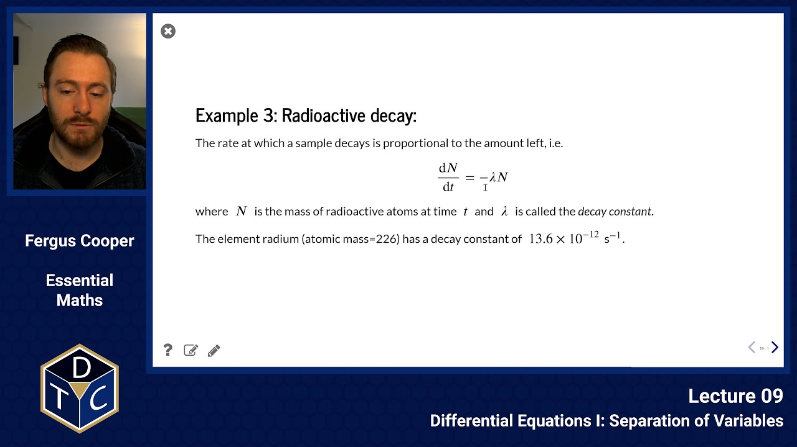
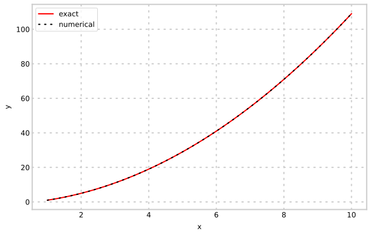
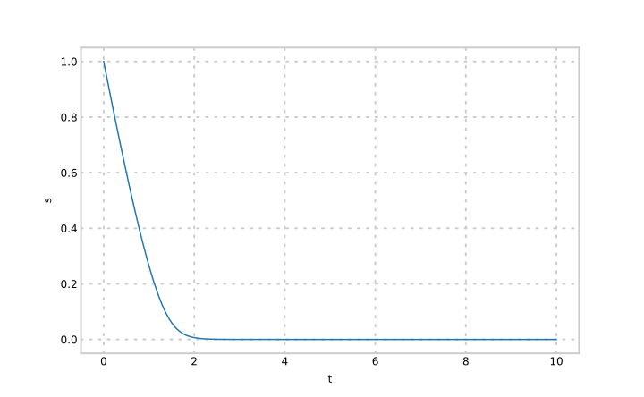
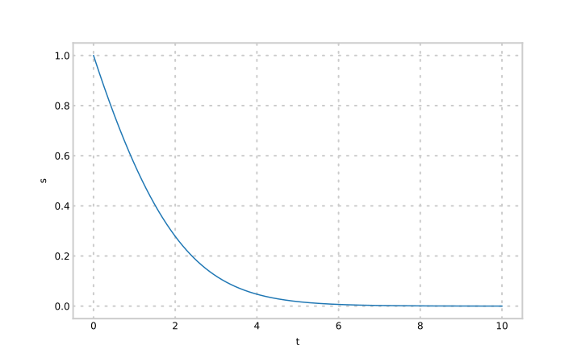
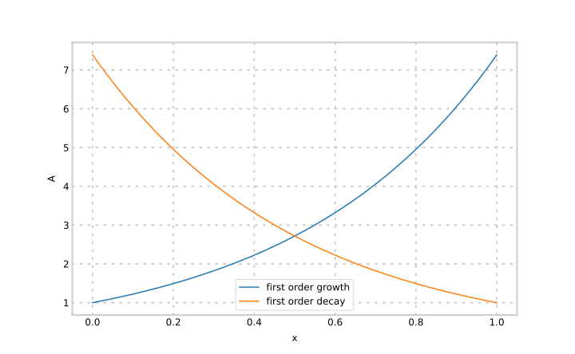

--- 

## YouTube lecture recording from October 2020

The following YouTube video was recorded for the 2020 iteration of the course.
The material is still very similar:

[](https://youtu.be/B8Kh7HzDYK0)

---

## Separation of Variables

## What is a Differential Equation?

If $y$ is a variable that depends on the variable $x$, then a **differential equation in $x$ and $y$** is one that relates $\displaystyle \frac{{\rm d}y}{{\rm d}x}$ to $x$, to $y$, or to both.

We write

> $$\displaystyle \frac{{\rm d}y}{{\rm d}x}=f(x,y).$$

## How do we Find the Solutions to a Differential Equation?

The simplest differential equations are very similar to integration.

> $$\displaystyle \frac{{\rm d}y}{{\rm d}x} = x^3 + 5x^2 + 1$$

Since all the terms in $y$ (just the derivative in this case) on the left, and all the terms involving $x$ on the right.

> $$\displaystyle {\rm d}y = (x^3 + 5x^2 + 1) ~{\rm d}x$$


Then we integrate both sides

> $$\displaystyle \int {\rm d}y = \int (x^3 + 5x^2 + 1) ~{\rm d}x$$


The general solution to this equation is

> $$\displaystyle y + A = \int x^3 + 5x^2 + 1\,{\rm d}x = {1\over 4}x^4 + {5\over 3}x^3 + x + B$$

where $A$ and $B$ are a arbitrary constants.

If we are given the **initial conditions**, say, $y=0$ when $x=0$ (often written as $y(0)=0$),
we can determine the value for the constants; in this example $A=B$.

---

This approach can be generalised into what is known as the **Separation of Variables Method**.

### Separation of variables: example 1

> $$\displaystyle {{\rm d}y\over {\rm d}x} = 2x + c$$

The equation is already separated, with all terms in $y$ (just the derivative in
this case) on the left, and terms involving $x$ on the right.


We then integrate both sides with respect to $x$:

> $$\displaystyle  \int \frac{{\rm d}y}{{\rm d}x}\,{\rm d}x = \int (2x + c)\, {\rm d}x $$

> $$\displaystyle y + k_1 = x^2 + cx + k_2$$

> $$\displaystyle y = x^2 + cx + A\qquad{\rm with}\qquad A=k_2-k_1$$

#### Initial conditions

> $$\displaystyle y = x^2 + cx + A$$

If we are told that $y(1) = c$, can we calculate $A$?

We have that

> $$\displaystyle y = x^2 + cx + A\;\qquad{\rm with}\qquad y(1) = c$$

so:

> $$\displaystyle c = 1^2 + c\cdot 1 + A$$

> $$\displaystyle A = -1$$

Is this right? Here's an example of how we can use SciPy's `odeint` method to numerically solve differential equations:

```python
c = 1.0
A = -1.0
x0 = 1.0
x1 = 10.0
x = np.linspace(x0,x1,100)
y_exact = x**2 + c*x + A

def dydx(y, x):
    return 2*x + c
y_numerical = scipy.integrate.odeint(dydx, c, x)
```




### Separation of variables: example 2

> $$\displaystyle {{\rm d}y\over {\rm d}x} = 5 x^{{3\over 2}} y $$

Separate the variables so that all the terms in $x$ are on one side of the equation and all the terms in $y$ are on the other side:

> $$\displaystyle {1\over y}\frac{{\rm d}y}{{\rm d}x} = 5 x^{{3\over 2}} $$

> $$\displaystyle {1\over y}\frac{{\rm d}y}{{\rm d}x} = 5 x^{{3\over 2}} $$

Integrating both sides with respect to $x$:

> $$\displaystyle \int {1\over y}\frac{{\rm d}y}{{\rm d}x}\, {\rm d}x = \int 5x^{{3\over 2}}\,{\rm d}x \quad \Rightarrow\quad \int {1\over y}\,{\rm d}y = \int 5x^{{3\over 2}}\, {\rm d}x$$

Now integrate on each side:

> $$\displaystyle {\ln y + A} = { 5x^{{5\over 2}}\over 5/2} + B = 2x^{{5\over 2}} + B$$

So:

> $$\displaystyle \ln y = 2x^{{5\over 2}} + C{\rm\quad where\quad}C=B-A$$

### Separation of variables: example 3

> $$\displaystyle e^x \frac{{\rm d}y}{{\rm d}x} = {x \over y}$$

Rearrange to get:

> $$\displaystyle \int y\,{\rm d}y = \int x e^{-x}\,{\rm d}x$$

We have

> $$\displaystyle \int y\,{\rm d}y = \int x e^{-x}\,{\rm d}x$$

Now integrate by parts, $\displaystyle\biggl(\int uv'\,{\rm d}x = [uv]-\int u'v\,{\rm d}x\biggr)$,

with $u=x$ and $v'=e^{-x}$:

$$
\begin{align*}
{y^2\over 2} + c_1 &= -x e ^{-x} + \int e ^{-x}\,{\rm d}x \\\\
&= -x e ^{-x} - e ^{-x} + c_2 \\\\
y^2 &= -2 e ^{-x}(1+x) + c_3 \\\\
y &= \pm\sqrt{-2 e^{-x} (1+x) + c_3}
\end{align*}
$$


Let's check this answer: $\displaystyle y = \pm\sqrt{-2 e^{-x} (1+x) + c_3}$.

Substitute in initial conditions $y(0) = 0$ gives $c_3 = 2$


```python
c3 = 2.0
x0 = 0.0
x1 = 1.0
x = np.linspace(x0,x1,100)

y_exact = np.sqrt(-2*np.exp(-x)*(1 + x) + c3)

def dydx(y, x):
    return np.exp(-x) * x / y

y_numerical = scipy.integrate.odeint(dydx, 1e-8, x) # why 1e-8 instead of zero?
```


### Real-world example 1: biochemistry

The Michaelis-Menten equation relates the rate of an enzyme reaction to its
substrate concentration, and has the form (if there is a large quantity of
enzyme):

> $$\displaystyle {{\rm d}s\over {\rm d}t}=-{V.s\over K+s}$$

where $s=[S]$ is the substrate concentration, and $V$ and $K$ are constants.
By integration, we will derive expressions relating substrate concentration to time when

1. when $s\gg K$
1. when $s\ll K$

and sketch the graphs of $\;s\;$ against $\;t\;$ in each case.

#### Case 1

When $s\gg K$, $K$ in the differential equation's denominator can be neglected:

> $$\displaystyle \frac{{\rm d}s}{{\rm d}t} \approx -{V.s\over s} = -V$$

The rate of change in concentration is a constant, so this is a **zeroth order process**.

We can integrate directly to obtain

> $$\displaystyle  s = \int -V\,{\rm d}t = -Vt + c$$

where $c$ is a constant of integration.

If $s(0)=s_0$, then $c=s_0$.

The graph thus has slope $-V$ and crosses the vertical axis at $s=s_0$.

#### Case 2

When $s\ll K$, $\;s\;$ in the differential equation's denominator can be neglected:

> $$\displaystyle \frac{{\rm d}s}{{\rm d}t} = -{V.s\over K+s}\quad{\rm~becomes:\quad}\frac{{\rm d}s}{{\rm d}t} = -{V.s\over K}$$

The rate of change in concentration depends on the concentration, so this is a **first order process**.

> $$\displaystyle \int {1\over s}\,{\rm d}s = -\int {V\over K}\,{\rm d}t$$

> $$\displaystyle \Rightarrow\quad\ln s = -{V\over K}t + D\qquad{\rm D~is~a~constant}$$

> $$\displaystyle \Rightarrow\quad s = Be^{-V t\over K}\qquad{\rm B~is~a~constant}$$

On a graph $\;s\;$ crosses the vertical axis at $\;s=B\;$ and decreases with time exponentially.

Lets look at this numerically using the original equation:

> $$\displaystyle {{\rm d}s\over {\rm d}t}=-{V.s\over K+s}$$

As $K$ changes in value, we can see how the behaviour of $s$ changes:

K=0.2:



K=1.0:




### Real-world example 2: bacterial growth

Suppose the growth rate of a bacterial colony is proportional to its size,
and that we observe that the colony triples in size after 10 hours.
How long will it take to reach 11 times its original size?

Let $\;N\;$ represent the number of bacteria, and suppose there are $\;N_0\;$ at time $\;t=0$.


We are given that when $\;t=10\;$ hours, $\;N=3N_0$, and need to find the time at which $\;N=11N_0\;$.
The equation of growth is:

> $$\displaystyle \frac{{\rm d}N}{{\rm d}t} = kN$$

We can solve this to obtain $\;\ln N = kt + c.\;$ Using the $\;t=0\;$ condition, we have that $\;\ln N_0 = c,\;$ so

> $$\displaystyle \ln{N\over N_0} = kt$$

We can use the data from $\;t=10\;$ to find $\;k:\;$

> $$\displaystyle \ln{3N_0\over N_0} = k 10 \qquad\Rightarrow\qquad k={\ln 3\over 10}=0.11{\rm~hr^{-1}}$$

To find $t$ when $N=11N_0$:

> $$\displaystyle \ln{11N_0\over N_0} = 0.11 t \qquad\Rightarrow\qquad t={\ln 11\over 0.11}=21.8{\rm~hours.}$$


### Real-world example 3: radioactive decay

The rate at which a sample decays is proportional to the amount left, i.e.

> $$\displaystyle \frac{{\rm d}N}{{\rm d}t} = -\lambda N$$

where $\;N\;$ is the mass of radioactive atoms at time $\;t\;$ and $\;\lambda\;$ is called the *decay constant*.

The element radium (atomic mass=226) has a decay constant of $\;13.6 \times 10^{-12}\;$s$^{-1}$.

Solving the differential equation via separation of variables, we obtain the general solution

> $$\displaystyle N = Be^{-\lambda t}  ~~~~~~~~(1)$$

Consider an arbitrary initial condition: at $\;t=t_0\;$, $\;N=N_0.\;$ Then:

> $$\displaystyle N_0 = Be^{-\lambda t_0} \qquad\Rightarrow\qquad B = N_0 e^{\lambda t_0}$$

Substituting in (1) gives the solution

> $$\displaystyle  N = N_0 e^{-\lambda(t-t_0)} ~~~~~~~~~(2)$$

The **half-life**, $\;t_{1\over 2},\;$ is the time taken for $\;N\;$ to reduce by half.

Putting $\;N=N_0/2\;$ and $\;t=t_0+t_{1\over 2}\;$ in (2) we get

> $$\displaystyle \ln {N_0\over2N_0} = -\lambda t_{1\over 2}$$

> $$\displaystyle t_{1\over 2} = {\ln 2\over\lambda} \approx {0.693\over\lambda}$$

Note that this time is **independent** of the initial value $N_0$,

The half-life for radium is thus $\;t_{1\over 2}={\ln2\over13.6\times10^{-12}}=5.10\times10^{10}\,s,\;$ or about 1600 years.


### Real-world example 4: more biochemistry

The power to which the concentration of a species is raised in a rate law
is the **order** of the process/reaction with respect to that species.
A reaction with the rate law

> $$\displaystyle \frac{{\rm d}X}{{\rm d}t} = k_2~[A]~[B]$$

is first order in $A$ and first order in $B$.

The **overall order** of a process/reaction is the sum of the orders of all the
components. This rate law is thus second-order overall.

Note that this is **different** from the order of an ODE, which is given by the
highest derivative.
Both zeroth and first order *processes* are modelled below by *first order
differential equations*.

#### (A) Zeroth order processes:

- rate of change is **independent** of concentration, i.e. the rate of change is proportional to concentration raised to power zero

> $$\displaystyle \frac{{\rm d}A}{{\rm d}t} = k \quad \text{(growth)}$$

> $$\displaystyle \frac{{\rm d}A}{{\rm d}t} = -k\quad \text{(decay)}$$

General solutions:

> $$\displaystyle A = A_0 + k(t-t_0)$$

> $$\displaystyle A = A_0 - k(t-t_0)$$

#### (B) First order processes:

The rate of change depends on the concentration of one species, i.e. the rate of change is proportional to concentration raised to first power.

Half-life is a constant, i.e. it is independent of the amount there at the beginning.

> $$\displaystyle \frac{{\rm d}A}{{\rm d}t} = kA\quad\text{growth}$$

> $$\displaystyle \frac{{\rm d}A}{{\rm d}t} = -kA\quad\text{decay}$$

General solutions:

> $$\displaystyle A = A_0 e^{k(t-t_0)}$$

> $$\displaystyle A = A_0 e^{-k(t-t_0)}$$

When $k=2.0$ the two different solutions look like this:




### Introductory problems

::::challenge{id="09_intro_01" title="Introductory problems 1"}
Find the general solutions of the following differential equations:

1. $\displaystyle \def\dd#1#2{{\frac{{\rm d}#1}{{\rm d}#2}}} \dd{y}{x} = x$
1. $\displaystyle \def\dd#1#2{{\frac{{\rm d}#1}{{\rm d}#2}}} \dd{r}{t} = -\sin(\pi t)$
1. $\displaystyle \def\dd#1#2{{\frac{{\rm d}#1}{{\rm d}#2}}} \dd{y}{x} = bx^2$
1. $\displaystyle \def\dd#1#2{{\frac{{\rm d}#1}{{\rm d}#2}}} (x-4)\dd{y}{x}=3y$
1. $\displaystyle \def\dd#1#2{{\frac{{\rm d}#1}{{\rm d}#2}}} u~\dd{u}{v}=v+6$
1. $\displaystyle \def\dd#1#2{{\frac{{\rm d}#1}{{\rm d}#2}}} 7e^x~\dd{y}{x}=\frac{x}{y}$

Check your answers by differentiating them.
::::

::::challenge{id="09_intro_02" title="Introductory problems 2"}
Find the solution to the following differential equations subject to the specified boundary conditions:

1. $\displaystyle \def\dd#1#2{{\frac{{\rm d}#1}{{\rm d}#2}}} \dd{y}{x} = \frac{1}{x}\quad{\rm with}\quad y(2)=0$
1. $\displaystyle \def\dd#1#2{{\frac{{\rm d}#1}{{\rm d}#2}}} \dd{y}{x} = y\quad{\rm with}\quad y(0) = 1$

Use Python's `scipy.integrate.odeint` to verify your solutions

```python
# hint
import numpy as np
from scipy.integrate import odeint
import matplotlib.pyplot as plt

# you need a function that calculates dy/dt
def dydx(y,x):
    return 1 / x

y0 = 0  # <-- the y-value of the initial condition
x0 = 2  # <-- the x-value of the initial condition

# the x-values at which to calculate the solution
x = np.linspace(x0, x0 + 10, 1000)

# solve ODE numerically
y = odeint(dydx, y0, x)

# plot the numerical solution and your hand-calculated
# solution, and check that they agree
```
::::


### Main problems

::::challenge{id="09_main_01" title="Main problems 1"}
The number of bacteria present in a given culture increases at a rate proportional to the number present.
When first observed, the culture contained $\displaystyle n_0$ bacteria, and two hours later it contained $\displaystyle n_1$.

1. Find the number present $\displaystyle t$ hours after observations began.
1. How long did it take for the number of bacteria to triple?
1. Sketch a curve of the solution to the equation that you derive.
1. What assumptions are implicit in this model of bacterial growth?
::::


::::challenge{id="09_main_02" title="Main problems 2"}
Solve:

1. $\displaystyle \def\dd#1#2{{\frac{{\rm d}#1}{{\rm d}#2}}} y^2\dd{y}{x} = \frac{2}{3}x \quad{\rm with}\quad y(\sqrt{2})=1$
1. $\displaystyle \def\dd#1#2{{\frac{{\rm d}#1}{{\rm d}#2}}} \dd{y}{x} = \frac{\beta}{x} \quad{\rm with}\quad y(1) = 0$. Find $\beta$ such that $\displaystyle y(e^3)=1.$
1. $\displaystyle \def\dd#1#2{{\frac{{\rm d}#1}{{\rm d}#2}}} \dd{y}{x} = a + bx + cx^2 + dx^3 + ex^4 \quad{\rm with}\quad y(0) = \pi$
::::

::::challenge{id="09_main_03" title="Main problems 3"}
In a certain chemical reaction, substance $\displaystyle A$ is transformed into product $\displaystyle P$.
The mass of $\displaystyle A$ at any given time, $\displaystyle t$, is $\displaystyle m_t$, and the rate of transformation of $\displaystyle A$ at time $\displaystyle t$ is proportional to $\displaystyle m_t$.
Given that the original mass of $\displaystyle A$ is 130g, and that 50g has been transformed after 150 seconds:

1. Form and solve the differential equation relating $\displaystyle m_t$ to $\displaystyle t$.
1. Find the mass of $\displaystyle A$ transformed over a 300s period.
1. Sketch a graph of $\displaystyle m_t$ versus $\displaystyle t$.
::::

::::challenge{id="09_main_04" title="Main problems 4"}
Newton's law of cooling states that the rate of decrease of the temperature of a body is proportional to the amount by which its temperature exceeds the temperature of its surroundings.
If $\displaystyle T_0$ is the initial temperature of a body, $\displaystyle T_s$ is the temperature of its surroundings, and $\displaystyle T$ is the temperature of the body at time $t$:

1. Form a differential equation for Newton's Law of cooling.
1. Show that $\displaystyle T-T_s = (T_0 - T_s) \, e^{-kt}$, where $\displaystyle k$ is a constant, and state the units of the constant $\displaystyle k$.
1. Glycerol is to be added to a protein sample prior to storage.
   The glycerol is heated to $\displaystyle 65^{\circ}{\rm C}$ to aid accurate pipetting.
   To avoid denaturation of the sample, the glycerol must then be allowed to cool to below $\displaystyle 29^{\circ}{\rm C}$ before being added to the protein.
   If the ambient temperature is $\displaystyle 22^{\circ}{\rm C}$, the glycerol cools to $\displaystyle T=59^{\circ}{\rm C}$ at time $\displaystyle t=2$ minutes.
   At what time can the glycerol be added to the protein?
1. Using a choice of axes that will allow you easily to predict the temperature of the glycerol, sketch a graph of the anticipated variation of the glycerol temperature with time.
1. Once the glycerol has been added to the protein, will the rate of cooling be described by the same constant $\displaystyle k$? Give reasons for your answer.
::::

::::challenge{id="09_main_05" title="Main problems 5"}
The amount of $^{14}{\rm C}$ (radioactive carbon-14) in a sample is measured using a Geiger counter, which records each disintegration of an atom.
The rate at which $^{14}{\rm C}$ decays is proportional to the amount present.
The half-life of $^{14}{\rm C}$ is about 5730 years.
This means that half of the sample will have disintegrated after 5730 years.

In living tissue, $^{14}{\rm C}$ disintegrates at a rate of about 13.5 atoms per minute per gram of carbon.
Because living tissue is constantly exchanging carbon with its environment, the proportion of $^{14}{\rm C}$ among its carbon atoms remains constant over time.
Once the tissue is no longer living, this constant exchange of carbon ceases and the fraction of $^{14}{\rm C}$ among its carbon atoms begins to get smaller.
Consequently, the disintegration rate drops.

In 1977 a charcoal fragment found at Stonehenge on the Salisbury Plain recorded 8.2 disintegrations per minute per gram of carbon: about 60% of that for living tissue.
Assuming that the charcoal was formed during the building of the site, use this information to estimate the date at which Stonehenge was built.
::::

### Extension problems

::::challenge{id="09_ext_01" title="Extension problems 1"}
The _absorbance_ $A$ of a solution is given by the equation:
$$A=\log_{10}\left(\frac{I_o}{I}\right)$$
where $I_o$ is the intensity of the light impinging on the solution (incident light) and $I$ is the intensity of the light emerging from it (transmitted light).
The Beer-Lambert law states that
$$A=\epsilon\cdot c\cdot l$$
where $\epsilon$ is the absorbance of the solute, $c$ is the concentration of the solute and $l$ is the distance that the light has travelled through the solution.


1. The _transmittance_ $\displaystyle T$ is defined as the fraction of incident light transmitted through the solution ($\displaystyle T={I\over I_o}$).
Derive an expression relating the transmittance, $T$, of the solution to $\epsilon$, $c$ and $l$.
1. The _attenuation_ $Q$ of the light beam is defined as the difference between the intensities of the incident and the transmitted light ($Q=I_o-I$).
Derive an expression for the attenuation of the light beam  when a beam of light intensity $I_o$ traverses a distance $l$ through a solution of fixed concentration $c$.
Sketch a graph showing the dependence of $Q$ on $l$ in a solution of fixed concentration.
1. ATP has a molar absorbtion of $\displaystyle 15.7\times 10^3\,{\rm M}^{-1}{\rm cm}^{-1}$.
Calculate the initial rate (in watts/cm) at which light intensity is attenuated when a light beam of intensity 200 watts enters a $\displaystyle 10\mu\,{\rm M}$ solution of ATP.
What would happen to this rate if
   i. the concentration of ATP is doubled;
   i. the intensity of the incident light is doubled;
   i. the length of the cell holding the solution is doubled?

::::
