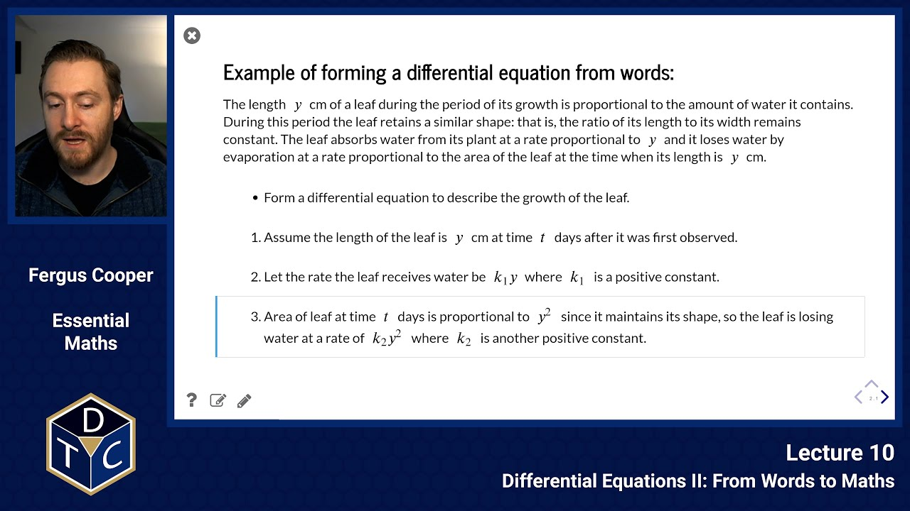
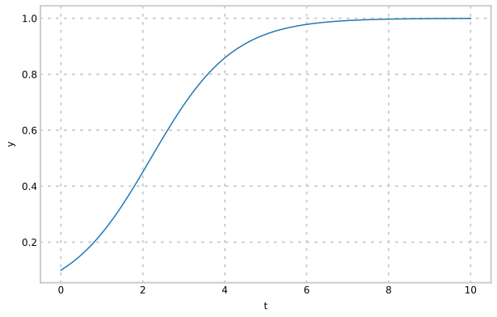
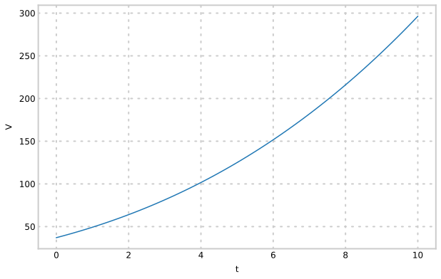

--- 

## YouTube lecture recording from October 2020

The following YouTube video was recorded for the 2020 iteration of the course.
The material is still very similar:

[](https://youtu.be/nU3SVyT3TY0)

---

## From Words to Maths

## How do we form differential equations from words?

### Example 1: a growing leaf

Let us try to form a differential equation based on the following information:

---

The length $\;y\;$ cm of a leaf during the period of its growth is proportional to the amount of water it contains.
During this period the leaf retains a similar shape: that is, the ratio of its length to its width remains constant.
The leaf absorbs water from its plant at a rate proportional to $\;y\;$ and it loses water by evaporation at a rate proportional to the area
of the leaf at the time when its length is $\;y\;$ cm.

---


1. Assume the length of the leaf is $\;y\;$ cm at time $\;t\;$ days after it was first observed.

2. Let the rate the leaf receives water be $\;k_1y\;$ where $\;k_1\;$ is a positive constant.

3. Area of leaf at time $\;t\;$ days is proportional to $\;y^2\;$ since it maintains its shape, so the leaf is losing water at a rate of $\;k_2y^2\;$ where $\;k_2\;$ is another positive constant.

The rate of growth is given by $\displaystyle{ {\rm d}y\over {\rm d}t}$, which is the rate of change of its length.

> $$\displaystyle{{\rm d}y\over {\rm d}t}=k_1y-k_2y^2=y(k_1-k_2y)$$

When $k_1$ and $k_2$ are both equal to $1.0$, the solution looks like:




## Example 2: solid tumour growth

---

An avascular tumour tends to grow in a spherical shape, depending on environmental restrictions.

Assuming that the growth rate of the tumour depends only on the availability of oxygen and nutrients, which enter the tumour solely by diffusing through its surface, derive a model for the change in tumour volume over time.

---

1. Denote the volume of the tumour at time $\;t\;$ by $\;V(t)\;$, and its radius by $\;R(t)$.

2. Since the tumour is a sphere, its volume $\;V\;$ is proportional to $\;R^3\;$ and its surface area to $\;R^2\;$, so the surface area is proportional to $\;V^{2/3}\;$.

3. The rate at which the tumour acquires nutrients, and hence the rate at which the volume increases, is thus proportional to $\;V^{2/3}$.


This gives us the equation:

> $$\displaystyle\frac{{\rm d}V}{{\rm d}t} = kV^{2/3}$$

> $$\displaystyle\frac{{\rm d}V}{{\rm d}t} = kV^{2/3}$$

Solve by separation of variables:

> $$\displaystyle\int V^{-2/3}~{\rm d}V = \int k~{\rm d}t$$

> $$\displaystyle V = \left({kt+c\over 3}\right)^3$$

where $c$ is a constant of integration, the value of which will depend upon the initial conditions.

When $k=1$ and $c=10$, the solution looks like:




## Second Order Differential Equations

Let us try to solve the following equation:

> $\displaystyle \frac{{\rm d}^2y}{{\rm d}x^2} = \left(\frac{{\rm d}y}{{\rm d}x}\right)^2$


We will use the substitution $\displaystyle z = \frac{{\rm d}y}{{\rm d}x}$.
This implies that $\displaystyle \frac{{\rm d}z}{{\rm d}x} = \frac{{\rm d}^2y}{{\rm d}x^2}$.


Substituting into the original equation, to eliminate $y$, gives

> $$\displaystyle \frac{{\rm d}z}{{\rm d}x} = z^2$$

This is a separable equation:

> $$\displaystyle \int z^{-2}~{\rm d}z = \int ~{\rm d}x \qquad\Rightarrow\qquad-{1\over z} = x + A \qquad\Rightarrow\qquad z = -{1\over x+A}$$

where $A$ is an arbitrary constant.

We can then replace $z$ using the original substitution to obtain a first order differential equation:

> $$\displaystyle \frac{{\rm d}y}{{\rm d}x} = -{1\over x+A}$$

This equation can be solved with a standard integral:

> $$\displaystyle y = -\ln(x+A) + B$$

Determining the values of $A$ and $B$ can be done in several different ways, depending on the kind of information we have.

---

For example, if we know the following:

1. At $\;x=0,\;$ $\;\displaystyle \frac{{\rm d}y}{{\rm d}x} = -1\;$ and $\;y=0\;$.

    We substitute the first condition into $\displaystyle \frac{{\rm d}y}{{\rm d}x} = -{1\over x+A}$ to obtain $\;A=1\;$.
    
    Then substitute $A$ and the second condition into the eventual solution
    to find $\;B=0$.

---

Alternatively, if we instead know that:

2. $\;y(0)=0\;$ and $\;y(e-1)=-1$.

    This time both conditions can be substituted into the solution:
    
    > $$\displaystyle y(0)=0 \Rightarrow 0=B-\ln(A) \Rightarrow B=\ln(A)$$
    
    > $$\displaystyle y(e-1)=-1 \Rightarrow -1=\ln(A)-\ln{e-1+A} \Rightarrow A=1$$


## More integration tricks

Let us return to, and solve, our leaf example:

> $$\displaystyle {{\rm d}y\over {\rm d}t}=k_1y-k_2y^2=y(k_1-k_2y)$$

This is a separable differential equation:

> $$\displaystyle \int {{\rm d}y\over y(k_1-k_2y)} =\int {\rm d}t.\;$$

We can split apart the integral on the RHS using **partial fractions** in SymPy using `sp.apart`.

We want $\displaystyle \qquad{1\over y(k_1-k_2y)}={A\over y}+{B\over (k_1-k_2y)}$:


```python
y, k1, k2 = sp.symbols('y k_1 k_2')
sp.apart(1 / (y*(k1 - k2*y)),y)
```
> $\displaystyle - \frac{k_{2}}{k_{1} \left(- k_{1} + k_{2} y\right)} + \frac{1}{k_{1} y}$


So $\displaystyle A={1\over k_1}$ and $B={k_2\over k_1}$.

$$\displaystyle {\rm~Thus,~~~~}\int {{\rm d}y\over y(k_1-k_2y)}=\int {{\rm d}y\over k_1y}+\int {k_2\over k_1(k_1-k_2y)}{\rm d}y =\int dt$$

> $$\displaystyle {\rm~Thus~~~~~~ }{1\over k_1}\ln y-{k_2\over k_1k_2}\ln(k_1-k_2y)=t + c$$

We can get $c$ from initial conditions.
Try doing the algebraic manipulation of this to make $y$ the subject of the equation:

> $$\displaystyle y={k_1\exp (k_1t+d)\over 1+ k_2 \exp(k_1t + d)}$$

where $d$ is a constant.


### Introductory problems

::::challenge{id="10_intro_01" title="Introductory problems 1"}
Find the general solutions of the following differential equations:

1. $\displaystyle \def\dd#1#2{{\frac{{\rm d}#1}{{\rm d}#2}}} \dd{y}{x} = x^2 + e^x$
1. $\displaystyle \def\dd#1#2{{\frac{{\rm d}#1}{{\rm d}#2}}} \dd{y}{x} = \frac{y^2}{x}$
1. $\displaystyle \def\dd#1#2{{\frac{{\rm d}#1}{{\rm d}#2}}} \frac{1}{x}\dd{y}{x} = e^{4x}$
1. $\displaystyle \def\dd#1#2{{\frac{{\rm d}#1}{{\rm d}#2}}} \dd{y}{x} = -2xy$

Check your answers by differentiating them.
::::


### Main problems

::::challenge{id="10_main_01" title="Main problems 1"}
A circular patch of oil on the surface of some water has a radius $r$ metres at time $t$ minutes.
When $t=0$ minutes, $r=1\,$m and when $t=10$ minutes, $r=2\,$m.

1. Predict the value $T$ of $t$ when $r=4\,$m, using a simple model in which the rate of increase of $r$ is taken to be constant.
Find $T$ for this model.
1. In a more refined model, the rate of increase of $r$ is taken to be proportional to $1/r$.
Express this statement as a differential equation, and find the general solution.
Find $T$ for this model.
1. Compare the two models used in 1. and 2., by sketching $r(t)$ on the same figure or plotting using Python.
Comment on the differences seen during different time intervals.
::::


::::challenge{id="10_main_02" title="Main problems 2"}
A nuclear installation local to Oxford 'lost' 17g of Cobalt-60 between two inspections 6 months apart.
A spokesperson told a newspaper reporter that the loss was due to 'natural radioactive decay' during that period.

If this explanation was correct, what mass of Cobalt was stored on the site?
(The half life of $^{60}$Co = $5.26$ years.)
::::


::::challenge{id="10_main_03" title="Main problems 3"}
By making a substitution $\displaystyle \def\dd#1#2{{\frac{{\rm d}#1}{{\rm d}#2}}} z = \dd{y}{x}$, solve the equation

> $$\displaystyle \def\d#1{{\rm d}#1} \def\ddd#1#2{{{{\rm d}^2#1}\over{\d{#2}^2}}} \def\dd#1#2{{\frac{{\rm d}#1}{{\rm d}#2}}} \ddd{y}{x} = (1-3x^2)\left(\dd{y}{x}\right)^2\quad{\rm with}\quad y(2) = 0\quad{\rm and}\quad y'(2) = 1/6.$$

Hint: you will need to use partial fractions for part of this question, to break up

> $$\displaystyle\frac{1}{x^3-x} = \frac{-1}{x} + \frac{1/2}{x+1} + \frac{1/2}{x-1}.$$

::::


::::challenge{id="10_main_04" title="Main problems 4"}
Suppose a cell contains a chemical (the solute) dissolved in it at a concentration of $\displaystyle c(t)$, and the concentration of the same substance outside the cell is a constant $k$.
By Fick's law, if $\displaystyle c(t)$ and $k$ are unequal, solute moves across the cell wall at a rate proportional to the difference between $\displaystyle c(t)$ and $k$, towards the region of lower concentration.

1. Write down a differential equation which is satisfied by $\displaystyle c(t)$.
1. Solve this differential equation with the initial condition $\displaystyle c(0)=c_0$.
1. Sketch the solutions for  $\displaystyle c_0 > k$  and  $\displaystyle k > c_0$.
1. Blood glucose concentration is 5.1 mM and the concentration inside the cell is at 0.1 mM.
If glucose utilisation within the cell is totally inhibited, it takes 1 min for the intracellular concentration to reach 2.6 mM.
How long would it take for the concentration to reach 5.0 mM?
1. Calculate the amount of glucose (moles) entering the cell to bring the concentration from 0.1 mM to 5 mM assuming the cell is spherical with a diameter of $10\,\mu$m.
::::

### Extension problems

::::challenge{id="10_ext_01" title="Extension problems 1"}
Consider a simple model of the production and degradation of a protein, shown by the reaction chain

> $$\stackrel{k_1}{\longrightarrow} S \stackrel{k_2}{\longrightarrow}$$

where $k_1$ and $k_2$ are mass action coefficients.

1. Form and solve a differential equation describing the change in protein concentration.
1. What concentration is reached after 'sufficient' time has elapsed?
::::
