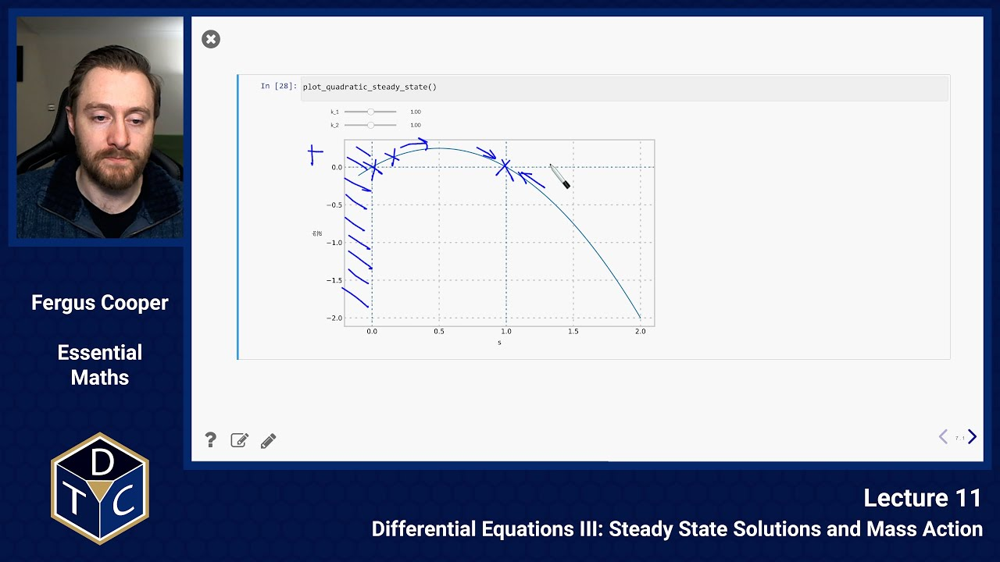
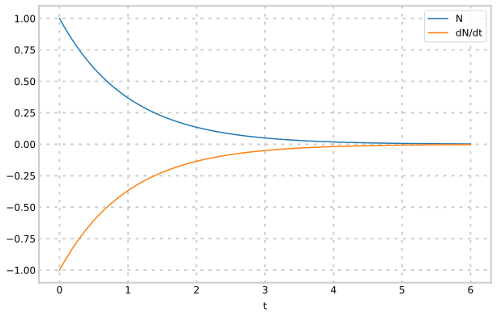
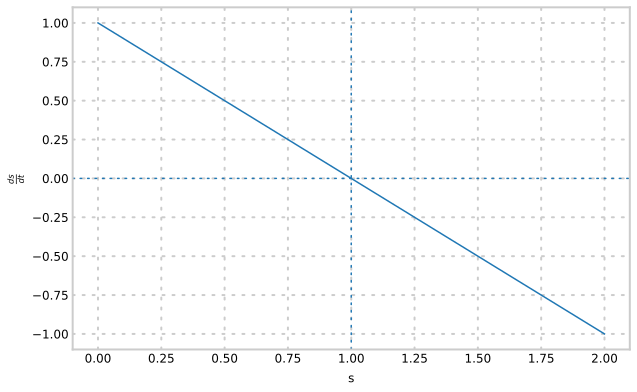
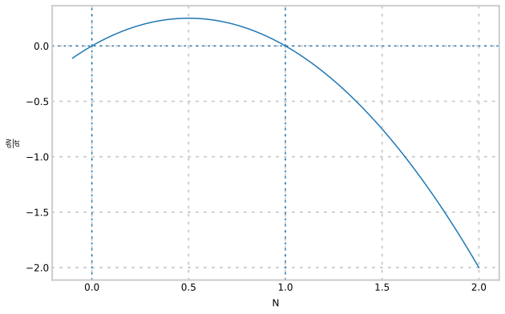

## Steady State Solutions and Mass Action

---

## YouTube lecture recording from October 2020

The following YouTube video was recorded for the 2020 iteration of the course.
The material is still very similar:

---

## Steady-state solutions

- It is often useful to find the **steady state** of a system described by ordinary differential equations

- This occurs when all rates (i.e. derivatives) are zero

- A steady state may be **stable** or **unstable**, depending on whether or not small deviations from the steady state tend to be corrected or amplified

- We can evaluate the stability of a steady state by considering the sign of the derivative nearby

### Example 1: radioactive decay

Recall the radioactive decay equation $\displaystyle \frac{{\rm d}N}{{\rm d}t} = -\lambda N.$

Let us examine a plot of the solution, $N$, and the gradient $\displaystyle \frac{{\rm d}N}{{\rm d}t}$ as functions of time:

- Here the steady state occurs when $N=0$, and is 'reached' after infinite time.

- For small positive $N$ the derivative $\;\displaystyle \frac{{\rm d}N}{{\rm d}t}\;$ is negative, moving the system towards the steady state.

- Physical considerations show that negative $N$ is impossible, hence the steady state is stable as we would expect.

### Example 2: production and degradation of a protein

Consider a simple model of the production and degradation of a protein, shown by the reaction chain $\;\;\overset{v_1}{\rightarrow}S\overset{v_2}{\rightarrow}\;\;$ where $\;v_1\;$ and $\;v_2\;$ are reaction rates, and let $\;s=[S]$.

We can represent the change in concentration of the protein by

> $$\displaystyle \frac{{\rm d}s}{{\rm d}t} = v_1 - v_2 $$

so the steady state occurs when $\;v_1 = v_2$.

## Mass action

Consider, again, the reaction chain:

> $$\displaystyle \;\;\overset{v_1}{\rightarrow}S\overset{v_2}{\rightarrow}\;\;$$

Suppose the reaction is governed by ["mass action" kinetics](https://en.wikipedia.org/wiki/Law_of_mass_action), so $\;v_1=k_1\;$ (constant) and $\;v_2=k_2 s$.

The equation is then

> $$\displaystyle \frac{{\rm d}s}{{\rm d}t} = k_1 - k_2 s.$$

The steady state is given by $s = k_1/k_2$, and it is stable:

We can see that it is stable by examining the graph:

- If we move to the left of $s=1$, the gradient is positive, so we move back towards $s=1$

- If we move to the right of $s=1$, the gradient is negative, so we, again, move back towards $s=1$

---

We can solve the differential equation by separation of variables.

> $$\displaystyle  \int {1\over k_1 - k_2 s}~{\rm d}s = \int~{\rm d}t $$
> $$\displaystyle s(t) = Be^{-k_2 t} + {k_1\over k_2} $$

Thus, the concentration of $S$ relaxes exponentially to the steady state, no matter the initial condition.

If the initial concentration of $S$ is given by $s_0$ then

> $$\displaystyle  s(t) = s_0 e^{-k_2 t} + {k_1\over k_2}\left(1-e^{-k_2 t}\right) $$

---

To understand different possibilities for these steady states, let us suppose instead that $S$ enhances its own production (positive feedback) and the degradation rate is nonlinear.

If we were to have the following form for $v_1$ and $v_2$:

- $v_1=k_1 s$
- $v_2=k_2 s^2$

then:

> $$\displaystyle \frac{{\rm d}s}{{\rm d}t} = k_1s - k_2 s^2$$

This system will be at steady state when $\displaystyle k_1 s = k_2 s^2$, i.e.

- $s=0$ or
- $s=k_1/k_2$

We can plot $\;\displaystyle \frac{{\rm d}s}{{\rm d}t}\;$ versus $\;s\;$ to see if they are stable or unstable.
Here, $k_1 = k_2 = 1$:

- The local behaviour near the fixed point as $s=1$ is the same as in the previous plot, so we can immediately see that it is a stable steady state
- The local behaviour near the fixed point at $s=0$ is the opposite: moving one way or the other, the gradient will take $s$ even further away

## Non-graphical method

Let us investigate this same behaviour in a more rigorous manner.

> $$\displaystyle \frac{{\rm d}s}{{\rm d}t} = k_1s - k_2 s^2$$

- When $s$ is small (and positive, since it is a concentration) $s\gg s^2$ so the derivative $k_1 s - k_2 s^2$ will be positive, making $s=0$ an unstable steady state.

- For the other steady state, consider small deviations by $\varepsilon$ from the steady state, e.g. $s=k_1/k_2 + \varepsilon$.

Then:

> $\displaystyle s^2=\frac{k_1^2}{k_2^2} + 2 \varepsilon\frac{k_1}{k_2} + \varepsilon^2\;$

The derivative (after substituting $s$ and $s^2$ into the original differential equation) is:

> $\displaystyle \frac{{\rm d}s}{{\rm d}t} = - k_1\varepsilon - k_2\varepsilon^2$.

It is, since $\varepsilon\gg\varepsilon^2$, negative, pushing $s$ back towards the steady state, hence it is a stable steady state.

## Example: the logistic equation

The growth of a cell colony can be modelled by the _logistic_ equation

> $$\displaystyle \frac{{\rm d}N}{{\rm d}t} = rN\left(1 - {N\over K}\right) $$

where $\displaystyle \;N(t)\;$ is the number of cells at time $\;t,\;$ and $\;r\;$ and $\;K\;$ are constant parameters (both positive).

The steady state for the system, or equilibrium population size, occurs when the growth rate is zero, i.e.

> $$\displaystyle \frac{{\rm d}N}{{\rm d}t} = 0 \quad\Rightarrow\quad rN = {r\over K}N^2 \quad\Rightarrow\quad N = 0 {\rm~or~} N = K.$$

Here is a plot, for $r=K=1$:

- for small positive $N$, $rN>0$ and $N<K$ so $\displaystyle \frac{{\rm d}N}{{\rm d}t}>0$ and the population
  size will increase, meaning that $N=0$ is an unstable steady state.

- In fact the growth rate is positive for $0<N<K$ and negative for $N>K$, making
  $N=K$ a stable steady state.

We can solve the differential equation to examine the transient behaviour.
This is a separable equation, so

> $$ \int {1\over rKN-rN^2}~{\rm d}N = \int {1\over K}~{\rm d}t $$

This can be solved using partial fractions on the left hand side:

- With initial conditions $N(0)=N_0$ you get

  > $$\displaystyle  N(t) = {K N_0 e^{rt}\over K + N_0(e^{rt}-1)} $$

## Summary of first order differential equations

To solve a differential equation:

1. Calculate the general solution
   1. Try to write it as a separable equation first
   2. Other methods (e.g. integrating factors) not covered in this course
2. This general solution will include an arbitrary constant this may be eliminated using initial conditions (if these are given)
3. Can check your solution numerically using Python

To find steady state (equilibrium) solutions, find points where all (first) derivatives are zero.

To determine stability of these steady states, look at the behaviour of the first derivative in the vicinity of the steady state.
You can sketch the first derivative, or use Python to help with this.

---

## Chemical reactions to equations: mass action

Under the law of mass action, we assume the following:

- that chemical reactions have uniform mixing

- that rates are proportional to the product of the masses of the reactants

- that predator/prey interactions, and epidemics, have similar rules

---

Let us look at some examples:

1. A and B produce C. The reaction is governed by A meeting B:

   $$
   \displaystyle A+B\underset{^k}{\rightarrow} C
   $$

   Then we get the following differential equations:

   > $$\displaystyle \frac{{\rm d}[A]}{{\rm d}t} = -k[A] [B]$$ > $$\displaystyle \frac{{\rm d}[B]}{{\rm d}t} = -k[A] [B]$$ > $$\displaystyle \frac{{\rm d}[C]}{{\rm d}t} = k[A] [B]$$

2. Predation of R by W

   > $$\displaystyle R+W\underset{^k}{\rightarrow} W$$

   Gives the following differential equation:

   > $$\displaystyle \frac{{\rm d}R}{{\rm d}t} = -kRW$$

3. Constant production (zeroth order)

   > $$\displaystyle 0 \underset{^k}{\rightarrow} A$$

   Gives the following differential equation:

   > $$\displaystyle \frac{{\rm d}[A]}{{\rm d}t} = k$$

4. Degradation/death

   > $$\displaystyle C \underset{^k}{\rightarrow} 0$$

   Gives the following differential equation:

   > $$\displaystyle \frac{{\rm d}[C]}{{\rm d}t} = -k[C]$$

## Numerically solving differential equations

What if we can't solve the differential equation (or don't want to)?

> $$\displaystyle  \frac{{\rm d}y}{{\rm d}t} = \sin\left(\frac{y\ln(t\cos(y))}{\sqrt{1+y/e^t}}\right) + 3$$

### Euler's method

Given a differential equation

> $$\displaystyle  \frac{{\rm d}y}{{\rm d}t} = f(y, t)$$

with initial state $\;y(t = t_0) = y_0,\;$ we can _approximate_ the state at $t = t_0 + \delta{t}$ as:

> $$\displaystyle  y_1 = y(t + \delta{t}) \approx y_0 + f(y, t) \cdot \delta{t}$$

and the next state as

> $$\displaystyle  y_2 = y(t + 2\delta{t}) \approx y_1 + f(y, t) \cdot \delta{t}$$

and so on!

This mean's we can estimate the _entire time course of $y(t)$_, provided:

1. We can calculate $f(y, t)$ (or approximate it with a computer)
2. We're patient enough to take really tiny steps $\delta{t}$

We have already seen examples of this, using SciPy's ODEInt function, although this uses more sophisticated methods than the one described here.

### Introductory problems

::::challenge{id="11_intro_01" title="Introductory problems 1"}
Determine the steady states are their stabilities, for each of the following:

1. $\displaystyle \def\dd#1#2{{\frac{{\rm d}#1}{{\rm d}#2}}} \dd{x}{t} = x(a-x)$, where $a$ is a positive constant
1. $\displaystyle \def\dd#1#2{{\frac{{\rm d}#1}{{\rm d}#2}}} \dd{x}{t} = x^{2}-4x+3$
1. $\displaystyle \def\dd#1#2{{\frac{{\rm d}#1}{{\rm d}#2}}} \dd{x}{t} = e^{x}(x^{2}-1)$
1. $\displaystyle \def\dd#1#2{{\frac{{\rm d}#1}{{\rm d}#2}}} \dd{N}{t} = \displaystyle r_{0}N\left(1-\frac{N}{K}\right)$, where $r_{0}<0$ and $r_{0},\;K$ are constants
1. $\displaystyle \def\dd#1#2{{\frac{{\rm d}#1}{{\rm d}#2}}} \dd{x}{t} = \displaystyle \frac{Ax}{h+x}$, where $A$ and $h$ are negative constants

::::

### Main problems

::::challenge{id="11_main_01" title="Main problems 1"}
Not all chemical systems relax exponentially to steady state.
Consider the bimolecular decay reaction

> $$\displaystyle A + A \stackrel{k}{\longrightarrow}$$

Assuming $k$ is a mass action constant, form and solve a differential equation representing the change in concentration of $A$.

If $a(0)=a_0$ you should get $\displaystyle \quad a(t) = \frac{1}{2kt + \frac{1}{a_0}}.$
::::

::::challenge{id="11_main_02" title="Main problems 2"}
The $SIS$ model is an appropriate model for diseases that mutate quickly and can therefore infect people multiple times, such as the common cold or sexually transmitted infections like gonorrhea and chlamydia.

In the model, individuals are 'susceptible' until they are 'infected', and then they return to being 'susceptible' again.
Infection requires the interaction of susceptible individuals with infected individuals and therefore follows the law of mass action, whereas the rate at which an individual becomes susceptible again after infection is constant.

1. Let $S$ and $I$ be the proportions of the population that are susceptible and infected.
   If infection happens at rate $\beta$ and recovery happens at rate $\gamma$, write down differential equations for $S$ and $I$.
1. Noting that $S$ and $I$ are proportions of the population, which is assumed constant, reduce the system to a single differential equation in terms of $I$.
   In other words, write down a single equation, involving just $I$ and its derivative.
1. Find both steady states of $I$. Under what conditions on $\beta$ and $\gamma$ are each attainable?
1. Without solving the differential equation, sketch the behaviour of $S$ and $I$ over time, starting with a small quantity of infected individuals.
   Illustrate how both steady states may be achieved.

::::

::::challenge{id="11_main_03" title="Main problems 3"}
Consider a closed reaction system consisting of a single reversible reaction:

$$
A \underset{k_b}{\overset{k_f}{\rightleftharpoons}} B
$$

where $k_f$ and $k_b$ are mass action coefficients.

1. Formulate a pair of coupled differential equations for the change in concentration of $A$ and $B$.
1. Noting that the total concentration $T$ of reactants is constant ($T = [A] + [B]$), reduce the system of equations to a single differential equation.
   In other words, write down a single equation, involving either just $A$ and its derivative, or just $B$ and its derivative.
1. Find the steady-state concentrations of $A$ and $B$.
1. Solve the single differential equation to reveal the transient behaviour.
   Sketch the behaviour for different illustrative initial conditions.

::::

::::challenge{id="11_main_04" title="Main problems 4"}
Consider the simple model

$$
\def\dd#1#2{{\frac{{\rm d}#1}{{\rm d}#2}}} \dd{s}{t} = k - {V_{\rm max}s\over K_M + s}
$$

in which species $s$ is produced at a fixed rate and consumed via Michaelis-Menten kinetics.
Find the steady state of $s$, and verify that it is stable for any non-negative parameter values, provided $\displaystyle V_{\rm max} > k$.
::::

::::challenge{id="11_main_05" title="Main problems 5"}
Recall the simple model of the production and degradation of a protein from the lecture, shown by the reaction chain

$$
\overset{v_1}{\longrightarrow} S \overset{v_2}{\longrightarrow}
$$

where $v_1$ and $v_2$ are reaction rates rather than mass action coefficients.

1. Suppose $v_1 = k_1$ and $v_2 = k_2$.
   Write down a differential equation describing the rate of change of S, and find the steady state concentration of S in terms of the two parameters $k_1$ and $k_2$ (i.e. the concentration at which the rate of change is zero).
   At what rate is S being produced in steady state?
1. Now suppose that
   $$
   v_1 = k_0 + {k_1 s^2\over k_2+s^2} \quad\text{and}\quad v_2 = k_3 s
   $$
   and take the parameter values to be $\displaystyle k_0=6/11,\;k_1=60/11,\;k_2=11,\;k_3=1$.
   Determine the number of steady states and the type of each.

::::

### Extension problems

::::challenge{id="11_ext_01" title="Extension problems 1"}
Various mathematical models have been proposed for the initial growth of solid tumours, and some are summarised in [_The Model Muddle: In Search of Tumor Growth Laws_](https://doi.org/10.1158/0008-5472.can-12-4355).
They are differential equations describing the rate of change of tumour volume $V$ as a function of time $t$, for example:

1. $\displaystyle \def\dd#1#2{{\frac{{\rm d}#1}{{\rm d}#2}}} \dd{V(t)}{t} = rV(t)$

1. $\displaystyle \def\dd#1#2{{\frac{{\rm d}#1}{{\rm d}#2}}} \dd{V(t)}{t} = rV(t)^b$

1. $\displaystyle \def\dd#1#2{{\frac{{\rm d}#1}{{\rm d}#2}}} \dd{V(t)}{t} = r_0 e^{-\rho t}V(t)$

Solve each equation both analytically and numerically, using Python.
As was done in Figure 1A in the paper, compare the behaviours of the different growth laws over a suitable time interval for an initially small tumour, again using Python.
::::

::::challenge{id="11_ext_02" title="Extension problems 2"}
Find the solution to the following differential equations subject to the specified boundary conditions, using integrating factors:

1. $\displaystyle \def\dd#1#2{{\frac{{\rm d}#1}{{\rm d}#2}}} \dd{y}{x} + {y\over x} = 0 \quad\text{with}\quad y(2)=2 \quad\text{for}\quad x>0$
1. $\displaystyle \def\dd#1#2{{\frac{{\rm d}#1}{{\rm d}#2}}} \dd{y}{x} + (2x-1)y = 0 \quad\text{with}\quad y(1)=2$
1. $\displaystyle \def\dd#1#2{{\frac{{\rm d}#1}{{\rm d}#2}}} x^3\,\dd{y}{x} + 2y = e^{1/x^2} \quad\text{with}\quad y(1)=e$
1. $\displaystyle \def\dd#1#2{{\frac{{\rm d}#1}{{\rm d}#2}}} \sec(x)\,\dd{y}{x} + y = 1 \quad\text{with}\quad y(0) = 1$
1. $\displaystyle \def\dd#1#2{{\frac{{\rm d}#1}{{\rm d}#2}}} \dd{y}{x} + y\tan(x) = \cos(x) \quad\text{with}\quad y(0)=1 \quad\text{for}\quad 0 \le x < \frac{\pi}{2}$

::::

::::challenge{id="11_ext_03" title="Extension problems 3"}
Consider the second order differential equation

$$
\def\ddd#1#2{{{{\rm d}^2#1}\over{\d{#2}^2}}} \def\d#1{{\rm d}#1} \ddd{y}{x} + y = 0
$$

Show that $\displaystyle y = Ae^{z_1 x} + Be^{z_2 x}$ is a solution to this equation for some complex numbers $z_1$, $z_2$ and real constants $A$, $B$.

1. Recalling that any complex number $z$ can be written as $\displaystyle z = re^{i\theta} = r(\cos\theta + i\sin\theta)$, what does this tell you about the nature of the solution?
1. If $y(0)=1$ and $y(\pi/2)=2$ what is the particular solution of the differential equation?

::::
