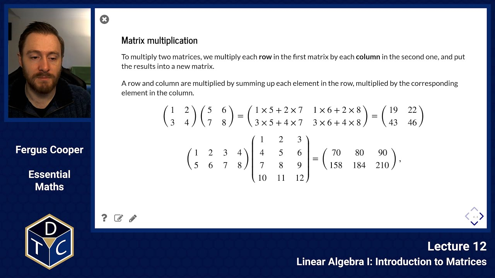

## Introduction to Matrices

---

## YouTube lecture recording from October 2020

The following YouTube video was recorded for the 2020 iteration of the course.
The material is still very similar:

[](https://youtu.be/L2K3dnZ8Mk8)

---

## Simultaneous equations

Consider 2 simultaneous equations:

$$
\begin{align*}
a_1x+b_1y &= c_1, \qquad \qquad (1)\\
a_2x+b_2y &= c_2, \qquad \qquad (2)
\end{align*}
$$

where the values $\;x\;$ and $\;y\;$ are to be found, and $\;a_1, \;b_1, \;a_2, \;b_2, \;c_1\;$ and $\;c_2\;$ are given constants.

$$
\begin{align*}
(1) \times b_2:~~~~~~~~~~~~~~~ b_2a_1x+b_2b_1y &= b_2c_1, \qquad \qquad (3)\\
(2) \times b_1:~~~~~~~~~~~~~~~ b_1a_2x+b_1b_2y &= b_1c_2, \qquad \qquad (4)\\
(3) - (4):~~~~~~~~~~~~~~~ b_2a_1x-b_1a_2x &= b_2c_1-b_1c_2.
\end{align*}
$$

Thus:

> $$\displaystyle x=\frac{b_2c_1-b_1c_2}{b_2a_1-b_1a_2},$$

and similarly:

> $$\displaystyle y=\frac{a_1c_2-a_2c_1}{a_1b_2-a_2b_1}.$$

This works, provided that $a_1b_2-a_2b_1\neq 0.$

While the algebraic manipulation is straightforward when solving two equations, it can get really messy when solving large systems.

What we want is a way to be able to easily manipulate **linear** systems, regardless of how big they are.

## The matrix

Matrices are a structure that allow us to more easily manipulate linear systems.

Consider the original system

$$
\begin{align*}
a_1x+b_1y &= c_1, \\
a_2x+b_2y &= c_2.
\end{align*}
$$

We rewrite this, in the form of a matrix as:

$$
\begin{equation*}
\left(\begin{matrix}a_1&b_1\\ a_2&b_2\end{matrix}\right)
\left(\begin{matrix}x\\y\end{matrix}\right)
=\left(\begin{matrix}c_1\\ c_2 \end{matrix}\right).
\end{equation*}
$$

Think about how this form relates to the original linear system.

### What is a matrix?

A matrix is an array of numbers such as:

$$
\left(\begin{matrix}a&b&c\\ d&e&f\\ g&h&i\end{matrix}\right)
$$

- $3\times3$ is the **size** of the matrix.

- A $3\times3$ matrix is said to be **square** and have **order** (dimension) 3.

### Addition, subtraction, and scalar multiplication

We can add or subtract two matrices as long as they have the **same** size:

$$
\left(\begin{matrix} 2&1  \\ 3&-4 \end{matrix}\right) +\left(\begin{matrix} 6&-5 \\ 1&-7 \end{matrix}\right)= \left(\begin{matrix} 8&-4 \\ 4&-11\end{matrix}\right)
$$

We can multiply a matrix by a scalar, by multiplying every element:

$$
5\times\left(\begin{matrix} 2&1\\ 3&-4 \end{matrix}\right)=\left(\begin{matrix}10&5\\ 15&-20\end{matrix}\right)
$$

### Matrix multiplication

To multiply two matrices, we multiply each **row** in the first matrix by each **column** in the second one, and put the results into a new matrix.

A row and column are multiplied by summing up each element in the row, multiplied by the corresponding element in the column.

$$
\left(\begin{matrix} 1&2 \\ 3&4 \end{matrix}\right) \left(\begin{matrix} 5&6\\7&8\end{matrix}\right) = \left(\begin{matrix} 1 \times 5 + 2 \times 7 & 1 \times 6 + 2 \times 8 \\ 3 \times 5 + 4 \times 7 & 3 \times 6 + 4\times 8\end{matrix}\right) = \left(\begin{matrix} 19&22\\43&46\end{matrix}\right)
$$

$$
\left(\begin{matrix} 1&2&3&4\\ 5&6&7&8                \end{matrix}\right) \left(\begin{matrix} 1&2&3\\ 4&5&6\\ 7&8&9\\ 10&11&12 \end{matrix}\right) =   \left(\begin{matrix} 70&80&90\\ 158&184&210            \end{matrix}\right)
$$

$$
\left(\begin{matrix} a & b & c                \end{matrix}\right)
\left(\begin{matrix} p & q  \\ r & s \\ v & w \end{matrix}\right)
= \left(\begin{matrix} ap+br+cv & aq+bs+cw \end{matrix}\right).
$$

If the number of **columns** in the first matrix doesn't match the number of **rows** in the second, they **cannot** be multiplied.

$$
\left(\begin{matrix} 2 & 3 & 1 \\ 2 & -1 & 3\end{matrix}\right)\left(\begin{matrix} 1 & 0 \\ -1 & -4\end{matrix}\right) =\;?\;?\;?
$$

### Matrix multiplication is not commutative

This means that $A \times B$ is not the same as $B \times A$.
This can be easily seen from the fact that multiplying different sized matrices doesn't always work:

> $(3 x 2 \rm{matrix}) \times (2 x 2 \rm{matrix}) = (3 x 2 \rm{matrix})$ > $(2 x 2 \rm{matrix}) \times (3 x 2 \rm{matrix}) = ???$

However, even when sizes match, the product is usually not the same.

### The identity matrix

$I$ is the identity matrix, which has the property that:

> $A I = I A = A$

for a square matrix $A$. It is the matrix equivalent of multiplying by 1.

The 2x2 identity matrix is:

> $$I_2 = \left(\begin{matrix} 1 & 0 \\ 0 & 1 \end{matrix}\right).$$

The 3x3 identity matrix is:

> $$I_3 = \left(\begin{matrix} 1 & 0 & 0 \\ 0 & 1 & 0 \\ 0 & 0 & 1 \end{matrix}\right).$$

and so on for higher dimensions.

## Inverting matrices

### The determinant

If

> $\displaystyle A = \left(\begin{matrix} p & q \\ r & s\end{matrix}\right)$

then the **determinant** of A is:

> $|A| = ps-qr$

That is, (top left $\times$ bottom right) - (top right $\times$ bottom left).

If $|A| = 0$, A is said to be **singular** (and it has no inverse).

### Inverting 2x2 matrices

If $AB = I$, what is B?

A is called the inverse of B, and vice versa. I.e.

> $\displaystyle A = B^{-1}, B = A^{-1}$.

If

> $\displaystyle A = \left(\begin{matrix} p & q \\ r & s\end{matrix}\right)$

then:

> $\displaystyle A^{-1} = \frac{1}{ps-qr} \left(\begin{matrix} s & -q \\ -r & p\end{matrix}\right)$.

### Example of inverting a 2x2 matrix

Let us take a matrix $$\displaystyle A=\left(\begin{matrix}2&-3\\ -2&4\end{matrix}\right).$$

First, calculate its determinant:

> $$\displaystyle |A|=(2\times 4)-(-3\times-2)=8-6=2.$$

Then:

> $$\displaystyle A^{-1}={1\over 2}\left(\begin{matrix}4&3\\ 2&2\end{matrix}\right)$$

As a check, calculate $A^{-1}A$:

> $$\displaystyle A^{-1}A= \frac{1}{2}\left(\begin{matrix}4&3\\ 2&2\end{matrix}\right)\left(\begin{matrix}2&-3\\ -2&4\end{matrix}\right) $$
> $$\displaystyle = \frac{1}{2}\left(\begin{matrix}2&0\\ 0&2\end{matrix}\right)$$
> $$\displaystyle = \left(\begin{matrix}1&0\\ 0&1\end{matrix}\right)$$
> $$\displaystyle =I_2.$$

## The transpose of a Matrix

$A^T$ is the transpose of $A$.

Swap elements across the leading diagonal so that $A^T_{ij}= A_{ji}$.

> $$\displaystyle A=\left(\begin{matrix}2&1&2\\ 1&4&6\\ 1&-1&2\end{matrix}\right)$$ > $$\displaystyle A^T=\left(\begin{matrix}2&1&1\\ 1&4&-1\\ 2&6&2\end{matrix}\right)$$

## Solving a linear system using matrices

To solve a matrix system $\displaystyle A {\bf x} = {\bf b}$ for an unknown left-hand side ${\bf x}$.

- If it's of order 2 then use the formula to write $A^{-1}$ and hence ${\bf x} = A^{-1}{\bf b}$.

- If it's larger $(3\times3)$ then there's still a formula for $A^{-1}$ (not in this course).

- Use an analytical method (Gaussian elimination) to find the inverse (not in this course).

- Use a numerical scheme to find an approximation to ${\bf x}$, such as Newton's method (not in this course).

- Solve using linear algebra software (e.g. in Python, which we will see shortly).

### Example of solving a 2x2 linear system

> $$\displaystyle A^{-1}A{\bf x}=A^{-1}{\bf b}$$

and

> $$\displaystyle {\bf x}=A^{-1}{\bf b}$$

Let's take an example:

$$
\begin{align*}
x+5y  &= 11, \\
-x+5y &= 9
\end{align*}
$$

In matrix form, this gives:

> $$\displaystyle \left(\begin{matrix}1 &5\\ -1&5\end{matrix}\right) \left(\begin{matrix}x\\ y\end{matrix}\right) = \left(\begin{matrix}11\\ 9\end{matrix}\right)$$

We have:

> $$\displaystyle A^{-1}= \frac{1}{10} \left(\begin{matrix}5 &-5\\ 1&1 \end{matrix}\right)$$

Thus:

> $$\displaystyle \left(\begin{matrix}x\\ y\end{matrix}\right) = \frac{1}{10}\left(\begin{matrix}5 &-5\\ 1&1\end{matrix}\right)\left(\begin{matrix}11\\ 9\end{matrix}\right) =\frac{1}{10} \left(\begin{matrix}10\\ 20\end{matrix}\right)$$ > $$\displaystyle =\left(\begin{matrix}1\\ 2\end{matrix}\right)$$

And $x=1, y=2$

This process seems like more effort than its worth for small systems.
But it allows for a much more systematic approach when dealing with large systems.

As the size of the matrix grows, this process can be easily performed with Python (or other tools).

### Example. Solving a 4x4 system in Python

$$
\begin{align*}
x + 5y + 3z - w &= 5, \\
x - 2y + z + 4w &= 2, \\
-3x + y - z + 2w &= -5, \\
x + y + z &= 0.
\end{align*}
$$

In matrix form, this gives:

> $\displaystyle \left(\begin{matrix} 1 & 5 & 3 & -1 \\ 1 & -2 & 1 & 4 \\ -3 & 1 & -1 & 2\\ 1 & 1 & 1 & 0 \end{matrix}\right) \left(\begin{matrix} x \\ y \\ z \\ w\end{matrix}\right) = \left(\begin{matrix} 5 \\ 2 \\ -5 \\ 0\end{matrix}\right).$

#### Numerically, using NumPy

```python
# In python, we use numpy arrays to store the needed matrices
# the procedure linalg.solve, solves the system Ax = b
# We could also calculate the inverse of A (linalg.inv), and then multiply.
# But this is faster
import numpy as np
A = np.array([[1,5,3,-1],[1,-2,1,4],[-3,1,-1,2],[1,1,1,0]])

b = np.array([5, 2, -5, 0])

x = np.linalg.solve(A,b)

print(x)

print(np.matmul(A,x))
```

```text
[-5.94444444 -5.11111111 11.05555556 -3.33333333]
[ 5.0000000e+00  2.0000000e+00 -5.0000000e+00 -8.8817842e-16]
```

#### Symbolically, using SymPy

```python
import sympy as sp
A = sp.Matrix([[1,5,3,-1],[1,-2,1,4],[-3,1,-1,2],[1,1,1,0]])

A.inv() * sp.Matrix([5, 2, -5, 0])

```

$\displaystyle \left[\begin{matrix}- \frac{107}{18}\\- \frac{46}{9}\\\frac{199}{18}\\- \frac{10}{3}\end{matrix}\right]$

### Introductory problems

::::challenge{id="12_intro_01" title="Introductory problems 1"}
Write the following system of equations:

$$
\begin{aligned}
x + y + z &= 7\\
2x - y + z &= 2\\
x - 2y + 2z &= 5
\end{aligned}
$$

in the form

1. $\displaystyle A\mathbf{x} = \mathbf{b}$
1. $\displaystyle \mathbf{y}B = \mathbf{c}$

Where $A$ and $B$ are $3\times3$ matrices, and $\mathbf{x}$, $\mathbf{y}$, $\mathbf{b}$ and $\mathbf{c}$ are vectors whose size and shape you should carefully indicate.

Check that your answers make sense by expanding your expressions to ensure you get back to the original equations.
::::

::::challenge{id="12_intro_02" title="Introductory problems 2"}

Given

> $$\displaystyle A = \begin{pmatrix} 2 & 1 \\ 3 & 4 \end{pmatrix} $$
> $$\displaystyle B = \begin{pmatrix} 1 & 4 \\ 7 & 2 \end{pmatrix} $$
> $$\displaystyle C = \begin{pmatrix} 3 & -1 \\ -5 & 2 \end{pmatrix} $$
> $$\displaystyle D = \begin{pmatrix} 1 \\ 3 \end{pmatrix} $$
> $$\displaystyle E = \begin{pmatrix} 2 & -1 \end{pmatrix} $$

1. Write down $a_{21}$, $b_{12}$ and $c_{22}$
1. Calculate:
   - $A + A$
   - $A - B$
   - $4C$
1. Calculate, where possible, or explain why the product is not defined:
   - $AB$
   - $CD$
   - $DC$
   - $EE$
1. Do A and B commute? Do A and C commute?
1. Does $(AB)C = A(BC)$? Does this either prove or disprove that matrix multiplication is associative?
1. Does $AC + BC = (A+B)C$? Does this either prove or disprove the distributive property of matrices?

::::

### Main problems

::::challenge{id="12_main_01" title="Main problems 1"}
If $\displaystyle A = \frac{1}{2}\left(\begin{array}{cc}  1 & 1 \\ 1 & 1 \end{array}\right)$, find $A^2$ and $A^3$ and comment on your results.
::::

::::challenge{id="12_main_02" title="Main problems 2"}
Given

> $$\displaystyle A = \begin{pmatrix} 2 & 1 & 3 \\ 3 & -2 & 1 \\ -1 & 0 & 1 \end{pmatrix}; \qquad B = \begin{pmatrix} 0 & -1 & 1 \\ -5 & 2 & -1 \\ 3 & 0 & 2 \end{pmatrix}$$

Find:

- $AB$
- $BA$
- ${A}^T {B}^T$
- ${B}^T {A}^T$
- ${(AB)^T}$
- ${(BA)^T}$

Comment on your results.
::::

::::challenge{id="12_main_03" title="Main problems 3"}
Find the determinant, $|A|$, of the following matrices:

1. $\displaystyle A = \begin{pmatrix}  1 & 2 \\ 1 & 6 \end{pmatrix}$
1. $\displaystyle A = \begin{pmatrix}  1 &-1 \\ 2 &-4 \end{pmatrix}$

::::

::::challenge{id="12_main_04" title="Main problems 4"}
Find the inverse, $A^{-1}$, of the following matrices:

1. $A = \begin{pmatrix}  2 & 5 \\-1 & 4 \end{pmatrix}$
1. $A = \begin{pmatrix} -3 & 2 \\-1 & 7 \end{pmatrix}$

::::

::::challenge{id="12_main_05" title="Main problems 5"}

Use Python's `numpy.linalg.solve` to solve the following systems of equations:

1. > $\begin{aligned}  x + 2y - 3z &= 9,\\  2x - y + z &= 0,\\ 4x - y + z &= 4. \end{aligned}$

1. > $\begin{aligned}x + 5y + 3z &= 17,\\ 5x + y - 2z &= 4,\\ x + 2y + z &= 7. \end{aligned}$

1. > $\begin{aligned} 2y + z &= -8,\\  x - 2y - 3z &= 0,\\ -x + y + 2z &= 3. \end{aligned}$

```python
# hint
import numpy as np

A = np.array([[1,2,-3], [2,-1,1], [4,-1,1]])
b = np.array([9,0,4])

x = np.linalg.solve(A, b)

print(x)
```

::::

::::challenge{id="12_main_06" title="Main problems 6"}

> $$\displaystyle X = \begin{pmatrix} 1 & 2 \\ 3 & 4  \end{pmatrix}; \qquad Y = \begin{pmatrix} 5 & 6 \\ 7 & 8 \end{pmatrix}$$

Calculate:

- $XY$
- $YX$
- $X^{-1}$
- $Y^{-1}$
- $X^{-1}Y^{-1}$
- $Y^{-1}X^{-1}$
- $(XY)^{-1}$
- $(YX)^{-1}$

Comment on your results.
::::

### Extension problems

::::challenge{id="12_ext_01" title="Extension problems 1"}
Show that

> $$\begin{pmatrix} 3 & 1  \\ 1 & 3 \end{pmatrix} \begin{pmatrix} \frac{1}{\sqrt 2} \\ \frac{1}{\sqrt 2} \end{pmatrix}  = \lambda_1 \begin{pmatrix} \frac{1}{\sqrt 2} \\ \frac{1}{\sqrt 2} \end{pmatrix}$$ > $$\begin{pmatrix} 3 & 1  \\ 1 & 3 \end{pmatrix} \begin{pmatrix} \frac{1}{\sqrt 2} \\ \frac{-1}{\sqrt 2} \end{pmatrix} = \lambda_2 \begin{pmatrix} \frac{1}{\sqrt 2} \\ \frac{-1}{\sqrt 2} \end{pmatrix}$$

where $\lambda_1$ and $\lambda_2$ are constants to be determined.
::::
