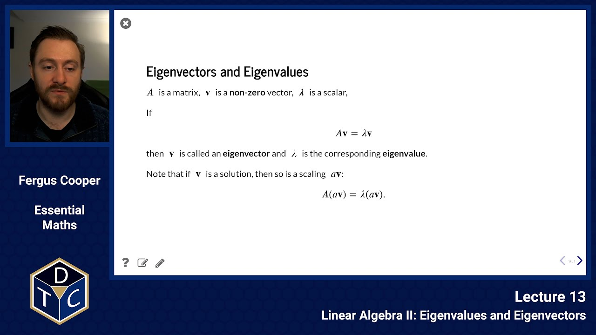

## Eigenvalues and Eigenvectors

---

## YouTube lecture recording from October 2020

The following YouTube video was recorded for the 2020 iteration of the course.
The material is still very similar:

[](https://youtu.be/D_aYtsfmBYo)

---

## Using Python to calculate the inverse

To find $A^{-1}$ for

$$
A = \begin{pmatrix}3&0&2\\ 3&0&-3\\ 0&1&1\end{pmatrix}
$$

### NumPy

```python
import numpy as np
A = np.array([[3, 0, 2], [3, 0, -3], [0, 1, 1]])
np.linalg.inv(A)
```

> ```text
> array([[ 0.2       ,  0.13333333,  0.        ],
>        [-0.2       ,  0.2       ,  1.        ],
>        [ 0.2       , -0.2       , -0.        ]])
> ```

### SymPy

```python
import sympy as sp
A = sp.Matrix([[3, 0, 2], [3, 0, -3], [0, 1, 1]])
A.inv()
```

> $\displaystyle \left[\begin{matrix}\frac{1}{5} & \frac{2}{15} & 0\\- \frac{1}{5} & \frac{1}{5} & 1\\\frac{1}{5} & - \frac{1}{5} & 0\end{matrix}\right]$

## It doesn't always work

Consider the following system

$$
\begin{array}{cccccccc}
eq1: &  x & + & y & + & z & =  & a \\
eq2: & 2x & + & 5y & + &  2z &  = & b \\
eq3: & 7x & +&  10y  & + & 7z &  = &  c
\end{array}
$$

```python nolint
A = np.array([[1, 1, 1], [2, 5, 2], [7, 10, 7]])
np.linalg.inv(A)

```

> ```text
> ---------------------------------------------------------------------------
>
> LinAlgError                               Traceback (most recent call last)
>
> Cell In[5], line 2
>       1 A = np.array([[1, 1, 1], [2, 5, 2], [7, 10, 7]])
> ----> 2 np.linalg.inv(A)
>
>
> File ~/GitRepos/gutenberg-material/DtcMathsStats2018/venv2/lib/python3.10/site-packages/numpy/linalg/linalg.py:561, in inv(a)
>     559 signature = 'D->D' if isComplexType(t) else 'd->d'
>     560 extobj = get_linalg_error_extobj(_raise_linalgerror_singular)
> --> 561 ainv = _umath_linalg.inv(a, signature=signature, extobj=extobj)
>     562 return wrap(ainv.astype(result_t, copy=False))
>
>
> File ~/GitRepos/gutenberg-material/DtcMathsStats2018/venv2/lib/python3.10/site-packages/numpy/linalg/linalg.py:112, in _raise_linalgerror_singular(err, flag)
>     111 def _raise_linalgerror_singular(err, flag):
> --> 112     raise LinAlgError("Singular matrix")
>
>
> LinAlgError: Singular matrix
> ```

## Singular matrices

The **rank** of an $\;n\,\times\,n\;$ matrix $\;A\;$ is the number of linearly independent rows in $\;A\;$ (rows not combinations of other rows).

When $\;\text{rank}(A) < n\;$ then

- The system $\;A\textbf{x} = \textbf{b}\;$ has _fewer_ equations than unknowns
- The matrix is said to be singular
- $A\;$ has no inverse
- The determinant of $\;A\;$ is 0
- The equation $\;A\textbf{u} = \textbf{0}\;$ has non-trivial solutions (solutions where $\textbf{u} \neq \textbf{0}$)

## Singular matrix example

An under-determined system (fewer equations than unknowns) may mean that there are **many solutions** or that there are **no solutions**.

An example with many solutions is

$$
\begin{align*}
x+y &=& 1,\\
2x+2y &=& 2,
\end{align*}
$$

has infinitely many solutions (x=0, y=1; x=-89.3, y=90.3...)

An example with no solutions is

$$
\begin{align*}
x+y &=& 1,\\
2x+2y &=& 0,
\end{align*}
$$

where the second equation is inconsistent with the first.

These examples use the matrix

> $$\begin{pmatrix}1&1\\ 2&2\end{pmatrix},$$

which has rank 1.

## Null space

When a matrix is singular we can find non-trivial solutions to $\;A\textbf{u} = \textbf{0}$.

These are vectors which form the **null space** for $\;A$.

Any vector in the null space makes no difference to the effect that $A$ is having:

> $$\displaystyle  A(\textbf{x} + \textbf{u}) =  A\textbf{x} + A\textbf{u} = A\textbf{x} + \textbf{0} =   A\textbf{x}.$$

Note that any combination or scaling of vectors in the null space is also in the null space.

That is, if $\;A\textbf{u} = \textbf{0}\;$ and $\;A\textbf{v} = \textbf{0}\;$ then

> $$\displaystyle A(\alpha\textbf{u} + \beta\textbf{v}) = \textbf{0}$$

The number of linearly independent vectors in the null space is denoted $~\text{null}(A)~$ and

> $$\text{null}(A)  + \text{rank}(A) = \text{order}(A).$$

## Null space example

Previous example of a singular system:

$$\displaystyle A = \left(\begin{matrix} 1& 1& 1\\ 2& 5& 2\\ 7& 10&7 \end{matrix}\right)$$

```python
A = np.array([[1, 1, 1], [2, 5, 2], [7, 10, 7]])
np.linalg.matrix_rank(A)
```

> ```text
> 2
> ```

```python
import scipy.linalg
scipy.linalg.null_space(A)
```

> ```text
> array([[-7.07106781e-01],
>        [-1.11022302e-16],
>        [ 7.07106781e-01]])
> ```

remember, scaled vectors in the null space are also in the null space, for example, $\;x=1, y=0, z=-1\;$ is in the null space.

Try it:

> $$\left(\begin{matrix} 1& 1& 1\\ 2& 5& 2\\ 7& 11&7 \end{matrix}\right) \left(\begin{matrix} -1000\\ 0 \\ 1000 \end{matrix}\right) = \quad ?$$

```python
np.matmul(A,np.array([-1000,0,1000]))
```

> ```text
> array([0, 0, 0])
> ```

## Eigenvectors: motivation

The **eigenvalues** and **eigenvectors** give an indication of how much effect the matrix has, and in what direction.

> $$\displaystyle A=\left(\begin{matrix} \cos(45)&-\sin(45)\\ \sin(45)&\cos(45)\\\end{matrix}\right)\qquad\text{has no scaling effect.}$$ > $$\displaystyle B=\left(\begin{matrix} 2& 0 \\ 0&\frac{1}{2}\\\end{matrix}\right)\qquad\qquad\text{doubles in }x\text{, but halves in }y\text{.}$$

Repeated applications of $\;A\;$ stay the same distance from the origin, but repeated applications of $\;B\;$ move towards $\;(\infty, 0).$

- Transitions with probability
- Markov chains
- Designing bridges
- Solution of systems of linear ODEs
- Stability of systems of nonlinear ODEs

## Eigenvectors and Eigenvalues

$A\;$ is a matrix, $\;\textbf{v}\;$ is a **non-zero** vector, $\;\lambda\;$ is a scalar,

If:

> $$\displaystyle A \textbf{v} = \lambda \textbf{v}$$

then $\;\textbf{v}\;$ is called an **eigenvector** and $\;\lambda\;$ is the corresponding **eigenvalue**.

Note that if $\;\textbf{v}\;$ is a solution, then so is a scaling $\;a\textbf{v}$:

> $$\displaystyle A (a \textbf{v}) = \lambda (a \textbf{v}).$$

## Finding Eigenvalues

Another way to write previous equation:

$$
\begin{align*}
A \textbf{v} &=& \lambda \textbf{v},\\
A \textbf{v} -  \lambda I \textbf{v}&=& \textbf{0},\\
(A  -  \lambda I) \textbf{v}&=& \textbf{0}.
\end{align*}
$$

Consider the equation:

> $$\displaystyle B\textbf{x}=\textbf{0}$$

where $\;B\;$ is a matrix and $\;\textbf{x}\;$ is a non-zero column vector.

Assume $\;B\;$ is nonsingular:

> $$\displaystyle B^{-1}(B\textbf{x})=B^{-1}\textbf{0}=\textbf{0}$$

But:

> $$\displaystyle B^{-1}(B\textbf{x})=(B^{-1}B)\textbf{x}=I\textbf{x}=\textbf{x}$$

This means that:

> $$\displaystyle B^{-1}(B\textbf{x})=\textbf{0}=\textbf{x}$$

but we stated above that $\;\textbf{x}\neq\textbf{0}\;$ so our assumption that $\;B\;$ is nonsingular must be false: $\;B\;$ is singular.

We can state that:

> $$\displaystyle (A-\lambda I)\textbf{v} = \textbf{0}  \quad \text{with} \quad \textbf{v}\neq \textbf{0},$$

so $\displaystyle (A-\lambda I)$ must be singular:

> $$\displaystyle |A-\lambda I|=0.$$

## Example

What are the eigenvalues for this matrix?

> $$\displaystyle A=\left(\begin{matrix}-2&-2\\ 1&-5\\\end{matrix}\right)$$ > $$\displaystyle |A-\lambda I|=\left\vert\begin{matrix}-2-\lambda&-2\\ 1&-5-\lambda\end{matrix}\right\vert=(-2-\lambda)(-5-\lambda)-(-2)$$ > $$\displaystyle =10+5\lambda+\lambda^2+2\lambda+2=\lambda^2+7\lambda+12=(\lambda+3)(\lambda+4)=0$$

So the eigenvalues are $\lambda_1=-3$ and $\lambda_2=-4$.

## Eigenvalues using Python

Numpy:

```python
A = np.array([[-2, -2], [1, -5]])
np.linalg.eig(A)[0]
```

> ```text
> array([-3., -4.])
> ```

SymPy:

```python
A2 = sp.Matrix([[-2, -2], [1, -5]])
A2.eigenvals()
```

> $\displaystyle \left\{ -4 : 1, \  -3 : 1\right\}$

## Finding Eigenvectors

For an eigenvalue, the corresponding vector comes from substitution into $\;A \textbf{v} = \lambda \textbf{v}$:

### Example

What are the eigenvectors for

> $$\displaystyle A=\left(\begin{matrix}-2&-2\\ 1&-5\\\end{matrix}\right)?$$

The eigenvalues are $\;\lambda_1=-3\;$ and $\;\lambda_2=-4.\;$
The eigenvectors are $\;\textbf{v}_1\;$ and $\;\textbf{v}_2\;$ where:

> $$\displaystyle A\textbf{v}_1=\lambda_1 \textbf{v}_1.$$ > $$\displaystyle \left(\begin{matrix}-2&-2\\ 1&-5\\\end{matrix}\right) \left(\begin{matrix}u_1\\ v_1\\\end{matrix}\right) = \left(\begin{matrix}-3u_1\\ -3v_1\\\end{matrix}\right)$$ > $$\displaystyle u_1 = 2v_1.  \text{  (from the top or bottom equation)}$$
> $$\displaystyle \left(\begin{matrix}u_1\\ v_1\\\end{matrix}\right) = \left(\begin{matrix}2 \\ 1\\\end{matrix}\right), \left(\begin{matrix}1 \\ 0.5\\\end{matrix}\right), \left(\begin{matrix}-4.4 \\ -2.2\\\end{matrix}\right), \left(\begin{matrix}2\alpha \\ \alpha\\\end{matrix}\right)\ldots $$

## Eigenvectors in Python

Numpy:

```python
A = np.array([[-2, -2], [1, -5]])
np.linalg.eig(A)[1]
```

> ```text
> array([[0.89442719, 0.70710678],
>        [0.4472136 , 0.70710678]])
> ```

SymPy:

```python
c = sp.symbols('c')
A2 = sp.Matrix([[-2, c], [1, -5]])
A2.eigenvects()
```

> $\displaystyle \left[ \left( - \frac{\sqrt{4 c + 9}}{2} - \frac{7}{2}, \  1, \  \left[ \left[\begin{matrix}\frac{3}{2} - \frac{\sqrt{4 c + 9}}{2}\\1\end{matrix}\right]\right]\right), \  \left( \frac{\sqrt{4 c + 9}}{2} - \frac{7}{2}, \  1, \  \left[ \left[\begin{matrix}\frac{\sqrt{4 c + 9}}{2} + \frac{3}{2}\\1\end{matrix}\right]\right]\right)\right]$

## Diagonalising matrices

Any nonsingular matrix $A$ can be rewritten as a product of eigenvectors and eigenvalues.

If $\;A\;$ has eigenvalues $\;\lambda_1\;$ and $\;\lambda_2\;$ with corresponding eigenvectors $\;\left(\begin{matrix}u_1\\ v_1\\\end{matrix}\right)\;$ and

> $\displaystyle \left(\begin{matrix}u_2\\ v_2\\\end{matrix}\right)$

then

$$
\begin{align*}
A =
\left(\begin{matrix}u_1 & u_2\\v_1 & v_2\\\end{matrix}\right)
\left(\begin{matrix}\lambda_1 & 0\\0 & \lambda_2\\\end{matrix}\right)
\left(\begin{matrix}u_1 & u_2\\v_1 & v_2\\\end{matrix}\right)^{-1}.
\end{align*}
$$

This is like a scaling surrounded by rotations and separates how much effect the matrix has $\;(\lambda_i)\;$ from the directions $\;(\textbf{v}_i).$

## For example

> $$\displaystyle A=\left(\begin{matrix}-2&-2\\ 1&-5\\\end{matrix}\right)$$

```python
A = np.array([[-2, -2], [1, -5]])
w, v = np.linalg.eig(A)
inv_v = np.linalg.inv(v)

np.matmul( np.matmul(v, np.diag(w)) , inv_v )
```

> ```text
> array([[-2., -2.],
>        [ 1., -5.]])
> ```

## Orthogonal eigenvectors

If $\;\textbf{x}_1\;$ and $\;\textbf{x}_2\;$ are perpendicular or **orthogonal** vectors, then the scalar/dot product is zero.

> $$\displaystyle \textbf{x}_1.\textbf{x}_2=0$$

e.g.

> $$\displaystyle \textbf{x}_1.\textbf{x}_2=\left(\begin{matrix}2\\ -1\\ 3\end{matrix}\right).\left(\begin{matrix}2\\ 7\\ 1\end{matrix}\right)=2\times 2+(-1\times 7)+(3\times1)=4-7+3=0.$$

Since this dot product is zero, the vectors $\textbf{x}_1$ and $\textbf{x}_2$ are orthogonal.

## Symmetric matricies

Symmetric matricies have orthogonal eigenvectors, e.g.

> $$\displaystyle A=\left(\begin{matrix}19&20&-16\\ 20&13&4 \\ -16&4&31\\\end{matrix}\right)$$

```python
A = np.array([[19, 20, -16], [20, 13, 4], [-16, 4, 31]])
w, v = np.linalg.eig(A)
print(v)
print('\ndot products of eigenvectors:\n')
print(np.dot(v[:,0],v[:,1]))
print(np.dot(v[:,0],v[:,2]))
print(np.dot(v[:,1],v[:,2]))
```

> ```text
> [[ 0.66666667 -0.66666667  0.33333333]
>  [-0.66666667 -0.33333333  0.66666667]
>  [ 0.33333333  0.66666667  0.66666667]]
>
> dot products of eigenvectors:
>
> -1.942890293094024e-16
> 1.3877787807814457e-16
> 1.1102230246251565e-16
> ```

## Normalised eigenvectors

If

> $$\displaystyle \left(\begin{matrix}x\\ y\\ z\\\end{matrix}\right),$$

is an eigenvector, then

> $$\displaystyle \left(\begin{matrix}\frac{x}{\sqrt{x^2+y^2+z^2}}\\ \frac{y}{\sqrt{x^2+y^2+z^2} }\\ \frac{z}{\sqrt{x^2+y^2+z^2} }\end{matrix}\right)$$

is the corresponding normalised vector: a vector of unit length (magnitude).

## Orthogonal matrices

A matrix is orthogonal if its columns are normalised orthogonal vectors.
One can prove that if $\;M\;$ is orthogonal then:

> $$\displaystyle M^TM=I\qquad M^T=M^{-1}$$

Note that if the eigenvectors are written in orthogonal form then the diagonalising equation
is simplified:

$$
\begin{align*}
A
&=
\left(\begin{matrix}u_1 & u_2\\v_1 & v_2\\\end{matrix}\right)
\left(\begin{matrix}\lambda_1 & 0\\0 & \lambda_2\\\end{matrix}\right)
\left(\begin{matrix}u_1 & u_2\\v_1 & v_2\\\end{matrix}\right)^{-1}
\\
&=
\left(\begin{matrix}u_1 & u_2\\v_1 & v_2\\\end{matrix}\right)
\left(\begin{matrix}\lambda_1 & 0\\0 & \lambda_2\\\end{matrix}\right)
\left(\begin{matrix}u_1 & v_1\\u_2 & v_2\\\end{matrix}\right).
\end{align*}
$$

## Summary

- Matrix representation of simultaneous equations
- Matrix-vector and matrix-matrix multiplication
- Determinant, inverse and transpose
- Null space of singular matrices
- Finding eigenvalues and eigenvectors
- Python for solving systems, finding inverse, null space and eigenvalues/vectors
- Diagonalising matrices (we will use this for systems of differential equations)

### Introductory problems

::::challenge{id="13_intro_01" title="Introductory problems 1"}
Given

> $$\displaystyle A = \left(\begin{array}{cc}  1 & 0 \\ 0 & i \end{array}\right);$$ > $$\displaystyle B = \left(\begin{array}{cc}  0 & i \\ i & 0 \end{array}\right);$$ > $$\displaystyle C = \left(\begin{array}{cc}  \frac{1}{\sqrt{2}} & \frac{1}{2}\left(1-i\right) \\\frac{1}{2}\left(1+i\right) & -\frac{1}{\sqrt{2}} \end{array}\right);$$

verify by hand, and using the `numpy.linalg` module, that

1. $AA^{-1}=A^{-1}A =I$;
1. $BB^{-1}=B^{-1}B =I$;
1. $CC^{-1}=C^{-1}C =I$;

```python
# hint
import numpy as np

# In Python the imaginary unit is "1j"
A = np.array([[1, 0], [0, 1j]])

print(A * np.linalg.inv(A))
```

::::

::::challenge{id="13_intro_02" title="Introductory problems 2"}
Let A be an $n \times n$ invertible matrix. Let $I$ be the $n\times n$ identity matrix and let $B$ be an $n\times n$ matrix.

Suppose that $ABA^{-1}=I$.
Determine the matrix $B$ in terms of the matrix $A$.
::::

### Main problems

::::challenge{id="13_main_01" title="Main problems 1"}
Let $A$ be the coefficient matrix of the system of linear equations

$$
\begin{aligned}
-x_1 - 2 x_2 &= 1,\\
2 x_1 + 3 x_2 &= -1.
\end{aligned}
$$

1. Solve the system by finding the inverse matrix $A^{-1}$.
1. Let $\displaystyle \mathbf{x} = \left(\begin{array}{cc}  x_1 \\ x_2 \end{array}\right)$ be the solution of the system obtained in part 1.

Calculate and simplify $A^{2017} \mathbf{x}$.
::::

::::challenge{id="13_main_02" title="Main problems 2"}
For each of the following matrices

> $$\displaystyle A = \left(\begin{array}{cc}  2 & 3 \\ 1 & 4 \end{array}\right);$$ > $$\displaystyle B = \left(\begin{array}{cc}  4 & 2 \\ 6 & 8 \end{array}\right);$$ > $$\displaystyle C = \left(\begin{array}{cc}  1 & 4 \\ 1 & 1 \end{array}\right);$$ > $$\displaystyle D = \left(\begin{array}{cc}  x & 0 \\ 0 & y \end{array}\right),$$

compute the determinant, eigenvalues and eigenvectors by hand.

Check your results by verifying that $Q\mathbf{x} = \lambda_i \mathbf{x}$, where $Q=A$, $B$, $C$ or $D$, and by using the `numpy.linalg` module.

```python
# hint
import numpy as np

A = np.array([[2, 3], [1, 4]])

e_vals, e_vecs = np.linalg.eig(A)

print(e_vals)
print(e_vecs)
```

::::

::::challenge{id="13_main_03" title="Main problems 3"}
Orthogonal vectors.

Two vectors ${\bf x_1}$ and ${\bf x_2}$ are said to be perpendicular or _orthogonal_ if their dot/scalar product is zero:

> $$\mathbf{x_1}.\mathbf{x_2}=\left(\begin{array}{c} 2  \\ -1 \\ 3 \\ \end{array} \right).\left(\begin{array}{c} 2 \\ 7 \\ 1 \\ \end{array} \right)=(2{\times}2)+(-1{\times}7)+(3{\times}1)=4-7+3=0,$$

thus $\mathbf{x_1}$ and $\mathbf{x_2}$ are orthogonal.

Find vectors that are orthogonal to $\displaystyle \left({\begin{array}{c} 1 \\ 2 \\ \end{array} } \right) \text{and} \left({\begin{array}{c} 1  \\ 2 \\ -1 \\ \end{array} } \right).$

How many such vectors are there?
::::

::::challenge{id="13_main_04" title="Main problems 4"}
Diagonalize the $2 \times 2$ matrix $\displaystyle A=\left(\begin{array}{cc} 2 & -1  \\ -1 & 2 \\ \end{array} \right)$ by finding a non-singular matrix $S$ and a diagonal matrix $D$ such that $\displaystyle A = SDS^{-1}$.
::::

::::challenge{id="13_main_05" title="Main problems 5"}
Find a $2{\times}2$ matrix $A$ such that $\displaystyle \quad A\left(\begin{array}{c} 2  \\ 1 \end{array} \right) = \left(\begin{array}{c} -1  \\ 4 \end{array} \right)\quad\text{and}\quad A \left(\begin{array}{c} 5  \\ 3\end{array} \right)=\left(\begin{array}{c} 0  \\ 2\end{array} \right)$.
::::

### Extension problems

::::challenge{id="13_ext_01" title="Extension problems 1"}
If there exists a matrix $M$ whose columns are those of normalised (unit length) and orthogonal vectors, prove that $M^TM=I$ which implies that $M^T=M^{-1}$.
::::
