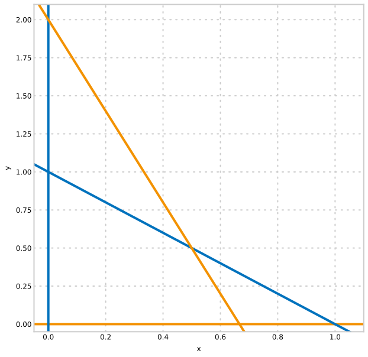
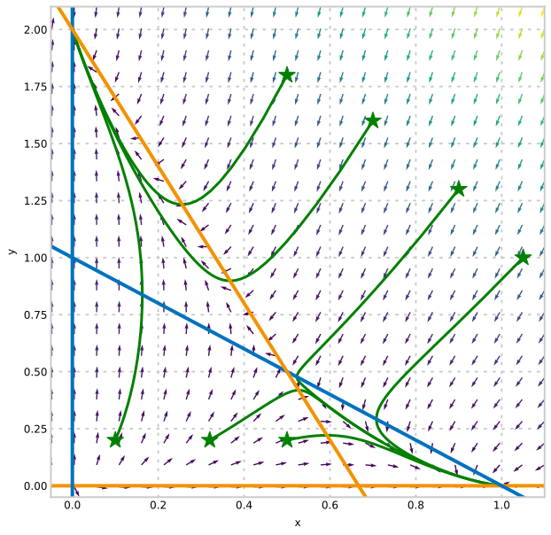

## System Simplification

---

## YouTube lecture recording from October 2020

The following YouTube video was recorded for the 2020 iteration of the course.
The material is still very similar:

[](https://youtu.be/Mi5gTeTYM30)

---

Recap

- So far we have looked at systems of **first order**, **linear** ODEs in **two dimensions**

- These systems can be solved analytically
  - 3 methods of solving systems of first order ODEs
  - Diagonalisation extends to $N$-dimensional systems

Plan

- Aim to look at systems of **first order**, **nonlinear** ODEs in **more dimensions**
- How we go about modelling a problem
- Simplifying systems of ODEs

  - Reducing number of parameters
  - Reducing number of equations

- Phase plane analysis

## System simplification: rescaling

This predator-prey model is in dimensional terms and contains 5 parameters.

$$
\begin{align*}
\frac{{\rm d}N}{{\rm d}T} &= rN\left(1-\frac{N}{K}\right) - bNP,\\
\frac{{\rm d}P}{{\rm d}T} &= ebNP - mP.
\end{align*}
$$

- $r$: prey intrinsic growth rate
- $K$: prey carrying capacity (bound to logistic growth)
- $b$: predation rate
- $e$: conversion efficiency
- $m$: per capita predator mortality rate

If we substitute

- $N=\theta{n}$
- $P=\phi{p}$
- $T=\tau{t}$

where $n,p,t$ are nondimensional, and $\theta$, $\phi$ and $\tau$ is a typical values for $N$, $P$ and $T$.

Note that, when we are re-scaling time:

> $\displaystyle \frac{{\rm d}}{{\rm d}T} = \frac{{\rm d}}{{\rm d}t}\frac{{\rm d}t}{{\rm d}T} = \frac{1}{\tau}  \frac{{\rm d}}{{\rm d}t}.$

The original equations are:

$$
\begin{align*}
\frac{{\rm dN}}{{\rm dT}} &= rN\left(1-\frac{N}{K}\right) - bNP,\\
\frac{{\rm dP}}{{\rm dT}} &= ebNP - mP.
\end{align*}
$$

And, after rescaling, we have:

$$
\begin{align*}
\frac{\theta}{\tau}\frac{{\rm d}n}{{\rm d}t} &= {\theta}rn\left(1-\frac{{\theta}n}{K}\right) - bnp{\theta}{\phi},\\
\frac{\phi}{\tau}\frac{{\rm d}p}{{\rm d}t} &= ebnp{\theta}{\phi} - mp{\phi}.
\end{align*}
$$

Note that $\theta$, $\phi$ and $\tau$ are arbitrary values for scaling $N$, $P$, and $T$.

$$
\begin{align*}
\frac{{\rm d}n}{{\rm d}t} &= \tau\left( rn\left(1-\frac{{\theta}n}{K}\right) - bnp{\phi}\right),\\
\frac{{\rm d}p}{{\rm d}t} &= \tau\left( ebnp{\theta} - mp\right).
\end{align*}
$$

After rearranging we note that choosing $\theta=K$ will remove the parameter $K$ from the equations.

Choosing $\tau = 1/m$ (or $\tau =1/r$) will remove a further parameter.

$$
\begin{align*}
\dot{n} &= \left( \frac{r}{m}n(1-n) - \frac{b{\phi}}{m}np\right),\\
\dot{p} &= \left( \frac{ebpK}{m}n - p\right).
\end{align*}
$$

$\phi=m/b$ gives the two parameter system:

$$
\begin{align*}
\dot{n} &= \left( \frac{r}{m}n(1-n) - np\right),\\
\dot{p} &= \left( \frac{ebpK}{m}n - p\right),
\end{align*}
$$

where we have shifted the groups of parameters to only two places.

We could make it more obvious that there are only two "tuning dials" by writing it as:

$$
\begin{align*}
\dot{n} &=  v_1 n(1-n) - np,\\
\dot{p} &=  p(v_2 n - 1),
\end{align*}
$$

## System simplification: conservation

Consider a chemical system where a product is formed from a substrate via an intermediate complex involving an enzyme.

> $$\displaystyle S + E \overset{k_1}{\underset{k_{-1}}\rightleftharpoons} C \overset{k_2}\rightarrow P + E $$

This system can be written as a system of 4 ODEs for $s, e, c, p$ which describe the concentrations of $S, E, C$ and $P$:

$$
\begin{align*}
\dot{s} &= -k_1 se + k_{-1}c, \\
\dot{e} &= -k_1 se + k_{-1}c + k_{2}c,\\
\dot{c} &= k_1 se - k_{-1}c - k_{2}c, \\
\dot{p} &= k_{2}c.
\end{align*}
$$

However, the enzyme is recycled: it is used in the complex and then released. This means that $e + c = e_{tot}$ where $e_{tot}$ is constant.

Making the substitution $e =  e_{tot} - c$ to eliminate $e$ we arrive at the 3 ODE system:

$$
\begin{align*}
\dot{s} &= -k_1 s(e_{tot} - c) + k_{-1}c, \\
\dot{c} &= k_1 s(e_{tot} - c) - k_{-1}c - k_{2}c,\\
\dot{p} &= k_{2}c.
\end{align*}
$$

## System simplification: quasi-steady state

In the previous example it may be known that the rate of conversion to complex (from $k_1$ and $k_{-1}$) is much faster than the degradation of complex into product (rate $k_2$).

If this is the case then we can assume that the concentration of $C$ arrives at some level $c^*$ (a quasi-steady state) and then moves very slowly.

Solving for $\dot{c}=0$:

$$
\begin{align*}
\dot{c} &= k_1 s(e_{tot} - c) - k_{-1}c - k_{2}c = 0, \\
\implies
c^*&=\frac{k_1  e_{tot} s}{k_{-1} + k_2   + k_1 s},
\end{align*}
$$

which is **not a steady-state**: it moves slowly with $s$.

Substituting this quasi-steady state into the remaining equations gives an **approximate** system of 2 ODEs:

$$
\begin{align*}
\dot{s} &= -\frac{k_1 k_2 e_{tot} s}{ k_{-1} + k_2 + k_1 s}, \\
\dot{p} &= \frac{k_1 k_2 e_{tot} s}{ k_{-1} + k_2 + k_1 s}.
\end{align*}
$$

This means that we have used conservation and quasi-steady state to go from a 4-dimensional system $(s,e,c,p)$ to a two-dimensional approximation which captures some of the behaviour.

Two dimensions are good because we can plot their behaviour on a phase plane diagram.

## Phase planes and nullclines

A system of **nonlinear** ODEs may have more than one fixed point (or may have none).
Finding fixed points in two-dimensional systems is aided by **nullclines**.

An $x$-nullcline is a line where $\dot{x}=0$ and a $y$-nullcline is a line where $\dot{y}=0$.
(These are straight lines in the linear case.)

For example:

$$
\begin{align*}
\dot{x} &= x(1-x) -xy,\\
\dot{y} &= 2y\left(1-\frac{y}{2}\right) - 3xy,
\end{align*}
$$

has $x$-nullclines at $x=0$ and $1-x-y=0$; and $y$-nullclines at $y=0$ and $2-3x-y=0$.

Nullcline intersections give us the fixed points.
Nullclines can be annotated to give the direction (and magnitude) of the non-zero derivative.

### Plot of the nullclines



### Plot of the phase plane



The nullclines allow us to add arrows demonstrating the flow direction, and by following the arrows we can sketch the behaviour of solutions (green lines).
The arrows can only cross the $x$-nullclines vertically, and the $y$-nullclines horizontally.

### Python code to plot the phase plane

```python
import numpy as np
from matplotlib import pyplot as plt
import scipy
def dX_dt(X, t):
    return np.array([ X[0]*(1. - X[0]) - X[0]*X[1],
                     2.*X[1]*(1.-X[1]/2.) -3*X[0]*X[1]])

def plot_phase_plane():

    plt.figure(figsize=(10,10))

    init_x = [1.05, 0.9, 0.7, 0.5, 0.5, 0.32, 0.1]
    init_y = [1.0, 1.3, 1.6, 1.8, 0.2, 0.2, 0.2]

    plt.plot(init_x, init_y, 'g*', markersize=20)

    for v in zip(init_x,init_y):
        X0 = v                              # starting point
        X = scipy.integrate.odeint( dX_dt, X0, np.linspace(0,10,100))
        plt.plot( X[:,0], X[:,1], lw=3, color='green')


    # plot nullclines
    x = np.linspace(-0.1,1.1,24)
    y = np.linspace(-0.1,2.1,24)

    plt.hlines(0,-1,15, color='#F39200', lw=4, label='y-nullcline 1')
    plt.plot(x,1 - x, color='#0072bd', lw=4, label='x-nullcline 2')
    plt.vlines(0,-1,15, color='#0072bd', lw=4, label='x-nullcline 1')
    plt.plot(x,2 - 3*x, color='#F39200', lw=4, label='y-nullcline 2')

    # quiverplot - define a grid and compute direction at each point
    X, Y = np.meshgrid(x, y)                  # create a grid
    DX = X*(1-X) - X*Y                          # evaluate dx/dt
    DY = 2*Y*(1 - Y/2.0) - 3*X*Y                # evaluate dy/dt
    M = (np.hypot(DX, DY))                      # norm growth rate
    M[ M == 0] = 1.                             # avoid zero division errors

    plt.quiver(X, Y, DX/M, DY/M, M)
    plt.xlim(-0.05,1.1)
    plt.ylim(-0.05,2.1)
    plt.xlabel('x')
    plt.ylabel('y')
```

## Summary

- Simplification

  - Rescaling to dimensionless quantities
  - Conservation
  - Quasi-steady state approximation

- Nullclines are a powerful way of finding steady states and phase flow

### Introductory problems

::::challenge{id="15_intro_01" title="Introductory problems 1"}
Find the fixed points of the following linear systems:

1. $\displaystyle \dot{x} = x+3y,   \qquad \dot{y}=-6x+5y;$
1. $\displaystyle \dot{x} = x+3y+4, \qquad \dot{y}=-6x+5y-1;$
1. $\displaystyle \dot{x} = x+3y+1, \qquad \dot{y}=-6x+5y.$

::::

::::challenge{id="15_intro_02" title="Introductory problems 2"}
Find the fixed points of the following nonlinear systems:

1. $\displaystyle \dot{x} = -4y+2xy-8   \qquad \dot{y}=4y^2-x^2;$
1. $\displaystyle \dot{x} = y-x^2+2, \qquad \dot{y}=2(x^2-y^2).$

::::

### Main problems

::::challenge{id="15_main_01" title="Main problems 1"}
Consider the chemical reaction network:

> $$\displaystyle \overset{k_0}\longrightarrow A \overset{k_1}{\underset{k_{-1}}\rightleftharpoons} B \overset{k_2}\longrightarrow $$

1. Write down the system of two linear ODEs which describe the evolution of the concentrations of A and B in this system under the law of mass action.
1. Find the ratio of concentrations of A and B for which this system is in steady state: that is the concentrations do not change over time.

::::

::::challenge{id="15_main_02" title="Main problems 2"}
Consider the reversible enzyme reaction:

> $$\displaystyle S + E \overset{k_1}{\underset{k_{-1}}\rightleftharpoons} C \overset{k_2}{\underset{k_{-2}}\rightleftharpoons} P + E$$

Verify the Haldane relation, which states that when the reaction is in equilibrium,

> $$\displaystyle \frac{p}{s} = \frac{k_1 k_2}{k_{-1}k_{-2}}, $$

where $p$ and $s$ are the concentrations of $P$ and $S$, respectively.
::::

::::challenge{id="15_main_03" title="Main problems 3"}
The population of a host, $H(t)$, and a parasite, $P(t)$, are described approximately by the equations:

> $$\displaystyle \def\dd#1#2{{\frac{{\rm d}#1}{{\rm d}#2}}} \dd{H}{T}=(a-bP)H,\qquad \dd{P}{T}=(c-\frac{dP}{H})P, \qquad H>0,$$

where $a,b,c,d$ are positive constants.

By a suitable change of scales show that these equations may be put in the simpler form

> $$\displaystyle \dot{y} = (1-x)y, \qquad \dot{x}=\alpha x(1-\frac{x}{y}),$$

where $\displaystyle \alpha=\frac{c}{a}$.

Sketch the phase flow across the following lines:

1. $\displaystyle y=x$;
1. $\displaystyle x=0$;
1. $\displaystyle y=0$;
1. $\displaystyle x=1$;
1. $\displaystyle y=\beta x$, for $\beta$ greater than and less than 1.

::::

::::challenge{id="15_main_04" title="Main problems 4"}
Consider a lake with some fish attractive to anglers.
We wish to model the fish-angler interaction under the following assumptions:

- the fish population grows logistically in the absence of fishing;
- the presence of anglers depresses the fish growth rate at a rate jointly proportional to the size of the fish and angler populations;
- anglers are attracted to the lake at a rate directly proportional to the number of fish in the lake;
- anglers are discouraged from the lake at a rate directly proportional to the number of anglers already there.

1. Write down a mathematical model for this situation, clearly defining your terms.
1. Use a suitable scaling to show that a non-dimensionalised version of the model is
   > $$ \dot{x} = rx(1 - x) - xy,\qquad \dot{y} = \beta x - y $$

::::
